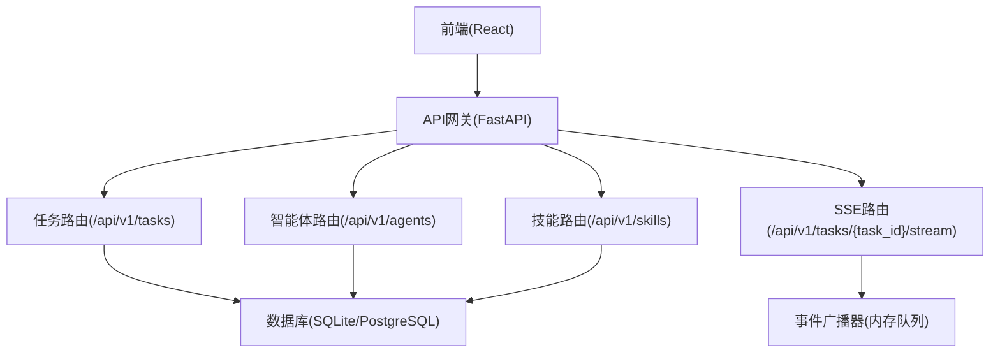
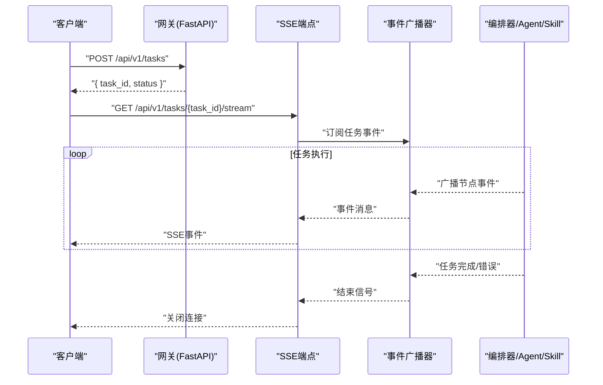
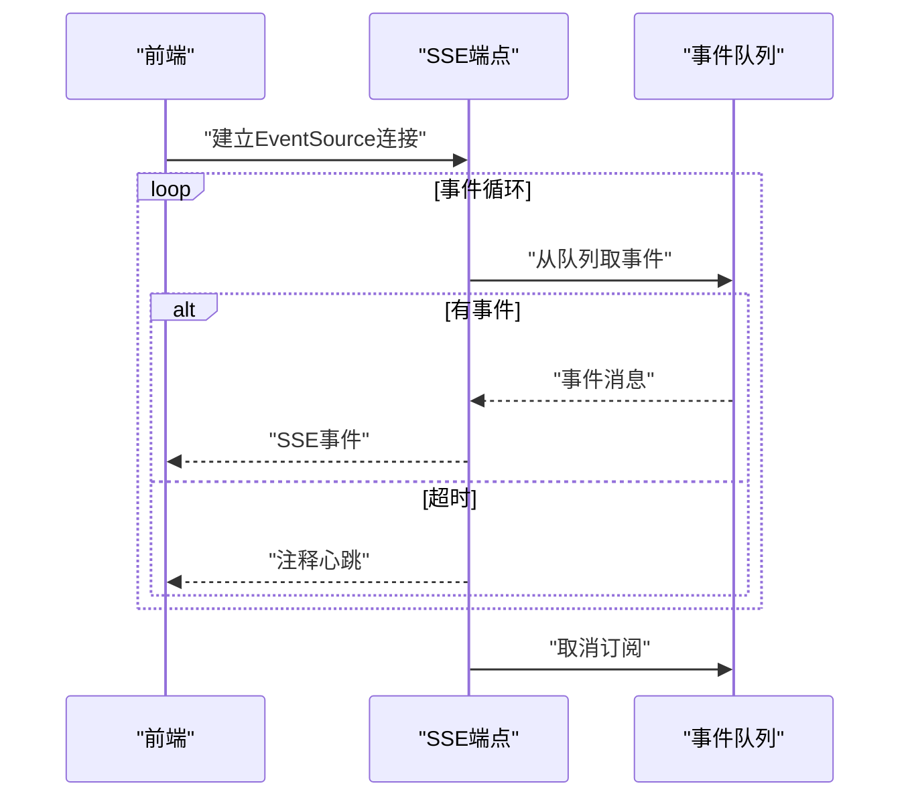
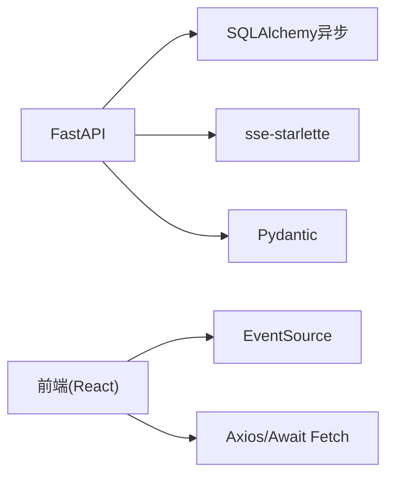
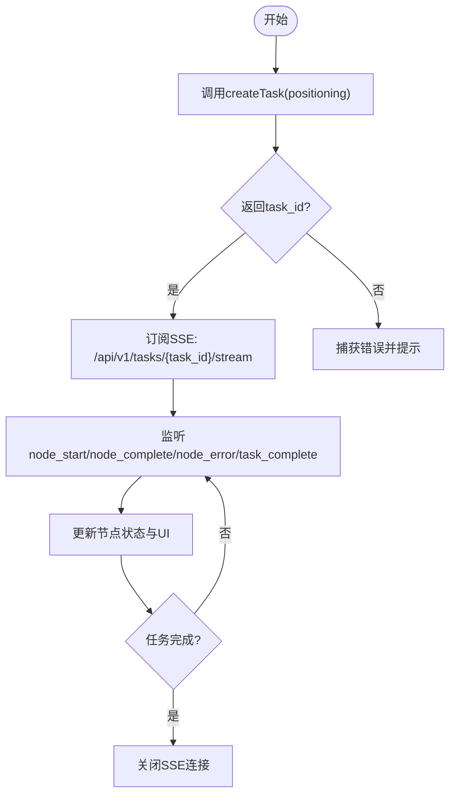

# API参考文档

<cite>
**本文引用的文件**
- [backend/app/main.py](file://backend/app/main.py)
- [backend/app/api/task_routes.py](file://backend/app/api/task_routes.py)
- [backend/app/api/stream_routes.py](file://backend/app/api/stream_routes.py)
- [backend/app/api/agent_routes.py](file://backend/app/api/agent_routes.py)
- [backend/app/api/skill_routes.py](file://backend/app/api/skill_routes.py)
- [backend/app/models/tables.py](file://backend/app/models/tables.py)
- [backend/app/schemas/common.py](file://backend/app/schemas/common.py)
- [backend/app/core/exceptions.py](file://backend/app/core/exceptions.py)
- [backend/app/core/config.py](file://backend/app/core/config.py)
- [backend/pyproject.toml](file://backend/pyproject.toml)
- [frontend/lib/api.ts](file://frontend/lib/api.ts)
- [frontend/hooks/useTaskSSE.ts](file://frontend/hooks/useTaskSSE.ts)
- [frontend/types/index.ts](file://frontend/types/index.ts)
- [ARCHITECTURE.md](file://ARCHITECTURE.md)
</cite>

## 目录
1. [简介](#简介)
2. [项目结构](#项目结构)
3. [核心组件](#核心组件)
4. [架构总览](#架构总览)
5. [详细组件分析](#详细组件分析)
6. [依赖分析](#依赖分析)
7. [性能考虑](#性能考虑)
8. [故障排除指南](#故障排除指南)
9. [结论](#结论)
10. [附录](#附录)

## 简介
本文件为HotClaw后端API的完整参考文档，覆盖任务管理API、实时状态API、智能体配置API与技能管理API。文档提供每个端点的HTTP方法、URL模式、请求参数、响应格式、错误码与SSE事件类型定义，并给出认证、请求头、响应头、速率限制、安全建议以及前端集成指南与最佳实践。

## 项目结构
后端采用FastAPI + SQLAlchemy异步架构，API路由集中在app/api目录，统一通过main.py注册；实时事件通过SSE推送；数据库模型位于app/models/tables.py；统一响应与错误模型位于app/schemas/common.py；全局异常处理位于app/core/exceptions.py；应用配置位于app/core/config.py。

图表来源
- [backend/app/main.py:132-142](file://backend/app/main.py#L132-L142)
- [backend/app/api/task_routes.py:16-163](file://backend/app/api/task_routes.py#L16-L163)
- [backend/app/api/agent_routes.py:14-115](file://backend/app/api/agent_routes.py#L14-L115)
- [backend/app/api/skill_routes.py:14-61](file://backend/app/api/skill_routes.py#L14-L61)
- [backend/app/api/stream_routes.py:11-43](file://backend/app/api/stream_routes.py#L11-L43)

章节来源
- [backend/app/main.py:132-142](file://backend/app/main.py#L132-L142)
- [backend/app/api/task_routes.py:16-163](file://backend/app/api/task_routes.py#L16-L163)
- [backend/app/api/agent_routes.py:14-115](file://backend/app/api/agent_routes.py#L14-L115)
- [backend/app/api/skill_routes.py:14-61](file://backend/app/api/skill_routes.py#L14-L61)
- [backend/app/api/stream_routes.py:11-43](file://backend/app/api/stream_routes.py#L11-L43)

## 核心组件
- 统一响应模型：所有成功响应均包裹ApiResponse，包含code、message、data字段。
- 统一错误模型：ApiErrorResponse，包含code、message、data、details。
- 全局异常处理：HotClawError及其子类映射到不同HTTP状态码。
- CORS与追踪：CORS中间件与X-Trace-Id响应头。
- SSE事件：节点开始、节点完成、节点错误、任务完成、任务错误。

章节来源
- [backend/app/schemas/common.py:7-27](file://backend/app/schemas/common.py#L7-L27)
- [backend/app/core/exceptions.py:4-125](file://backend/app/core/exceptions.py#L4-L125)
- [backend/app/main.py:67-84](file://backend/app/main.py#L67-L84)
- [backend/app/main.py:87-129](file://backend/app/main.py#L87-L129)

## 架构总览
HotClaw后端采用“网关层 + 工作流编排层 + 执行层”的三层设计。网关层负责路由、参数校验与SSE；编排层按DAG调度Agent；执行层由Agent与Skill协作完成任务；数据持久化通过SQLAlchemy ORM。

图表来源
- [backend/app/api/task_routes.py:19-51](file://backend/app/api/task_routes.py#L19-L51)
- [backend/app/api/stream_routes.py:14-42](file://backend/app/api/stream_routes.py#L14-L42)
- [ARCHITECTURE.md:325-360](file://ARCHITECTURE.md#L325-L360)

章节来源
- [ARCHITECTURE.md:325-360](file://ARCHITECTURE.md#L325-L360)

## 详细组件分析

### 任务管理API
- 基础路径：/api/v1/tasks
- 版本：v1

1) 创建任务
- 方法：POST
- 路径：/api/v1/tasks
- 请求体字段
  - positioning: string，必填，账号定位描述
  - workflow_id: string，可选，工作流ID
- 成功响应data字段
  - task_id: string
  - status: string，任务状态
  - created_at: string，ISO时间
  - workflow_id: string
- 示例
  - 请求：POST /api/v1/tasks，Body: {"positioning":"我是一个关注职场成长的公众号...","workflow_id":"default_pipeline"}
  - 响应：{"code":0,"message":"ok","data":{"task_id":"...","status":"pending","created_at":"...","workflow_id":"default_pipeline"}}

2) 查询任务状态
- 方法：GET
- 路径：/api/v1/tasks/{task_id}/status
- 成功响应data字段
  - task_id: string
  - status: string
  - current_node: string|null
  - progress: object
    - total_nodes: number
    - completed_nodes: number
    - current_node_index: number
  - started_at: string|null
  - elapsed_seconds: number|null

3) 查询任务详情
- 方法：GET
- 路径：/api/v1/tasks/{task_id}
- 成功响应data字段
  - task_id: string
  - status: string
  - input_data: object|null
  - workflow_id: string
  - result_data: object|null
  - error_message: string|null
  - created_at: string
  - started_at: string|null
  - completed_at: string|null
  - elapsed_seconds: number|null
  - total_tokens: number|null

4) 查询任务节点执行记录
- 方法：GET
- 路径：/api/v1/tasks/{task_id}/nodes
- 成功响应data字段
  - nodes: array
    - node_id: string
    - agent_id: string
    - status: string
    - input_data: object|null
    - output_data: object|null
    - started_at: string|null
    - completed_at: string|null
    - elapsed_seconds: number|null
    - prompt_tokens: number|null
    - completion_tokens: number|null
    - model_used: string|null
    - degraded: boolean
    - error_message: string|null

5) 列表任务（分页）
- 方法：GET
- 路径：/api/v1/tasks
- 查询参数
  - page: integer，>=1，默认1
  - page_size: integer，1..100，默认20
  - status: string，可选
- 成功响应data字段
  - tasks: array
    - task_id: string
    - positioning_summary: string
    - status: string
    - created_at: string
    - elapsed_seconds: number|null
  - pagination: object
    - page: number
    - page_size: number
    - total: number

章节来源
- [backend/app/api/task_routes.py:19-51](file://backend/app/api/task_routes.py#L19-L51)
- [backend/app/api/task_routes.py:54-87](file://backend/app/api/task_routes.py#L54-L87)
- [backend/app/api/task_routes.py:90-107](file://backend/app/api/task_routes.py#L90-L107)
- [backend/app/api/task_routes.py:110-133](file://backend/app/api/task_routes.py#L110-L133)
- [backend/app/api/task_routes.py:136-162](file://backend/app/api/task_routes.py#L136-L162)

### 实时状态API（SSE）
- 基础路径：/api/v1/tasks/{task_id}/stream
- 事件类型
  - node_start：节点开始
    - 字段：node_id, agent_id, name, index, total, started_at
  - node_complete：节点完成
    - 字段：node_id, agent_id, name, elapsed_seconds, degraded, output_summary
  - node_error：节点错误
    - 字段：node_id, error
  - task_complete：任务完成
    - 字段：task_id, elapsed_seconds
  - task_error：任务错误
    - 字段：error
- 前端订阅
  - 使用EventSource订阅/getTaskStreamUrl(taskId)
  - 监听上述事件类型并更新UI
- 心跳与断开
  - 服务端超时发送注释心跳
  - 客户端断开时停止订阅

图表来源
- [backend/app/api/stream_routes.py:14-42](file://backend/app/api/stream_routes.py#L14-L42)
- [frontend/hooks/useTaskSSE.ts:62-120](file://frontend/hooks/useTaskSSE.ts#L62-L120)
- [frontend/lib/api.ts:48-50](file://frontend/lib/api.ts#L48-L50)

章节来源
- [backend/app/api/stream_routes.py:14-42](file://backend/app/api/stream_routes.py#L14-L42)
- [frontend/hooks/useTaskSSE.ts:62-120](file://frontend/hooks/useTaskSSE.ts#L62-L120)
- [frontend/lib/api.ts:48-50](file://frontend/lib/api.ts#L48-L50)
- [ARCHITECTURE.md:350-360](file://ARCHITECTURE.md#L350-L360)

### 智能体配置API
- 基础路径：/api/v1/agents
- 版本：v1

1) 列出智能体
- 方法：GET
- 路径：/api/v1/agents
- 成功响应data字段
  - agents: array
    - agent_id: string
    - name: string
    - description: string
    - version: string
    - required_skills: array
    - status: string
    - has_custom_prompt: boolean

2) 获取智能体详情
- 方法：GET
- 路径：/api/v1/agents/{agent_id}
- 成功响应data字段
  - agent_id: string
  - name: string
  - description: string
  - version: string
  - model_config_data: object|null
  - prompt_template: string
  - prompt_source: string，"custom"或"default"
  - default_system_prompt: string
  - retry_config: object|null
  - status: string

3) 更新智能体配置
- 方法：PUT
- 路径：/api/v1/agents/{agent_id}/config
- 请求体字段（可选）
  - model_config_data: object
  - prompt_template: string，空字符串表示重置为默认
  - retry_config: object
- 成功响应data字段
  - agent_id: string
  - updated_fields: array，更新的字段名

章节来源
- [backend/app/api/agent_routes.py:17-43](file://backend/app/api/agent_routes.py#L17-L43)
- [backend/app/api/agent_routes.py:46-71](file://backend/app/api/agent_routes.py#L46-L71)
- [backend/app/api/agent_routes.py:74-114](file://backend/app/api/agent_routes.py#L74-L114)

### 技能管理API
- 基础路径：/api/v1/skills
- 版本：v1

1) 列出技能
- 方法：GET
- 路径：/api/v1/skills
- 成功响应data字段
  - skills: array
    - skill_id: string
    - name: string
    - description: string
    - version: string
    - config_data: object|null
    - status: string

2) 更新技能配置
- 方法：PUT
- 路径：/api/v1/skills/{skill_id}/config
- 请求体字段（可选）
  - config_data: object
- 成功响应data字段
  - skill_id: string
  - updated: boolean

章节来源
- [backend/app/api/skill_routes.py:17-31](file://backend/app/api/skill_routes.py#L17-L31)
- [backend/app/api/skill_routes.py:34-60](file://backend/app/api/skill_routes.py#L34-L60)

### 健康检查
- 方法：GET
- 路径：/api/v1/health
- 成功响应：{"status":"ok","version":"0.1.0"}

章节来源
- [backend/app/main.py:139-142](file://backend/app/main.py#L139-L142)

## 依赖分析
- 后端依赖
  - FastAPI、Uvicorn、SQLAlchemy异步、Alembic、Pydantic、Redis、HTTPX、structlog、pyyaml、sse-starlette、litellm、aiosqlite
- 前端依赖
  - React、TypeScript、EventSource、Zustand、Ant Design、Axios等（详见架构文档）

图表来源
- [backend/pyproject.toml:6-22](file://backend/pyproject.toml#L6-L22)
- [ARCHITECTURE.md:403-413](file://ARCHITECTURE.md#L403-L413)

章节来源
- [backend/pyproject.toml:6-22](file://backend/pyproject.toml#L6-L22)
- [ARCHITECTURE.md:403-413](file://ARCHITECTURE.md#L403-L413)

## 性能考虑
- 异步I/O：后端使用SQLAlchemy异步与FastAPI异步，减少阻塞。
- SSE长连接：事件推送采用SSE，避免轮询开销。
- 数据库索引：建议对常用查询字段（如tasks.workflow_id、tasks.status）建立索引。
- 缓存：Redis可用于会话状态与热点缓存（配置项已提供）。
- 日志与追踪：X-Trace-Id便于跨服务追踪，结合结构化日志定位问题。

## 故障排除指南
- 统一错误响应
  - code非0时前端应抛错并提示message
  - 未捕获异常映射为HTTP 500，code为5000
- 错误码分类
  - 1xxx：用户输入错误（如参数校验失败、资源不存在）
  - 2xxx：冲突/并发错误（如任务已在运行、工作流不存在）
  - 3xxx：外部/执行错误（如LLM调用失败、Agent执行超时）
  - 4xxx：配置错误（如配置校验失败、清单格式错误）
  - 5xxx：系统内部错误
- 特殊映射
  - 1002/1003/1004/2002：映射为HTTP 404
  - 3003：映射为HTTP 504
- 建议
  - 前端在SSE断连时重试并提示用户
  - 后端对超时与重试策略进行配置化管理

章节来源
- [backend/app/schemas/common.py:7-27](file://backend/app/schemas/common.py#L7-L27)
- [backend/app/core/exceptions.py:14-125](file://backend/app/core/exceptions.py#L14-L125)
- [backend/app/main.py:87-129](file://backend/app/main.py#L87-L129)

## 结论
本文档提供了HotClaw后端API的完整参考，涵盖任务管理、实时状态、智能体配置与技能管理四大模块。通过统一的响应与错误模型、SSE事件流与清晰的路由设计，前端可高效集成并获得良好的用户体验。建议在生产环境中收紧CORS策略、增加鉴权与限流，并结合日志与追踪体系保障稳定性。

## 附录

### API认证与安全
- 认证方式
  - 当前版本未实现鉴权中间件，CORS允许任意来源（开发环境）
  - 生产环境建议添加JWT或API Key鉴权，并收紧CORS
- 请求头
  - Content-Type: application/json
- 响应头
  - X-Trace-Id：用于追踪请求链路
- 速率限制
  - 代码未实现速率限制，建议在网关层或中间件加入

章节来源
- [backend/app/main.py:67-84](file://backend/app/main.py#L67-L84)
- [backend/app/main.py:139-142](file://backend/app/main.py#L139-L142)

### 前端集成指南与最佳实践
- 基础URL
  - 前端通过BASE="/api/v1"访问后端
- 请求封装
  - request(path, options)统一处理响应与错误
- 任务创建
  - createTask(positioning)返回task_id
- 实时监听
  - 使用useTaskSSE(taskId)订阅SSE事件，维护节点状态数组
- 类型定义
  - 前端types/index.ts定义了任务、节点、SSE事件等类型

图表来源
- [frontend/lib/api.ts:26-31](file://frontend/lib/api.ts#L26-L31)
- [frontend/hooks/useTaskSSE.ts:58-120](file://frontend/hooks/useTaskSSE.ts#L58-L120)
- [frontend/types/index.ts:66-95](file://frontend/types/index.ts#L66-L95)

章节来源
- [frontend/lib/api.ts:12-24](file://frontend/lib/api.ts#L12-L24)
- [frontend/lib/api.ts:26-31](file://frontend/lib/api.ts#L26-L31)
- [frontend/hooks/useTaskSSE.ts:58-120](file://frontend/hooks/useTaskSSE.ts#L58-L120)
- [frontend/types/index.ts:66-95](file://frontend/types/index.ts#L66-L95)