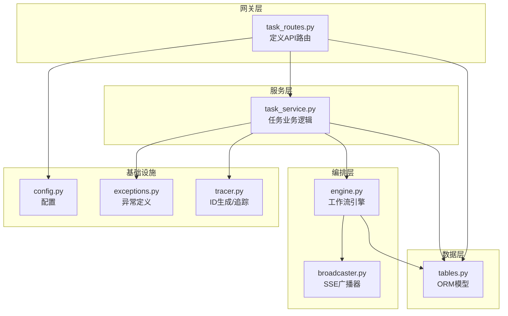
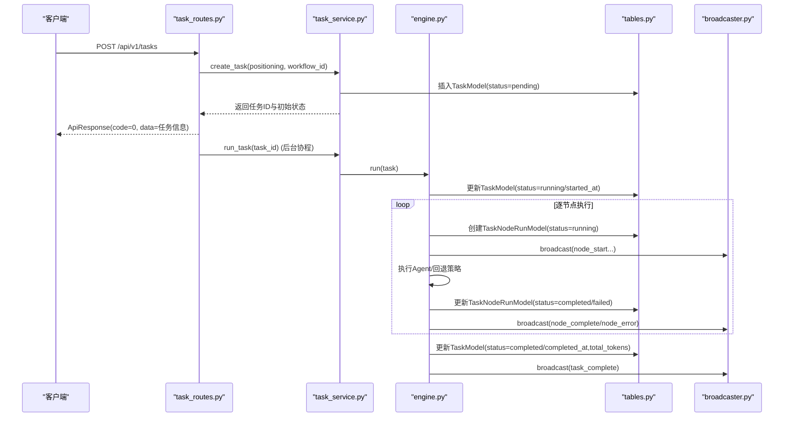
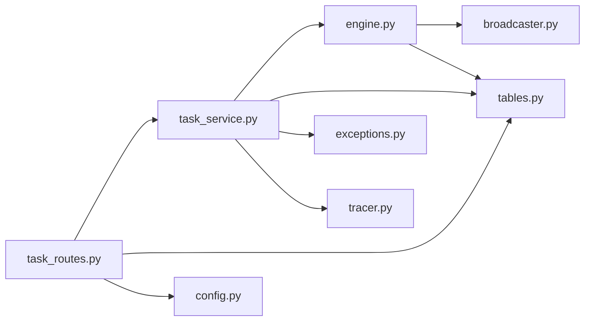
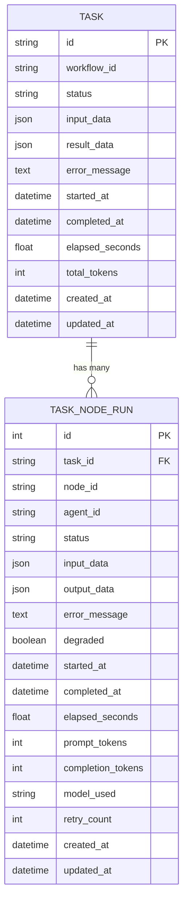

# 任务管理API

<cite>
**本文引用的文件**
- [task_routes.py](file://backend/app/api/task_routes.py)
- [task_service.py](file://backend/app/services/task_service.py)
- [tables.py](file://backend/app/models/tables.py)
- [common.py](file://backend/app/schemas/common.py)
- [task.py](file://backend/app/schemas/task.py)
- [tracer.py](file://backend/app/core/tracer.py)
- [engine.py](file://backend/app/orchestrator/engine.py)
- [broadcaster.py](file://backend/app/orchestrator/broadcaster.py)
- [config.py](file://backend/app/core/config.py)
- [exceptions.py](file://backend/app/core/exceptions.py)
- [test_task_api.py](file://backend/tests/test_task_api.py)
- [ARCHITECTURE.md](file://ARCHITECTURE.md)
</cite>

## 目录
1. [简介](#简介)
2. [项目结构](#项目结构)
3. [核心组件](#核心组件)
4. [架构总览](#架构总览)
5. [详细组件分析](#详细组件分析)
6. [依赖分析](#依赖分析)
7. [性能考量](#性能考量)
8. [故障排查指南](#故障排查指南)
9. [结论](#结论)
10. [附录](#附录)

## 简介
本文件面向任务管理API，覆盖任务创建、查询、列表等核心端点，提供请求参数、响应格式、错误码说明及实际请求/响应示例。同时解释任务状态流转、节点执行机制与后台任务处理逻辑，包含任务ID生成规则、状态枚举值与进度计算方式。

## 项目结构
后端采用FastAPI + SQLAlchemy异步架构，任务API位于网关层，业务逻辑集中在服务层，编排器负责工作流执行与SSE广播。

图表来源
- [task_routes.py:1-163](file://backend/app/api/task_routes.py#L1-L163)
- [task_service.py:1-126](file://backend/app/services/task_service.py#L1-L126)
- [engine.py:1-285](file://backend/app/orchestrator/engine.py#L1-L285)
- [broadcaster.py:1-94](file://backend/app/orchestrator/broadcaster.py#L1-L94)
- [tables.py:1-233](file://backend/app/models/tables.py#L1-L233)
- [config.py:1-51](file://backend/app/core/config.py#L1-L51)
- [exceptions.py:1-125](file://backend/app/core/exceptions.py#L1-L125)
- [tracer.py:1-34](file://backend/app/core/tracer.py#L1-L34)

章节来源
- [task_routes.py:1-163](file://backend/app/api/task_routes.py#L1-L163)
- [ARCHITECTURE.md:401-494](file://ARCHITECTURE.md#L401-L494)

## 核心组件
- API路由层：定义任务相关REST端点，负责参数校验与响应包装。
- 服务层：封装任务生命周期、状态变更、分页查询与节点运行记录查询。
- 编排层：按线性工作流顺序执行Agent，记录节点运行日志，广播SSE事件。
- 数据层：定义任务与节点运行记录的ORM模型，持久化状态与统计指标。
- 基础设施：统一异常、追踪ID生成、配置加载。

章节来源
- [task_routes.py:19-163](file://backend/app/api/task_routes.py#L19-L163)
- [task_service.py:20-126](file://backend/app/services/task_service.py#L20-L126)
- [engine.py:89-285](file://backend/app/orchestrator/engine.py#L89-L285)
- [tables.py:23-74](file://backend/app/models/tables.py#L23-L74)
- [common.py:7-27](file://backend/app/schemas/common.py#L7-L27)
- [tracer.py:15-34](file://backend/app/core/tracer.py#L15-L34)

## 架构总览
任务API的典型调用链：
- 客户端发起创建任务请求，API路由层接收并调用服务层创建任务。
- 服务层生成任务ID并持久化初始状态，随后在后台协程中启动编排器执行工作流。
- 编排器逐节点执行Agent，记录节点运行记录并广播SSE事件。
- 查询端点返回任务详情、状态、节点执行记录与分页列表。

图表来源
- [task_routes.py:19-51](file://backend/app/api/task_routes.py#L19-L51)
- [task_service.py:22-64](file://backend/app/services/task_service.py#L22-L64)
- [engine.py:92-234](file://backend/app/orchestrator/engine.py#L92-L234)
- [broadcaster.py:57-80](file://backend/app/orchestrator/broadcaster.py#L57-L80)
- [tables.py:23-74](file://backend/app/models/tables.py#L23-L74)

## 详细组件分析

### API端点定义与行为
- POST /api/v1/tasks
  - 作用：创建新任务，立即返回任务ID与初始状态，后台异步执行工作流。
  - 请求体：TaskCreateRequest
  - 响应：ApiResponse(data包含task_id、status、created_at、workflow_id)
  - 错误：422（参数校验失败）、500（内部错误）
- GET /api/v1/tasks/{task_id}
  - 作用：获取任务完整详情（含输入、结果、耗时、Token统计等）。
  - 响应：ApiResponse(data包含任务详情字段）
  - 错误：404（任务不存在）
- GET /api/v1/tasks/{task_id}/status
  - 作用：查询任务状态、当前节点、进度统计与耗时。
  - 响应：ApiResponse(data包含status、current_node、progress、started_at、elapsed_seconds)
  - 进度计算：total_nodes=6，completed_nodes=已完成节点数，current_node_index=首个running节点索引+1
- GET /api/v1/tasks/{task_id}/nodes
  - 作用：获取该任务所有节点的执行记录。
  - 响应：ApiResponse(data.nodes包含节点运行详情)
- GET /api/v1/tasks
  - 作用：分页查询任务列表，支持按status过滤。
  - 查询参数：page、page_size、status
  - 响应：ApiResponse(data包含tasks与pagination)

章节来源
- [task_routes.py:19-163](file://backend/app/api/task_routes.py#L19-L163)
- [task.py:10-83](file://backend/app/schemas/task.py#L10-L83)
- [common.py:7-27](file://backend/app/schemas/common.py#L7-L27)

### 请求参数与响应格式
- POST /api/v1/tasks
  - 请求体字段
    - positioning: 字符串，长度5-500，必填
    - workflow_id: 字符串，默认"default_pipeline"
  - 响应data字段
    - task_id: 字符串
    - status: 字符串
    - created_at: ISO时间字符串
    - workflow_id: 字符串
- GET /api/v1/tasks/{task_id}
  - 响应data字段
    - task_id: 字符串
    - status: 字符串
    - input_data: 字典或null
    - workflow_id: 字符串
    - result_data: 字典或null
    - error_message: 字符串或null
    - created_at/started_at/completed_at: ISO时间字符串或null
    - elapsed_seconds: 数值或null
    - total_tokens: 整数或null
- GET /api/v1/tasks/{task_id}/status
  - 响应data字段
    - task_id/status/current_node/started_at/elapsed_seconds: 同上
    - progress: 包含total_nodes/completed_nodes/current_node_index
- GET /api/v1/tasks/{task_id}/nodes
  - 响应data.nodes元素字段
    - node_id/agent_id/status/name: 字符串
    - input_data/output_data/error_message: 字典或null
    - started_at/completed_at/elapsed_seconds: ISO时间或null
    - prompt_tokens/completion_tokens: 整数或null
    - model_used/degraded: 字符串或布尔
- GET /api/v1/tasks
  - 查询参数
    - page: 整数≥1
    - page_size: 整数∈[1,100]
    - status: 字符串（可选）
  - 响应data字段
    - tasks: 列表，每项包含task_id、positioning_summary、status、created_at、elapsed_seconds
    - pagination: 包含page、page_size、total

章节来源
- [task_routes.py:19-163](file://backend/app/api/task_routes.py#L19-L163)
- [task.py:10-83](file://backend/app/schemas/task.py#L10-L83)

### 错误码说明
- 通用响应结构：ApiResponse(code,message,data)
- 业务错误码（节选）
  - 1002: 任务不存在
  - 2001: 任务已在运行
  - 3001: LLM调用失败
  - 3003: Agent执行超时
  - 3004: Agent执行失败
  - 3005: Skill执行失败
  - 4001: 配置错误
  - 4002: Manifest格式错误
  - 5000: 内部服务器错误
- 示例
  - GET /api/v1/tasks/{task_id} 返回404时，body.code=1002

章节来源
- [common.py:7-27](file://backend/app/schemas/common.py#L7-L27)
- [exceptions.py:24-125](file://backend/app/core/exceptions.py#L24-L125)
- [test_task_api.py:31-37](file://backend/tests/test_task_api.py#L31-L37)

### 实际请求/响应示例
- 创建任务
  - 请求
    - POST /api/v1/tasks
    - Content-Type: application/json
    - Body: {"positioning":"我是一个关注职场成长的公众号，目标读者是25-35岁互联网从业者"}
  - 响应
    - 200 OK
    - Body: {"code":0,"message":"ok","data":{"task_id":"...","status":"pending","created_at":"...","workflow_id":"default_pipeline"}}
- 查询任务详情
  - 请求
    - GET /api/v1/tasks/{task_id}
  - 响应
    - 200 OK
    - Body: {"code":0,"message":"ok","data":{...}}
- 查询任务状态
  - 请求
    - GET /api/v1/tasks/{task_id}/status
  - 响应
    - 200 OK
    - Body: {"code":0,"message":"ok","data":{"status":"running","progress":{"total_nodes":6,"completed_nodes":2,"current_node_index":3},"elapsed_seconds":120.5,...}}
- 查询节点执行记录
  - 请求
    - GET /api/v1/tasks/{task_id}/nodes
  - 响应
    - 200 OK
    - Body: {"code":0,"message":"ok","data":{"nodes":[{...}]}}
- 分页查询任务列表
  - 请求
    - GET /api/v1/tasks?page=1&page_size=20&status=pending
  - 响应
    - 200 OK
    - Body: {"code":0,"message":"ok","data":{"tasks":[{...}], "pagination":{"page":1,"page_size":20,"total":120}}}

章节来源
- [test_task_api.py:8-18](file://backend/tests/test_task_api.py#L8-L18)
- [task_routes.py:19-163](file://backend/app/api/task_routes.py#L19-L163)

### 任务状态流转与节点执行机制
- 状态枚举
  - pending：已创建，等待执行
  - running：正在执行
  - completed：执行完成
  - failed：执行失败
- 线性工作流节点（固定6个）
  - profile_parsing → hot_topic_analysis → topic_planning → title_generation → content_writing → audit
- 节点执行要点
  - 每个节点创建TaskNodeRunModel并设置status=running
  - 执行成功：设置status=completed并记录输出；失败：根据required决定是否终止
  - 超时/异常：记录错误并广播node_error；必要时抛出AgentTimeoutError或AgentExecutionError
  - 任务完成后：更新TaskModel.status=completed，记录completed_at与total_tokens

章节来源
- [engine.py:32-86](file://backend/app/orchestrator/engine.py#L32-L86)
- [engine.py:92-234](file://backend/app/orchestrator/engine.py#L92-L234)
- [tables.py:23-74](file://backend/app/models/tables.py#L23-L74)

### 后台任务处理逻辑
- 创建任务时立即返回，后台协程启动run_task
- run_task中检查任务状态避免重复执行
- run_task捕获异常并回写任务状态与错误信息
- 编排器通过SSE广播节点开始/完成/错误事件，前端订阅实时状态

章节来源
- [task_routes.py:19-51](file://backend/app/api/task_routes.py#L19-L51)
- [task_service.py:39-64](file://backend/app/services/task_service.py#L39-L64)
- [broadcaster.py:57-80](file://backend/app/orchestrator/broadcaster.py#L57-L80)

### 任务ID生成规则
- 格式：task_{nanoid(12)}
- 生成器：generate_task_id()

章节来源
- [tracer.py:15-17](file://backend/app/core/tracer.py#L15-L17)

### 进度计算方式
- total_nodes：固定为6
- completed_nodes：遍历节点运行记录，统计status=completed的数量
- current_node_index：第一个status=running的节点索引+1（若无running则为0）

章节来源
- [task_routes.py:54-87](file://backend/app/api/task_routes.py#L54-L87)

## 依赖分析
- API路由依赖服务层与数据库会话
- 服务层依赖编排器、广播器、异常与追踪模块
- 编排器依赖Agent注册中心、工作空间与配置
- 数据层提供任务与节点运行记录的ORM映射

图表来源
- [task_routes.py:1-163](file://backend/app/api/task_routes.py#L1-L163)
- [task_service.py:1-126](file://backend/app/services/task_service.py#L1-L126)
- [engine.py:1-285](file://backend/app/orchestrator/engine.py#L1-L285)
- [broadcaster.py:1-94](file://backend/app/orchestrator/broadcaster.py#L1-L94)
- [tables.py:1-233](file://backend/app/models/tables.py#L1-L233)
- [exceptions.py:1-125](file://backend/app/core/exceptions.py#L1-L125)
- [tracer.py:1-34](file://backend/app/core/tracer.py#L1-L34)
- [config.py:1-51](file://backend/app/core/config.py#L1-L51)

## 性能考量
- 异步I/O：FastAPI + SQLAlchemy异步，减少阻塞
- 后台执行：创建任务后立即返回，避免长阻塞
- SSE缓冲：广播器维护事件历史，支持延迟订阅
- Token统计：编排器汇总节点prompt_tokens与completion_tokens，便于成本控制
- 分页查询：服务层对count与分页分别执行，避免全量扫描

章节来源
- [task_routes.py:19-51](file://backend/app/api/task_routes.py#L19-L51)
- [broadcaster.py:22-80](file://backend/app/orchestrator/broadcaster.py#L22-L80)
- [engine.py:211-216](file://backend/app/orchestrator/engine.py#L211-L216)
- [task_service.py:80-102](file://backend/app/services/task_service.py#L80-L102)

## 故障排查指南
- 任务不存在
  - 现象：查询任务详情/状态返回404，body.code=1002
  - 排查：确认task_id正确，检查数据库是否存在
- 任务已在运行
  - 现象：后台执行run_task时抛出2001错误
  - 排查：避免重复触发相同任务ID
- Agent执行超时
  - 现象：节点失败，error_message包含超时信息
  - 排查：调整settings.agent_timeout，检查网络与模型服务
- Agent/Skill执行失败
  - 现象：节点失败并广播node_error
  - 排查：查看节点运行记录中的error_message，检查输入schema与外部服务

章节来源
- [test_task_api.py:31-37](file://backend/tests/test_task_api.py#L31-L37)
- [exceptions.py:48-98](file://backend/app/core/exceptions.py#L48-L98)
- [engine.py:176-197](file://backend/app/orchestrator/engine.py#L176-L197)

## 结论
任务管理API通过清晰的路由、服务与编排分层，实现了从创建到执行再到可视化的完整闭环。线性工作流确保了可预测的执行顺序与可观测性，SSE广播使前端能够实时跟踪节点状态。建议在生产环境中结合配置与日志进一步优化超时与重试策略，并持续完善错误降级与回放能力。

## 附录

### 数据模型概览

图表来源
- [tables.py:23-74](file://backend/app/models/tables.py#L23-L74)