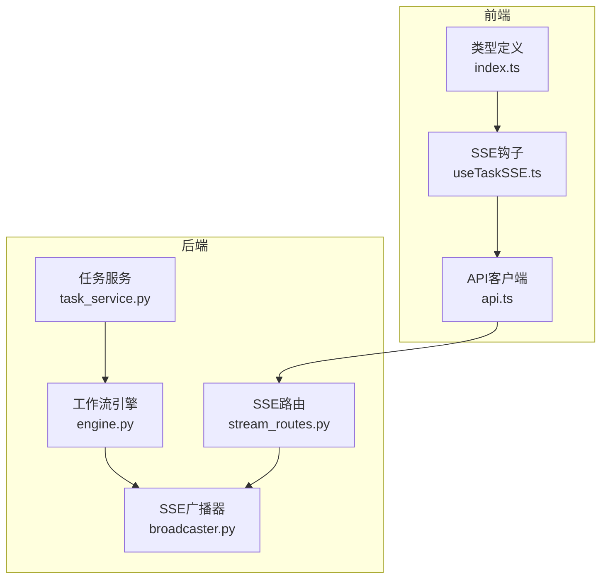
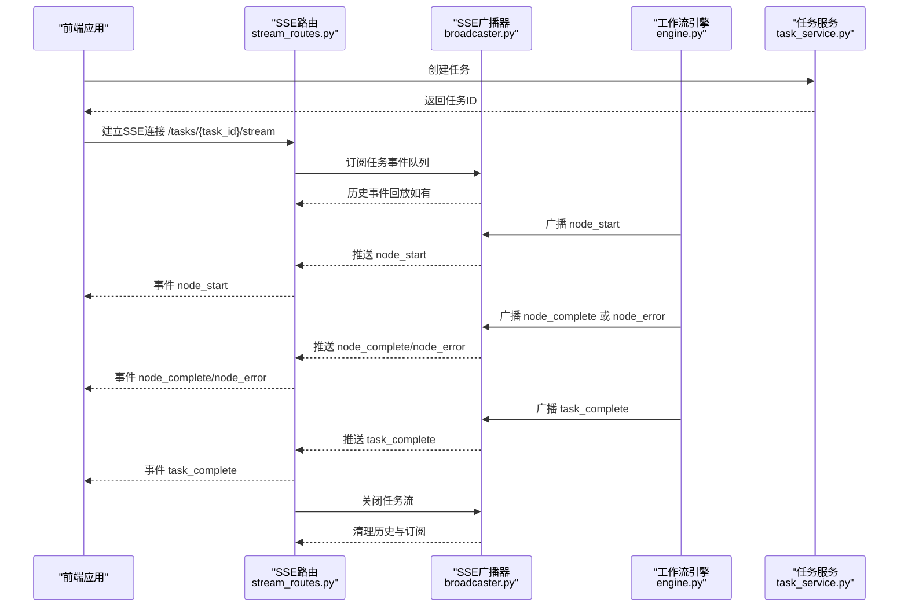
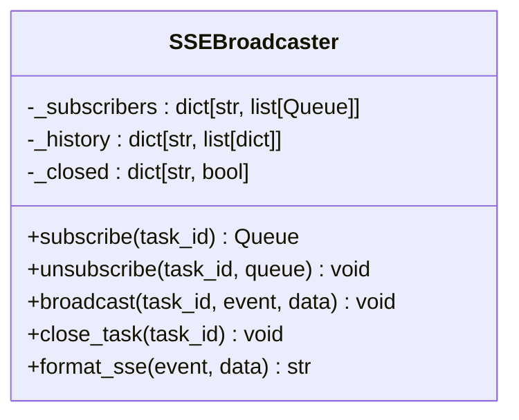
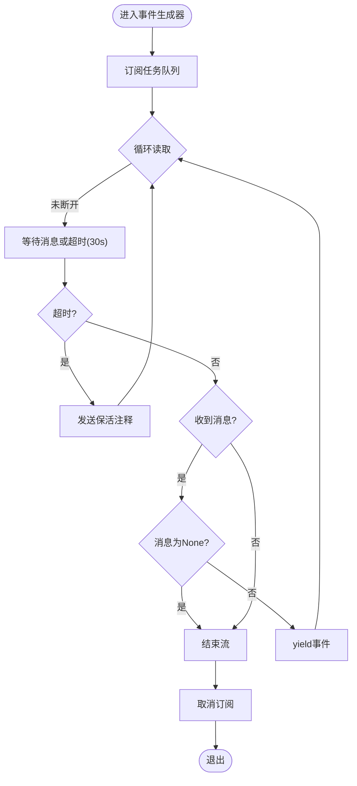
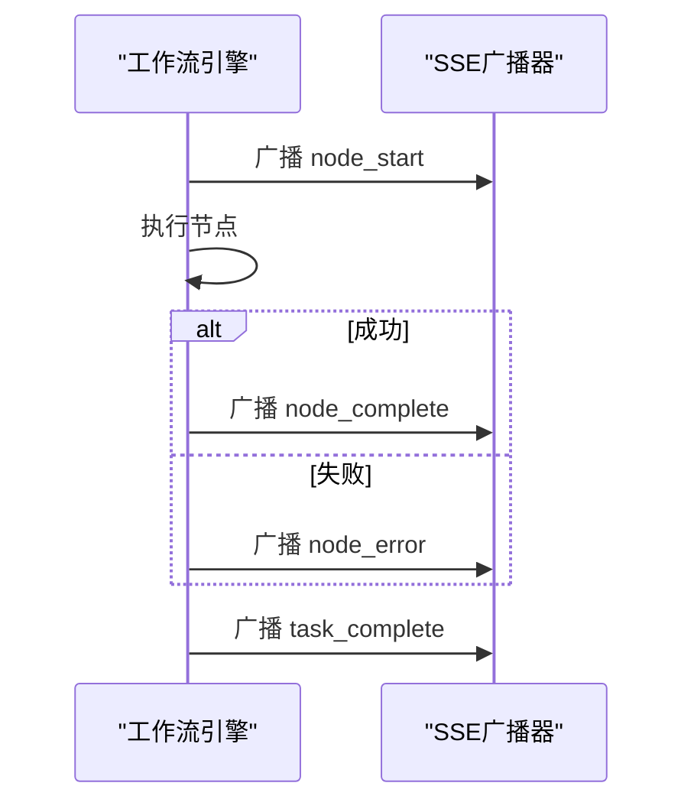
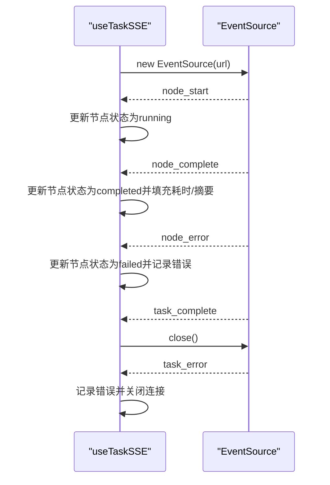
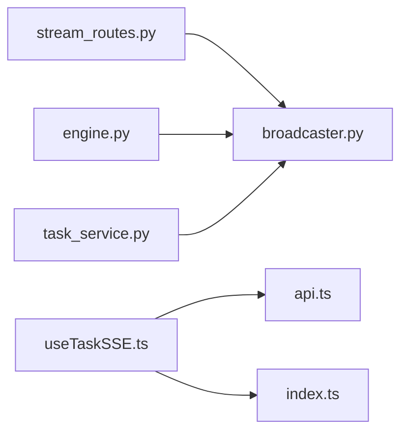

# 实时状态API

<cite>
**本文引用的文件**
- [broadcaster.py](file://backend/app/orchestrator/broadcaster.py)
- [stream_routes.py](file://backend/app/api/stream_routes.py)
- [engine.py](file://backend/app/orchestrator/engine.py)
- [task_service.py](file://backend/app/services/task_service.py)
- [useTaskSSE.ts](file://frontend/hooks/useTaskSSE.ts)
- [api.ts](file://frontend/lib/api.ts)
- [index.ts](file://frontend/types/index.ts)
- [ARCHITECTURE.md](file://ARCHITECTURE.md)
</cite>

## 目录
1. [简介](#简介)
2. [项目结构](#项目结构)
3. [核心组件](#核心组件)
4. [架构总览](#架构总览)
5. [详细组件分析](#详细组件分析)
6. [依赖关系分析](#依赖关系分析)
7. [性能考量](#性能考量)
8. [故障排查指南](#故障排查指南)
9. [结论](#结论)
10. [附录](#附录)

## 简介
本文件系统性地文档化了基于 Server-Sent Events（SSE）的实时状态API，涵盖连接建立、事件类型定义、消息格式规范、事件ID管理、心跳与超时处理、频率控制、消息去重与顺序保证，以及前端集成最佳实践与性能优化建议。该API用于向客户端推送任务执行过程中的节点状态变化，包括节点开始、节点进度、节点完成、节点错误、任务完成与任务错误等事件。

## 项目结构
实时状态API由后端SSE广播器、SSE路由、工作流引擎与前端SSE钩子共同组成，形成“任务创建—工作流执行—事件广播—前端订阅”的闭环。

图表来源
- [task_service.py:1-126](file://backend/app/services/task_service.py#L1-L126)
- [engine.py:1-285](file://backend/app/orchestrator/engine.py#L1-L285)
- [broadcaster.py:1-94](file://backend/app/orchestrator/broadcaster.py#L1-L94)
- [stream_routes.py:1-43](file://backend/app/api/stream_routes.py#L1-L43)
- [useTaskSSE.ts:1-124](file://frontend/hooks/useTaskSSE.ts#L1-L124)
- [api.ts:1-110](file://frontend/lib/api.ts#L1-L110)
- [index.ts:1-119](file://frontend/types/index.ts#L1-L119)

章节来源
- [task_service.py:1-126](file://backend/app/services/task_service.py#L1-L126)
- [engine.py:1-285](file://backend/app/orchestrator/engine.py#L1-L285)
- [broadcaster.py:1-94](file://backend/app/orchestrator/broadcaster.py#L1-L94)
- [stream_routes.py:1-43](file://backend/app/api/stream_routes.py#L1-L43)
- [useTaskSSE.ts:1-124](file://frontend/hooks/useTaskSSE.ts#L1-L124)
- [api.ts:1-110](file://frontend/lib/api.ts#L1-L110)
- [index.ts:1-119](file://frontend/types/index.ts#L1-L119)

## 核心组件
- SSE广播器：维护每个任务的订阅者队列与历史事件缓冲，负责事件入队、历史回放与关闭信号。
- SSE路由：为指定任务ID提供SSE流，处理连接生命周期、超时保活与断开清理。
- 工作流引擎：在节点执行前后广播事件，并在任务完成后发送完成事件与关闭流。
- 任务服务：协调任务生命周期与后台运行，异常时广播任务级错误。
- 前端SSE钩子：封装EventSource连接、事件监听、状态更新与清理逻辑。

章节来源
- [broadcaster.py:11-94](file://backend/app/orchestrator/broadcaster.py#L11-L94)
- [stream_routes.py:14-42](file://backend/app/api/stream_routes.py#L14-L42)
- [engine.py:89-234](file://backend/app/orchestrator/engine.py#L89-L234)
- [task_service.py:20-64](file://backend/app/services/task_service.py#L20-L64)
- [useTaskSSE.ts:28-123](file://frontend/hooks/useTaskSSE.ts#L28-L123)

## 架构总览
SSE实时状态API的端到端流程如下：

图表来源
- [stream_routes.py:14-42](file://backend/app/api/stream_routes.py#L14-L42)
- [broadcaster.py:30-84](file://backend/app/orchestrator/broadcaster.py#L30-L84)
- [engine.py:124-232](file://backend/app/orchestrator/engine.py#L124-L232)
- [task_service.py:59-63](file://backend/app/services/task_service.py#L59-L63)

## 详细组件分析

### SSE广播器（SSEBroadcaster）
- 功能职责
  - 维护每个任务的订阅者队列列表，支持多客户端同时订阅同一任务。
  - 缓存历史事件，新订阅者可回放历史，避免漏掉早期事件。
  - 提供关闭任务能力，向所有订阅者发送结束信号并清理资源。
  - 提供格式化SSE消息的能力（事件名与数据）。
- 数据结构
  - 订阅者映射：task_id -> 队列列表
  - 历史事件映射：task_id -> 事件列表
  - 关闭标记映射：task_id -> 是否已关闭
- 关键方法
  - subscribe(task_id)：创建队列并回放历史，返回队列供路由消费。
  - unsubscribe(task_id, queue)：移除订阅者。
  - broadcast(task_id, event, data)：入队消息并推送给当前订阅者。
  - close_task(task_id)：标记关闭并向订阅者发送结束信号，延时清理历史。
  - format_sse(event, data)：格式化SSE文本消息。
- 复杂度与性能
  - 订阅/取消订阅为O(n)，n为该任务的订阅者数量。
  - 广播为O(n)，对每个订阅者进行入队。
  - 历史缓冲按任务维度存储，关闭后延迟清理，避免内存泄漏。

图表来源
- [broadcaster.py:11-94](file://backend/app/orchestrator/broadcaster.py#L11-L94)

章节来源
- [broadcaster.py:11-94](file://backend/app/orchestrator/broadcaster.py#L11-L94)

### SSE路由（/api/v1/tasks/{task_id}/stream）
- 功能职责
  - 为指定任务ID建立SSE流，将广播器队列中的事件推送给客户端。
  - 在超时情况下发送保活注释，维持连接活跃。
  - 检测客户端断开并清理订阅。
- 连接生命周期
  - 订阅：调用广播器subscribe获取队列。
  - 循环读取：等待消息或超时；超时发送保活注释。
  - 结束：收到None（结束信号）或客户端断开时退出循环。
  - 清理：finally块中调用unsubscribe。
- 心跳与超时
  - 使用wait_for设置30秒超时，超时则发送注释“keepalive”，避免浏览器断开。
  - 客户端断开检测通过request.is_disconnected()实现。

图表来源
- [stream_routes.py:18-40](file://backend/app/api/stream_routes.py#L18-L40)

章节来源
- [stream_routes.py:14-42](file://backend/app/api/stream_routes.py#L14-L42)

### 工作流引擎（OrchestratorEngine）
- 功能职责
  - 按顺序调度节点执行，记录节点运行状态与耗时。
  - 在节点开始、完成、失败时广播相应事件。
  - 任务完成后广播任务完成事件并关闭流。
- 事件广播
  - 节点开始：广播node_start，包含节点索引、总数、开始时间等。
  - 节点完成：广播node_complete，包含耗时、是否降级、输出摘要。
  - 节点错误：广播node_error，包含错误信息。
  - 任务完成：广播task_complete，包含任务耗时。
- 异常处理
  - 节点执行异常或超时会广播node_error，并根据required决定是否终止任务。
  - 任务级异常会广播task_error并关闭流。

图表来源
- [engine.py:124-232](file://backend/app/orchestrator/engine.py#L124-L232)
- [broadcaster.py:57-68](file://backend/app/orchestrator/broadcaster.py#L57-L68)

章节来源
- [engine.py:89-234](file://backend/app/orchestrator/engine.py#L89-L234)

### 任务服务（TaskService）
- 功能职责
  - 创建任务并启动后台执行。
  - 异常时设置任务状态为失败，广播task_error并关闭流。
- 与SSE的关系
  - 通过广播器发送任务级错误事件，确保客户端及时获知任务失败。

章节来源
- [task_service.py:20-64](file://backend/app/services/task_service.py#L20-L64)

### 前端SSE钩子（useTaskSSE）
- 功能职责
  - 建立EventSource连接，监听node_start、node_complete、node_error、task_complete、task_error事件。
  - 更新本地节点状态、耗时、错误信息与任务完成标志。
  - 在任务完成或出错时关闭连接并清理状态。
- 事件处理
  - node_start：将对应节点状态置为running。
  - node_complete：将对应节点状态置为completed，填充耗时、摘要与降级标志。
  - node_error：将对应节点状态置为failed并记录错误。
  - task_complete：标记任务完成并关闭连接。
  - task_error：记录错误并关闭连接。
- 连接管理
  - 连接URL通过api.ts的getTaskStreamUrl(taskId)生成。
  - onerror回调中关闭连接，避免悬挂。

图表来源
- [useTaskSSE.ts:62-120](file://frontend/hooks/useTaskSSE.ts#L62-L120)
- [api.ts:48-50](file://frontend/lib/api.ts#L48-L50)

章节来源
- [useTaskSSE.ts:28-123](file://frontend/hooks/useTaskSSE.ts#L28-L123)
- [api.ts:48-50](file://frontend/lib/api.ts#L48-L50)

## 依赖关系分析
- 后端耦合
  - SSE路由依赖广播器；广播器被工作流引擎与任务服务共同使用。
  - 工作流引擎依赖代理注册表、工作区与广播器。
- 前端耦合
  - 前端SSE钩子依赖API客户端与类型定义。
- 可能的循环依赖
  - 当前模块间为单向依赖，无循环。

图表来源
- [stream_routes.py:9](file://backend/app/api/stream_routes.py#L9)
- [broadcaster.py:6](file://backend/app/orchestrator/broadcaster.py#L6)
- [engine.py:26](file://backend/app/orchestrator/engine.py#L26)
- [task_service.py:15](file://backend/app/services/task_service.py#L15)
- [useTaskSSE.ts:4](file://frontend/hooks/useTaskSSE.ts#L4)
- [api.ts:12](file://frontend/lib/api.ts#L12)
- [index.ts:1](file://frontend/types/index.ts#L1)

章节来源
- [stream_routes.py:1-43](file://backend/app/api/stream_routes.py#L1-L43)
- [broadcaster.py:1-94](file://backend/app/orchestrator/broadcaster.py#L1-L94)
- [engine.py:1-285](file://backend/app/orchestrator/engine.py#L1-L285)
- [task_service.py:1-126](file://backend/app/services/task_service.py#L1-L126)
- [useTaskSSE.ts:1-124](file://frontend/hooks/useTaskSSE.ts#L1-L124)
- [api.ts:1-110](file://frontend/lib/api.ts#L1-L110)
- [index.ts:1-119](file://frontend/types/index.ts#L1-L119)

## 性能考量
- 事件频率控制
  - 建议在节点完成时才广播node_complete，避免频繁广播进度事件导致流量过大。
  - 若需进度上报，可在节点内部周期性广播轻量级进度事件，但应限制频率（例如每秒一次）。
- 历史缓冲与内存管理
  - 广播器对每个任务保留历史事件，任务结束后延迟60秒清理，避免内存泄漏。
  - 对长时间运行的任务，建议在业务层控制历史保留策略或分段清理。
- 连接保活
  - 后端在30秒超时后发送注释“keepalive”以维持连接；前端应正确处理注释事件。
- 订阅者管理
  - 订阅者断开后立即清理，避免僵尸连接占用资源。
- 并发与队列
  - 广播为O(n)操作，订阅者数量较多时应考虑限流或拆分任务域。

[本节为通用性能建议，不直接分析具体文件]

## 故障排查指南
- 常见问题
  - 无法接收事件：检查SSE路由是否正确订阅任务ID，确认广播器未提前关闭。
  - 事件丢失：确认前端在连接建立后是否能回放历史事件（订阅时会回放）。
  - 连接频繁断开：检查客户端网络状况与浏览器SSE实现；确认后端保活注释正常发送。
  - 任务失败未通知：检查任务服务是否广播task_error并关闭流。
- 关键排查点
  - SSE路由：确认订阅、超时保活、断开清理逻辑。
  - 广播器：确认历史缓冲、订阅者列表与关闭信号。
  - 工作流引擎：确认节点开始/完成/错误广播与任务完成广播。
  - 任务服务：确认异常路径是否广播task_error并关闭流。
  - 前端：确认EventSource连接、事件监听与onerror处理。

章节来源
- [stream_routes.py:14-42](file://backend/app/api/stream_routes.py#L14-L42)
- [broadcaster.py:30-84](file://backend/app/orchestrator/broadcaster.py#L30-L84)
- [engine.py:124-232](file://backend/app/orchestrator/engine.py#L124-L232)
- [task_service.py:59-63](file://backend/app/services/task_service.py#L59-L63)
- [useTaskSSE.ts:62-120](file://frontend/hooks/useTaskSSE.ts#L62-L120)

## 结论
本SSE实时状态API通过广播器与SSE路由实现了可靠的任务状态推送，覆盖节点与任务级别的关键事件。前端通过useTaskSSE钩子统一处理事件与UI状态，配合保活与断开清理机制，保证了良好的用户体验与系统稳定性。建议在生产环境中结合频率控制、历史缓冲策略与监控告警，持续优化性能与可靠性。

[本节为总结性内容，不直接分析具体文件]

## 附录

### SSE事件类型与消息结构
- 事件类型
  - node_start：节点开始执行
  - node_complete：节点执行完成
  - node_error：节点执行失败
  - task_complete：任务全部完成
  - task_error：任务级错误
- 消息结构（字段说明）
  - node_start
    - node_id：节点标识
    - agent_id：代理标识
    - name：节点名称
    - index：节点在工作流中的索引
    - total：工作流总节点数
    - started_at：节点开始时间（ISO 8601）
  - node_complete
    - node_id：节点标识
    - agent_id：代理标识
    - name：节点名称
    - elapsed_seconds：节点耗时（秒）
    - degraded：是否降级
    - output_summary：输出摘要
  - node_error
    - node_id：节点标识
    - error：错误信息
  - task_complete
    - task_id：任务标识
    - elapsed_seconds：任务总耗时（秒）
  - task_error
    - task_id：任务标识
    - error：错误信息
- 触发条件
  - 节点开始：工作流引擎在节点执行前广播node_start。
  - 节点完成：节点成功执行后广播node_complete。
  - 节点错误：节点执行异常或超时广播node_error。
  - 任务完成：工作流执行完毕广播task_complete。
  - 任务错误：任务服务捕获异常时广播task_error。

章节来源
- [engine.py:124-232](file://backend/app/orchestrator/engine.py#L124-L232)
- [task_service.py:59-63](file://backend/app/services/task_service.py#L59-L63)
- [index.ts:66-95](file://frontend/types/index.ts#L66-L95)
- [ARCHITECTURE.md:350-359](file://ARCHITECTURE.md#L350-L359)

### 前端SSE连接建立与重连机制
- 连接建立
  - 使用api.ts提供的getTaskStreamUrl(taskId)生成SSE地址。
  - 通过new EventSource(url)建立连接。
- 事件监听
  - 监听node_start、node_complete、node_error、task_complete、task_error事件。
  - 在task_complete与task_error时关闭连接。
- 错误处理
  - onerror回调中关闭连接，避免悬挂。
- 重连机制
  - 建议在断开后延迟重试（例如指数退避），并在页面卸载或任务变更时清理旧连接。
  - 重试前先检查任务状态，避免对已完成任务重复订阅。

章节来源
- [useTaskSSE.ts:62-120](file://frontend/hooks/useTaskSSE.ts#L62-L120)
- [api.ts:48-50](file://frontend/lib/api.ts#L48-L50)

### 事件ID管理、心跳与超时处理
- 事件ID管理
  - SSE标准事件ID字段在当前实现中未使用；若需要严格顺序与去重，可在消息中携带自增序号并在前端校验。
- 心跳机制
  - 后端在30秒超时后发送注释“keepalive”，前端应忽略注释事件，仅保持连接活跃。
- 连接超时处理
  - 后端通过wait_for(timeout=30.0)实现超时保活；前端应在onerror中主动关闭并准备重连。

章节来源
- [stream_routes.py:24-29](file://backend/app/api/stream_routes.py#L24-L29)

### 实时状态更新频率控制、去重与顺序保证
- 频率控制
  - 建议仅在节点完成时广播node_complete，必要时在节点内部周期性广播轻量级进度事件。
- 去重
  - 当前实现未内置去重；可在前端基于node_id与事件类型去重，或在广播器中引入事件ID与去重队列。
- 顺序保证
  - 广播器按事件到达顺序入队，前端按事件到达顺序渲染，天然具备顺序一致性。
  - 历史回放确保晚到订阅者也能按顺序接收事件。

章节来源
- [broadcaster.py:33-35](file://backend/app/orchestrator/broadcaster.py#L33-L35)
- [stream_routes.py:24-38](file://backend/app/api/stream_routes.py#L24-L38)

### 开发者最佳实践与性能优化建议
- 后端
  - 控制事件频率，避免过度推送；对长任务启用历史缓冲清理策略。
  - 在异常路径统一广播task_error，确保客户端及时感知。
- 前端
  - 使用useTaskSSE钩子统一管理连接与状态，避免重复订阅。
  - 在断开时进行清理，防止内存泄漏。
  - 对高频事件进行节流或合并，减少UI重绘压力。
- 全局
  - 增加SSE监控指标（连接数、事件速率、丢包率）与告警。
  - 对关键节点增加降级提示（degraded），提升用户感知。

[本节为通用建议，不直接分析具体文件]