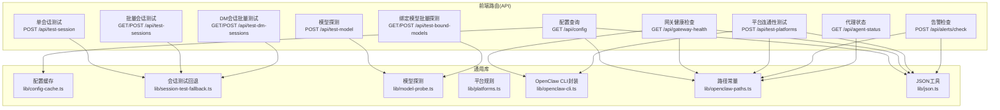
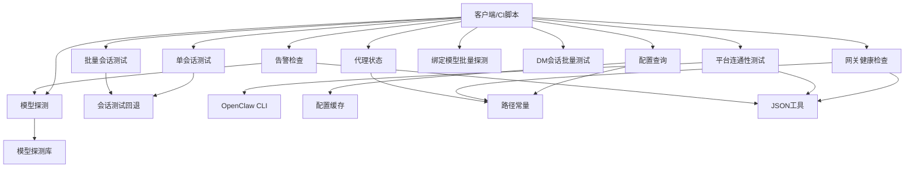
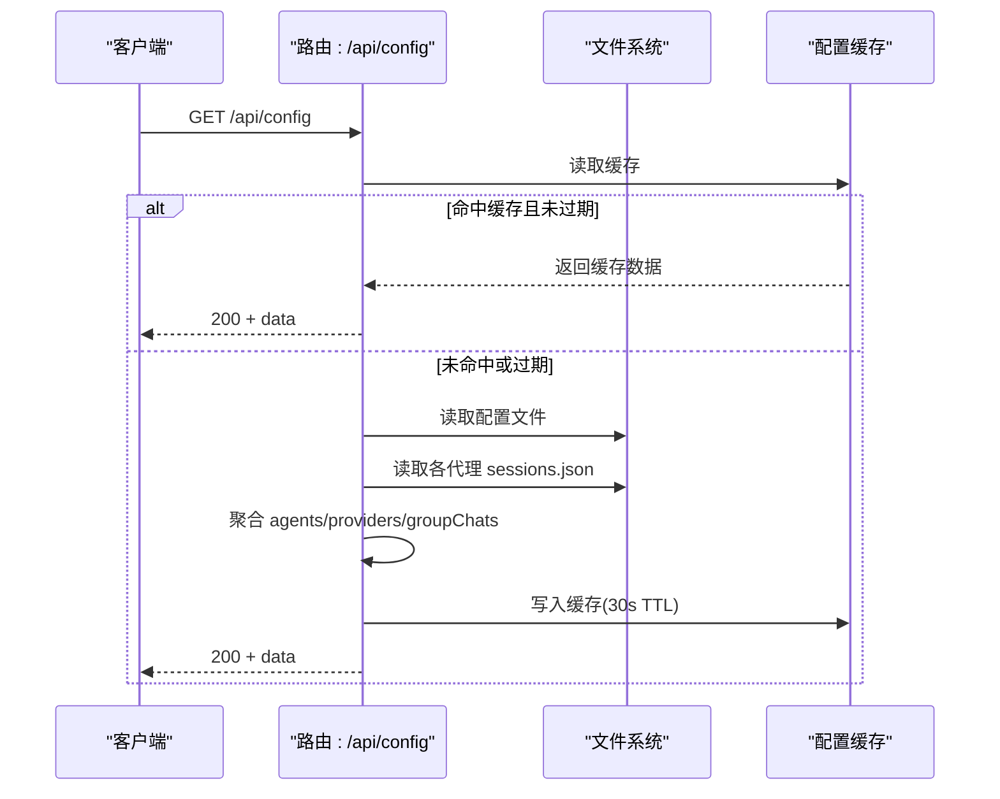
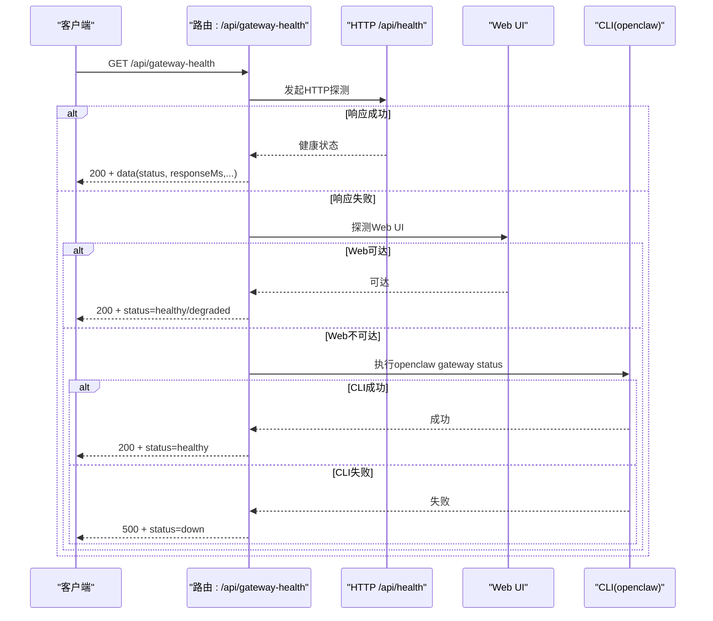
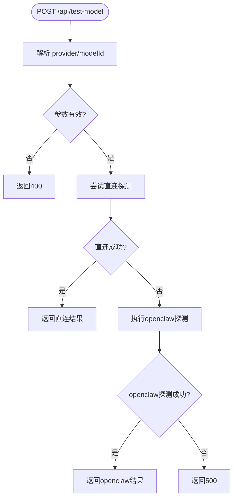
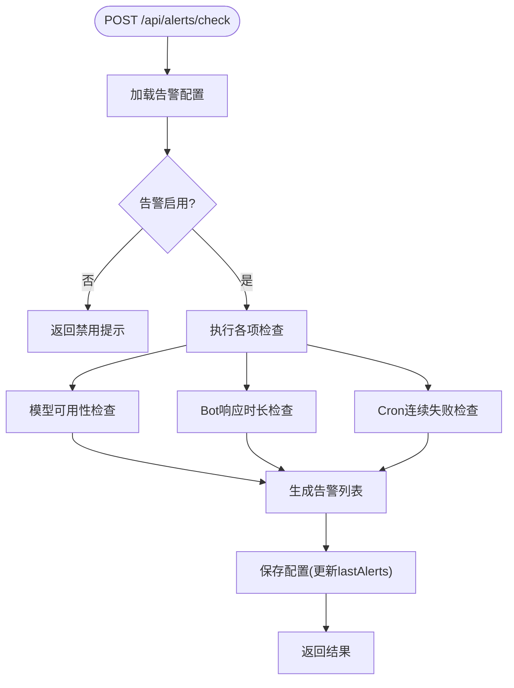
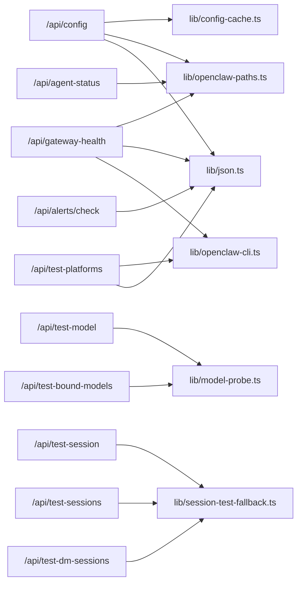

# 工具类API

<cite>
**本文档引用的文件**
- [OpenClaw-bot-review-main/app/api/config/route.ts](file://OpenClaw-bot-review-main/app/api/config/route.ts)
- [OpenClaw-bot-review-main/app/api/gateway-health/route.ts](file://OpenClaw-bot-review-main/app/api/gateway-health/route.ts)
- [OpenClaw-bot-review-main/app/api/test-model/route.ts](file://OpenClaw-bot-review-main/app/api/test-model/route.ts)
- [OpenClaw-bot-review-main/app/api/test-session/route.ts](file://OpenClaw-bot-review-main/app/api/test-session/route.ts)
- [OpenClaw-bot-review-main/app/api/test-sessions/route.ts](file://OpenClaw-bot-review-main/app/api/test-sessions/route.ts)
- [OpenClaw-bot-review-main/app/api/test-platforms/route.ts](file://OpenClaw-bot-review-main/app/api/test-platforms/route.ts)
- [OpenClaw-bot-review-main/app/api/test-bound-models/route.ts](file://OpenClaw-bot-review-main/app/api/test-bound-models/route.ts)
- [OpenClaw-bot-review-main/app/api/test-dm-sessions/route.ts](file://OpenClaw-bot-review-main/app/api/test-dm-sessions/route.ts)
- [OpenClaw-bot-review-main/app/api/alerts/check/route.ts](file://OpenClaw-bot-review-main/app/api/alerts/check/route.ts)
- [OpenClaw-bot-review-main/app/api/agent-status/route.ts](file://OpenClaw-bot-review-main/app/api/agent-status/route.ts)
- [OpenClaw-bot-review-main/lib/config-cache.ts](file://OpenClaw-bot-review-main/lib/config-cache.ts)
- [OpenClaw-bot-review-main/lib/session-test-fallback.ts](file://OpenClaw-bot-review-main/lib/session-test-fallback.ts)
- [OpenClaw-bot-review-main/lib/model-probe.ts](file://OpenClaw-bot-review-main/lib/model-probe.ts)
- [OpenClaw-bot-review-main/lib/platforms.ts](file://OpenClaw-bot-review-main/lib/platforms.ts)
- [OpenClaw-bot-review-main/lib/openclaw-cli.ts](file://OpenClaw-bot-review-main/lib/openclaw-cli.ts)
- [OpenClaw-bot-review-main/lib/openclaw-paths.ts](file://OpenClaw-bot-review-main/lib/openclaw-paths.ts)
- [OpenClaw-bot-review-main/lib/json.ts](file://OpenClaw-bot-review-main/lib/json.ts)
</cite>

## 目录
1. [简介](#简介)
2. [项目结构](#项目结构)
3. [核心组件](#核心组件)
4. [架构总览](#架构总览)
5. [详细组件分析](#详细组件分析)
6. [依赖关系分析](#依赖关系分析)
7. [性能考量](#性能考量)
8. [故障排除指南](#故障排除指南)
9. [结论](#结论)
10. [附录](#附录)

## 简介
本文件面向开发者，系统性梳理工具类API，覆盖以下主题：
- 配置查询API：系统配置读取、环境变量获取、动态配置更新与缓存策略
- 测试辅助API：模型连通性探测、会话连通性测试、平台连通性测试、批量测试与回退机制
- 网关健康检查API：健康状态判定、多通道探测（HTTP/Web/CLI）、延迟分级与告警提示
- 告警检查API：基于规则的模型可用性、Bot响应时长、Cron连续失败等告警触发与发送
- 辅助能力：会话测试回退到CLI、模型探测直连与OpenClaw探测、平台隐藏规则与显示名映射

目标是帮助开发者快速理解API行为、请求/响应格式、错误处理与最佳实践，并提供集成示例与排障建议。

## 项目结构
工具类API主要位于前端Next.js应用的路由层，配合若干通用库完成配置读取、命令行调用、缓存与路径解析等基础能力。

图表来源
- [OpenClaw-bot-review-main/app/api/config/route.ts:257-556](file://OpenClaw-bot-review-main/app/api/config/route.ts#L257-L556)
- [OpenClaw-bot-review-main/app/api/gateway-health/route.ts:124-257](file://OpenClaw-bot-review-main/app/api/gateway-health/route.ts#L124-L257)
- [OpenClaw-bot-review-main/app/api/test-model/route.ts:6-34](file://OpenClaw-bot-review-main/app/api/test-model/route.ts#L6-L34)
- [OpenClaw-bot-review-main/app/api/test-session/route.ts:8-84](file://OpenClaw-bot-review-main/app/api/test-session/route.ts#L8-L84)
- [OpenClaw-bot-review-main/app/api/test-sessions/route.ts:13-94](file://OpenClaw-bot-review-main/app/api/test-sessions/route.ts#L13-L94)
- [OpenClaw-bot-review-main/app/api/test-platforms/route.ts:31-754](file://OpenClaw-bot-review-main/app/api/test-platforms/route.ts#L31-L754)
- [OpenClaw-bot-review-main/app/api/test-bound-models/route.ts:31-100](file://OpenClaw-bot-review-main/app/api/test-bound-models/route.ts#L31-L100)
- [OpenClaw-bot-review-main/app/api/test-dm-sessions/route.ts:90-150](file://OpenClaw-bot-review-main/app/api/test-dm-sessions/route.ts#L90-L150)
- [OpenClaw-bot-review-main/app/api/alerts/check/route.ts:416-455](file://OpenClaw-bot-review-main/app/api/alerts/check/route.ts#L416-L455)
- [OpenClaw-bot-review-main/app/api/agent-status/route.ts:75-92](file://OpenClaw-bot-review-main/app/api/agent-status/route.ts#L75-L92)
- [OpenClaw-bot-review-main/lib/config-cache.ts:1-19](file://OpenClaw-bot-review-main/lib/config-cache.ts#L1-L19)
- [OpenClaw-bot-review-main/lib/session-test-fallback.ts:1-62](file://OpenClaw-bot-review-main/lib/session-test-fallback.ts#L1-L62)
- [OpenClaw-bot-review-main/lib/model-probe.ts:1-373](file://OpenClaw-bot-review-main/lib/model-probe.ts#L1-L373)
- [OpenClaw-bot-review-main/lib/platforms.ts:1-11](file://OpenClaw-bot-review-main/lib/platforms.ts#L1-L11)
- [OpenClaw-bot-review-main/lib/openclaw-cli.ts:1-109](file://OpenClaw-bot-review-main/lib/openclaw-cli.ts#L1-L109)
- [OpenClaw-bot-review-main/lib/openclaw-paths.ts:1-36](file://OpenClaw-bot-review-main/lib/openclaw-paths.ts#L1-L36)
- [OpenClaw-bot-review-main/lib/json.ts:1-18](file://OpenClaw-bot-review-main/lib/json.ts#L1-L18)

章节来源
- [OpenClaw-bot-review-main/app/api/config/route.ts:257-556](file://OpenClaw-bot-review-main/app/api/config/route.ts#L257-L556)
- [OpenClaw-bot-review-main/app/api/gateway-health/route.ts:124-257](file://OpenClaw-bot-review-main/app/api/gateway-health/route.ts#L124-L257)
- [OpenClaw-bot-review-main/lib/config-cache.ts:1-19](file://OpenClaw-bot-review-main/lib/config-cache.ts#L1-L19)
- [OpenClaw-bot-review-main/lib/openclaw-paths.ts:1-36](file://OpenClaw-bot-review-main/lib/openclaw-paths.ts#L1-L36)

## 核心组件
- 配置查询API：读取并解析配置文件，聚合代理、平台、模型提供者、网关参数与群聊信息，带30秒TTL缓存
- 网关健康检查API：优先HTTP探测，其次Web UI探测，最后CLI探测；根据响应时间分级健康度
- 测试辅助API族：模型探测、单/批量会话测试、平台连通性测试、绑定模型批量探测、DM会话批量测试
- 告警检查API：按规则检查模型可用性、Bot响应时长、Cron连续失败，支持飞书告警发送
- 代理状态API：基于会话文件统计最近活跃与工作状态

章节来源
- [OpenClaw-bot-review-main/app/api/config/route.ts:257-556](file://OpenClaw-bot-review-main/app/api/config/route.ts#L257-L556)
- [OpenClaw-bot-review-main/app/api/gateway-health/route.ts:124-257](file://OpenClaw-bot-review-main/app/api/gateway-health/route.ts#L124-L257)
- [OpenClaw-bot-review-main/app/api/test-model/route.ts:6-34](file://OpenClaw-bot-review-main/app/api/test-model/route.ts#L6-L34)
- [OpenClaw-bot-review-main/app/api/test-session/route.ts:8-84](file://OpenClaw-bot-review-main/app/api/test-session/route.ts#L8-L84)
- [OpenClaw-bot-review-main/app/api/test-sessions/route.ts:13-94](file://OpenClaw-bot-review-main/app/api/test-sessions/route.ts#L13-L94)
- [OpenClaw-bot-review-main/app/api/test-platforms/route.ts:31-754](file://OpenClaw-bot-review-main/app/api/test-platforms/route.ts#L31-L754)
- [OpenClaw-bot-review-main/app/api/test-bound-models/route.ts:31-100](file://OpenClaw-bot-review-main/app/api/test-bound-models/route.ts#L31-L100)
- [OpenClaw-bot-review-main/app/api/test-dm-sessions/route.ts:90-150](file://OpenClaw-bot-review-main/app/api/test-dm-sessions/route.ts#L90-L150)
- [OpenClaw-bot-review-main/app/api/alerts/check/route.ts:416-455](file://OpenClaw-bot-review-main/app/api/alerts/check/route.ts#L416-L455)
- [OpenClaw-bot-review-main/app/api/agent-status/route.ts:75-92](file://OpenClaw-bot-review-main/app/api/agent-status/route.ts#L75-L92)

## 架构总览
工具类API围绕“配置读取—探测—回退—告警”形成闭环，部分API之间存在调用关系（如告警检查内部调用模型探测API）。

图表来源
- [OpenClaw-bot-review-main/app/api/alerts/check/route.ts:293-316](file://OpenClaw-bot-review-main/app/api/alerts/check/route.ts#L293-L316)
- [OpenClaw-bot-review-main/lib/model-probe.ts:363-372](file://OpenClaw-bot-review-main/lib/model-probe.ts#L363-L372)
- [OpenClaw-bot-review-main/lib/session-test-fallback.ts:23-47](file://OpenClaw-bot-review-main/lib/session-test-fallback.ts#L23-L47)
- [OpenClaw-bot-review-main/lib/openclaw-cli.ts:13-29](file://OpenClaw-bot-review-main/lib/openclaw-cli.ts#L13-L29)
- [OpenClaw-bot-review-main/lib/config-cache.ts:1-19](file://OpenClaw-bot-review-main/lib/config-cache.ts#L1-L19)
- [OpenClaw-bot-review-main/lib/openclaw-paths.ts:1-36](file://OpenClaw-bot-review-main/lib/openclaw-paths.ts#L1-L36)
- [OpenClaw-bot-review-main/lib/json.ts:1-18](file://OpenClaw-bot-review-main/lib/json.ts#L1-L18)

## 详细组件分析

### 配置查询API
- 功能概述
  - 读取配置文件，提取代理、平台、模型提供者、网关参数与群聊信息
  - 自动发现代理目录，聚合会话状态（最近活跃、Token用量、响应时间等）
  - 缓存30秒，避免频繁IO
- 请求与响应
  - 方法：GET
  - 成功响应字段概览：agents、providers、defaults、gateway、groupChats
  - 错误：读取或解析异常返回500
- 关键实现点
  - 配置路径与HOME目录解析
  - 平台可见性过滤
  - 会话状态统计（7日窗口）
  - 缓存命中与写入
- 注意事项
  - 首次访问可能较慢，后续访问受益于缓存
  - 若配置变更频繁，可考虑在外部刷新缓存或重启服务

图表来源
- [OpenClaw-bot-review-main/app/api/config/route.ts:257-556](file://OpenClaw-bot-review-main/app/api/config/route.ts#L257-L556)
- [OpenClaw-bot-review-main/lib/config-cache.ts:1-19](file://OpenClaw-bot-review-main/lib/config-cache.ts#L1-L19)
- [OpenClaw-bot-review-main/lib/openclaw-paths.ts:1-36](file://OpenClaw-bot-review-main/lib/openclaw-paths.ts#L1-L36)

章节来源
- [OpenClaw-bot-review-main/app/api/config/route.ts:257-556](file://OpenClaw-bot-review-main/app/api/config/route.ts#L257-L556)
- [OpenClaw-bot-review-main/lib/config-cache.ts:1-19](file://OpenClaw-bot-review-main/lib/config-cache.ts#L1-L19)

### 网关健康检查API
- 功能概述
  - 优先探测 /api/health，其次探测 Web UI，最后回退到CLI
  - 基于响应时间将健康度分为 healthy/degraded/down
  - 返回版本号、检查时间、响应毫秒数与Web入口链接
- 请求与响应
  - 方法：GET
  - 成功响应字段：ok、data、openclawVersion、status、checkedAt、responseMs、webUrl
  - 失败响应：ok=false，status=down，携带错误信息
- 关键实现点
  - HTTP探测超时控制
  - Web UI探测与回退
  - CLI探测兼容Windows
- 注意事项
  - 延迟阈值DEGRADED_LATENCY_MS用于分级
  - 若HTTP 404或不可达，尝试CLI探测

图表来源
- [OpenClaw-bot-review-main/app/api/gateway-health/route.ts:124-257](file://OpenClaw-bot-review-main/app/api/gateway-health/route.ts#L124-L257)
- [OpenClaw-bot-review-main/lib/openclaw-cli.ts:13-29](file://OpenClaw-bot-review-main/lib/openclaw-cli.ts#L13-L29)
- [OpenClaw-bot-review-main/lib/json.ts:1-18](file://OpenClaw-bot-review-main/lib/json.ts#L1-L18)

章节来源
- [OpenClaw-bot-review-main/app/api/gateway-health/route.ts:124-257](file://OpenClaw-bot-review-main/app/api/gateway-health/route.ts#L124-L257)

### 测试辅助API族

#### 模型探测 API
- 功能概述
  - 对指定 provider/model 执行连通性探测，支持直连与OpenClaw探测两种路径
- 请求与响应
  - 方法：POST
  - 请求体：provider、modelId
  - 成功响应：ok、elapsed、model、mode、status、error、text、precision、source
  - 失败：400或500
- 关键实现点
  - 直连：根据provider配置构造请求头，调用对应API端点
  - OpenClaw探测：执行openclaw models status --probe
  - 超时默认15秒
- 注意事项
  - 直连模式需确保provider配置完整
  - OpenClaw探测适合跨provider统一口径

图表来源
- [OpenClaw-bot-review-main/app/api/test-model/route.ts:6-34](file://OpenClaw-bot-review-main/app/api/test-model/route.ts#L6-L34)
- [OpenClaw-bot-review-main/lib/model-probe.ts:363-372](file://OpenClaw-bot-review-main/lib/model-probe.ts#L363-L372)

章节来源
- [OpenClaw-bot-review-main/app/api/test-model/route.ts:6-34](file://OpenClaw-bot-review-main/app/api/test-model/route.ts#L6-L34)
- [OpenClaw-bot-review-main/lib/model-probe.ts:1-373](file://OpenClaw-bot-review-main/lib/model-probe.ts#L1-L373)

#### 单会话测试 API
- 功能概述
  - 对指定 sessionKey 与 agentId 发起一次聊天请求，校验网关连通性
- 请求与响应
  - 方法：POST
  - 请求体：sessionKey、agentId
  - 成功：status=ok、reply、elapsed
  - 失败：status=error、error、elapsed
  - 回退：当HTTP 404或特定文本时回退到CLI
- 关键实现点
  - 使用Authorization与自定义头传递agentId与sessionKey
  - 超时100秒
  - 回退逻辑由会话测试回退模块提供

章节来源
- [OpenClaw-bot-review-main/app/api/test-session/route.ts:8-84](file://OpenClaw-bot-review-main/app/api/test-session/route.ts#L8-L84)
- [OpenClaw-bot-review-main/lib/session-test-fallback.ts:23-52](file://OpenClaw-bot-review-main/lib/session-test-fallback.ts#L23-L52)

#### 批量会话测试 API
- 功能概述
  - 遍历配置中的代理，对每个代理发起一次聊天请求，汇总结果
- 请求与响应
  - 方法：GET/POST
  - 成功响应：results数组，每项含agentId、ok、reply/elapsed/error
  - 支持嵌入式HTTP错误识别与CLI回退
- 关键实现点
  - 自动发现代理列表
  - 统一超时与回退策略

章节来源
- [OpenClaw-bot-review-main/app/api/test-sessions/route.ts:13-94](file://OpenClaw-bot-review-main/app/api/test-sessions/route.ts#L13-L94)
- [OpenClaw-bot-review-main/lib/session-test-fallback.ts:23-52](file://OpenClaw-bot-review-main/lib/session-test-fallback.ts#L23-L52)

#### 平台连通性测试 API
- 功能概述
  - 针对多种平台（飞书、Discord、Telegram、Yuanbao、WhatsApp、QQ等）进行连通性测试
  - 支持真实消息发送与WebSocket连接（如Yuanbao）
- 请求与响应
  - 方法：POST
  - 成功：每平台返回ok、detail、elapsed
  - 失败：ok=false、error、elapsed
- 关键实现点
  - 平台差异：飞书/Discord使用HTTP API；Telegram通过本地openclaw message send；Yuanbao使用WebSocket
  - 用户ID来源：优先来自会话记录，其次allowFrom白名单
  - 平台隐藏规则：某些平台组合下隐藏显示

章节来源
- [OpenClaw-bot-review-main/app/api/test-platforms/route.ts:31-754](file://OpenClaw-bot-review-main/app/api/test-platforms/route.ts#L31-L754)
- [OpenClaw-bot-review-main/lib/platforms.ts:1-11](file://OpenClaw-bot-review-main/lib/platforms.ts#L1-L11)
- [OpenClaw-bot-review-main/lib/openclaw-cli.ts:13-29](file://OpenClaw-bot-review-main/lib/openclaw-cli.ts#L13-L29)

#### 绑定模型批量探测 API
- 功能概述
  - 基于配置中的默认模型与各代理模型，去重后批量探测
- 请求与响应
  - 方法：GET/POST
  - 成功响应：results数组，每项含agentId、model、ok、status/mode/elapsed等
- 关键实现点
  - 解析模型引用，去重并发探测
  - 结果映射回代理维度

章节来源
- [OpenClaw-bot-review-main/app/api/test-bound-models/route.ts:31-100](file://OpenClaw-bot-review-main/app/api/test-bound-models/route.ts#L31-L100)
- [OpenClaw-bot-review-main/lib/model-probe.ts:358-372](file://OpenClaw-bot-review-main/lib/model-probe.ts#L358-L372)

#### DM会话批量测试 API
- 功能概述
  - 遍历启用/绑定的平台与代理，针对最近一次DM会话发起测试
- 请求与响应
  - 方法：GET/POST
  - 成功响应：results数组，每项含agentId、platform、ok、detail/elapsed
- 关键实现点
  - 仅测试main代理或显式绑定的非main代理
  - 仅测试存在DM用户ID的会话

章节来源
- [OpenClaw-bot-review-main/app/api/test-dm-sessions/route.ts:90-150](file://OpenClaw-bot-review-main/app/api/test-dm-sessions/route.ts#L90-L150)
- [OpenClaw-bot-review-main/lib/session-test-fallback.ts:23-52](file://OpenClaw-bot-review-main/lib/session-test-fallback.ts#L23-L52)

### 告警检查API
- 功能概述
  - 按规则检查模型可用性、Bot响应时长、Cron连续失败
  - 可选通过飞书向接收Agent发送告警
- 请求与响应
  - 方法：POST
  - 成功响应：success、message、results、config
  - 规则配置存储于本地文件，包含启用开关、检查间隔、阈值、目标Agent等
- 关键实现点
  - 模型可用性：调用模型探测API逐个检查
  - Bot响应时长：扫描会话文件统计最近活动
  - Cron失败：示例逻辑（可替换为真实计数）
  - 告警去重：按规则与对象维护最近告警时间戳

图表来源
- [OpenClaw-bot-review-main/app/api/alerts/check/route.ts:416-455](file://OpenClaw-bot-review-main/app/api/alerts/check/route.ts#L416-L455)

章节来源
- [OpenClaw-bot-review-main/app/api/alerts/check/route.ts:23-455](file://OpenClaw-bot-review-main/app/api/alerts/check/route.ts#L23-L455)

### 代理状态API
- 功能概述
  - 基于会话文件统计各代理最近活跃与工作状态
- 请求与响应
  - 方法：GET
  - 成功响应：statuses数组，每项含agentId、state、lastActive
  - 状态：working(3分钟内)、online(10分钟内)、idle(24小时内)、offline(更久)
- 关键实现点
  - 优先读取sessions.json的updatedAt
  - 限定最近3分钟内的jsonl文件扫描，寻找最近assistant消息

章节来源
- [OpenClaw-bot-review-main/app/api/agent-status/route.ts:75-92](file://OpenClaw-bot-review-main/app/api/agent-status/route.ts#L75-L92)

## 依赖关系分析
- 路由层依赖
  - 配置查询：配置缓存、路径常量、JSON工具
  - 网关健康：路径常量、JSON工具、CLI封装
  - 测试类：会话测试回退、模型探测、平台规则、CLI封装
  - 告警：路径常量、JSON工具
- 外部依赖
  - 子进程调用openclaw命令
  - HTTP API调用（飞书、Discord、Yuanbao等）
  - 文件系统读取（配置、会话）

图表来源
- [OpenClaw-bot-review-main/app/api/config/route.ts:257-556](file://OpenClaw-bot-review-main/app/api/config/route.ts#L257-L556)
- [OpenClaw-bot-review-main/app/api/gateway-health/route.ts:124-257](file://OpenClaw-bot-review-main/app/api/gateway-health/route.ts#L124-L257)
- [OpenClaw-bot-review-main/app/api/test-model/route.ts:6-34](file://OpenClaw-bot-review-main/app/api/test-model/route.ts#L6-L34)
- [OpenClaw-bot-review-main/app/api/test-session/route.ts:8-84](file://OpenClaw-bot-review-main/app/api/test-session/route.ts#L8-L84)
- [OpenClaw-bot-review-main/app/api/test-sessions/route.ts:13-94](file://OpenClaw-bot-review-main/app/api/test-sessions/route.ts#L13-L94)
- [OpenClaw-bot-review-main/app/api/test-platforms/route.ts:31-754](file://OpenClaw-bot-review-main/app/api/test-platforms/route.ts#L31-L754)
- [OpenClaw-bot-review-main/app/api/test-bound-models/route.ts:31-100](file://OpenClaw-bot-review-main/app/api/test-bound-models/route.ts#L31-L100)
- [OpenClaw-bot-review-main/app/api/test-dm-sessions/route.ts:90-150](file://OpenClaw-bot-review-main/app/api/test-dm-sessions/route.ts#L90-L150)
- [OpenClaw-bot-review-main/app/api/alerts/check/route.ts:416-455](file://OpenClaw-bot-review-main/app/api/alerts/check/route.ts#L416-L455)
- [OpenClaw-bot-review-main/app/api/agent-status/route.ts:75-92](file://OpenClaw-bot-review-main/app/api/agent-status/route.ts#L75-L92)
- [OpenClaw-bot-review-main/lib/config-cache.ts:1-19](file://OpenClaw-bot-review-main/lib/config-cache.ts#L1-L19)
- [OpenClaw-bot-review-main/lib/session-test-fallback.ts:1-62](file://OpenClaw-bot-review-main/lib/session-test-fallback.ts#L1-L62)
- [OpenClaw-bot-review-main/lib/model-probe.ts:1-373](file://OpenClaw-bot-review-main/lib/model-probe.ts#L1-L373)
- [OpenClaw-bot-review-main/lib/platforms.ts:1-11](file://OpenClaw-bot-review-main/lib/platforms.ts#L1-L11)
- [OpenClaw-bot-review-main/lib/openclaw-cli.ts:1-109](file://OpenClaw-bot-review-main/lib/openclaw-cli.ts#L1-L109)
- [OpenClaw-bot-review-main/lib/openclaw-paths.ts:1-36](file://OpenClaw-bot-review-main/lib/openclaw-paths.ts#L1-L36)
- [OpenClaw-bot-review-main/lib/json.ts:1-18](file://OpenClaw-bot-review-main/lib/json.ts#L1-L18)

## 性能考量
- 配置查询
  - 30秒TTL缓存显著降低重复请求开销
  - 一次性读取多个代理的sessions.json，避免多次IO
- 网关健康检查
  - 优先HTTP探测，减少跨进程调用
  - 超时控制与快速失败，避免长时间阻塞
- 测试类API
  - 批量探测采用去重并发，提升吞吐
  - 会话测试回退仅在必要时触发，减少CLI成本
- 告警检查
  - 告警去重避免重复通知
  - 检查间隔可配置，建议结合业务负载调整

## 故障排除指南
- 配置查询
  - 症状：首次访问缓慢
    - 原因：缓存未命中
    - 处理：等待一次缓存填充；或在外部触发预热
  - 症状：返回500
    - 原因：配置文件读取/解析异常
    - 处理：检查配置文件完整性与权限
- 网关健康检查
  - 症状：status=down
    - 原因：HTTP探测失败且CLI也失败
    - 处理：确认网关进程、端口与鉴权配置
  - 症状：status=degraded
    - 原因：响应时间超过阈值或Web可达但API不可达
    - 处理：优化网关性能或排查中间件
- 测试类API
  - 症状：单/批量会话测试返回error
    - 原因：HTTP 404或网关路由缺失；或超时
    - 处理：检查sessionKey与agentId；确认网关路由；必要时回退到CLI
  - 症状：平台测试失败
    - 原因：平台凭据缺失、用户ID不可用、网络限制
    - 处理：补齐凭据；确保允许的用户ID存在；检查代理设置
- 模型探测
  - 症状：直连失败
    - 原因：provider配置不完整或鉴权头不正确
    - 处理：核对models.json中的provider配置
- 告警检查
  - 症状：未收到告警
    - 原因：规则未启用或最近告警时间戳未过期
    - 处理：启用相关规则；缩短去重间隔或清理lastAlerts

章节来源
- [OpenClaw-bot-review-main/app/api/gateway-health/route.ts:196-256](file://OpenClaw-bot-review-main/app/api/gateway-health/route.ts#L196-L256)
- [OpenClaw-bot-review-main/lib/session-test-fallback.ts:49-52](file://OpenClaw-bot-review-main/lib/session-test-fallback.ts#L49-L52)
- [OpenClaw-bot-review-main/lib/model-probe.ts:174-182](file://OpenClaw-bot-review-main/lib/model-probe.ts#L174-L182)
- [OpenClaw-bot-review-main/app/api/alerts/check/route.ts:406-411](file://OpenClaw-bot-review-main/app/api/alerts/check/route.ts#L406-L411)

## 结论
工具类API提供了从配置读取、网关健康、模型与会话测试到平台连通性与告警检查的完整工具链。通过缓存、回退与去重等策略，兼顾了易用性与性能。建议在生产环境中合理设置检查间隔与阈值，并结合告警机制实现自动化运维。

## 附录

### API清单与要点
- 配置查询
  - 路径：/api/config
  - 方法：GET
  - 关键：缓存、自动代理发现、会话状态聚合
- 网关健康检查
  - 路径：/api/gateway-health
  - 方法：GET
  - 关键：HTTP/Web/CLI三段式探测、延迟分级
- 模型探测
  - 路径：/api/test-model
  - 方法：POST
  - 关键：直连与OpenClaw双路径、超时控制
- 单会话测试
  - 路径：/api/test-session
  - 方法：POST
  - 关键：会话回退、超时处理
- 批量会话测试
  - 路径：/api/test-sessions
  - 方法：GET/POST
  - 关键：遍历代理、统一回退
- 平台连通性测试
  - 路径：/api/test-platforms
  - 方法：POST
  - 关键：多平台适配、WebSocket/YAML
- 绑定模型批量探测
  - 路径：/api/test-bound-models
  - 方法：GET/POST
  - 关键：去重并发、映射回代理
- DM会话批量测试
  - 路径：/api/test-dm-sessions
  - 方法：GET/POST
  - 关键：仅测试有DM用户ID的会话
- 告警检查
  - 路径：/api/alerts/check
  - 方法：POST
  - 关键：规则驱动、去重、飞书告警
- 代理状态
  - 路径：/api/agent-status
  - 方法：GET
  - 关键：最近活跃与工作状态

章节来源
- [OpenClaw-bot-review-main/app/api/config/route.ts:257-556](file://OpenClaw-bot-review-main/app/api/config/route.ts#L257-L556)
- [OpenClaw-bot-review-main/app/api/gateway-health/route.ts:124-257](file://OpenClaw-bot-review-main/app/api/gateway-health/route.ts#L124-L257)
- [OpenClaw-bot-review-main/app/api/test-model/route.ts:6-34](file://OpenClaw-bot-review-main/app/api/test-model/route.ts#L6-L34)
- [OpenClaw-bot-review-main/app/api/test-session/route.ts:8-84](file://OpenClaw-bot-review-main/app/api/test-session/route.ts#L8-L84)
- [OpenClaw-bot-review-main/app/api/test-sessions/route.ts:13-94](file://OpenClaw-bot-review-main/app/api/test-sessions/route.ts#L13-L94)
- [OpenClaw-bot-review-main/app/api/test-platforms/route.ts:31-754](file://OpenClaw-bot-review-main/app/api/test-platforms/route.ts#L31-L754)
- [OpenClaw-bot-review-main/app/api/test-bound-models/route.ts:31-100](file://OpenClaw-bot-review-main/app/api/test-bound-models/route.ts#L31-L100)
- [OpenClaw-bot-review-main/app/api/test-dm-sessions/route.ts:90-150](file://OpenClaw-bot-review-main/app/api/test-dm-sessions/route.ts#L90-L150)
- [OpenClaw-bot-review-main/app/api/alerts/check/route.ts:416-455](file://OpenClaw-bot-review-main/app/api/alerts/check/route.ts#L416-L455)
- [OpenClaw-bot-review-main/app/api/agent-status/route.ts:75-92](file://OpenClaw-bot-review-main/app/api/agent-status/route.ts#L75-L92)