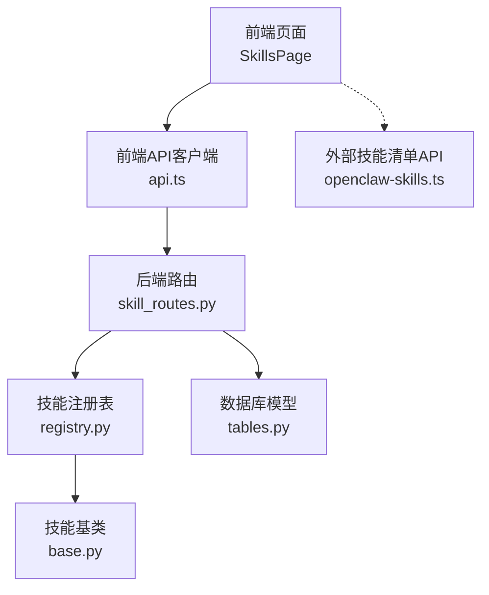
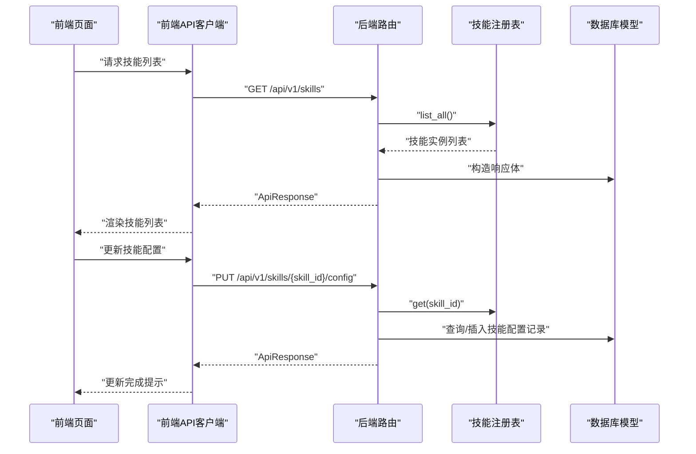
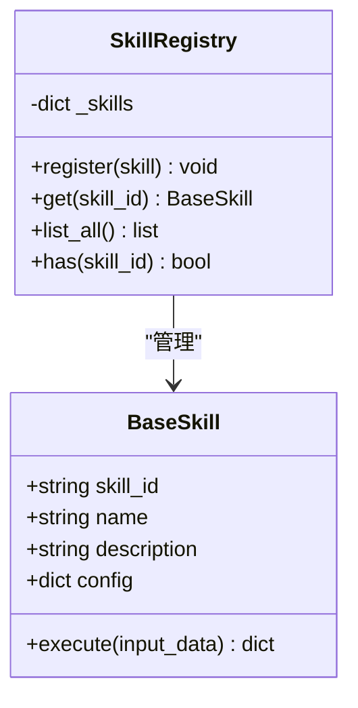
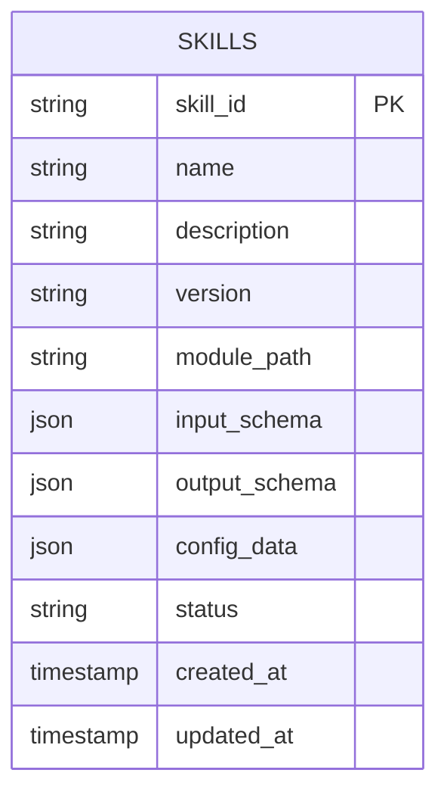
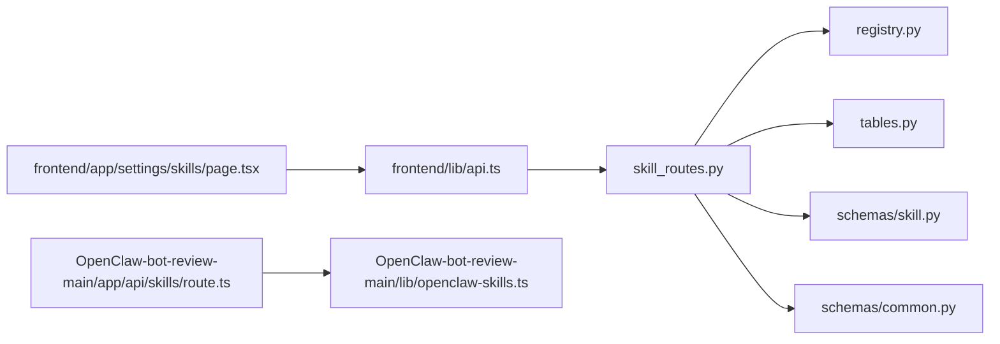

# 技能管理API

<cite>
**本文引用的文件**
- [backend/app/api/skill_routes.py](file://backend/app/api/skill_routes.py)
- [backend/app/schemas/skill.py](file://backend/app/schemas/skill.py)
- [backend/app/schemas/common.py](file://backend/app/schemas/common.py)
- [backend/app/models/tables.py](file://backend/app/models/tables.py)
- [backend/app/skills/base.py](file://backend/app/skills/base.py)
- [backend/app/skills/registry.py](file://backend/app/skills/registry.py)
- [backend/app/core/exceptions.py](file://backend/app/core/exceptions.py)
- [frontend/lib/api.ts](file://frontend/lib/api.ts)
- [frontend/app/settings/skills/page.tsx](file://frontend/app/settings/skills/page.tsx)
- [OpenClaw-bot-review-main/app/api/skills/route.ts](file://OpenClaw-bot-review-main/app/api/skills/route.ts)
- [OpenClaw-bot-review-main/lib/openclaw-skills.ts](file://OpenClaw-bot-review-main/lib/openclaw-skills.ts)
- [Notice.md](file://Notice.md)
</cite>

## 目录
1. [简介](#简介)
2. [项目结构](#项目结构)
3. [核心组件](#核心组件)
4. [架构总览](#架构总览)
5. [详细组件分析](#详细组件分析)
6. [依赖关系分析](#依赖关系分析)
7. [性能考量](#性能考量)
8. [故障排查指南](#故障排查指南)
9. [结论](#结论)
10. [附录](#附录)

## 简介
本文件面向技能管理API的使用者与开发者，系统化说明技能注册、配置、查询与版本管理的接口设计；文档化技能清单文件（SKILL.md）的结构规范；解释技能配置的动态加载机制（缓存策略、热更新支持与兼容性检查）；阐明技能执行协议、输入输出格式与错误处理机制；并提供技能权限管理、访问控制与安全验证流程的指导。最后给出技能开发者的API集成指南与最佳实践。

## 项目结构
技能管理API由三层组成：
- 后端FastAPI路由层：提供技能列表查询与配置更新接口，并持久化配置到数据库。
- 技能运行时层：基于技能基类与注册表，统一管理技能实例与执行协议。
- 前端展示与集成层：提供技能管理页面与API客户端封装，支持技能列表展示与配置更新。

图表来源
- [backend/app/api/skill_routes.py:1-61](file://backend/app/api/skill_routes.py#L1-L61)
- [backend/app/skills/registry.py:1-37](file://backend/app/skills/registry.py#L1-L37)
- [backend/app/skills/base.py:1-37](file://backend/app/skills/base.py#L1-L37)
- [backend/app/models/tables.py:183-200](file://backend/app/models/tables.py#L183-L200)
- [frontend/lib/api.ts:86-110](file://frontend/lib/api.ts#L86-L110)
- [frontend/app/settings/skills/page.tsx:1-81](file://frontend/app/settings/skills/page.tsx#L1-L81)
- [OpenClaw-bot-review-main/lib/openclaw-skills.ts:111-162](file://OpenClaw-bot-review-main/lib/openclaw-skills.ts#L111-L162)

章节来源
- [backend/app/api/skill_routes.py:1-61](file://backend/app/api/skill_routes.py#L1-L61)
- [backend/app/skills/registry.py:1-37](file://backend/app/skills/registry.py#L1-L37)
- [backend/app/skills/base.py:1-37](file://backend/app/skills/base.py#L1-L37)
- [backend/app/models/tables.py:183-200](file://backend/app/models/tables.py#L183-L200)
- [frontend/lib/api.ts:86-110](file://frontend/lib/api.ts#L86-L110)
- [frontend/app/settings/skills/page.tsx:1-81](file://frontend/app/settings/skills/page.tsx#L1-L81)
- [OpenClaw-bot-review-main/lib/openclaw-skills.ts:111-162](file://OpenClaw-bot-review-main/lib/openclaw-skills.ts#L111-L162)

## 核心组件
- 技能路由层
  - 列出所有已注册技能并返回统一响应体。
  - 更新指定技能的配置数据并持久化到数据库。
- 技能注册表
  - 提供技能注册、查询、枚举与存在性判断。
- 技能基类
  - 定义技能抽象接口与执行协议。
- 数据模型
  - 技能配置持久化模型，包含技能标识、名称、描述、版本、模块路径、输入输出模式、配置数据与状态等字段。
- 前端API客户端
  - 封装技能列表与配置更新请求，统一处理响应体与错误。
- 外部技能清单工具
  - 解析本地与扩展目录中的技能清单文件，生成技能信息集合。

章节来源
- [backend/app/api/skill_routes.py:17-61](file://backend/app/api/skill_routes.py#L17-L61)
- [backend/app/schemas/skill.py:6-22](file://backend/app/schemas/skill.py#L6-L22)
- [backend/app/schemas/common.py:7-27](file://backend/app/schemas/common.py#L7-L27)
- [backend/app/models/tables.py:183-200](file://backend/app/models/tables.py#L183-L200)
- [backend/app/skills/base.py:16-37](file://backend/app/skills/base.py#L16-L37)
- [backend/app/skills/registry.py:10-37](file://backend/app/skills/registry.py#L10-L37)
- [frontend/lib/api.ts:86-110](file://frontend/lib/api.ts#L86-L110)
- [OpenClaw-bot-review-main/lib/openclaw-skills.ts:111-162](file://OpenClaw-bot-review-main/lib/openclaw-skills.ts#L111-L162)

## 架构总览
技能管理API采用“路由-注册表-模型-前端”的分层架构。后端通过FastAPI提供REST接口，技能注册表集中管理技能实例，数据库模型持久化技能配置；前端通过API客户端调用后端接口并渲染技能管理页面。

图表来源
- [backend/app/api/skill_routes.py:17-61](file://backend/app/api/skill_routes.py#L17-L61)
- [backend/app/skills/registry.py:22-29](file://backend/app/skills/registry.py#L22-L29)
- [backend/app/models/tables.py:183-200](file://backend/app/models/tables.py#L183-L200)
- [frontend/lib/api.ts:97-110](file://frontend/lib/api.ts#L97-L110)

## 详细组件分析

### 技能清单文件结构规范（SKILL.md）
- 文件位置
  - 内置技能：在包内特定目录下。
  - 扩展技能：在扩展目录下，支持单文件或子目录形式。
  - 自定义技能：在用户工作区的技能目录下。
- 清单解析
  - 使用“前言”（frontmatter）提取技能元信息，如名称、描述、表情符号等。
  - 记录技能来源（内置/扩展/自定义）、物理路径与被哪些代理使用过。
- 用途
  - 用于前端技能管理页面展示与外部技能清单API的输出。

章节来源
- [OpenClaw-bot-review-main/lib/openclaw-skills.ts:30-72](file://OpenClaw-bot-review-main/lib/openclaw-skills.ts#L30-L72)
- [OpenClaw-bot-review-main/lib/openclaw-skills.ts:111-162](file://OpenClaw-bot-review-main/lib/openclaw-skills.ts#L111-L162)

### 技能注册与执行协议
- 注册
  - 技能通过注册表集中管理，支持注册、查询、枚举与存在性判断。
- 执行协议
  - 技能需实现异步执行方法，接收结构化输入并返回结构化输出。
- 版本管理
  - 技能对象与数据库记录均维护版本字段，便于后续演进与兼容性检查。

图表来源
- [backend/app/skills/base.py:16-37](file://backend/app/skills/base.py#L16-L37)
- [backend/app/skills/registry.py:10-37](file://backend/app/skills/registry.py#L10-L37)

章节来源
- [backend/app/skills/base.py:16-37](file://backend/app/skills/base.py#L16-L37)
- [backend/app/skills/registry.py:10-37](file://backend/app/skills/registry.py#L10-L37)

### 技能配置持久化与版本管理
- 数据模型
  - 技能配置记录包含技能ID、名称、描述、版本、模块路径、输入输出模式、配置数据与状态等字段。
- 版本字段
  - 技能对象与数据库记录均维护版本字段，便于后续演进与兼容性检查。
- 查询与更新
  - 列表接口返回技能基础信息与当前配置；更新接口支持增量更新配置数据并持久化。

图表来源
- [backend/app/models/tables.py:183-200](file://backend/app/models/tables.py#L183-L200)

章节来源
- [backend/app/models/tables.py:183-200](file://backend/app/models/tables.py#L183-L200)
- [backend/app/api/skill_routes.py:17-61](file://backend/app/api/skill_routes.py#L17-L61)

### 技能管理API接口定义
- 获取技能列表
  - 方法与路径：GET /api/v1/skills
  - 请求参数：无
  - 响应体：统一响应包装，data包含技能数组，每项含技能ID、名称、描述、版本、配置数据与状态
- 更新技能配置
  - 方法与路径：PUT /api/v1/skills/{skill_id}/config
  - 请求体：包含配置数据的字典
  - 响应体：统一响应包装，data包含技能ID与更新标记

章节来源
- [backend/app/api/skill_routes.py:17-61](file://backend/app/api/skill_routes.py#L17-L61)
- [backend/app/schemas/skill.py:19-22](file://backend/app/schemas/skill.py#L19-L22)
- [backend/app/schemas/common.py:7-27](file://backend/app/schemas/common.py#L7-L27)

### 前端集成与页面展示
- 技能管理页面
  - 通过API客户端拉取技能列表并渲染，展示技能名称、ID、版本、状态与配置详情。
- API客户端
  - 封装统一的请求函数与错误处理，提供技能列表与配置更新方法。

章节来源
- [frontend/app/settings/skills/page.tsx:1-81](file://frontend/app/settings/skills/page.tsx#L1-L81)
- [frontend/lib/api.ts:86-110](file://frontend/lib/api.ts#L86-L110)

### 外部技能清单API
- 接口
  - GET /api/skills（Next.js路由）
  - 返回技能清单与代理映射信息
- 实现
  - 扫描内置、扩展与自定义技能目录，解析SKILL.md，统计最近会话中使用的技能并标注使用方。

章节来源
- [OpenClaw-bot-review-main/app/api/skills/route.ts:1-11](file://OpenClaw-bot-review-main/app/api/skills/route.ts#L1-L11)
- [OpenClaw-bot-review-main/lib/openclaw-skills.ts:111-162](file://OpenClaw-bot-review-main/lib/openclaw-skills.ts#L111-L162)

## 依赖关系分析
- 路由依赖注册表与数据库模型，确保技能查询与配置更新的一致性。
- 前端API客户端依赖后端统一响应体约定，保证错误与数据结构一致。
- 外部技能清单工具独立于后端，但共享相同的清单文件规范。

图表来源
- [backend/app/api/skill_routes.py:1-61](file://backend/app/api/skill_routes.py#L1-L61)
- [backend/app/skills/registry.py:1-37](file://backend/app/skills/registry.py#L1-L37)
- [backend/app/models/tables.py:183-200](file://backend/app/models/tables.py#L183-L200)
- [backend/app/schemas/skill.py:1-22](file://backend/app/schemas/skill.py#L1-L22)
- [backend/app/schemas/common.py:1-27](file://backend/app/schemas/common.py#L1-L27)
- [frontend/lib/api.ts:1-110](file://frontend/lib/api.ts#L1-L110)
- [frontend/app/settings/skills/page.tsx:1-81](file://frontend/app/settings/skills/page.tsx#L1-L81)
- [OpenClaw-bot-review-main/app/api/skills/route.ts:1-11](file://OpenClaw-bot-review-main/app/api/skills/route.ts#L1-L11)
- [OpenClaw-bot-review-main/lib/openclaw-skills.ts:1-162](file://OpenClaw-bot-review-main/lib/openclaw-skills.ts#L1-L162)

## 性能考量
- 缓存策略
  - 建议在技能注册表上增加内存缓存，避免频繁扫描与解析清单文件。
- 热更新支持
  - 在变更配置后，优先更新内存中的技能实例配置，再持久化到数据库，减少不一致窗口。
- 兼容性检查
  - 对输入/输出模式与配置数据进行校验，失败时返回明确错误码并记录日志。
- 错误处理
  - 遵循统一异常体系与前后端约定，避免将内部堆栈暴露给前端。

章节来源
- [backend/app/core/exceptions.py:1-125](file://backend/app/core/exceptions.py#L1-L125)
- [Notice.md:316-417](file://Notice.md#L316-L417)

## 故障排查指南
- 常见错误与处理
  - 技能不存在：抛出技能不存在错误，前端显示相应提示。
  - 技能执行失败：捕获执行异常并返回统一错误响应，记录日志以便追踪。
  - 配置更新失败：校验请求体与数据库一致性，返回错误码与细节。
- 前端四态处理
  - 正确处理加载、空数据、错误与成功四种状态，避免吞掉异常。

章节来源
- [backend/app/core/exceptions.py:38-43](file://backend/app/core/exceptions.py#L38-L43)
- [backend/app/core/exceptions.py:93-98](file://backend/app/core/exceptions.py#L93-L98)
- [Notice.md:316-417](file://Notice.md#L316-L417)

## 结论
技能管理API以统一的执行协议、清晰的清单规范与持久化模型为基础，结合前端展示与外部清单工具，形成从发现、注册、配置到执行的完整闭环。通过遵循统一的错误处理与可观测性要求，可确保系统的稳定性与可维护性。

## 附录

### 技能清单文件（SKILL.md）结构示例
- 前言字段
  - 名称：用于显示的技能名称
  - 描述：技能功能简述
  - 表情符号：用于界面展示的表情符号
- 内容
  - 技能详细说明与使用指南
- 来源与位置
  - 记录技能来源（内置/扩展/自定义）与物理路径

章节来源
- [OpenClaw-bot-review-main/lib/openclaw-skills.ts:30-62](file://OpenClaw-bot-review-main/lib/openclaw-skills.ts#L30-L62)

### 技能执行协议要点
- 输入输出
  - 输入与输出均为结构化字典，便于跨组件传递与校验。
- 异步执行
  - 执行方法为异步，适配I/O密集型与外部服务调用场景。
- 配置注入
  - 通过构造函数注入配置，支持运行时动态更新。

章节来源
- [backend/app/skills/base.py:23-36](file://backend/app/skills/base.py#L23-L36)

### 动态加载机制与热更新建议
- 加载机制
  - 通过注册表集中管理技能实例，避免重复加载与资源浪费。
- 缓存策略
  - 内存缓存技能清单与配置，降低磁盘与网络IO开销。
- 热更新
  - 更新配置后先刷新内存实例，再持久化，确保一致性与最小停机时间。
- 兼容性检查
  - 对输入/输出模式与配置进行严格校验，失败即回滚并记录日志。

章节来源
- [backend/app/skills/registry.py:10-37](file://backend/app/skills/registry.py#L10-L37)
- [backend/app/models/tables.py:183-200](file://backend/app/models/tables.py#L183-L200)
- [Notice.md:316-417](file://Notice.md#L316-L417)

### 权限管理、访问控制与安全验证
- 权限与访问控制
  - 建议在路由层增加鉴权中间件，限制对技能配置更新的访问范围。
- 安全验证
  - 对请求体进行白名单校验，禁止注入非法键值；对外部调用设置超时与重试上限。
- 日志与追踪
  - 记录操作审计日志，确保可追溯性与合规性。

章节来源
- [Notice.md:316-417](file://Notice.md#L316-L417)

### 开发者API集成指南
- 前端集成
  - 使用API客户端提供的方法进行技能列表与配置更新，统一处理响应体与错误。
- 参数传递
  - 保持输入输出为结构化字典，便于跨语言与跨组件协作。
- 结果处理
  - 前端根据统一响应体解析data字段，展示技能信息与配置详情。

章节来源
- [frontend/lib/api.ts:86-110](file://frontend/lib/api.ts#L86-L110)
- [frontend/app/settings/skills/page.tsx:1-81](file://frontend/app/settings/skills/page.tsx#L1-L81)

### 最佳实践与性能优化建议
- 最小化依赖
  - 仅在必要时加载与解析清单文件，减少启动与运行时开销。
- 并发与批处理
  - 对批量配置更新采用事务提交，确保原子性与一致性。
- 可观测性
  - 为技能执行添加结构化日志与指标采集，便于问题定位与性能分析。

章节来源
- [Notice.md:342-371](file://Notice.md#L342-L371)