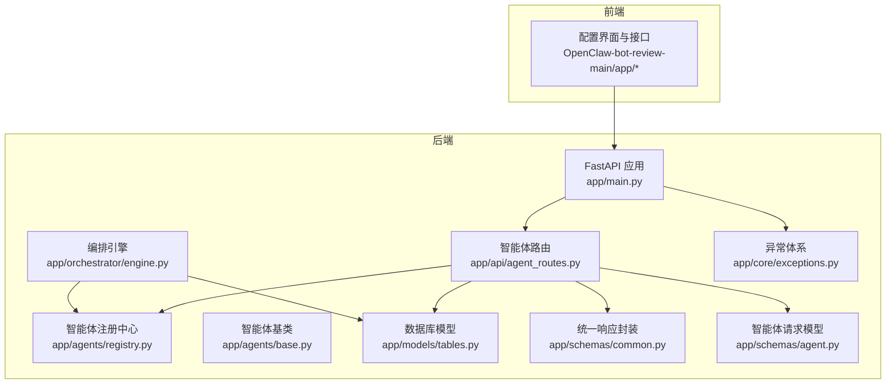
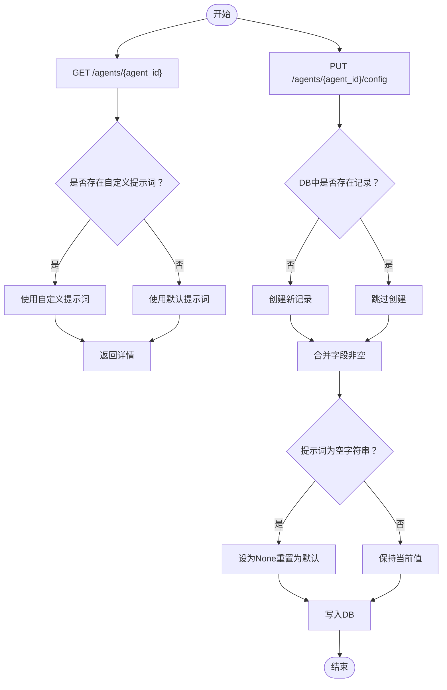
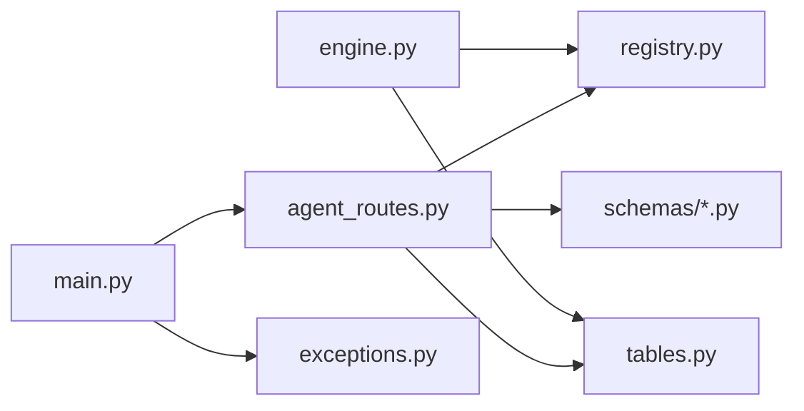

# 智能体配置API

<cite>
**本文引用的文件**
- [backend/app/api/agent_routes.py](file://backend/app/api/agent_routes.py)
- [backend/app/schemas/agent.py](file://backend/app/schemas/agent.py)
- [backend/app/schemas/common.py](file://backend/app/schemas/common.py)
- [backend/app/models/tables.py](file://backend/app/models/tables.py)
- [backend/app/agents/registry.py](file://backend/app/agents/registry.py)
- [backend/app/agents/base.py](file://backend/app/agents/base.py)
- [backend/app/main.py](file://backend/app/main.py)
- [backend/app/orchestrator/engine.py](file://backend/app/orchestrator/engine.py)
- [backend/app/core/exceptions.py](file://backend/app/core/exceptions.py)
- [ARCHITECTURE.md](file://ARCHITECTURE.md)
</cite>

## 目录
1. [简介](#简介)
2. [项目结构](#项目结构)
3. [核心组件](#核心组件)
4. [架构总览](#架构总览)
5. [详细组件分析](#详细组件分析)
6. [依赖关系分析](#依赖关系分析)
7. [性能考量](#性能考量)
8. [故障排查指南](#故障排查指南)
9. [结论](#结论)
10. [附录](#附录)

## 简介
本文件面向开发者与运维人员，系统化说明“智能体配置管理API”的设计与使用，覆盖智能体注册、查询、更新与删除的完整流程；文档化智能体清单文件的格式规范、字段定义与验证规则；阐述配置的动态加载机制、热更新支持与版本管理策略；提供YAML/JSON配置示例与最佳实践；解释智能体生命周期管理、依赖关系处理与冲突检测机制；并给出权限控制、访问验证与安全注意事项，以及自定义智能体开发的API集成指南。

## 项目结构
后端采用FastAPI框架，路由集中在API层，模型与数据库映射位于ORM层，智能体注册与基类位于agents层，编排引擎负责工作流调度与执行。前端存在独立的配置管理界面与接口，用于动态调整模型参数与查看统计。

图表来源
- [backend/app/main.py:60-142](file://backend/app/main.py#L60-L142)
- [backend/app/api/agent_routes.py:1-115](file://backend/app/api/agent_routes.py#L1-L115)
- [backend/app/agents/registry.py:1-40](file://backend/app/agents/registry.py#L1-L40)
- [backend/app/models/tables.py:160-181](file://backend/app/models/tables.py#L160-L181)
- [backend/app/schemas/common.py:7-27](file://backend/app/schemas/common.py#L7-L27)
- [backend/app/schemas/agent.py:1-29](file://backend/app/schemas/agent.py#L1-L29)
- [backend/app/orchestrator/engine.py:89-285](file://backend/app/orchestrator/engine.py#L89-L285)
- [backend/app/core/exceptions.py:1-125](file://backend/app/core/exceptions.py#L1-L125)

章节来源
- [backend/app/main.py:60-142](file://backend/app/main.py#L60-L142)
- [backend/app/api/agent_routes.py:1-115](file://backend/app/api/agent_routes.py#L1-L115)
- [backend/app/agents/registry.py:1-40](file://backend/app/agents/registry.py#L1-L40)
- [backend/app/models/tables.py:160-181](file://backend/app/models/tables.py#L160-L181)
- [backend/app/schemas/common.py:7-27](file://backend/app/schemas/common.py#L7-L27)
- [backend/app/schemas/agent.py:1-29](file://backend/app/schemas/agent.py#L1-L29)
- [backend/app/orchestrator/engine.py:89-285](file://backend/app/orchestrator/engine.py#L89-L285)
- [backend/app/core/exceptions.py:1-125](file://backend/app/core/exceptions.py#L1-L125)

## 核心组件
- API路由层：提供智能体清单查询、详情查询、配置更新等REST接口。
- 智能体注册中心：集中管理已注册智能体实例，提供按ID检索与列表能力。
- 数据模型层：持久化智能体配置（含模型参数、提示词模板、重试配置等）。
- 编排引擎：工作流执行时从数据库解析有效系统提示词，支持降级与超时处理。
- 统一响应与异常：统一API响应格式与错误码映射，便于前端与监控系统消费。

章节来源
- [backend/app/api/agent_routes.py:17-115](file://backend/app/api/agent_routes.py#L17-L115)
- [backend/app/agents/registry.py:10-40](file://backend/app/agents/registry.py#L10-L40)
- [backend/app/models/tables.py:160-181](file://backend/app/models/tables.py#L160-L181)
- [backend/app/orchestrator/engine.py:245-263](file://backend/app/orchestrator/engine.py#L245-L263)
- [backend/app/schemas/common.py:7-27](file://backend/app/schemas/common.py#L7-L27)
- [backend/app/core/exceptions.py:31-36](file://backend/app/core/exceptions.py#L31-L36)

## 架构总览
下图展示智能体配置API的端到端流程：客户端通过路由层发起请求，路由层调用注册中心与数据库模型，返回统一响应；编排引擎在执行阶段按优先级解析系统提示词。

```mermaid
sequenceDiagram
participant Client as "客户端"
participant API as "Agent路由<br/>agent_routes.py"
participant Reg as "注册中心<br/>registry.py"
participant DB as "数据库模型<br/>tables.py"
participant Resp as "统一响应<br/>common.py"
Client->>API : GET /api/v1/agents
API->>Reg : list_all()
API->>DB : 批量查询自定义提示词
API-->>Resp : ApiResponse(data=agents)
Resp-->>Client : 清单数据
Client->>API : GET /api/v1/agents/{agent_id}
API->>Reg : get(agent_id)
API->>DB : 查询AgentModel
API-->>Resp : ApiResponse(data=agent详情)
Resp-->>Client : 详情数据
Client->>API : PUT /api/v1/agents/{agent_id}/config
API->>Reg : get(agent_id)
API->>DB : upsert AgentModel
API-->>Resp : ApiResponse(data={agent_id, updated_fields})
Resp-->>Client : 更新结果
```

图表来源
- [backend/app/api/agent_routes.py:17-115](file://backend/app/api/agent_routes.py#L17-L115)
- [backend/app/agents/registry.py:23-32](file://backend/app/agents/registry.py#L23-L32)
- [backend/app/models/tables.py:160-181](file://backend/app/models/tables.py#L160-L181)
- [backend/app/schemas/common.py:7-27](file://backend/app/schemas/common.py#L7-L27)

## 详细组件分析

### API接口定义与流程
- 列举智能体清单
  - 方法与路径：GET /api/v1/agents
  - 功能：返回已注册智能体的简要信息，包含是否具有自定义提示词标记。
  - 数据来源：注册中心与数据库批量查询。
- 获取智能体详情
  - 方法与路径：GET /api/v1/agents/{agent_id}
  - 功能：返回智能体的名称、描述、版本、模型配置、提示词模板（优先自定义，否则默认）、重试配置与状态。
  - 数据来源：注册中心与数据库查询。
- 更新智能体配置
  - 方法与路径：PUT /api/v1/agents/{agent_id}/config
  - 请求体字段：model_config_data、prompt_template、retry_config
  - 行为：若数据库中不存在记录则创建；仅更新非空字段；空字符串表示“重置为默认”。
  - 返回：包含被更新的字段名列表。

图表来源
- [backend/app/api/agent_routes.py:46-115](file://backend/app/api/agent_routes.py#L46-L115)
- [backend/app/models/tables.py:160-181](file://backend/app/models/tables.py#L160-L181)

章节来源
- [backend/app/api/agent_routes.py:17-115](file://backend/app/api/agent_routes.py#L17-L115)
- [backend/app/schemas/agent.py:24-29](file://backend/app/schemas/agent.py#L24-L29)

### 智能体清单文件格式规范
- 文件位置与用途：位于 manifests/agents 下，作为系统启动时的静态清单，驱动注册中心注册智能体。
- 关键字段
  - agent_id：全局唯一标识
  - name：显示名称
  - description：描述
  - version：版本号
  - module：模块路径（可导入）
  - model：模型配置（provider、name、temperature、max_tokens 等）
  - prompt_template：系统提示词模板
  - input_schema / output_schema：输入输出JSON Schema
  - required_skills：所需技能列表
  - retry：重试策略（max_attempts、backoff_seconds）
  - fallback：降级策略（strategy、default）
- 验证规则
  - manifest格式需符合对应meta-schema
  - module路径必须可导入
  - agent_id全局唯一
  - 工作流引用的agent必须已注册
  - input_mapping路径需为合法JSONPath
  - 运行时输入/输出需符合各自schema

章节来源
- [ARCHITECTURE.md:855-930](file://ARCHITECTURE.md#L855-L930)
- [ARCHITECTURE.md:985-1005](file://ARCHITECTURE.md#L985-L1005)

### 动态加载机制、热更新与版本管理
- 动态加载
  - 启动时注册中心加载各智能体实现并登记；运行期通过注册中心按ID获取实例。
- 热更新
  - 提示词与模型配置可通过API更新并持久化；编排引擎在执行前解析有效提示词（优先自定义，否则默认）。
- 版本管理
  - 清单文件包含version字段；API返回固定版本号（当前实现），可在后续扩展中支持多版本并行与灰度。

章节来源
- [backend/app/main.py:32-40](file://backend/app/main.py#L32-L40)
- [backend/app/agents/registry.py:10-40](file://backend/app/agents/registry.py#L10-L40)
- [backend/app/orchestrator/engine.py:245-263](file://backend/app/orchestrator/engine.py#L245-L263)
- [backend/app/api/agent_routes.py:38-42](file://backend/app/api/agent_routes.py#L38-L42)

### 配置示例与字段说明
- YAML示例（摘自架构文档）
  - 包含agent_id、name、description、version、module、model、prompt_template、input_schema、output_schema、required_skills、retry、fallback等字段。
- JSON示例（来自API请求体）
  - model_config_data：模型参数对象
  - prompt_template：提示词模板；空字符串表示“重置为默认”
  - retry_config：重试配置对象
- 字段说明
  - 必填字段：agent_id（注册中心与数据库主键）
  - 可选字段：name、description、model_config_data、prompt_template、retry_config、required_skills、status等
  - 默认值：version默认“1.0.0”，status默认“active”，prompt_template默认None（表示使用默认）

章节来源
- [ARCHITECTURE.md:855-930](file://ARCHITECTURE.md#L855-L930)
- [backend/app/schemas/agent.py:24-29](file://backend/app/schemas/agent.py#L24-L29)
- [backend/app/models/tables.py:167-176](file://backend/app/models/tables.py#L167-L176)
- [backend/app/api/agent_routes.py:100-106](file://backend/app/api/agent_routes.py#L100-L106)

### 生命周期管理、依赖关系与冲突检测
- 生命周期
  - 注册：系统启动时导入并注册智能体
  - 运行：编排引擎按节点顺序执行，支持降级与超时处理
  - 终止：节点失败（必要节点）导致任务失败，非必要节点降级继续
- 依赖关系
  - 工作流节点依赖于已注册的智能体
  - 智能体可声明所需技能，工作流需满足依赖
- 冲突检测
  - agent_id全局唯一
  - input_mapping路径合法性在工作流加载时校验
  - schema校验失败触发降级策略

章节来源
- [backend/app/main.py:32-40](file://backend/app/main.py#L32-L40)
- [backend/app/orchestrator/engine.py:138-176](file://backend/app/orchestrator/engine.py#L138-L176)
- [ARCHITECTURE.md:993-1005](file://ARCHITECTURE.md#L993-L1005)

### 权限控制、访问验证与安全
- 访问控制
  - 当前应用未内置鉴权中间件，CORS允许任意来源；生产环境建议收紧CORS并接入鉴权体系
- 错误处理
  - 统一异常体系将业务错误映射为HTTP状态码，便于前端与网关处理
- 安全建议
  - 限制对配置更新接口的访问范围
  - 对敏感字段（如模型密钥）进行加密存储与最小暴露
  - 对输入输出进行严格schema校验，防止注入与越界

章节来源
- [backend/app/main.py:67-84](file://backend/app/main.py#L67-L84)
- [backend/app/core/exceptions.py:1-125](file://backend/app/core/exceptions.py#L1-L125)

### 自定义智能体开发与API集成指南
- 开发步骤
  - 在agents目录实现继承BaseAgent的类，定义agent_id、name、description、default_system_prompt与execute方法
  - 在清单文件中声明module路径与配置
  - 启动时自动注册；或在main中显式注册
- API集成
  - 使用GET /api/v1/agents查询可用智能体
  - 使用GET /api/v1/agents/{agent_id}获取详情
  - 使用PUT /api/v1/agents/{agent_id}/config更新模型参数、提示词与重试配置
- 最佳实践
  - 明确输入输出schema，确保运行时校验
  - 合理设置重试与超时，避免阻塞
  - 使用fallback策略保证非关键节点降级可用

章节来源
- [backend/app/agents/base.py:49-99](file://backend/app/agents/base.py#L49-L99)
- [backend/app/main.py:32-40](file://backend/app/main.py#L32-L40)
- [backend/app/api/agent_routes.py:17-115](file://backend/app/api/agent_routes.py#L17-L115)

## 依赖关系分析
- 组件耦合
  - 路由层依赖注册中心与数据库模型
  - 编排引擎依赖注册中心与数据库模型，负责运行时提示词解析
  - 统一响应与异常为上层提供一致的错误与返回格式
- 外部依赖
  - FastAPI、SQLAlchemy、Pydantic
- 潜在循环依赖
  - 未见直接循环依赖；注册中心与引擎通过接口解耦

图表来源
- [backend/app/api/agent_routes.py:1-115](file://backend/app/api/agent_routes.py#L1-L115)
- [backend/app/agents/registry.py:1-40](file://backend/app/agents/registry.py#L1-L40)
- [backend/app/models/tables.py:160-181](file://backend/app/models/tables.py#L160-L181)
- [backend/app/orchestrator/engine.py:89-285](file://backend/app/orchestrator/engine.py#L89-L285)
- [backend/app/schemas/common.py:7-27](file://backend/app/schemas/common.py#L7-L27)
- [backend/app/schemas/agent.py:1-29](file://backend/app/schemas/agent.py#L1-L29)
- [backend/app/main.py:60-142](file://backend/app/main.py#L60-L142)
- [backend/app/core/exceptions.py:1-125](file://backend/app/core/exceptions.py#L1-L125)

章节来源
- [backend/app/api/agent_routes.py:1-115](file://backend/app/api/agent_routes.py#L1-L115)
- [backend/app/agents/registry.py:1-40](file://backend/app/agents/registry.py#L1-L40)
- [backend/app/models/tables.py:160-181](file://backend/app/models/tables.py#L160-L181)
- [backend/app/orchestrator/engine.py:89-285](file://backend/app/orchestrator/engine.py#L89-L285)
- [backend/app/schemas/common.py:7-27](file://backend/app/schemas/common.py#L7-L27)
- [backend/app/schemas/agent.py:1-29](file://backend/app/schemas/agent.py#L1-L29)
- [backend/app/main.py:60-142](file://backend/app/main.py#L60-L142)
- [backend/app/core/exceptions.py:1-125](file://backend/app/core/exceptions.py#L1-L125)

## 性能考量
- 批量查询优化：清单接口先从注册中心获取列表，再批量查询数据库中的自定义提示词，减少多次往返。
- 运行时解析：编排引擎在每次节点执行前解析有效提示词，避免重复计算。
- 超时与降级：为单节点执行设置超时，失败时尝试降级，保障整体吞吐。
- 建议：对频繁查询的配置增加缓存层；对长耗时操作采用异步任务队列。

## 故障排查指南
- 常见错误与状态码
  - 404：智能体不存在（AgentNotFoundError）
  - 400：请求参数或配置错误（ValidationError、ConfigError）
  - 502：外部服务调用失败（LLM/外部API）
  - 504：执行超时（AgentTimeoutError）
  - 500：内部错误（InternalError）
- 排查步骤
  - 确认agent_id正确且已注册
  - 检查数据库中AgentModel记录是否存在与字段是否正确
  - 查看编排日志与SSE事件，定位失败节点
  - 校验输入输出schema与JSONPath映射

章节来源
- [backend/app/core/exceptions.py:31-36](file://backend/app/core/exceptions.py#L31-L36)
- [backend/app/main.py:87-129](file://backend/app/main.py#L87-L129)
- [backend/app/orchestrator/engine.py:176-196](file://backend/app/orchestrator/engine.py#L176-L196)

## 结论
本API围绕“清单+注册中心+数据库持久化+编排引擎”的架构，提供了完整的智能体生命周期管理能力。通过统一的响应与异常体系、严格的schema校验与降级策略，系统在易用性与稳定性之间取得平衡。建议在生产环境中强化鉴权与审计、引入配置缓存与异步处理，并持续完善版本与灰度发布机制。

## 附录
- 统一响应结构
  - 成功：code=0，message="ok"，data为具体数据
  - 失败：返回ApiErrorResponse，包含code、message、details
- 错误码映射
  - 1xxx：客户端错误（400）
  - 2xxx：冲突（409）
  - 3xxx：外部/执行错误（502），其中超时映射为504
  - 4xxx：配置错误（400）
  - 5xxx：内部错误（500）

章节来源
- [backend/app/schemas/common.py:7-27](file://backend/app/schemas/common.py#L7-L27)
- [backend/app/main.py:87-129](file://backend/app/main.py#L87-L129)