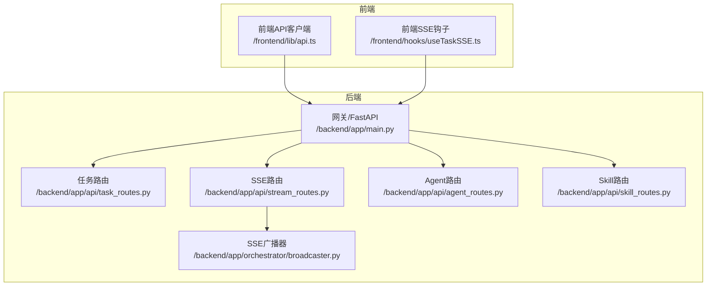
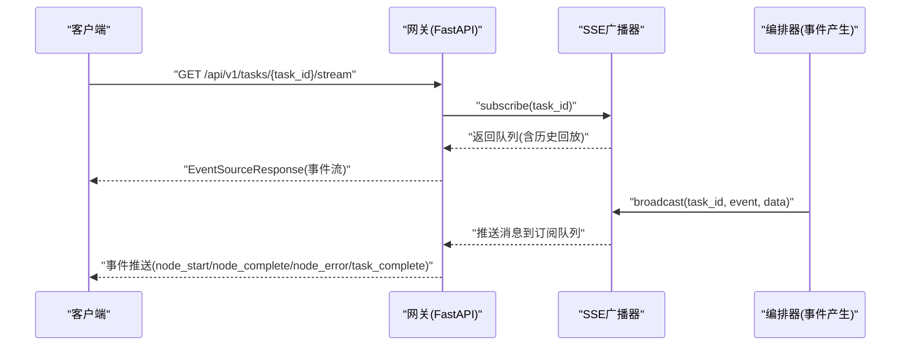
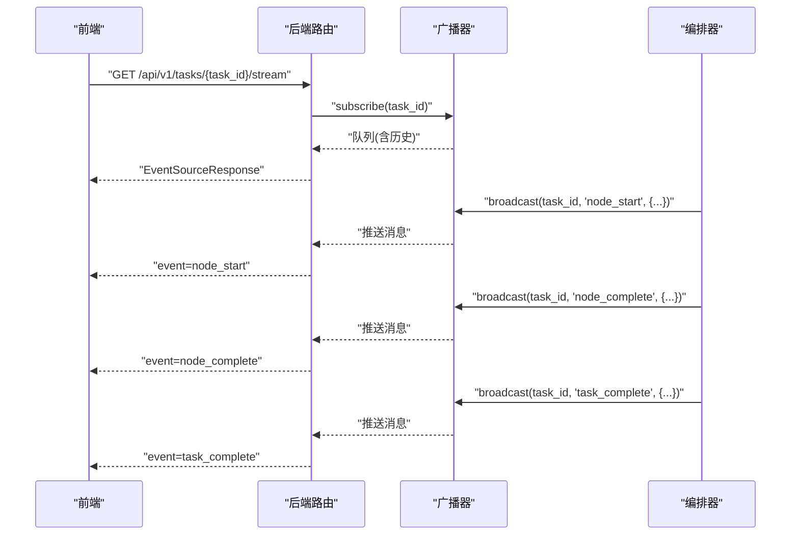
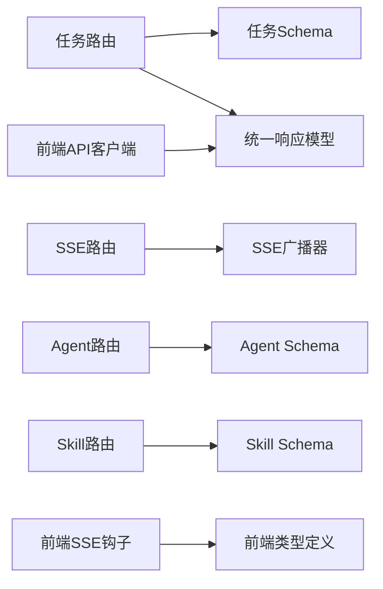

# API接口文档

<cite>
**本文引用的文件**
- [backend/app/main.py](file://backend/app/main.py)
- [backend/app/api/task_routes.py](file://backend/app/api/task_routes.py)
- [backend/app/api/stream_routes.py](file://backend/app/api/stream_routes.py)
- [backend/app/api/agent_routes.py](file://backend/app/api/agent_routes.py)
- [backend/app/api/skill_routes.py](file://backend/app/api/skill_routes.py)
- [backend/app/schemas/common.py](file://backend/app/schemas/common.py)
- [backend/app/schemas/task.py](file://backend/app/schemas/task.py)
- [backend/app/schemas/agent.py](file://backend/app/schemas/agent.py)
- [backend/app/schemas/skill.py](file://backend/app/schemas/skill.py)
- [backend/app/core/exceptions.py](file://backend/app/core/exceptions.py)
- [backend/app/orchestrator/broadcaster.py](file://backend/app/orchestrator/broadcaster.py)
- [frontend/lib/api.ts](file://frontend/lib/api.ts)
- [frontend/hooks/useTaskSSE.ts](file://frontend/hooks/useTaskSSE.ts)
- [frontend/types/index.ts](file://frontend/types/index.ts)
- [ARCHITECTURE.md](file://ARCHITECTURE.md)
- [Notice.md](file://Notice.md)
</cite>

## 目录
1. [简介](#简介)
2. [项目结构](#项目结构)
3. [核心组件](#核心组件)
4. [架构总览](#架构总览)
5. [详细组件分析](#详细组件分析)
6. [依赖分析](#依赖分析)
7. [性能考量](#性能考量)
8. [故障排查指南](#故障排查指南)
9. [结论](#结论)
10. [附录](#附录)

## 简介
本文件为 HotClaw 平台的完整 API 接口参考，覆盖任务管理、实时事件流、Agent 配置与技能管理四大类 API。文档提供每个端点的 HTTP 方法、URL 模式、请求参数、响应格式、错误码说明，以及认证授权、请求/响应头、SSE 事件流的连接与消息格式、实时交互模式、版本管理、速率限制与性能优化建议。本文档同时面向 API 使用者与集成开发者。

## 项目结构
后端采用 FastAPI，API 路由位于独立模块，统一通过网关入口暴露；前端通过 HTTP + SSE 与后端交互。整体遵循“路由层只处理请求/响应、业务逻辑在服务层”的分层约束。

**图表来源**
- [backend/app/main.py:60-142](file://backend/app/main.py#L60-L142)
- [backend/app/api/task_routes.py:16-163](file://backend/app/api/task_routes.py#L16-L163)
- [backend/app/api/stream_routes.py:11-43](file://backend/app/api/stream_routes.py#L11-L43)
- [backend/app/api/agent_routes.py:14-115](file://backend/app/api/agent_routes.py#L14-L115)
- [backend/app/api/skill_routes.py:14-61](file://backend/app/api/skill_routes.py#L14-L61)
- [backend/app/orchestrator/broadcaster.py:11-94](file://backend/app/orchestrator/broadcaster.py#L11-L94)

**章节来源**
- [backend/app/main.py:60-142](file://backend/app/main.py#L60-L142)
- [ARCHITECTURE.md:414-448](file://ARCHITECTURE.md#L414-L448)

## 核心组件
- 统一响应模型：所有 API 响应遵循统一包装结构，包含 code、message、data，便于前端一致处理。
- 异常体系：后端定义了统一的异常基类与分类，全局异常处理器将业务异常映射为合适的 HTTP 状态码。
- SSE 广播器：负责按任务维度维护订阅队列、事件缓冲与历史回放，确保晚到订阅也能收到历史事件。
- 前端 API 客户端：封装基础请求、统一错误处理与端点路径，提供任务、Agent、Skill 的常用调用方法。
- 前端 SSE 钩子：封装 EventSource 订阅、事件监听与状态管理，映射后端事件到前端节点状态。

**章节来源**
- [backend/app/schemas/common.py:7-27](file://backend/app/schemas/common.py#L7-L27)
- [backend/app/core/exceptions.py:4-125](file://backend/app/core/exceptions.py#L4-L125)
- [backend/app/orchestrator/broadcaster.py:11-94](file://backend/app/orchestrator/broadcaster.py#L11-L94)
- [frontend/lib/api.ts:14-110](file://frontend/lib/api.ts#L14-L110)
- [frontend/hooks/useTaskSSE.ts:28-124](file://frontend/hooks/useTaskSSE.ts#L28-L124)

## 架构总览
HotClaw 的 API 架构遵循 Notice.md 的分层约束：路由层只做请求/响应处理，业务逻辑在服务层；SSE 事件由编排器广播至广播器，再由路由层以 EventSourceResponse 推送给前端。

**图表来源**
- [backend/app/api/stream_routes.py:14-43](file://backend/app/api/stream_routes.py#L14-L43)
- [backend/app/orchestrator/broadcaster.py:30-85](file://backend/app/orchestrator/broadcaster.py#L30-L85)
- [frontend/hooks/useTaskSSE.ts:62-120](file://frontend/hooks/useTaskSSE.ts#L62-L120)

## 详细组件分析

### 任务管理 API
- 基础路径：/api/v1/tasks
- 版本：v1
- 认证：未强制要求（跨域允许通配）
- 速率限制：未内置

1) 创建任务
- 方法：POST
- 路径：/api/v1/tasks
- 请求体：
  - positioning: string（必填，长度 5-500）
  - workflow_id: string（可选，默认 default_pipeline）
- 成功响应：data 包含 task_id、status、created_at、workflow_id
- 典型错误：1001（参数校验失败）

2) 查询任务状态
- 方法：GET
- 路径：/api/v1/tasks/{task_id}/status
- 成功响应：data 包含 task_id、status、current_node、progress（total_nodes、completed_nodes、current_node_index）、started_at、elapsed_seconds
- 典型错误：1002（任务不存在）

3) 查询任务详情
- 方法：GET
- 路径：/api/v1/tasks/{task_id}
- 成功响应：data 包含 task_id、status、input_data、workflow_id、result_data、error_message、created_at、started_at、completed_at、elapsed_seconds、total_tokens

4) 查询任务节点执行记录
- 方法：GET
- 路径：/api/v1/tasks/{task_id}/nodes
- 成功响应：data 包含 nodes 数组，每项包含 node_id、agent_id、status、input_data、output_data、started_at、completed_at、elapsed_seconds、prompt_tokens、completion_tokens、model_used、degraded、error_message

5) 分页查询任务列表
- 方法：GET
- 路径：/api/v1/tasks
- 查询参数：
  - page: int（>=1，默认1）
  - page_size: int（1-100，默认20）
  - status: string（可选）
- 成功响应：data 包含 tasks 数组（含 task_id、positioning_summary、status、created_at、elapsed_seconds）与 pagination（page、page_size、total）

请求示例（创建任务）
- 方法：POST
- URL：/api/v1/tasks
- 请求头：Content-Type: application/json
- 请求体：
  - positioning: "我是一个关注职场成长的公众号..."
  - workflow_id: "default_pipeline"

响应示例（创建任务）
- 响应体：
  - code: 0
  - message: "ok"
  - data: { task_id: "...", status: "pending", created_at: "...", workflow_id: "default_pipeline" }

错误码说明（任务相关）
- 1001：参数校验失败
- 1002：任务不存在
- 2001：任务已在运行
- 2002：工作流不存在
- 3001：LLM 调用失败
- 3003：Agent 执行超时
- 3004：Agent 执行失败
- 3005：Skill 执行失败
- 5000：内部服务器错误

**章节来源**
- [backend/app/api/task_routes.py:19-163](file://backend/app/api/task_routes.py#L19-L163)
- [backend/app/schemas/task.py:10-83](file://backend/app/schemas/task.py#L10-L83)
- [backend/app/schemas/common.py:7-27](file://backend/app/schemas/common.py#L7-L27)
- [backend/app/core/exceptions.py:17-125](file://backend/app/core/exceptions.py#L17-L125)

### 实时事件流 API（SSE）
- 基础路径：/api/v1/tasks
- 事件类型：
  - node_start：节点开始执行
  - node_complete：节点完成（含输出摘要、耗时、降级标记）
  - node_error：节点错误（含错误信息）
  - task_complete：任务完成
  - task_error：任务级错误
- 连接处理：
  - 前端通过 EventSource 订阅 /api/v1/tasks/{task_id}/stream
  - 后端使用 sse-starlette 的 EventSourceResponse
  - 广播器维护订阅队列与历史缓冲，支持晚到订阅的历史回放
  - 连接空闲超过一定时间会发送 keepalive 注释，避免代理中断
  - 断开或结束时发送结束哨兵，触发清理

SSE 事件格式
- 事件名：event
- 数据：data（JSON 字符串）
- 示例：
  - event: node_start
  - data: { node_id, agent_id, name, index, total, started_at }

前端事件映射
- node_start → 节点状态 running
- node_complete → 节点状态 completed，填充耗时、输出摘要、降级标记
- node_error → 节点状态 failed，填充错误信息
- task_complete → 任务完成，关闭连接
- task_error → 任务错误，关闭连接

**图表来源**
- [backend/app/api/stream_routes.py:14-43](file://backend/app/api/stream_routes.py#L14-L43)
- [backend/app/orchestrator/broadcaster.py:30-85](file://backend/app/orchestrator/broadcaster.py#L30-L85)
- [frontend/hooks/useTaskSSE.ts:65-111](file://frontend/hooks/useTaskSSE.ts#L65-L111)

**章节来源**
- [backend/app/api/stream_routes.py:14-43](file://backend/app/api/stream_routes.py#L14-L43)
- [backend/app/orchestrator/broadcaster.py:11-94](file://backend/app/orchestrator/broadcaster.py#L11-L94)
- [frontend/hooks/useTaskSSE.ts:28-124](file://frontend/hooks/useTaskSSE.ts#L28-L124)

### Agent 配置 API
- 基础路径：/api/v1/agents
- 版本：v1
- 认证：未强制要求（跨域允许通配）
- 速率限制：未内置

1) 列出所有 Agent
- 方法：GET
- 路径：/api/v1/agents
- 成功响应：data 包含 agents 数组，每项包含 agent_id、name、description、version、required_skills、status、has_custom_prompt

2) 获取单个 Agent 详情
- 方法：GET
- 路径：/api/v1/agents/{agent_id}
- 成功响应：data 包含 agent_id、name、description、version、model_config_data、prompt_template、prompt_source、default_system_prompt、retry_config、status
- 典型错误：1003（Agent 不存在）

3) 更新 Agent 配置
- 方法：PUT
- 路径：/api/v1/agents/{agent_id}/config
- 请求体：
  - model_config_data: object（可选）
  - prompt_template: string（可选；空字符串表示重置为默认）
  - retry_config: object（可选）
- 成功响应：data 包含 agent_id 与 updated_fields（实际更新的字段列表）

请求示例（更新 Agent 配置）
- 方法：PUT
- URL：/api/v1/agents/{agent_id}/config
- 请求头：Content-Type: application/json
- 请求体：
  - model_config_data: { ... }
  - prompt_template: "自定义提示词..."
  - retry_config: { ... }

响应示例（更新 Agent 配置）
- 响应体：
  - code: 0
  - message: "ok"
  - data: { agent_id: "...", updated_fields: ["model_config_data","prompt_template"] }

错误码说明（Agent 相关）
- 1003：Agent 不存在
- 4001：配置校验失败
- 5000：内部服务器错误

**章节来源**
- [backend/app/api/agent_routes.py:17-115](file://backend/app/api/agent_routes.py#L17-L115)
- [backend/app/schemas/agent.py:6-29](file://backend/app/schemas/agent.py#L6-L29)
- [backend/app/core/exceptions.py:31-43](file://backend/app/core/exceptions.py#L31-L43)

### 技能管理 API
- 基础路径：/api/v1/skills
- 版本：v1
- 认证：未强制要求（跨域允许通配）
- 速率限制：未内置

1) 列出所有技能
- 方法：GET
- 路径：/api/v1/skills
- 成功响应：data 包含 skills 数组，每项包含 skill_id、name、description、version、config_data、status

2) 更新技能配置
- 方法：PUT
- 路径：/api/v1/skills/{skill_id}/config
- 请求体：
  - config_data: object（可选）
- 成功响应：data 包含 skill_id 与 updated: true

请求示例（更新技能配置）
- 方法：PUT
- URL：/api/v1/skills/{skill_id}/config
- 请求头：Content-Type: application/json
- 请求体：
  - config_data: { "sources": [...], "max_items": 20 }

响应示例（更新技能配置）
- 响应体：
  - code: 0
  - message: "ok"
  - data: { skill_id: "...", updated: true }

错误码说明（技能相关）
- 1004：技能不存在
- 4001：配置校验失败
- 5000：内部服务器错误

**章节来源**
- [backend/app/api/skill_routes.py:17-61](file://backend/app/api/skill_routes.py#L17-L61)
- [backend/app/schemas/skill.py:6-22](file://backend/app/schemas/skill.py#L6-L22)
- [backend/app/core/exceptions.py:38-42](file://backend/app/core/exceptions.py#L38-L42)

### 认证与授权、请求/响应头
- 认证：未强制要求（跨域允许通配）
- 请求头：
  - Content-Type: application/json
- 响应头：
  - X-Trace-Id：后端中间件注入的追踪 ID，便于问题定位
- 健康检查：
  - GET /api/v1/health：返回 { status: "ok", version: "0.1.0" }

**章节来源**
- [backend/app/main.py:67-84](file://backend/app/main.py#L67-L84)
- [backend/app/main.py:139-142](file://backend/app/main.py#L139-L142)

### 错误处理与错误码
- 统一响应模型：ApiResponse(code, message, data)，错误时返回 ApiErrorResponse
- 全局异常映射：
  - 1xxx：客户端参数错误（映射 400）
  - 2xxx：冲突/资源不存在（映射 409/404）
  - 3xxx：外部/执行错误（映射 502/504）
  - 4xxx：配置错误（映射 400）
  - 5xxx：系统错误（映射 500）
- 特殊映射：
  - 1002/1003/1004/2002 → 404
  - 3003 → 504

**章节来源**
- [backend/app/schemas/common.py:7-27](file://backend/app/schemas/common.py#L7-L27)
- [backend/app/main.py:87-130](file://backend/app/main.py#L87-L130)
- [backend/app/core/exceptions.py:17-125](file://backend/app/core/exceptions.py#L17-L125)

## 依赖分析
- 路由层依赖：
  - 任务路由依赖 task_service 与统一响应模型
  - SSE 路由依赖广播器
  - Agent/Skill 路由依赖注册中心与数据库模型
- 前端依赖：
  - API 客户端封装统一请求与错误处理
  - SSE 钩子封装事件监听与状态更新

**图表来源**
- [backend/app/api/task_routes.py:10-14](file://backend/app/api/task_routes.py#L10-L14)
- [backend/app/api/stream_routes.py:9](file://backend/app/api/stream_routes.py#L9)
- [backend/app/api/agent_routes.py:8-12](file://backend/app/api/agent_routes.py#L8-L12)
- [backend/app/api/skill_routes.py:7-12](file://backend/app/api/skill_routes.py#L7-L12)
- [frontend/lib/api.ts:14-24](file://frontend/lib/api.ts#L14-L24)
- [frontend/hooks/useTaskSSE.ts:4-6](file://frontend/hooks/useTaskSSE.ts#L4-L6)
- [frontend/types/index.ts:10-15](file://frontend/types/index.ts#L10-L15)

**章节来源**
- [backend/app/api/task_routes.py:10-14](file://backend/app/api/task_routes.py#L10-L14)
- [backend/app/api/stream_routes.py:9](file://backend/app/api/stream_routes.py#L9)
- [backend/app/api/agent_routes.py:8-12](file://backend/app/api/agent_routes.py#L8-L12)
- [backend/app/api/skill_routes.py:7-12](file://backend/app/api/skill_routes.py#L7-L12)
- [frontend/lib/api.ts:14-24](file://frontend/lib/api.ts#L14-L24)
- [frontend/hooks/useTaskSSE.ts:4-6](file://frontend/hooks/useTaskSSE.ts#L4-L6)
- [frontend/types/index.ts:10-15](file://frontend/types/index.ts#L10-L15)

## 性能考量
- SSE 连接空闲保活：后端在超时等待期间发送 keepalive 注释，避免代理层中断连接。
- 历史回放：广播器维护历史事件缓冲，晚到订阅可立即获得历史事件，减少重复轮询。
- 异步与后台任务：任务创建后立即返回，编排在后台异步执行，降低请求延迟。
- 前端状态管理：SSE 钩子集中管理节点状态与错误，避免重复渲染与无效请求。
- 建议：
  - 前端对 EventSource 连接增加重连与退避策略
  - 合理设置 page_size，避免一次性拉取过多历史任务
  - 对频繁查询的端点增加本地缓存与去抖

**章节来源**
- [backend/app/api/stream_routes.py:24-38](file://backend/app/api/stream_routes.py#L24-L38)
- [backend/app/orchestrator/broadcaster.py:22-85](file://backend/app/orchestrator/broadcaster.py#L22-L85)
- [backend/app/api/task_routes.py:36-44](file://backend/app/api/task_routes.py#L36-L44)
- [frontend/hooks/useTaskSSE.ts:113-120](file://frontend/hooks/useTaskSSE.ts#L113-L120)

## 故障排查指南
- 常见错误与处理
  - 1001（参数校验失败）：检查请求体字段是否符合 Schema 与长度限制
  - 1002（任务不存在）：确认 task_id 是否正确，或先创建任务
  - 1003/1004（Agent/Skill 不存在）：确认注册中心是否存在对应标识
  - 3003（Agent 执行超时）：检查外部 LLM/服务超时设置与网络状况
  - 5000（内部错误）：查看后端日志，定位具体异常位置
- 追踪与诊断
  - 使用 X-Trace-Id 响应头关联请求链路
  - 健康检查 /api/v1/health 确认服务可用性
- 前端调试
  - 使用浏览器 Network 面板观察 SSE 连接与事件
  - 检查前端类型定义与后端响应一致性

**章节来源**
- [backend/app/main.py:87-130](file://backend/app/main.py#L87-L130)
- [backend/app/core/exceptions.py:17-125](file://backend/app/core/exceptions.py#L17-L125)
- [frontend/lib/api.ts:14-24](file://frontend/lib/api.ts#L14-L24)

## 结论
本文档提供了 HotClaw 平台的完整 API 参考，涵盖任务管理、实时事件流、Agent 配置与技能管理的端点、参数、响应与错误码，并结合前端实现说明了 SSE 事件流的交互模式。建议在生产环境中补充认证授权、速率限制与更完善的可观测性措施，以提升安全性与稳定性。

## 附录

### API 版本管理
- 当前版本：v1
- 健康检查：/api/v1/health 返回版本号

**章节来源**
- [backend/app/main.py:60-65](file://backend/app/main.py#L60-L65)
- [backend/app/main.py:139-142](file://backend/app/main.py#L139-L142)

### 速率限制与安全建议
- 当前未内置速率限制与认证授权
- 建议：
  - 引入速率限制中间件或网关限流
  - 添加 API Key 或 JWT 认证
  - 生产环境收紧 CORS 策略

**章节来源**
- [backend/app/main.py:67-74](file://backend/app/main.py#L67-L74)