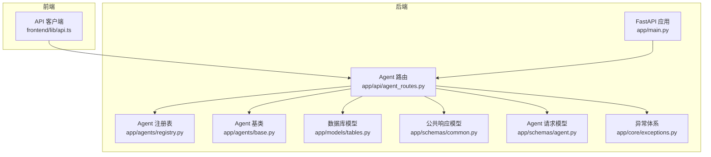
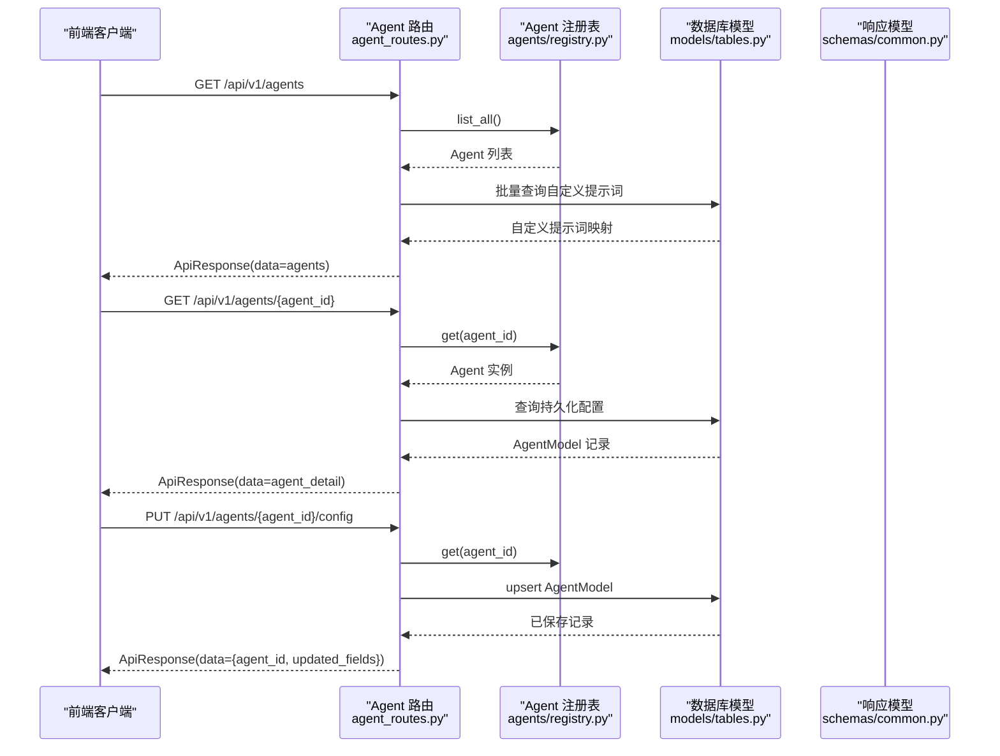
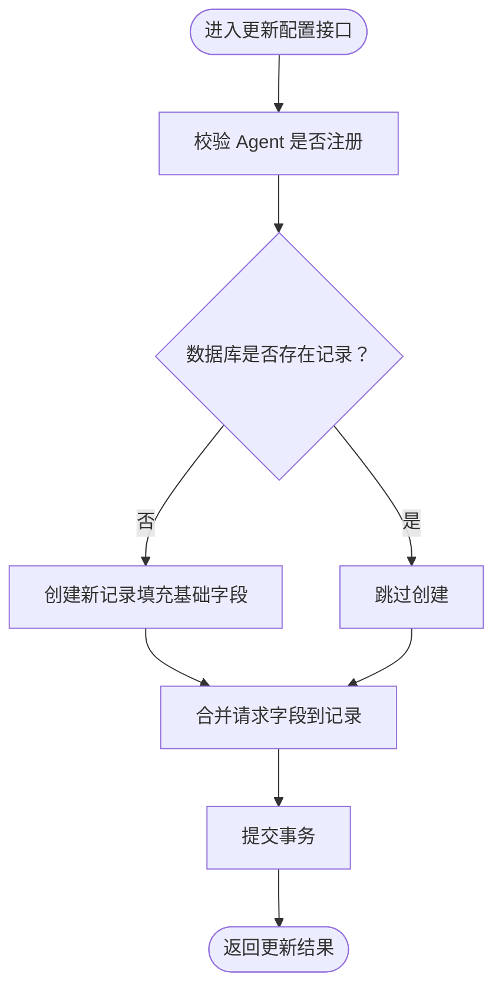
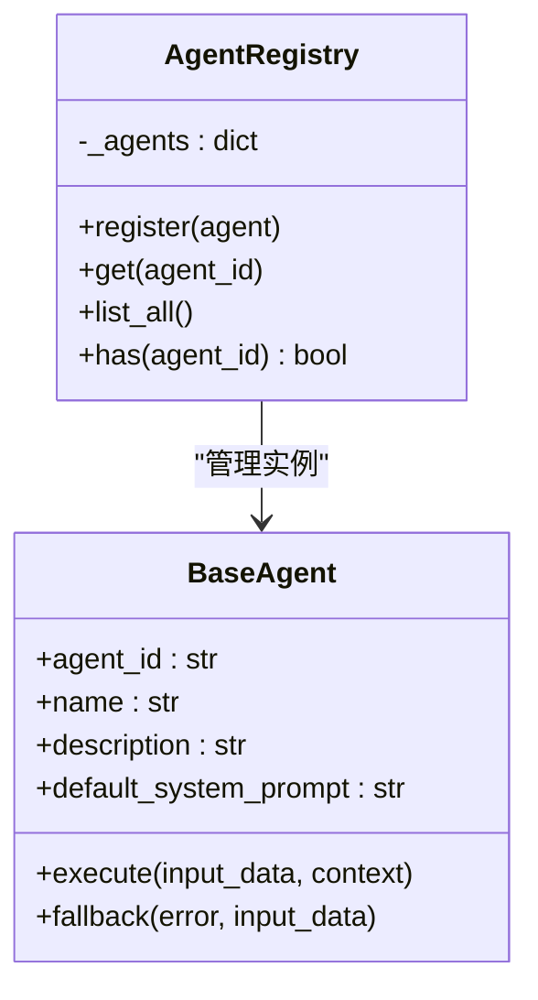
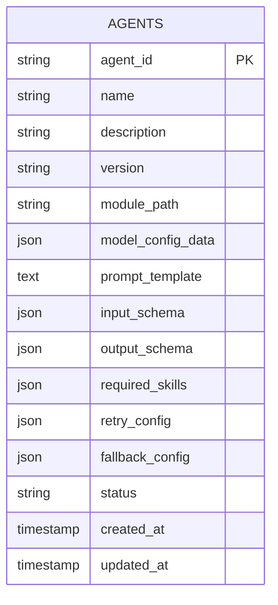
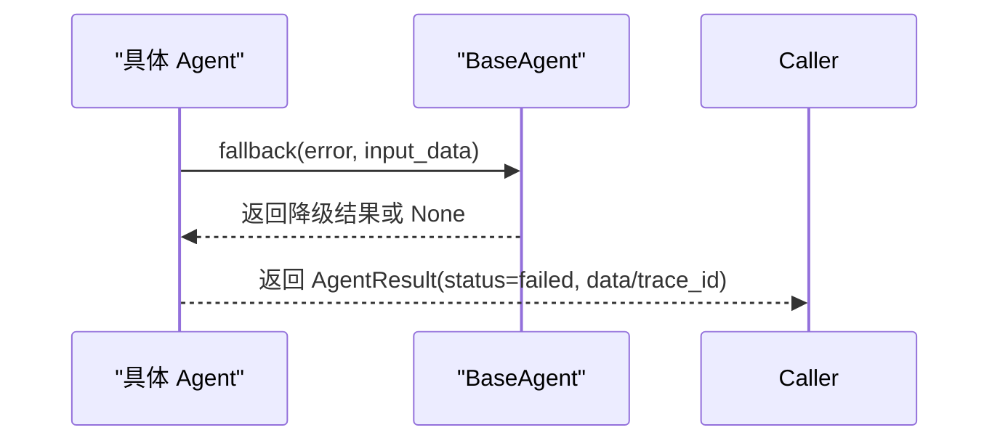
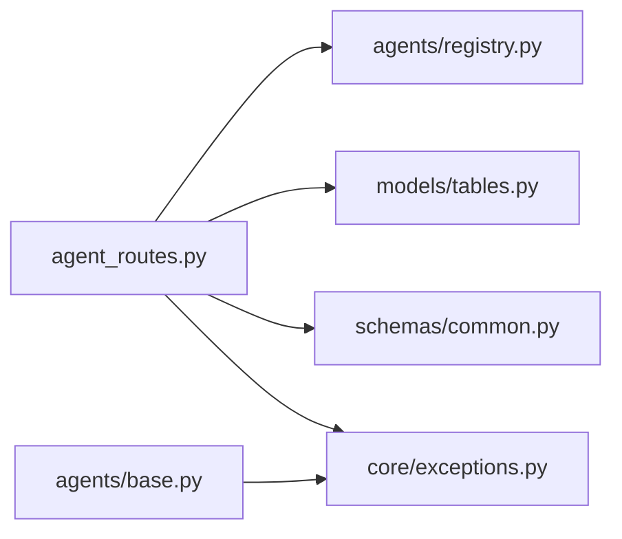

# Agent配置API

<cite>
**本文档引用的文件**
- [agent_routes.py](file://backend/app/api/agent_routes.py)
- [schemas/agent.py](file://backend/app/schemas/agent.py)
- [schemas/common.py](file://backend/app/schemas/common.py)
- [agents/base.py](file://backend/app/agents/base.py)
- [agents/registry.py](file://backend/app/agents/registry.py)
- [models/tables.py](file://backend/app/models/tables.py)
- [main.py](file://backend/app/main.py)
- [skills/registry.py](file://backend/app/skills/registry.py)
- [core/exceptions.py](file://backend/app/core/exceptions.py)
- [frontend/lib/api.ts](file://frontend/lib/api.ts)
</cite>

## 目录
1. [简介](#简介)
2. [项目结构](#项目结构)
3. [核心组件](#核心组件)
4. [架构总览](#架构总览)
5. [详细组件分析](#详细组件分析)
6. [依赖关系分析](#依赖关系分析)
7. [性能考虑](#性能考虑)
8. [故障排查指南](#故障排查指南)
9. [结论](#结论)
10. [附录](#附录)

## 简介
本文件为 HotClaw 平台的 Agent 配置管理 API 的权威参考文档。内容覆盖 Agent 的注册、查询、更新与删除操作，涵盖元数据管理、配置参数设置、运行状态控制、健康检查、故障转移与降级策略，以及与技能系统的关联关系、权限控制与访问限制。同时提供 Agent 类型定义、配置验证规则、动态注册机制、模板管理、实例化配置与继承关系处理，以及批量操作与配置导入导出的实践建议。

## 项目结构
后端采用 FastAPI 架构，Agent 相关能力由独立模块实现并通过统一路由暴露；前端通过封装的 API 客户端对接后端接口。

**图表来源**
- [main.py:14-147](file://backend/app/main.py#L14-L147)
- [agent_routes.py:1-115](file://backend/app/api/agent_routes.py#L1-L115)
- [agents/registry.py:1-40](file://backend/app/agents/registry.py#L1-L40)
- [agents/base.py:1-99](file://backend/app/agents/base.py#L1-L99)
- [models/tables.py:160-181](file://backend/app/models/tables.py#L160-L181)
- [schemas/common.py:1-27](file://backend/app/schemas/common.py#L1-L27)
- [schemas/agent.py:1-29](file://backend/app/schemas/agent.py#L1-L29)
- [core/exceptions.py:1-125](file://backend/app/core/exceptions.py#L1-L125)
- [frontend/lib/api.ts:1-289](file://frontend/lib/api.ts#L1-L289)

**章节来源**
- [main.py:14-147](file://backend/app/main.py#L14-L147)
- [agent_routes.py:1-115](file://backend/app/api/agent_routes.py#L1-L115)
- [frontend/lib/api.ts:1-289](file://frontend/lib/api.ts#L1-L289)

## 核心组件
- Agent 路由层：提供 Agent 列表、详情、配置更新等 REST 接口，并与注册表、数据库模型交互。
- Agent 注册表：集中管理已注册的 Agent 实例，提供按 ID 获取与遍历能力。
- Agent 基类：定义统一的执行接口、降级策略与结果封装。
- 数据库模型：持久化 Agent 的配置、提示词模板、重试与降级配置等。
- 公共响应模型：统一返回格式与错误包装。
- 异常体系：标准化错误码与 HTTP 映射，便于前端与运维处理。

**章节来源**
- [agent_routes.py:1-115](file://backend/app/api/agent_routes.py#L1-L115)
- [agents/registry.py:1-40](file://backend/app/agents/registry.py#L1-L40)
- [agents/base.py:1-99](file://backend/app/agents/base.py#L1-L99)
- [models/tables.py:160-181](file://backend/app/models/tables.py#L160-L181)
- [schemas/common.py:1-27](file://backend/app/schemas/common.py#L1-L27)
- [core/exceptions.py:1-125](file://backend/app/core/exceptions.py#L1-L125)

## 架构总览
Agent 配置管理 API 的请求处理流程如下：

**图表来源**
- [agent_routes.py:17-115](file://backend/app/api/agent_routes.py#L17-L115)
- [agents/registry.py:23-32](file://backend/app/agents/registry.py#L23-L32)
- [models/tables.py:160-181](file://backend/app/models/tables.py#L160-L181)
- [schemas/common.py:7-12](file://backend/app/schemas/common.py#L7-L12)

## 详细组件分析

### Agent 路由与接口定义
- 列出所有 Agent
  - 方法与路径：GET /api/v1/agents
  - 功能：从注册表获取全部 Agent，并批量查询数据库中的自定义提示词，返回包含是否具有自定义提示词的聚合信息。
  - 返回：统一响应模型，data 包含 agents 列表。
- 获取单个 Agent 详情
  - 方法与路径：GET /api/v1/agents/{agent_id}
  - 功能：从注册表获取指定 Agent，合并数据库中的持久化配置（模型配置、提示词模板、重试配置等），并确定提示词来源（自定义或默认）。
  - 返回：统一响应模型，data 包含 agent 详情。
- 更新 Agent 配置
  - 方法与路径：PUT /api/v1/agents/{agent_id}/config
  - 功能：校验 Agent 是否存在于注册表，若数据库中不存在则创建记录；支持更新模型配置、提示词模板、重试配置；空字符串表示“重置为默认”。
  - 返回：统一响应模型，data 包含 agent_id 与更新字段列表。

**图表来源**
- [agent_routes.py:74-115](file://backend/app/api/agent_routes.py#L74-L115)

**章节来源**
- [agent_routes.py:17-115](file://backend/app/api/agent_routes.py#L17-L115)
- [schemas/common.py:7-12](file://backend/app/schemas/common.py#L7-L12)

### Agent 类型定义与配置验证
- AgentInfo：用于列表与详情返回的数据结构，包含 agent_id、name、description、version、model_config_data、required_skills、status、prompt_template、prompt_source、default_system_prompt、has_custom_prompt 等字段。
- AgentListResponse：列表响应容器。
- AgentConfigUpdateRequest：配置更新请求体，支持 model_config_data、prompt_template、retry_config 三类字段。
- 验证规则与约束：
  - prompt_template 为空字符串时，表示“重置为默认”，后端会存储为 None。
  - 仅当请求体中出现对应字段时才更新，未出现的字段保持不变。
  - Agent 不存在时抛出统一错误，HTTP 映射为 404。

**章节来源**
- [schemas/agent.py:6-29](file://backend/app/schemas/agent.py#L6-L29)
- [agent_routes.py:74-115](file://backend/app/api/agent_routes.py#L74-L115)
- [core/exceptions.py:31-36](file://backend/app/core/exceptions.py#L31-L36)

### Agent 注册与动态加载
- Agent 注册表提供 register/get/list_all/has 等能力，确保运行时可发现与调用已注册的 Agent。
- 应用启动时自动注册多个内置 Agent 实例，形成“动态注册机制”的基础。
- 删除 Agent 的接口在当前版本未提供，如需扩展可在注册表与路由层增加相应逻辑。

**图表来源**
- [agents/registry.py:10-39](file://backend/app/agents/registry.py#L10-L39)
- [agents/base.py:49-99](file://backend/app/agents/base.py#L49-L99)

**章节来源**
- [agents/registry.py:1-40](file://backend/app/agents/registry.py#L1-L40)
- [main.py:34-42](file://backend/app/main.py#L34-L42)

### 数据模型与持久化
- AgentModel 表用于持久化 Agent 的配置，字段包括 agent_id、name、description、version、module_path、model_config_data、prompt_template、input_schema、output_schema、required_skills、retry_config、fallback_config、status 等。
- 与路由层配合，实现配置的读取、更新与回写。

**图表来源**
- [models/tables.py:160-181](file://backend/app/models/tables.py#L160-L181)

**章节来源**
- [models/tables.py:160-181](file://backend/app/models/tables.py#L160-L181)

### 健康检查、故障转移与降级策略
- 健康检查：应用提供全局健康检查端点，可用于平台级健康监测。
- 故障转移与降级：Agent 基类提供 fallback 抽象方法，具体 Agent 可在执行失败时返回降级结果，保障系统可用性。
- 错误处理：统一异常体系将业务错误映射为合适的 HTTP 状态码，便于前端与网关处理。

**图表来源**
- [agents/base.py:77-82](file://backend/app/agents/base.py#L77-L82)

**章节来源**
- [main.py:150-153](file://backend/app/main.py#L150-L153)
- [agents/base.py:77-99](file://backend/app/agents/base.py#L77-L99)
- [core/exceptions.py:65-98](file://backend/app/core/exceptions.py#L65-L98)

### 与技能系统的关联关系
- 技能注册表提供技能的注册、获取与遍历能力，与 Agent 的协作体现在 Agent 在执行过程中可能调用已注册的技能。
- 当前 Agent 路由未直接暴露技能关联的 CRUD 接口，如需在 Agent 层面管理所需技能，可在 Agent 配置中维护 required_skills 字段并在执行前进行校验。

**章节来源**
- [skills/registry.py:1-37](file://backend/app/skills/registry.py#L1-L37)
- [models/tables.py:173](file://backend/app/models/tables.py#L173)

### 权限控制与访问限制
- 当前路由未实现细粒度权限控制，建议在中间件或路由装饰器中增加鉴权与授权逻辑，结合角色与资源访问控制（RBAC）策略。
- 健康检查端点可开放给监控系统访问，其他管理接口建议限制来源与认证。

**章节来源**
- [main.py:69-93](file://backend/app/main.py#L69-L93)

### 前端对接与示例
- 前端 API 客户端封装了 Agent 列表、详情与配置更新的调用方式，便于在管理界面中集成。
- 示例调用路径：
  - 列表：GET /api/v1/agents
  - 详情：GET /api/v1/agents/{agent_id}
  - 更新：PUT /api/v1/agents/{agent_id}/config

**章节来源**
- [frontend/lib/api.ts:73-89](file://frontend/lib/api.ts#L73-L89)

## 依赖关系分析
- 路由层依赖注册表与数据库模型，以实现配置读取与持久化。
- Agent 基类提供统一的执行与降级接口，降低各 Agent 实现复杂度。
- 异常体系与统一响应模型保证接口一致性与可观测性。

**图表来源**
- [agent_routes.py:1-115](file://backend/app/api/agent_routes.py#L1-L115)
- [agents/registry.py:1-40](file://backend/app/agents/registry.py#L1-L40)
- [models/tables.py:160-181](file://backend/app/models/tables.py#L160-L181)
- [schemas/common.py:1-27](file://backend/app/schemas/common.py#L1-L27)
- [core/exceptions.py:1-125](file://backend/app/core/exceptions.py#L1-L125)
- [agents/base.py:1-99](file://backend/app/agents/base.py#L1-L99)

**章节来源**
- [agent_routes.py:1-115](file://backend/app/api/agent_routes.py#L1-L115)
- [agents/base.py:1-99](file://backend/app/agents/base.py#L1-L99)

## 性能考虑
- 批量查询优化：列表接口先从注册表获取 Agent，再批量查询数据库中的自定义提示词，减少多次往返。
- 配置更新幂等：仅更新出现的字段，避免不必要的写入。
- 降级策略：在 Agent 执行失败时快速返回降级结果，提升系统整体可用性。
- 建议：对高频查询增加缓存层；对长文本提示词进行压缩或分页展示；对重试配置进行上限控制。

[本节为通用指导，无需特定文件来源]

## 故障排查指南
- Agent 不存在：当请求的 agent_id 未注册时，将抛出统一错误，HTTP 映射为 404。
- LLM 调用失败：Agent 执行过程中捕获异常并返回失败结果，必要时触发降级。
- 配置更新无效：确认请求体中包含对应字段且非空；空字符串会被解释为“重置为默认”。

**章节来源**
- [core/exceptions.py:31-36](file://backend/app/core/exceptions.py#L31-L36)
- [agents/base.py:84-99](file://backend/app/agents/base.py#L84-L99)
- [agent_routes.py:100-106](file://backend/app/api/agent_routes.py#L100-L106)

## 结论
Agent 配置管理 API 提供了从注册、查询、更新到健康检查与降级策略的完整能力。通过注册表与数据库模型的解耦设计，实现了动态注册与持久化配置的统一管理。建议后续增强权限控制、批量操作与配置导入导出能力，并在前端与网关层完善访问限制与可观测性。

[本节为总结性内容，无需特定文件来源]

## 附录

### API 接口清单
- GET /api/v1/agents
  - 功能：列出所有已注册 Agent，并标记是否具有自定义提示词。
  - 返回：统一响应模型，data.agents 为 AgentInfo 列表。
- GET /api/v1/agents/{agent_id}
  - 功能：获取指定 Agent 的详细配置，合并默认与自定义提示词。
  - 返回：统一响应模型，data 为 Agent 详情。
- PUT /api/v1/agents/{agent_id}/config
  - 功能：更新 Agent 的模型配置、提示词模板与重试配置。
  - 请求体：AgentConfigUpdateRequest
  - 返回：统一响应模型，data 包含 agent_id 与 updated_fields。

**章节来源**
- [agent_routes.py:17-115](file://backend/app/api/agent_routes.py#L17-L115)
- [schemas/agent.py:24-29](file://backend/app/schemas/agent.py#L24-L29)
- [schemas/common.py:7-12](file://backend/app/schemas/common.py#L7-L12)

### 数据模型字段说明（AgentModel）
- agent_id：Agent 标识符（主键）
- name/description/version/module_path：元数据与模块路径
- model_config_data：模型参数配置（JSON）
- prompt_template：自定义系统提示词（Text）
- input_schema/output_schema：输入输出模式定义（JSON）
- required_skills：所需技能标识列表（JSON）
- retry_config/fallback_config：重试与降级策略（JSON）
- status：状态（active/inactive）
- created_at/updated_at：创建与更新时间戳

**章节来源**
- [models/tables.py:160-181](file://backend/app/models/tables.py#L160-L181)

### 前端调用示例（路径）
- 列表：[frontend/lib/api.ts:73-75](file://frontend/lib/api.ts#L73-L75)
- 详情：[frontend/lib/api.ts:77-79](file://frontend/lib/api.ts#L77-L79)
- 更新：[frontend/lib/api.ts:81-89](file://frontend/lib/api.ts#L81-L89)

**章节来源**
- [frontend/lib/api.ts:73-89](file://frontend/lib/api.ts#L73-L89)