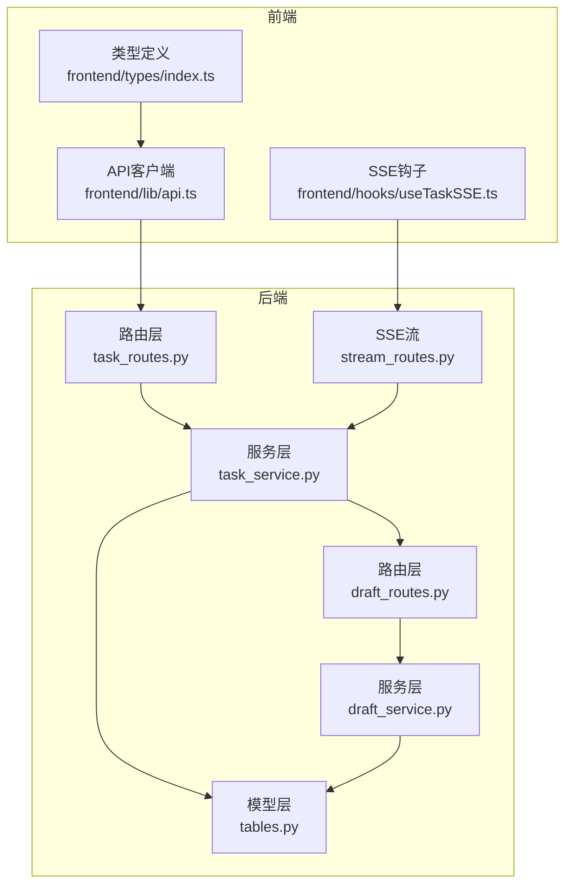
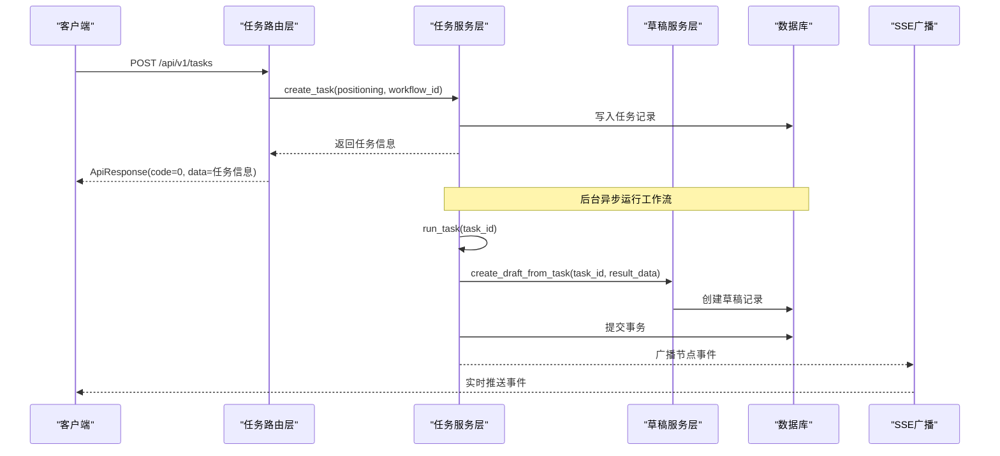
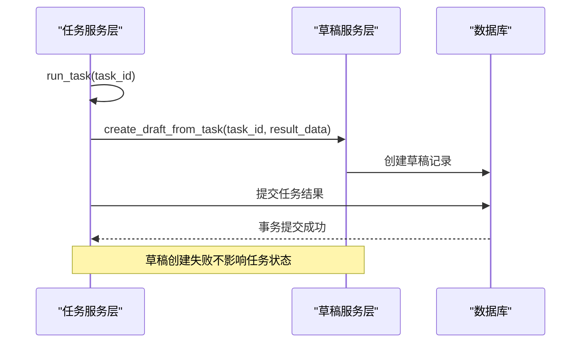
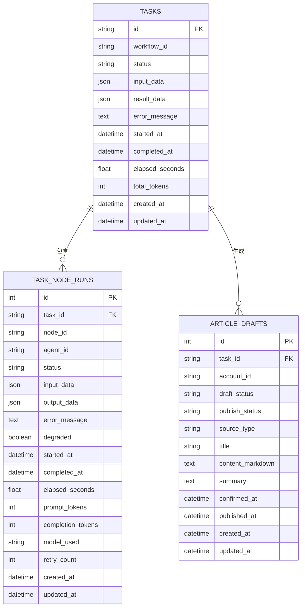
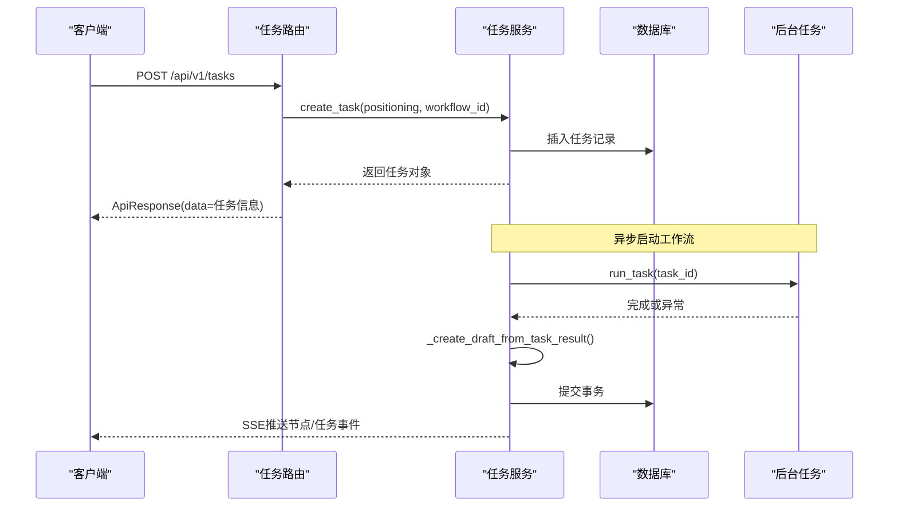
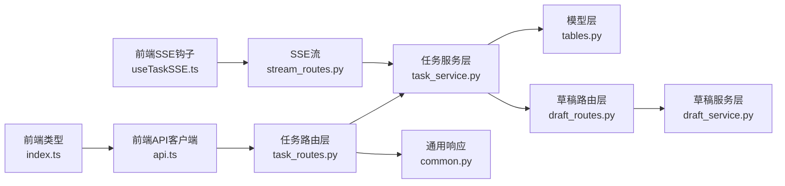
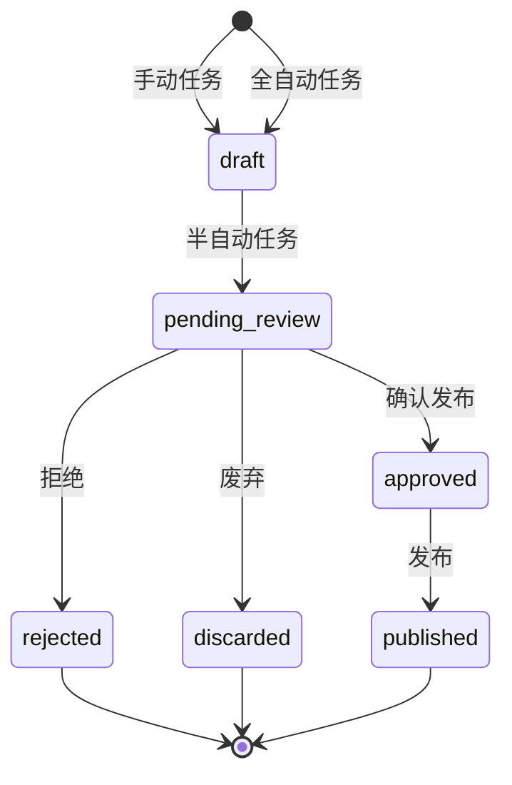

# 任务管理API

<cite>
**本文档引用的文件**
- [task_routes.py](file://backend/app/api/task_routes.py)
- [task_service.py](file://backend/app/services/task_service.py)
- [draft_routes.py](file://backend/app/api/draft_routes.py)
- [draft_service.py](file://backend/app/services/draft_service.py)
- [tables.py](file://backend/app/models/tables.py)
- [stream_routes.py](file://backend/app/api/stream_routes.py)
- [api.ts](file://frontend/lib/api.ts)
- [index.ts](file://frontend/types/index.ts)
- [useTaskSSE.ts](file://frontend/hooks/useTaskSSE.ts)
- [test_task_api.py](file://backend/tests/test_task_api.py)
</cite>

## 更新摘要
**所做更改**
- 增强了任务完成后的草稿创建机制，确保草稿创建的原子性保证
- 新增了任务重跑功能，支持对已完成或失败任务的重新执行
- 改进了任务与草稿系统的集成，提供更完整的创作工作流
- 优化了错误处理策略，确保草稿创建失败不影响主任务状态

## 目录
1. [简介](#简介)
2. [项目结构](#项目结构)
3. [核心组件](#核心组件)
4. [架构总览](#架构总览)
5. [详细组件分析](#详细组件分析)
6. [依赖关系分析](#依赖关系分析)
7. [性能考虑](#性能考虑)
8. [故障排除指南](#故障排除指南)
9. [结论](#结论)
10. [附录](#附录)

## 简介
本文件为任务管理API的完整技术文档，覆盖任务生命周期管理（创建、查询、状态跟踪、历史管理）的全部RESTful接口。系统采用FastAPI后端与React前端协作：后端负责业务逻辑与数据持久化，前端通过统一的API客户端与SSE事件流实现实时状态更新。本文档面向任务执行者与系统集成者，提供端点定义、参数说明、响应格式、状态码与错误处理策略，并给出典型使用场景与最佳实践。

**更新** 本次更新重点增强了任务与草稿系统的深度集成，改进了原子性保证机制，新增了任务重跑功能。

## 项目结构
后端采用分层架构：
- 路由层：定义REST API端点与参数校验
- 服务层：封装业务逻辑与数据库事务
- 模型层：SQLAlchemy ORM定义任务与节点执行记录
- 异常层：统一错误码与消息
- 前端：API客户端与SSE事件订阅

**图表来源**
- [task_routes.py:1-298](file://backend/app/api/task_routes.py#L1-L298)
- [draft_routes.py:1-236](file://backend/app/api/draft_routes.py#L1-L236)
- [task_service.py:1-228](file://backend/app/services/task_service.py#L1-L228)
- [draft_service.py:1-425](file://backend/app/services/draft_service.py#L1-L425)
- [tables.py:1-385](file://backend/app/models/tables.py#L1-L385)
- [stream_routes.py:1-96](file://backend/app/api/stream_routes.py#L1-L96)
- [api.ts:1-501](file://frontend/lib/api.ts#L1-L501)
- [index.ts:1-378](file://frontend/types/index.ts#L1-L378)
- [useTaskSSE.ts:1-233](file://frontend/hooks/useTaskSSE.ts#L1-L233)

**章节来源**
- [task_routes.py:1-298](file://backend/app/api/task_routes.py#L1-L298)
- [draft_routes.py:1-236](file://backend/app/api/draft_routes.py#L1-L236)
- [task_service.py:1-228](file://backend/app/services/task_service.py#L1-L228)
- [draft_service.py:1-425](file://backend/app/services/draft_service.py#L1-L425)
- [tables.py:1-385](file://backend/app/models/tables.py#L1-L385)
- [stream_routes.py:1-96](file://backend/app/api/stream_routes.py#L1-L96)

## 核心组件
- 路由层：提供任务相关REST端点，负责请求参数解析与响应包装
- 服务层：实现任务生命周期业务逻辑，包括创建、运行、查询与分页列表
- 草稿服务层：管理草稿生命周期，支持创建、确认、废弃、拒绝和重跑
- 模型层：定义任务与节点执行记录的数据结构与字段约束
- 异常层：定义统一错误码与消息，便于前端一致化处理
- 通用响应：统一返回体结构，包含code、message、data等字段
- SSE流：实时推送节点开始、完成、错误与任务完成/失败事件

**章节来源**
- [task_routes.py:1-298](file://backend/app/api/task_routes.py#L1-L298)
- [task_service.py:1-228](file://backend/app/services/task_service.py#L1-L228)
- [draft_routes.py:1-236](file://backend/app/api/draft_routes.py#L1-L236)
- [draft_service.py:1-425](file://backend/app/services/draft_service.py#L1-L425)
- [tables.py:1-385](file://backend/app/models/tables.py#L1-L385)
- [stream_routes.py:1-96](file://backend/app/api/stream_routes.py#L1-L96)

## 架构总览
任务管理API遵循"路由仅处理请求/响应，不包含核心业务逻辑"的设计原则。业务逻辑集中在服务层，模型层负责数据持久化，异常层统一错误处理，前端通过API客户端与SSE事件流进行交互。

**更新** 新增了任务完成后自动创建草稿的机制，确保草稿创建的原子性保证。

**图表来源**
- [task_routes.py:67-113](file://backend/app/api/task_routes.py#L67-L113)
- [task_service.py:39-80](file://backend/app/services/task_service.py#L39-L80)
- [draft_service.py:35-128](file://backend/app/services/draft_service.py#L35-L128)
- [stream_routes.py:37-95](file://backend/app/api/stream_routes.py#L37-L95)

## 详细组件分析

### 任务创建接口
- 端点：POST /api/v1/tasks
- 功能：创建新任务并立即返回，后台异步运行工作流
- 请求参数
  - positioning: 字符串，必填，长度5-500
  - workflow_id: 字符串，可选，默认"default_pipeline"
- 成功响应
  - code: 0
  - data.task_id: 新建任务ID
  - data.status: 初始状态"pending"
  - data.created_at: ISO时间字符串
  - data.workflow_id: 使用的工作流模板ID
- 错误处理
  - 参数校验失败：HTTP 422（由FastAPI自动返回）
  - 其他异常：统一错误响应（见"错误处理策略"）

请求示例
- 方法：POST
- 路径：/api/v1/tasks
- 请求体：
  - positioning: "我是一个关注职场成长的公众号，目标读者是25-35岁互联网从业者"
  - workflow_id: "default_pipeline"

响应示例
- 状态码：200
- 响应体：
  - code: 0
  - message: "ok"
  - data:
    - task_id: "任务唯一标识"
    - status: "pending"
    - created_at: "2023-01-01T00:00:00Z"
    - workflow_id: "default_pipeline"

**章节来源**
- [task_routes.py:67-113](file://backend/app/api/task_routes.py#L67-L113)
- [task_service.py:22-37](file://backend/app/services/task_service.py#L22-L37)
- [api.ts:70-76](file://frontend/lib/api.ts#L70-L76)

### 获取任务详情接口
- 端点：GET /api/v1/tasks/{task_id}
- 功能：查询任务完整详情（含输入、结果、耗时等）
- 路径参数
  - task_id: 任务ID（字符串）
- 成功响应
  - code: 0
  - data:
    - task_id: 任务ID
    - status: 任务状态
    - input_data.positioning: 用户定位描述
    - workflow_id: 工作流模板ID
    - result_data: 结果数据（可能为空）
    - error_message: 错误信息（可能为空）
    - created_at/started_at/completed_at: 时间戳
    - elapsed_seconds: 总耗时（秒）
    - total_tokens: 总token数

请求示例
- 方法：GET
- 路径：/api/v1/tasks/{task_id}

响应示例
- 状态码：200
- data字段同上

**章节来源**
- [task_routes.py:160-185](file://backend/app/api/task_routes.py#L160-L185)
- [task_service.py:81-94](file://backend/app/services/task_service.py#L81-L94)
- [tables.py:63-92](file://backend/app/models/tables.py#L63-L92)

### 查询任务状态接口
- 端点：GET /api/v1/tasks/{task_id}/status
- 功能：查询任务状态与进度（包含当前节点与进度统计）
- 成功响应
  - code: 0
  - data:
    - task_id/status/current_node/started_at/elapsed_seconds: 同详情接口
    - progress:
      - total_nodes: 节点总数（固定值6）
      - completed_nodes: 已完成节点数
      - current_node_index: 当前运行节点索引（从1开始）

请求示例
- 方法：GET
- 路径：/api/v1/tasks/{task_id}/status

响应示例
- 状态码：200
- data.progress: 进度统计

**章节来源**
- [task_routes.py:116-157](file://backend/app/api/task_routes.py#L116-L157)
- [task_service.py:120-130](file://backend/app/services/task_service.py#L120-L130)

### 获取节点执行记录接口
- 端点：GET /api/v1/tasks/{task_id}/nodes
- 功能：查询任务所有节点的执行记录
- 成功响应
  - code: 0
  - data.nodes: 节点数组，每项包含
    - node_id/agent_id/status/input_data/output_data
    - started_at/completed_at/elapsed_seconds
    - prompt_tokens/completion_tokens/model_used/degraded/error_message

请求示例
- 方法：GET
- 路径：/api/v1/tasks/{task_id}/nodes

响应示例
- 状态码：200
- data.nodes: 节点执行记录数组

**章节来源**
- [task_routes.py:188-216](file://backend/app/api/task_routes.py#L188-L216)
- [task_service.py:120-130](file://backend/app/services/task_service.py#L120-L130)
- [tables.py:94-119](file://backend/app/models/tables.py#L94-L119)

### 列出任务接口
- 端点：GET /api/v1/tasks
- 功能：分页列出任务，支持按状态过滤
- 查询参数
  - page: 整数，>=1，默认1
  - page_size: 整数，1-100，默认20
  - status: 字符串，可选，按状态过滤
- 成功响应
  - code: 0
  - data.tasks: 任务摘要数组，每项包含
    - task_id/positioning_summary/status/created_at/elapsed_seconds
  - data.pagination: 分页元数据（page/page_size/total）

请求示例
- 方法：GET
- 路径：/api/v1/tasks?page=1&page_size=20&status=pending

响应示例
- 状态码：200
- data.tasks/pagination: 分页结果

**章节来源**
- [task_routes.py:219-266](file://backend/app/api/task_routes.py#L219-L266)
- [task_service.py:96-118](file://backend/app/services/task_service.py#L96-L118)

### 任务重跑接口
- 端点：POST /api/v1/tasks/{task_id}/rerun
- 功能：重跑已完成或失败的任务
- 请求参数
  - task_id: 任务ID（字符串）
- 成功响应
  - code: 0
  - data.task_id: 重跑后的新任务ID
  - data.status: 重跑后的状态"pending"
  - data.created_at: 重跑后的时间戳
  - data.workflow_id: 工作流模板ID
- 错误处理
  - 任务正在运行：TaskAlreadyRunningError
  - 任务不存在：TaskNotFoundError
  - 其他异常：统一错误响应

**更新** 新增任务重跑功能，支持对已完成或失败任务的重新执行。

请求示例
- 方法：POST
- 路径：/api/v1/tasks/{task_id}/rerun

响应示例
- 状态码：200
- 响应体：
  - code: 0
  - message: "ok"
  - data:
    - task_id: "重跑后的新任务ID"
    - status: "pending"
    - created_at: "2023-01-01T00:00:00Z"
    - workflow_id: "default_pipeline"

**章节来源**
- [task_routes.py:269-298](file://backend/app/api/task_routes.py#L269-L298)
- [task_service.py:132-156](file://backend/app/services/task_service.py#L132-L156)

### 实时事件流接口
- 端点：GET /api/v1/tasks/{task_id}/stream
- 功能：SSE实时推送任务执行事件
- 支持事件
  - node_start: 节点开始执行
  - node_complete: 节点完成执行
  - node_error: 节点执行错误
  - task_complete: 任务完成
  - task_error: 任务失败
- 前端集成
  - 前端通过useTaskSSE钩子订阅事件，维护节点状态机
  - 事件数据格式参见前端types定义

请求示例
- 方法：GET
- 路径：/api/v1/tasks/{task_id}/stream

**章节来源**
- [stream_routes.py:37-95](file://backend/app/api/stream_routes.py#L37-L95)
- [useTaskSSE.ts:82-233](file://frontend/hooks/useTaskSSE.ts#L82-L233)
- [index.ts:142-171](file://frontend/types/index.ts#L142-L171)

### 草稿集成机制
- 端点：任务完成后自动创建草稿
- 功能：根据任务结果创建相应状态的草稿
- 草稿状态决策
  - full_auto: 直接创建已批准草稿
  - semi_auto: 创建待确认草稿
  - manual: 创建草稿
- 原子性保证
  - 草稿创建在任务提交之前执行
  - 草稿创建失败不影响主任务状态
  - 两者在同一事务中提交

**更新** 增强了任务完成后的草稿创建机制，确保草稿创建的原子性保证。

**图表来源**
- [task_service.py:39-80](file://backend/app/services/task_service.py#L39-L80)
- [draft_service.py:35-128](file://backend/app/services/draft_service.py#L35-L128)

**章节来源**
- [task_service.py:186-225](file://backend/app/services/task_service.py#L186-L225)
- [draft_service.py:35-128](file://backend/app/services/draft_service.py#L35-L128)

### 数据模型与状态
- 任务状态
  - pending: 待执行
  - running: 执行中
  - completed: 已完成
  - failed: 失败
- 节点状态
  - pending/running/completed/failed/skipped
- 草稿状态
  - draft: 草稿
  - pending_review: 待确认
  - approved: 已批准
  - rejected: 已拒绝
  - discarded: 已废弃
- 关键字段
  - 任务表：id/workflow_id/status/input_data/result_data/error_message/计时与用量字段
  - 节点执行表：node_id/agent_id/status/计时与用量字段
  - 草稿表：task_id/account_id/draft_status/publish_status/source_type

**图表来源**
- [tables.py:63-119](file://backend/app/models/tables.py#L63-L119)
- [tables.py:165-200](file://backend/app/models/tables.py#L165-L200)

**章节来源**
- [tables.py:63-200](file://backend/app/models/tables.py#L63-L200)
- [index.ts:5-6](file://frontend/types/index.ts#L5-L6)

### API调用序列图（创建任务）

**图表来源**
- [task_routes.py:67-113](file://backend/app/api/task_routes.py#L67-L113)
- [task_service.py:22-80](file://backend/app/services/task_service.py#L22-L80)
- [stream_routes.py:37-95](file://backend/app/api/stream_routes.py#L37-L95)

## 依赖关系分析
- 路由层依赖服务层与通用响应模型
- 服务层依赖模型层、异常层与编排器/广播器
- 草稿服务层与任务服务层相互协作
- 前端API客户端依赖后端路由与类型定义
- SSE流依赖广播器实现事件发布

**图表来源**
- [task_routes.py:1-298](file://backend/app/api/task_routes.py#L1-L298)
- [task_service.py:1-228](file://backend/app/services/task_service.py#L1-L228)
- [draft_routes.py:1-236](file://backend/app/api/draft_routes.py#L1-L236)
- [draft_service.py:1-425](file://backend/app/services/draft_service.py#L1-L425)
- [tables.py:1-385](file://backend/app/models/tables.py#L1-L385)
- [stream_routes.py:1-96](file://backend/app/api/stream_routes.py#L1-L96)
- [api.ts:1-501](file://frontend/lib/api.ts#L1-L501)
- [index.ts:1-378](file://frontend/types/index.ts#L1-L378)
- [useTaskSSE.ts:1-233](file://frontend/hooks/useTaskSSE.ts#L1-L233)

**章节来源**
- [task_routes.py:1-298](file://backend/app/api/task_routes.py#L1-L298)
- [task_service.py:1-228](file://backend/app/services/task_service.py#L1-L228)
- [draft_routes.py:1-236](file://backend/app/api/draft_routes.py#L1-L236)
- [draft_service.py:1-425](file://backend/app/services/draft_service.py#L1-L425)
- [stream_routes.py:1-96](file://backend/app/api/stream_routes.py#L1-L96)

## 性能考虑
- 异步I/O：使用SQLAlchemy异步会话与FastAPI异步路由，提升并发能力
- 后台任务：创建任务后立即返回，后台异步运行工作流，避免阻塞请求
- 分页查询：列表接口支持分页与条件过滤，降低单次响应体积
- SSE长连接：事件推送采用SSE，减少轮询开销；超时发送keepalive注释维持连接
- 数据库存储：关键字段建立索引（如任务ID、时间戳），优化查询性能
- 原子性保证：草稿创建与任务提交在同一事务中执行，确保数据一致性

**更新** 新增了草稿创建的原子性保证机制，确保草稿创建失败不影响主任务状态。

## 故障排除指南
- 404未找到
  - 现象：查询不存在的任务详情或状态
  - 处理：检查task_id是否正确；确认任务已创建
  - 参考：TaskNotFoundError错误码1002
- 422参数校验失败
  - 现象：positioning长度不足或缺失
  - 处理：确保positioning长度在5-500之间
- 500内部错误
  - 现象：工作流执行异常
  - 处理：查看SSE task_error事件与日志；检查外部服务可用性
- 重试与降级
  - 节点执行记录包含degraded标志，用于标记降级情况
- 草稿创建失败
  - 现象：任务完成但草稿未创建
  - 处理：检查草稿服务日志；草稿创建失败不会影响任务状态
- 任务重跑失败
  - 现象：正在运行的任务尝试重跑
  - 处理：等待任务完成后重跑；或检查任务状态

**更新** 新增了草稿创建失败和任务重跑的相关故障排除指南。

**章节来源**
- [task_routes.py:269-298](file://backend/app/api/task_routes.py#L269-L298)
- [task_service.py:42-74](file://backend/app/services/task_service.py#L42-L74)
- [draft_service.py:35-128](file://backend/app/services/draft_service.py#L35-L128)

## 结论
任务管理API以清晰的分层架构实现了完整的任务生命周期管理，结合SSE事件流提供了良好的实时体验。通过统一的响应格式与错误码体系，便于前端与第三方系统集成。新增的草稿集成机制进一步完善了创作工作流，确保草稿创建的原子性保证。建议在生产环境中配合监控与日志系统，持续优化工作流性能与稳定性。

**更新** 本次更新显著增强了任务与草稿系统的集成度，提供了更完整的创作工作流支持。

## 附录

### 统一响应与错误码
- 成功响应
  - code: 0
  - message: "ok"
  - data: 具体业务数据
- 错误响应
  - code/message/details: 统一错误信息
- 错误码范围
  - 1xxx: 用户输入类错误（如参数校验失败、任务不存在）
  - 2xxx: 冲突类错误（如任务已在运行）
  - 3xxx: 外部/执行类错误（如LLM调用失败、代理执行超时）
  - 4xxx: 配置类错误
  - 5xxx: 系统内部错误

**章节来源**
- [task_routes.py:67-113](file://backend/app/api/task_routes.py#L67-L113)
- [task_service.py:10-17](file://backend/app/services/task_service.py#L10-L17)

### 前端集成要点
- 使用API客户端封装请求与错误处理
- 通过SSE钩子订阅节点与任务事件，维护本地状态机
- 类型定义与后端保持一致，确保字段与枚举值匹配
- 支持任务重跑功能，提供更好的用户体验

**更新** 新增了任务重跑功能的前端集成要点。

**章节来源**
- [api.ts:70-104](file://frontend/lib/api.ts#L70-L104)
- [useTaskSSE.ts:82-233](file://frontend/hooks/useTaskSSE.ts#L82-L233)
- [index.ts:1-378](file://frontend/types/index.ts#L1-L378)

### 草稿状态转换图

**图表来源**
- [draft_service.py:22-30](file://backend/app/services/draft_service.py#L22-L30)