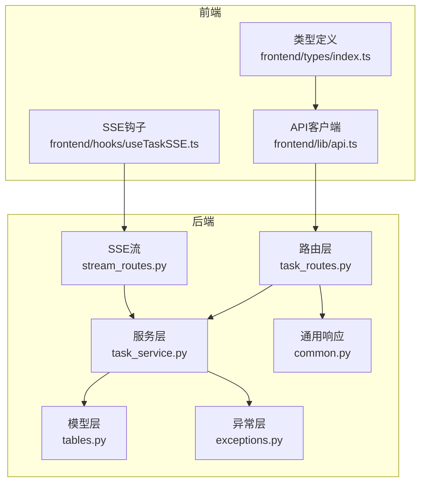
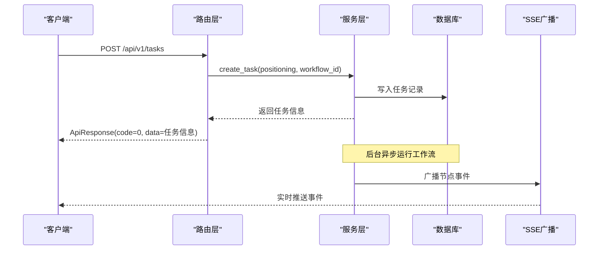
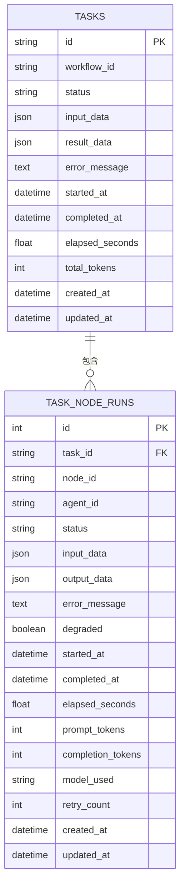
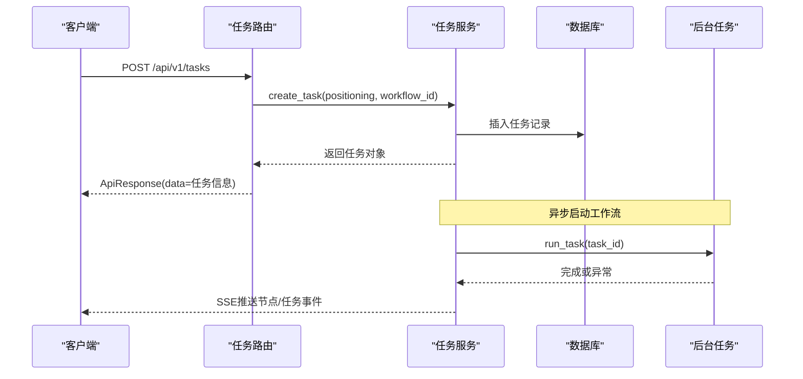
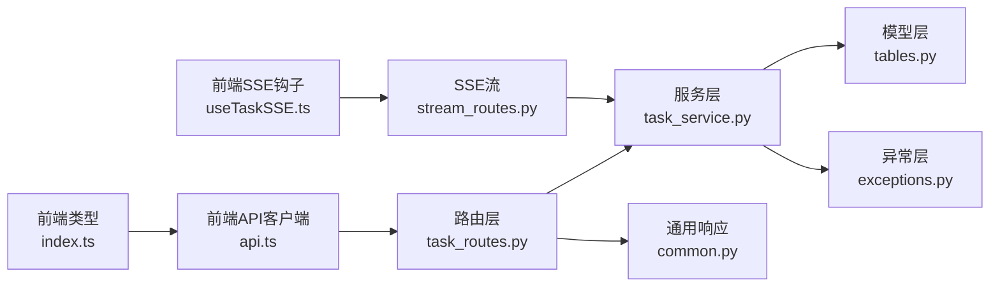

# 任务管理API

<cite>
**本文档引用的文件**
- [task_routes.py](file://backend/app/api/task_routes.py)
- [task.py](file://backend/app/schemas/task.py)
- [task_service.py](file://backend/app/services/task_service.py)
- [tables.py](file://backend/app/models/tables.py)
- [exceptions.py](file://backend/app/core/exceptions.py)
- [common.py](file://backend/app/schemas/common.py)
- [stream_routes.py](file://backend/app/api/stream_routes.py)
- [api.ts](file://frontend/lib/api.ts)
- [index.ts](file://frontend/types/index.ts)
- [useTaskSSE.ts](file://frontend/hooks/useTaskSSE.ts)
- [test_task_api.py](file://backend/tests/test_task_api.py)
</cite>

## 目录
1. [简介](#简介)
2. [项目结构](#项目结构)
3. [核心组件](#核心组件)
4. [架构总览](#架构总览)
5. [详细组件分析](#详细组件分析)
6. [依赖关系分析](#依赖关系分析)
7. [性能考虑](#性能考虑)
8. [故障排除指南](#故障排除指南)
9. [结论](#结论)
10. [附录](#附录)

## 简介
本文件为任务管理API的完整技术文档，覆盖任务生命周期管理（创建、查询、状态跟踪、历史管理）的全部RESTful接口。系统采用FastAPI后端与React前端协作：后端负责业务逻辑与数据持久化，前端通过统一的API客户端与SSE事件流实现实时状态更新。本文档面向任务执行者与系统集成者，提供端点定义、参数说明、响应格式、状态码与错误处理策略，并给出典型使用场景与最佳实践。

## 项目结构
后端采用分层架构：
- 路由层：定义REST API端点与参数校验
- 服务层：封装业务逻辑与数据库事务
- 模型层：SQLAlchemy ORM定义任务与节点执行记录
- 异常层：统一错误码与消息
- 前端：API客户端与SSE事件订阅

图表来源
- [task_routes.py:1-163](file://backend/app/api/task_routes.py#L1-L163)
- [task_service.py:1-126](file://backend/app/services/task_service.py#L1-L126)
- [tables.py:23-74](file://backend/app/models/tables.py#L23-L74)
- [exceptions.py:1-125](file://backend/app/core/exceptions.py#L1-L125)
- [common.py:1-27](file://backend/app/schemas/common.py#L1-L27)
- [stream_routes.py:1-43](file://backend/app/api/stream_routes.py#L1-L43)
- [api.ts:1-110](file://frontend/lib/api.ts#L1-L110)
- [index.ts:1-119](file://frontend/types/index.ts#L1-L119)
- [useTaskSSE.ts:1-124](file://frontend/hooks/useTaskSSE.ts#L1-L124)

章节来源
- [task_routes.py:1-163](file://backend/app/api/task_routes.py#L1-L163)
- [task_service.py:1-126](file://backend/app/services/task_service.py#L1-L126)
- [tables.py:23-74](file://backend/app/models/tables.py#L23-L74)
- [stream_routes.py:1-43](file://backend/app/api/stream_routes.py#L1-L43)

## 核心组件
- 路由层：提供任务相关REST端点，负责请求参数解析与响应包装
- 服务层：实现任务生命周期业务逻辑，包括创建、运行、查询与分页列表
- 模型层：定义任务与节点执行记录的数据结构与字段约束
- 异常层：定义统一错误码与消息，便于前端一致化处理
- 通用响应：统一返回体结构，包含code、message、data等字段
- SSE流：实时推送节点开始、完成、错误与任务完成/失败事件

章节来源
- [task_routes.py:1-163](file://backend/app/api/task_routes.py#L1-L163)
- [task_service.py:1-126](file://backend/app/services/task_service.py#L1-L126)
- [tables.py:23-74](file://backend/app/models/tables.py#L23-L74)
- [exceptions.py:1-125](file://backend/app/core/exceptions.py#L1-L125)
- [common.py:1-27](file://backend/app/schemas/common.py#L1-L27)
- [stream_routes.py:1-43](file://backend/app/api/stream_routes.py#L1-L43)

## 架构总览
任务管理API遵循“路由仅处理请求/响应，不包含核心业务逻辑”的设计原则。业务逻辑集中在服务层，模型层负责数据持久化，异常层统一错误处理，前端通过API客户端与SSE事件流进行交互。

图表来源
- [task_routes.py:19-51](file://backend/app/api/task_routes.py#L19-L51)
- [task_service.py:22-58](file://backend/app/services/task_service.py#L22-L58)
- [stream_routes.py:14-42](file://backend/app/api/stream_routes.py#L14-L42)

## 详细组件分析

### 任务创建接口
- 端点：POST /api/v1/tasks
- 功能：创建新任务并立即返回，后台异步运行工作流
- 请求参数
  - positioning: 字符串，必填，长度5-500
  - workflow_id: 字符串，可选，默认"default_pipeline"
- 成功响应
  - code: 0
  - data.task_id: 新建任务ID
  - data.status: 初始状态"pending"
  - data.created_at: ISO时间字符串
  - data.workflow_id: 使用的工作流模板ID
- 错误处理
  - 参数校验失败：HTTP 422（由FastAPI自动返回）
  - 其他异常：统一错误响应（见“错误处理策略”）

请求示例
- 方法：POST
- 路径：/api/v1/tasks
- 请求体：
  - positioning: "我是一个关注职场成长的公众号，目标读者是25-35岁互联网从业者"
  - workflow_id: "default_pipeline"

响应示例
- 状态码：200
- 响应体：
  - code: 0
  - message: "ok"
  - data:
    - task_id: "任务唯一标识"
    - status: "pending"
    - created_at: "2023-01-01T00:00:00Z"
    - workflow_id: "default_pipeline"

章节来源
- [task_routes.py:19-51](file://backend/app/api/task_routes.py#L19-L51)
- [task.py:10-22](file://backend/app/schemas/task.py#L10-L22)
- [common.py:7-12](file://backend/app/schemas/common.py#L7-L12)
- [test_task_api.py:8-19](file://backend/tests/test_task_api.py#L8-L19)

### 获取任务详情接口
- 端点：GET /api/v1/tasks/{task_id}
- 功能：查询任务完整详情（含输入、结果、耗时等）
- 路径参数
  - task_id: 任务ID（字符串）
- 成功响应
  - code: 0
  - data:
    - task_id: 任务ID
    - status: 任务状态
    - input_data.positioning: 用户定位描述
    - workflow_id: 工作流模板ID
    - result_data: 结果数据（可能为空）
    - error_message: 错误信息（可能为空）
    - created_at/started_at/completed_at: 时间戳
    - elapsed_seconds: 总耗时（秒）
    - total_tokens: 总token数

请求示例
- 方法：GET
- 路径：/api/v1/tasks/{task_id}

响应示例
- 状态码：200
- data字段同上

章节来源
- [task_routes.py:90-107](file://backend/app/api/task_routes.py#L90-L107)
- [task_service.py:65-78](file://backend/app/services/task_service.py#L65-L78)
- [tables.py:23-46](file://backend/app/models/tables.py#L23-L46)

### 查询任务状态接口
- 端点：GET /api/v1/tasks/{task_id}/status
- 功能：查询任务状态与进度（包含当前节点与进度统计）
- 成功响应
  - code: 0
  - data:
    - task_id/status/current_node/started_at/elapsed_seconds: 同详情接口
    - progress:
      - total_nodes: 节点总数（固定值6）
      - completed_nodes: 已完成节点数
      - current_node_index: 当前运行节点索引（从1开始）

请求示例
- 方法：GET
- 路径：/api/v1/tasks/{task_id}/status

响应示例
- 状态码：200
- data.progress: 进度统计

章节来源
- [task_routes.py:54-87](file://backend/app/api/task_routes.py#L54-L87)
- [task_service.py:104-114](file://backend/app/services/task_service.py#L104-L114)

### 获取节点执行记录接口
- 端点：GET /api/v1/tasks/{task_id}/nodes
- 功能：查询任务所有节点的执行记录
- 成功响应
  - code: 0
  - data.nodes: 节点数组，每项包含
    - node_id/agent_id/status/input_data/output_data
    - started_at/completed_at/elapsed_seconds
    - prompt_tokens/completion_tokens/model_used/degraded/error_message

请求示例
- 方法：GET
- 路径：/api/v1/tasks/{task_id}/nodes

响应示例
- 状态码：200
- data.nodes: 节点执行记录数组

章节来源
- [task_routes.py:110-133](file://backend/app/api/task_routes.py#L110-L133)
- [task_service.py:104-114](file://backend/app/services/task_service.py#L104-L114)
- [tables.py:48-74](file://backend/app/models/tables.py#L48-L74)

### 列出任务接口
- 端点：GET /api/v1/tasks
- 功能：分页列出任务，支持按状态过滤
- 查询参数
  - page: 整数，>=1，默认1
  - page_size: 整数，1-100，默认20
  - status: 字符串，可选，按状态过滤
- 成功响应
  - code: 0
  - data.tasks: 任务摘要数组，每项包含
    - task_id/positioning_summary/status/created_at/elapsed_seconds
  - data.pagination: 分页元数据（page/page_size/total）

请求示例
- 方法：GET
- 路径：/api/v1/tasks?page=1&page_size=20&status=pending

响应示例
- 状态码：200
- data.tasks/pagination: 分页结果

章节来源
- [task_routes.py:136-162](file://backend/app/api/task_routes.py#L136-L162)
- [task_service.py:80-102](file://backend/app/services/task_service.py#L80-L102)

### 实时事件流接口
- 端点：GET /api/v1/tasks/{task_id}/stream
- 功能：SSE实时推送任务执行事件
- 支持事件
  - node_start: 节点开始执行
  - node_complete: 节点完成执行
  - node_error: 节点执行错误
  - task_complete: 任务完成
  - task_error: 任务失败
- 前端集成
  - 前端通过useTaskSSE钩子订阅事件，维护节点状态机
  - 事件数据格式参见前端types定义

请求示例
- 方法：GET
- 路径：/api/v1/tasks/{task_id}/stream

章节来源
- [stream_routes.py:14-42](file://backend/app/api/stream_routes.py#L14-L42)
- [useTaskSSE.ts:28-123](file://frontend/hooks/useTaskSSE.ts#L28-L123)
- [index.ts:66-94](file://frontend/types/index.ts#L66-L94)

### 数据模型与状态
- 任务状态
  - pending: 待执行
  - running: 执行中
  - completed: 已完成
  - failed: 失败
- 节点状态
  - pending/running/completed/failed/skipped
- 关键字段
  - 任务表：id/workflow_id/status/input_data/result_data/error_message/计时与用量字段
  - 节点执行表：node_id/agent_id/status/计时与用量字段

图表来源
- [tables.py:23-74](file://backend/app/models/tables.py#L23-L74)

章节来源
- [tables.py:23-74](file://backend/app/models/tables.py#L23-L74)
- [index.ts:5-6](file://frontend/types/index.ts#L5-L6)

### API调用序列图（创建任务）

图表来源
- [task_routes.py:19-51](file://backend/app/api/task_routes.py#L19-L51)
- [task_service.py:22-63](file://backend/app/services/task_service.py#L22-L63)
- [stream_routes.py:14-42](file://backend/app/api/stream_routes.py#L14-L42)

## 依赖关系分析
- 路由层依赖服务层与通用响应模型
- 服务层依赖模型层、异常层与编排器/广播器
- 前端API客户端依赖后端路由与类型定义
- SSE流依赖广播器实现事件发布

图表来源
- [task_routes.py:1-163](file://backend/app/api/task_routes.py#L1-L163)
- [task_service.py:1-126](file://backend/app/services/task_service.py#L1-L126)
- [tables.py:1-233](file://backend/app/models/tables.py#L1-L233)
- [exceptions.py:1-125](file://backend/app/core/exceptions.py#L1-L125)
- [common.py:1-27](file://backend/app/schemas/common.py#L1-L27)
- [stream_routes.py:1-43](file://backend/app/api/stream_routes.py#L1-L43)
- [api.ts:1-110](file://frontend/lib/api.ts#L1-L110)
- [index.ts:1-119](file://frontend/types/index.ts#L1-L119)
- [useTaskSSE.ts:1-124](file://frontend/hooks/useTaskSSE.ts#L1-L124)

章节来源
- [task_routes.py:1-163](file://backend/app/api/task_routes.py#L1-L163)
- [task_service.py:1-126](file://backend/app/services/task_service.py#L1-L126)
- [stream_routes.py:1-43](file://backend/app/api/stream_routes.py#L1-L43)

## 性能考虑
- 异步I/O：使用SQLAlchemy异步会话与FastAPI异步路由，提升并发能力
- 后台任务：创建任务后立即返回，后台异步运行工作流，避免阻塞请求
- 分页查询：列表接口支持分页与条件过滤，降低单次响应体积
- SSE长连接：事件推送采用SSE，减少轮询开销；超时发送keepalive注释维持连接
- 数据库存储：关键字段建立索引（如任务ID、时间戳），优化查询性能

## 故障排除指南
- 404未找到
  - 现象：查询不存在的任务详情或状态
  - 处理：检查task_id是否正确；确认任务已创建
  - 参考：TaskNotFoundError错误码1002
- 422参数校验失败
  - 现象：positioning长度不足或缺失
  - 处理：确保positioning长度在5-500之间
- 500内部错误
  - 现象：工作流执行异常
  - 处理：查看SSE task_error事件与日志；检查外部服务可用性
- 重试与降级
  - 节点执行记录包含degraded标志，用于标记降级情况
- 单元测试参考
  - 创建任务成功、参数校验失败、查询不存在任务、空列表等场景

章节来源
- [exceptions.py:24-28](file://backend/app/core/exceptions.py#L24-L28)
- [test_task_api.py:31-47](file://backend/tests/test_task_api.py#L31-L47)

## 结论
任务管理API以清晰的分层架构实现了完整的任务生命周期管理，结合SSE事件流提供了良好的实时体验。通过统一的响应格式与错误码体系，便于前端与第三方系统集成。建议在生产环境中配合监控与日志系统，持续优化工作流性能与稳定性。

## 附录

### 统一响应与错误码
- 成功响应
  - code: 0
  - message: "ok"
  - data: 具体业务数据
- 错误响应
  - code/message/details: 统一错误信息
- 错误码范围
  - 1xxx: 用户输入类错误（如参数校验失败、任务不存在）
  - 2xxx: 冲突类错误（如任务已在运行）
  - 3xxx: 外部/执行类错误（如LLM调用失败、代理执行超时）
  - 4xxx: 配置类错误
  - 5xxx: 系统内部错误

章节来源
- [common.py:7-27](file://backend/app/schemas/common.py#L7-L27)
- [exceptions.py:4-125](file://backend/app/core/exceptions.py#L4-L125)

### 前端集成要点
- 使用API客户端封装请求与错误处理
- 通过SSE钩子订阅节点与任务事件，维护本地状态机
- 类型定义与后端保持一致，确保字段与枚举值匹配

章节来源
- [api.ts:14-24](file://frontend/lib/api.ts#L14-L24)
- [useTaskSSE.ts:28-123](file://frontend/hooks/useTaskSSE.ts#L28-L123)
- [index.ts:1-119](file://frontend/types/index.ts#L1-L119)