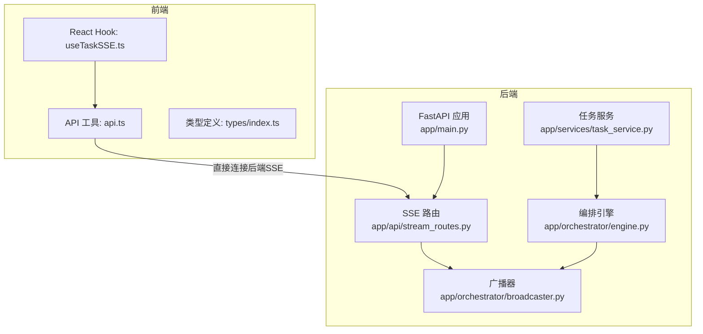
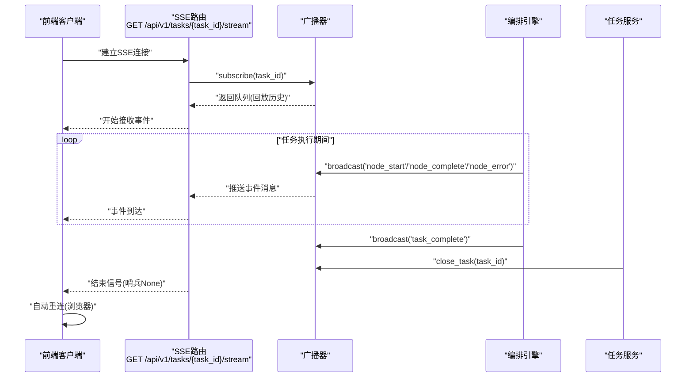
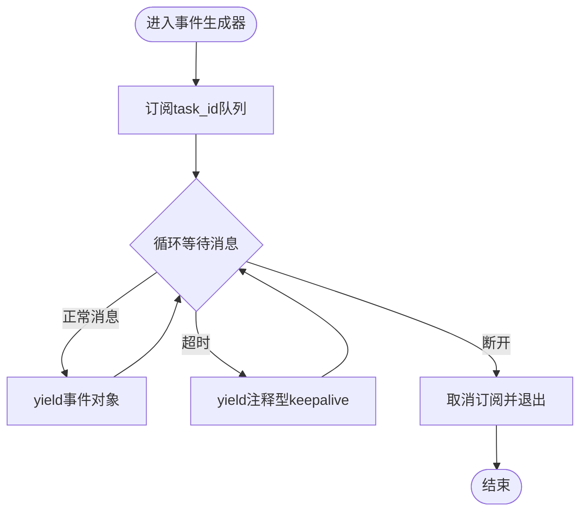
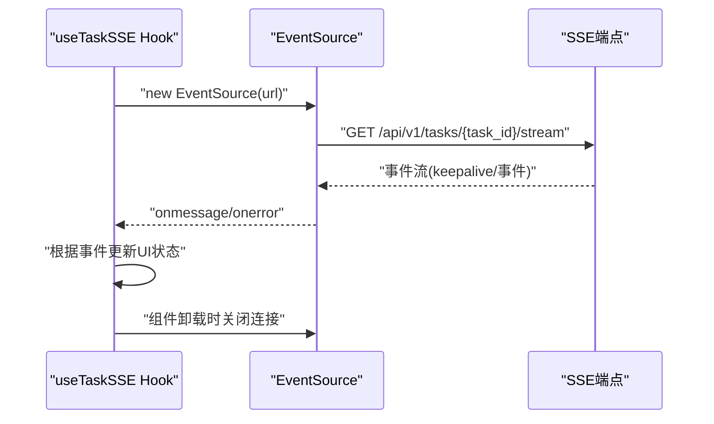
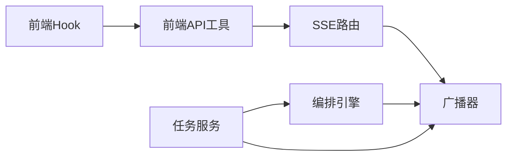

# 实时事件流API

<cite>
**本文档引用的文件**
- [backend/app/api/stream_routes.py](file://backend/app/api/stream_routes.py)
- [backend/app/orchestrator/broadcaster.py](file://backend/app/orchestrator/broadcaster.py)
- [backend/app/orchestrator/engine.py](file://backend/app/orchestrator/engine.py)
- [backend/app/services/task_service.py](file://backend/app/services/task_service.py)
- [backend/app/main.py](file://backend/app/main.py)
- [backend/app/core/config.py](file://backend/app/core/config.py)
- [frontend/hooks/useTaskSSE.ts](file://frontend/hooks/useTaskSSE.ts)
- [frontend/lib/api.ts](file://frontend/lib/api.ts)
- [frontend/types/index.ts](file://frontend/types/index.ts)
</cite>

## 目录
1. [简介](#简介)
2. [项目结构](#项目结构)
3. [核心组件](#核心组件)
4. [架构总览](#架构总览)
5. [详细组件分析](#详细组件分析)
6. [依赖关系分析](#依赖关系分析)
7. [性能考虑](#性能考虑)
8. [故障排查指南](#故障排查指南)
9. [结论](#结论)
10. [附录](#附录)

## 简介
本文件为实时事件流API的完整技术文档，聚焦于基于Server-Sent Events (SSE) 的任务执行事件推送能力。文档覆盖以下要点：
- SSE连接建立流程与URL规范
- 事件格式与事件类型定义
- 事件ID机制与Last-Event-ID处理
- 断线重连与保活策略
- 事件过滤与订阅管理
- 客户端JavaScript连接示例与错误处理
- 性能优化与最佳实践
- 面向实时监控与前端集成开发者的参考

## 项目结构
后端采用FastAPI + asyncio异步架构，SSE通过sse-starlette实现；前端使用React Hook封装EventSource以消费实时事件。

**图表来源**
- [backend/app/main.py:69-147](file://backend/app/main.py#L69-L147)
- [backend/app/api/stream_routes.py:11-42](file://backend/app/api/stream_routes.py#L11-L42)
- [backend/app/orchestrator/broadcaster.py:11-98](file://backend/app/orchestrator/broadcaster.py#L11-L98)
- [backend/app/orchestrator/engine.py:89-234](file://backend/app/orchestrator/engine.py#L89-L234)
- [backend/app/services/task_service.py:20-63](file://backend/app/services/task_service.py#L20-L63)
- [frontend/hooks/useTaskSSE.ts:1-144](file://frontend/hooks/useTaskSSE.ts#L1-L144)
- [frontend/lib/api.ts:48-55](file://frontend/lib/api.ts#L48-L55)

**章节来源**
- [backend/app/main.py:69-147](file://backend/app/main.py#L69-L147)
- [frontend/lib/api.ts:48-55](file://frontend/lib/api.ts#L48-L55)

## 核心组件
- SSE广播器：维护每个task_id的订阅队列与历史事件缓冲，负责事件广播与流关闭信号。
- 编排引擎：在任务执行过程中按节点生命周期广播事件（节点开始、完成、失败），并在任务完成后发送完成事件并关闭流。
- 任务服务：协调后台运行任务，异常时广播任务错误事件并关闭流。
- SSE路由：为每个task_id提供独立的SSE流，支持断线自动重连与保活。
- 前端Hook：封装EventSource连接、事件监听、错误处理与清理逻辑。

**章节来源**
- [backend/app/orchestrator/broadcaster.py:11-98](file://backend/app/orchestrator/broadcaster.py#L11-L98)
- [backend/app/orchestrator/engine.py:89-234](file://backend/app/orchestrator/engine.py#L89-L234)
- [backend/app/services/task_service.py:20-63](file://backend/app/services/task_service.py#L20-L63)
- [backend/app/api/stream_routes.py:14-42](file://backend/app/api/stream_routes.py#L14-L42)
- [frontend/hooks/useTaskSSE.ts:28-140](file://frontend/hooks/useTaskSSE.ts#L28-L140)

## 架构总览
SSE事件流的端到端交互如下：

**图表来源**
- [backend/app/api/stream_routes.py:18-40](file://backend/app/api/stream_routes.py#L18-L40)
- [backend/app/orchestrator/broadcaster.py:30-45](file://backend/app/orchestrator/broadcaster.py#L30-L45)
- [backend/app/orchestrator/engine.py:124-232](file://backend/app/orchestrator/engine.py#L124-L232)
- [backend/app/services/task_service.py:59-63](file://backend/app/services/task_service.py#L59-L63)

## 详细组件分析

### SSE端点与连接管理
- 端点路径：GET /api/v1/tasks/{task_id}/stream
- 连接建立：路由内部创建事件生成器，调用广播器订阅指定task_id，返回EventSourceResponse
- 断线检测：通过请求上下文的断开检测判断客户端是否断开
- 保活策略：30秒超时未取到消息时，发送注释型keepalive消息
- 结束信号：当收到None哨兵或任务关闭时终止流

**图表来源**
- [backend/app/api/stream_routes.py:18-40](file://backend/app/api/stream_routes.py#L18-L40)

**章节来源**
- [backend/app/api/stream_routes.py:14-42](file://backend/app/api/stream_routes.py#L14-L42)

### 事件类型与数据结构
后端广播的事件类型与对应数据字段如下：
- node_start
  - 字段：node_id, agent_id, name, index, total, started_at
  - 触发时机：节点开始执行
- node_complete
  - 字段：node_id, agent_id, name, elapsed_seconds, degraded, output_summary
  - 触发时机：节点成功完成
- node_error
  - 字段：node_id, error
  - 触发时机：节点执行失败或超时
- task_complete
  - 字段：task_id, elapsed_seconds
  - 触发时机：任务全部节点完成
- task_error
  - 字段：task_id, error
  - 触发时机：任务运行异常

前端Hook中对部分事件进行监听与状态更新，包括node_start、node_complete、node_error、task_complete、task_error。

**章节来源**
- [backend/app/orchestrator/engine.py:124-232](file://backend/app/orchestrator/engine.py#L124-L232)
- [backend/app/services/task_service.py:59-63](file://backend/app/services/task_service.py#L59-L63)
- [frontend/hooks/useTaskSSE.ts:74-127](file://frontend/hooks/useTaskSSE.ts#L74-L127)
- [frontend/types/index.ts:66-94](file://frontend/types/index.ts#L66-L94)

### 事件ID分配与Last-Event-ID处理
- 事件ID：当前实现未显式设置SSE事件ID
- Last-Event-ID：当前SSE路由未读取客户端Last-Event-ID头
- 历史回放：广播器维护每个task_id的历史事件列表，在新订阅时立即回放，解决“先执行后连接”的竞态问题

如需启用Last-Event-ID与增量恢复，可在路由层读取Last-Event-ID并调整广播器的回放窗口。

**章节来源**
- [backend/app/orchestrator/broadcaster.py:25-44](file://backend/app/orchestrator/broadcaster.py#L25-L44)
- [backend/app/api/stream_routes.py:18-40](file://backend/app/api/stream_routes.py#L18-L40)

### 断线重连机制
- 浏览器自动重连：前端使用EventSource，默认具备指数退避重连能力
- 后端保活：每30秒无事件时发送注释型keepalive，避免代理/网关超时
- 任务结束：广播器在close_task时向所有订阅者发送None哨兵，触发客户端onclose

前端Hook中onerror仅记录警告，不主动关闭连接，交由EventSource自动处理。

**章节来源**
- [frontend/hooks/useTaskSSE.ts:129-133](file://frontend/hooks/useTaskSSE.ts#L129-L133)
- [backend/app/api/stream_routes.py:25-28](file://backend/app/api/stream_routes.py#L25-L28)
- [backend/app/orchestrator/broadcaster.py:70-84](file://backend/app/orchestrator/broadcaster.py#L70-L84)

### 事件过滤与订阅管理
- 订阅粒度：按task_id隔离，每个任务拥有独立事件流
- 过滤方式：当前未实现按事件类型过滤；可通过客户端addEventListener选择性处理所需事件
- 订阅生命周期：连接断开或任务结束后自动清理

**章节来源**
- [backend/app/orchestrator/broadcaster.py:22-55](file://backend/app/orchestrator/broadcaster.py#L22-L55)
- [frontend/hooks/useTaskSSE.ts:74-127](file://frontend/hooks/useTaskSSE.ts#L74-L127)

### JavaScript客户端连接示例与错误处理
- 连接建立：通过getTaskStreamUrl获取SSE地址，new EventSource(url)建立连接
- 事件监听：使用addEventListener监听node_start/node_complete/node_error/task_complete/task_error
- 错误处理：onerror仅记录警告，不关闭连接，交由EventSource自动重连
- 清理：组件卸载时关闭连接并重置状态

**图表来源**
- [frontend/hooks/useTaskSSE.ts:60-140](file://frontend/hooks/useTaskSSE.ts#L60-L140)
- [frontend/lib/api.ts:48-55](file://frontend/lib/api.ts#L48-L55)

**章节来源**
- [frontend/hooks/useTaskSSE.ts:28-140](file://frontend/hooks/useTaskSSE.ts#L28-L140)
- [frontend/lib/api.ts:48-55](file://frontend/lib/api.ts#L48-L55)

## 依赖关系分析
- 路由依赖广播器：SSE路由直接依赖广播器的订阅/取消订阅与事件缓冲
- 编排引擎依赖广播器：在节点与任务生命周期内广播事件
- 任务服务依赖编排引擎与广播器：异常时广播任务错误并关闭流
- 前端依赖API工具与类型定义：API工具提供SSE地址拼装，类型定义约束事件数据结构

**图表来源**
- [backend/app/api/stream_routes.py:9](file://backend/app/api/stream_routes.py#L9)
- [backend/app/orchestrator/broadcaster.py:98](file://backend/app/orchestrator/broadcaster.py#L98)
- [backend/app/orchestrator/engine.py:26](file://backend/app/orchestrator/engine.py#L26)
- [backend/app/services/task_service.py:15](file://backend/app/services/task_service.py#L15)
- [frontend/hooks/useTaskSSE.ts:4](file://frontend/hooks/useTaskSSE.ts#L4)
- [frontend/lib/api.ts:48-55](file://frontend/lib/api.ts#L48-L55)

**章节来源**
- [backend/app/api/stream_routes.py:9-11](file://backend/app/api/stream_routes.py#L9-L11)
- [backend/app/orchestrator/broadcaster.py:98](file://backend/app/orchestrator/broadcaster.py#L98)
- [backend/app/orchestrator/engine.py:26](file://backend/app/orchestrator/engine.py#L26)
- [backend/app/services/task_service.py:15](file://backend/app/services/task_service.py#L15)
- [frontend/hooks/useTaskSSE.ts:4](file://frontend/hooks/useTaskSSE.ts#L4)
- [frontend/lib/api.ts:48-55](file://frontend/lib/api.ts#L48-L55)

## 性能考虑
- 事件缓冲：广播器为每个task_id维护历史事件列表，确保晚到订阅者可回放，但需注意内存占用
- 历史清理：任务关闭后延迟60秒清理历史，避免频繁创建任务导致内存泄漏
- 保活频率：30秒超时发送keepalive，平衡心跳与网络负载
- 并发订阅：每个task_id维护订阅者队列，注意高并发场景下的队列容量与背压
- 建议
  - 对高频任务限制历史缓冲大小或设置更短保留时间
  - 在生产环境启用Last-Event-ID以支持断点续拉
  - 使用连接池与限流策略控制同时在线SSE连接数

**章节来源**
- [backend/app/orchestrator/broadcaster.py:25-89](file://backend/app/orchestrator/broadcaster.py#L25-L89)
- [backend/app/api/stream_routes.py:25-28](file://backend/app/api/stream_routes.py#L25-L28)

## 故障排查指南
- 无法建立SSE连接
  - 检查后端路由注册与CORS配置
  - 确认任务已创建且处于运行或已完成状态
- 事件丢失或延迟
  - 确认前端在连接建立后及时处理事件
  - 检查网络代理是否缓存响应
- 自动重连频繁
  - 检查后端keepalive是否正常发送
  - 排查前端onerror回调是否误关闭连接
- 任务完成后仍无结束信号
  - 确认编排引擎在任务完成后调用close_task
  - 检查广播器是否正确发送None哨兵

**章节来源**
- [backend/app/main.py:76-83](file://backend/app/main.py#L76-L83)
- [backend/app/api/stream_routes.py:25-33](file://backend/app/api/stream_routes.py#L25-L33)
- [backend/app/orchestrator/broadcaster.py:70-77](file://backend/app/orchestrator/broadcaster.py#L70-L77)
- [frontend/hooks/useTaskSSE.ts:129-133](file://frontend/hooks/useTaskSSE.ts#L129-L133)

## 结论
本SSE事件流API通过广播器与编排引擎协作，实现了对任务执行过程的实时可视化。其特性包括：
- 以task_id为粒度的独立事件流
- 历史回放与保活机制
- 前端自动重连与事件选择性处理
建议在生产环境中进一步完善Last-Event-ID支持、事件过滤与连接治理，以获得更稳健的实时监控体验。

## 附录

### API定义
- 路径：GET /api/v1/tasks/{task_id}/stream
- 请求参数
  - task_id: 路径参数，任务标识符
- 响应
  - 事件流：SSE格式，事件类型包括node_start、node_complete、node_error、task_complete、task_error
  - 保活：每30秒发送注释型keepalive
  - 结束：发送None哨兵表示流结束

**章节来源**
- [backend/app/api/stream_routes.py:14-42](file://backend/app/api/stream_routes.py#L14-L42)

### 事件数据结构
- node_start
  - node_id: string
  - agent_id: string
  - name: string
  - index: number
  - total: number
  - started_at: string (ISO 8601)
- node_complete
  - node_id: string
  - agent_id: string
  - name: string
  - elapsed_seconds: number
  - degraded: boolean
  - output_summary: string
- node_error
  - node_id: string
  - error: string
- task_complete
  - task_id: string
  - elapsed_seconds: number
- task_error
  - task_id: string
  - error: string

**章节来源**
- [frontend/types/index.ts:68-94](file://frontend/types/index.ts#L68-L94)
- [backend/app/orchestrator/engine.py:124-232](file://backend/app/orchestrator/engine.py#L124-L232)
- [backend/app/services/task_service.py:59-63](file://backend/app/services/task_service.py#L59-L63)

### 客户端连接示例（步骤）
- 获取SSE地址：调用getTaskStreamUrl(taskId)
- 建立连接：new EventSource(url)
- 监听事件：addEventListener("node_start"/"node_complete"/"node_error"/"task_complete"/"task_error")
- 处理错误：onerror记录日志，不主动关闭连接
- 清理资源：组件卸载时关闭连接并重置状态

**章节来源**
- [frontend/hooks/useTaskSSE.ts:60-140](file://frontend/hooks/useTaskSSE.ts#L60-L140)
- [frontend/lib/api.ts:48-55](file://frontend/lib/api.ts#L48-L55)