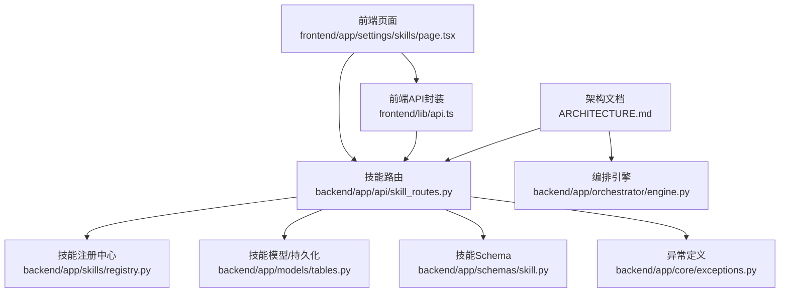
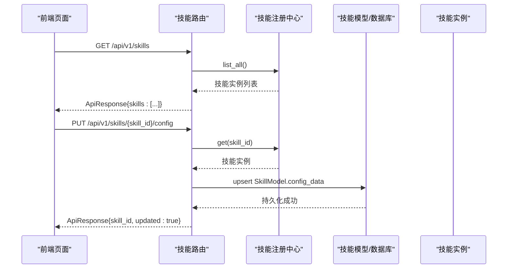
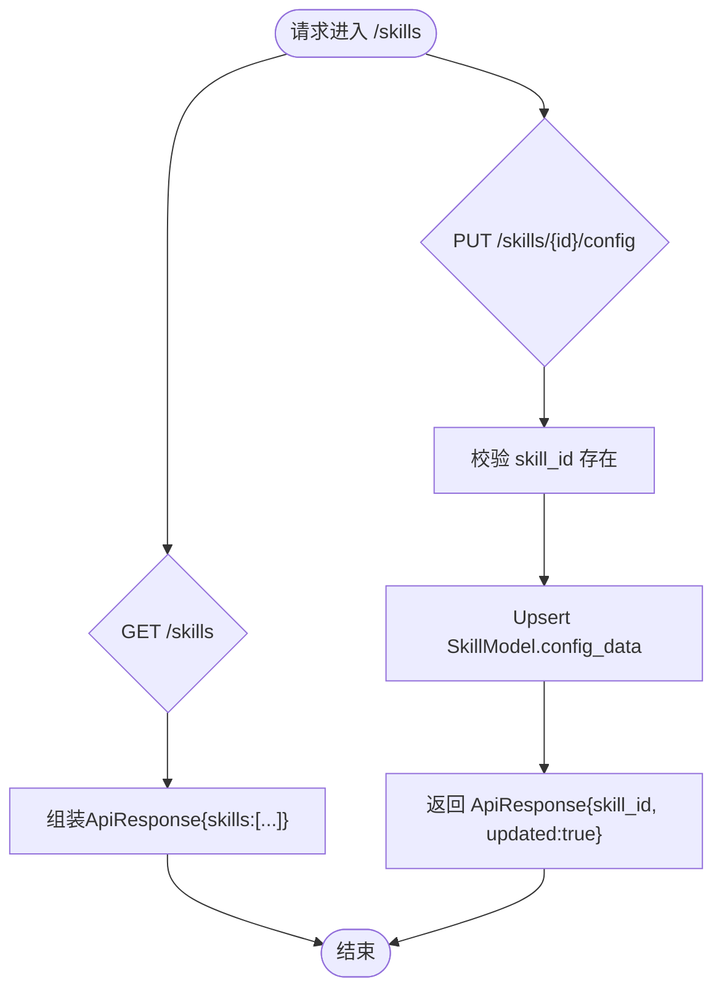
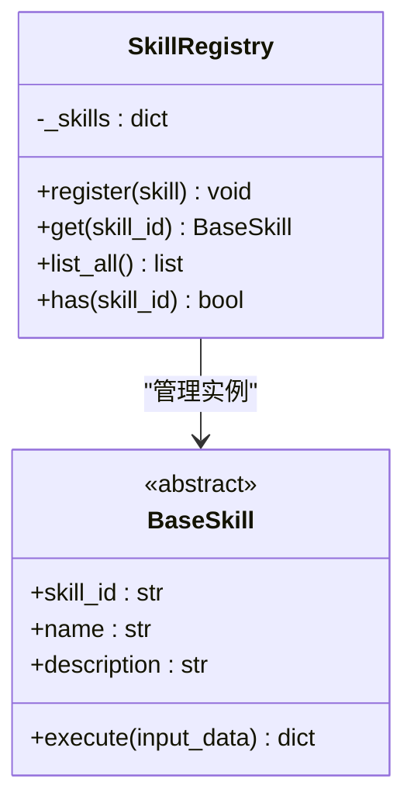
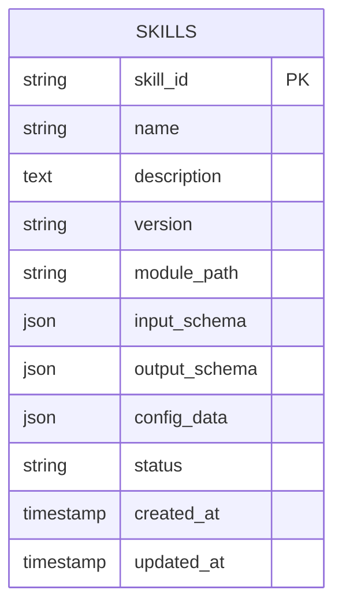
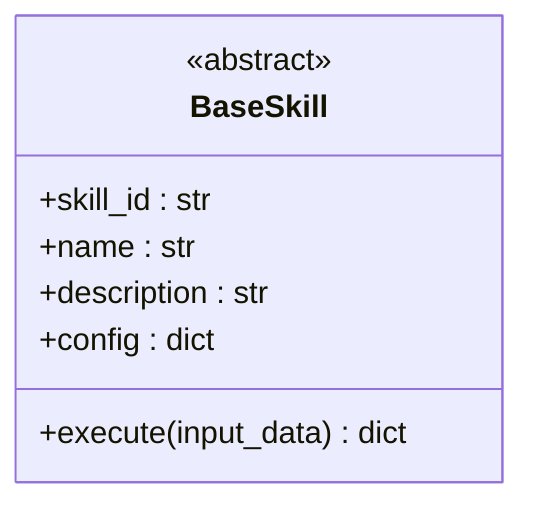
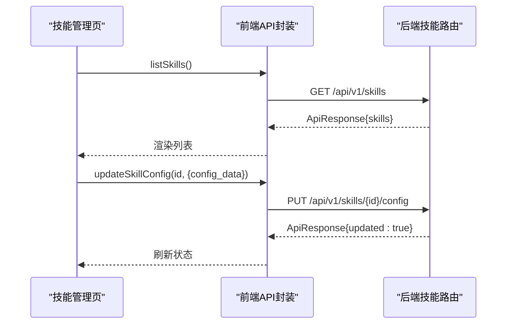
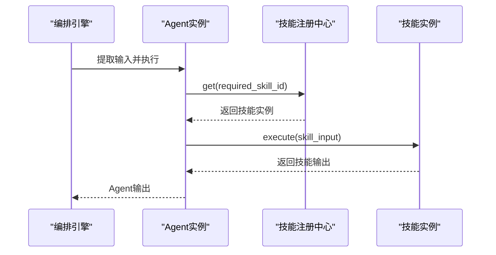
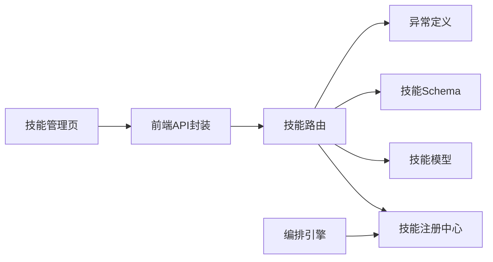

# 技能管理API

<cite>
**本文引用的文件**
- [backend/app/api/skill_routes.py](file://backend/app/api/skill_routes.py)
- [backend/app/schemas/skill.py](file://backend/app/schemas/skill.py)
- [backend/app/skills/base.py](file://backend/app/skills/base.py)
- [backend/app/skills/registry.py](file://backend/app/skills/registry.py)
- [backend/app/models/tables.py](file://backend/app/models/tables.py)
- [backend/app/core/exceptions.py](file://backend/app/core/exceptions.py)
- [backend/app/orchestrator/engine.py](file://backend/app/orchestrator/engine.py)
- [frontend/app/settings/skills/page.tsx](file://frontend/app/settings/skills/page.tsx)
- [frontend/lib/api.ts](file://frontend/lib/api.ts)
- [OpenClaw-bot-review-main/lib/openclaw-skills.ts](file://OpenClaw-bot-review-main/lib/openclaw-skills.ts)
- [ARCHITECTURE.md](file://ARCHITECTURE.md)
- [Notice.md](file://Notice.md)
</cite>

## 目录
1. [简介](#简介)
2. [项目结构](#项目结构)
3. [核心组件](#核心组件)
4. [架构总览](#架构总览)
5. [详细组件分析](#详细组件分析)
6. [依赖分析](#依赖分析)
7. [性能考量](#性能考量)
8. [故障排查指南](#故障排查指南)
9. [结论](#结论)
10. [附录](#附录)

## 简介
本文件为“技能管理API”的完整技术文档，面向技能开发者与系统集成者，聚焦以下主题：
- 技能的定义、注册、查询与配置更新接口
- 技能模板与参数配置、执行逻辑定义
- 技能与Agent的绑定关系、调用优先级与执行顺序
- 技能热更新机制、版本控制与向后兼容性处理
- 技能测试接口、性能监控与调试工具API
- 技能权限管理、访问控制与安全验证机制
- 技能执行统计、成功率分析与错误日志收集接口
- 技能开发模板、单元测试与集成测试工具

## 项目结构
技能管理API位于后端FastAPI路由层，配合技能基类、注册中心、数据库模型与前端展示页面共同构成完整能力。

图表来源
- [backend/app/api/skill_routes.py:1-61](file://backend/app/api/skill_routes.py#L1-L61)
- [backend/app/skills/registry.py:1-37](file://backend/app/skills/registry.py#L1-L37)
- [backend/app/models/tables.py:183-200](file://backend/app/models/tables.py#L183-L200)
- [backend/app/schemas/skill.py:1-22](file://backend/app/schemas/skill.py#L1-L22)
- [backend/app/core/exceptions.py:38-43](file://backend/app/core/exceptions.py#L38-L43)
- [frontend/app/settings/skills/page.tsx:1-81](file://frontend/app/settings/skills/page.tsx#L1-L81)
- [frontend/lib/api.ts:91-114](file://frontend/lib/api.ts#L91-L114)
- [ARCHITECTURE.md:635-759](file://ARCHITECTURE.md#L635-L759)
- [backend/app/orchestrator/engine.py:89-285](file://backend/app/orchestrator/engine.py#L89-L285)

章节来源
- [backend/app/api/skill_routes.py:1-61](file://backend/app/api/skill_routes.py#L1-L61)
- [frontend/app/settings/skills/page.tsx:1-81](file://frontend/app/settings/skills/page.tsx#L1-L81)
- [frontend/lib/api.ts:91-114](file://frontend/lib/api.ts#L91-L114)
- [ARCHITECTURE.md:635-759](file://ARCHITECTURE.md#L635-L759)

## 核心组件
- 技能路由层：提供技能列表查询与配置更新接口，负责参数校验、数据库交互与统一响应包装。
- 技能注册中心：集中管理技能实例，提供注册、获取、枚举与存在性判断。
- 技能基类：定义技能抽象接口与生命周期，确保所有技能具备稳定的执行契约。
- 技能模型：持久化技能元数据、配置与状态，支撑配置更新与查询。
- 异常体系：统一技能相关错误码与语义，便于前端与监控系统识别与处理。
- 前端API封装与页面：提供技能列表展示与配置更新的前端能力。

章节来源
- [backend/app/api/skill_routes.py:17-61](file://backend/app/api/skill_routes.py#L17-L61)
- [backend/app/skills/registry.py:10-37](file://backend/app/skills/registry.py#L10-L37)
- [backend/app/skills/base.py:16-37](file://backend/app/skills/base.py#L16-L37)
- [backend/app/models/tables.py:183-200](file://backend/app/models/tables.py#L183-L200)
- [backend/app/core/exceptions.py:38-43](file://backend/app/core/exceptions.py#L38-L43)
- [frontend/lib/api.ts:91-114](file://frontend/lib/api.ts#L91-L114)

## 架构总览
技能管理API遵循“声明式注册 + 配置优先”的设计原则，技能作为原子能力被Agent调用，编排器负责控制执行顺序与失败降级。

图表来源
- [backend/app/api/skill_routes.py:17-61](file://backend/app/api/skill_routes.py#L17-L61)
- [backend/app/skills/registry.py:22-29](file://backend/app/skills/registry.py#L22-L29)
- [backend/app/models/tables.py:183-200](file://backend/app/models/tables.py#L183-L200)
- [frontend/lib/api.ts:102-114](file://frontend/lib/api.ts#L102-L114)

章节来源
- [backend/app/api/skill_routes.py:17-61](file://backend/app/api/skill_routes.py#L17-L61)
- [ARCHITECTURE.md:635-759](file://ARCHITECTURE.md#L635-L759)

## 详细组件分析

### 技能路由与接口定义
- 列表查询：返回已注册技能的简要信息（含版本、状态、配置），用于前端展示与管理。
- 配置更新：根据技能ID更新技能配置，若数据库中不存在则创建新记录；支持增量更新。

图表来源
- [backend/app/api/skill_routes.py:17-61](file://backend/app/api/skill_routes.py#L17-L61)
- [backend/app/schemas/skill.py:15-22](file://backend/app/schemas/skill.py#L15-L22)

章节来源
- [backend/app/api/skill_routes.py:17-61](file://backend/app/api/skill_routes.py#L17-L61)
- [backend/app/schemas/skill.py:15-22](file://backend/app/schemas/skill.py#L15-L22)

### 技能注册中心
- 职责：维护技能实例映射，提供注册、获取、列举与存在性判断。
- 行为：重复注册会记录告警日志；获取不存在的技能抛出技能未找到异常。

图表来源
- [backend/app/skills/registry.py:10-37](file://backend/app/skills/registry.py#L10-L37)
- [backend/app/skills/base.py:16-37](file://backend/app/skills/base.py#L16-L37)

章节来源
- [backend/app/skills/registry.py:10-37](file://backend/app/skills/registry.py#L10-L37)
- [backend/app/skills/base.py:16-37](file://backend/app/skills/base.py#L16-L37)

### 技能模型与持久化
- 模型字段：包含技能ID、名称、描述、版本、模块路径、输入输出Schema、配置数据与状态等。
- 用途：支撑技能配置的持久化与查询，以及前端展示所需信息。

图表来源
- [backend/app/models/tables.py:183-200](file://backend/app/models/tables.py#L183-L200)

章节来源
- [backend/app/models/tables.py:183-200](file://backend/app/models/tables.py#L183-L200)

### 技能基类与执行契约
- 抽象方法：execute(input_data: dict) -> dict，确保所有技能具备稳定的输入输出契约。
- 配置注入：构造函数接收配置字典，供执行时使用。

图表来源
- [backend/app/skills/base.py:16-37](file://backend/app/skills/base.py#L16-L37)

章节来源
- [backend/app/skills/base.py:16-37](file://backend/app/skills/base.py#L16-L37)

### 前端展示与配置更新
- 技能列表页：拉取后端技能列表并渲染，展示技能名称、版本、状态与配置。
- 配置更新：通过前端API封装调用后端配置更新接口，实现在线配置管理。

图表来源
- [frontend/app/settings/skills/page.tsx:8-81](file://frontend/app/settings/skills/page.tsx#L8-L81)
- [frontend/lib/api.ts:102-114](file://frontend/lib/api.ts#L102-L114)
- [backend/app/api/skill_routes.py:34-61](file://backend/app/api/skill_routes.py#L34-L61)

章节来源
- [frontend/app/settings/skills/page.tsx:8-81](file://frontend/app/settings/skills/page.tsx#L8-L81)
- [frontend/lib/api.ts:102-114](file://frontend/lib/api.ts#L102-L114)
- [backend/app/api/skill_routes.py:34-61](file://backend/app/api/skill_routes.py#L34-L61)

### 技能与Agent的绑定关系、调用优先级与执行顺序
- 绑定关系：Agent通过注册中心获取所需技能实例，按节点定义顺序调用。
- 优先级与顺序：编排器按固定线性顺序执行Agent节点，技能调用发生在Agent内部。
- 失败降级：节点失败时可触发Agent降级策略，不阻断整体流程。

图表来源
- [backend/app/orchestrator/engine.py:137-176](file://backend/app/orchestrator/engine.py#L137-L176)
- [backend/app/skills/registry.py:22-29](file://backend/app/skills/registry.py#L22-L29)

章节来源
- [backend/app/orchestrator/engine.py:89-285](file://backend/app/orchestrator/engine.py#L89-L285)
- [backend/app/skills/registry.py:10-37](file://backend/app/skills/registry.py#L10-L37)

### 版本管理与热更新机制
- 版本字段：技能模型包含version字段，路由层在列表响应中返回固定版本占位。
- 热更新：通过更新技能配置实现运行时调整；若需升级技能实现，需结合注册中心与模块路径变更策略。
- 向后兼容：建议在新增配置项时保持默认值，避免破坏既有行为。

章节来源
- [backend/app/models/tables.py:190-191](file://backend/app/models/tables.py#L190-L191)
- [backend/app/api/skill_routes.py:27-31](file://backend/app/api/skill_routes.py#L27-L31)

### 权限管理、访问控制与安全验证
- 统一异常：技能未找到等错误通过统一异常体系返回，便于前端与网关层处理。
- 建议实践：在网关层增加鉴权与速率限制；对敏感配置字段进行脱敏输出。

章节来源
- [backend/app/core/exceptions.py:38-43](file://backend/app/core/exceptions.py#L38-L43)
- [Notice.md:316-341](file://Notice.md#L316-L341)

### 性能监控与调试工具API
- SSE事件：编排器通过SSE广播节点状态，前端可订阅实时进度。
- 建议扩展：在技能执行中埋点记录耗时、Token消耗与错误信息，统一写入系统日志表。

章节来源
- [ARCHITECTURE.md:325-360](file://ARCHITECTURE.md#L325-L360)
- [backend/app/orchestrator/engine.py:124-233](file://backend/app/orchestrator/engine.py#L124-L233)

### 执行统计、成功率分析与错误日志收集
- 日志模型：系统日志表支持结构化日志记录，可用于统计与审计。
- 建议扩展：在技能执行前后记录trace_id、耗时、输入输出快照与错误信息。

章节来源
- [backend/app/models/tables.py:220-233](file://backend/app/models/tables.py#L220-L233)

### 开发模板、单元测试与集成测试
- 开发模板：参考技能基类与注册中心，实现具体技能类并注册到全局注册中心。
- 测试建议：为技能执行提供Mock外部依赖，覆盖正常与异常分支。

章节来源
- [backend/app/skills/base.py:16-37](file://backend/app/skills/base.py#L16-L37)
- [backend/app/skills/registry.py:16-21](file://backend/app/skills/registry.py#L16-L21)
- [Notice.md:373-395](file://Notice.md#L373-L395)

## 依赖分析
技能管理API的耦合关系清晰，职责边界明确，主要依赖如下：

图表来源
- [backend/app/api/skill_routes.py:1-14](file://backend/app/api/skill_routes.py#L1-L14)
- [backend/app/skills/registry.py:1-37](file://backend/app/skills/registry.py#L1-L37)
- [backend/app/models/tables.py:183-200](file://backend/app/models/tables.py#L183-L200)
- [backend/app/schemas/skill.py:1-22](file://backend/app/schemas/skill.py#L1-L22)
- [backend/app/core/exceptions.py:1-125](file://backend/app/core/exceptions.py#L1-L125)
- [frontend/lib/api.ts:91-114](file://frontend/lib/api.ts#L91-L114)
- [frontend/app/settings/skills/page.tsx:1-81](file://frontend/app/settings/skills/page.tsx#L1-L81)
- [backend/app/orchestrator/engine.py:137-176](file://backend/app/orchestrator/engine.py#L137-L176)

章节来源
- [backend/app/api/skill_routes.py:1-14](file://backend/app/api/skill_routes.py#L1-L14)
- [backend/app/skills/registry.py:1-37](file://backend/app/skills/registry.py#L1-L37)
- [backend/app/models/tables.py:183-200](file://backend/app/models/tables.py#L183-L200)
- [backend/app/schemas/skill.py:1-22](file://backend/app/schemas/skill.py#L1-L22)
- [backend/app/core/exceptions.py:1-125](file://backend/app/core/exceptions.py#L1-L125)
- [frontend/lib/api.ts:91-114](file://frontend/lib/api.ts#L91-L114)
- [frontend/app/settings/skills/page.tsx:1-81](file://frontend/app/settings/skills/page.tsx#L1-L81)
- [backend/app/orchestrator/engine.py:137-176](file://backend/app/orchestrator/engine.py#L137-L176)

## 性能考量
- 异步I/O：后端采用异步框架，技能执行建议避免阻塞操作，必要时使用并发与缓存。
- 配置更新：批量更新技能配置时注意事务与一致性，避免频繁写入数据库。
- 前端渲染：技能列表数据量较大时，建议分页与虚拟滚动优化渲染性能。

## 故障排查指南
- 技能未找到：确认技能ID正确且已在注册中心注册；检查异常码与日志。
- 配置更新失败：检查请求体格式与必填字段；查看数据库写入是否成功。
- 前端无响应：确认SSE连接地址与跨域配置；检查后端事件广播是否正常。

章节来源
- [backend/app/core/exceptions.py:38-43](file://backend/app/core/exceptions.py#L38-L43)
- [backend/app/api/skill_routes.py:41-58](file://backend/app/api/skill_routes.py#L41-L58)
- [frontend/lib/api.ts:48-55](file://frontend/lib/api.ts#L48-L55)

## 结论
技能管理API以“声明式注册 + 配置优先”为核心理念，通过清晰的路由、注册中心与模型层实现技能的定义、注册、查询与配置更新。结合编排引擎与前端展示，形成可维护、可观测、可扩展的技能管理体系。建议在后续版本中增强版本控制、热更新与权限控制能力，并完善性能监控与测试工具链。

## 附录
- 相关文档与规范：架构设计、Notice约束、前端API封装与OpenClaw技能扫描工具。

章节来源
- [ARCHITECTURE.md:635-759](file://ARCHITECTURE.md#L635-L759)
- [Notice.md:124-164](file://Notice.md#L124-L164)
- [OpenClaw-bot-review-main/lib/openclaw-skills.ts:111-162](file://OpenClaw-bot-review-main/lib/openclaw-skills.ts#L111-L162)