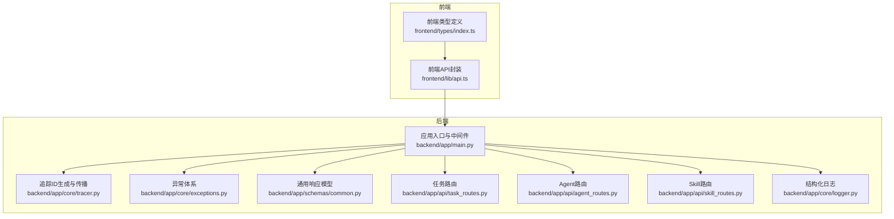
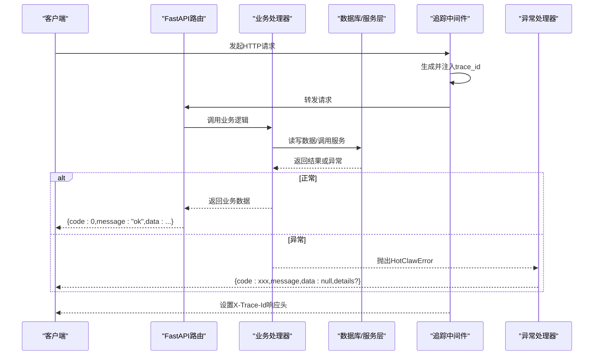
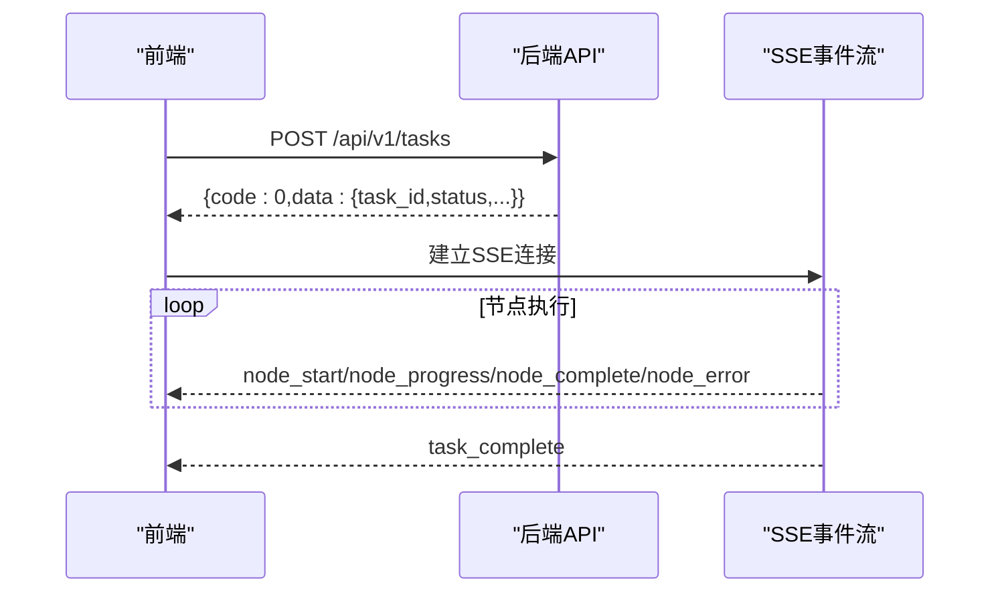
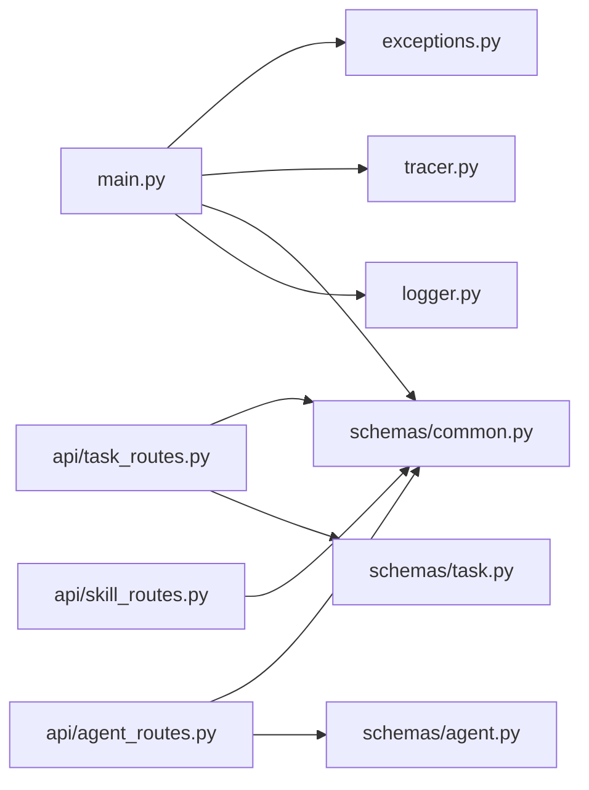

# 通用响应格式

<cite>
**本文引用的文件**
- [Notice.md](file://Notice.md)
- [ARCHITECTURE.md](file://ARCHITECTURE.md)
- [backend/app/main.py](file://backend/app/main.py)
- [backend/app/core/exceptions.py](file://backend/app/core/exceptions.py)
- [backend/app/core/tracer.py](file://backend/app/core/tracer.py)
- [backend/app/core/logger.py](file://backend/app/core/logger.py)
- [backend/app/schemas/common.py](file://backend/app/schemas/common.py)
- [backend/app/api/task_routes.py](file://backend/app/api/task_routes.py)
- [backend/app/api/agent_routes.py](file://backend/app/api/agent_routes.py)
- [backend/app/api/skill_routes.py](file://backend/app/api/skill_routes.py)
- [backend/app/schemas/task.py](file://backend/app/schemas/task.py)
- [backend/app/schemas/agent.py](file://backend/app/schemas/agent.py)
- [frontend/lib/api.ts](file://frontend/lib/api.ts)
- [frontend/types/index.ts](file://frontend/types/index.ts)
</cite>

## 目录
1. [简介](#简介)
2. [项目结构](#项目结构)
3. [核心组件](#核心组件)
4. [架构总览](#架构总览)
5. [详细组件分析](#详细组件分析)
6. [依赖分析](#依赖分析)
7. [性能考量](#性能考量)
8. [故障排查指南](#故障排查指南)
9. [结论](#结论)
10. [附录](#附录)

## 简介
本文件旨在为所有API使用者提供统一的响应格式与错误处理参考标准，覆盖以下要点：
- 统一响应结构与字段定义
- 成功与错误响应格式
- 错误码体系与HTTP状态码映射
- 分页响应格式与批量操作响应模式
- 异步任务响应与SSE事件流
- 请求ID追踪、日志关联与调试信息控制
- CORS配置、请求限流与安全头部
- API版本兼容策略与废弃API处理

以上规范以Notice文档中的接口协议为基础，结合后端FastAPI实现与前端客户端封装，形成可落地的统一标准。

## 项目结构
后端采用FastAPI + SQLAlchemy架构，遵循“路由只处理请求/响应、业务逻辑在服务层”的分层原则。前端通过统一的fetch封装调用后端API，统一处理响应与错误。

图表来源
- [backend/app/main.py:69-153](file://backend/app/main.py#L69-L153)
- [frontend/lib/api.ts:14-24](file://frontend/lib/api.ts#L14-L24)
- [frontend/types/index.ts:10-15](file://frontend/types/index.ts#L10-L15)

章节来源
- [backend/app/main.py:69-153](file://backend/app/main.py#L69-L153)
- [frontend/lib/api.ts:14-24](file://frontend/lib/api.ts#L14-L24)
- [frontend/types/index.ts:10-15](file://frontend/types/index.ts#L10-L15)

## 核心组件
- 统一响应模型
  - 成功响应：包含code、message、data字段
  - 错误响应：包含code、message、data（通常为null）、details（可选）
- 错误码体系
  - 用户输入错误：1xxx
  - 冲突/存在性错误：2xxx
  - 外部/执行错误：3xxx
  - 配置错误：4xxx
  - 系统错误：5xxx
- HTTP状态码映射
  - 1xxx/4xxx → 400；2xxx → 409；3xxx → 502；5xxx → 500
  - 特殊映射：找不到资源（1002/1003/1004/2002）→ 404；Agent超时（3003）→ 504
- 追踪与日志
  - X-Trace-Id响应头；结构化日志记录；支持调试信息开关
- CORS与安全
  - CORS中间件；可扩展安全头部与限流策略

章节来源
- [backend/app/schemas/common.py:7-27](file://backend/app/schemas/common.py#L7-L27)
- [backend/app/core/exceptions.py:4-125](file://backend/app/core/exceptions.py#L4-L125)
- [backend/app/main.py:96-138](file://backend/app/main.py#L96-L138)
- [backend/app/core/tracer.py:10-34](file://backend/app/core/tracer.py#L10-L34)
- [backend/app/core/logger.py:8-36](file://backend/app/core/logger.py#L8-L36)

## 架构总览
统一响应与错误处理在后端通过全局异常处理器与中间件实现，前端通过统一的请求封装解析响应并抛出错误。

图表来源
- [backend/app/main.py:86-94](file://backend/app/main.py#L86-L94)
- [backend/app/main.py:96-138](file://backend/app/main.py#L96-L138)
- [backend/app/api/task_routes.py:39-67](file://backend/app/api/task_routes.py#L39-L67)

章节来源
- [backend/app/main.py:86-138](file://backend/app/main.py#L86-L138)
- [backend/app/api/task_routes.py:39-67](file://backend/app/api/task_routes.py#L39-L67)

## 详细组件分析

### 统一响应结构与字段定义
- 成功响应
  - code: 数字，0表示成功
  - message: 字符串，成功时为"ok"
  - data: 任意结构，承载业务数据
- 错误响应
  - code: 数字，错误码
  - message: 字符串，错误描述
  - data: 通常为null
  - details: 可选，包含额外上下文（如字段校验详情）

章节来源
- [Notice.md:190-212](file://Notice.md#L190-L212)
- [backend/app/schemas/common.py:7-27](file://backend/app/schemas/common.py#L7-L27)
- [frontend/types/index.ts:10-15](file://frontend/types/index.ts#L10-L15)

### 错误码体系与HTTP状态码映射
- 错误码分组
  - 1xxx：用户输入/参数校验类错误
  - 2xxx：冲突/存在性错误（如重复运行、对象不存在）
  - 3xxx：外部服务/执行类错误（LLM调用、Agent执行、超时）
  - 4xxx：配置类错误（配置格式、清单格式）
  - 5xxx：系统内部错误
- HTTP状态码映射
  - 1xxx/4xxx → 400；2xxx → 409；3xxx → 502；5xxx → 500
  - 特例：404（1002/1003/1004/2002）；504（3003）

章节来源
- [backend/app/core/exceptions.py:14-125](file://backend/app/core/exceptions.py#L14-L125)
- [backend/app/main.py:99-114](file://backend/app/main.py#L99-L114)

### 分页响应格式
- 通用分页元数据
  - page：当前页
  - page_size：每页数量
  - total：总数
- 示例：任务列表返回tasks数组与pagination元数据

章节来源
- [backend/app/schemas/common.py:22-27](file://backend/app/schemas/common.py#L22-L27)
- [backend/app/api/task_routes.py:152-179](file://backend/app/api/task_routes.py#L152-L179)

### 批量操作响应
- 批量更新Agent配置返回：agent_id与updated_fields列表
- 批量更新Skill配置返回：skill_id与updated布尔值
- 建议：批量接口统一返回受影响对象列表与概要统计

章节来源
- [backend/app/api/agent_routes.py:111-114](file://backend/app/api/agent_routes.py#L111-L114)
- [backend/app/api/skill_routes.py:59-60](file://backend/app/api/skill_routes.py#L59-L60)

### 异步任务响应与SSE事件流
- 任务创建立即返回任务标识与初始状态
- 通过SSE事件流推送节点开始、进度、完成、错误等事件
- 前端通过独立HTTP端点直连后端SSE，避免代理缓冲

图表来源
- [frontend/lib/api.ts:48-55](file://frontend/lib/api.ts#L48-L55)
- [backend/app/api/task_routes.py:39-67](file://backend/app/api/task_routes.py#L39-L67)

章节来源
- [frontend/lib/api.ts:48-55](file://frontend/lib/api.ts#L48-L55)
- [ARCHITECTURE.md:325-360](file://ARCHITECTURE.md#L325-L360)

### 请求ID追踪、日志关联与调试信息控制
- 追踪ID
  - 中间件生成并注入X-Trace-Id响应头
  - 后端上下文变量保存trace_id与task_id
- 日志
  - 结构化日志，包含trace_id、task_id、时间戳、级别等
  - 调试模式下返回details或错误堆栈摘要
- 建议
  - 前端在错误上报时附带X-Trace-Id
  - 后端日志中统一包含trace_id与task_id

章节来源
- [backend/app/main.py:86-94](file://backend/app/main.py#L86-L94)
- [backend/app/core/tracer.py:10-34](file://backend/app/core/tracer.py#L10-L34)
- [backend/app/core/logger.py:8-36](file://backend/app/core/logger.py#L8-L36)
- [backend/app/main.py:126-138](file://backend/app/main.py#L126-L138)

### CORS配置、请求限流与安全头部
- CORS
  - 已启用，允许跨域访问；生产环境建议收紧origins、headers、methods
- 限流与安全
  - 未在当前代码中实现；建议在网关或中间件层增加速率限制与安全头部（如Strict-Transport-Security、X-Content-Type-Options等）

章节来源
- [backend/app/main.py:76-83](file://backend/app/main.py#L76-L83)

### API版本兼容性、向后兼容策略与废弃API处理
- 版本路径
  - 后端统一使用/api/v1前缀
- 兼容策略
  - 保持字段语义稳定；新增字段向后兼容；变更字段在新版本推出
- 废弃处理
  - 通过Notice文档与架构文档明确废弃流程；提供迁移指引与过渡期

章节来源
- [backend/app/main.py:12-20](file://backend/app/main.py#L12-L20)
- [Notice.md:190-212](file://Notice.md#L190-L212)
- [ARCHITECTURE.md:190-218](file://ARCHITECTURE.md#L190-L218)

## 依赖分析
后端核心依赖关系如下：

图表来源
- [backend/app/main.py:14-20](file://backend/app/main.py#L14-L20)
- [backend/app/api/task_routes.py:11-14](file://backend/app/api/task_routes.py#L11-L14)
- [backend/app/api/agent_routes.py:8](file://backend/app/api/agent_routes.py#L8)
- [backend/app/api/skill_routes.py:8](file://backend/app/api/skill_routes.py#L8)

章节来源
- [backend/app/main.py:14-20](file://backend/app/main.py#L14-L20)
- [backend/app/api/task_routes.py:11-14](file://backend/app/api/task_routes.py#L11-L14)
- [backend/app/api/agent_routes.py:8](file://backend/app/api/agent_routes.py#L8)
- [backend/app/api/skill_routes.py:8](file://backend/app/api/skill_routes.py#L8)

## 性能考量
- 响应体大小
  - 分页接口限制page_size上限，避免过大响应
- 异步任务
  - 任务创建立即返回，后台异步执行，降低请求延迟
- SSE
  - 事件驱动推送，减少轮询开销
- 建议
  - 对高频接口增加缓存；对长列表分页与懒加载；对SSE连接数进行限流

章节来源
- [backend/app/api/task_routes.py:154-156](file://backend/app/api/task_routes.py#L154-L156)
- [frontend/lib/api.ts:48-55](file://frontend/lib/api.ts#L48-L55)

## 故障排查指南
- 前端错误处理
  - 当code非0时抛出错误，message为错误描述；建议捕获并展示
- 后端异常处理
  - HotClawError映射到相应HTTP状态码；未捕获异常统一返回500与details（调试模式）
- 追踪与日志
  - 通过X-Trace-Id关联前后端日志；结构化日志便于检索
- 常见问题
  - 400：参数校验失败（details包含字段详情）
  - 404：对象不存在（任务/Agent/Skill/工作流）
  - 409：冲突（如重复运行）
  - 502：外部服务/LLM调用失败
  - 504：Agent执行超时
  - 500：系统内部错误

章节来源
- [frontend/lib/api.ts:14-24](file://frontend/lib/api.ts#L14-L24)
- [backend/app/main.py:96-138](file://backend/app/main.py#L96-L138)
- [backend/app/core/exceptions.py:14-125](file://backend/app/core/exceptions.py#L14-L125)

## 结论
本文基于Notice与后端实现，总结了统一响应格式、错误码体系、HTTP状态码映射、分页与异步任务响应模式、追踪与日志、CORS与安全建议以及版本兼容策略。建议在生产环境中收紧CORS、增加限流与安全头部，并在前端统一处理错误与追踪ID，确保可观测性与一致性。

## 附录
- 前端类型定义与统一请求封装
  - ApiResponse接口与各业务数据类型
  - 统一fetch封装，自动解析响应并抛错

章节来源
- [frontend/types/index.ts:10-15](file://frontend/types/index.ts#L10-L15)
- [frontend/lib/api.ts:14-24](file://frontend/lib/api.ts#L14-L24)