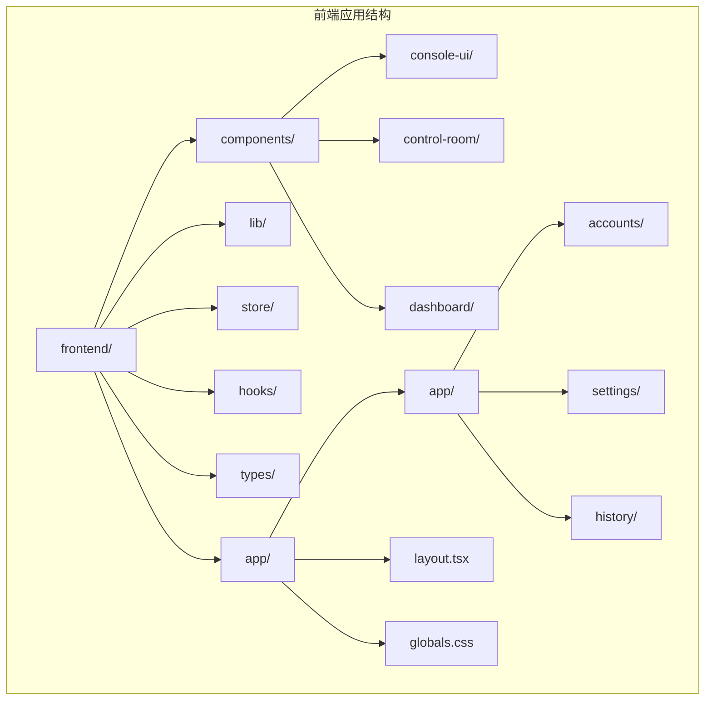
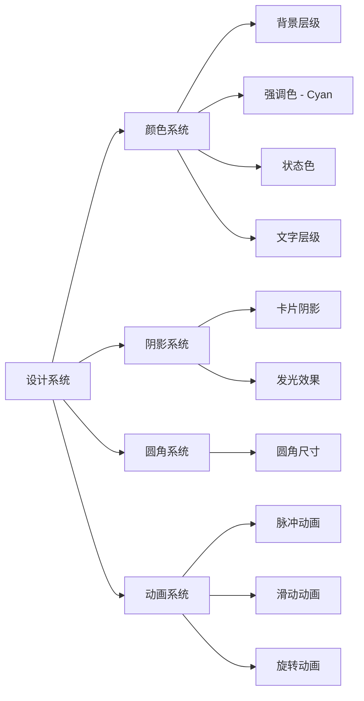
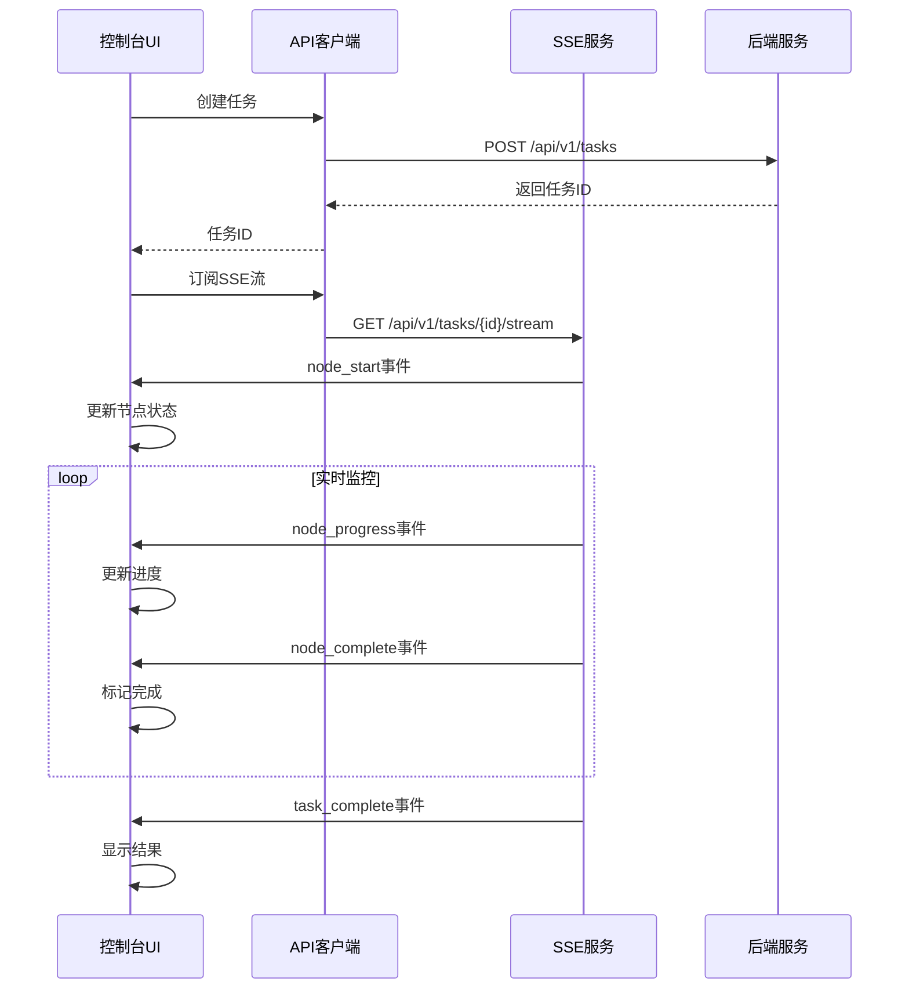
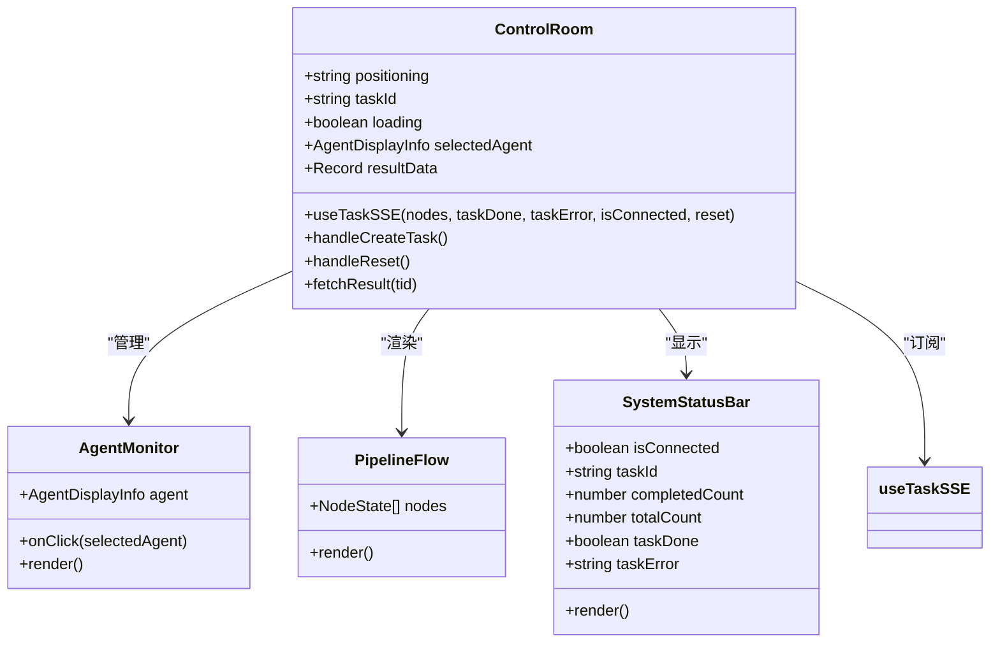
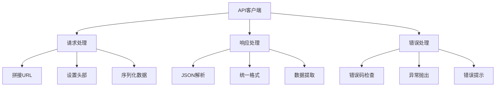
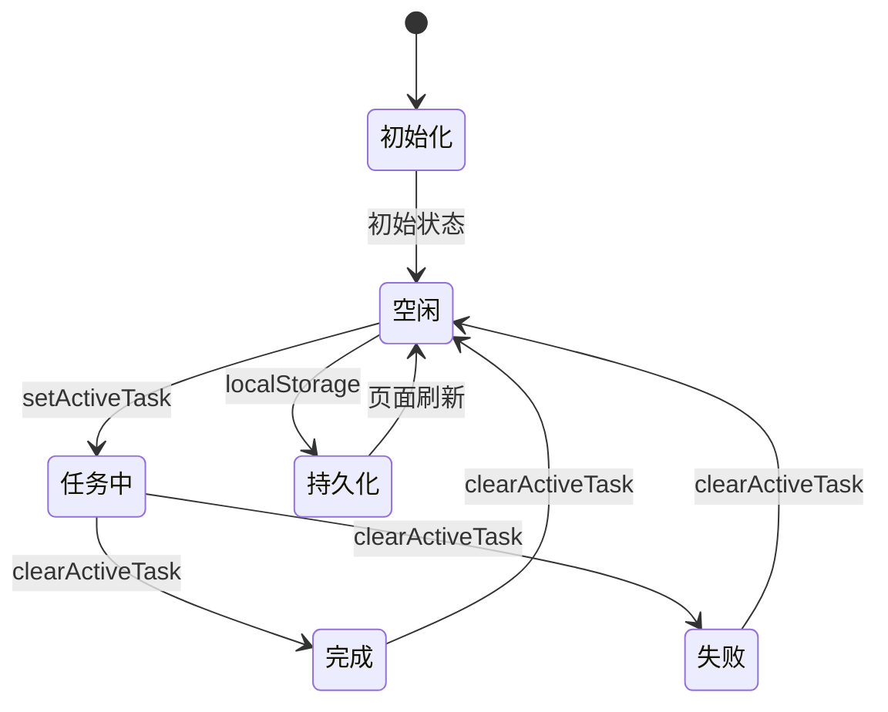
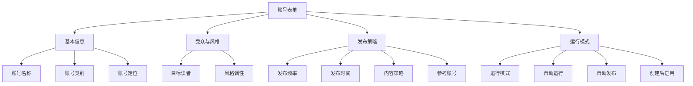
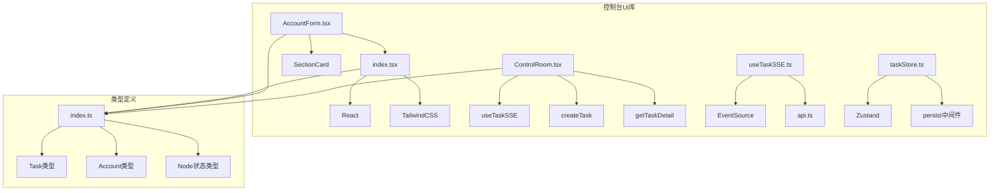

# 控制台UI库

<cite>
**本文档引用的文件**
- [index.tsx](file://frontend/components/console-ui/index.tsx)
- [AccountForm.tsx](file://frontend/components/console-ui/AccountForm.tsx)
- [api.ts](file://frontend/lib/api.ts)
- [taskStore.ts](file://frontend/store/taskStore.ts)
- [useTaskSSE.ts](file://frontend/hooks/useTaskSSE.ts)
- [index.ts](file://frontend/types/index.ts)
- [ControlRoom.tsx](file://frontend/components/control-room/ControlRoom.tsx)
- [page.tsx](file://frontend/app/accounts/new/page.tsx)
- [layout.tsx](file://frontend/app/layout.tsx)
- [globals.css](file://frontend/app/globals.css)
- [README.md](file://README.md)
- [ARCHITECTURE.md](file://ARCHITECTURE.md)
</cite>

## 目录
1. [简介](#简介)
2. [项目结构](#项目结构)
3. [核心组件](#核心组件)
4. [架构概览](#架构概览)
5. [详细组件分析](#详细组件分析)
6. [依赖关系分析](#依赖关系分析)
7. [性能考量](#性能考量)
8. [故障排除指南](#故障排除指南)
9. [结论](#结论)

## 简介

HotClaw 控制台UI库是一个专为多智能体内容生产平台设计的React组件库，提供了完整的控制台界面解决方案。该库采用现代化的设计系统，实现了深空主题的控制台界面，支持实时任务监控、智能体状态可视化和完整的账号管理系统。

该控制台UI库的核心特点包括：
- 基于深空主题的现代化设计系统
- 实时任务状态监控和可视化
- 智能体编排和状态管理
- 完整的账号生命周期管理
- 响应式布局和用户体验优化

## 项目结构

前端项目采用Next.js 16框架，结构清晰合理：



**图表来源**
- [README.md:146-171](file://README.md#L146-L171)

**章节来源**
- [README.md:146-171](file://README.md#L146-L171)
- [ARCHITECTURE.md:191-289](file://ARCHITECTURE.md#L191-L289)

## 核心组件

### 控制台UI组件库

控制台UI库提供了丰富的组件，支持从基础的页面布局到复杂的业务功能：

#### 基础布局组件
- **PageHeader**: 页面头部组件，支持标题、副标题和操作按钮
- **SectionCard**: 区域卡片组件，用于组织页面内容
- **EmptyState**: 空状态组件，提供友好的用户提示

#### 状态展示组件
- **StatCard**: 统计卡片组件，支持不同状态色调
- **StatusBadge**: 状态徽章组件，显示任务或内容状态
- **FilterTabs**: 过滤标签组件，支持状态切换

#### 导航组件
- **ShellNav**: 侧边导航组件，支持活动状态高亮
- **formatDateTime**: 日期时间格式化工具函数

#### 表单组件
- **AccountForm**: 账号创建表单，支持完整的账号配置

**章节来源**
- [index.tsx:7-175](file://frontend/components/console-ui/index.tsx#L7-L175)
- [AccountForm.tsx:6-115](file://frontend/components/console-ui/AccountForm.tsx#L6-L115)

### 设计系统特性

控制台UI库采用了完整的CSS变量设计系统：



**图表来源**
- [globals.css:8-83](file://frontend/app/globals.css#L8-L83)

**章节来源**
- [globals.css:8-83](file://frontend/app/globals.css#L8-L83)

## 架构概览

### 整体架构设计

HotClaw采用前后端分离架构，控制台UI库作为前端的重要组成部分：

```mermaid
graph TB
subgraph "前端控制台"
A[控制台UI库] --> B[API客户端]
A --> C[SSE钩子]
A --> D[状态管理]
B --> B1[任务API]
B --> B2[账号API]
B --> B3[智能体API]
C --> C1[实时监控]
C --> C2[状态同步]
D --> D1[任务状态]
D --> D2[配置状态]
end
subgraph "后端服务"
E[API网关] --> F[编排引擎]
F --> G[智能体集群]
G --> H[技能系统]
end
A < --> E
```

**图表来源**
- [ARCHITECTURE.md:39-78](file://ARCHITECTURE.md#L39-L78)

### 实时通信架构

控制台UI库通过SSE实现与后端的实时通信：



**图表来源**
- [useTaskSSE.ts:149-213](file://frontend/hooks/useTaskSSE.ts#L149-L213)

**章节来源**
- [ARCHITECTURE.md:325-360](file://ARCHITECTURE.md#L325-L360)
- [useTaskSSE.ts:149-213](file://frontend/hooks/useTaskSSE.ts#L149-L213)

## 详细组件分析

### 控制室组件 (ControlRoom)

控制室组件是整个控制台UI的核心，提供了完整的任务管理和监控功能：



**图表来源**
- [ControlRoom.tsx:39-366](file://frontend/components/control-room/ControlRoom.tsx#L39-L366)

#### 组件功能特性

控制室组件实现了以下核心功能：

1. **任务创建和管理**
   - 支持通过账号定位创建新任务
   - 实时监控任务执行状态
   - 提供任务重置功能

2. **智能体监控**
   - 实时显示6个智能体的执行状态
   - 支持智能体详情查看
   - 提供状态可视化展示

3. **结果预览**
   - 自动获取任务完成后的结果数据
   - 提供关键指标的统计卡片
   - 支持跳转到详细结果页面

**章节来源**
- [ControlRoom.tsx:39-366](file://frontend/components/control-room/ControlRoom.tsx#L39-L366)

### API客户端设计

API客户端提供了统一的后端服务访问接口：



**图表来源**
- [api.ts:65-85](file://frontend/lib/api.ts#L65-L85)

#### API设计原则

1. **统一请求处理**
   - 自动添加BASE路径前缀
   - 设置Content-Type头部
   - 统一JSON序列化

2. **灵活响应处理**
   - 支持统一响应格式
   - 兼容直接数据返回
   - 自动错误检查

3. **SSE特殊处理**
   - 开发环境直连后端端口
   - 生产环境使用代理
   - 环境自动检测

**章节来源**
- [api.ts:65-85](file://frontend/lib/api.ts#L65-L85)
- [api.ts:142-148](file://frontend/lib/api.ts#L142-L148)

### 状态管理架构

控制台UI库采用Zustand实现轻量级状态管理：



**图表来源**
- [taskStore.ts:39-116](file://frontend/store/taskStore.ts#L39-L116)

#### 状态管理特性

1. **持久化存储**
   - 使用localStorage保存状态
   - 页面刷新后自动恢复
   - 支持跨会话状态共享

2. **类型安全**
   - TypeScript泛型约束
   - 完整的接口定义
   - 编译时类型检查

3. **轻量级实现**
   - 基于Zustand的简洁API
   - 避免样板代码
   - 高性能状态更新

**章节来源**
- [taskStore.ts:39-116](file://frontend/store/taskStore.ts#L39-L116)

### 账号管理表单

账号管理表单提供了完整的账号创建和配置功能：



**图表来源**
- [AccountForm.tsx:23-78](file://frontend/components/console-ui/AccountForm.tsx#L23-L78)

#### 表单设计特点

1. **分步式布局**
   - 4个主要配置区域
   - 渐进式信息收集
   - 用户友好体验

2. **智能验证**
   - 必填字段验证
   - 字符长度限制
   - 实时错误提示

3. **灵活配置**
   - 支持多种运行模式
   - 可选的发布策略
   - 灵活的账号分类

**章节来源**
- [AccountForm.tsx:23-78](file://frontend/components/console-ui/AccountForm.tsx#L23-L78)

## 依赖关系分析

### 组件依赖图



**图表来源**
- [index.tsx:1-5](file://frontend/components/console-ui/index.tsx#L1-L5)
- [AccountForm.tsx:3-4](file://frontend/components/console-ui/AccountForm.tsx#L3-L4)
- [useTaskSSE.ts:32-34](file://frontend/hooks/useTaskSSE.ts#L32-L34)

### 技术栈依赖

控制台UI库采用现代化的技术栈组合：

| 技术类别 | 核心技术 | 版本/特性 | 用途 |
|---------|----------|-----------|------|
| 框架 | React 18 | 18.x | 组件基础 |
| 构建 | Next.js 16 | 16.x | 应用框架 |
| 状态管理 | Zustand | 4.x | 轻量级状态 |
| 样式 | TailwindCSS | 3.x | 原子化样式 |
| 类型系统 | TypeScript | 5.x | 类型安全 |
| 实时通信 | EventSource | 原生API | SSE支持 |

**章节来源**
- [ARCHITECTURE.md:194-204](file://ARCHITECTURE.md#L194-L204)

## 性能考量

### 优化策略

1. **组件懒加载**
   - 使用React.lazy实现代码分割
   - 按需加载大型组件
   - 减少初始包体积

2. **状态优化**
   - 使用Zustand替代Redux
   - 避免不必要的状态更新
   - 组件订阅精确选择器

3. **网络优化**
   - API请求缓存策略
   - SSE连接池管理
   - 错误重试机制

4. **渲染优化**
   - React.memo组件缓存
   - useCallback函数记忆
   - useMemo计算缓存

### 性能监控

控制台UI库内置了性能监控机制：

- **SSE连接状态监控**
- **任务执行时间统计**
- **组件渲染性能分析**
- **内存使用情况跟踪**

## 故障排除指南

### 常见问题及解决方案

#### SSE连接问题
**症状**: 任务状态不更新或连接频繁断开
**解决方案**:
1. 检查后端SSE服务状态
2. 验证网络连接稳定性
3. 确认浏览器EventSource支持
4. 检查CORS配置

#### API请求失败
**症状**: 账号创建或任务创建失败
**解决方案**:
1. 检查后端服务是否正常运行
2. 验证API端点可达性
3. 确认认证信息正确性
4. 查看详细的错误信息

#### 状态同步问题
**症状**: 页面刷新后状态丢失
**解决方案**:
1. 检查localStorage是否可用
2. 验证persist中间件配置
3. 确认浏览器隐私设置
4. 重启应用清除缓存

**章节来源**
- [useTaskSSE.ts:215-229](file://frontend/hooks/useTaskSSE.ts#L215-L229)
- [taskStore.ts:140-150](file://frontend/store/taskStore.ts#L140-L150)

## 结论

HotClaw控制台UI库是一个设计精良、功能完整的React组件库，为多智能体内容生产平台提供了强大的前端基础设施。该库的主要优势包括：

1. **现代化设计系统**: 深空主题设计，提供沉浸式的控制台体验
2. **完整的功能覆盖**: 从基础组件到复杂业务功能的全面支持
3. **高性能架构**: 基于现代技术栈的优化设计
4. **良好的可维护性**: 清晰的代码结构和完善的类型定义

该控制台UI库不仅满足了当前的功能需求，还为未来的功能扩展奠定了坚实的基础。通过合理的架构设计和组件抽象，开发者可以快速构建复杂的控制台应用，同时保持代码的可维护性和可扩展性。

随着HotClaw平台的不断发展，控制台UI库将继续演进，为用户提供更加丰富和高效的控制台体验。