# 设计系统文档

<cite>
**本文档引用的文件**
- [README.md](file://README.md)
- [ARCHITECTURE.md](file://ARCHITECTURE.md)
- [PROJECT_STRUCTURE.md](file://PROJECT_STRUCTURE.md)
- [frontend/app/globals.css](file://frontend/app/globals.css)
- [frontend/components/command-center/CommandCenter.tsx](file://frontend/components/command-center/CommandCenter.tsx)
- [frontend/components/command-center/AgentNode.tsx](file://frontend/components/command-center/AgentNode.tsx)
- [frontend/components/command-center/HoloLines.tsx](file://frontend/components/command-center/HoloLines.tsx)
- [frontend/hooks/useTaskSSE.ts](file://frontend/hooks/useTaskSSE.ts)
- [frontend/types/index.ts](file://frontend/types/index.ts)
- [OpenClaw-bot-review-main/lib/theme.tsx](file://OpenClaw-bot-review-main/lib/theme.tsx)
</cite>

## 目录
1. [简介](#简介)
2. [项目结构](#项目结构)
3. [核心设计系统](#核心设计系统)
4. [架构概览](#架构概览)
5. [详细组件分析](#详细组件分析)
6. [设计系统实现](#设计系统实现)
7. [性能考量](#性能考量)
8. [故障排除指南](#故障排除指南)
9. [结论](#结论)

## 简介

HotClaw 是一个基于多智能体协作的微信公众号内容自动生成平台。该项目采用现代化的设计系统架构，通过深空主题的视觉设计和组件化的前端实现，为用户提供沉浸式的任务执行体验。

该设计系统的核心特点包括：
- **深空主题视觉风格**：以深色背景为主，配合青色和紫色的科技感色彩
- **响应式布局系统**：基于 CSS 变量的灵活设计令牌
- **动画系统**：丰富的 CSS 动画效果，增强用户体验
- **组件化架构**：模块化的 React 组件设计

## 项目结构

HotClaw 项目采用前后端分离的架构设计，主要分为三个核心部分：

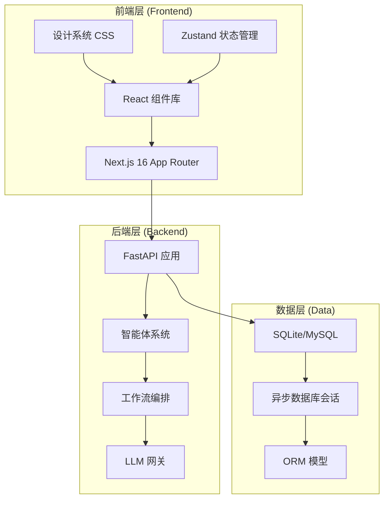

**图表来源**
- [PROJECT_STRUCTURE.md:32-64](file://PROJECT_STRUCTURE.md#L32-L64)

**章节来源**
- [PROJECT_STRUCTURE.md:29-64](file://PROJECT_STRUCTURE.md#L29-L64)
- [README.md:135-160](file://README.md#L135-L160)

## 核心设计系统

### 设计令牌系统

设计系统采用 CSS 变量实现统一的设计令牌管理，涵盖背景、边框、文字、强调色等多个维度：

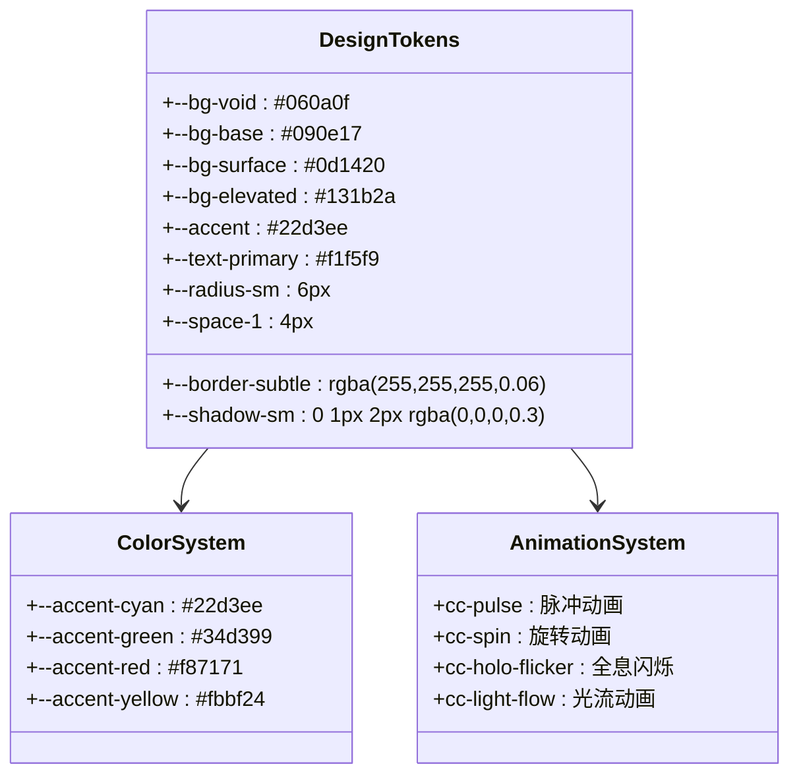

**图表来源**
- [frontend/app/globals.css:8-83](file://frontend/app/globals.css#L8-L83)

### 深空背景系统

设计系统实现了独特的深空背景效果，通过多重渐变和星点网格营造科技感氛围：

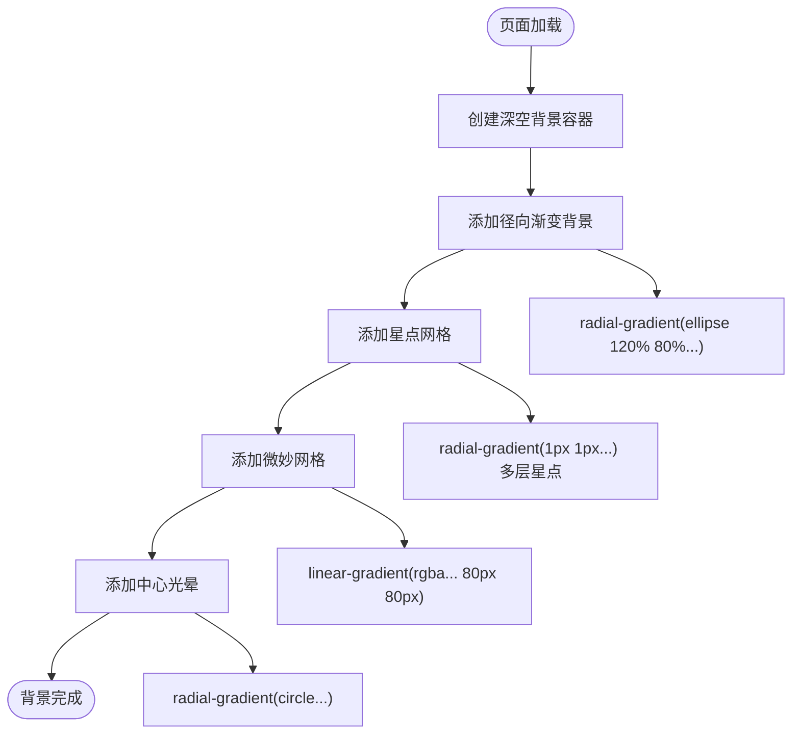

**图表来源**
- [frontend/app/globals.css:105-161](file://frontend/app/globals.css#L105-L161)

**章节来源**
- [frontend/app/globals.css:1-800](file://frontend/app/globals.css#L1-L800)

## 架构概览

### 前端架构设计

HotClaw 的前端采用现代化的 Next.js 16 架构，结合 React 组件化设计和设计系统实现：

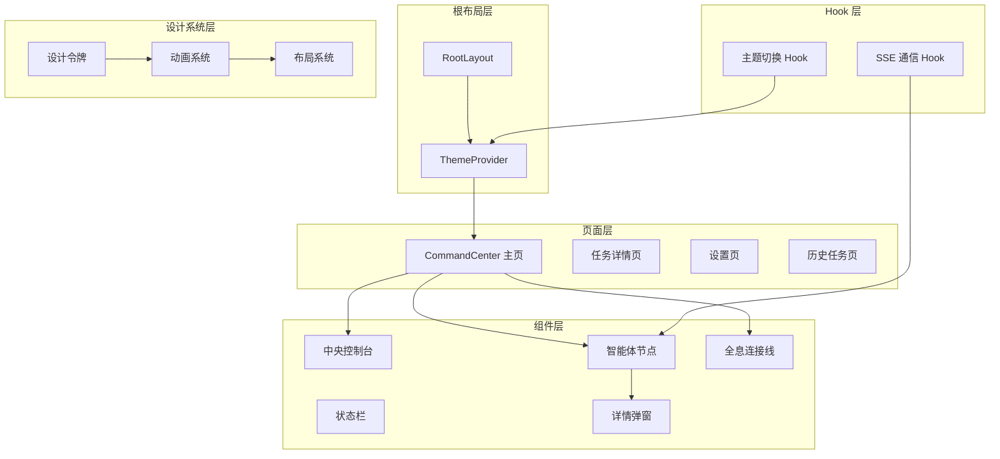

**图表来源**
- [frontend/components/command-center/CommandCenter.tsx:99-318](file://frontend/components/command-center/CommandCenter.tsx#L99-L318)

### 智能体节点系统

设计系统中的智能体节点采用环形布局，每个节点代表一个智能体的执行状态：

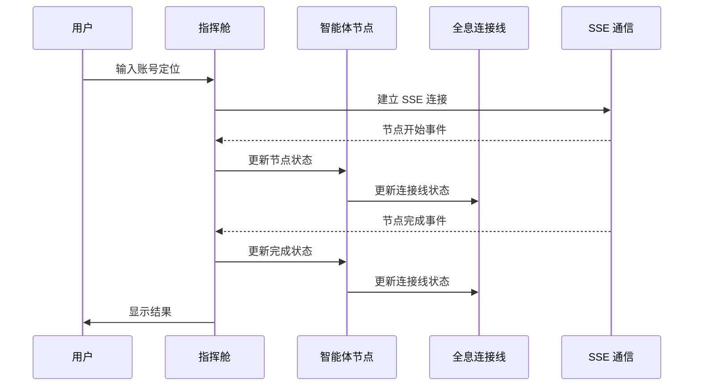

**图表来源**
- [frontend/components/command-center/CommandCenter.tsx:134-150](file://frontend/components/command-center/CommandCenter.tsx#L134-L150)
- [frontend/hooks/useTaskSSE.ts:729-762](file://frontend/hooks/useTaskSSE.ts#L729-L762)

**章节来源**
- [frontend/components/command-center/CommandCenter.tsx:1-318](file://frontend/components/command-center/CommandCenter.tsx#L1-L318)
- [frontend/hooks/useTaskSSE.ts:729-762](file://frontend/hooks/useTaskSSE.ts#L729-L762)

## 详细组件分析

### 指挥舱主组件

CommandCenter 作为设计系统的核心组件，实现了深空主题的环形布局和实时状态更新：

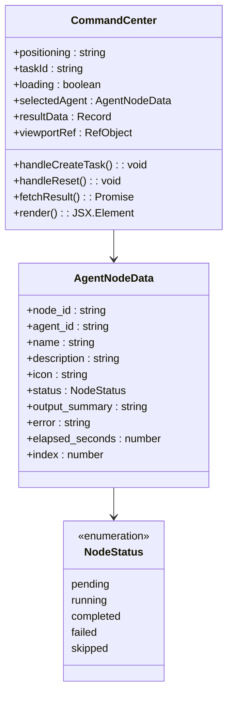

**图表来源**
- [frontend/components/command-center/CommandCenter.tsx:30-42](file://frontend/components/command-center/CommandCenter.tsx#L30-L42)
- [frontend/types/index.ts:5-6](file://frontend/types/index.ts#L5-L6)

### 智能体节点组件

AgentNode 组件实现了状态驱动的视觉反馈系统：

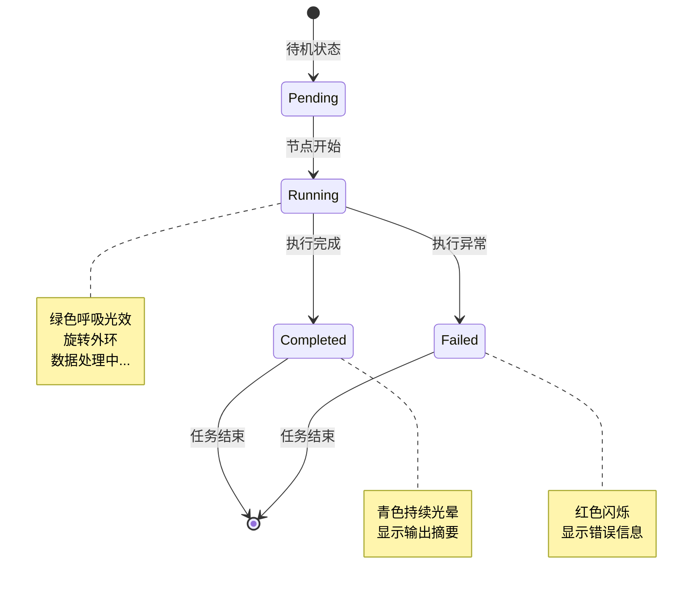

**图表来源**
- [frontend/components/command-center/AgentNode.tsx:60-102](file://frontend/components/command-center/AgentNode.tsx#L60-L102)

### 全息连接线系统

HoloLines 组件通过 SVG 贝塞尔曲线实现动态连接效果：

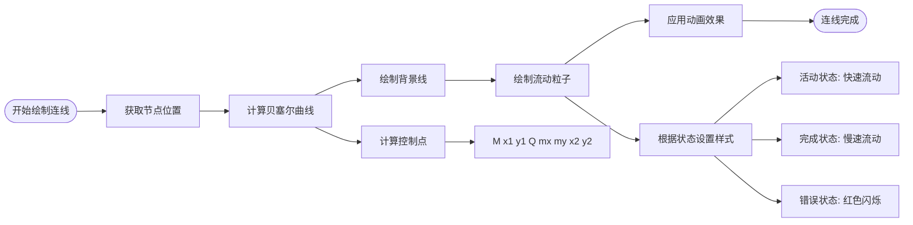

**图表来源**
- [frontend/components/command-center/HoloLines.tsx:43-105](file://frontend/components/command-center/HoloLines.tsx#L43-L105)

**章节来源**
- [frontend/components/command-center/AgentNode.tsx:1-198](file://frontend/components/command-center/AgentNode.tsx#L1-L198)
- [frontend/components/command-center/HoloLines.tsx:1-123](file://frontend/components/command-center/HoloLines.tsx#L1-L123)

### 主题系统

设计系统包含完整的主题切换功能，支持深色和浅色模式：

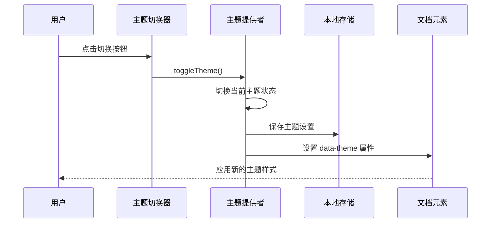

**图表来源**
- [OpenClaw-bot-review-main/lib/theme.tsx:30-38](file://OpenClaw-bot-review-main/lib/theme.tsx#L30-L38)

**章节来源**
- [OpenClaw-bot-review-main/lib/theme.tsx:1-63](file://OpenClaw-bot-review-main/lib/theme.tsx#L1-L63)

## 设计系统实现

### CSS 变量系统

设计系统通过 CSS 变量实现统一的主题管理：

| 系统类别 | 变量前缀 | 示例变量 | 用途 |
|---------|---------|---------|------|
| 背景层级 | --bg- | --bg-void, --bg-base, --bg-surface | 页面背景层次 |
| 边框系统 | --border- | --border-subtle, --border-default | 边框样式 |
| 文字系统 | --text- | --text-primary, --text-secondary | 文字颜色 |
| 强调色 | --accent- | --accent, --accent-hover | 主要强调色 |
| 状态色 | --stat- | --stat-cyan, --stat-green, --stat-red | 状态指示色 |
| 阴影系统 | --shadow- | --shadow-sm, --shadow-md, --shadow-lg | 阴影效果 |
| 圆角系统 | --radius- | --radius-sm, --radius-md, --radius-lg | 圆角半径 |
| 间距系统 | --space- | --space-1, --space-2, ..., --space-8 | 间距单位 |

### 动画系统

设计系统包含丰富的 CSS 动画效果：

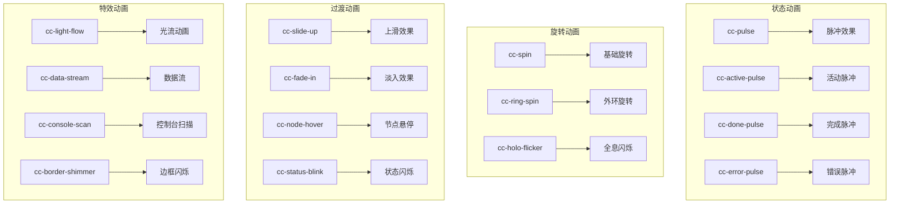

**图表来源**
- [frontend/app/globals.css:167-247](file://frontend/app/globals.css#L167-L247)

**章节来源**
- [frontend/app/globals.css:1-800](file://frontend/app/globals.css#L1-L800)

## 性能考量

### 响应式设计优化

设计系统采用多种性能优化策略：

1. **CSS 变量优化**：通过 CSS 变量减少重复样式定义
2. **动画性能**：使用 GPU 加速的 CSS 动画
3. **布局优化**：基于百分比的响应式布局
4. **组件复用**：模块化的组件设计提高代码复用率

### 状态管理

使用 Zustand 实现轻量级状态管理，避免不必要的重新渲染：

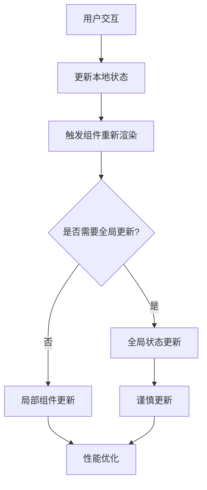

## 故障排除指南

### 常见问题诊断

1. **SSE 连接问题**
   - 检查后端 API 端点可达性
   - 确认浏览器对 EventSource 的支持
   - 验证跨域配置

2. **主题切换问题**
   - 检查 localStorage 是否正常工作
   - 确认 CSS 变量是否正确应用
   - 验证 data-theme 属性设置

3. **动画性能问题**
   - 检查 GPU 加速是否启用
   - 验证 CSS 动画属性优化
   - 确认硬件加速支持

**章节来源**
- [frontend/hooks/useTaskSSE.ts:729-777](file://frontend/hooks/useTaskSSE.ts#L729-L777)
- [OpenClaw-bot-review-main/lib/theme.tsx:22-28](file://OpenClaw-bot-review-main/lib/theme.tsx#L22-L28)

## 结论

HotClaw 的设计系统展现了现代前端开发的最佳实践，通过深空主题的视觉设计、完善的 CSS 变量系统和模块化的组件架构，为用户提供了沉浸式的内容创作体验。

该设计系统的主要优势包括：
- **一致性**：统一的设计令牌和视觉语言
- **可维护性**：模块化的组件设计和清晰的架构
- **性能优化**：高效的 CSS 动画和响应式布局
- **可扩展性**：灵活的设计系统支持未来功能扩展

通过深入理解这个设计系统的实现原理和架构思路，开发者可以更好地维护和扩展 HotClaw 平台的功能，同时为类似的内容创作平台提供有价值的参考。