# 异常处理系统

<cite>
**本文档引用的文件**
- [backend/app/core/exceptions.py](file://backend/app/core/exceptions.py)
- [backend/app/llm/exceptions.py](file://backend/app/llm/exceptions.py)
- [backend/app/main.py](file://backend/app/main.py)
- [backend/app/schemas/common.py](file://backend/app/schemas/common.py)
- [backend/app/llm/gateway.py](file://backend/app/llm/gateway.py)
- [backend/app/services/task_service.py](file://backend/app/services/task_service.py)
- [backend/app/orchestrator/engine.py](file://backend/app/orchestrator/engine.py)
- [backend/app/core/logger.py](file://backend/app/core/logger.py)
- [backend/app/core/tracer.py](file://backend/app/core/tracer.py)
- [backend/app/models/tables.py](file://backend/app/models/tables.py)
- [frontend/lib/api.ts](file://frontend/lib/api.ts)
- [frontend/hooks/useTaskSSE.ts](file://frontend/hooks/useTaskSSE.ts)
- [frontend/components/command-center/CommandCenter.tsx](file://frontend/components/command-center/CommandCenter.tsx)
</cite>

## 目录
1. [简介](#简介)
2. [项目结构](#项目结构)
3. [核心组件](#核心组件)
4. [架构概览](#架构概览)
5. [详细组件分析](#详细组件分析)
6. [依赖关系分析](#依赖关系分析)
7. [性能考虑](#性能考虑)
8. [故障排除指南](#故障排除指南)
9. [结论](#结论)

## 简介

HotClaw 异常处理系统是一个多层次、统一化的异常管理体系，旨在为多智能体内容生产平台提供可靠的错误处理机制。该系统通过统一的异常层次结构、标准化的错误码设计、完善的日志记录和前端错误处理机制，确保系统在面对各种异常情况时能够提供一致且可预测的用户体验。

系统的核心设计理念包括：
- **统一异常层次**：所有自定义异常都继承自统一的基类
- **错误码分类**：通过错误码实现业务逻辑与技术层面的分离
- **结构化日志**：使用结构化日志系统便于监控和调试
- **前后端协同**：前端和后端形成完整的错误处理闭环

## 项目结构

异常处理系统跨越了后端 Python 和前端 TypeScript 两个主要部分，形成了完整的错误处理生态：

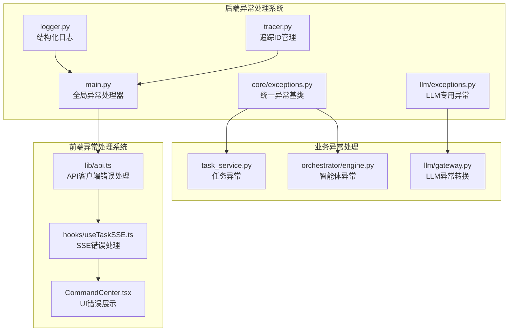

**图表来源**
- [backend/app/core/exceptions.py:1-223](file://backend/app/core/exceptions.py#L1-L223)
- [backend/app/main.py:135-189](file://backend/app/main.py#L135-L189)
- [frontend/lib/api.ts:39-50](file://frontend/lib/api.ts#L39-L50)

**章节来源**
- [backend/app/core/exceptions.py:1-223](file://backend/app/core/exceptions.py#L1-L223)
- [frontend/lib/api.ts:1-363](file://frontend/lib/api.ts#L1-L363)

## 核心组件

### 统一异常层次结构

系统采用统一的异常层次结构，所有自定义异常都继承自 `HotClawError` 基类，通过错误码实现分类管理：

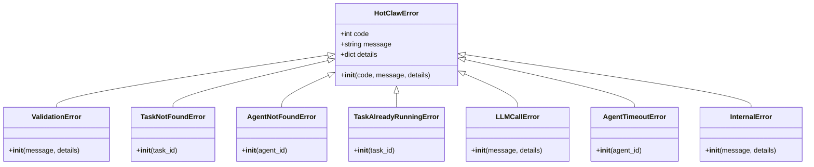

**图表来源**
- [backend/app/core/exceptions.py:19-223](file://backend/app/core/exceptions.py#L19-L223)

### 错误码分类系统

系统采用独特的错误码设计，通过 `code // 1000` 来映射 HTTP 状态码：

| 错误码范围 | HTTP 状态码 | 错误类型 | 示例 |
|------------|-------------|----------|------|
| 1xxx | 400 | 用户输入错误 | 参数验证失败 |
| 2xxx | 409 | 冲突错误 | 任务重复执行 |
| 3xxx | 502 | 外部/执行错误 | LLM调用失败 |
| 4xxx | 400 | 配置错误 | 配置验证失败 |
| 5xxx | 500 | 系统错误 | 未预期异常 |

**章节来源**
- [backend/app/core/exceptions.py:8-16](file://backend/app/core/exceptions.py#L8-L16)
- [backend/app/core/exceptions.py:40-223](file://backend/app/core/exceptions.py#L40-L223)

## 架构概览

异常处理系统采用分层架构，从底层的业务异常到顶层的全局异常处理器，形成了完整的异常处理链路：

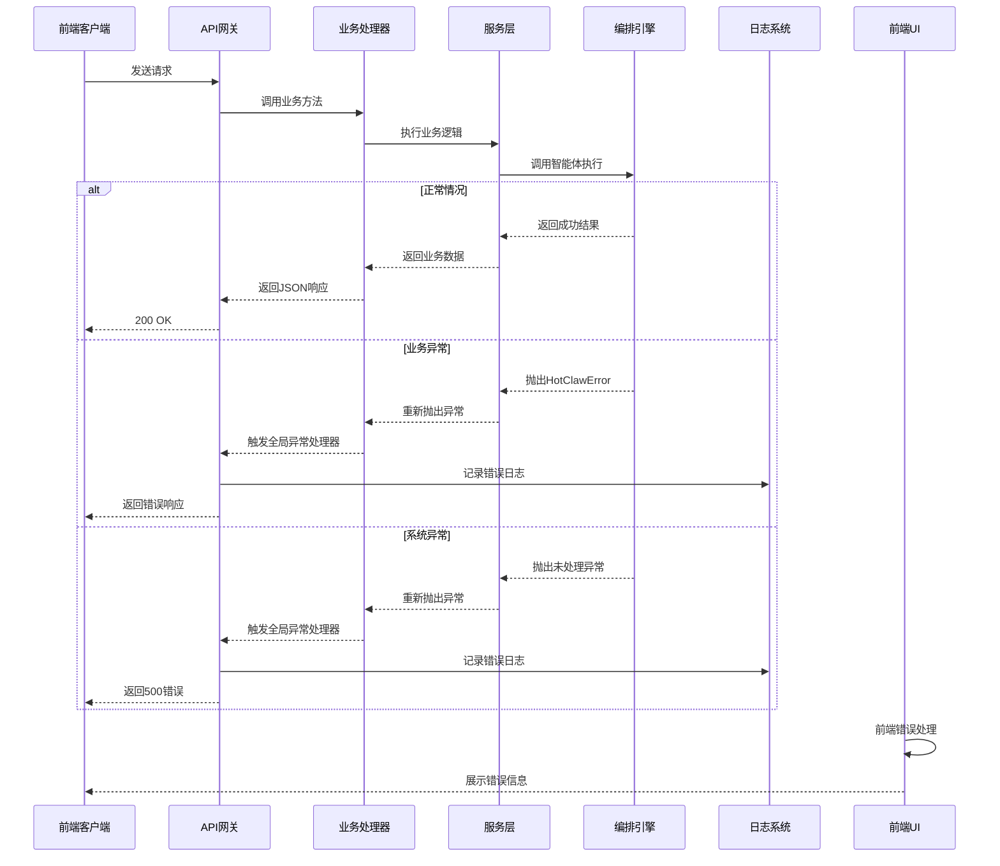

**图表来源**
- [backend/app/main.py:135-189](file://backend/app/main.py#L135-L189)
- [backend/app/core/logger.py:19-97](file://backend/app/core/logger.py#L19-L97)

## 详细组件分析

### 后端异常处理组件

#### 全局异常处理器

FastAPI 应用配置了两级异常处理器：业务异常处理器和兜底异常处理器。

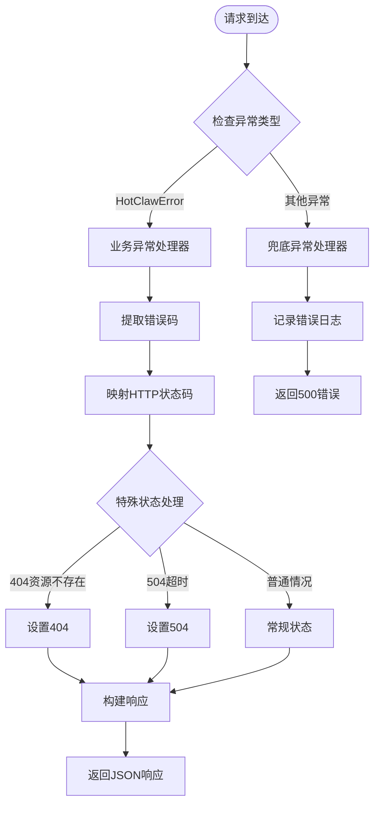

**图表来源**
- [backend/app/main.py:135-189](file://backend/app/main.py#L135-L189)

#### LLM异常处理

LLM 网关提供了细粒度的异常处理机制，将不同类型的 LLM 错误转换为统一的异常格式：

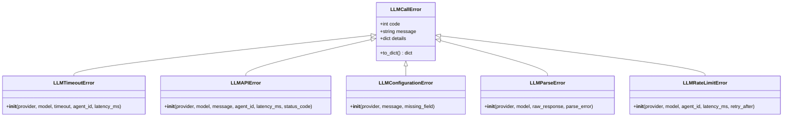

**图表来源**
- [backend/app/llm/exceptions.py:9-153](file://backend/app/llm/exceptions.py#L9-L153)

**章节来源**
- [backend/app/main.py:135-189](file://backend/app/main.py#L135-L189)
- [backend/app/llm/exceptions.py:1-153](file://backend/app/llm/exceptions.py#L1-L153)

### 业务异常处理

#### 任务异常处理

任务服务层实现了完整的任务生命周期异常处理：

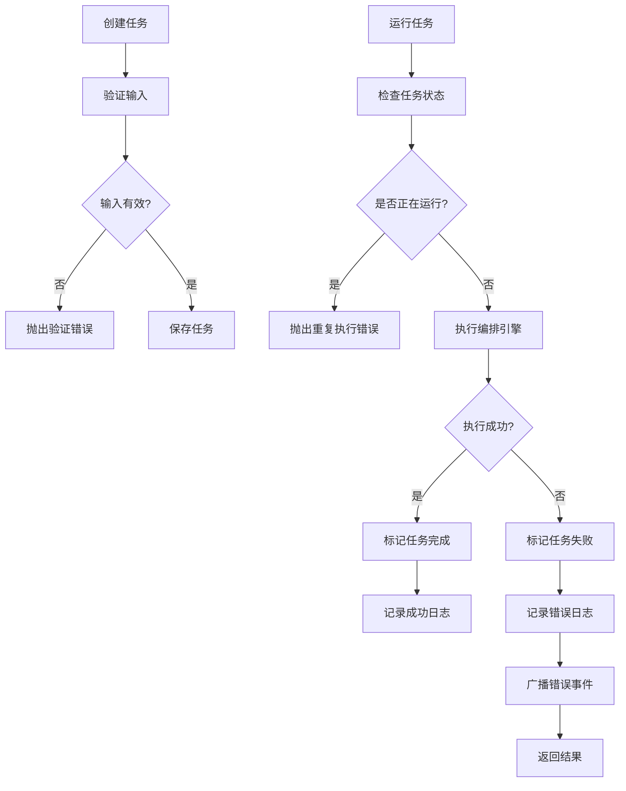

**图表来源**
- [backend/app/services/task_service.py:39-64](file://backend/app/services/task_service.py#L39-L64)

#### 编排引擎异常处理

编排引擎实现了复杂的异常处理策略，包括超时处理和降级机制：

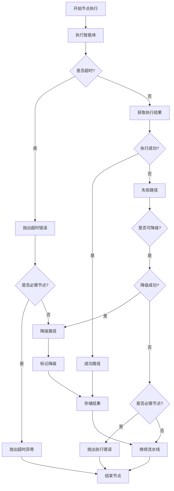

**图表来源**
- [backend/app/orchestrator/engine.py:213-296](file://backend/app/orchestrator/engine.py#L213-L296)

**章节来源**
- [backend/app/services/task_service.py:1-126](file://backend/app/services/task_service.py#L1-L126)
- [backend/app/orchestrator/engine.py:131-415](file://backend/app/orchestrator/engine.py#L131-L415)

### 前端异常处理组件

#### API客户端错误处理

前端 API 客户端实现了统一的错误处理机制：

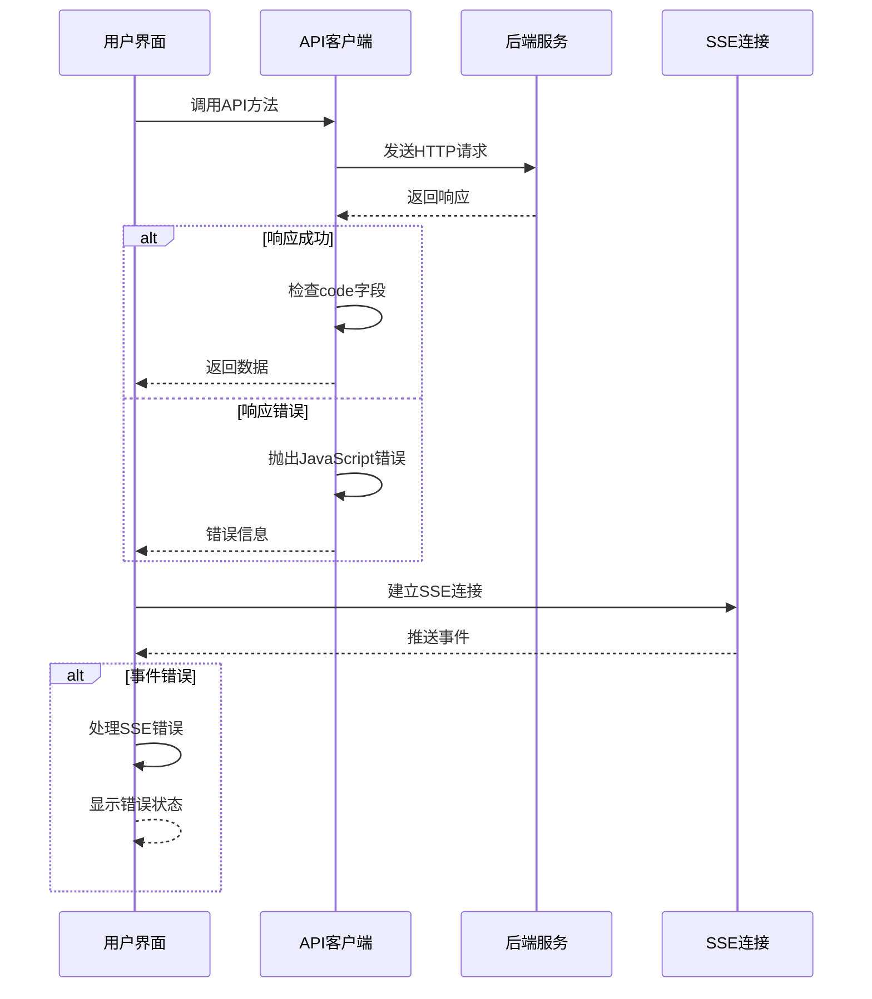

**图表来源**
- [frontend/lib/api.ts:39-50](file://frontend/lib/api.ts#L39-L50)
- [frontend/hooks/useTaskSSE.ts:149-213](file://frontend/hooks/useTaskSSE.ts#L149-L213)

#### SSE错误处理机制

SSE Hook 实现了完整的实时错误处理机制：

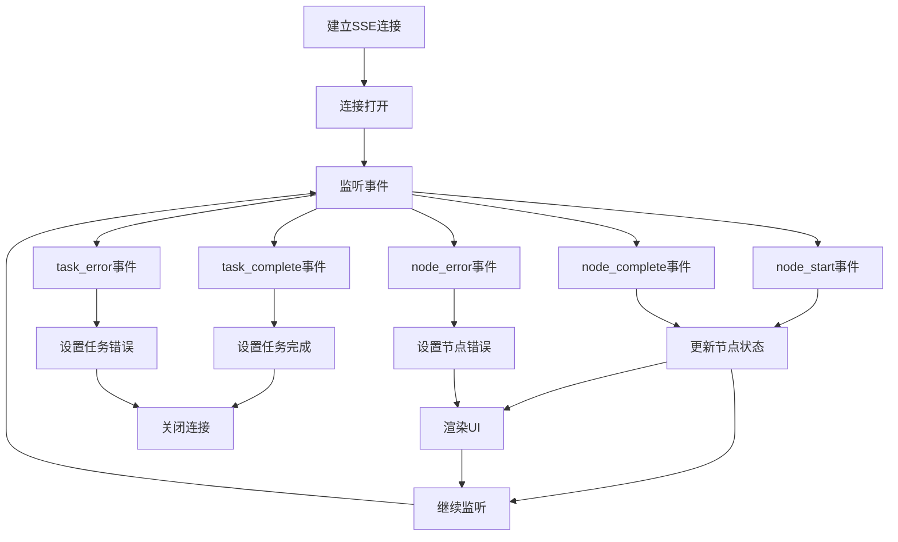

**图表来源**
- [frontend/hooks/useTaskSSE.ts:149-213](file://frontend/hooks/useTaskSSE.ts#L149-L213)

**章节来源**
- [frontend/lib/api.ts:1-363](file://frontend/lib/api.ts#L1-L363)
- [frontend/hooks/useTaskSSE.ts:1-233](file://frontend/hooks/useTaskSSE.ts#L1-L233)

## 依赖关系分析

异常处理系统各组件之间的依赖关系形成了清晰的层次结构：

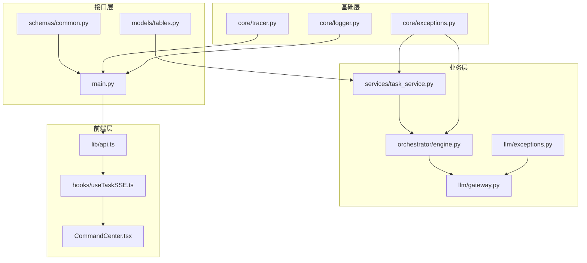

**图表来源**
- [backend/app/core/exceptions.py:19-223](file://backend/app/core/exceptions.py#L19-L223)
- [backend/app/main.py:135-189](file://backend/app/main.py#L135-L189)

**章节来源**
- [backend/app/core/exceptions.py:1-223](file://backend/app/core/exceptions.py#L1-L223)
- [backend/app/main.py:1-205](file://backend/app/main.py#L1-L205)

## 性能考虑

异常处理系统在设计时充分考虑了性能影响：

### 异常处理性能优化

1. **异常分类优化**：通过错误码分类减少异常处理的分支判断
2. **结构化日志**：使用结构化日志减少字符串拼接开销
3. **上下文传播**：通过 ContextVar 实现高效的追踪ID传播
4. **SSE优化**：EventSource 自动重连机制减少连接管理开销

### 内存和资源管理

- **连接池管理**：合理管理数据库连接和 LLM Provider 连接
- **资源清理**：确保异常情况下资源得到正确释放
- **内存泄漏防护**：前端组件卸载时正确清理 SSE 连接

## 故障排除指南

### 常见异常场景诊断

#### LLM调用失败

当遇到 LLM 调用失败时，可以通过以下步骤进行诊断：

1. **检查API密钥**：确认数据库中的 API Key 配置正确
2. **验证网络连接**：检查网络连通性和防火墙设置
3. **查看超时配置**：确认超时时间设置合理
4. **分析错误日志**：查看结构化日志中的详细错误信息

#### 任务执行异常

任务执行异常的排查流程：

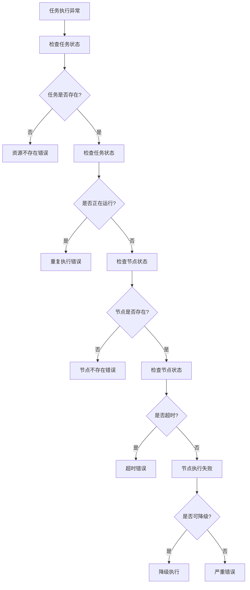

#### 前端错误处理

前端错误处理的最佳实践：

1. **统一错误展示**：使用一致的错误提示样式
2. **错误恢复**：提供错误重试和恢复机制
3. **用户引导**：为用户提供清晰的问题解决指导
4. **日志上报**：收集前端错误日志便于后续分析

**章节来源**
- [backend/app/core/logger.py:19-97](file://backend/app/core/logger.py#L19-L97)
- [frontend/hooks/useTaskSSE.ts:198-213](file://frontend/hooks/useTaskSSE.ts#L198-L213)

## 结论

HotClaw 异常处理系统通过统一的异常层次结构、完善的错误码分类、结构化日志记录和前后端协同的错误处理机制，构建了一个健壮且用户友好的异常处理体系。

### 系统优势

1. **一致性**：统一的异常处理方式确保了跨模块的一致性
2. **可维护性**：清晰的异常层次结构便于代码维护和扩展
3. **可观测性**：结构化日志和追踪ID提供了强大的问题诊断能力
4. **用户体验**：前后端协同的错误处理提升了整体用户体验

### 改进建议

1. **异常监控**：可以集成专门的异常监控服务
2. **错误统计**：增加异常发生频率的统计和分析
3. **自动化处理**：对于常见异常实现自动恢复机制
4. **文档完善**：补充异常处理的最佳实践文档

该异常处理系统为 HotClaw 多智能体内容生产平台提供了坚实的技术基础，确保了系统在面对各种异常情况时能够保持稳定可靠的服务能力。