# 前端组件库

<cite>
**本文档引用的文件**
- [package.json](file://frontend/package.json)
- [CommandCenter.tsx](file://frontend/components/command-center/CommandCenter.tsx)
- [ControlRoom.tsx](file://frontend/components/control-room/ControlRoom.tsx)
- [TaskDashboard.tsx](file://frontend/components/dashboard/TaskDashboard.tsx)
- [OfficeScene.tsx](file://frontend/components/office/OfficeScene.tsx)
- [useTaskSSE.ts](file://frontend/hooks/useTaskSSE.ts)
- [api.ts](file://frontend/lib/api.ts)
- [index.ts](file://frontend/types/index.ts)
- [PixelCharacter.tsx](file://frontend/components/office/PixelCharacter.tsx)
- [SpeechBubble.tsx](file://frontend/components/office/SpeechBubble.tsx)
- [TaskInput.tsx](file://frontend/components/office/TaskInput.tsx)
- [ResultPanel.tsx](file://frontend/components/office/ResultPanel.tsx)
- [drafts/page.tsx](file://frontend/app/drafts/page.tsx)
- [drafts/[id]/page.tsx](file://frontend/app/drafts/[id]/page.tsx)
- [accounts/page.tsx](file://frontend/app/accounts/page.tsx)
- [accounts/[id]/page.tsx](file://frontend/app/accounts/[id]/page.tsx)
- [accounts/new/page.tsx](file://frontend/app/accounts/new/page.tsx)
- [accounts/[id]/edit/page.tsx](file://frontend/app/accounts/[id]/edit/page.tsx)
- [layout.tsx](file://frontend/app/(shell)/layout.tsx)
- [page.tsx](file://frontend/app/(shell)/page.tsx)
- [context.tsx](file://frontend/app/(shell)/context.tsx)
- [globals.css](file://frontend/app/globals.css)
- [console-ui/index.tsx](file://frontend/components/console-ui/index.tsx)
- [console-ui/AccountForm.tsx](file://frontend/components/console-ui/AccountForm.tsx)
- [publish-records/page.tsx](file://frontend/app/(shell)/publish-records/page.tsx)
</cite>

## 更新摘要
**变更内容**
- 新增控制台UI组件库（console-ui），包含AccountForm等专业SaaS组件
- 传统像素风格组件（OfficeScene、PixelCharacter等）保留，但整体设计语言向现代SaaS控制台风格转型
- 新增专业的表单组件和布局组件，支持复杂的账号配置管理
- 增强Shell布局的SaaS界面体验，提供统一的设计系统

## 目录
1. [简介](#简介)
2. [项目结构](#项目结构)
3. [核心组件](#核心组件)
4. [架构总览](#架构总览)
5. [详细组件分析](#详细组件分析)
6. [新增功能模块](#新增功能模块)
7. [SaaS设计系统](#saas设计系统)
8. [控制台UI组件库](#控制台ui组件库)
9. [依赖关系分析](#依赖关系分析)
10. [性能考虑](#性能考虑)
11. [故障排除指南](#故障排除指南)
12. [结论](#结论)

## 简介
本项目是一个基于 Next.js 的前端组件库，专注于智能体编排系统的可视化交互界面。系统通过三个主要场景（深空指挥舱、控制中心、像素编辑部）提供任务创建、实时监控和结果展示能力。组件库采用 React + TypeScript 构建，结合自定义 Hook 和 SSE 实时通信，实现了完整的任务生命周期管理。

**更新** 新增了专业的控制台UI组件库（console-ui），包含AccountForm等组件，提供完整的账号配置管理界面。系统现在提供从像素风格到现代SaaS控制台的双重设计语言，既保持了原有的科技感，又增加了专业的运营管理界面。

## 项目结构
前端项目采用模块化组织方式，主要包含以下核心目录：

```mermaid
graph TB
subgraph "前端应用结构"
A[components/] --> A1[command-center/]
A --> A2[control-room/]
A --> A3[dashboard/]
A --> A4[office/]
A --> A5[console-ui/]
B[hooks/] --> B1[useTaskSSE.ts]
C[lib/] --> C1[api.ts]
C --> C2[assets.ts]
D[types/] --> D1[index.ts]
E[store/] --> E1[taskStore.ts]
F[app/] --> F1[(shell)/]
F --> F2[drafts/]
F --> F3[accounts/]
F --> F4[settings/]
F --> F5[history/]
F --> F6[newsroom/]
F1 --> F11[layout.tsx]
F1 --> F12[page.tsx]
F1 --> F13[context.tsx]
G[globals.css] --> G1[设计系统]
H[console-ui/] --> H1[AccountForm.tsx]
H --> H2[index.tsx]
end
```

**图表来源**
- [package.json:1-24](file://frontend/package.json#L1-L24)

**章节来源**
- [package.json:1-24](file://frontend/package.json#L1-L24)

## 核心组件
组件库围绕三大核心场景构建，每个场景都有其独特的交互模式和视觉风格：

### 深空指挥舱 (Command Center)
- **环形布局设计**：6个智能体节点以圆形轨道分布，中央控制台集成任务输入和状态监控
- **全息连线系统**：SVG贝塞尔曲线连接相邻节点，营造科技感的视觉效果
- **实时状态同步**：通过 SSE 实时接收节点状态变化，动态更新界面

### 控制中心 (Control Room)
- **网格化监控面板**：智能体状态以卡片形式网格布局展示
- **管道流程图**：可视化任务执行流程，清晰展示各阶段状态
- **响应式设计**：适配不同屏幕尺寸，提供一致的用户体验

### 像素编辑部 (Office Scene)
- **像素艺术风格**：基于 R2108101 大型像素办公场景构建
- **精灵角色系统**：6个智能体对应不同像素角色，具有独特的动画状态
- **三面板布局**：日志、状态、访客面板提供全面的任务信息

### SaaS运营壳层 (Shell Layout)
**更新** 新增的专业SaaS界面组件，提供完整的运营控制台体验：

- **顶部统计栏**：放大数字的统计卡片，显示核心运营指标
- **左侧导航**：280px宽度的增强导航，支持账号快速访问
- **右侧事件流**：实时事件监控面板，显示任务状态和草稿更新
- **响应式布局**：适配不同屏幕尺寸的专业SaaS界面

**章节来源**
- [CommandCenter.tsx:1-318](file://frontend/components/command-center/CommandCenter.tsx#L1-L318)
- [ControlRoom.tsx:1-385](file://frontend/components/control-room/ControlRoom.tsx#L1-L385)
- [OfficeScene.tsx:1-428](file://frontend/components/office/OfficeScene.tsx#L1-L428)
- [layout.tsx:1-574](file://frontend/app/(shell)/layout.tsx#L1-L574)

## 架构总览
系统采用分层架构设计，确保组件间的松耦合和高内聚：

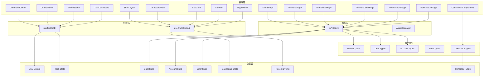

**图表来源**
- [useTaskSSE.ts:1-233](file://frontend/hooks/useTaskSSE.ts#L1-L233)
- [api.ts:1-717](file://frontend/lib/api.ts#L1-L717)
- [index.ts:1-519](file://frontend/types/index.ts#L1-L519)
- [context.tsx:1-51](file://frontend/app/(shell)/context.tsx#L1-L51)

## 详细组件分析

### 实时状态管理 (useTaskSSE Hook)
该 Hook 封装了 EventSource API，提供简洁的 React Hook 接口：

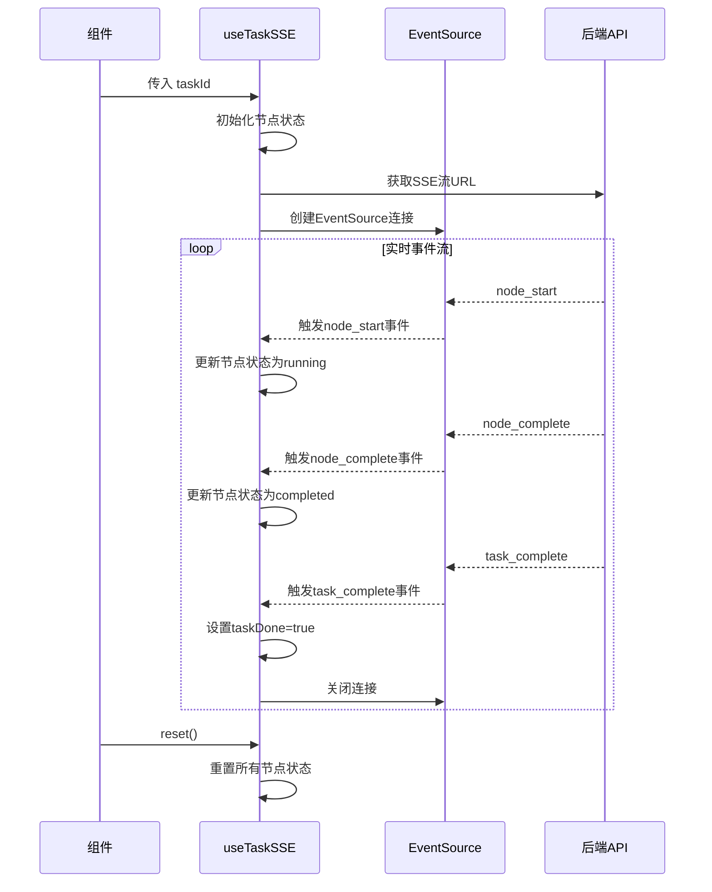

**图表来源**
- [useTaskSSE.ts:82-232](file://frontend/hooks/useTaskSSE.ts#L82-L232)

**章节来源**
- [useTaskSSE.ts:1-233](file://frontend/hooks/useTaskSSE.ts#L1-L233)

### API 客户端设计
统一的 API 客户端封装了所有后端接口调用：

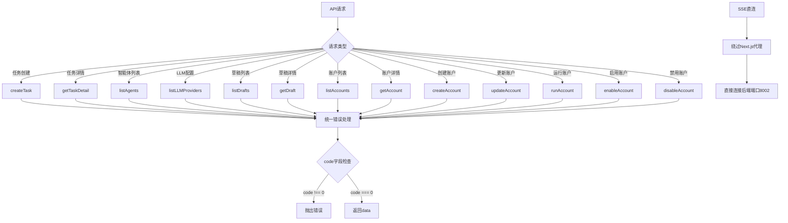

**图表来源**
- [api.ts:39-50](file://frontend/lib/api.ts#L39-L50)
- [api.ts:97-103](file://frontend/lib/api.ts#L97-L103)

**章节来源**
- [api.ts:1-717](file://frontend/lib/api.ts#L1-L717)

### 像素角色系统
OfficeScene 中的像素角色系统提供了丰富的视觉反馈：

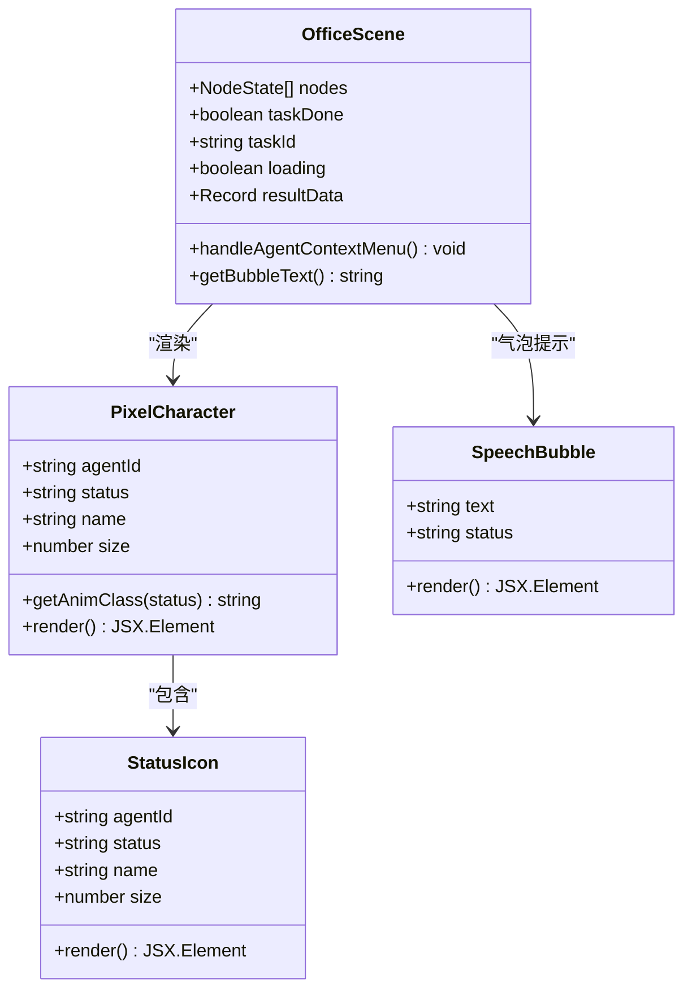

**图表来源**
- [PixelCharacter.tsx:35-82](file://frontend/components/office/PixelCharacter.tsx#L35-L82)
- [SpeechBubble.tsx:12-49](file://frontend/components/office/SpeechBubble.tsx#L12-L49)
- [OfficeScene.tsx:62-427](file://frontend/components/office/OfficeScene.tsx#L62-L427)

**章节来源**
- [PixelCharacter.tsx:1-83](file://frontend/components/office/PixelCharacter.tsx#L1-L83)
- [SpeechBubble.tsx:1-50](file://frontend/components/office/SpeechBubble.tsx#L1-L50)
- [OfficeScene.tsx:1-428](file://frontend/components/office/OfficeScene.tsx#L1-L428)

### 仪表板组件
TaskDashboard 提供了任务执行的可视化监控：

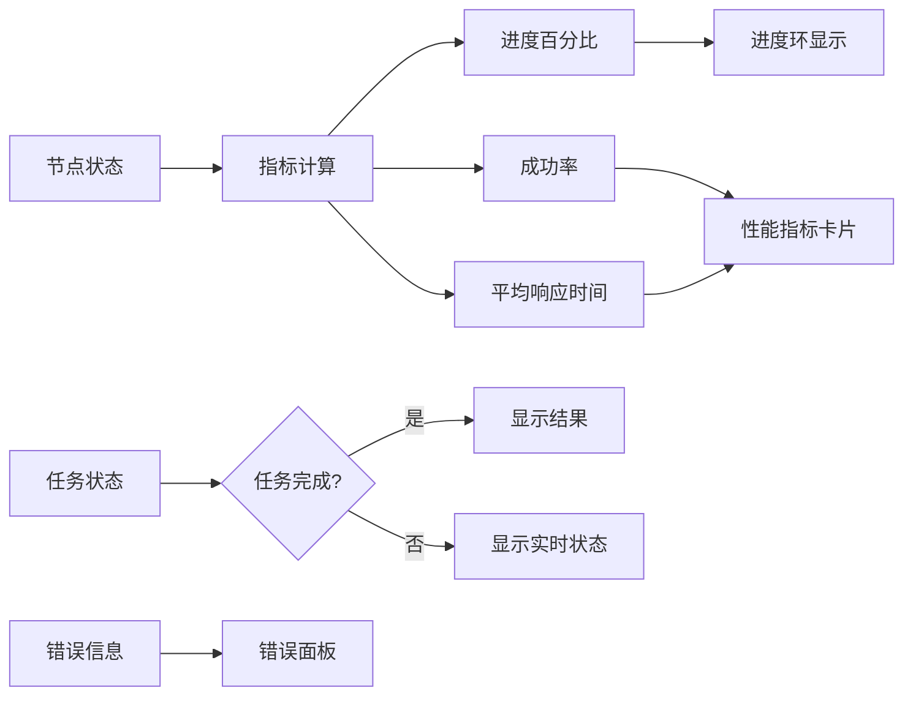

**图表来源**
- [TaskDashboard.tsx:21-176](file://frontend/components/dashboard/TaskDashboard.tsx#L21-L176)

**章节来源**
- [TaskDashboard.tsx:1-176](file://frontend/components/dashboard/TaskDashboard.tsx#L1-L176)

### Shell布局组件
**更新** 新增的专业SaaS壳层组件，提供完整的运营控制台：

```mermaid
flowchart TD
A[ShellLayout] --> B[TopBar]
A --> C[Sidebar]
A --> D[Main Content]
A --> E[RightPanel]
B --> F[StatCard x4]
C --> G[NAV_ITEMS]
C --> H[Account Quick List]
E --> I[Recent Events]
F --> J[DashboardStats]
G --> K[Navigation Menu]
H --> L[Account Status]
I --> M[RecentEvent[]]
```

**图表来源**
- [layout.tsx:28-138](file://frontend/app/(shell)/layout.tsx#L28-L138)
- [layout.tsx:156-295](file://frontend/app/(shell)/layout.tsx#L156-L295)
- [layout.tsx:301-420](file://frontend/app/(shell)/layout.tsx#L301-L420)

**章节来源**
- [layout.tsx:1-574](file://frontend/app/(shell)/layout.tsx#L1-L574)

## 新增功能模块

### 草稿管理系统
新增的草稿管理功能提供了完整的草稿生命周期管理：

#### 草稿列表页面
- **多状态筛选**：支持全部、待确认、已发布、已废弃状态筛选
- **分页功能**：支持大数据量的分页浏览
- **批量操作**：支持确认发布、废弃、重新生成等操作
- **状态徽章**：使用颜色编码显示草稿状态

#### 草稿详情页面
- **双标签页**：正文内容和备选标题切换
- **审核结果展示**：详细展示审核通过状态和风险等级
- **Markdown渲染**：支持基本的Markdown语法渲染
- **操作权限控制**：根据草稿状态控制可用操作

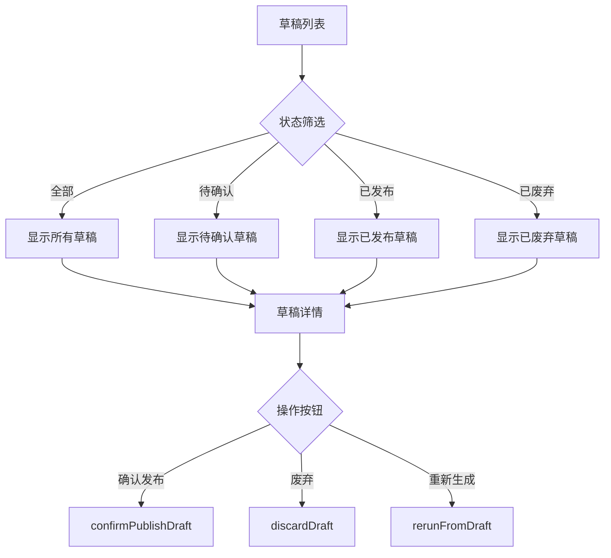

**图表来源**
- [drafts/page.tsx:136-141](file://frontend/app/drafts/page.tsx#L136-L141)
- [drafts/[id]/page.tsx:367-398](file://frontend/app/drafts/[id]/page.tsx#L367-L398)

**章节来源**
- [drafts/page.tsx:1-347](file://frontend/app/drafts/page.tsx#L1-L347)
- [drafts/[id]/page.tsx:1-432](file://frontend/app/drafts/[id]/page.tsx#L1-L432)

### 账户管理系统
**更新** 账户管理功能现已显著增强，提供了完整的账号生命周期管理：

#### 账户列表页面
- **增强运行状态显示**：显示账号启用状态、运行模式、最后运行状态，支持成功、失败、运行中、未运行等多种状态徽章
- **详细统计信息**：显示最近运行时间和下次运行时间，支持自动运行配置状态
- **错误预览功能**：当账号运行失败时，显示错误消息预览，帮助快速定位问题
- **分页功能**：支持大量账号的分页浏览
- **快速操作**：支持立即运行、查看详情等快捷操作
- **防重复点击**：使用 runningId 状态防止重复点击运行按钮

#### 账户详情页面
- **基本信息展示**：账号名称、定位、类别等基础信息，支持启用/禁用状态标识
- **详细运行状态**：最近运行结果、运行结果状态徽章、定时运行配置
- **发布策略配置**：发布频率、发布时间、自动发布设置的详细展示
- **草稿入口管理**：根据运行模式显示相应的草稿箱入口，支持待确认草稿数量显示
- **最近任务历史**：详细展示最近任务列表，包含任务状态、创建时间、执行耗时等指标
- **错误详细展示**：当运行失败时，显示完整的错误信息面板，支持多行文本显示
- **操作状态管理**：使用 actionLoading 状态管理运行和启用/禁用操作的加载状态

#### 账户编辑页面
- **表单验证增强**：必填字段验证和长度限制，支持账号名称和定位的详细验证规则
- **运行模式配置**：支持手动、半自动、全自动三种模式的详细配置
- **定时配置管理**：发布频率和固定发布时间设置，支持自动运行和自动发布的开关控制
- **状态控制**：账号启用/禁用状态的精确控制
- **错误处理改进**：详细的错误信息显示和处理机制

#### 新建账户页面
- **完整表单配置**：支持基本信息、受众与风格、发布策略、运行模式的完整配置
- **验证规则**：严格的表单验证，确保数据完整性
- **默认值设置**：合理的默认值配置，简化用户操作

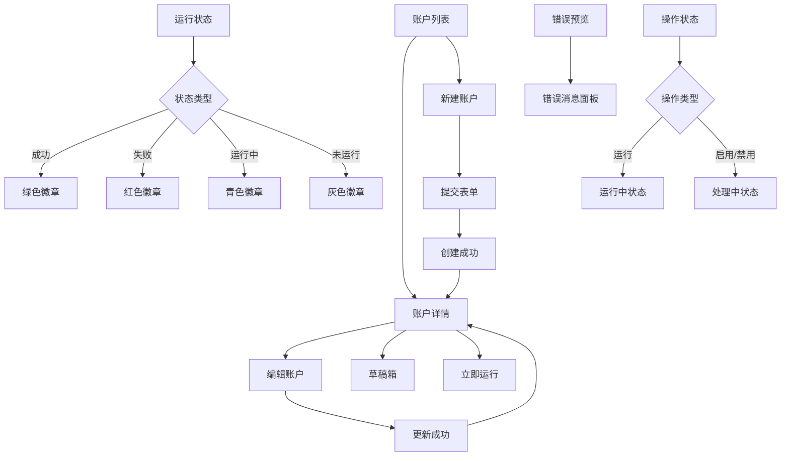

**图表来源**
- [accounts/page.tsx:86-109](file://frontend/app/accounts/page.tsx#L86-L109)
- [accounts/[id]/page.tsx:140-170](file://frontend/app/accounts/[id]/page.tsx#L140-L170)

**章节来源**
- [accounts/page.tsx:1-310](file://frontend/app/accounts/page.tsx#L1-L310)
- [accounts/[id]/page.tsx:1-474](file://frontend/app/accounts/[id]/page.tsx#L1-L474)
- [accounts/new/page.tsx:1-398](file://frontend/app/accounts/new/page.tsx#L1-L398)
- [accounts/[id]/edit/page.tsx:1-430](file://frontend/app/accounts/[id]/edit/page.tsx#L1-L430)

### 类型定义扩展
新增了完整的类型定义支持草稿和账户功能：

#### 草稿类型
- **DraftStatus**：草稿状态枚举（draft、pending_review、approved、rejected、discarded）
- **PublishStatus**：发布状态枚举（not_published、pending、published、failed）
- **DraftSummary**：草稿列表项数据结构
- **DraftDetail**：草稿详情数据结构

#### 账户类型
- **OperationMode**：运行模式枚举（manual、semi_auto、full_auto）
- **PostingFrequency**：发布频率枚举（daily、weekly、biweekly、monthly）
- **AccountSummary**：账户列表项数据结构，包含运行状态、错误消息等增强字段
- **AccountDetail**：账户详情数据结构，包含详细运行历史和发布跟踪字段

#### Shell上下文类型
**更新** 新增的Shell上下文类型定义：

- **DashboardStats**：仪表板统计数据接口
- **RecentEvent**：最近事件接口
- **ShellContextValue**：Shell上下文值接口

**章节来源**
- [index.ts:291-519](file://frontend/types/index.ts#L291-L519)
- [context.tsx:13-37](file://frontend/app/(shell)/context.tsx#L13-L37)

## SaaS设计系统

### CSS变量设计系统
**更新** 新增完整的CSS变量设计系统，提供专业的SaaS界面样式：

```mermaid
flowchart TD
A[:root CSS Variables] --> B[背景层级]
B --> B1[--bg-void: #060a0f]
B --> B2[--bg-base: #090e17]
B --> B3[--bg-surface: #0d1420]
B --> B4[--bg-elevated: #131b2a]
B --> B5[--bg-card: #0f1723]
A --> C[边框层级]
C --> C1[--border-subtle: rgba(255,255,255,0.06)]
C --> C2[--border-default: rgba(255,255,255,0.1)]
C --> C3[--border-strong: rgba(255,255,255,0.15)]
C --> C4[--border-accent: rgba(0,212,255,0.3)]
A --> D[文字层级]
D --> D1[--text-primary: #f1f5f9]
D --> D2[--text-secondary: #94a3b8]
D --> D3[--text-muted: #475569]
A --> E[强调色 - Cyan]
E --> E1[--accent: #22d3ee]
E --> E2[--accent-hover: #06b6d4]
E --> E3[--accent-glow: rgba(34,211,238,0.15)]
```

**图表来源**
- [globals.css:8-83](file://frontend/app/globals.css#L8-L83)

### 统计卡片组件
**更新** 新增的专业统计卡片组件，用于显示核心运营指标：

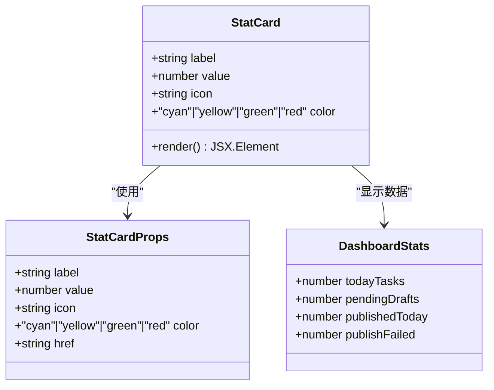

**图表来源**
- [layout.tsx:84-138](file://frontend/app/(shell)/layout.tsx#L84-L138)
- [page.tsx:28-91](file://frontend/app/(shell)/page.tsx#L28-L91)

### 导航组件
**更新** 新增的增强导航组件，提供280px宽度的专业导航：

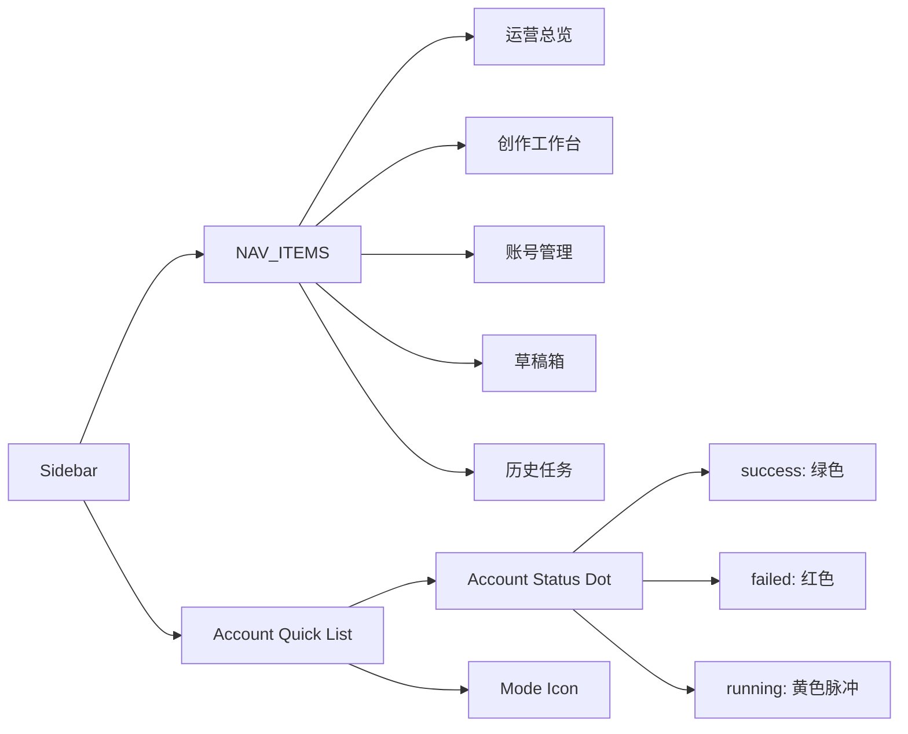

**图表来源**
- [layout.tsx:144-295](file://frontend/app/(shell)/layout.tsx#L144-L295)

### 事件面板
**更新** 新增的实时事件监控面板：

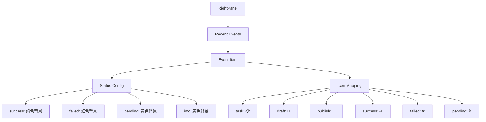

**图表来源**
- [layout.tsx:301-420](file://frontend/app/(shell)/layout.tsx#L301-L420)

**章节来源**
- [globals.css:1-83](file://frontend/app/globals.css#L1-L83)
- [layout.tsx:84-138](file://frontend/app/(shell)/layout.tsx#L84-L138)
- [layout.tsx:144-295](file://frontend/app/(shell)/layout.tsx#L144-L295)
- [layout.tsx:301-420](file://frontend/app/(shell)/layout.tsx#L301-L420)

## 控制台UI组件库

### 组件库概述
**更新** 新增的控制台UI组件库（console-ui）提供了专业的SaaS界面组件集合，专为账号管理和运营控制台设计：

- **AccountForm**：完整的账号配置表单组件
- **SectionCard**：模块化的内容卡片组件
- **StatCard**：统计信息展示卡片
- **StatusBadge**：状态徽章组件
- **FilterTabs**：过滤标签组件
- **EmptyState**：空状态占位组件
- **ShellNav**：导航菜单组件

### AccountForm 组件
**更新** 新增的专业账号配置表单组件，提供完整的账号创建和编辑界面：

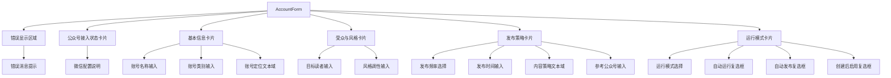

**图表来源**
- [console-ui/AccountForm.tsx:6-85](file://frontend/components/console-ui/AccountForm.tsx#L6-L85)

### 基础UI组件
**更新** 新增的基础UI组件，提供统一的设计系统：

#### SectionCard 组件
- **标题支持**：可选的卡片标题和额外操作区域
- **内容容器**：标准的内边距和阴影效果
- **灵活布局**：支持任意子组件内容

#### StatCard 组件
- **多色调支持**：default、success、warning、danger 四种状态色
- **链接支持**：可选的点击跳转功能
- **响应式设计**：悬停效果和过渡动画

#### StatusBadge 组件
- **状态映射**：完整的状态枚举到样式映射
- **友好显示**：状态名称的本地化显示
- **一致性**：统一的圆角边框样式

#### FilterTabs 组件
- **选项配置**：动态选项数组配置
- **状态管理**：当前选中状态和切换回调
- **视觉反馈**：激活状态的颜色变化

#### EmptyState 组件
- **标题描述**：可选的标题和描述文本
- **操作按钮**：可选的操作按钮区域
- **居中布局**：统一的视觉中心对齐

#### ShellNav 组件
- **路径感知**：自动识别当前激活的导航项
- **样式激活**：激活状态的视觉高亮
- **路由集成**：与Next.js路由系统的无缝集成

**章节来源**
- [console-ui/index.tsx:7-175](file://frontend/components/console-ui/index.tsx#L7-L175)
- [console-ui/AccountForm.tsx:1-115](file://frontend/components/console-ui/AccountForm.tsx#L1-L115)

## 依赖关系分析

```mermaid
graph TB
subgraph "外部依赖"
A[React 19.2.4]
B[Next.js 16.2.1]
C[TailwindCSS 4.2.2]
D[Zustand 5.0.12]
E[Next.js App Router]
end
subgraph "内部模块"
F[components/]
G[hooks/]
H[lib/]
I[types/]
J[store/]
K[app/(shell)/]
L[app/drafts/]
M[app/accounts/]
N[console-ui/]
end
subgraph "核心功能"
O[实时通信]
P[状态管理]
Q[API调用]
R[类型安全]
S[路由管理]
T[草稿管理]
U[账户管理]
V[错误处理]
W[状态显示]
X[Shell布局]
Y[设计系统]
Z[统计卡片]
AA[导航组件]
BB[事件面板]
CC[控制台UI组件]
DD[AccountForm]
EE[基础UI组件]
end
A --> E
B --> F
C --> G
D --> H
E --> K
F --> N
F --> O
G --> P
H --> Q
I --> R
K --> S
L --> T
M --> U
N --> CC
O --> P
Q --> R
S --> L
S --> M
T --> Q
U --> Q
V --> Q
W --> U
X --> K
Y --> X
Z --> X
AA --> X
BB --> X
CC --> DD
DD --> EE
EE --> N
```

**图表来源**
- [package.json:11-22](file://frontend/package.json#L11-L22)

**章节来源**
- [package.json:1-24](file://frontend/package.json#L1-L24)

## 性能考虑
组件库在设计时充分考虑了性能优化：

### 渲染优化
- **条件渲染**：仅在必要时渲染特定组件，减少 DOM 操作
- **状态提升**：将共享状态提升到父组件，避免重复渲染
- **useCallback 缓存**：缓存函数引用，防止不必要的重渲染
- **Suspense 支持**：草稿列表页面使用 Suspense 处理异步数据加载

### 实时通信优化
- **EventSource 自动重连**：利用浏览器内置的 SSE 重连机制
- **连接复用**：使用 useRef 存储 EventSource 实例，避免重复创建
- **清理机制**：组件卸载时自动关闭连接，防止内存泄漏

### 资源管理优化
- **像素渲染优化**：通过 CSS 属性 `imageRendering: pixelated` 保持像素风格
- **动画性能**：使用 CSS 动画而非 JavaScript 动画，提高流畅度
- **懒加载**：草稿详情页面按需加载内容，提升首屏性能

### 数据管理优化
- **分页加载**：草稿和账户列表支持分页，避免一次性加载大量数据
- **状态缓存**：API 响应数据进行缓存，减少重复请求
- **错误边界**：完善的错误处理机制，防止应用崩溃

### SaaS界面性能优化
**更新** 新增的SaaS界面组件采用了多项性能优化措施：

- **Shell布局优化**：使用固定定位和Flex布局，减少重排重绘
- **统计卡片优化**：使用CSS变量和硬件加速，提升渲染性能
- **导航组件优化**：虚拟滚动支持大量账号的快速访问
- **事件面板优化**：只渲染最近15条事件，避免无限增长
- **设计系统优化**：CSS变量统一管理，减少样式计算开销

### 账户管理性能优化
**更新** 账户管理页面采用了多项性能优化措施：
- **状态管理优化**：使用 runningId 和 actionLoading 状态防止重复操作和提升用户体验
- **条件渲染优化**：仅在失败时显示错误面板，减少不必要的 DOM 元素
- **数据预取优化**：在编辑页面预填表单数据，减少额外的 API 调用
- **错误预览优化**：使用 truncate 类限制错误消息显示长度，提升界面整洁度

### 控制台UI组件性能优化
**更新** 新增的控制台UI组件库采用了多项性能优化措施：
- **组件复用**：基础UI组件的高度复用，减少重复开发
- **样式优化**：使用TailwindCSS原子类，提升样式编译效率
- **状态管理**：合理的状态分割，避免不必要的组件重渲染
- **表单优化**：受控组件的高效状态更新机制
- **类型安全**：TypeScript类型定义确保运行时性能

## 故障排除指南

### SSE 连接问题
1. **检查后端服务状态**
   - 确认后端 API 服务正常运行
   - 验证 SSE 端点可访问性

2. **网络配置**
   ```javascript
   // 开发环境需要直连后端端口8002
   const url = `http://${window.location.hostname}:8002${BASE}/tasks/${taskId}/stream`;
   ```

3. **浏览器兼容性**
   - 确保浏览器支持 EventSource API
   - 检查跨域设置

### 组件状态异常
1. **状态重置**
   ```typescript
   // 每次创建新任务时调用reset()
   reset();
   ```

2. **节点状态同步**
   - 检查节点 ID 匹配
   - 验证状态转换逻辑

### 草稿管理问题
1. **草稿状态同步**
   - 确认草稿状态转换逻辑正确
   - 检查 API 调用是否成功

2. **草稿操作权限**
   - 验证用户权限
   - 检查草稿状态是否允许相应操作

### 账户管理问题
**更新** 账户管理页面的故障排除指南：

1. **账户列表加载问题**
   - 检查 listAccounts API 调用
   - 验证分页参数传递
   - 确认错误状态处理

2. **运行状态显示异常**
   - 检查 last_run_status 字段
   - 验证状态徽章映射
   - 确认日期格式化函数

3. **错误预览功能问题**
   - 检查 last_error_message 字段
   - 验证错误消息显示逻辑
   - 确认条件渲染

4. **表单验证问题**
   - 检查必填字段验证
   - 确认数据格式正确
   - 验证表单状态管理

5. **操作状态管理问题**
   - 检查 runningId 状态
   - 验证 actionLoading 状态
   - 确认防重复点击机制

### SaaS界面问题
**更新** 新增的SaaS界面组件故障排除指南：

1. **统计卡片显示异常**
   - 检查 DashboardStats 数据
   - 验证颜色映射配置
   - 确认数值格式化

2. **导航组件加载问题**
   - 检查 NAV_ITEMS 配置
   - 验证账号状态显示
   - 确认快速访问列表

3. **事件面板更新问题**
   - 检查 RecentEvent 数据
   - 验证状态配置映射
   - 确认事件排序逻辑

4. **设计系统样式问题**
   - 检查 CSS 变量定义
   - 验证主题切换
   - 确认样式优先级

5. **Shell布局性能问题**
   - 检查数据加载频率
   - 验证组件重渲染
   - 确认内存泄漏

### 控制台UI组件问题
**更新** 新增的控制台UI组件故障排除指南：

1. **AccountForm 表单问题**
   - 检查表单数据绑定
   - 验证表单验证逻辑
   - 确认提交状态管理

2. **SectionCard 卡片问题**
   - 检查标题显示逻辑
   - 验证内容渲染
   - 确认样式应用

3. **StatCard 统计问题**
   - 检查数据源连接
   - 验证色调映射
   - 确认链接功能

4. **基础UI组件问题**
   - 检查组件导入路径
   - 验证Props类型
   - 确认样式类名

5. **类型定义问题**
   - 检查类型导入
   - 验证类型兼容性
   - 确认接口定义

### 性能问题诊断
1. **渲染性能**
   - 使用 React DevTools 分析组件渲染
   - 检查是否有不必要的重渲染

2. **内存泄漏**
   - 确认 EventSource 连接正确关闭
   - 检查定时器和事件监听器清理

3. **SaaS界面性能**
   - **更新** 检查Shell布局的性能优化
   - 验证统计卡片的渲染效率
   - 确认事件面板的数据处理

4. **账户管理性能**
   - **更新** 检查状态管理优化
   - 验证条件渲染的使用
   - 确认错误预览的性能影响

5. **控制台UI性能**
   - **更新** 检查组件复用效率
   - 验证表单渲染性能
   - 确认样式编译优化

**章节来源**
- [useTaskSSE.ts:112-126](file://frontend/hooks/useTaskSSE.ts#L112-L126)
- [api.ts:97-103](file://frontend/lib/api.ts#L97-L103)

## 结论
本前端组件库成功实现了智能体编排系统的完整可视化解决方案。通过模块化的组件设计、高效的实时通信机制和优雅的像素艺术风格，为用户提供了直观且富有科技感的交互体验。

**更新** 新增的专业的控制台UI组件库（console-ui）和SaaS界面组件进一步完善了系统的专业性，提供了完整的运营控制台体验。系统现在包含统计卡片、导航组件、事件面板、AccountForm等专业组件，支持深色主题和品牌色彩的统一管理。

### 主要优势
- **模块化架构**：清晰的组件分离和职责划分
- **实时响应**：基于 SSE 的高效状态同步
- **视觉一致性**：统一的设计语言和像素风格
- **类型安全**：完整的 TypeScript 类型定义
- **功能完整性**：覆盖内容创作到发布的全流程
- **用户体验**：直观的操作界面和流畅的交互体验
- **专业SaaS界面**：完整的运营控制台和数据分析功能
- **设计系统**：统一的CSS变量和主题管理
- **性能优化**：多项性能优化措施确保系统稳定运行
- **现代化组件库**：专业的控制台UI组件，提升开发效率

### 技术亮点
- 自定义 Hook 封装复杂的状态管理逻辑
- 组件间松耦合设计，便于维护和扩展
- 性能优化措施完善，适合生产环境使用
- 完整的错误处理和状态管理机制
- 支持多种运行模式和发布策略
- **更新** 专业的SaaS界面组件，提供完整的运营控制台体验
- **更新** 完整的CSS变量设计系统，支持主题定制和品牌统一
- **更新** 实时事件监控和统计数据聚合功能
- **更新** 专业的控制台UI组件库，提供标准化的开发体验
- **更新** AccountForm等专业表单组件，简化复杂配置界面开发

该组件库为后续的功能扩展和界面定制奠定了坚实的基础，能够有效支撑智能体编排系统的长期发展需求。新增的专业SaaS界面组件和控制台UI组件库进一步增强了系统的商业价值和用户体验，为用户提供专业级的运营管理和数据分析能力，同时保持了原有的像素艺术风格特色。