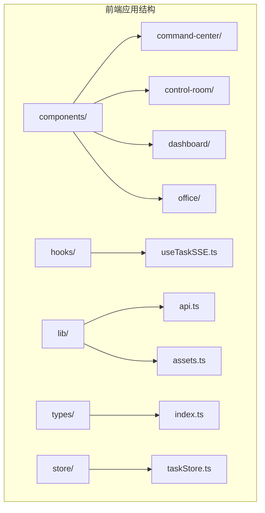
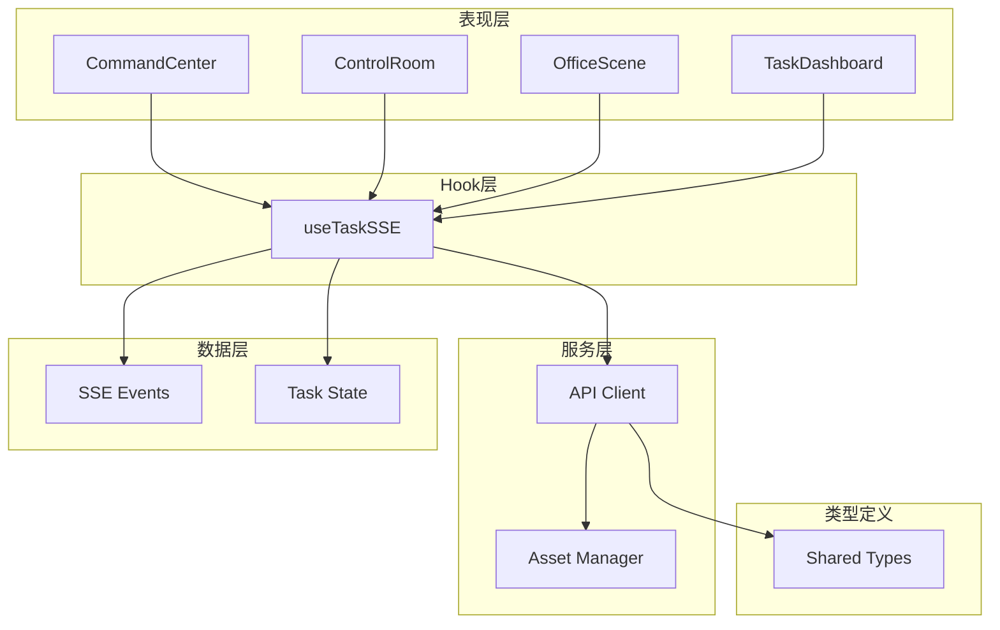
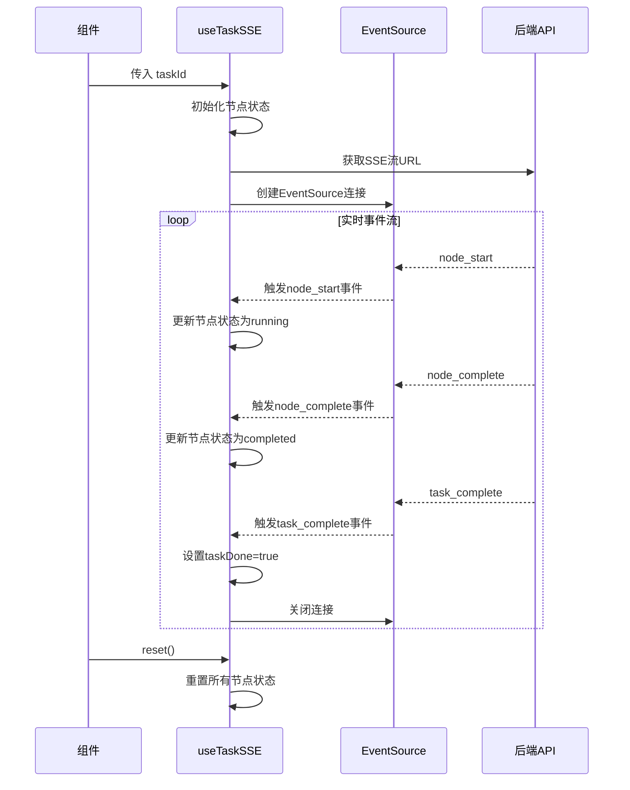
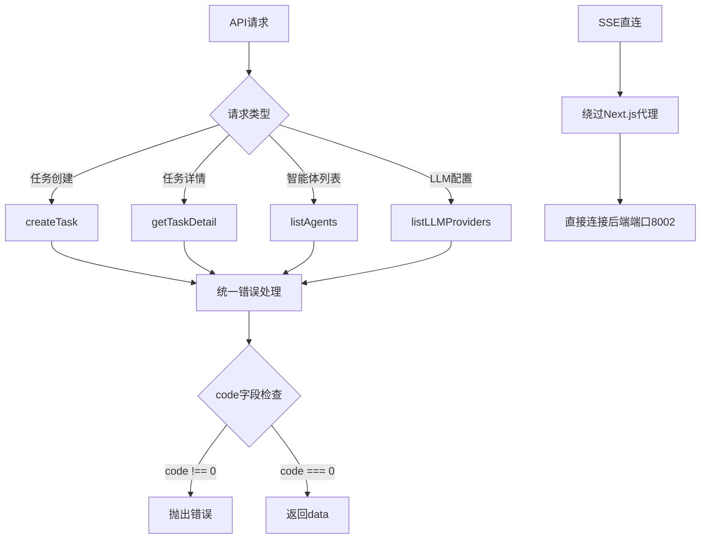
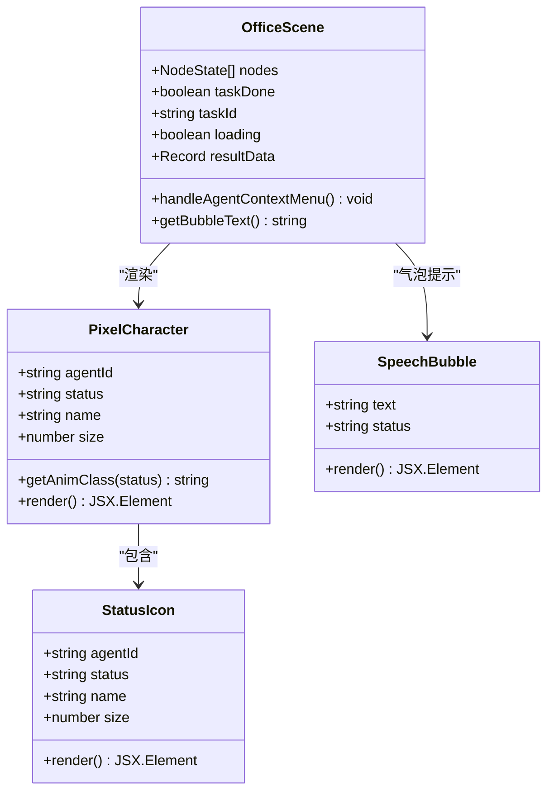
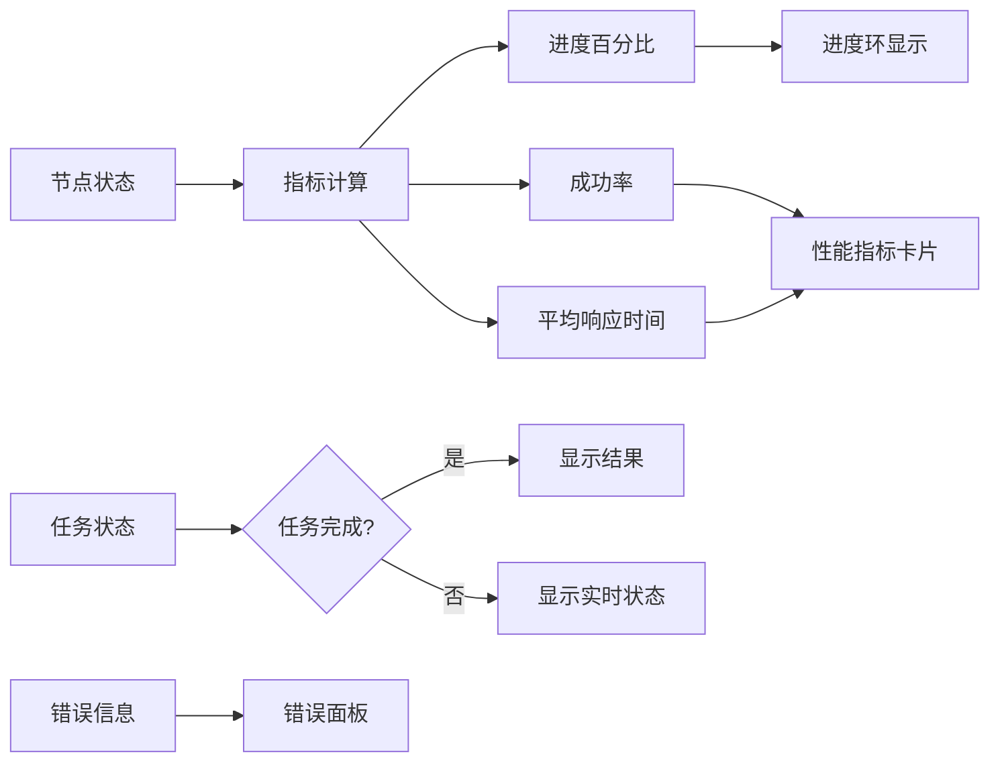
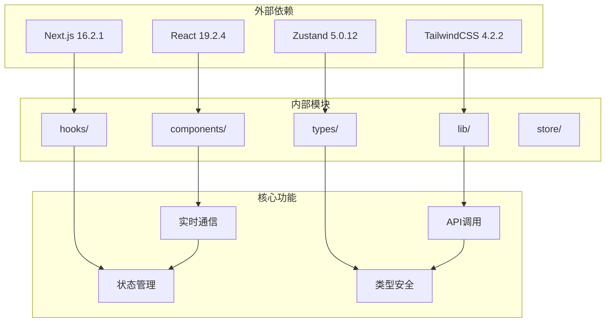

# 前端组件库

<cite>
**本文档引用的文件**
- [package.json](file://frontend/package.json)
- [CommandCenter.tsx](file://frontend/components/command-center/CommandCenter.tsx)
- [ControlRoom.tsx](file://frontend/components/control-room/ControlRoom.tsx)
- [TaskDashboard.tsx](file://frontend/components/dashboard/TaskDashboard.tsx)
- [OfficeScene.tsx](file://frontend/components/office/OfficeScene.tsx)
- [useTaskSSE.ts](file://frontend/hooks/useTaskSSE.ts)
- [api.ts](file://frontend/lib/api.ts)
- [index.ts](file://frontend/types/index.ts)
- [PixelCharacter.tsx](file://frontend/components/office/PixelCharacter.tsx)
- [SpeechBubble.tsx](file://frontend/components/office/SpeechBubble.tsx)
- [TaskInput.tsx](file://frontend/components/office/TaskInput.tsx)
- [ResultPanel.tsx](file://frontend/components/office/ResultPanel.tsx)
</cite>

## 目录
1. [简介](#简介)
2. [项目结构](#项目结构)
3. [核心组件](#核心组件)
4. [架构总览](#架构总览)
5. [详细组件分析](#详细组件分析)
6. [依赖关系分析](#依赖关系分析)
7. [性能考虑](#性能考虑)
8. [故障排除指南](#故障排除指南)
9. [结论](#结论)

## 简介
本项目是一个基于 Next.js 的前端组件库，专注于智能体编排系统的可视化交互界面。系统通过三个主要场景（深空指挥舱、控制中心、像素编辑部）提供任务创建、实时监控和结果展示能力。组件库采用 React + TypeScript 构建，结合自定义 Hook 和 SSE 实时通信，实现了完整的任务生命周期管理。

## 项目结构
前端项目采用模块化组织方式，主要包含以下核心目录：



**图表来源**
- [package.json:1-24](file://frontend/package.json#L1-L24)

**章节来源**
- [package.json:1-24](file://frontend/package.json#L1-L24)

## 核心组件
组件库围绕三大核心场景构建，每个场景都有其独特的交互模式和视觉风格：

### 深空指挥舱 (Command Center)
- **环形布局设计**：6个智能体节点以圆形轨道分布，中央控制台集成任务输入和状态监控
- **全息连线系统**：SVG贝塞尔曲线连接相邻节点，营造科技感的视觉效果
- **实时状态同步**：通过 SSE 实时接收节点状态变化，动态更新界面

### 控制中心 (Control Room)
- **网格化监控面板**：智能体状态以卡片形式网格布局展示
- **管道流程图**：可视化任务执行流程，清晰展示各阶段状态
- **响应式设计**：适配不同屏幕尺寸，提供一致的用户体验

### 像素编辑部 (Office Scene)
- **像素艺术风格**：基于 R2108101 大型像素办公场景构建
- **精灵角色系统**：6个智能体对应不同像素角色，具有独特的动画状态
- **三面板布局**：日志、状态、访客面板提供全面的任务信息

**章节来源**
- [CommandCenter.tsx:1-318](file://frontend/components/command-center/CommandCenter.tsx#L1-L318)
- [ControlRoom.tsx:1-385](file://frontend/components/control-room/ControlRoom.tsx#L1-L385)
- [OfficeScene.tsx:1-428](file://frontend/components/office/OfficeScene.tsx#L1-L428)

## 架构总览
系统采用分层架构设计，确保组件间的松耦合和高内聚：



**图表来源**
- [useTaskSSE.ts:1-233](file://frontend/hooks/useTaskSSE.ts#L1-L233)
- [api.ts:1-363](file://frontend/lib/api.ts#L1-L363)
- [index.ts:1-119](file://frontend/types/index.ts#L1-L119)

## 详细组件分析

### 实时状态管理 (useTaskSSE Hook)
该 Hook 封装了 EventSource API，提供简洁的 React Hook 接口：



**图表来源**
- [useTaskSSE.ts:82-232](file://frontend/hooks/useTaskSSE.ts#L82-L232)

**章节来源**
- [useTaskSSE.ts:1-233](file://frontend/hooks/useTaskSSE.ts#L1-L233)

### API 客户端设计
统一的 API 客户端封装了所有后端接口调用：



**图表来源**
- [api.ts:39-50](file://frontend/lib/api.ts#L39-L50)
- [api.ts:97-103](file://frontend/lib/api.ts#L97-L103)

**章节来源**
- [api.ts:1-363](file://frontend/lib/api.ts#L1-L363)

### 像素角色系统
OfficeScene 中的像素角色系统提供了丰富的视觉反馈：



**图表来源**
- [PixelCharacter.tsx:35-82](file://frontend/components/office/PixelCharacter.tsx#L35-L82)
- [SpeechBubble.tsx:12-49](file://frontend/components/office/SpeechBubble.tsx#L12-L49)
- [OfficeScene.tsx:62-427](file://frontend/components/office/OfficeScene.tsx#L62-L427)

**章节来源**
- [PixelCharacter.tsx:1-83](file://frontend/components/office/PixelCharacter.tsx#L1-L83)
- [SpeechBubble.tsx:1-50](file://frontend/components/office/SpeechBubble.tsx#L1-L50)
- [OfficeScene.tsx:1-428](file://frontend/components/office/OfficeScene.tsx#L1-L428)

### 仪表板组件
TaskDashboard 提供了任务执行的可视化监控：



**图表来源**
- [TaskDashboard.tsx:21-176](file://frontend/components/dashboard/TaskDashboard.tsx#L21-L176)

**章节来源**
- [TaskDashboard.tsx:1-176](file://frontend/components/dashboard/TaskDashboard.tsx#L1-L176)

## 依赖关系分析



**图表来源**
- [package.json:11-22](file://frontend/package.json#L11-L22)

**章节来源**
- [package.json:1-24](file://frontend/package.json#L1-L24)

## 性能考虑
组件库在设计时充分考虑了性能优化：

### 渲染优化
- **条件渲染**：仅在必要时渲染特定组件，减少 DOM 操作
- **状态提升**：将共享状态提升到父组件，避免重复渲染
- **useCallback 缓存**：缓存函数引用，防止不必要的重渲染

### 实时通信优化
- **EventSource 自动重连**：利用浏览器内置的 SSE 重连机制
- **连接复用**：使用 useRef 存储 EventSource 实例，避免重复创建
- **清理机制**：组件卸载时自动关闭连接，防止内存泄漏

### 资源管理
- **像素渲染优化**：通过 CSS 属性 `imageRendering: pixelated` 保持像素风格
- **动画性能**：使用 CSS 动画而非 JavaScript 动画，提高流畅度

## 故障排除指南

### SSE 连接问题
1. **检查后端服务状态**
   - 确认后端 API 服务正常运行
   - 验证 SSE 端点可访问性

2. **网络配置**
   ```javascript
   // 开发环境需要直连后端端口8002
   const url = `http://${window.location.hostname}:8002${BASE}/tasks/${taskId}/stream`;
   ```

3. **浏览器兼容性**
   - 确保浏览器支持 EventSource API
   - 检查跨域设置

### 组件状态异常
1. **状态重置**
   ```typescript
   // 每次创建新任务时调用reset()
   reset();
   ```

2. **节点状态同步**
   - 检查节点 ID 匹配
   - 验证状态转换逻辑

### 性能问题诊断
1. **渲染性能**
   - 使用 React DevTools 分析组件渲染
   - 检查是否有不必要的重渲染

2. **内存泄漏**
   - 确认 EventSource 连接正确关闭
   - 检查定时器和事件监听器清理

**章节来源**
- [useTaskSSE.ts:112-126](file://frontend/hooks/useTaskSSE.ts#L112-L126)
- [api.ts:97-103](file://frontend/lib/api.ts#L97-L103)

## 结论
本前端组件库成功实现了智能体编排系统的完整可视化解决方案。通过模块化的组件设计、高效的实时通信机制和优雅的像素艺术风格，为用户提供了直观且富有科技感的交互体验。

### 主要优势
- **模块化架构**：清晰的组件分离和职责划分
- **实时响应**：基于 SSE 的高效状态同步
- **视觉一致性**：统一的设计语言和像素风格
- **类型安全**：完整的 TypeScript 类型定义

### 技术亮点
- 自定义 Hook 封装复杂的状态管理逻辑
- 组件间松耦合设计，便于维护和扩展
- 性能优化措施完善，适合生产环境使用

该组件库为后续的功能扩展和界面定制奠定了坚实的基础，能够有效支撑智能体编排系统的长期发展需求。