# 发布记录服务

<cite>
**本文档引用的文件**
- [publish_record_service.py](file://backend/app/services/publish_record_service.py)
- [wechat_config.py](file://backend/app/models/wechat_config.py)
- [tables.py](file://backend/app/models/tables.py)
- [draft_routes.py](file://backend/app/api/draft_routes.py)
- [wechat_routes.py](file://backend/app/api/wechat_routes.py)
- [draft_service.py](file://backend/app/services/draft_service.py)
- [publish_decision_service.py](file://backend/app/services/publish_decision_service.py)
- [test_publish_record.py](file://backend/tests/test_publish_record.py)
- [page.tsx](file://frontend/app/(shell)/publish-records/page.tsx)
</cite>

## 目录
1. [简介](#简介)
2. [项目结构](#项目结构)
3. [核心组件](#核心组件)
4. [架构概览](#架构概览)
5. [详细组件分析](#详细组件分析)
6. [依赖关系分析](#依赖关系分析)
7. [性能考虑](#性能考虑)
8. [故障排除指南](#故障排除指南)
9. [结论](#结论)

## 简介

发布记录服务是 HotClaw 内容发布系统中的核心组件，负责统一管理所有微信公众号文章发布的生命周期。该服务提供了完整的发布状态跟踪、错误处理、重试机制和状态同步功能，确保发布流程的可靠性和可追溯性。

发布记录服务主要处理以下关键功能：
- 创建和管理发布记录
- 跟踪发布状态变化
- 处理发布失败和重试
- 同步草稿和账号状态
- 提供发布历史查询

## 项目结构

发布记录服务在整体架构中的位置如下：

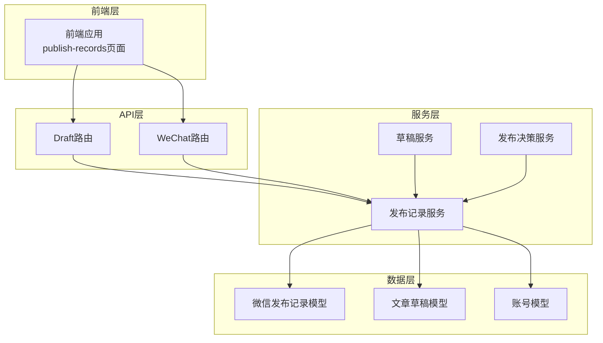

**图表来源**
- [publish_record_service.py:30-473](file://backend/app/services/publish_record_service.py#L30-L473)
- [wechat_config.py:34-100](file://backend/app/models/wechat_config.py#L34-L100)
- [draft_routes.py:290-441](file://backend/app/api/draft_routes.py#L290-L441)
- [wechat_routes.py:204-349](file://backend/app/api/wechat_routes.py#L204-L349)

**章节来源**
- [publish_record_service.py:1-473](file://backend/app/services/publish_record_service.py#L1-L473)
- [wechat_config.py:1-100](file://backend/app/models/wechat_config.py#L1-L100)

## 核心组件

发布记录服务包含以下核心组件：

### 主要类结构

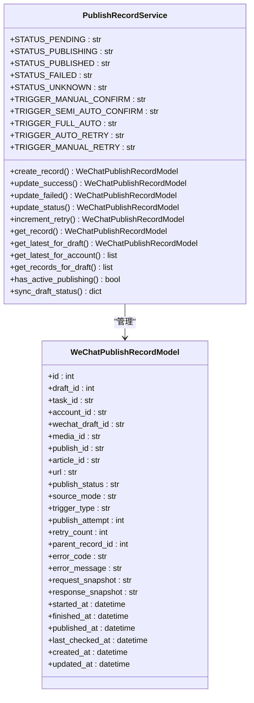

**图表来源**
- [publish_record_service.py:30-473](file://backend/app/services/publish_record_service.py#L30-L473)
- [wechat_config.py:34-100](file://backend/app/models/wechat_config.py#L34-L100)

### 状态管理系统

发布记录服务定义了完整的状态管理机制：

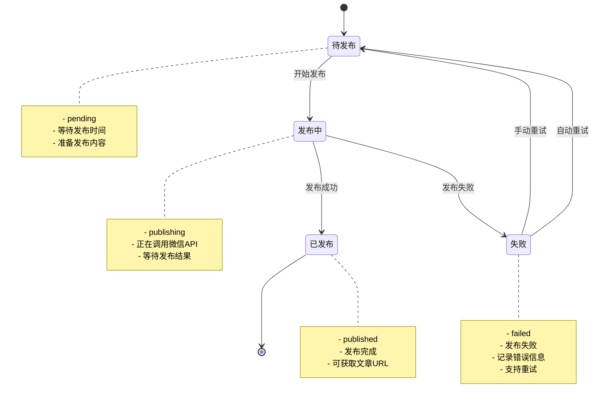

**图表来源**
- [publish_record_service.py:42-54](file://backend/app/services/publish_record_service.py#L42-L54)

**章节来源**
- [publish_record_service.py:30-473](file://backend/app/services/publish_record_service.py#L30-L473)

## 架构概览

发布记录服务采用分层架构设计，确保职责分离和可维护性：

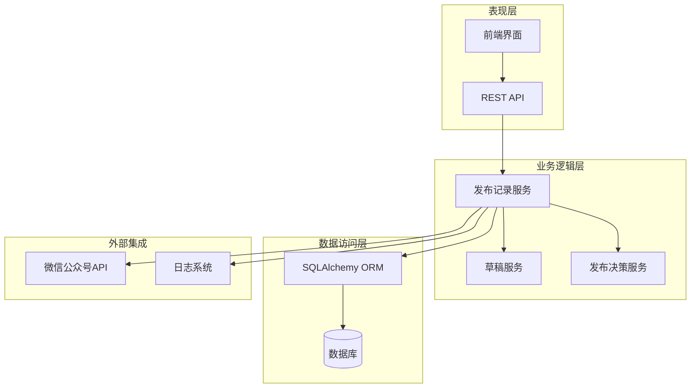

**图表来源**
- [publish_record_service.py:1-473](file://backend/app/services/publish_record_service.py#L1-L473)
- [draft_service.py:380-579](file://backend/app/services/draft_service.py#L380-L579)
- [publish_decision_service.py:320-519](file://backend/app/services/publish_decision_service.py#L320-L519)

### 数据流处理

发布记录服务的数据流处理遵循严格的顺序：

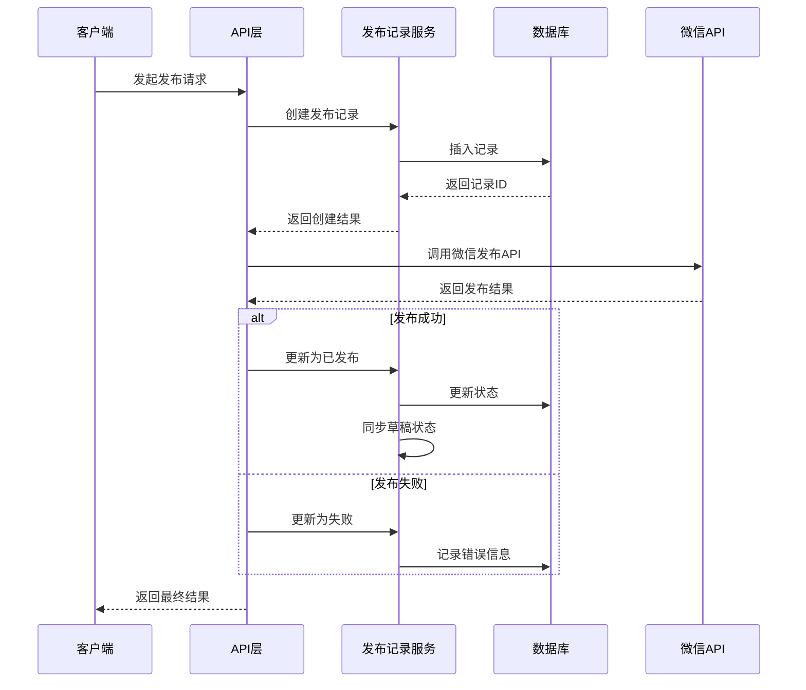

**图表来源**
- [draft_service.py:398-471](file://backend/app/services/draft_service.py#L398-L471)
- [publish_record_service.py:109-169](file://backend/app/services/publish_record_service.py#L109-L169)

**章节来源**
- [draft_routes.py:290-441](file://backend/app/api/draft_routes.py#L290-L441)
- [wechat_routes.py:246-349](file://backend/app/api/wechat_routes.py#L246-L349)

## 详细组件分析

### 发布记录模型

WeChatPublishRecordModel 是发布记录的核心数据结构，包含了完整的发布信息：

#### 核心字段分析

| 字段类别 | 字段名称 | 类型 | 描述 |
|---------|---------|------|------|
| 基本信息 | id | Integer | 主键标识 |
| 基本信息 | draft_id | Integer | 关联草稿ID |
| 基本信息 | task_id | String | 关联任务ID |
| 基本信息 | account_id | String | 关联账号ID |
| 微信返回ID | wechat_draft_id | String | 微信草稿ID |
| 微信返回ID | media_id | String | 媒体ID |
| 微信返回ID | publish_id | String | 发布任务ID |
| 微信返回ID | article_id | String | 文章ID |
| 微信返回ID | url | Text | 文章URL |
| 发布状态 | publish_status | String | 发布状态(pending/publishing/published/failed/unknown) |
| 发布来源 | source_mode | String | 来源模式(manual/semi_auto/full_auto) |
| 发布来源 | trigger_type | String | 触发类型(manual_confirm/semi_auto_confirm/full_auto/auto_retry/manual_retry) |
| 重试信息 | publish_attempt | Integer | 第几次发布尝试 |
| 重试信息 | retry_count | Integer | 已重试次数 |
| 重试信息 | parent_record_id | Integer | 父记录ID(重试关联) |
| 错误信息 | error_code | String | 错误代码 |
| 错误信息 | error_message | Text | 错误描述 |
| 快照信息 | request_snapshot | Text | 请求摘要 |
| 快照信息 | response_snapshot | Text | 响应摘要 |
| 时间戳 | started_at | DateTime | 开始发布时间 |
| 时间戳 | finished_at | DateTime | 完成发布时间 |
| 时间戳 | published_at | DateTime | 实际发布时间 |
| 时间戳 | last_checked_at | DateTime | 最近检查时间 |

**章节来源**
- [wechat_config.py:34-100](file://backend/app/models/wechat_config.py#L34-L100)

### 发布状态管理

发布记录服务实现了完整的状态管理机制：

#### 状态转换流程

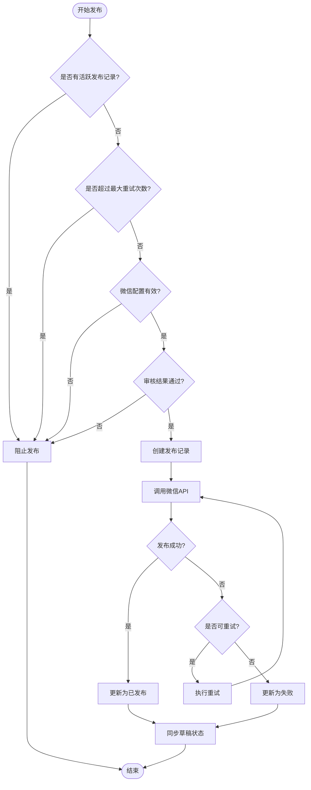

**图表来源**
- [publish_record_service.py:265-317](file://backend/app/services/publish_record_service.py#L265-L317)
- [publish_decision_service.py:322-341](file://backend/app/services/publish_decision_service.py#L322-L341)

#### 状态同步机制

发布记录服务提供了双向状态同步功能：

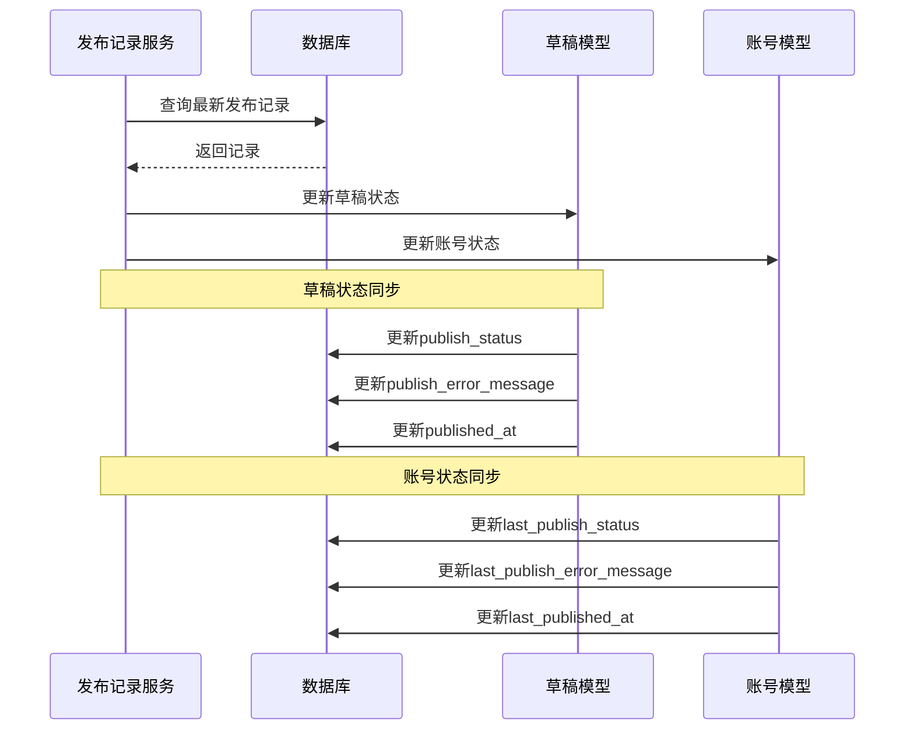

**图表来源**
- [publish_record_service.py:370-454](file://backend/app/services/publish_record_service.py#L370-L454)

**章节来源**
- [publish_record_service.py:225-473](file://backend/app/services/publish_record_service.py#L225-L473)

### API 接口设计

发布记录服务提供了丰富的 API 接口：

#### 发布记录查询接口

| 接口路径 | 方法 | 功能 | 参数 |
|---------|------|------|------|
| `/api/v1/drafts/{draft_id}/wechat-status` | GET | 获取微信发布状态 | draft_id |
| `/api/v1/drafts/{draft_id}/publish-records` | GET | 获取草稿发布记录 | draft_id |
| `/api/v1/wechat/publish-records/{record_id}` | GET | 获取单个发布记录 | record_id |
| `/api/v1/wechat/publish-records/{record_id}/refresh-status` | POST | 刷新发布状态 | record_id |

#### 发布重试接口

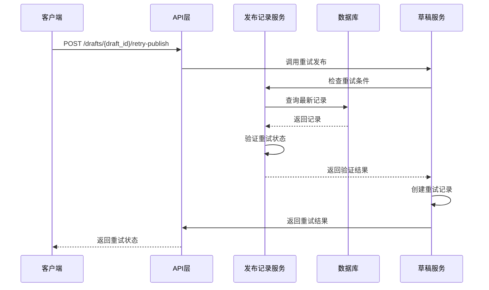

**图表来源**
- [draft_routes.py:384-441](file://backend/app/api/draft_routes.py#L384-L441)
- [draft_service.py:668-668](file://backend/app/services/draft_service.py#L668-L668)

**章节来源**
- [draft_routes.py:290-441](file://backend/app/api/draft_routes.py#L290-L441)
- [wechat_routes.py:204-349](file://backend/app/api/wechat_routes.py#L204-L349)

### 错误处理机制

发布记录服务实现了完善的错误处理机制：

#### 错误类型分类

| 错误类型 | 错误代码 | 处理方式 | 重试策略 |
|---------|---------|---------|---------|
| 认证错误 | TOKEN_ERROR | 清除令牌缓存后重试 | 一次性重试 |
| 网络错误 | NETWORK_ERROR | 网络重试 | 可重试 |
| 发布错误 | PUBLISH_ERROR | 不可重试 | 不重试 |
| 内部错误 | INTERNAL_ERROR | 记录错误并终止 | 不重试 |
| 超时错误 | TIMEOUT_ERROR | 重试 | 可重试 |

#### 错误恢复流程

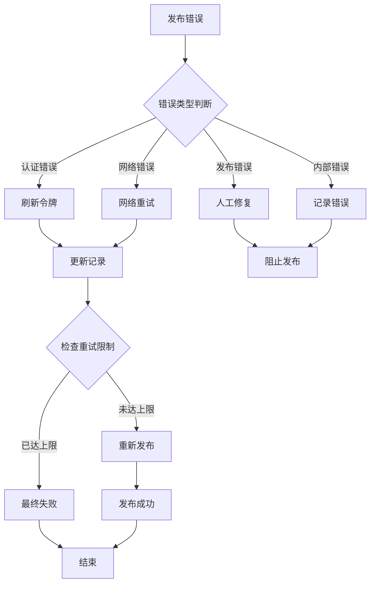

**图表来源**
- [draft_service.py:473-523](file://backend/app/services/draft_service.py#L473-L523)

**章节来源**
- [draft_service.py:473-523](file://backend/app/services/draft_service.py#L473-L523)

## 依赖关系分析

发布记录服务的依赖关系图：

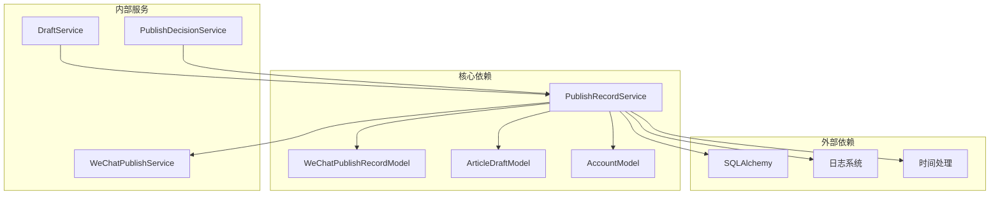

**图表来源**
- [publish_record_service.py:12-22](file://backend/app/services/publish_record_service.py#L12-L22)
- [draft_service.py:380-383](file://backend/app/services/draft_service.py#L380-L383)
- [publish_decision_service.py:29-29](file://backend/app/services/publish_decision_service.py#L29-L29)

### 数据模型关系

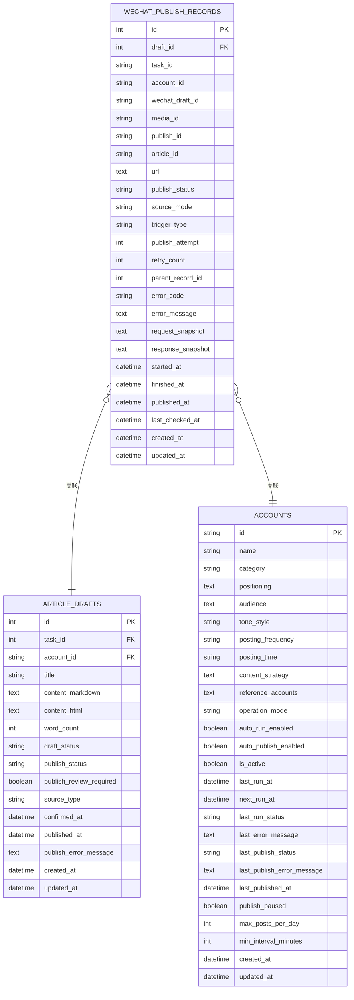

**图表来源**
- [wechat_config.py:34-100](file://backend/app/models/wechat_config.py#L34-L100)
- [tables.py:173-214](file://backend/app/models/tables.py#L173-L214)

**章节来源**
- [wechat_config.py:1-100](file://backend/app/models/wechat_config.py#L1-L100)
- [tables.py:1-393](file://backend/app/models/tables.py#L1-L393)

## 性能考虑

发布记录服务在设计时充分考虑了性能优化：

### 查询优化策略

1. **索引设计**
   - draft_id 字段建立索引以加速草稿查询
   - account_id 字段建立索引以支持账号维度查询
   - task_id 字段建立索引以支持任务维度查询

2. **批量操作**
   - 支持批量获取发布记录
   - 支持批量状态同步

3. **缓存策略**
   - 最新发布记录缓存
   - 草稿状态缓存

### 异步处理

发布记录服务采用异步编程模式：

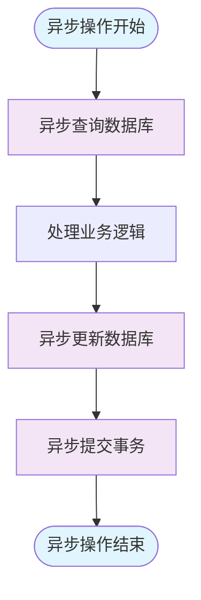

### 错误重试机制

发布记录服务实现了智能的错误重试机制：

| 错误类型 | 重试次数 | 重试间隔 | 重试条件 |
|---------|---------|---------|---------|
| 认证错误 | 1次 | 立即 | 令牌过期 |
| 网络错误 | 2次 | 指数退避 | 超时/连接失败 |
| 发布错误 | 0次 | 不适用 | 内容违规 |
| 其他错误 | 0次 | 不适用 | 未知错误 |

## 故障排除指南

### 常见问题诊断

#### 发布记录无法创建

**症状**: 创建发布记录时报错

**可能原因**:
1. 草稿不存在
2. 数据库连接异常
3. 事务处理失败

**解决方案**:
1. 验证草稿ID有效性
2. 检查数据库连接状态
3. 查看事务日志

#### 发布状态同步失败

**症状**: 草稿状态与实际发布状态不一致

**可能原因**:
1. 网络连接异常
2. 微信API调用失败
3. 数据库更新失败

**解决方案**:
1. 检查网络连接
2. 验证微信API凭证
3. 手动触发状态同步

#### 重试机制失效

**症状**: 发布失败后无法自动重试

**可能原因**:
1. 重试次数达到上限
2. 错误类型不可重试
3. 状态检查失败

**解决方案**:
1. 检查重试计数器
2. 验证错误类型
3. 手动重试发布

### 调试工具

发布记录服务提供了多种调试工具：

1. **日志监控**: 详细的发布过程日志
2. **状态查询**: 实时查看发布状态
3. **重试管理**: 手动触发重试
4. **数据校验**: 核对数据库一致性

**章节来源**
- [test_publish_record.py:1-169](file://backend/tests/test_publish_record.py#L1-L169)

## 结论

发布记录服务作为 HotClaw 内容发布系统的核心组件，提供了完整、可靠的发布状态管理功能。通过精心设计的状态机、完善的错误处理机制和高效的查询优化，该服务确保了发布流程的稳定性和可追溯性。

### 主要优势

1. **完整性**: 覆盖发布流程的全生命周期
2. **可靠性**: 完善的错误处理和重试机制
3. **可扩展性**: 模块化设计支持功能扩展
4. **可观测性**: 详细的日志和状态跟踪
5. **易用性**: 简洁的API接口和清晰的错误信息

### 未来改进方向

1. **性能优化**: 进一步优化查询性能和缓存策略
2. **监控增强**: 添加更详细的指标监控
3. **自动化**: 增强自动重试和故障恢复能力
4. **安全性**: 加强数据安全和访问控制
5. **国际化**: 支持多语言和多地区发布需求

发布记录服务为 HotClaw 系统的稳定运行提供了坚实的基础，是内容发布流程中不可或缺的重要组成部分。