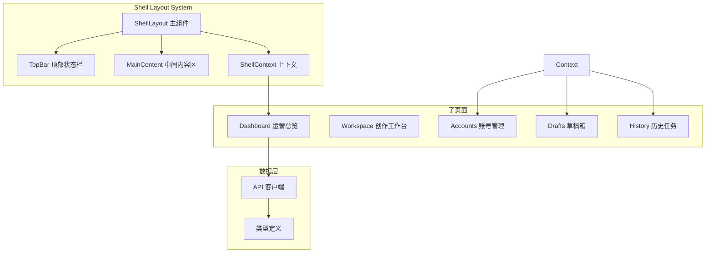
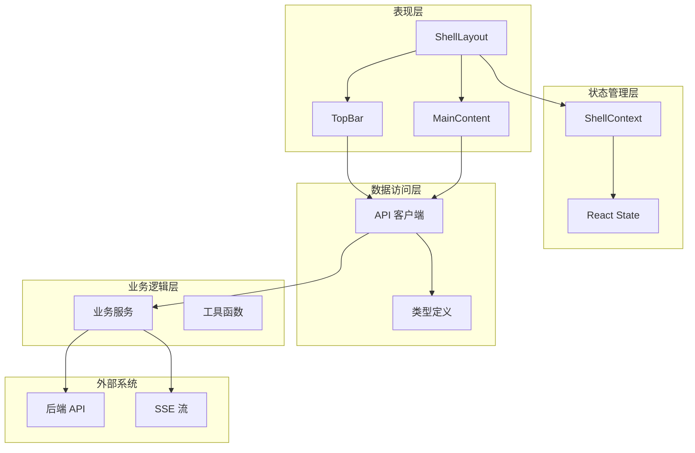
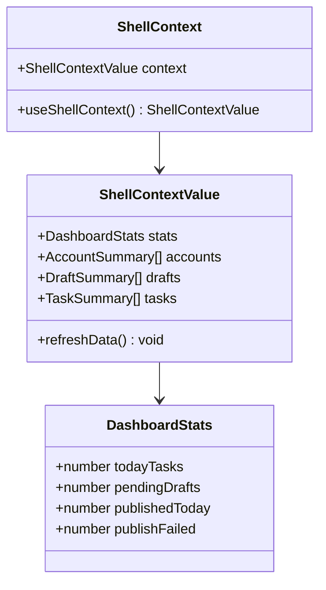
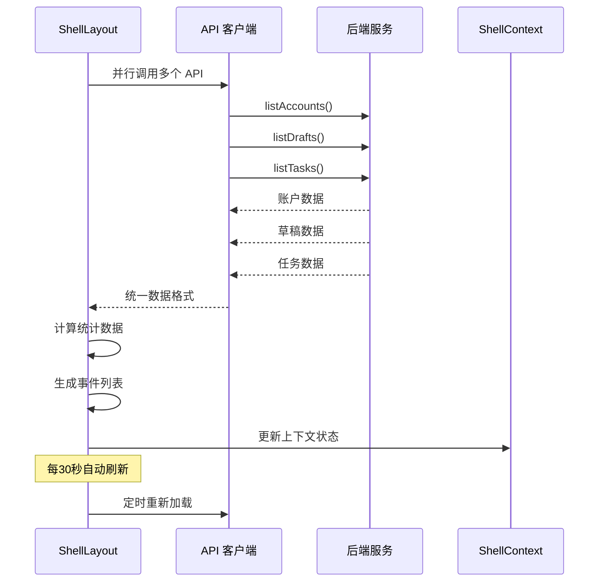
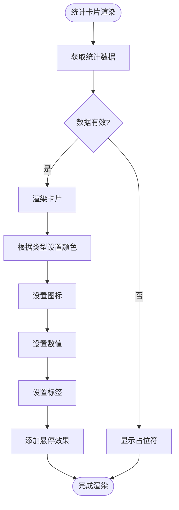
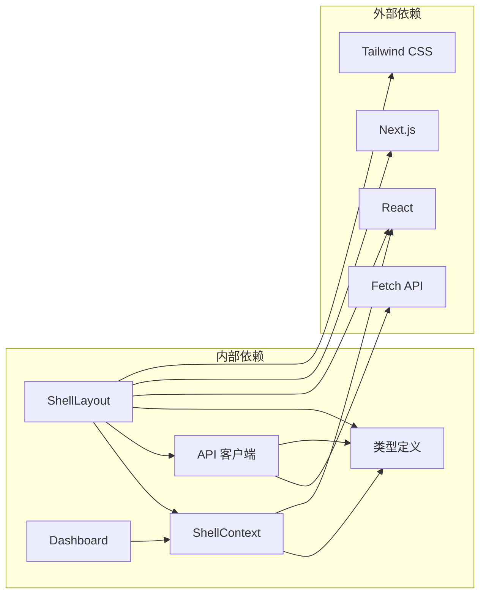

# Shell 布局系统

<cite>
**本文档引用的文件**
- [frontend/app/(shell)/layout.tsx](file://frontend/app/(shell)/layout.tsx)
- [frontend/app/(shell)/context.tsx](file://frontend/app/(shell)/context.tsx)
- [frontend/app/(shell)/page.tsx](file://frontend/app/(shell)/page.tsx)
- [frontend/app/layout.tsx](file://frontend/app/layout.tsx)
- [frontend/lib/api.ts](file://frontend/lib/api.ts)
- [frontend/types/index.ts](file://frontend/types/index.ts)
- [frontend/components/office/OfficeScene.tsx](file://frontend/components/office/OfficeScene.tsx)
</cite>

## 更新摘要
**所做更改**
- 更新了架构概览以反映从三面板架构到简化控制台界面的重构
- 修改了核心组件描述以匹配新的视觉设计和布局结构
- 更新了项目结构图表以体现简化的组件组织
- 修订了统计卡片和导航组件的详细分析
- 更新了依赖关系分析以反映新的设计模式

## 目录
1. [简介](#简介)
2. [项目结构](#项目结构)
3. [核心组件](#核心组件)
4. [架构概览](#架构概览)
5. [详细组件分析](#详细组件分析)
6. [依赖关系分析](#依赖关系分析)
7. [性能考虑](#性能考虑)
8. [故障排除指南](#故障排除指南)
9. [结论](#结论)

## 简介

Shell Layout System 是 HotClaw 多智能体内容生产平台的核心界面框架，经过重大重构后采用简化的控制台设计理念。该系统提供了统一的壳层布局，包含顶部状态栏和中间内容区，为整个平台的各个功能模块提供一致的用户体验。

系统基于 React 和 Next.js 构建，采用了现代化的 SaaS 控制台设计模式，通过 Context API 实现跨组件的状态共享，并集成了实时数据更新机制。整体设计注重运营指标的可视化展示和用户操作的流畅性，移除了复杂的右侧事件面板，专注于核心功能的简洁呈现。

## 项目结构

Shell Layout System 位于前端应用的 `(shell)` 目录下，采用简化的模块化组织方式：

**图表来源**
- [frontend/app/(shell)/layout.tsx:1-574](file://frontend/app/(shell)/layout.tsx#L1-L574)
- [frontend/app/(shell)/context.tsx:1-52](file://frontend/app/(shell)/context.tsx#L1-L52)

**章节来源**
- [frontend/app/(shell)/layout.tsx:1-50](file://frontend/app/(shell)/layout.tsx#L1-L50)
- [frontend/app/(shell)/context.tsx:1-20](file://frontend/app/(shell)/context.tsx#L1-L20)

## 核心组件

### ShellLayout 主组件

ShellLayout 是整个壳层系统的核心，负责协调各个子组件的布局和数据流。它实现了以下关键功能：

- **两栏式布局**：顶部状态栏和中间内容区，移除了复杂的右侧事件面板
- **状态管理**：维护账户、草稿、任务等核心数据状态
- **实时更新**：每30秒自动刷新数据，确保信息的时效性
- **上下文提供**：通过 React Context 向子组件提供共享状态

### TopBar 顶部状态栏

顶部状态栏采用现代化的设计理念，强调运营指标的可视化展示：

- **品牌标识**：包含 HotClaw 品牌元素和当前视图标识
- **核心指标**：四个关键运营指标的统计卡片，采用放大设计突出核心运营指标
- **快捷入口**：设置等常用功能的快速访问
- **响应式设计**：适配不同屏幕尺寸的显示需求

### MainContent 中间内容区

中间内容区作为主要的内容承载区域：

- **灵活布局**：根据不同的子页面提供相应的布局支持
- **滚动管理**：独立的滚动容器，不影响顶部状态栏
- **内容适配**：支持各种类型的页面内容展示

**章节来源**
- [frontend/app/(shell)/layout.tsx:426-574](file://frontend/app/(shell)/layout.tsx#L426-L574)
- [frontend/app/(shell)/layout.tsx:28-138](file://frontend/app/(shell)/layout.tsx#L28-L138)

## 架构概览

Shell Layout System 采用了简化的分层架构设计，确保了系统的可维护性和扩展性：

**图表来源**
- [frontend/app/(shell)/layout.tsx:542-549](file://frontend/app/(shell)/layout.tsx#L542-L549)
- [frontend/lib/api.ts:65-85](file://frontend/lib/api.ts#L65-L85)

系统的核心特点包括：

- **类型安全**：使用 TypeScript 确保编译时类型检查
- **异步数据流**：支持 Promise 并行加载和错误处理
- **实时更新**：集成定时刷新机制保持数据新鲜度
- **响应式设计**：适配不同设备和屏幕尺寸

**章节来源**
- [frontend/app/(shell)/layout.tsx:455-540](file://frontend/app/(shell)/layout.tsx#L455-L540)
- [frontend/lib/api.ts:1-733](file://frontend/lib/api.ts#L1-L733)

## 详细组件分析

### ShellContext 上下文系统

ShellContext 是整个系统状态管理的核心，提供了统一的数据访问接口：

**图表来源**
- [frontend/app/(shell)/context.tsx:30-37](file://frontend/app/(shell)/context.tsx#L30-L37)
- [frontend/app/(shell)/context.tsx:13-28](file://frontend/app/(shell)/context.tsx#L13-L28)

### 数据加载和更新机制

系统采用并行数据加载策略，优化了初始渲染性能：

**图表来源**
- [frontend/app/(shell)/layout.tsx:455-533](file://frontend/app/(shell)/layout.tsx#L455-L533)
- [frontend/lib/api.ts:449-455](file://frontend/lib/api.ts#L449-L455)

### 统计卡片组件

统计卡片是运营指标可视化的重要组成部分，采用了统一的设计规范：

**图表来源**
- [frontend/app/(shell)/layout.tsx:84-138](file://frontend/app/(shell)/layout.tsx#L84-L138)
- [frontend/app/(shell)/page.tsx:36-91](file://frontend/app/(shell)/page.tsx#L36-L91)

**章节来源**
- [frontend/app/(shell)/context.tsx:43-51](file://frontend/app/(shell)/context.tsx#L43-L51)
- [frontend/app/(shell)/layout.tsx:455-533](file://frontend/app/(shell)/layout.tsx#L455-L533)

## 依赖关系分析

Shell Layout System 的依赖关系体现了清晰的关注点分离：

**图表来源**
- [frontend/app/(shell)/layout.tsx:13-18](file://frontend/app/(shell)/layout.tsx#L13-L18)
- [frontend/lib/api.ts:18-44](file://frontend/lib/api.ts#L18-L44)

### 关键依赖特性

- **最小化外部依赖**：仅依赖 React 和 Next.js 核心功能
- **类型安全保证**：通过 TypeScript 提供完整的类型检查
- **CSS-in-JS 集成**：使用 Tailwind CSS 实现样式管理
- **API 抽象层**：通过 API 客户端封装网络请求细节

**章节来源**
- [frontend/app/(shell)/layout.tsx:13-18](file://frontend/app/(shell)/layout.tsx#L13-L18)
- [frontend/lib/api.ts:65-85](file://frontend/lib/api.ts#L65-L85)

## 性能考虑

Shell Layout System 在设计时充分考虑了性能优化：

### 数据加载优化
- **并行请求**：使用 Promise.all 同时加载多个数据源
- **缓存策略**：利用浏览器缓存减少重复请求
- **增量更新**：支持局部状态更新而非整页刷新

### 渲染性能
- **虚拟滚动**：对长列表采用虚拟滚动技术
- **懒加载**：非关键资源按需加载
- **CSS 优化**：使用 Tailwind CSS 的原子化类名

### 内存管理
- **清理机制**：组件卸载时清理定时器和事件监听器
- **状态优化**：避免不必要的状态更新
- **资源释放**：及时释放网络请求和定时器资源

## 故障排除指南

### 常见问题及解决方案

#### 数据加载失败
**症状**：统计数据不显示或显示加载状态
**原因**：网络请求超时或后端服务不可用
**解决**：检查网络连接，查看控制台错误信息

#### 状态不同步
**症状**：界面显示与实际状态不符
**原因**：Context 状态未正确更新
**解决**：调用 refreshData 方法手动刷新

#### 性能问题
**症状**：页面响应缓慢或卡顿
**原因**：大量数据渲染或内存泄漏
**解决**：检查组件渲染次数，优化数据结构

**章节来源**
- [frontend/app/(shell)/layout.tsx:528-532](file://frontend/app/(shell)/layout.tsx#L528-L532)
- [frontend/app/(shell)/layout.tsx:548](file://frontend/app/(shell)/layout.tsx#L548)

## 结论

Shell Layout System 经过重大重构后，代表了现代 Web 应用壳层设计的最佳实践，通过简化的架构和组件系统，为 HotClaw 平台提供了稳定、可扩展且用户友好的界面基础。

系统的主要优势包括：

- **统一的用户体验**：一致的视觉设计和交互模式
- **强大的数据可视化**：直观的运营指标展示
- **灵活的扩展性**：模块化的组件设计便于功能扩展
- **优秀的性能表现**：优化的数据加载和渲染机制
- **完善的错误处理**：健壮的异常处理和恢复机制

该系统不仅满足了当前的功能需求，还为未来的功能扩展和技术演进奠定了坚实的基础。通过持续的优化和改进，Shell Layout System 将继续为 HotClaw 平台的成功提供强有力的支持。