# 任务服务状态管理

<cite>
**本文档引用的文件**
- [task_service.py](file://backend/app/services/task_service.py)
- [task_routes.py](file://backend/app/api/task_routes.py)
- [engine.py](file://backend/app/orchestrator/engine.py)
- [broadcaster.py](file://backend/app/orchestrator/broadcaster.py)
- [stream_routes.py](file://backend/app/api/stream_routes.py)
- [tables.py](file://backend/app/models/tables.py)
- [tracer.py](file://backend/app/core/tracer.py)
- [taskStore.ts](file://frontend/store/taskStore.ts)
- [useTaskSSE.ts](file://frontend/hooks/useTaskSSE.ts)
- [ControlRoom.tsx](file://frontend/components/control-room/ControlRoom.tsx)
- [api.ts](file://frontend/lib/api.ts)
- [index.ts](file://frontend/types/index.ts)
</cite>

## 目录
1. [简介](#简介)
2. [项目结构](#项目结构)
3. [核心组件](#核心组件)
4. [架构总览](#架构总览)
5. [详细组件分析](#详细组件分析)
6. [依赖关系分析](#依赖关系分析)
7. [性能考虑](#性能考虑)
8. [故障排除指南](#故障排除指南)
9. [结论](#结论)

## 简介
本文档深入分析 HotClaw 项目的任务服务状态管理系统，涵盖从任务创建、执行、状态跟踪到结果展示的完整生命周期。系统采用前后端分离架构，后端使用 FastAPI 和 SQLAlchemy，前端使用 Next.js 和 React，通过 Server-Sent Events (SSE) 实现实时状态推送。

## 项目结构
HotClaw 项目采用模块化组织方式，主要分为以下层次：

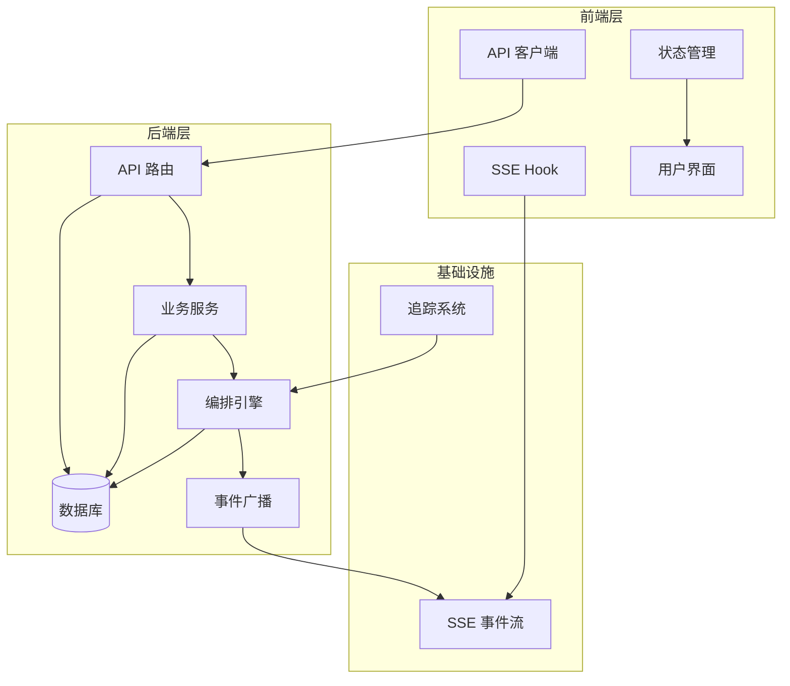

**图表来源**
- [task_routes.py:28-29](file://backend/app/api/task_routes.py#L28-L29)
- [task_service.py:20-240](file://backend/app/services/task_service.py#L20-L240)
- [engine.py:132-424](file://backend/app/orchestrator/engine.py#L132-L424)

**章节来源**
- [task_routes.py:1-298](file://backend/app/api/task_routes.py#L1-L298)
- [task_service.py:1-240](file://backend/app/services/task_service.py#L1-L240)

## 核心组件
系统的核心组件包括任务服务、编排引擎、事件广播器和前端状态管理，它们协同工作实现完整的任务生命周期管理。

### 任务状态流转
任务在整个生命周期中会经历以下状态转换：

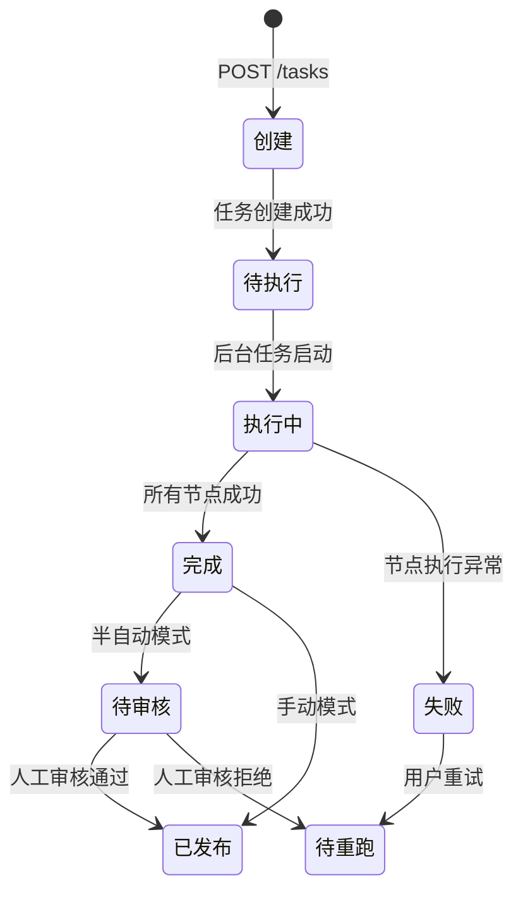

**图表来源**
- [task_service.py:39-92](file://backend/app/services/task_service.py#L39-L92)
- [engine.py:145-344](file://backend/app/orchestrator/engine.py#L145-L344)

### 数据模型关系
系统使用关系型数据库存储任务状态，核心实体之间的关系如下：

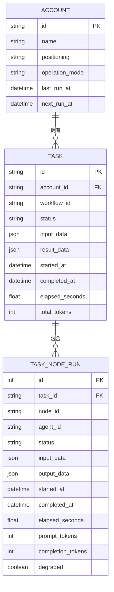

**图表来源**
- [tables.py:28-127](file://backend/app/models/tables.py#L28-L127)

**章节来源**
- [tables.py:71-127](file://backend/app/models/tables.py#L71-L127)

## 架构总览
系统采用事件驱动架构，通过 SSE 实现实时状态推送，确保前端能够及时反映任务执行状态。

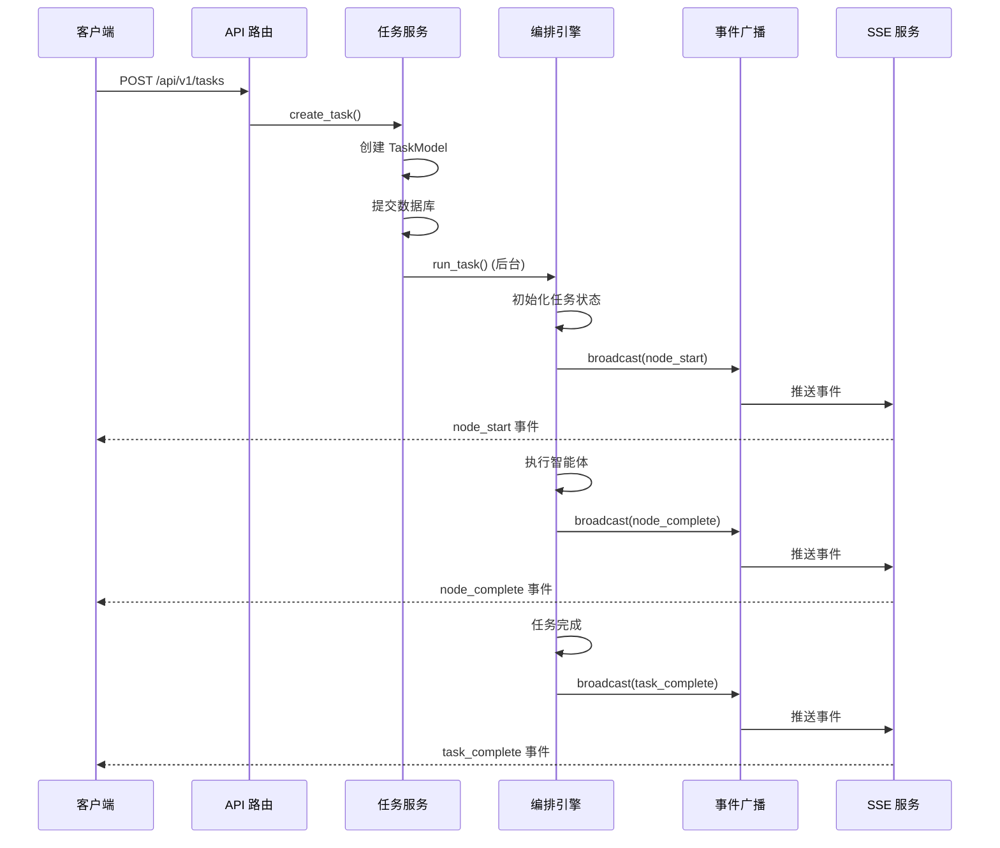

**图表来源**
- [task_routes.py:67-113](file://backend/app/api/task_routes.py#L67-L113)
- [task_service.py:39-92](file://backend/app/services/task_service.py#L39-L92)
- [engine.py:145-344](file://backend/app/orchestrator/engine.py#L145-L344)
- [broadcaster.py:111-145](file://backend/app/orchestrator/broadcaster.py#L111-L145)

## 详细组件分析

### 后端任务服务层
任务服务层负责任务的生命周期管理，包括创建、执行、状态查询和重跑等功能。

#### 任务创建流程
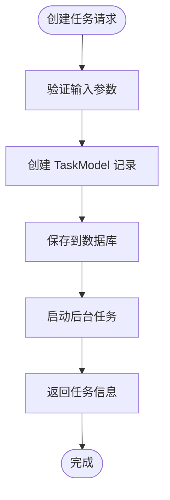

**图表来源**
- [task_routes.py:67-113](file://backend/app/api/task_routes.py#L67-L113)
- [task_service.py:22-37](file://backend/app/services/task_service.py#L22-L37)

#### 任务执行状态管理
任务执行过程中，系统会维护详细的执行状态和统计数据：

| 状态字段 | 描述 | 更新时机 |
|---------|------|----------|
| status | 任务整体状态 | 创建时=pending, 执行中=running, 完成=completed, 失败=failed |
| started_at | 开始执行时间 | 执行前设置 |
| completed_at | 完成时间 | 执行完成后设置 |
| elapsed_seconds | 总耗时(秒) | 执行完成后计算 |
| total_tokens | 总Token消耗 | 执行完成后累加 |
| result_data | 执行结果数据 | 执行完成后存储 |

**章节来源**
- [task_service.py:39-92](file://backend/app/services/task_service.py#L39-L92)
- [engine.py:181-344](file://backend/app/orchestrator/engine.py#L181-L344)

### 编排引擎
编排引擎是系统的核心，负责协调各个智能体的执行顺序和数据传递。

#### 工作流节点定义
系统定义了标准的6节点工作流，每个节点都有明确的输入输出和依赖关系：

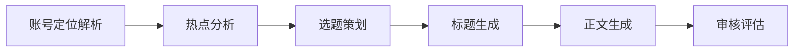

**图表来源**
- [engine.py:60-129](file://backend/app/orchestrator/engine.py#L60-L129)

#### 节点执行策略
每个节点的执行遵循以下策略：
- **必需节点**：失败会中断整个工作流
- **非必需节点**：失败不影响整体流程，但会记录错误
- **降级策略**：智能体可提供降级结果，标记为 `degraded=true`

**章节来源**
- [engine.py:132-424](file://backend/app/orchestrator/engine.py#L132-L424)

### 事件广播系统
事件广播系统通过 SSE 实现实时状态推送，解决了传统 HTTP 轮询的效率问题。

#### SSE 连接管理
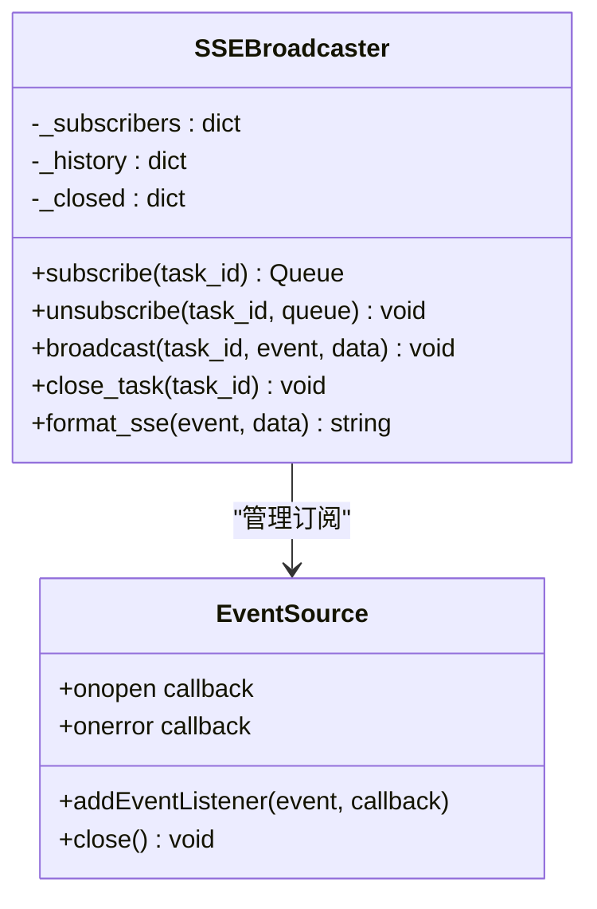

**图表来源**
- [broadcaster.py:30-220](file://backend/app/orchestrator/broadcaster.py#L30-L220)
- [stream_routes.py:37-96](file://backend/app/api/stream_routes.py#L37-L96)

#### 事件类型定义
系统支持以下事件类型：
- `node_start`：节点开始执行
- `node_complete`：节点执行完成
- `node_error`：节点执行失败
- `task_complete`：任务全部完成
- `task_error`：任务执行异常

**章节来源**
- [broadcaster.py:191-214](file://backend/app/orchestrator/broadcaster.py#L191-L214)
- [stream_routes.py:37-96](file://backend/app/api/stream_routes.py#L37-L96)

### 前端状态管理
前端使用 React Hooks 和 Zustand 实现状态管理，提供两种不同层面的状态：

#### 会话级状态管理
前端使用 Zustand 管理当前活跃任务的会话状态：

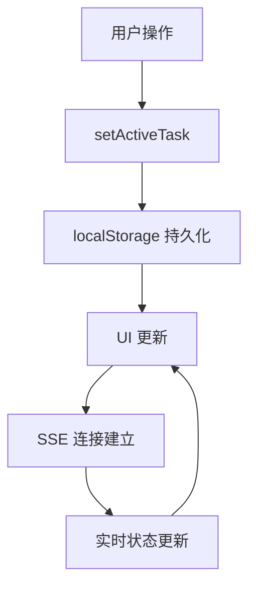

**图表来源**
- [taskStore.ts:82-116](file://frontend/store/taskStore.ts#L82-L116)

#### 组件级实时状态
使用自定义 Hook 管理组件级别的实时状态：

| 状态字段 | 类型 | 描述 |
|---------|------|------|
| nodes | NodeState[] | 节点执行状态数组 |
| taskDone | boolean | 任务是否完成 |
| taskError | string \| null | 任务错误信息 |
| isConnected | boolean | SSE 连接状态 |
| reset | function | 重置所有状态 |

**章节来源**
- [taskStore.ts:39-116](file://frontend/store/taskStore.ts#L39-L116)
- [useTaskSSE.ts:82-232](file://frontend/hooks/useTaskSSE.ts#L82-L232)

### 控制室界面
控制室是任务执行的可视化界面，提供实时的状态监控和交互功能。

#### 界面组件结构
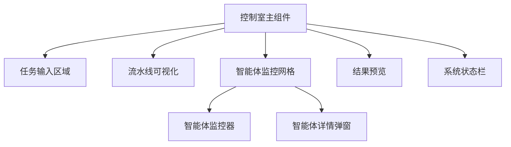

**图表来源**
- [ControlRoom.tsx:39-385](file://frontend/components/control-room/ControlRoom.tsx#L39-L385)

**章节来源**
- [ControlRoom.tsx:39-385](file://frontend/components/control-room/ControlRoom.tsx#L39-L385)

## 依赖关系分析

### 后端依赖图
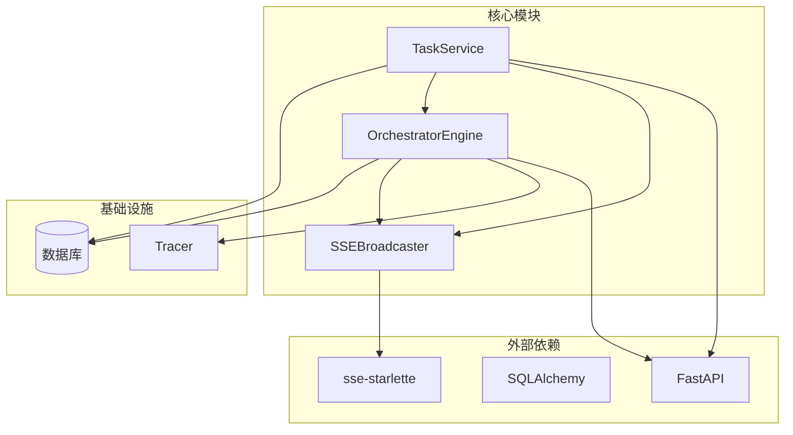

**图表来源**
- [task_service.py:10-16](file://backend/app/services/task_service.py#L10-L16)
- [engine.py:32-42](file://backend/app/orchestrator/engine.py#L32-L42)
- [broadcaster.py:22-26](file://backend/app/orchestrator/broadcaster.py#L22-L26)

### 前端依赖关系
前端组件之间存在清晰的依赖层次：

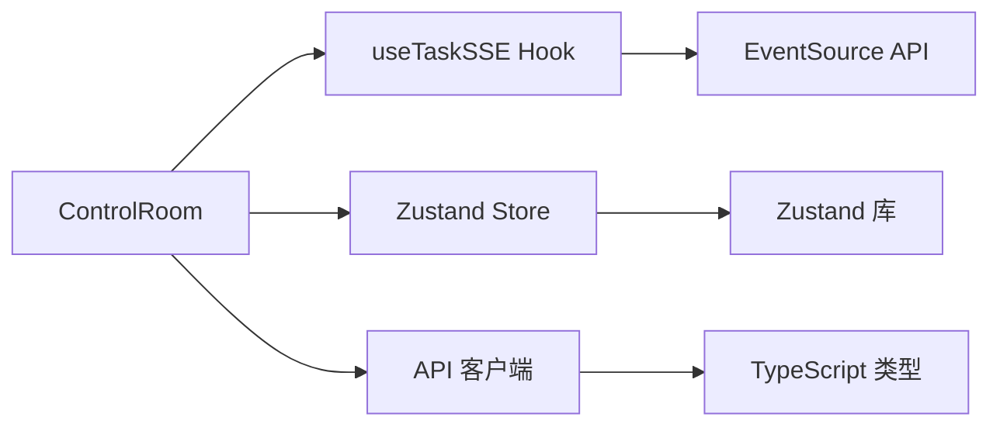

**图表来源**
- [ControlRoom.tsx:3-11](file://frontend/components/control-room/ControlRoom.tsx#L3-L11)
- [useTaskSSE.ts:32-34](file://frontend/hooks/useTaskSSE.ts#L32-L34)
- [taskStore.ts:28-29](file://frontend/store/taskStore.ts#L28-L29)

**章节来源**
- [task_routes.py:18-28](file://backend/app/api/task_routes.py#L18-L28)
- [engine.py:25-42](file://backend/app/orchestrator/engine.py#L25-L42)

## 性能考虑
系统在设计时充分考虑了性能优化，主要体现在以下几个方面：

### 异步处理
- **后台任务执行**：使用 `asyncio.create_task()` 实现非阻塞的任务执行
- **数据库连接池**：使用异步 SQLAlchemy 会话管理数据库连接
- **事件驱动架构**：通过 SSE 实现高效的实时通信

### 内存管理
- **事件历史限制**：每个任务最多保留 200 条历史事件，防止内存泄漏
- **连接清理**：60 秒后自动清理不再使用的事件历史
- **订阅者管理**：及时移除断开连接的订阅者

### 缓存策略
- **持久化状态**：使用 localStorage 保存任务上下文，支持页面刷新恢复
- **数据库缓存**：SQLAlchemy 查询缓存减少数据库访问

## 故障排除指南

### 常见问题及解决方案

#### 任务状态不更新
**症状**：前端无法看到任务状态变化
**排查步骤**：
1. 检查 SSE 连接状态 (`isConnected`)
2. 验证事件广播器是否正常工作
3. 确认编排引擎是否正确发送事件

**解决方案**：
- 检查网络连接和防火墙设置
- 验证后端日志中的事件广播记录
- 确认前端 EventSource 的错误处理

#### 任务执行超时
**症状**：任务在某个节点卡住
**排查步骤**：
1. 检查智能体执行时间
2. 验证 LLM 服务连接状态
3. 查看数据库连接情况

**解决方案**：
- 调整 `agent_timeout` 配置
- 优化智能体执行逻辑
- 检查外部服务可用性

#### 数据库连接问题
**症状**：任务状态无法持久化
**排查步骤**：
1. 检查数据库连接字符串
2. 验证数据库服务状态
3. 查看 SQLAlchemy 连接池配置

**解决方案**：
- 重启数据库服务
- 调整连接池大小
- 检查防火墙规则

**章节来源**
- [useTaskSSE.ts:215-229](file://frontend/hooks/useTaskSSE.ts#L215-L229)
- [engine.py:283-304](file://backend/app/orchestrator/engine.py#L283-L304)

## 结论
HotClaw 的任务服务状态管理系统采用了现代化的技术栈和设计理念，实现了高效、可靠的分布式任务执行和状态管理。系统的主要优势包括：

1. **实时性**：通过 SSE 实现毫秒级状态更新
2. **可靠性**：完善的错误处理和降级策略
3. **可扩展性**：模块化设计支持功能扩展
4. **可观测性**：完整的追踪和日志系统
5. **用户体验**：直观的可视化界面和状态反馈

该系统为内容创作平台提供了强大的任务执行能力，能够支持复杂的多智能体协作场景，为用户提供流畅的创作体验。