# Next.js应用架构

<cite>
**本文档引用的文件**
- [package.json](file://OpenClaw-bot-review-main/package.json)
- [next.config.mjs](file://OpenClaw-bot-review-main/nex.config.mjs)
- [tsconfig.json](file://OpenClaw-bot-review-main/tsconfig.json)
- [postcss.config.js](file://OpenClaw-bot-review-main/postcss.config.js)
- [app/layout.tsx](file://OpenClaw-bot-review-main/app/layout.tsx)
- [app/page.tsx](file://OpenClaw-bot-review-main/app/page.tsx)
- [app/globals.css](file://OpenClaw-bot-review-main/app/globals.css)
- [app/providers.tsx](file://OpenClaw-bot-review-main/app/providers.tsx)
- [app/sidebar.tsx](file://OpenClaw-bot-review-main/app/sidebar.tsx)
- [app/alert-monitor.tsx](file://OpenClaw-bot-review-main/app/alert-monitor.tsx)
- [app/global-bugs-overlay.tsx](file://OpenClaw-bot-review-main/app/global-bugs-overlay.tsx)
- [lib/theme.tsx](file://OpenClaw-bot-review-main/lib/theme.tsx)
- [lib/i18n.tsx](file://OpenClaw-bot-review-main/lib/i18n.tsx)
- [lib/gateway-url.ts](file://OpenClaw-bot-review-main/lib/gateway-url.ts)
- [lib/config-cache.ts](file://OpenClaw-bot-review-main/lib/config-cache.ts)
</cite>

## 目录
1. [简介](#简介)
2. [项目结构](#项目结构)
3. [核心组件](#核心组件)
4. [架构概览](#架构概览)
5. [详细组件分析](#详细组件分析)
6. [依赖关系分析](#依赖关系分析)
7. [性能考虑](#性能考虑)
8. [故障排除指南](#故障排除指南)
9. [结论](#结论)
10. [附录](#附录)

## 简介

这是一个基于Next.js 16.0.0的机器人管理系统前端应用，采用App Router架构设计。该应用提供了OpenClaw机器人的可视化监控界面，支持多语言国际化、主题切换、实时状态监控等功能。

## 项目结构

该项目采用Next.js官方推荐的App Router目录结构，主要特点包括：

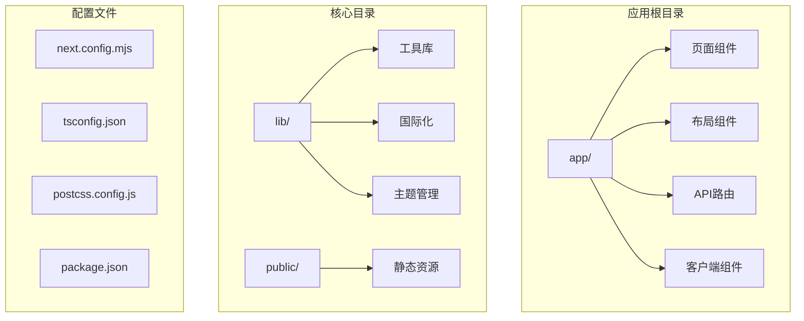

**图表来源**
- [app/layout.tsx:1-34](file://OpenClaw-bot-review-main/app/layout.tsx#L1-L34)
- [package.json:1-23](file://OpenClaw-bot-review-main/package.json#L1-L23)

**章节来源**
- [package.json:1-23](file://OpenClaw-bot-review-main/package.json#L1-L23)
- [next.config.mjs:1-6](file://OpenClaw-bot-review-main/next.config.mjs#L1-L6)

## 核心组件

### 应用布局系统

应用采用分层布局架构，通过RootLayout统一管理全局样式和组件结构：

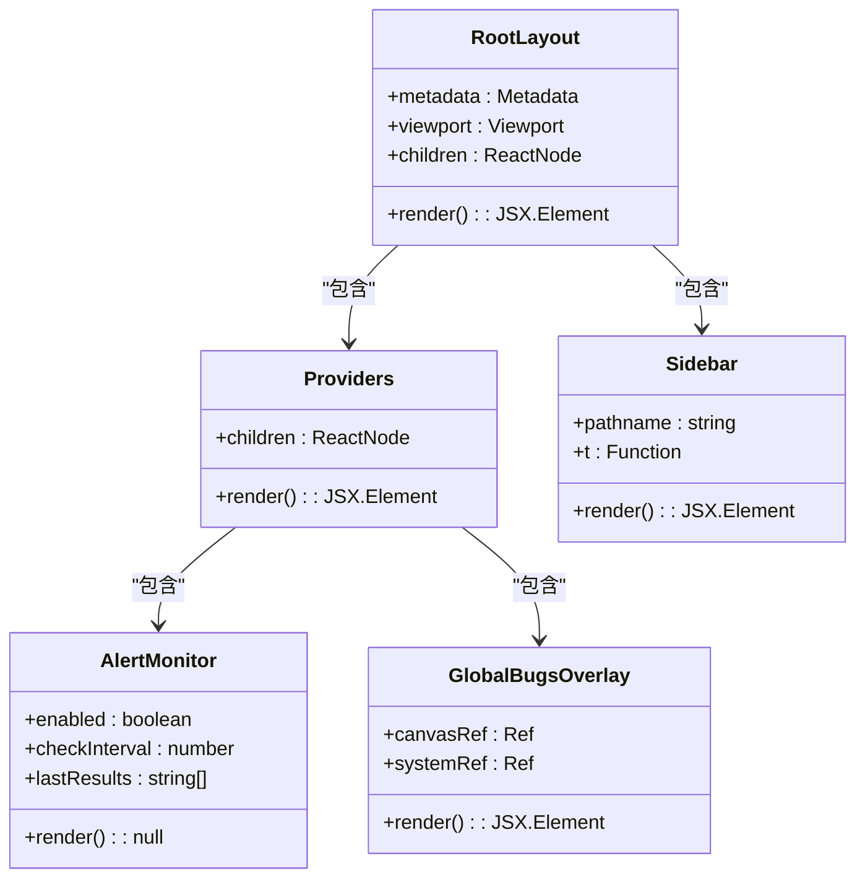

**图表来源**
- [app/layout.tsx:18-33](file://OpenClaw-bot-review-main/app/layout.tsx#L18-L33)
- [app/providers.tsx:7-13](file://OpenClaw-bot-review-main/app/providers.tsx#L7-L13)
- [app/sidebar.tsx:227-781](file://OpenClaw-bot-review-main/app/sidebar.tsx#L227-L781)

### 主题管理系统

应用实现了完整的主题切换机制，支持明暗两种主题模式：

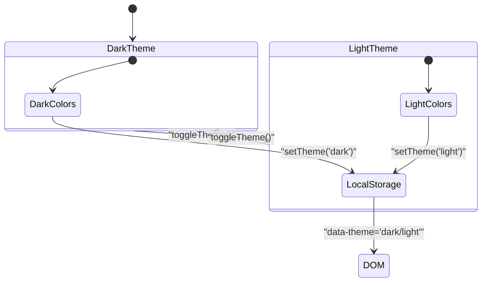

**图表来源**
- [lib/theme.tsx:19-45](file://OpenClaw-bot-review-main/lib/theme.tsx#L19-L45)

**章节来源**
- [app/layout.tsx:1-34](file://OpenClaw-bot-review-main/app/layout.tsx#L1-L34)
- [app/providers.tsx:1-14](file://OpenClaw-bot-review-main/app/providers.tsx#L1-L14)
- [lib/theme.tsx:1-63](file://OpenClaw-bot-review-main/lib/theme.tsx#L1-L63)

## 架构概览

应用采用模块化的架构设计，主要分为以下几个层次：

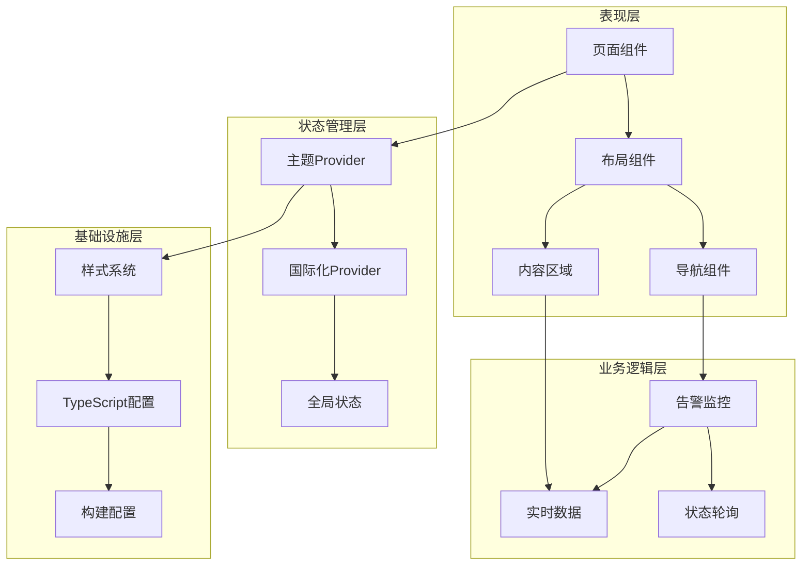

**图表来源**
- [app/page.tsx:220-520](file://OpenClaw-bot-review-main/app/page.tsx#L220-L520)
- [app/alert-monitor.tsx:6-44](file://OpenClaw-bot-review-main/app/alert-monitor.tsx#L6-L44)

## 详细组件分析

### 主页组件分析

主页组件是整个应用的核心，负责展示机器人状态、统计数据和交互功能：

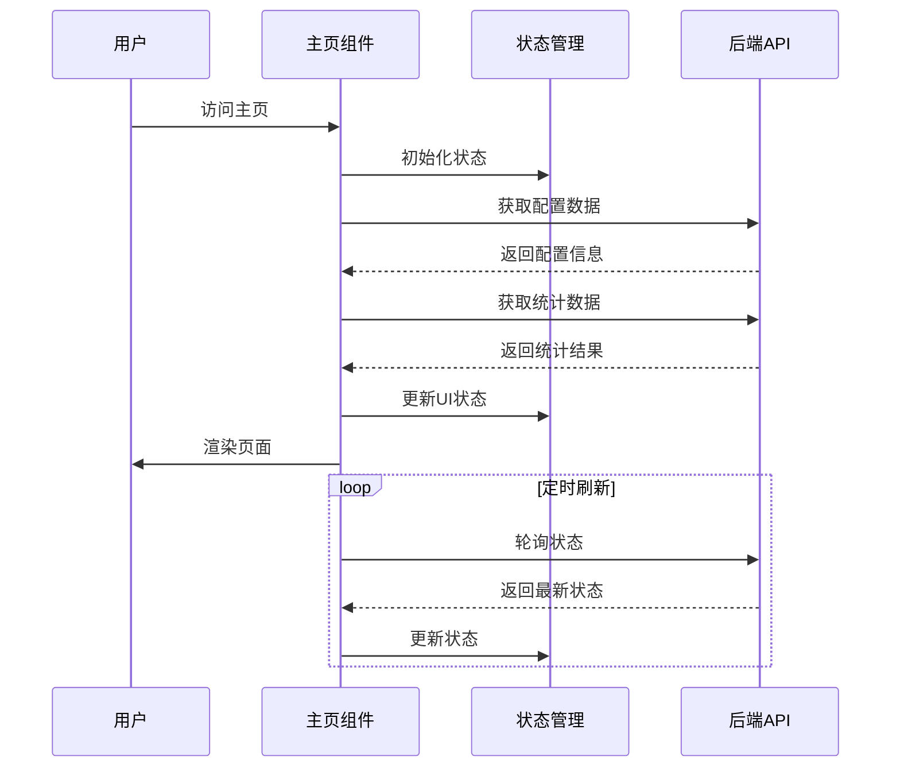

**图表来源**
- [app/page.tsx:279-310](file://OpenClaw-bot-review-main/app/page.tsx#L279-L310)
- [app/page.tsx:514-520](file://OpenClaw-bot-review-main/app/page.tsx#L514-L520)

#### 数据流分析

主页组件采用缓存策略优化数据获取：

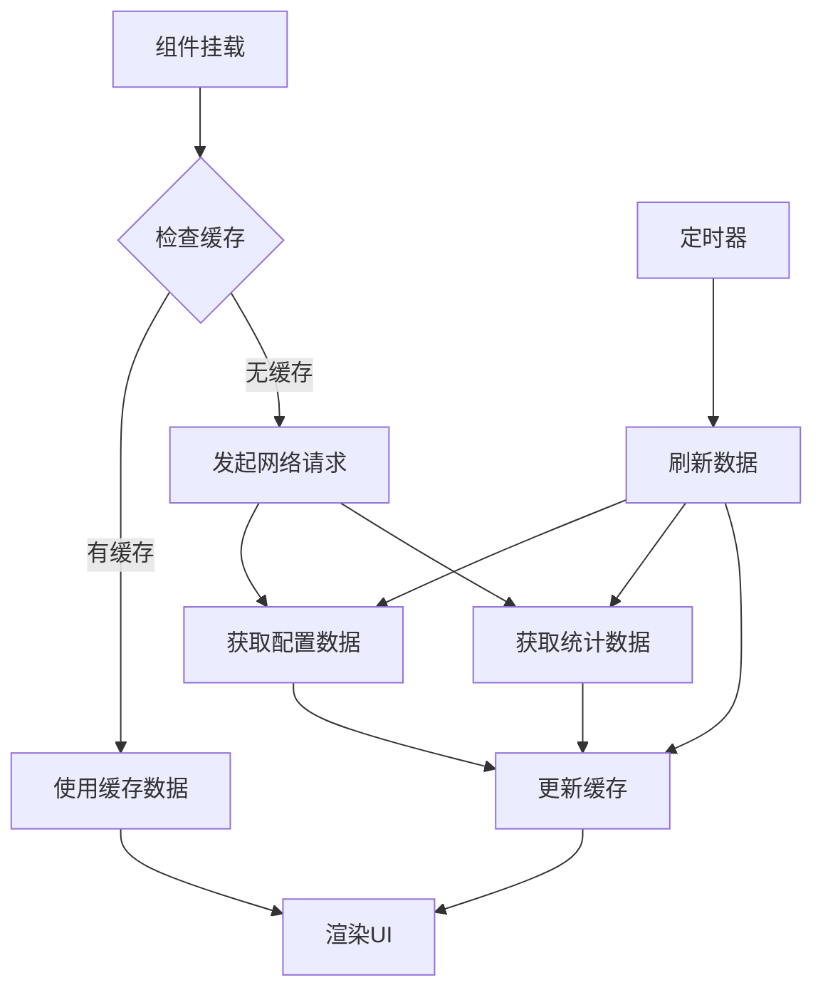

**图表来源**
- [app/page.tsx:111-117](file://OpenClaw-bot-review-main/app/page.tsx#L111-L117)
- [app/page.tsx:279-310](file://OpenClaw-bot-review-main/app/page.tsx#L279-L310)

**章节来源**
- [app/page.tsx:1-873](file://OpenClaw-bot-review-main/app/page.tsx#L1-L873)

### 国际化系统

应用支持多语言切换，采用Context模式实现：

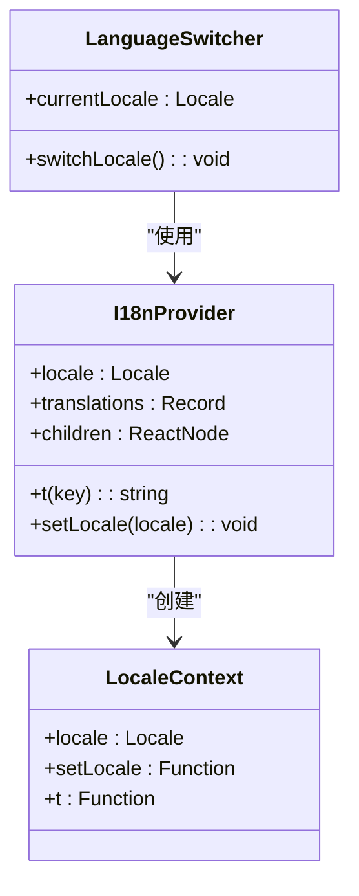

**图表来源**
- [lib/i18n.tsx:1-800](file://OpenClaw-bot-review-main/lib/i18n.tsx#L1-L800)

**章节来源**
- [lib/i18n.tsx:1-933](file://OpenClaw-bot-review-main/lib/i18n.tsx#L1-L933)

### 导航系统

侧边栏组件实现了响应式导航，支持桌面和移动端适配：

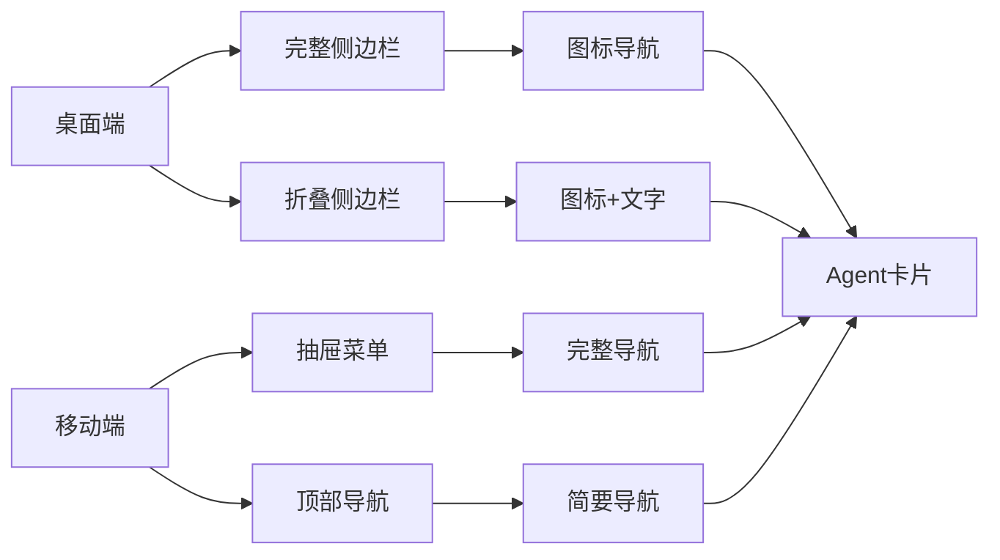

**图表来源**
- [app/sidebar.tsx:596-781](file://OpenClaw-bot-review-main/app/sidebar.tsx#L596-L781)

**章节来源**
- [app/sidebar.tsx:1-781](file://OpenClaw-bot-review-main/app/sidebar.tsx#L1-L781)

### 实时监控系统

告警监控组件提供后台状态检查功能：

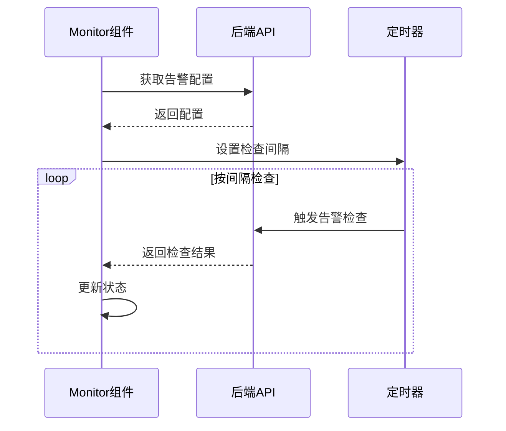

**图表来源**
- [app/alert-monitor.tsx:11-39](file://OpenClaw-bot-review-main/app/alert-monitor.tsx#L11-L39)

**章节来源**
- [app/alert-monitor.tsx:1-45](file://OpenClaw-bot-review-main/app/alert-monitor.tsx#L1-L45)

## 依赖关系分析

### 样式系统架构

应用采用Tailwind CSS + 自定义CSS变量的混合样式方案：

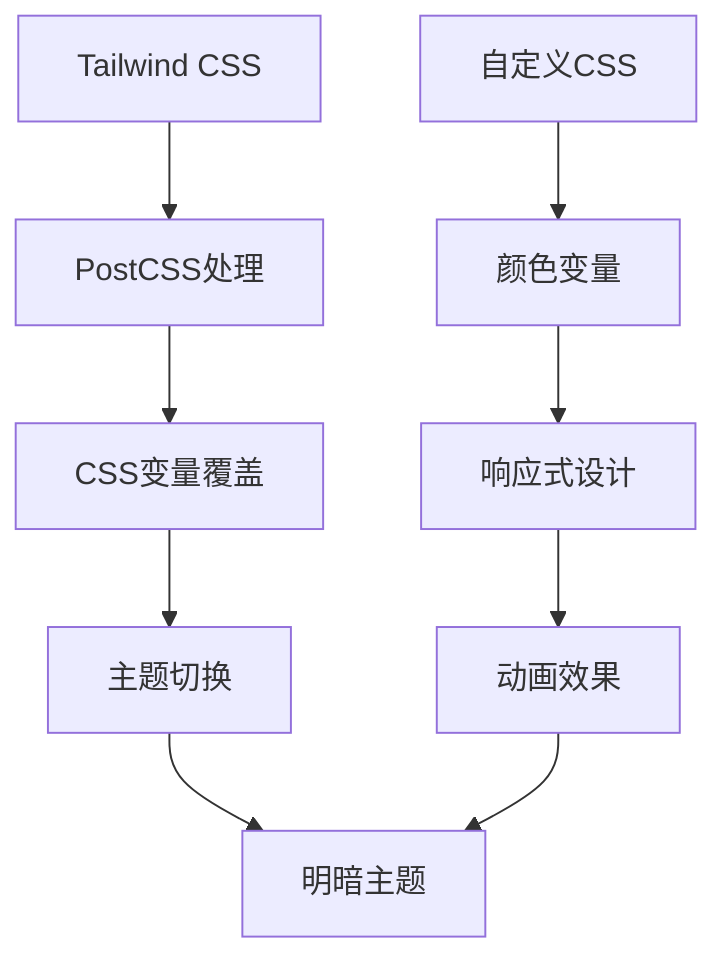

**图表来源**
- [postcss.config.js:1-6](file://OpenClaw-bot-review-main/postcss.config.js#L1-L6)
- [app/globals.css:1-137](file://OpenClaw-bot-review-main/app/globals.css#L1-L137)

### TypeScript配置分析

项目采用严格模式的TypeScript配置：

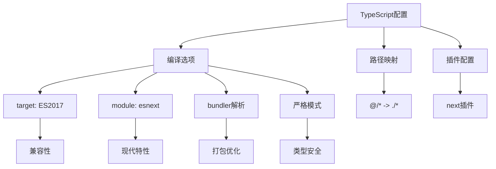

**图表来源**
- [tsconfig.json:2-42](file://OpenClaw-bot-review-main/tsconfig.json#L2-L42)

**章节来源**
- [app/globals.css:1-137](file://OpenClaw-bot-review-main/app/globals.css#L1-L137)
- [tsconfig.json:1-42](file://OpenClaw-bot-review-main/tsconfig.json#L1-L42)

## 性能考虑

### 代码分割策略

应用采用以下代码分割策略：

1. **路由级分割**: 每个页面组件独立打包
2. **组件级分割**: 大型组件按需加载
3. **懒加载**: 图标和特殊功能组件延迟加载

### 缓存优化

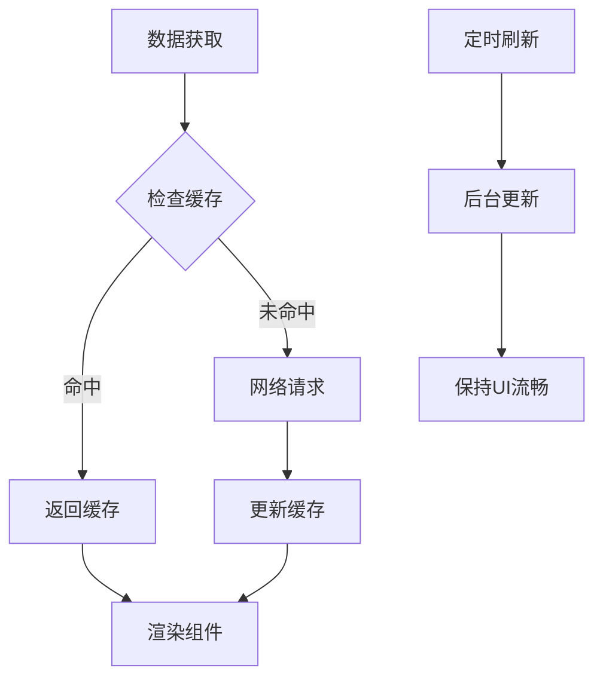

**图表来源**
- [app/page.tsx:111-117](file://OpenClaw-bot-review-main/app/page.tsx#L111-L117)

### 构建优化

- **Standalone输出**: 使用`next.config.mjs`配置生成独立可执行文件
- **Tree Shaking**: 通过ES模块导入实现无用代码剔除
- **压缩优化**: 生产环境自动启用代码压缩

**章节来源**
- [next.config.mjs:1-6](file://OpenClaw-bot-review-main/next.config.mjs#L1-L6)

## 故障排除指南

### 常见问题诊断

1. **主题切换失效**
   - 检查localStorage中`theme`键值
   - 验证CSS变量是否正确应用
   - 确认`data-theme`属性设置

2. **国际化文本不显示**
   - 验证翻译键是否存在
   - 检查当前locale设置
   - 确认翻译文件完整性

3. **实时数据不更新**
   - 检查定时器是否正常工作
   - 验证API接口可用性
   - 确认缓存策略配置

**章节来源**
- [lib/theme.tsx:20-45](file://OpenClaw-bot-review-main/lib/theme.tsx#L20-L45)
- [lib/i18n.tsx:1-800](file://OpenClaw-bot-review-main/lib/i18n.tsx#L1-L800)

## 结论

该Next.js应用展现了现代化前端架构的最佳实践：

1. **清晰的架构层次**: 从布局到组件的分层设计
2. **完善的工具链**: TypeScript + Tailwind CSS + PostCSS
3. **优秀的用户体验**: 主题切换、国际化、响应式设计
4. **高效的性能优化**: 缓存策略、代码分割、构建优化

建议在后续开发中重点关注：
- 组件单元测试覆盖率
- 错误边界和降级处理
- 性能监控和分析
- SEO优化和可访问性改进

## 附录

### 开发环境配置

- **Node.js版本**: ^18.0.0
- **Next.js版本**: ^16.0.0
- **React版本**: ^19.0.0
- **TypeScript版本**: ^5.0.0

### 构建命令

```bash
# 开发模式
npm run dev

# 生产构建
npm run build

# 生产启动
npm run start
```