# Next.js应用架构

<cite>
**本文档引用的文件**
- [package.json](file://frontend/package.json)
- [next.config.ts](file://frontend/next.config.ts)
- [tsconfig.json](file://frontend/tsconfig.json)
- [postcss.config.js](file://frontend/postcss.config.js)
- [app/layout.tsx](file://frontend/app/layout.tsx)
- [app/globals.css](file://frontend/app/globals.css)
- [app/(shell)/layout.tsx](file://frontend/app/(shell)/layout.tsx)
- [app/(shell)/context.tsx](file://frontend/app/(shell)/context.tsx)
- [app/(shell)/page.tsx](file://frontend/app/(shell)/page.tsx)
- [types/index.ts](file://frontend/types/index.ts)
- [lib/api.ts](file://frontend/lib/api.ts)
- [components/TaskStatusBanner.tsx](file://frontend/components/TaskStatusBanner.tsx)
</cite>

## 更新摘要
**所做更改**
- 新增Shell布局架构分析，涵盖三栏式SaaS控制台设计
- 新增设计系统和CSS变量体系详解
- 新增上下文管理和状态共享机制
- 新增API客户端和类型安全架构
- 更新架构概览以反映SaaS控制面板特征
- 新增组件层次结构和数据流分析

## 目录
1. [简介](#简介)
2. [项目结构](#项目结构)
3. [核心组件](#核心组件)
4. [架构概览](#架构概览)
5. [详细组件分析](#详细组件分析)
6. [设计系统与样式架构](#设计系统与样式架构)
7. [上下文管理与状态共享](#上下文管理与状态共享)
8. [API架构与类型安全](#api架构与类型安全)
9. [性能考虑](#性能考虑)
10. [故障排除指南](#故障排除指南)
11. [结论](#结论)
12. [附录](#附录)

## 简介

这是一个基于Next.js 16.2.1的成熟SaaS控制面板应用，采用先进的App Router架构设计。该应用为多智能体内容生产平台，提供微信公众号内容创作和管理的完整解决方案。应用采用三栏式布局架构，包含Shell布局、设计系统和上下文管理等企业级特性。

## 项目结构

该项目采用Next.js官方推荐的App Router目录结构，并扩展为SaaS控制面板架构：

```mermaid
graph TB
subgraph "应用根目录"
A[app/] --> B[Shell布局层]
A --> C[页面组件层]
A --> D[API路由层]
A --> E[客户端组件层]
end
subgraph "Shell布局层"
F[(shell)/layout.tsx] --> G[TopBar]
F --> H[Sidebar]
F --> I[RightPanel]
F --> J[ShellContext]
end
subgraph "页面组件层"
K[dashboard] --> L[运营总览]
K --> M[创作工作台]
K --> N[账号管理]
K --> O[草稿箱]
end
subgraph "核心目录"
P[lib/] --> Q[API客户端]
P --> R[工具库]
S[types/] --> T[类型定义]
U[components/] --> V[业务组件]
W[styles/] --> X[设计系统]
end
```

**图表来源**
- [app/(shell)/layout.tsx:1-574](file://frontend/app/(shell)/layout.tsx#L1-L574)
- [package.json:1-25](file://frontend/package.json#L1-L25)

**章节来源**
- [package.json:1-25](file://frontend/package.json#L1-L25)
- [next.config.ts:1-15](file://frontend/next.config.ts#L1-L15)

## 核心组件

### Shell布局架构

应用采用三栏式SaaS控制台架构，提供完整的运营控制面板：

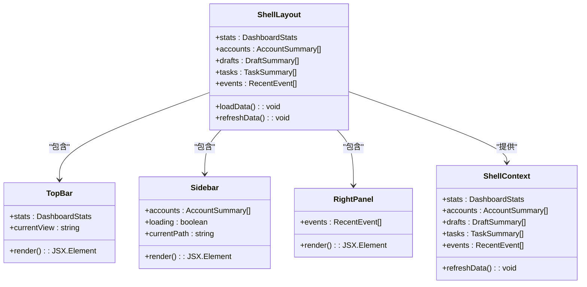

**图表来源**
- [app/(shell)/layout.tsx:426-574](file://frontend/app/(shell)/layout.tsx#L426-L574)
- [app/(shell)/context.tsx:30-51](file://frontend/app/(shell)/context.tsx#L30-L51)

### 设计系统架构

应用实现了完整的CSS变量驱动的设计系统：

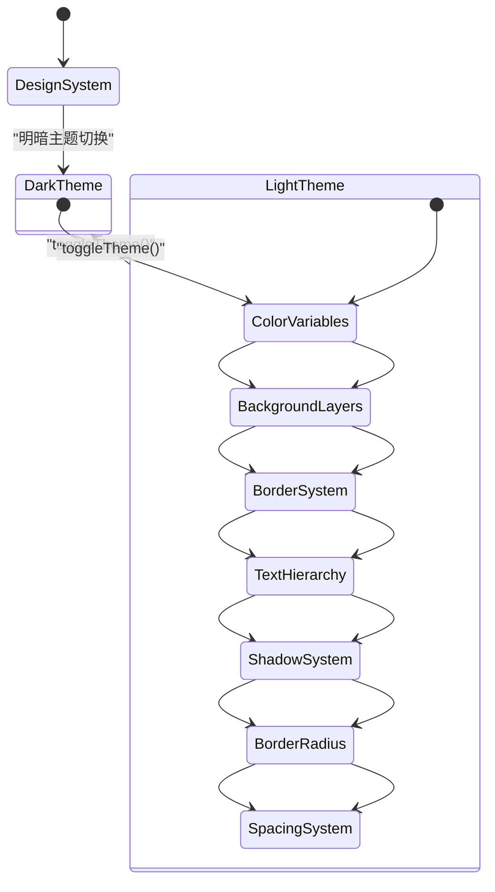

**图表来源**
- [app/globals.css:8-83](file://frontend/app/globals.css#L8-L83)

**章节来源**
- [app/(shell)/layout.tsx:1-574](file://frontend/app/(shell)/layout.tsx#L1-L574)
- [app/globals.css:1-984](file://frontend/app/globals.css#L1-L984)

## 架构概览

应用采用分层的SaaS控制面板架构，主要分为以下几个层次：

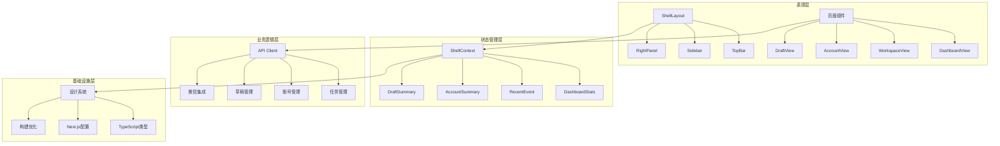

**图表来源**
- [app/(shell)/layout.tsx:426-574](file://frontend/app/(shell)/layout.tsx#L426-L574)
- [lib/api.ts:1-733](file://frontend/lib/api.ts#L1-L733)

## 详细组件分析

### Dashboard运营总览

Dashboard视图是SaaS控制面板的核心，提供全面的运营指标和快速操作入口：

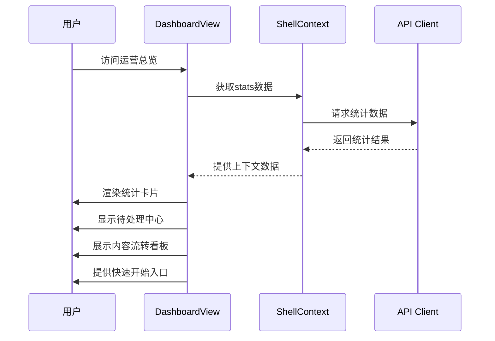

**图表来源**
- [app/(shell)/page.tsx:341-383](file://frontend/app/(shell)/page.tsx#L341-L383)

#### 数据流分析

Dashboard采用上下文驱动的数据管理模式：

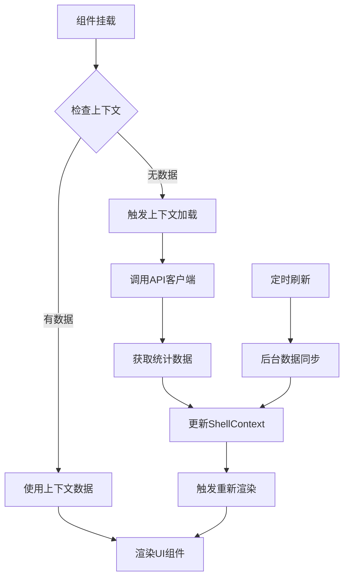

**图表来源**
- [app/(shell)/layout.tsx:455-540](file://frontend/app/(shell)/layout.tsx#L455-L540)
- [app/(shell)/page.tsx:97-114](file://frontend/app/(shell)/page.tsx#L97-L114)

**章节来源**
- [app/(shell)/page.tsx:1-383](file://frontend/app/(shell)/page.tsx#L1-L383)

### 任务状态横幅

TaskStatusBanner提供实时的任务执行状态反馈：

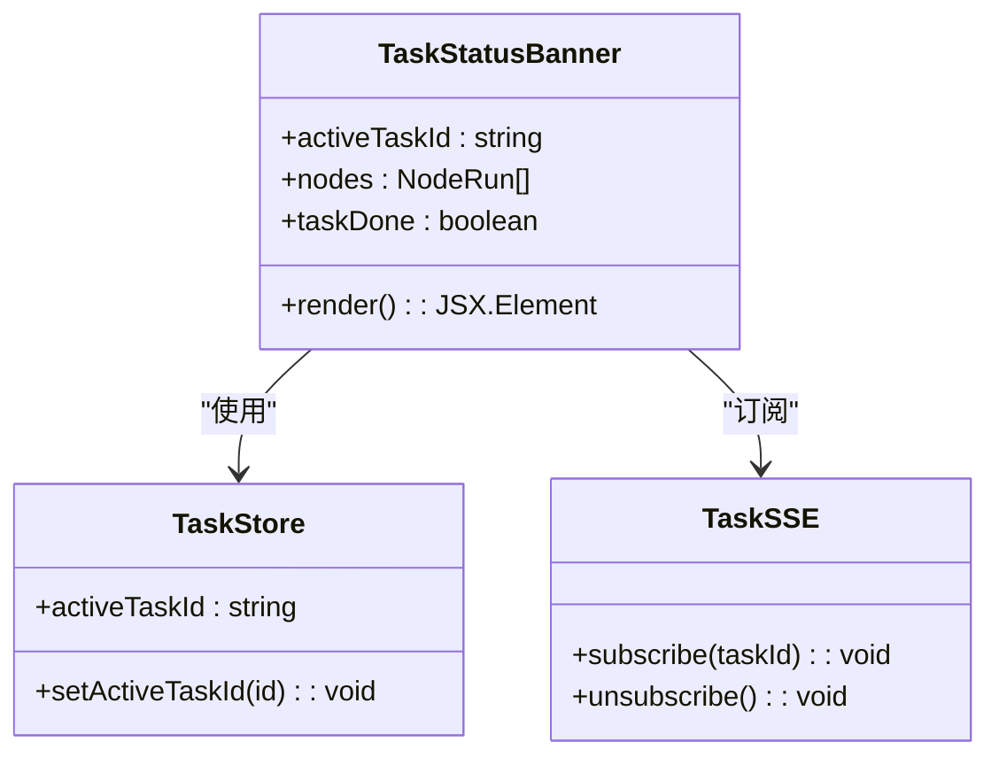

**图表来源**
- [components/TaskStatusBanner.tsx:7-116](file://frontend/components/TaskStatusBanner.tsx#L7-L116)

**章节来源**
- [components/TaskStatusBanner.tsx:1-116](file://frontend/components/TaskStatusBanner.tsx#L1-L116)

### 侧边栏导航系统

侧边栏实现SaaS控制面板的标准导航模式：

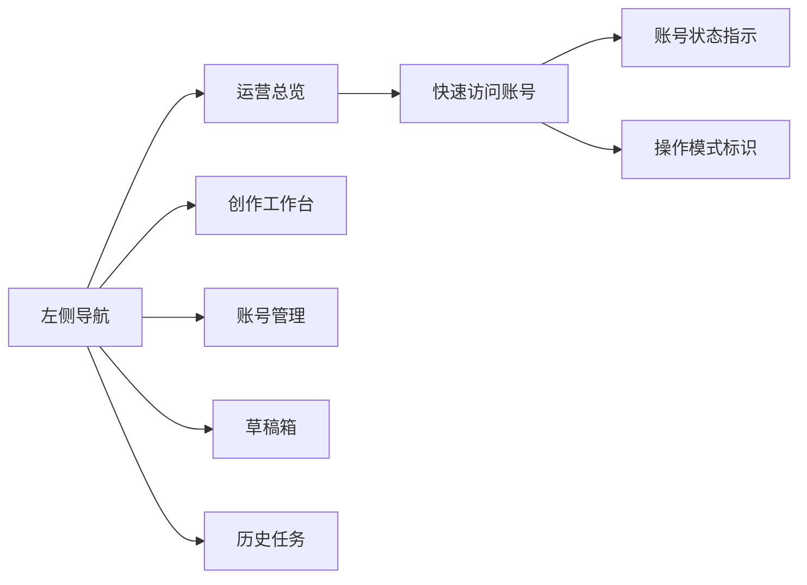

**图表来源**
- [app/(shell)/layout.tsx:144-295](file://frontend/app/(shell)/layout.tsx#L144-L295)

**章节来源**
- [app/(shell)/layout.tsx:1-574](file://frontend/app/(shell)/layout.tsx#L1-L574)

## 设计系统与样式架构

### CSS变量设计系统

应用采用CSS变量驱动的设计系统，提供完整的主题和样式规范：

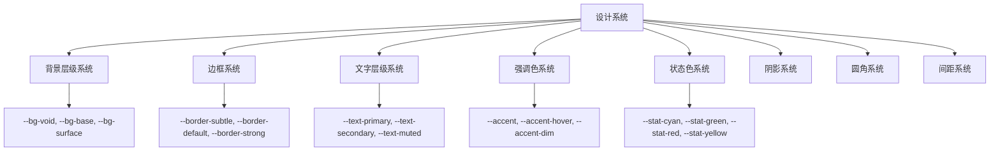

**图表来源**
- [app/globals.css:8-83](file://frontend/app/globals.css#L8-L83)

### 动画和过渡系统

应用实现了丰富的动画效果系统：

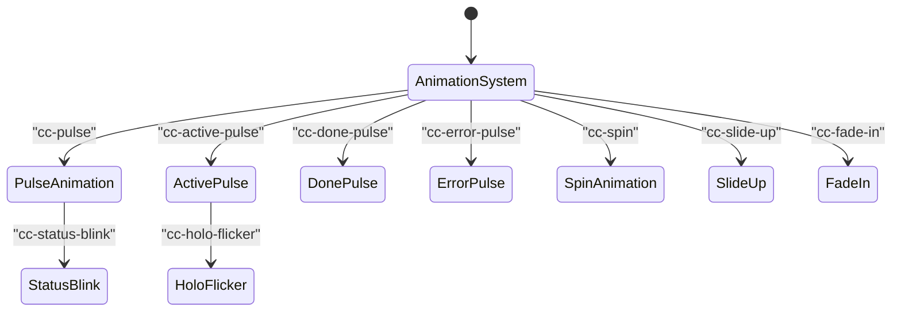

**图表来源**
- [app/globals.css:167-247](file://frontend/app/globals.css#L167-L247)

**章节来源**
- [app/globals.css:1-984](file://frontend/app/globals.css#L1-L984)

## 上下文管理与状态共享

### ShellContext上下文架构

应用采用React Context实现跨组件的状态共享：

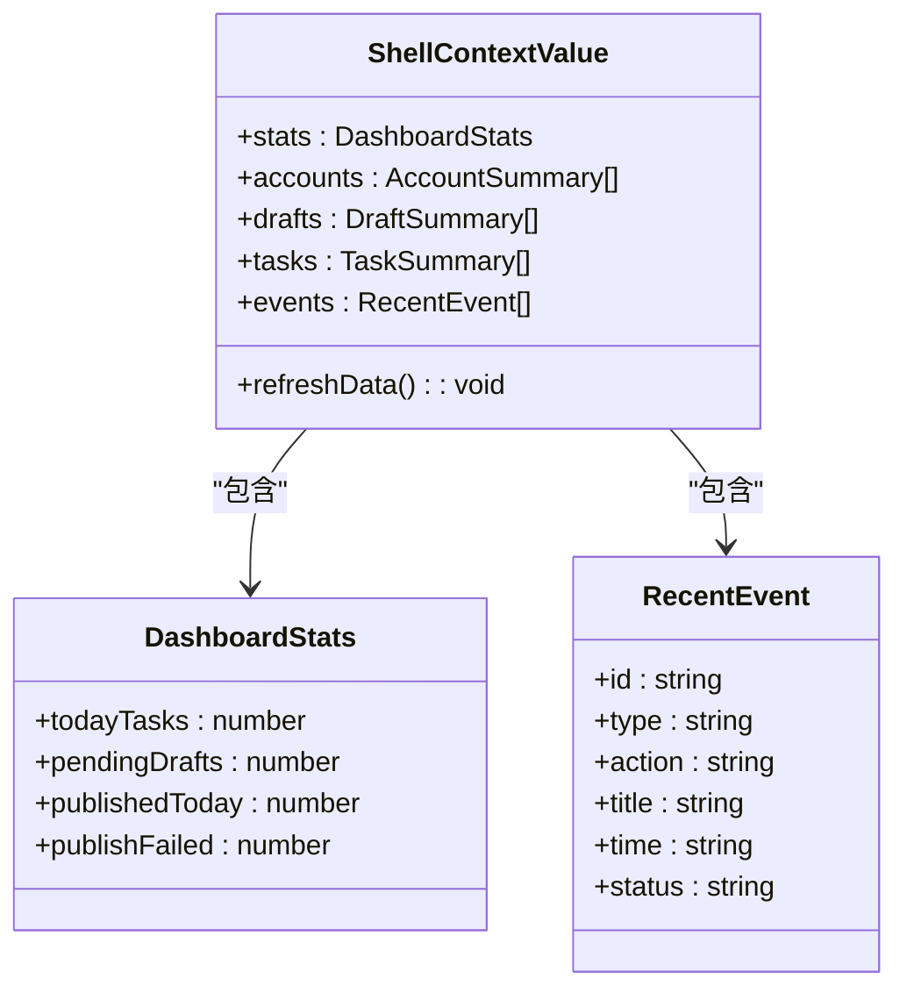

**图表来源**
- [app/(shell)/context.tsx:13-37](file://frontend/app/(shell)/context.tsx#L13-L37)

### 状态管理模式

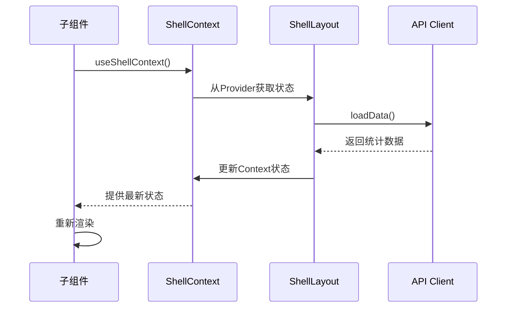

**图表来源**
- [app/(shell)/context.tsx:45-51](file://frontend/app/(shell)/context.tsx#L45-L51)
- [app/(shell)/layout.tsx:542-549](file://frontend/app/(shell)/layout.tsx#L542-L549)

**章节来源**
- [app/(shell)/context.tsx:1-52](file://frontend/app/(shell)/context.tsx#L1-L52)

## API架构与类型安全

### API客户端架构

应用采用统一的API客户端封装，提供类型安全的后端通信：

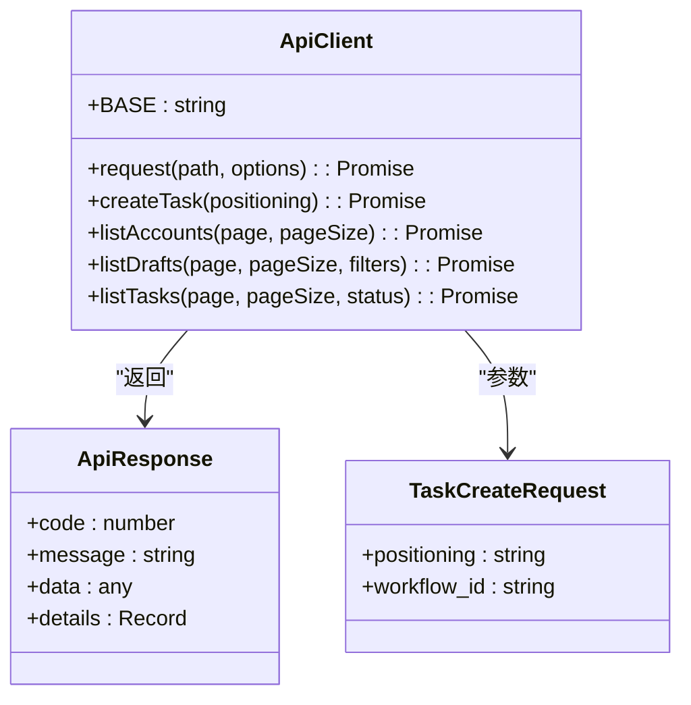

**图表来源**
- [lib/api.ts:65-85](file://frontend/lib/api.ts#L65-L85)
- [lib/api.ts:19-44](file://frontend/lib/api.ts#L19-L44)

### 类型安全架构

应用采用严格的TypeScript类型定义确保代码质量：

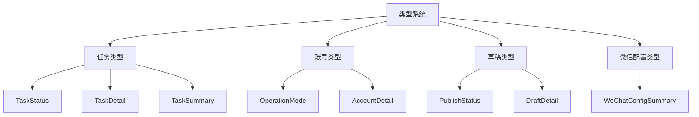

**图表来源**
- [types/index.ts:5-141](file://frontend/types/index.ts#L5-L141)
- [types/index.ts:198-281](file://frontend/types/index.ts#L198-L281)

**章节来源**
- [lib/api.ts:1-733](file://frontend/lib/api.ts#L1-L733)
- [types/index.ts:1-519](file://frontend/types/index.ts#L1-L519)

## 性能考虑

### 代码分割策略

应用采用多层次的代码分割优化：

1. **路由级分割**: 每个页面组件独立打包
2. **组件级分割**: 大型组件按需加载
3. **懒加载**: 图标和特殊功能组件延迟加载
4. **上下文分割**: ShellContext独立管理状态

### 缓存优化策略

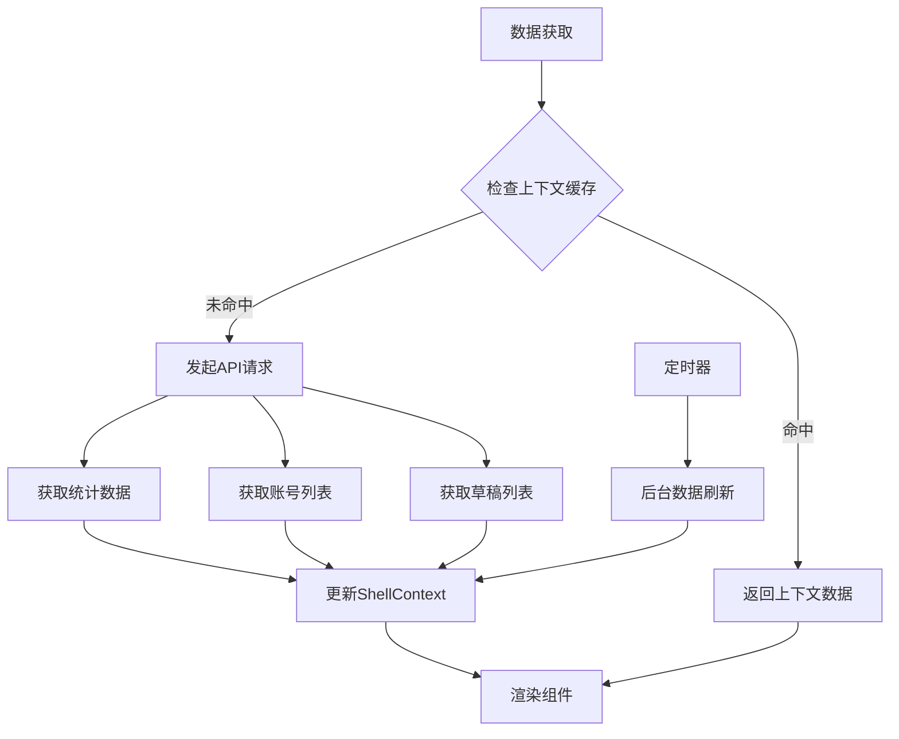

**图表来源**
- [app/(shell)/layout.tsx:455-540](file://frontend/app/(shell)/layout.tsx#L455-L540)

### 构建优化

- **Next.js优化**: 使用App Router和React Server Components
- **TypeScript编译**: 严格模式和增量编译
- **CSS优化**: Tailwind CSS和CSS变量优化
- **SSE优化**: 直连后端避免代理缓冲

**章节来源**
- [next.config.ts:1-15](file://frontend/next.config.ts#L1-L15)
- [tsconfig.json:1-42](file://frontend/tsconfig.json#L1-L42)

## 故障排除指南

### 常见问题诊断

1. **Shell布局不显示**
   - 检查ShellContext提供者配置
   - 验证上下文数据加载状态
   - 确认API客户端连接正常

2. **设计系统样式异常**
   - 检查CSS变量定义
   - 验证主题切换逻辑
   - 确认样式优先级

3. **API请求失败**
   - 验证Next.js代理配置
   - 检查BASE路径设置
   - 确认响应格式处理

4. **SSE连接问题**
   - 验证后端端口可达性
   - 检查CORS配置
   - 确认开发服务器代理设置

**章节来源**
- [app/(shell)/layout.tsx:528-533](file://frontend/app/(shell)/layout.tsx#L528-L533)
- [lib/api.ts:142-148](file://frontend/lib/api.ts#L142-L148)

## 结论

该Next.js SaaS控制面板展现了现代企业级应用的最佳实践：

1. **完整的架构分层**: 从Shell布局到业务组件的清晰分层
2. **强大的设计系统**: CSS变量驱动的可维护样式架构
3. **类型安全保证**: 严格的TypeScript类型定义
4. **上下文管理**: React Context实现的状态共享
5. **性能优化**: 多层次的代码分割和缓存策略
6. **实时通信**: SSE实现的高效数据流

建议在后续开发中重点关注：
- 组件单元测试覆盖率提升
- 错误边界和降级处理完善
- 性能监控和分析工具集成
- SEO优化和可访问性改进
- 安全性和权限控制强化

## 附录

### 开发环境配置

- **Node.js版本**: ^18.0.0
- **Next.js版本**: ^16.2.1
- **React版本**: ^19.2.4
- **TypeScript版本**: ^5.9.3
- **Tailwind CSS版本**: ^4.2.2

### 构建命令

```bash
# 开发模式
npm run dev

# 生产构建
npm run build

# 生产启动
npm run start

# 代码检查
npm run lint
```

### 关键配置说明

1. **Next.js配置**: 通过rewrites实现API代理
2. **TypeScript配置**: 严格模式和路径映射
3. **PostCSS配置**: Tailwind CSS集成
4. **设计系统**: CSS变量和动画系统
5. **API架构**: 统一请求封装和类型安全