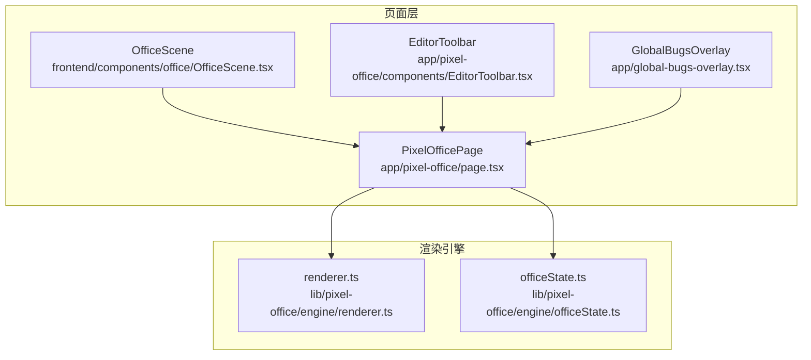
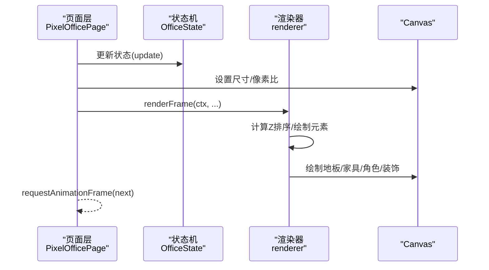
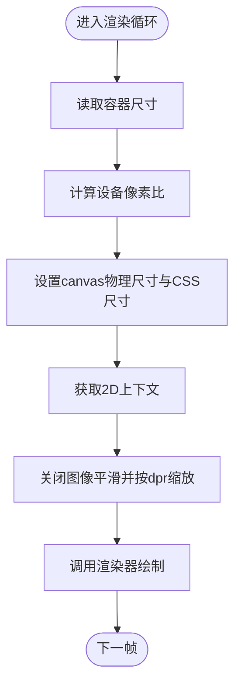
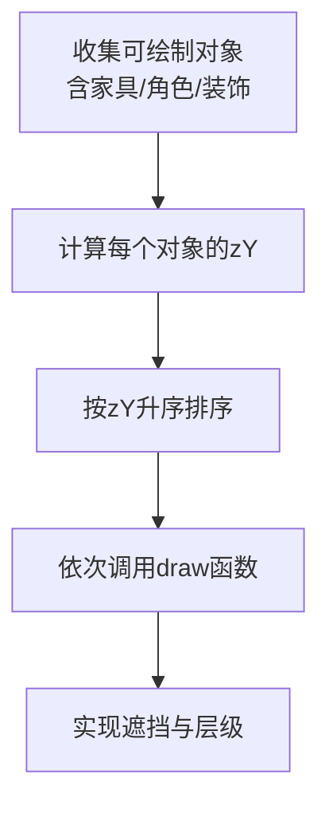
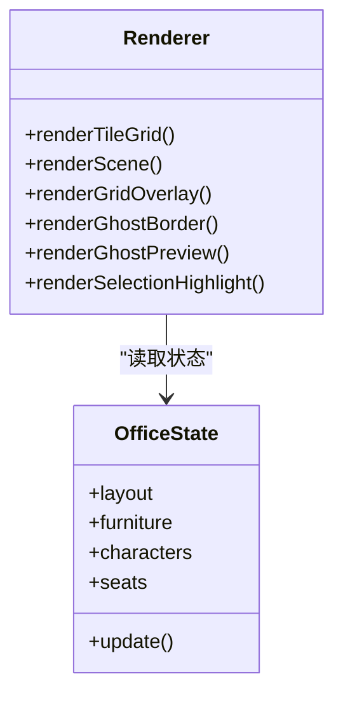
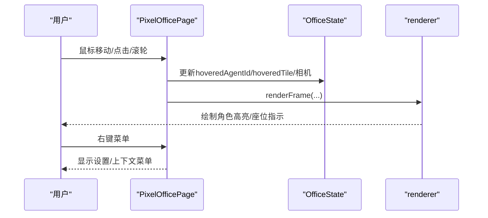
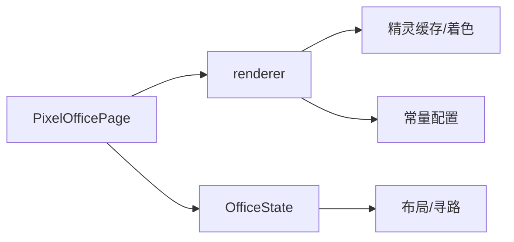

# Canvas渲染引擎

<cite>
**本文引用的文件**
- [frontend/components/office/OfficeScene.tsx](file://frontend/components/office/OfficeScene.tsx)
- [frontend/types/index.ts](file://frontend/types/index.ts)
- [OpenClaw-bot-review-main/app/pixel-office/page.tsx](file://OpenClaw-bot-review-main/app/pixel-office/page.tsx)
- [OpenClaw-bot-review-main/app/pixel-office/components/EditorToolbar.tsx](file://OpenClaw-bot-review-main/app/pixel-office/components/EditorToolbar.tsx)
- [OpenClaw-bot-review-main/app/global-bugs-overlay.tsx](file://OpenClaw-bot-review-main/app/global-bugs-overlay.tsx)
- [OpenClaw-bot-review-main/lib/pixel-office/engine/renderer.ts](file://OpenClaw-bot-review-main/lib/pixel-office/engine/renderer.ts)
- [OpenClaw-bot-review-main/lib/pixel-office/engine/officeState.ts](file://OpenClaw-bot-review-main/lib/pixel-office/engine/officeState.ts)
</cite>

## 目录
1. [引言](#引言)
2. [项目结构](#项目结构)
3. [核心组件](#核心组件)
4. [架构总览](#架构总览)
5. [详细组件分析](#详细组件分析)
6. [依赖关系分析](#依赖关系分析)
7. [性能考量](#性能考量)
8. [故障排查指南](#故障排查指南)
9. [结论](#结论)
10. [附录](#附录)

## 引言
本技术文档围绕基于Canvas 2D的像素风格渲染引擎展开，系统梳理从画布初始化、渲染上下文配置到像素级绘制的全流程；深入解析Z-sort层级排序算法（含对象深度计算、渲染顺序控制与遮挡处理）；阐述像素缩放、色彩管理与抗锯齿策略；总结脏区域更新、批量绘制与内存管理等性能优化手段；并覆盖事件处理机制（点击检测、鼠标悬停与交互反馈）。文档面向前端开发者，提供可操作的实现指导与最佳实践。

## 项目结构
该渲染引擎主要分布在以下模块：
- 页面层：负责容器尺寸适配、设备像素比处理、渲染循环与事件绑定
- 渲染器：负责场景分层绘制、Z排序、像素缩放与特效
- 状态机：维护布局、角色、家具、座位等运行时状态
- 工具与资源：精灵缓存、地板/墙体着色、贡献热力图、照片墙等

**图表来源**
- [OpenClaw-bot-review-main/app/pixel-office/page.tsx:213-696](file://OpenClaw-bot-review-main/app/pixel-office/page.tsx#L213-L696)
- [OpenClaw-bot-review-main/lib/pixel-office/engine/renderer.ts:1-1085](file://OpenClaw-bot-review-main/lib/pixel-office/engine/renderer.ts#L1-L1085)
- [OpenClaw-bot-review-main/lib/pixel-office/engine/officeState.ts:389-800](file://OpenClaw-bot-review-main/lib/pixel-office/engine/officeState.ts#L389-L800)

**章节来源**
- [OpenClaw-bot-review-main/app/pixel-office/page.tsx:213-696](file://OpenClaw-bot-review-main/app/pixel-office/page.tsx#L213-L696)
- [OpenClaw-bot-review-main/lib/pixel-office/engine/renderer.ts:1-1085](file://OpenClaw-bot-review-main/lib/pixel-office/engine/renderer.ts#L1-L1085)
- [OpenClaw-bot-review-main/lib/pixel-office/engine/officeState.ts:389-800](file://OpenClaw-bot-review-main/lib/pixel-office/engine/officeState.ts#L389-L800)

## 核心组件
- 画布初始化与渲染循环
  - 计算容器尺寸与设备像素比，设置canvas宽高与CSS尺寸
  - 使用requestAnimationFrame驱动每帧渲染
  - 在渲染前更新OfficeState，随后调用renderFrame进行绘制
- 渲染上下文配置
  - 设置imageSmoothingEnabled为false以启用像素风格
  - 使用scale(dpr, dpr)避免模糊
- 场景绘制管线
  - 渲染地板网格、墙体、家具、角色与装饰物
  - 通过Z排序确保遮挡关系正确
  - 支持编辑模式下的网格、幽灵预览与选择框
- 事件处理
  - 鼠标移动、点击、滚轮用于相机平移/缩放与拾取
  - 角色悬停与选择高亮
  - 右键菜单与设置抽屉

**章节来源**
- [OpenClaw-bot-review-main/app/pixel-office/page.tsx:505-696](file://OpenClaw-bot-review-main/app/pixel-office/page.tsx#L505-L696)
- [OpenClaw-bot-review-main/lib/pixel-office/engine/renderer.ts:221-591](file://OpenClaw-bot-review-main/lib/pixel-office/engine/renderer.ts#L221-L591)

## 架构总览
渲染引擎采用“状态机 + 渲染器”的分层设计：
- 状态机（OfficeState）维护布局、角色、家具、座位、系统状态等
- 渲染器（renderer）根据状态输出像素级画面
- 页面层（PixelOfficePage）协调输入、相机、UI与渲染器

**图表来源**
- [OpenClaw-bot-review-main/app/pixel-office/page.tsx:505-696](file://OpenClaw-bot-review-main/app/pixel-office/page.tsx#L505-L696)
- [OpenClaw-bot-review-main/lib/pixel-office/engine/renderer.ts:221-591](file://OpenClaw-bot-review-main/lib/pixel-office/engine/renderer.ts#L221-L591)
- [OpenClaw-bot-review-main/lib/pixel-office/engine/officeState.ts:389-800](file://OpenClaw-bot-review-main/lib/pixel-office/engine/officeState.ts#L389-L800)

## 详细组件分析

### 画布初始化与渲染上下文配置
- 尺寸与像素比
  - 读取容器clientWidth/clientHeight
  - 根据devicePixelRatio设置canvas物理像素宽高，同时保持CSS宽高一致
- 上下文配置
  - 关闭图像平滑（像素风格）
  - 使用scale(dpr, dpr)使绘制坐标与像素对齐
- 移动端自适应
  - 动态计算适合视口的缩放与平移，保证全场景可见

**图表来源**
- [OpenClaw-bot-review-main/app/pixel-office/page.tsx:518-571](file://OpenClaw-bot-review-main/app/pixel-office/page.tsx#L518-L571)

**章节来源**
- [OpenClaw-bot-review-main/app/pixel-office/page.tsx:518-571](file://OpenClaw-bot-review-main/app/pixel-office/page.tsx#L518-L571)

### Z-sort层级排序算法
- 深度计算
  - 家具与装饰物：使用zY作为排序键
  - 角色：按底部中心点所在行+偏移量计算zY，确保同排家具遮挡关系正确
  - 轮廓与标签：通过微调zY实现“轮廓在角色之下、标签在角色之上”
- 排序与绘制
  - 将所有可绘制对象收集到数组后按zY升序排序
  - 依次调用draw函数完成绘制，实现正确的遮挡关系
- 特殊处理
  - 矩阵特效：跳过常规轮廓，直接进行逐像素特效绘制
  - 子代理笔记本：根据朝向与坐姿动态计算zY，确保与角色对齐

**图表来源**
- [OpenClaw-bot-review-main/lib/pixel-office/engine/renderer.ts:216-591](file://OpenClaw-bot-review-main/lib/pixel-office/engine/renderer.ts#L216-L591)

**章节来源**
- [OpenClaw-bot-review-main/lib/pixel-office/engine/renderer.ts:216-591](file://OpenClaw-bot-review-main/lib/pixel-office/engine/renderer.ts#L216-L591)

### 像素风格视觉效果
- 像素缩放
  - 所有绘制均按zoom倍数缩放，确保在不同DPR下保持清晰
  - 字体与图标通过Canvas文本/图像接口缩放，避免插值
- 色彩管理
  - 地板/墙体支持色调、饱和度、亮度与色差参数化着色
  - 角色与家具通过精灵缓存与轮廓缓存实现统一风格
- 抗锯齿策略
  - 明确关闭imageSmoothingEnabled，配合整数像素对齐避免模糊
  - 线条与矩形绘制时使用0.5像素对齐，提升锐利度

**章节来源**
- [OpenClaw-bot-review-main/lib/pixel-office/engine/renderer.ts:137-214](file://OpenClaw-bot-review-main/lib/pixel-office/engine/renderer.ts#L137-L214)
- [OpenClaw-bot-review-main/app/pixel-office/components/EditorToolbar.tsx:50-82](file://OpenClaw-bot-review-main/app/pixel-office/components/EditorToolbar.tsx#L50-L82)

### 场景绘制与特效
- 地板网格
  - 支持纯色填充与带纹理的地板，网格线模拟瓷砖接缝
- 墙体与装饰
  - 墙体按颜色参数绘制；顶部装饰（贡献热力图、照片墙）使用zY确保在角色之上
- 家具与角色
  - 家具按旋转角度与emoji渲染；角色按状态与朝向绘制，支持矩阵特效、轮廓高亮与标签气泡
- 编辑模式覆盖
  - 网格线、幽灵边界、选择框与删除按钮等

**图表来源**
- [OpenClaw-bot-review-main/lib/pixel-office/engine/renderer.ts:137-800](file://OpenClaw-bot-review-main/lib/pixel-office/engine/renderer.ts#L137-L800)
- [OpenClaw-bot-review-main/lib/pixel-office/engine/officeState.ts:389-800](file://OpenClaw-bot-review-main/lib/pixel-office/engine/officeState.ts#L389-L800)

**章节来源**
- [OpenClaw-bot-review-main/lib/pixel-office/engine/renderer.ts:137-800](file://OpenClaw-bot-review-main/lib/pixel-office/engine/renderer.ts#L137-L800)
- [OpenClaw-bot-review-main/lib/pixel-office/engine/officeState.ts:389-800](file://OpenClaw-bot-review-main/lib/pixel-office/engine/officeState.ts#L389-L800)

### 事件处理机制
- 输入捕获
  - 鼠标移动：计算世界坐标与瓦片坐标，更新hoveredAgentId与hoveredTile
  - 鼠标点击：触发角色选择或编辑工具
  - 滚轮/拖拽：调整相机缩放与平移
- 交互反馈
  - 角色悬停与选择：显示轮廓高亮与标签
  - 座位指示：在目标座位显示可用/占用状态
  - 右键菜单：弹出设置抽屉或上下文菜单
- DOM叠加层
  - 浮空评论与代码片段通过DOM层实现，避免被Canvas裁剪

**图表来源**
- [OpenClaw-bot-review-main/app/pixel-office/page.tsx:115-133](file://OpenClaw-bot-review-main/app/pixel-office/page.tsx#L115-L133)
- [OpenClaw-bot-review-main/app/pixel-office/page.tsx:213-281](file://OpenClaw-bot-review-main/app/pixel-office/page.tsx#L213-L281)

**章节来源**
- [OpenClaw-bot-review-main/app/pixel-office/page.tsx:115-133](file://OpenClaw-bot-review-main/app/pixel-office/page.tsx#L115-L133)
- [OpenClaw-bot-review-main/app/pixel-office/page.tsx:213-281](file://OpenClaw-bot-review-main/app/pixel-office/page.tsx#L213-L281)

### 类型与状态模型
- 任务与节点状态
  - TaskStatus/NodeStatus定义任务生命周期
- 角色与座位
  - AgentCharacter描述角色外观与位置
  - Seat描述座位分配与朝向
- 渲染常量
  - 字符高度、Z偏移、轮廓透明度、网格颜色等

**章节来源**
- [frontend/types/index.ts:1-119](file://frontend/types/index.ts#L1-L119)
- [OpenClaw-bot-review-main/lib/pixel-office/engine/officeState.ts:389-800](file://OpenClaw-bot-review-main/lib/pixel-office/engine/officeState.ts#L389-L800)

## 依赖关系分析
- 页面层依赖渲染器与状态机，负责输入与UI协调
- 渲染器依赖精灵缓存、地板/墙体着色、常量配置
- 状态机依赖布局序列化、寻路与交互点计算

**图表来源**
- [OpenClaw-bot-review-main/app/pixel-office/page.tsx:213-696](file://OpenClaw-bot-review-main/app/pixel-office/page.tsx#L213-L696)
- [OpenClaw-bot-review-main/lib/pixel-office/engine/renderer.ts:1-1085](file://OpenClaw-bot-review-main/lib/pixel-office/engine/renderer.ts#L1-L1085)
- [OpenClaw-bot-review-main/lib/pixel-office/engine/officeState.ts:389-800](file://OpenClaw-bot-review-main/lib/pixel-office/engine/officeState.ts#L389-L800)

**章节来源**
- [OpenClaw-bot-review-main/app/pixel-office/page.tsx:213-696](file://OpenClaw-bot-review-main/app/pixel-office/page.tsx#L213-L696)
- [OpenClaw-bot-review-main/lib/pixel-office/engine/renderer.ts:1-1085](file://OpenClaw-bot-review-main/lib/pixel-office/engine/renderer.ts#L1-L1085)
- [OpenClaw-bot-review-main/lib/pixel-office/engine/officeState.ts:389-800](file://OpenClaw-bot-review-main/lib/pixel-office/engine/officeState.ts#L389-L800)

## 性能考量
- 脏区域更新
  - 仅在状态变化或相机参数变化时触发重绘
  - 编辑模式下仅绘制必要覆盖层，减少主场景重绘
- 批量绘制
  - 使用Z排序后一次性遍历绘制，避免重复测量与多次上下文切换
- 内存管理
  - 精灵缓存按zoom与参数化缓存，避免重复创建ImageData
  - 大量DOM叠加层（评论/代码片段）按帧更新位置，及时清理过期项
- 抗锯齿与缩放
  - 关闭平滑与整数像素对齐，降低采样误差与GPU负担
- 动态分辨率
  - 移动端按视口动态计算缩放，避免过度放大导致的冗余像素

[本节为通用性能建议，无需特定文件引用]

## 故障排查指南
- 画面模糊
  - 检查是否开启imageSmoothingEnabled或未按dpr缩放
- 角色/家具位置错位
  - 核对offsetX/offsetY与zoom的换算，确保整数像素对齐
- 编辑模式无效
  - 确认编辑状态与幽灵预览的条件分支，检查ghostCol/ghostRow更新逻辑
- 性能抖动
  - 检查帧间dt限制与渲染循环频率，避免频繁DOM操作

**章节来源**
- [OpenClaw-bot-review-main/app/pixel-office/page.tsx:518-571](file://OpenClaw-bot-review-main/app/pixel-office/page.tsx#L518-L571)
- [OpenClaw-bot-review-main/lib/pixel-office/engine/renderer.ts:678-743](file://OpenClaw-bot-review-main/lib/pixel-office/engine/renderer.ts#L678-L743)

## 结论
该Canvas渲染引擎通过明确的分层设计与严格的像素风格策略，在保证视觉一致性的同时实现了高效的交互与渲染。Z-sort算法确保了复杂的遮挡关系；编辑模式覆盖层提供了直观的创作体验；事件处理与DOM叠加层兼顾了Canvas性能与UI灵活性。遵循本文的实现要点与优化建议，可在多终端环境下稳定运行高质量的像素风格Canvas应用。

## 附录
- 相关类型与状态
  - 任务与节点状态、角色与座位定义
- 示例路径
  - 画布初始化与渲染循环：[OpenClaw-bot-review-main/app/pixel-office/page.tsx:505-696](file://OpenClaw-bot-review-main/app/pixel-office/page.tsx#L505-L696)
  - Z-sort与场景绘制：[OpenClaw-bot-review-main/lib/pixel-office/engine/renderer.ts:216-591](file://OpenClaw-bot-review-main/lib/pixel-office/engine/renderer.ts#L216-L591)
  - 状态机与布局重建：[OpenClaw-bot-review-main/lib/pixel-office/engine/officeState.ts:389-800](file://OpenClaw-bot-review-main/lib/pixel-office/engine/officeState.ts#L389-L800)