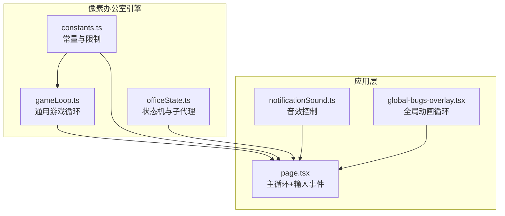
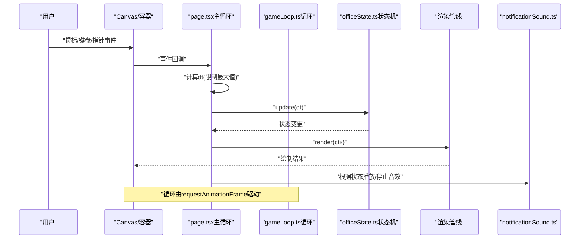
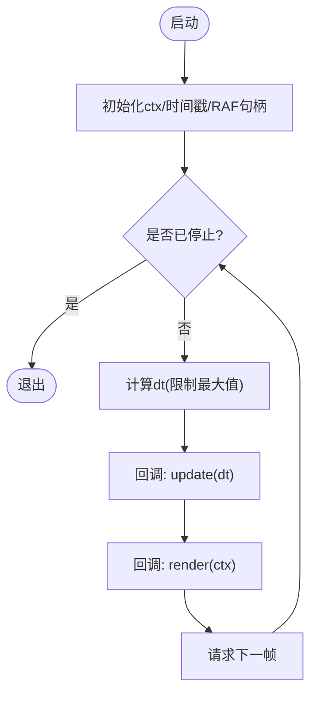
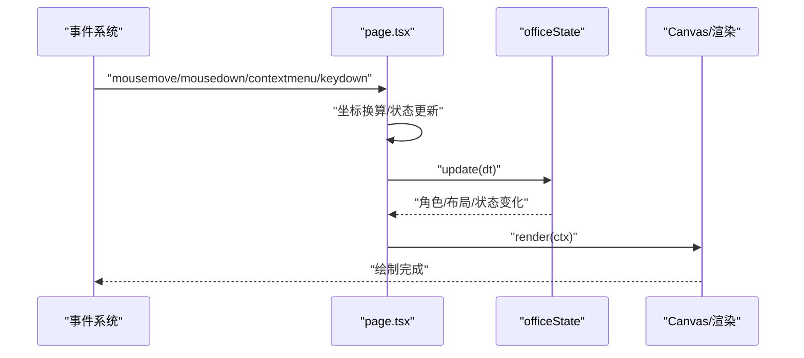
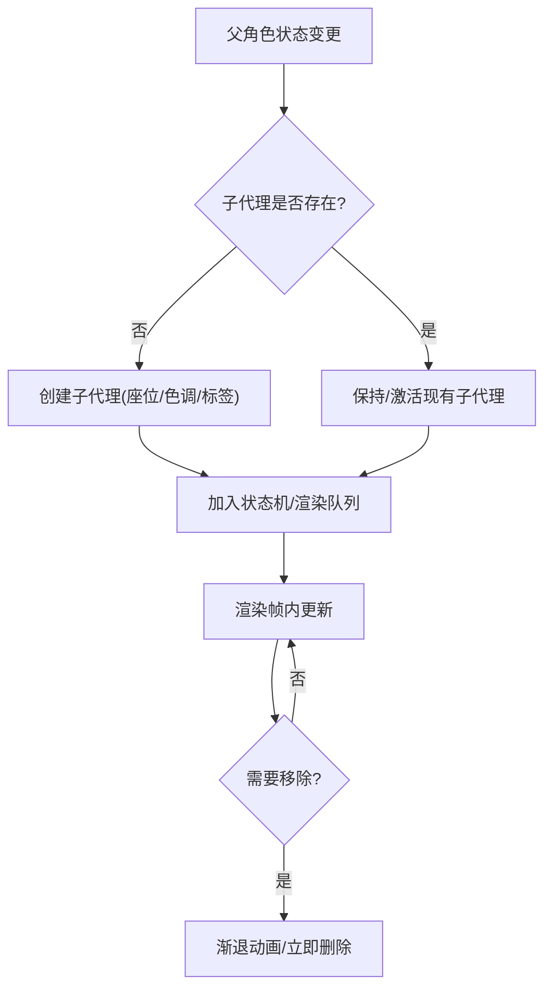
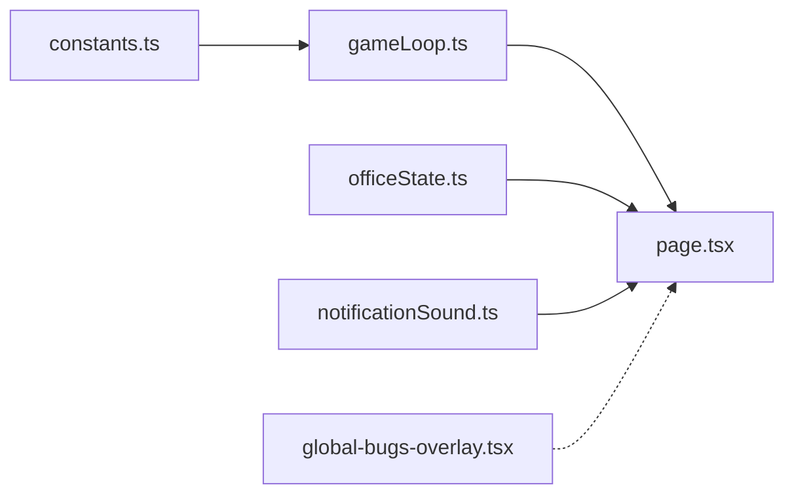

# GameLoop游戏循环

<cite>
**本文引用的文件**
- [gameLoop.ts](file://OpenClaw-bot-review-main/lib/pixel-office/engine/gameLoop.ts)
- [constants.ts](file://OpenClaw-bot-review-main/lib/pixel-office/constants.ts)
- [page.tsx](file://OpenClaw-bot-review-main/app/pixel-office/page.tsx)
- [notificationSound.ts](file://OpenClaw-bot-review-main/lib/pixel-office/notificationSound.ts)
- [officeState.ts](file://OpenClaw-bot-review-main/lib/pixel-office/engine/officeState.ts)
- [global-bugs-overlay.tsx](file://OpenClaw-bot-review-main/app/global-bugs-overlay.tsx)
</cite>

## 目录
1. [引言](#引言)
2. [项目结构](#项目结构)
3. [核心组件](#核心组件)
4. [架构总览](#架构总览)
5. [详细组件分析](#详细组件分析)
6. [依赖关系分析](#依赖关系分析)
7. [性能考量](#性能考量)
8. [故障排查指南](#故障排查指南)
9. [结论](#结论)
10. [附录](#附录)

## 引言
本技术文档围绕像素办公室场景中的GameLoop游戏循环系统展开，系统性阐述帧率控制、时间管理、循环调度、事件处理（输入捕获与分发）、渲染调度策略、生命周期管理以及性能优化手段。文档以实际源码为依据，结合架构图与流程图帮助开发者快速理解并高效实现与调优。

## 项目结构
本项目中与GameLoop直接相关的关键位置如下：
- 游戏循环核心：lib/pixel-office/engine/gameLoop.ts
- 循环参数常量：lib/pixel-office/constants.ts
- 场景主循环与输入事件：app/pixel-office/page.tsx
- 噪点音效播放控制：lib/pixel-office/notificationSound.ts
- 办公室状态机与子代理管理：lib/pixel-office/engine/officeState.ts
- 全局Bug系统循环：app/global-bugs-overlay.tsx

图表来源
- [gameLoop.ts:1-39](file://OpenClaw-bot-review-main/lib/pixel-office/engine/gameLoop.ts#L1-L39)
- [constants.ts:103-103](file://OpenClaw-bot-review-main/lib/pixel-office/constants.ts#L103-L103)
- [page.tsx:505-704](file://OpenClaw-bot-review-main/app/pixel-office/page.tsx#L505-L704)
- [notificationSound.ts:132-163](file://OpenClaw-bot-review-main/lib/pixel-office/notificationSound.ts#L132-L163)
- [officeState.ts:1326-1359](file://OpenClaw-bot-review-main/lib/pixel-office/engine/officeState.ts#L1326-L1359)
- [global-bugs-overlay.tsx:115-137](file://OpenClaw-bot-review-main/app/global-bugs-overlay.tsx#L115-L137)

章节来源
- [gameLoop.ts:1-39](file://OpenClaw-bot-review-main/lib/pixel-office/engine/gameLoop.ts#L1-L39)
- [constants.ts:103-103](file://OpenClaw-bot-review-main/lib/pixel-office/constants.ts#L103-L103)
- [page.tsx:505-704](file://OpenClaw-bot-review-main/app/pixel-office/page.tsx#L505-L704)

## 核心组件
- 通用游戏循环：封装requestAnimationFrame驱动的更新/渲染回调，内置最大帧间隔保护，支持停止。
- 主循环与输入：基于React组件的主循环，负责计算dt、更新相机/编辑器状态、触发渲染，并统一处理鼠标/键盘/指针事件。
- 帧率与时间：通过MAX_DELTA_TIME_SEC与每帧dt上限，避免长时间未刷新导致的“时间跳跃”。
- 渲染调度：按帧顺序执行update与render，配合Canvas缩放与设备像素比，确保清晰度与性能平衡。
- 生命周期：返回的取消函数用于停止循环，释放RAF资源；页面卸载时统一清理。

章节来源
- [gameLoop.ts:8-38](file://OpenClaw-bot-review-main/lib/pixel-office/engine/gameLoop.ts#L8-L38)
- [constants.ts:103-103](file://OpenClaw-bot-review-main/lib/pixel-office/constants.ts#L103-L103)
- [page.tsx:505-704](file://OpenClaw-bot-review-main/app/pixel-office/page.tsx#L505-L704)

## 架构总览
下图展示从用户输入到渲染输出的完整路径，以及与音效、状态机、全局动画系统的交互。

图表来源
- [page.tsx:505-704](file://OpenClaw-bot-review-main/app/pixel-office/page.tsx#L505-L704)
- [gameLoop.ts:8-38](file://OpenClaw-bot-review-main/lib/pixel-office/engine/gameLoop.ts#L8-L38)
- [notificationSound.ts:132-163](file://OpenClaw-bot-review-main/lib/pixel-office/notificationSound.ts#L132-L163)
- [officeState.ts:1000-1199](file://OpenClaw-bot-review-main/lib/pixel-office/engine/officeState.ts#L1000-L1199)

## 详细组件分析

### 通用游戏循环（gameLoop.ts）
- 设计要点
  - 回调接口：update(dt)与render(ctx)，职责分离。
  - 时间步长：dt = min((time - lastTime)/1000, MAX_DELTA_TIME_SEC)，防止异常跳变。
  - 资源管理：返回停止函数，调用后取消RAF并标记停止。
  - 图像质量：关闭图像平滑，提升像素风格清晰度。
- 生命周期
  - 启动：首次请求下一帧。
  - 运行：每帧计算dt并依次调用update与render。
  - 停止：取消RAF并置停止标志，后续帧直接返回。

图表来源
- [gameLoop.ts:8-38](file://OpenClaw-bot-review-main/lib/pixel-office/engine/gameLoop.ts#L8-L38)
- [constants.ts:103-103](file://OpenClaw-bot-review-main/lib/pixel-office/constants.ts#L103-L103)

章节来源
- [gameLoop.ts:1-39](file://OpenClaw-bot-review-main/lib/pixel-office/engine/gameLoop.ts#L1-L39)
- [constants.ts:103-103](file://OpenClaw-bot-review-main/lib/pixel-office/constants.ts#L103-L103)

### 主循环与事件处理（page.tsx）
- 主循环
  - 使用requestAnimationFrame驱动的render函数，计算dt并限制最大值。
  - 计算画布尺寸与设备像素比，设置Canvas宽高与CSS尺寸。
  - 更新相机/编辑器状态，调用渲染函数绘制场景。
- 输入事件
  - 鼠标移动/按下/抬起：坐标换算、悬停检测、拖拽家具、右键寻路等。
  - 键盘事件：编辑模式下的快捷键处理。
  - 指针事件：移动端触摸兼容，统一委托到鼠标事件逻辑。
- 生命周期
  - 启动：effect中注册RAF。
  - 停止：effect返回的清理函数取消RAF。

图表来源
- [page.tsx:1004-1447](file://OpenClaw-bot-review-main/app/pixel-office/page.tsx#L1004-L1447)
- [page.tsx:505-704](file://OpenClaw-bot-review-main/app/pixel-office/page.tsx#L505-L704)

章节来源
- [page.tsx:505-704](file://OpenClaw-bot-review-main/app/pixel-office/page.tsx#L505-L704)
- [page.tsx:1004-1447](file://OpenClaw-bot-review-main/app/pixel-office/page.tsx#L1004-L1447)

### 渲染调度策略
- 渲染优先级
  - 通用循环：update优先于render，保证状态在渲染前稳定。
  - 主循环：先更新相机/编辑器状态，再进行渲染，最后生成浮动评论等DOM叠加层。
- 帧内任务分配
  - update：状态推进、碰撞检测、寻路、子代理管理。
  - render：绘制地图、家具、角色、气泡、浮动评论等。
- 性能监控
  - 在场景中可叠加FPS与时钟文本，便于运行时观察。
  - 通过限制dt最大值与合理布局绘制，降低卡顿风险。

章节来源
- [page.tsx:505-704](file://OpenClaw-bot-review-main/app/pixel-office/page.tsx#L505-L704)
- [officeState.ts:1000-1199](file://OpenClaw-bot-review-main/lib/pixel-office/engine/officeState.ts#L1000-L1199)

### 生命周期管理（启动/暂停/恢复/停止）
- 启动
  - 通用循环：首次调用requestAnimationFrame启动。
  - 主循环：effect中注册RAF。
- 暂停/恢复
  - 通用循环：通过停止函数取消RAF，再次调用启动函数恢复。
  - 主循环：effect依赖项变化或条件满足时可切换RAF注册。
- 停止
  - 通用循环：返回的停止函数取消RAF并置停止标志。
  - 主循环：effect返回清理函数取消RAF。
- 音效联动
  - 播放/停止背景音乐与音效，随页面状态同步。

章节来源
- [gameLoop.ts:34-38](file://OpenClaw-bot-review-main/lib/pixel-office/engine/gameLoop.ts#L34-L38)
- [page.tsx:505-704](file://OpenClaw-bot-review-main/app/pixel-office/page.tsx#L505-L704)
- [notificationSound.ts:132-163](file://OpenClaw-bot-review-main/lib/pixel-office/notificationSound.ts#L132-L163)

### 子代理生命周期与状态管理
- 子代理创建与移除
  - 创建：基于父角色与工具标识生成唯一键，查找空闲座位并创建子代理。
  - 移除：支持渐退动画与立即删除两种方式，清理座位占用与选中状态。
- 状态同步
  - 根据活动状态同步角色激活、工具、等待气泡等表现。

图表来源
- [officeState.ts:1190-1199](file://OpenClaw-bot-review-main/lib/pixel-office/engine/officeState.ts#L1190-L1199)
- [officeState.ts:1326-1359](file://OpenClaw-bot-review-main/lib/pixel-office/engine/officeState.ts#L1326-L1359)

章节来源
- [officeState.ts:1190-1199](file://OpenClaw-bot-review-main/lib/pixel-office/engine/officeState.ts#L1190-L1199)
- [officeState.ts:1326-1359](file://OpenClaw-bot-review-main/lib/pixel-office/engine/officeState.ts#L1326-L1359)

### 全局动画循环（全局Bug覆盖）
- 该模块同样采用RAF驱动的tick循环，用于维护全局动画系统状态与绘制。
- 与主循环并行存在，互不影响，但共享浏览器渲染线程。

章节来源
- [global-bugs-overlay.tsx:115-137](file://OpenClaw-bot-review-main/app/global-bugs-overlay.tsx#L115-L137)

## 依赖关系分析
- gameLoop.ts依赖constants.ts中的MAX_DELTA_TIME_SEC，确保循环dt上限一致。
- page.tsx同时依赖officeState.ts的状态推进与渲染函数，形成“输入—状态—渲染”的闭环。
- notificationSound.ts与page.tsx协同，根据场景状态播放/停止音效。
- global-bugs-overlay.tsx与page.tsx同属前端渲染域，分别维护各自独立的RAF循环。

图表来源
- [constants.ts:103-103](file://OpenClaw-bot-review-main/lib/pixel-office/constants.ts#L103-L103)
- [gameLoop.ts:1-39](file://OpenClaw-bot-review-main/lib/pixel-office/engine/gameLoop.ts#L1-L39)
- [page.tsx:505-704](file://OpenClaw-bot-review-main/app/pixel-office/page.tsx#L505-L704)
- [officeState.ts:1000-1199](file://OpenClaw-bot-review-main/lib/pixel-office/engine/officeState.ts#L1000-L1199)
- [notificationSound.ts:132-163](file://OpenClaw-bot-review-main/lib/pixel-office/notificationSound.ts#L132-L163)
- [global-bugs-overlay.tsx:115-137](file://OpenClaw-bot-review-main/app/global-bugs-overlay.tsx#L115-L137)

章节来源
- [constants.ts:103-103](file://OpenClaw-bot-review-main/lib/pixel-office/constants.ts#L103-L103)
- [gameLoop.ts:1-39](file://OpenClaw-bot-review-main/lib/pixel-office/engine/gameLoop.ts#L1-L39)
- [page.tsx:505-704](file://OpenClaw-bot-review-main/app/pixel-office/page.tsx#L505-L704)
- [officeState.ts:1000-1199](file://OpenClaw-bot-review-main/lib/pixel-office/engine/officeState.ts#L1000-L1199)
- [notificationSound.ts:132-163](file://OpenClaw-bot-review-main/lib/pixel-office/notificationSound.ts#L132-L163)
- [global-bugs-overlay.tsx:115-137](file://OpenClaw-bot-review-main/app/global-bugs-overlay.tsx#L115-L137)

## 性能考量
- 帧率自适应
  - 通过dt上限与固定缩放，避免极端时间差导致的抖动与过载。
  - 主循环中对移动端/桌面端的相机与平移进行适配，减少不必要的重绘。
- 任务批处理
  - 将状态推进与渲染分离，集中处理状态更新，再统一渲染，降低跨帧状态不一致风险。
- 资源管理
  - 循环停止时及时取消RAF，避免后台持续占用。
  - Canvas尺寸与设备像素比动态调整，兼顾清晰度与内存占用。
- 渲染优化
  - 关闭图像平滑，强化像素风格。
  - 浮动评论等DOM叠加层按需更新，降低DOM压力。

章节来源
- [gameLoop.ts:12-13](file://OpenClaw-bot-review-main/lib/pixel-office/engine/gameLoop.ts#L12-L13)
- [page.tsx:505-704](file://OpenClaw-bot-review-main/app/pixel-office/page.tsx#L505-L704)
- [constants.ts:103-103](file://OpenClaw-bot-review-main/lib/pixel-office/constants.ts#L103-L103)

## 故障排查指南
- 循环未停止
  - 确认已调用停止函数并取消RAF；检查effect清理逻辑是否正确执行。
- 帧率异常波动
  - 检查dt计算与MAX_DELTA_TIME_SEC是否被意外覆盖；确认渲染函数内无阻塞操作。
- 输入无响应
  - 核对事件绑定与坐标换算逻辑；移动端请确认指针事件已转接到鼠标事件。
- 音效不同步
  - 检查音效播放/停止与页面状态切换的时机；必要时增加防抖或重试逻辑。

章节来源
- [gameLoop.ts:34-38](file://OpenClaw-bot-review-main/lib/pixel-office/engine/gameLoop.ts#L34-L38)
- [page.tsx:1004-1447](file://OpenClaw-bot-review-main/app/pixel-office/page.tsx#L1004-L1447)
- [notificationSound.ts:132-163](file://OpenClaw-bot-review-main/lib/pixel-office/notificationSound.ts#L132-L163)

## 结论
本GameLoop系统以通用循环为核心，结合主循环与事件处理，实现了稳定的帧率控制、清晰的职责划分与良好的生命周期管理。通过常量约束、状态机与渲染管线的协同，系统在复杂场景中仍能保持流畅体验。建议在实际项目中遵循“状态推进优先、渲染次之”的原则，并配合性能监控与资源回收策略，持续优化用户体验。

## 附录
- 实现指导
  - 使用通用循环封装update/render，确保dt受控。
  - 主循环中集中处理输入与相机/编辑器状态，渲染阶段仅负责绘制。
  - 为每个独立动画系统（如全局Bug）单独维护RAF循环，避免耦合。
- 性能调优建议
  - 控制dt上限，避免长时未刷新导致的“时间跳跃”。
  - 合理安排渲染层级，减少重复绘制。
  - 对高频DOM叠加层采用节流/批量更新策略。