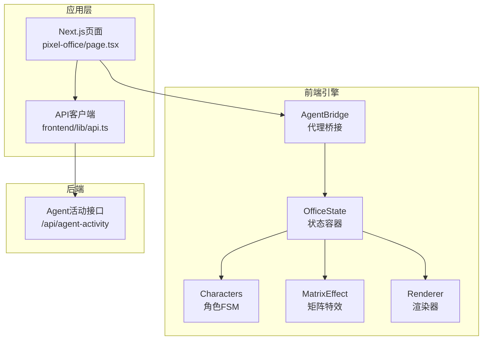
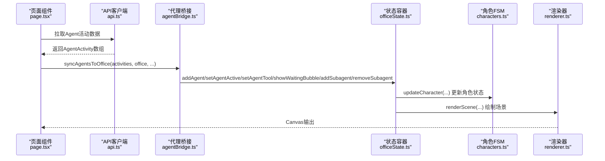
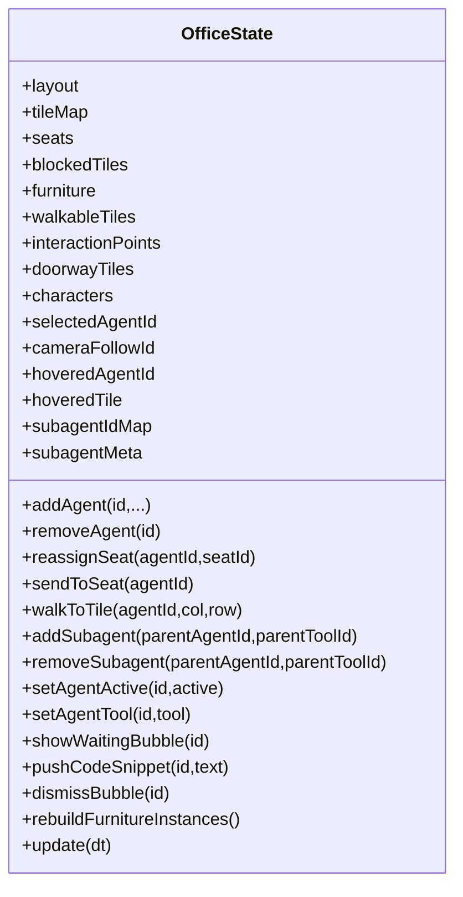
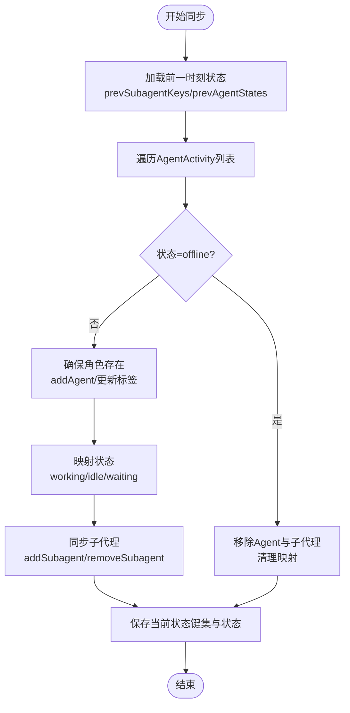
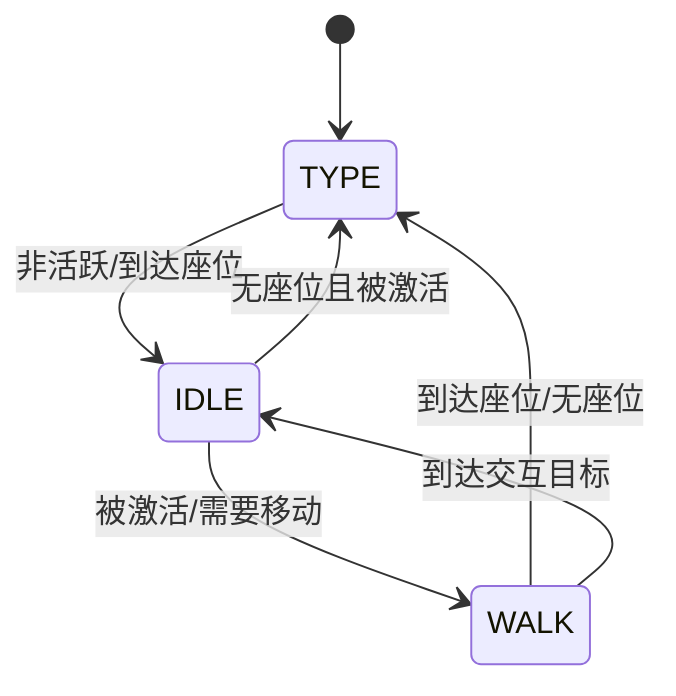
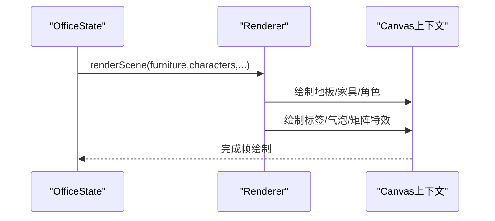
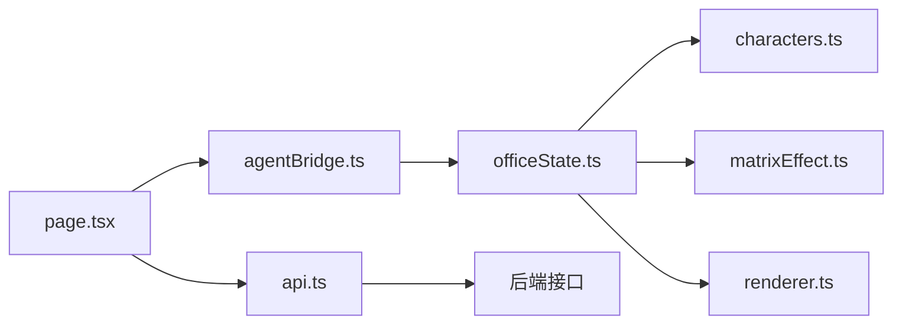

# OfficeState状态管理

<cite>
**本文档引用的文件**
- [officeState.ts](file://OpenClaw-bot-review-main/lib/pixel-office/engine/officeState.ts)
- [agentBridge.ts](file://OpenClaw-bot-review-main/lib/pixel-office/agentBridge.ts)
- [characters.ts](file://OpenClaw-bot-review-main/lib/pixel-office/engine/characters.ts)
- [renderer.ts](file://OpenClaw-bot-review-main/lib/pixel-office/engine/renderer.ts)
- [matrixEffect.ts](file://OpenClaw-bot-review-main/lib/pixel-office/engine/matrixEffect.ts)
- [page.tsx](file://OpenClaw-bot-review-main/app/pixel-office/page.tsx)
- [api.ts](file://frontend/lib/api.ts)
</cite>

## 目录
1. [简介](#简介)
2. [项目结构](#项目结构)
3. [核心组件](#核心组件)
4. [架构总览](#架构总览)
5. [详细组件分析](#详细组件分析)
6. [依赖关系分析](#依赖关系分析)
7. [性能考量](#性能考量)
8. [故障排查指南](#故障排查指南)
9. [结论](#结论)
10. [附录](#附录)

## 简介
本文件系统性阐述OfficeState状态管理系统的设计与实现，覆盖状态模型（Agent状态、工作台状态、场景状态）、状态更新机制（实时同步、变更通知、数据流）、持久化策略（本地缓存、恢复与错误处理）、查询与操作API（Agent选择、Hover状态管理、任务状态获取）、状态订阅模式（监听变化与触发UI更新）以及最佳实践与扩展指导。目标是帮助开发者快速理解并高效扩展该状态管理子系统。

## 项目结构
OfficeState位于像素办公场景的前端引擎层，负责维护角色、家具、布局、交互点等场景状态，并通过桥接模块与后端活动数据进行双向同步。渲染层基于Canvas对场景进行绘制，支持矩阵特效、标签气泡、座位指示等视觉反馈。

图表来源
- [officeState.ts:389-420](file://OpenClaw-bot-review-main/lib/pixel-office/engine/officeState.ts#L389-L420)
- [agentBridge.ts:28-33](file://OpenClaw-bot-review-main/lib/pixel-office/agentBridge.ts#L28-L33)
- [renderer.ts:221-233](file://OpenClaw-bot-review-main/lib/pixel-office/engine/renderer.ts#L221-L233)
- [page.tsx:399-430](file://OpenClaw-bot-review-main/app/pixel-office/page.tsx#L399-L430)
- [api.ts:1-25](file://frontend/lib/api.ts#L1-L25)

章节来源
- [officeState.ts:389-466](file://OpenClaw-bot-review-main/lib/pixel-office/engine/officeState.ts#L389-L466)
- [agentBridge.ts:28-33](file://OpenClaw-bot-review-main/lib/pixel-office/agentBridge.ts#L28-L33)
- [renderer.ts:221-233](file://OpenClaw-bot-review-main/lib/pixel-office/engine/renderer.ts#L221-L233)
- [page.tsx:399-430](file://OpenClaw-bot-review-main/app/pixel-office/page.tsx#L399-L430)
- [api.ts:1-25](file://frontend/lib/api.ts#L1-L25)

## 核心组件
- OfficeState：场景状态容器，维护布局、角色、家具、可行走区域、交互点、门_tile等；提供角色增删、激活/闲置、工具设置、气泡显示、子代理管理、网关SRE状态同步等能力。
- Characters：角色有限状态机（FSM），定义TYPE/WALK/IDLE状态及动画帧、移动速度、路径规划、互动目标、座位定时器等。
- AgentBridge：将后端AgentActivity数据映射到OfficeState，负责Agent与子代理的生命周期同步、状态转换、工具与标签设置。
- Renderer：Canvas渲染器，按Z序绘制地板、家具、角色、标签、气泡、矩阵特效等，并支持编辑模式下的网格与预览覆盖。
- MatrixEffect：矩阵风格的生成与渲染，用于角色的spawn/despawn视觉效果。

章节来源
- [officeState.ts:389-466](file://OpenClaw-bot-review-main/lib/pixel-office/engine/officeState.ts#L389-L466)
- [characters.ts:107-350](file://OpenClaw-bot-review-main/lib/pixel-office/engine/characters.ts#L107-L350)
- [agentBridge.ts:28-131](file://OpenClaw-bot-review-main/lib/pixel-office/agentBridge.ts#L28-L131)
- [renderer.ts:221-591](file://OpenClaw-bot-review-main/lib/pixel-office/engine/renderer.ts#L221-L591)
- [matrixEffect.ts:38-131](file://OpenClaw-bot-review-main/lib/pixel-office/engine/matrixEffect.ts#L38-L131)

## 架构总览
OfficeState采用“状态容器 + 角色FSM + 渲染器”的分层设计。AgentBridge作为外部输入适配器，将后端活动流转换为OfficeState内部状态变更，随后由Renderer进行可视化输出。页面层通过API客户端拉取后端数据，驱动桥接与状态更新。

图表来源
- [page.tsx:283-298](file://OpenClaw-bot-review-main/app/pixel-office/page.tsx#L283-L298)
- [api.ts:1-25](file://frontend/lib/api.ts#L1-L25)
- [agentBridge.ts:28-131](file://OpenClaw-bot-review-main/lib/pixel-office/agentBridge.ts#L28-L131)
- [officeState.ts:1391-1405](file://OpenClaw-bot-review-main/lib/pixel-office/engine/officeState.ts#L1391-L1405)
- [characters.ts:107-350](file://OpenClaw-bot-review-main/lib/pixel-office/engine/characters.ts#L107-L350)
- [renderer.ts:221-233](file://OpenClaw-bot-review-main/lib/pixel-office/engine/renderer.ts#L221-L233)

## 详细组件分析

### OfficeState状态模型
OfficeState以类的形式封装场景状态，包含以下核心字段与方法族：
- 场景基础：布局、瓦片地图、座位表、阻塞集合、家具实例、可行走区域、交互点、门_tile、角色映射。
- 交互状态：选中角色、跟随相机的角色、悬停角色、悬停tile。
- 子代理映射：父-子代理ID映射与反向元信息，支持动态增删。
- 系统角色：网关SRE状态与信息缓存，支持健康状态变化即时反应。
- 关键方法：
  - addAgent/removeAgent/relocate角色位置
  - reassignSeat/sendToSeat/walkToTile
  - addSubagent/removeSubagent/removeAllSubagents
  - setAgentActive/setAgentTool/showWaitingBubble/pushCodeSnippet/dismissBubble
  - rebuildFurnitureInstances（根据活跃度自动切换电子设备状态）
  - update（主循环更新：FSM、气泡、特效、SRE行为）

图表来源
- [officeState.ts:389-466](file://OpenClaw-bot-review-main/lib/pixel-office/engine/officeState.ts#L389-L466)
- [officeState.ts:1067-1187](file://OpenClaw-bot-review-main/lib/pixel-office/engine/officeState.ts#L1067-L1187)
- [officeState.ts:1189-1324](file://OpenClaw-bot-review-main/lib/pixel-office/engine/officeState.ts#L1189-L1324)
- [officeState.ts:1391-1405](file://OpenClaw-bot-review-main/lib/pixel-office/engine/officeState.ts#L1391-L1405)
- [officeState.ts:1407-1465](file://OpenClaw-bot-review-main/lib/pixel-office/engine/officeState.ts#L1407-L1465)
- [officeState.ts:1528-1599](file://OpenClaw-bot-review-main/lib/pixel-office/engine/officeState.ts#L1528-L1599)

章节来源
- [officeState.ts:389-466](file://OpenClaw-bot-review-main/lib/pixel-office/engine/officeState.ts#L389-L466)
- [officeState.ts:1067-1187](file://OpenClaw-bot-review-main/lib/pixel-office/engine/officeState.ts#L1067-L1187)
- [officeState.ts:1189-1324](file://OpenClaw-bot-review-main/lib/pixel-office/engine/officeState.ts#L1189-L1324)
- [officeState.ts:1391-1405](file://OpenClaw-bot-review-main/lib/pixel-office/engine/officeState.ts#L1391-L1405)
- [officeState.ts:1407-1465](file://OpenClaw-bot-review-main/lib/pixel-office/engine/officeState.ts#L1407-L1465)
- [officeState.ts:1528-1599](file://OpenClaw-bot-review-main/lib/pixel-office/engine/officeState.ts#L1528-L1599)

### AgentBridge状态同步机制
AgentBridge负责将后端AgentActivity数组同步至OfficeState：
- 生命周期同步：新增/移除Agent及其子代理；离线检测与清理。
- 状态映射：working/idle/waiting/offline映射到setAgentActive、工具设置、等待气泡。
- 子代理同步：根据sessionKey/toolId构建唯一键，动态增删子代理并保持标签一致。
- 状态追踪：维护前一时刻的子代理键集与Agent状态，用于差异计算与清理。

图表来源
- [agentBridge.ts:28-131](file://OpenClaw-bot-review-main/lib/pixel-office/agentBridge.ts#L28-L131)

章节来源
- [agentBridge.ts:28-131](file://OpenClaw-bot-review-main/lib/pixel-office/agentBridge.ts#L28-L131)

### 角色FSM与状态更新
角色FSM定义三种基本状态：
- TYPE：打字/阅读动画，活跃时持续，非活跃时进入IDLE并计时返回座位。
- IDLE：静止姿态，根据wanderTimer与wanderCount决定是否回到座位或随机漫步。
- WALK：沿路径移动，到达目标后切换状态，处理交互目标与座位对齐。

图表来源
- [characters.ts:124-349](file://OpenClaw-bot-review-main/lib/pixel-office/engine/characters.ts#L124-L349)

章节来源
- [characters.ts:107-350](file://OpenClaw-bot-review-main/lib/pixel-office/engine/characters.ts#L107-L350)

### 渲染与特效
渲染器按Z序绘制场景元素，支持：
- 地板与墙、家具、角色、标签、气泡、矩阵特效。
- 座位指示器、网格覆盖、幽灵预览、删除按钮等编辑模式功能。
- 矩阵特效：spawn/despawn的数字雨效果，逐像素渲染。

图表来源
- [renderer.ts:221-591](file://OpenClaw-bot-review-main/lib/pixel-office/engine/renderer.ts#L221-L591)
- [matrixEffect.ts:38-131](file://OpenClaw-bot-review-main/lib/pixel-office/engine/matrixEffect.ts#L38-L131)

章节来源
- [renderer.ts:221-591](file://OpenClaw-bot-review-main/lib/pixel-office/engine/renderer.ts#L221-L591)
- [matrixEffect.ts:38-131](file://OpenClaw-bot-review-main/lib/pixel-office/engine/matrixEffect.ts#L38-L131)

## 依赖关系分析
- OfficeState依赖布局序列化、瓦片地图、家具目录、角色创建与更新、矩阵特效等模块。
- AgentBridge依赖OfficeState与AgentActivity类型，负责状态映射与差异计算。
- Renderer依赖OfficeState提供的场景数据与常量配置，输出Canvas画面。
- 页面层通过API客户端拉取后端数据，驱动桥接与状态更新。

图表来源
- [officeState.ts:1-34](file://OpenClaw-bot-review-main/lib/pixel-office/engine/officeState.ts#L1-L34)
- [agentBridge.ts:1-2](file://OpenClaw-bot-review-main/lib/pixel-office/agentBridge.ts#L1-L2)
- [renderer.ts:1-11](file://OpenClaw-bot-review-main/lib/pixel-office/engine/renderer.ts#L1-L11)
- [page.tsx:399-430](file://OpenClaw-bot-review-main/app/pixel-office/page.tsx#L399-L430)
- [api.ts:1-25](file://frontend/lib/api.ts#L1-L25)

章节来源
- [officeState.ts:1-34](file://OpenClaw-bot-review-main/lib/pixel-office/engine/officeState.ts#L1-L34)
- [agentBridge.ts:1-2](file://OpenClaw-bot-review-main/lib/pixel-office/agentBridge.ts#L1-L2)
- [renderer.ts:1-11](file://OpenClaw-bot-review-main/lib/pixel-office/engine/renderer.ts#L1-L11)
- [page.tsx:399-430](file://OpenClaw-bot-review-main/app/pixel-office/page.tsx#L399-L430)
- [api.ts:1-25](file://frontend/lib/api.ts#L1-L25)

## 性能考量
- 状态更新复杂度：OfficeState.update对每个角色执行FSM与路径更新，整体复杂度近似O(N角色×路径查找)，路径查找受瓦片地图与阻塞集合影响。
- 渲染开销：渲染器按Z序批量绘制，矩阵特效逐像素绘制，建议在高密度场景下控制特效数量与缩放级别。
- 数据结构优化：使用Map/Set进行角色与子代理索引，避免频繁遍历；座位分配与路径规划尽量利用已有索引。
- 批量同步：AgentBridge通过差异计算减少不必要的状态变更，降低OfficeState更新频率。

## 故障排查指南
- 网关SRE状态异常：检查updateGatewaySreState与getGatewaySreInfo，确认状态变化是否正确传播到系统角色。
- 子代理未显示：确认addSubagent流程与座位分配逻辑，检查subagentIdMap与subagentMeta映射是否正确。
- 角色卡顿或无法移动：检查blockedTiles与walkableTiles一致性，确认路径规划findPath返回非空路径。
- 悬停/选中状态无效：确认hoveredAgentId/selectedAgentId更新逻辑与渲染器参数传递。
- 矩阵特效异常：检查matrixEffect状态机与timer推进，确保spawn/despawn生命周期完整。

章节来源
- [officeState.ts:815-849](file://OpenClaw-bot-review-main/lib/pixel-office/engine/officeState.ts#L815-L849)
- [officeState.ts:1189-1324](file://OpenClaw-bot-review-main/lib/pixel-office/engine/officeState.ts#L1189-L1324)
- [characters.ts:107-350](file://OpenClaw-bot-review-main/lib/pixel-office/engine/characters.ts#L107-L350)
- [renderer.ts:221-233](file://OpenClaw-bot-review-main/lib/pixel-office/engine/renderer.ts#L221-L233)
- [matrixEffect.ts:38-131](file://OpenClaw-bot-review-main/lib/pixel-office/engine/matrixEffect.ts#L38-L131)

## 结论
OfficeState通过清晰的状态容器、稳健的角色FSM与高效的渲染管线，实现了像素办公场景的实时状态管理与可视化输出。AgentBridge提供了可靠的外部数据适配，结合页面层的API调用，形成完整的“数据-状态-渲染”闭环。建议在扩展时遵循现有数据结构与更新模式，确保状态一致性与渲染性能。

## 附录

### 状态查询与操作API清单
- 查询
  - 获取当前OfficeState：getLayout()/characters/seats等
  - 获取网关SRE信息：getGatewaySreInfo()
  - 获取Hover/Selected状态：hoveredAgentId/hoveredTile/selectedAgentId
- 操作
  - Agent管理：addAgent/removeAgent/relocate
  - 座位管理：reassignSeat/sendToSeat/walkToTile
  - 子代理管理：addSubagent/removeSubagent/removeAllSubagents
  - 状态切换：setAgentActive/setAgentTool/showWaitingBubble/dismissBubble
  - 家具状态：rebuildFurnitureInstances
  - 主循环：update(dt)

章节来源
- [officeState.ts:558-560](file://OpenClaw-bot-review-main/lib/pixel-office/engine/officeState.ts#L558-L560)
- [officeState.ts:839-849](file://OpenClaw-bot-review-main/lib/pixel-office/engine/officeState.ts#L839-L849)
- [officeState.ts:1067-1187](file://OpenClaw-bot-review-main/lib/pixel-office/engine/officeState.ts#L1067-L1187)
- [officeState.ts:1189-1324](file://OpenClaw-bot-review-main/lib/pixel-office/engine/officeState.ts#L1189-L1324)
- [officeState.ts:1391-1405](file://OpenClaw-bot-review-main/lib/pixel-office/engine/officeState.ts#L1391-L1405)
- [officeState.ts:1407-1465](file://OpenClaw-bot-review-main/lib/pixel-office/engine/officeState.ts#L1407-L1465)
- [officeState.ts:1528-1599](file://OpenClaw-bot-review-main/lib/pixel-office/engine/officeState.ts#L1528-L1599)

### 状态订阅模式与UI更新
- 订阅方式：页面组件通过API客户端定期拉取AgentActivity，调用syncAgentsToOffice驱动OfficeState更新。
- UI联动：OfficeState更新后，渲染器重新绘制Canvas，页面组件响应状态变化更新悬浮提示、任务面板等。

章节来源
- [page.tsx:283-298](file://OpenClaw-bot-review-main/app/pixel-office/page.tsx#L283-L298)
- [agentBridge.ts:28-131](file://OpenClaw-bot-review-main/lib/pixel-office/agentBridge.ts#L28-L131)
- [renderer.ts:221-233](file://OpenClaw-bot-review-main/lib/pixel-office/engine/renderer.ts#L221-L233)

### 最佳实践与扩展指导
- 状态一致性：所有外部状态变更必须通过AgentBridge映射，避免绕过OfficeState直接修改角色属性。
- 性能优先：批量更新角色状态，减少重复路径计算；在编辑模式下谨慎启用高开销特效。
- 可维护性：保持OfficeState职责单一，将布局、路径、渲染等拆分为独立模块，便于测试与演进。
- 错误处理：在API调用失败或数据异常时，保留上一时刻状态，避免UI闪烁与崩溃。