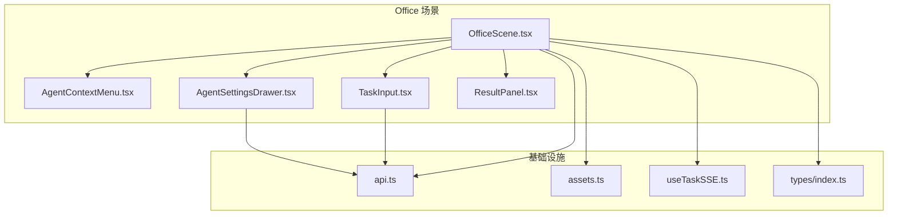
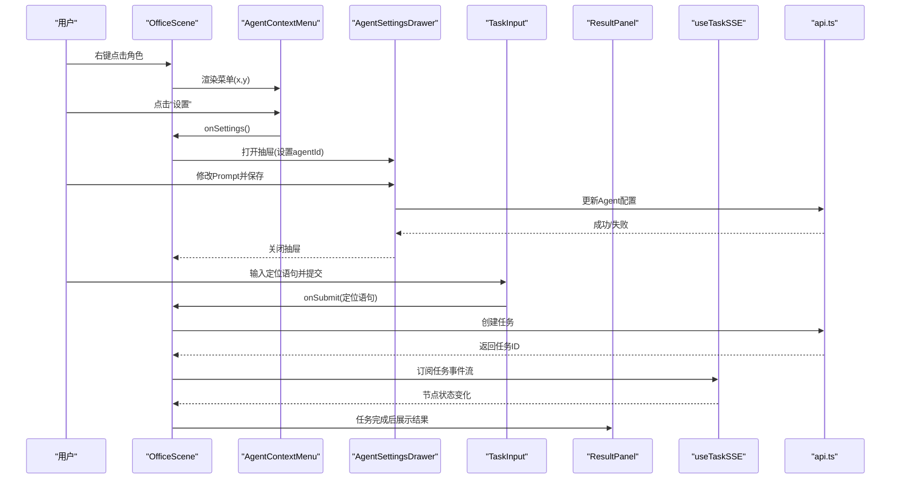
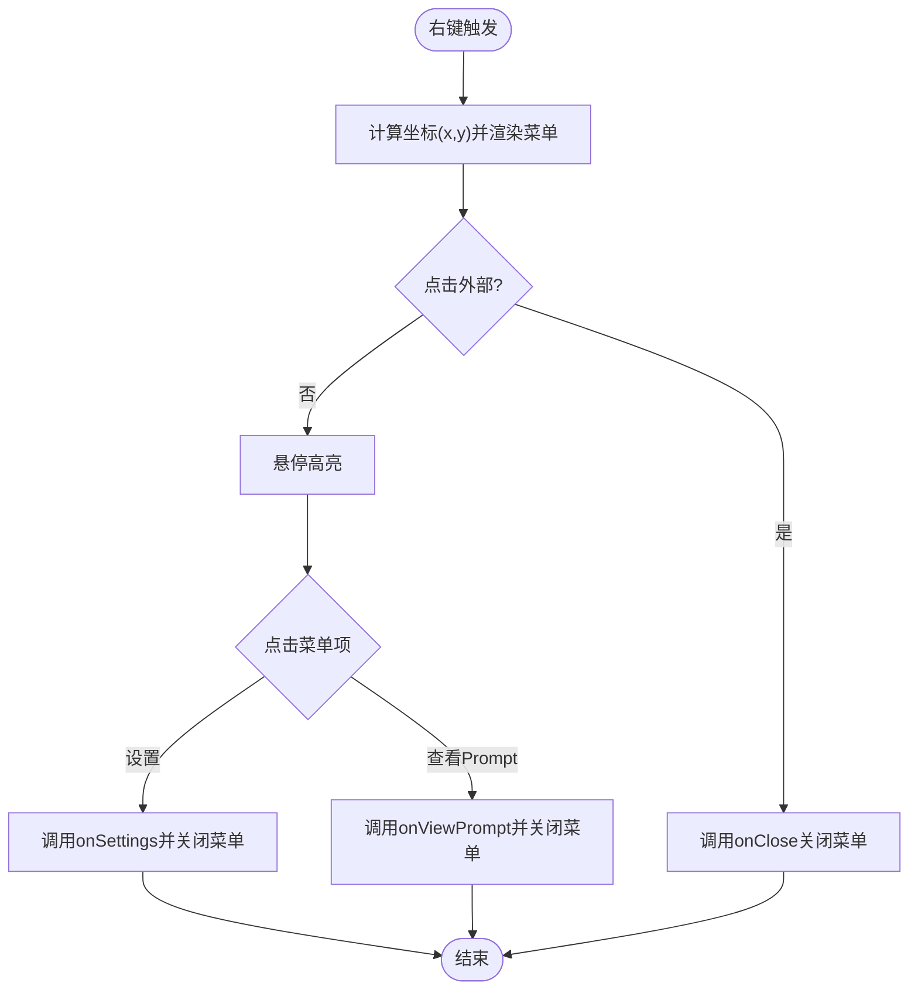
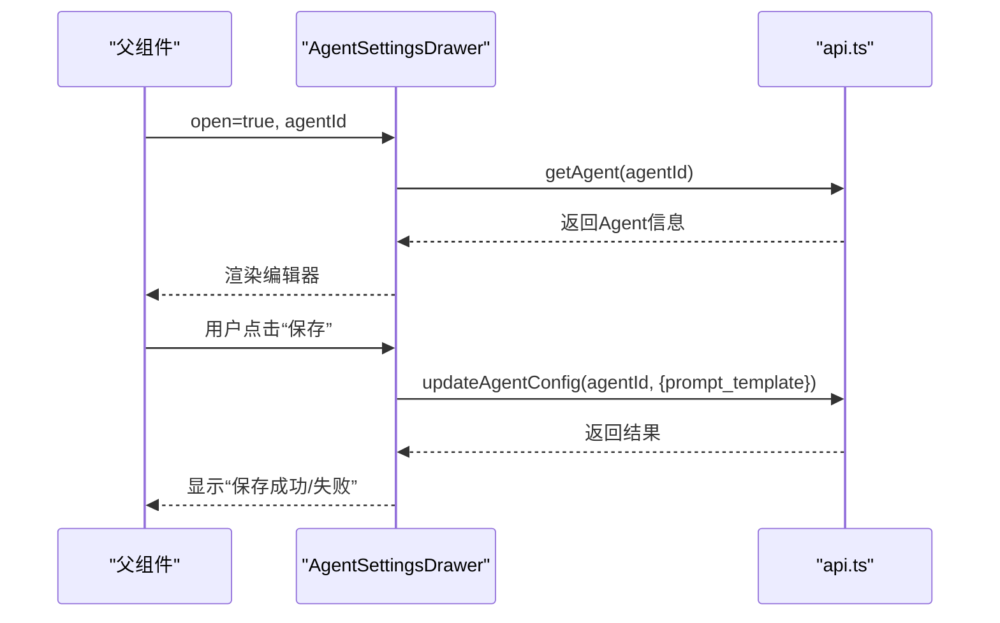
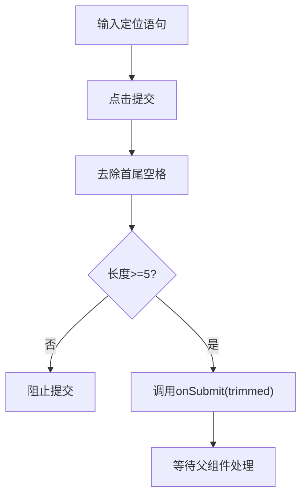
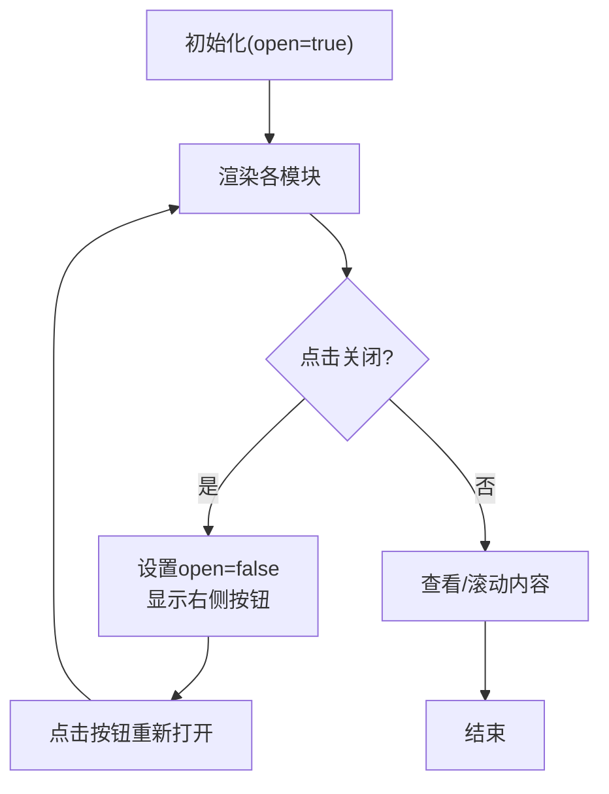
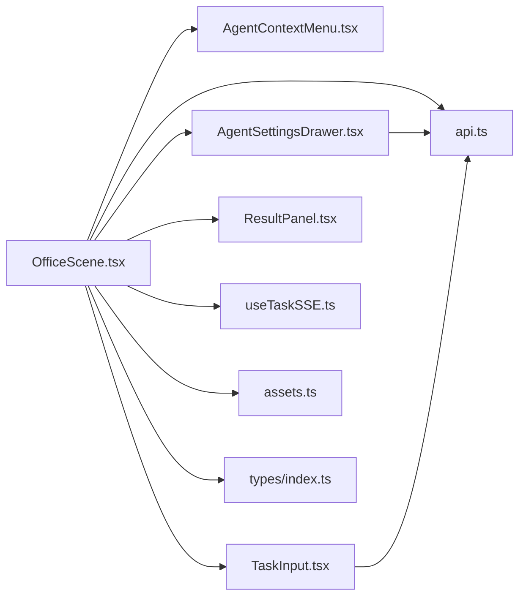

# 交互式组件

<cite>
**本文引用的文件**
- [AgentContextMenu.tsx](file://frontend/components/office/AgentContextMenu.tsx)
- [AgentSettingsDrawer.tsx](file://frontend/components/office/AgentSettingsDrawer.tsx)
- [TaskInput.tsx](file://frontend/components/office/TaskInput.tsx)
- [ResultPanel.tsx](file://frontend/components/office/ResultPanel.tsx)
- [OfficeScene.tsx](file://frontend/components/office/OfficeScene.tsx)
- [api.ts](file://frontend/lib/api.ts)
- [assets.ts](file://frontend/lib/assets.ts)
- [useTaskSSE.ts](file://frontend/hooks/useTaskSSE.ts)
- [index.ts](file://frontend/types/index.ts)
</cite>

## 目录
1. [简介](#简介)
2. [项目结构](#项目结构)
3. [核心组件](#核心组件)
4. [架构总览](#架构总览)
5. [组件详解](#组件详解)
6. [依赖关系分析](#依赖关系分析)
7. [性能考量](#性能考量)
8. [故障排查指南](#故障排查指南)
9. [结论](#结论)
10. [附录](#附录)

## 简介
本文件聚焦于交互式组件系统中的四个关键组件：AgentContextMenu（右键菜单）、AgentSettingsDrawer（侧边抽屉）、TaskInput（任务输入）与 ResultPanel（结果面板）。文档从架构、数据流、事件绑定、样式定制到组件间通信进行全面剖析，并提供可复用的开发规范与最佳实践。

## 项目结构
这些组件位于前端工程的 office 子目录下，配合资产与 API 客户端、SSE 钩子以及类型定义共同构成完整的交互式工作台体验。

图示来源
- [OfficeScene.tsx:1-428](file://frontend/components/office/OfficeScene.tsx#L1-L428)
- [AgentContextMenu.tsx:1-84](file://frontend/components/office/AgentContextMenu.tsx#L1-L84)
- [AgentSettingsDrawer.tsx:1-175](file://frontend/components/office/AgentSettingsDrawer.tsx#L1-L175)
- [TaskInput.tsx:1-55](file://frontend/components/office/TaskInput.tsx#L1-L55)
- [ResultPanel.tsx:1-146](file://frontend/components/office/ResultPanel.tsx#L1-L146)
- [api.ts:1-289](file://frontend/lib/api.ts#L1-L289)
- [assets.ts:1-125](file://frontend/lib/assets.ts#L1-L125)
- [useTaskSSE.ts:1-144](file://frontend/hooks/useTaskSSE.ts#L1-L144)
- [index.ts:1-119](file://frontend/types/index.ts#L1-L119)

章节来源
- [OfficeScene.tsx:1-428](file://frontend/components/office/OfficeScene.tsx#L1-L428)

## 核心组件
- AgentContextMenu：像素风右键菜单，支持“设置”“查看 Prompt”等操作，具备点击外部关闭能力。
- AgentSettingsDrawer：右侧抽屉，加载并编辑 Agent 的系统 Prompt，支持恢复默认与保存。
- TaskInput：底部输入面板，负责接收用户输入的任务定位语句，进行基础校验后提交。
- ResultPanel：右侧滑入式结果面板，按模块化区域展示账号画像、选题、标题、正文草稿与审核结果。

章节来源
- [AgentContextMenu.tsx:1-84](file://frontend/components/office/AgentContextMenu.tsx#L1-L84)
- [AgentSettingsDrawer.tsx:1-175](file://frontend/components/office/AgentSettingsDrawer.tsx#L1-L175)
- [TaskInput.tsx:1-55](file://frontend/components/office/TaskInput.tsx#L1-L55)
- [ResultPanel.tsx:1-146](file://frontend/components/office/ResultPanel.tsx#L1-L146)

## 架构总览
组件围绕 OfficeScene 进行编排，通过 props 传递状态与回调，抽屉与菜单作为独立浮层存在，输入与结果面板在场景底部与右侧区域呈现。SSE 钩子提供实时节点状态更新，API 客户端封装后端接口。

图示来源
- [OfficeScene.tsx:80-427](file://frontend/components/office/OfficeScene.tsx#L80-L427)
- [AgentContextMenu.tsx:19-84](file://frontend/components/office/AgentContextMenu.tsx#L19-L84)
- [AgentSettingsDrawer.tsx:16-175](file://frontend/components/office/AgentSettingsDrawer.tsx#L16-L175)
- [TaskInput.tsx:13-55](file://frontend/components/office/TaskInput.tsx#L13-L55)
- [ResultPanel.tsx:11-146](file://frontend/components/office/ResultPanel.tsx#L11-L146)
- [useTaskSSE.ts:28-144](file://frontend/hooks/useTaskSSE.ts#L28-L144)
- [api.ts:26-89](file://frontend/lib/api.ts#L26-L89)

## 组件详解

### AgentContextMenu 右键菜单
- 菜单项配置
  - “设置”：触发父组件打开抽屉并传入当前 agentId。
  - “查看 Prompt”：触发父组件打开抽屉以查看默认或自定义 Prompt。
- 事件绑定
  - 使用 useRef 获取容器 DOM，监听全局 mousedown，若点击发生在菜单外部则调用 onClose。
  - 右键菜单位置由传入的 x/y 决定，保证与鼠标位置一致。
- 样式定制
  - 使用像素风边框类名与背景色，统一视觉风格；图标来自 SPRITES。
  - 文本采用等宽字体与字号控制，确保在像素风格下的可读性。

图示来源
- [AgentContextMenu.tsx:19-84](file://frontend/components/office/AgentContextMenu.tsx#L19-L84)
- [assets.ts:77-84](file://frontend/lib/assets.ts#L77-L84)

章节来源
- [AgentContextMenu.tsx:1-84](file://frontend/components/office/AgentContextMenu.tsx#L1-L84)
- [assets.ts:1-125](file://frontend/lib/assets.ts#L1-L125)

### AgentSettingsDrawer 侧边抽屉
- 抽屉状态管理
  - open 由父组件控制，关闭时返回 null，避免渲染。
  - 通过 onClose 回调与父组件同步状态。
- 内容渲染
  - 加载阶段显示“加载中”，错误时提示“加载失败”。
  - 展示 Agent 基本信息与系统 Prompt 编辑区，包含“恢复默认”按钮。
  - promptSource 根据是否为空决定“默认/自定义”标签样式。
- 动画效果
  - 使用 slide-in-right 动画类实现平滑进入。
- 提交逻辑
  - handleSave 调用 updateAgentConfig，成功后根据模板是否为空切换 promptSource，并反馈消息。
  - handleResetDefault 将模板恢复为默认值。

图示来源
- [AgentSettingsDrawer.tsx:16-175](file://frontend/components/office/AgentSettingsDrawer.tsx#L16-L175)
- [api.ts:77-89](file://frontend/lib/api.ts#L77-L89)

章节来源
- [AgentSettingsDrawer.tsx:1-175](file://frontend/components/office/AgentSettingsDrawer.tsx#L1-L175)
- [api.ts:57-89](file://frontend/lib/api.ts#L57-L89)

### TaskInput 任务输入
- 表单验证
  - 提交前对输入进行 trim 并判断长度阈值，不足则阻止提交。
- 输入处理
  - 受控组件，value 与 onChange 由内部状态维护。
  - disabled/ loading 状态影响输入框与按钮可用性。
- 提交逻辑
  - onSubmit 接收处理后的定位语句，交由父组件发起任务创建流程。
  - 按钮文案随 loading 状态动态变化。

图示来源
- [TaskInput.tsx:13-55](file://frontend/components/office/TaskInput.tsx#L13-L55)

章节来源
- [TaskInput.tsx:1-55](file://frontend/components/office/TaskInput.tsx#L1-L55)

### ResultPanel 结果面板
- 数据展示
  - 支持账号画像、候选选题、候选标题、正文草稿与审核结果等模块。
  - 使用 Section/KV 辅助组件组织键值对与分组标题。
- 格式化与交互
  - 正文草稿以 pre 包裹，保留 Markdown 格式与换行。
  - 审核结果根据 passed/risk_level 展示不同状态与说明。
  - 支持折叠/展开：初始打开，点击“✕”可隐藏至右侧按钮；再次点击按钮可重新展开。
- 动画与布局
  - 固定在右侧，带左侧边框与滚动区域，便于长内容浏览。

图示来源
- [ResultPanel.tsx:11-146](file://frontend/components/office/ResultPanel.tsx#L11-L146)

章节来源
- [ResultPanel.tsx:1-146](file://frontend/components/office/ResultPanel.tsx#L1-L146)

## 依赖关系分析
- 组件耦合
  - OfficeScene 是编排者，向下传递回调与状态，向上接收任务结果与节点状态。
  - AgentContextMenu 与 AgentSettingsDrawer 通过 OfficeScene 的状态位进行解耦。
  - TaskInput 与 ResultPanel 仅依赖父组件传入的回调与数据，保持低耦合。
- 外部依赖
  - api.ts 提供统一的请求封装与错误抛出约定。
  - assets.ts 提供像素风格资源路径映射，统一视觉风格。
  - useTaskSSE.ts 提供实时事件流订阅，驱动节点状态变更。
  - types/index.ts 提供任务与节点状态的类型约束，保障数据一致性。

图示来源
- [OfficeScene.tsx:1-428](file://frontend/components/office/OfficeScene.tsx#L1-L428)
- [AgentContextMenu.tsx:1-84](file://frontend/components/office/AgentContextMenu.tsx#L1-L84)
- [AgentSettingsDrawer.tsx:1-175](file://frontend/components/office/AgentSettingsDrawer.tsx#L1-L175)
- [TaskInput.tsx:1-55](file://frontend/components/office/TaskInput.tsx#L1-L55)
- [ResultPanel.tsx:1-146](file://frontend/components/office/ResultPanel.tsx#L1-L146)
- [useTaskSSE.ts:1-144](file://frontend/hooks/useTaskSSE.ts#L1-L144)
- [api.ts:1-289](file://frontend/lib/api.ts#L1-L289)
- [assets.ts:1-125](file://frontend/lib/assets.ts#L1-L125)
- [index.ts:1-119](file://frontend/types/index.ts#L1-L119)

章节来源
- [OfficeScene.tsx:1-428](file://frontend/components/office/OfficeScene.tsx#L1-L428)
- [api.ts:1-289](file://frontend/lib/api.ts#L1-L289)
- [assets.ts:1-125](file://frontend/lib/assets.ts#L1-L125)
- [useTaskSSE.ts:1-144](file://frontend/hooks/useTaskSSE.ts#L1-L144)
- [index.ts:1-119](file://frontend/types/index.ts#L1-L119)

## 性能考量
- 渲染优化
  - 抽屉与菜单采用条件渲染（open 或存在），避免不必要的 DOM。
  - ResultPanel 在未展开时仅渲染右侧按钮，减少布局抖动。
- 状态管理
  - OfficeScene 作为单一事实源，集中管理任务 ID、节点状态与结果数据，降低跨组件重复请求。
- 网络与事件
  - SSE 自动重连与事件去重，避免频繁重建连接。
  - API 请求统一走封装函数，便于缓存与错误处理。

## 故障排查指南
- 右键菜单不消失
  - 检查是否正确绑定全局 mousedown 事件并在卸载时清理。
  - 确认 onClose 回调被正确传递给 AgentContextMenu。
- 抽屉无法加载或保存失败
  - 核对 agentId 是否有效；确认 getAgent/updateAgentConfig 的返回值与错误分支。
  - 观察 loading/saving 状态是否阻塞交互。
- 输入提交无效
  - 确认输入长度阈值与禁用状态；检查 onSubmit 回调链路。
- 结果面板不显示
  - 确认 taskDone 与 resultData 均满足；检查 OfficeScene 中的条件渲染逻辑。

章节来源
- [AgentContextMenu.tsx:30-38](file://frontend/components/office/AgentContextMenu.tsx#L30-L38)
- [AgentSettingsDrawer.tsx:26-46](file://frontend/components/office/AgentSettingsDrawer.tsx#L26-L46)
- [TaskInput.tsx:16-21](file://frontend/components/office/TaskInput.tsx#L16-L21)
- [OfficeScene.tsx:70-73](file://frontend/components/office/OfficeScene.tsx#L70-L73)

## 结论
该交互式组件系统通过清晰的职责划分与稳定的事件流，实现了从右键菜单、抽屉编辑到输入提交与结果展示的完整闭环。组件间通过 props 与回调进行松耦合通信，配合统一的 API 与类型定义，具备良好的可维护性与扩展性。建议在后续迭代中进一步引入细粒度的错误边界与加载骨架，提升复杂场景下的用户体验。

## 附录
- 开发规范与复用策略
  - 统一使用像素风格资源与类名，保持视觉一致性。
  - 将通用交互（如点击外部关闭、受控表单）抽象为可复用 Hook 或工具函数。
  - 对外暴露明确的 Props 接口与回调签名，避免隐式依赖。
  - 对关键异步流程（加载、保存、提交）提供明确的状态与错误提示。
  - 对复杂面板（抽屉、结果面板）提供折叠/展开能力，兼顾信息密度与易用性。