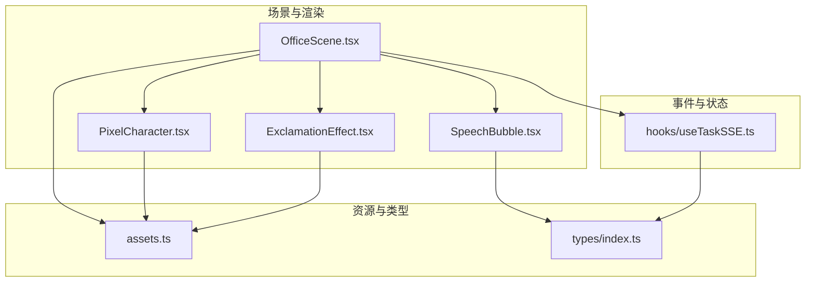
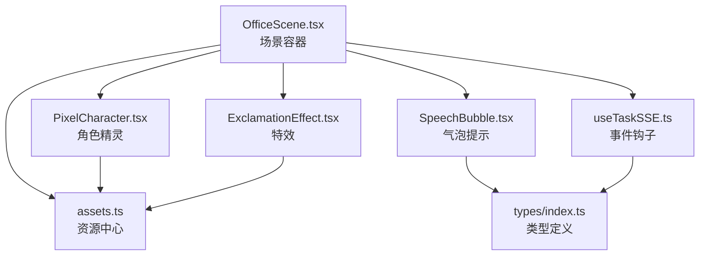
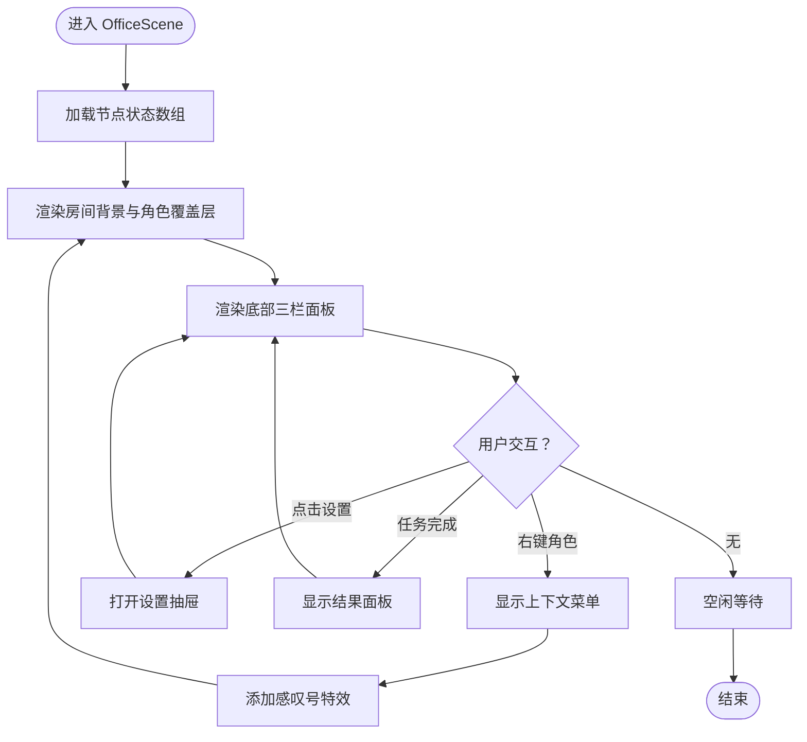
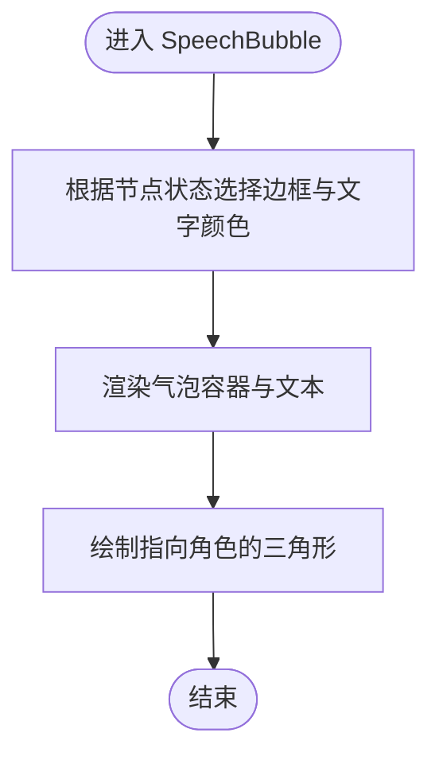
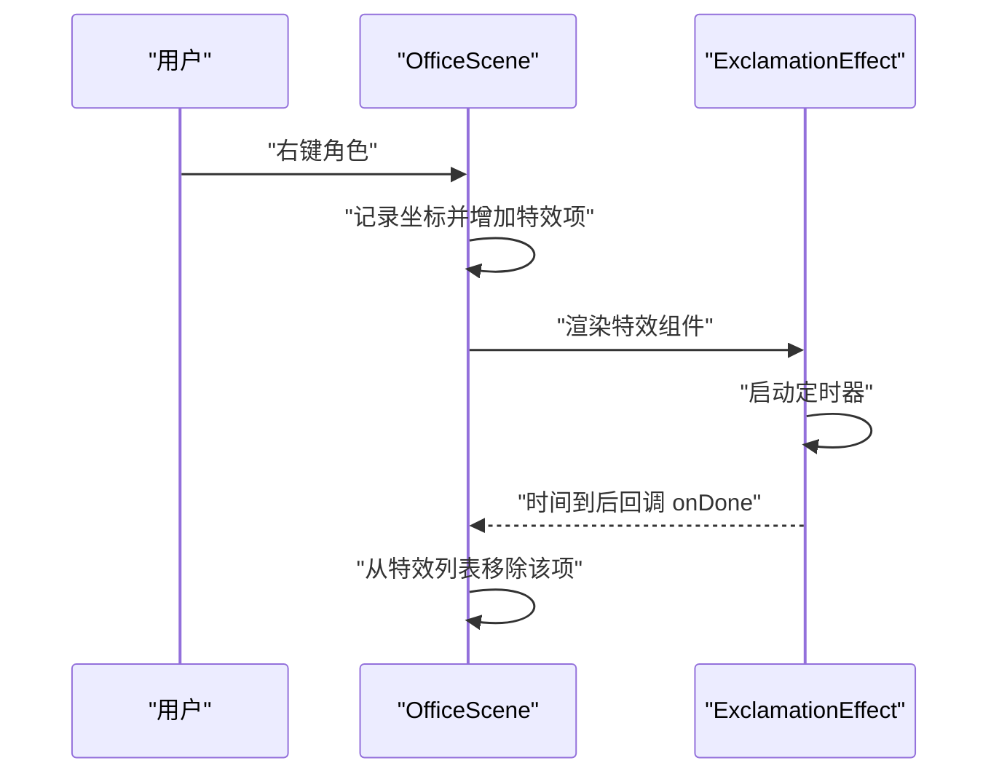
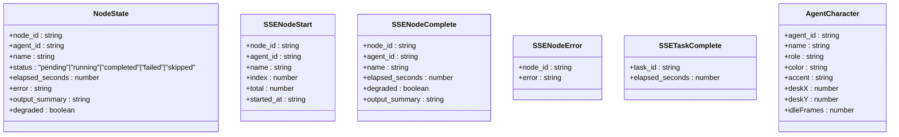
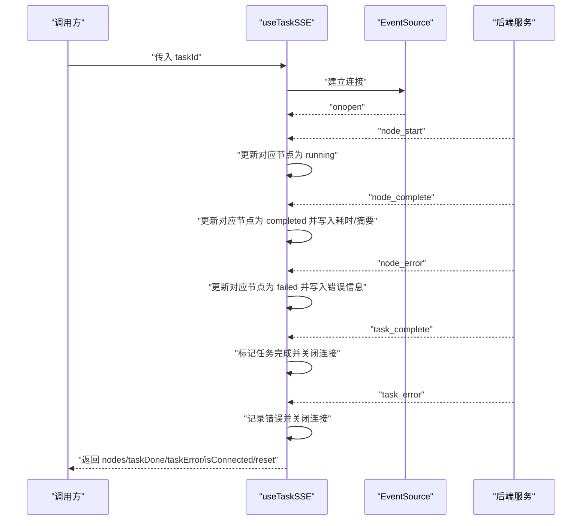
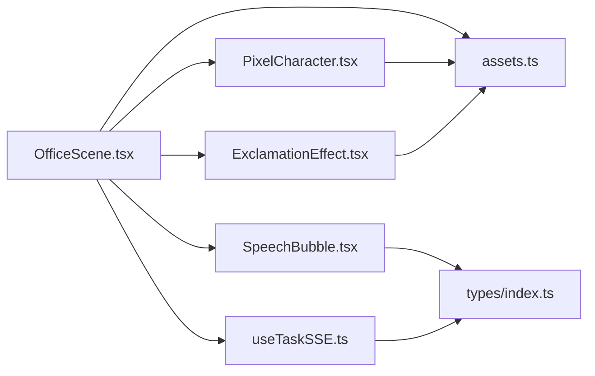
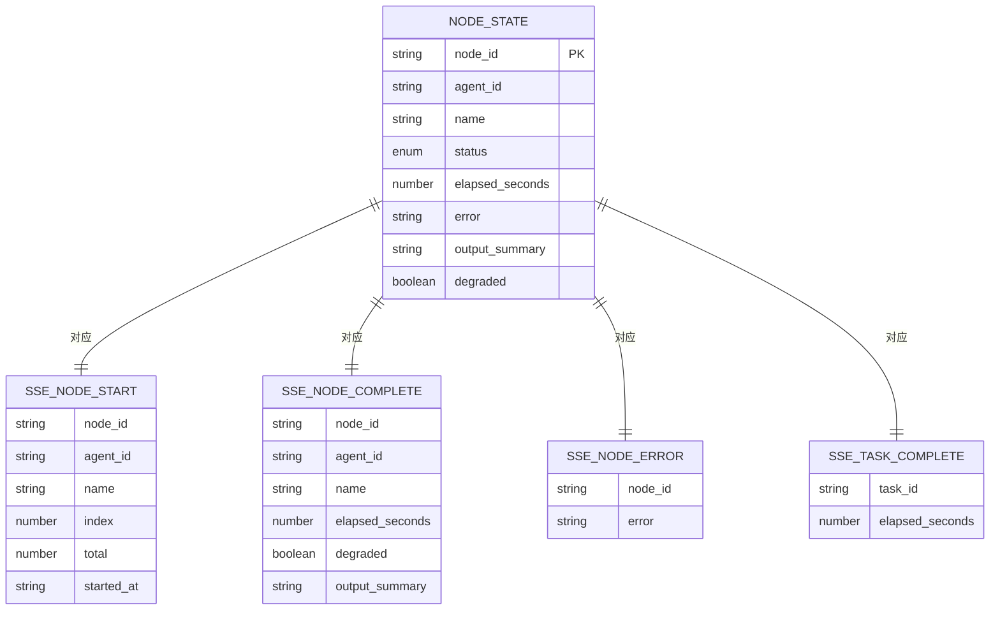

# 像素办公室系统

<cite>
**本文引用的文件**
- [OfficeScene.tsx](file://frontend/components/office/OfficeScene.tsx)
- [PixelCharacter.tsx](file://frontend/components/office/PixelCharacter.tsx)
- [SpeechBubble.tsx](file://frontend/components/office/SpeechBubble.tsx)
- [ExclamationEffect.tsx](file://frontend/components/office/ExclamationEffect.tsx)
- [assets.ts](file://frontend/lib/assets.ts)
- [index.ts](file://frontend/types/index.ts)
- [useTaskSSE.ts](file://frontend/hooks/useTaskSSE.ts)
</cite>

## 目录
1. [简介](#简介)
2. [项目结构](#项目结构)
3. [核心组件](#核心组件)
4. [架构总览](#架构总览)
5. [详细组件分析](#详细组件分析)
6. [依赖关系分析](#依赖关系分析)
7. [性能考虑](#性能考虑)
8. [故障排查指南](#故障排查指南)
9. [结论](#结论)
10. [附录](#附录)

## 简介
本文件为“像素办公室系统”的完整技术文档，聚焦于前端像素渲染与状态管理两大主题。系统采用像素艺术风格，通过场景布局、角色精灵、气泡提示与特效等元素构建“编辑部”可视化工作空间；同时以实时事件流驱动节点状态变化，形成从任务创建到节点执行的闭环数据流。

## 项目结构
前端相关模块主要位于 frontend 目录，围绕“场景组件 + 渲染组件 + 资源与类型 + 事件钩子”的分层组织方式展开。核心文件如下图所示：



图表来源
- [OfficeScene.tsx:1-428](file://frontend/components/office/OfficeScene.tsx#L1-L428)
- [PixelCharacter.tsx:1-83](file://frontend/components/office/PixelCharacter.tsx#L1-L83)
- [SpeechBubble.tsx:1-50](file://frontend/components/office/SpeechBubble.tsx#L1-L50)
- [ExclamationEffect.tsx:1-45](file://frontend/components/office/ExclamationEffect.tsx#L1-L45)
- [assets.ts:1-125](file://frontend/lib/assets.ts#L1-L125)
- [index.ts:1-119](file://frontend/types/index.ts#L1-L119)
- [useTaskSSE.ts:1-144](file://frontend/hooks/useTaskSSE.ts#L1-L144)

章节来源
- [OfficeScene.tsx:1-428](file://frontend/components/office/OfficeScene.tsx#L1-L428)
- [assets.ts:1-125](file://frontend/lib/assets.ts#L1-L125)
- [index.ts:1-119](file://frontend/types/index.ts#L1-L119)
- [useTaskSSE.ts:1-144](file://frontend/hooks/useTaskSSE.ts#L1-L144)

## 核心组件
- 场景容器 OfficeScene：负责房间背景、角色布局、底部面板、右键菜单、设置抽屉、结果面板以及浮动特效的统一编排。
- 角色渲染 PixelCharacter：基于 agentId 选择透明 PNG 精灵，结合状态动态应用像素风格动画类名。
- 气泡提示 SpeechBubble：根据节点状态显示不同边框与文字颜色的浮动气泡。
- 特效 ExclamationEffect：在指定坐标播放像素风感叹号淡出动画，并在完成后回调清理。
- 资源中心 assets：集中管理场景贴图、精灵表、单体角色与特效资源，提供位置计算与映射函数。
- 类型定义 types：统一任务、节点、SSE 事件等数据结构，确保组件间契约一致。
- 实时事件 useTaskSSE：封装 EventSource 连接，订阅节点开始、完成、错误与任务完成/错误事件，维护节点状态数组与任务完成标志。

章节来源
- [OfficeScene.tsx:1-428](file://frontend/components/office/OfficeScene.tsx#L1-L428)
- [PixelCharacter.tsx:1-83](file://frontend/components/office/PixelCharacter.tsx#L1-L83)
- [SpeechBubble.tsx:1-50](file://frontend/components/office/SpeechBubble.tsx#L1-L50)
- [ExclamationEffect.tsx:1-45](file://frontend/components/office/ExclamationEffect.tsx#L1-L45)
- [assets.ts:1-125](file://frontend/lib/assets.ts#L1-L125)
- [index.ts:1-119](file://frontend/types/index.ts#L1-L119)
- [useTaskSSE.ts:1-144](file://frontend/hooks/useTaskSSE.ts#L1-L144)

## 架构总览
系统采用“场景容器 + 渲染组件 + 资源与类型 + 事件钩子”的分层架构。OfficeScene 作为顶层容器，聚合各子组件并通过 props 传递状态；PixelCharacter 与 SpeechBubble 仅负责像素风格渲染；ExclamationEffect 提供一次性动画；assets 统一资源访问；types 明确数据契约；useTaskSSE 通过 SSE 驱动节点状态变更，最终回传给 OfficeScene 渲染。



图表来源
- [OfficeScene.tsx:1-428](file://frontend/components/office/OfficeScene.tsx#L1-L428)
- [PixelCharacter.tsx:1-83](file://frontend/components/office/PixelCharacter.tsx#L1-L83)
- [SpeechBubble.tsx:1-50](file://frontend/components/office/SpeechBubble.tsx#L1-L50)
- [ExclamationEffect.tsx:1-45](file://frontend/components/office/ExclamationEffect.tsx#L1-L45)
- [assets.ts:1-125](file://frontend/lib/assets.ts#L1-L125)
- [index.ts:1-119](file://frontend/types/index.ts#L1-L119)
- [useTaskSSE.ts:1-144](file://frontend/hooks/useTaskSSE.ts#L1-L144)

## 详细组件分析

### OfficeScene 场景容器
- 职责：承载房间背景、角色覆盖层、底部三栏面板（日志、状态、访客）、悬浮任务状态徽章、右键上下文菜单、设置抽屉、结果面板与浮动特效。
- 关键点：
  - 使用背景图与绝对定位叠加角色与面板，保证像素风格的一致性。
  - 将节点状态映射到每个角色，动态决定气泡文本与状态图标。
  - 右键触发上下文菜单与感叹号特效，支持设置抽屉与查看提示。
  - 底部面板按功能区分开，日志面板紧凑展示节点状态，状态面板以网格显示角色状态，访客面板展示当前任务下的节点摘要。
  - 任务状态徽章根据运行中、完成或错误显示不同样式与文案。



图表来源
- [OfficeScene.tsx:62-428](file://frontend/components/office/OfficeScene.tsx#L62-L428)

章节来源
- [OfficeScene.tsx:1-428](file://frontend/components/office/OfficeScene.tsx#L1-L428)

### PixelCharacter 角色精灵
- 职责：根据 agentId 选择对应透明 PNG 精灵，依据状态应用像素风格动画类名，支持主图与小图标两种尺寸。
- 关键点：
  - 动态类名映射：运行中、完成、失败与空闲分别对应不同的像素动画。
  - 图像渲染策略：强制像素化以保持像素风格清晰度。
  - 状态指示：运行中显示脉冲文字“工作中”，完成显示对勾，失败显示叉号。

```mermaid
classDiagram
class PixelCharacter {
+agentId : string
+status : "pending"|"running"|"completed"|"failed"|"skipped"
+name : string
+size : number
+render() : void
}
class StatusIcon {
+agentId : string
+status : "pending"|"running"|"completed"|"failed"|"skipped"
+name : string
+size : number
+render() : void
}
PixelCharacter --> "使用" assets_ts_AS["assets.ts : AGENT_SPRITE_URL"]
StatusIcon --> "使用" assets_ts_AS
```

图表来源
- [PixelCharacter.tsx:1-83](file://frontend/components/office/PixelCharacter.tsx#L1-L83)
- [assets.ts:68-75](file://frontend/lib/assets.ts#L68-L75)

章节来源
- [PixelCharacter.tsx:1-83](file://frontend/components/office/PixelCharacter.tsx#L1-L83)
- [assets.ts:1-125](file://frontend/lib/assets.ts#L1-L125)

### SpeechBubble 气泡提示
- 职责：在角色上方显示浮动气泡，根据节点状态设置边框与文字颜色。
- 关键点：
  - 文本截断：当输出摘要过长时进行截断，避免溢出。
  - 边框与文字颜色：运行中使用蓝色系，完成使用绿色系，失败使用红色系，空闲使用灰色系。
  - 指示三角形：通过绝对定位与边框技巧绘制指向角色的三角形。



图表来源
- [SpeechBubble.tsx:12-49](file://frontend/components/office/SpeechBubble.tsx#L12-L49)

章节来源
- [SpeechBubble.tsx:1-50](file://frontend/components/office/SpeechBubble.tsx#L1-L50)

### ExclamationEffect 特效
- 职责：在指定坐标播放像素风感叹号淡出动画，并在完成后回调清理。
- 关键点：
  - 生命周期：挂载后延时自动隐藏并调用 onDone 回调。
  - 像素风格：通过 imageRendering 与 className 的组合确保像素化效果。



图表来源
- [OfficeScene.tsx:80-93](file://frontend/components/office/OfficeScene.tsx#L80-L93)
- [ExclamationEffect.tsx:15-44](file://frontend/components/office/ExclamationEffect.tsx#L15-L44)

章节来源
- [ExclamationEffect.tsx:1-45](file://frontend/components/office/ExclamationEffect.tsx#L1-L45)
- [OfficeScene.tsx:1-428](file://frontend/components/office/OfficeScene.tsx#L1-L428)

### 资源中心 assets
- 职责：集中管理场景背景、精灵表、单体角色与特效资源，提供位置计算与映射函数。
- 关键点：
  - 精灵表布局：固定列数与行列数量，每格尺寸固定，便于通过列/行计算背景定位。
  - 单体角色：每个 agent 对应一个透明 PNG，便于直接渲染。
  - 映射函数：提供 agent_id 到精灵表列/行的映射，以及通用状态精灵路径。

```mermaid
classDiagram
class Assets {
+SCENES : object
+SPRITESHEET : object
+AGENTS : object
+AGENT_SPRITES : object
+SPRITES : object
+AGENT_CELL : object
+getSpritePosition(col,row) : string
+getAgentCell(agentId) : {col,row}
+getStatusSprite(status) : string
}
```

图表来源
- [assets.ts:18-125](file://frontend/lib/assets.ts#L18-L125)

章节来源
- [assets.ts:1-125](file://frontend/lib/assets.ts#L1-L125)

### 类型定义 types
- 职责：统一任务、节点、SSE 事件等数据结构，确保组件间契约一致。
- 关键点：
  - 状态枚举：任务与节点状态均采用联合类型，保证取值安全。
  - SSE 事件：定义节点开始、完成、错误与任务完成/错误事件的数据结构。
  - AgentCharacter：用于描述角色属性（名称、角色、颜色、工位坐标等）。



图表来源
- [index.ts:7-119](file://frontend/types/index.ts#L7-L119)

章节来源
- [index.ts:1-119](file://frontend/types/index.ts#L1-L119)

### 实时事件 useTaskSSE
- 职责：封装 EventSource 连接，订阅节点与任务事件，维护节点状态数组与任务完成/错误标志。
- 关键点：
  - 初始化节点：按后端流水线顺序初始化节点状态，确保渲染一致性。
  - 事件监听：node_start、node_complete、node_error、task_complete、task_error。
  - 自动重连：EventSource 默认自动重连，无需手动关闭连接。
  - 清理：组件卸载时关闭连接并重置状态。



图表来源
- [useTaskSSE.ts:28-144](file://frontend/hooks/useTaskSSE.ts#L28-L144)

章节来源
- [useTaskSSE.ts:1-144](file://frontend/hooks/useTaskSSE.ts#L1-L144)

## 依赖关系分析
- OfficeScene 依赖：
  - PixelCharacter、SpeechBubble、ExclamationEffect：用于角色渲染、气泡与特效。
  - assets：用于场景背景与精灵资源访问。
  - useTaskSSE：用于获取节点状态与任务完成标志。
- PixelCharacter 依赖 assets：通过 agentId 映射到具体精灵 URL。
- SpeechBubble 依赖 types：使用 NodeStatus 与 NodeState 中的状态字段。
- ExclamationEffect 依赖 assets：使用特效精灵资源。
- useTaskSSE 依赖 types：使用 NodeState、SSE 事件类型与任务状态。



图表来源
- [OfficeScene.tsx:1-428](file://frontend/components/office/OfficeScene.tsx#L1-L428)
- [PixelCharacter.tsx:1-83](file://frontend/components/office/PixelCharacter.tsx#L1-L83)
- [SpeechBubble.tsx:1-50](file://frontend/components/office/SpeechBubble.tsx#L1-L50)
- [ExclamationEffect.tsx:1-45](file://frontend/components/office/ExclamationEffect.tsx#L1-L45)
- [assets.ts:1-125](file://frontend/lib/assets.ts#L1-L125)
- [index.ts:1-119](file://frontend/types/index.ts#L1-L119)
- [useTaskSSE.ts:1-144](file://frontend/hooks/useTaskSSE.ts#L1-L144)

章节来源
- [OfficeScene.tsx:1-428](file://frontend/components/office/OfficeScene.tsx#L1-L428)
- [assets.ts:1-125](file://frontend/lib/assets.ts#L1-L125)
- [index.ts:1-119](file://frontend/types/index.ts#L1-L119)
- [useTaskSSE.ts:1-144](file://frontend/hooks/useTaskSSE.ts#L1-L144)

## 性能考虑
- 像素渲染优化
  - 强制像素化：通过图像渲染策略确保像素风格清晰，避免模糊。
  - 精灵复用：使用透明 PNG 与精灵表减少重复资源，降低带宽与内存占用。
  - 动画最小化：仅在必要状态应用动画类名，避免过度动画影响帧率。
- 事件与状态管理
  - 事件源自动重连：利用浏览器 EventSource 的指数退避重连能力，提升稳定性。
  - 状态局部更新：仅更新受影响的节点状态，避免全量重渲染。
- DOM 与布局
  - 绝对定位与背景图：减少层级嵌套，提高渲染效率。
  - 条件渲染：对非运行中的节点不渲染气泡与状态徽章，降低开销。
- 内存管理
  - 清理资源：组件卸载时关闭 EventSource 并清理定时器与副作用。
  - 列表渲染：使用稳定 key（如 node_id 或唯一 id），避免不必要的重排。

## 故障排查指南
- 无法连接事件流
  - 现象：控制台出现连接错误但未关闭连接。
  - 处理：检查 taskId 是否有效；确认后端 SSE 端点可用；观察浏览器 EventSource 自动重连行为。
- 节点状态不更新
  - 现象：界面未显示运行中/完成/失败状态。
  - 处理：确认 SSE 事件是否到达；检查节点 id 匹配逻辑；验证初始节点顺序与后端一致。
- 角色精灵不显示或错位
  - 现象：角色未显示或动画异常。
  - 处理：检查 agentId 是否存在于映射表；确认透明 PNG 路径正确；验证 imageRendering 设置。
- 特效不消失
  - 现象：感叹号特效持续显示。
  - 处理：确认 onDone 回调是否被调用；检查定时器是否被清理；确认列表中对应项被移除。

章节来源
- [useTaskSSE.ts:129-133](file://frontend/hooks/useTaskSSE.ts#L129-L133)
- [OfficeScene.tsx:80-93](file://frontend/components/office/OfficeScene.tsx#L80-L93)
- [PixelCharacter.tsx:35-62](file://frontend/components/office/PixelCharacter.tsx#L35-L62)
- [assets.ts:68-75](file://frontend/lib/assets.ts#L68-L75)

## 结论
像素办公室系统通过场景容器与渲染组件的清晰分层，结合统一的资源中心与类型定义，实现了稳定的像素风格可视化与实时状态驱动。useTaskSSE 将后端事件流无缝接入前端，形成从任务创建到节点执行的完整闭环。建议在后续迭代中进一步完善 Canvas 2D 渲染引擎与 GameLoop 的集成，以支持更复杂的像素动画与特效，同时持续优化事件流与渲染性能。

## 附录
- 数据模型概览



图表来源
- [index.ts:7-119](file://frontend/types/index.ts#L7-L119)
- [useTaskSSE.ts:74-127](file://frontend/hooks/useTaskSSE.ts#L74-L127)