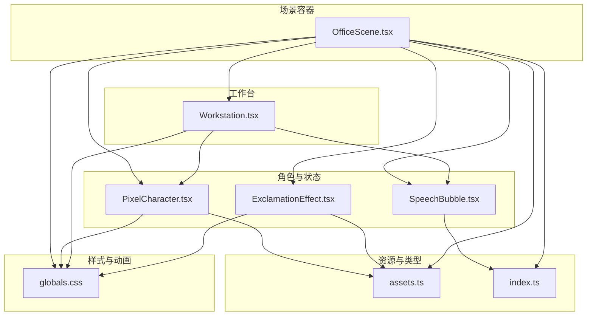
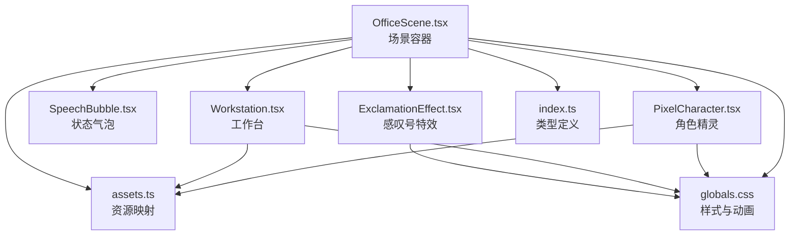
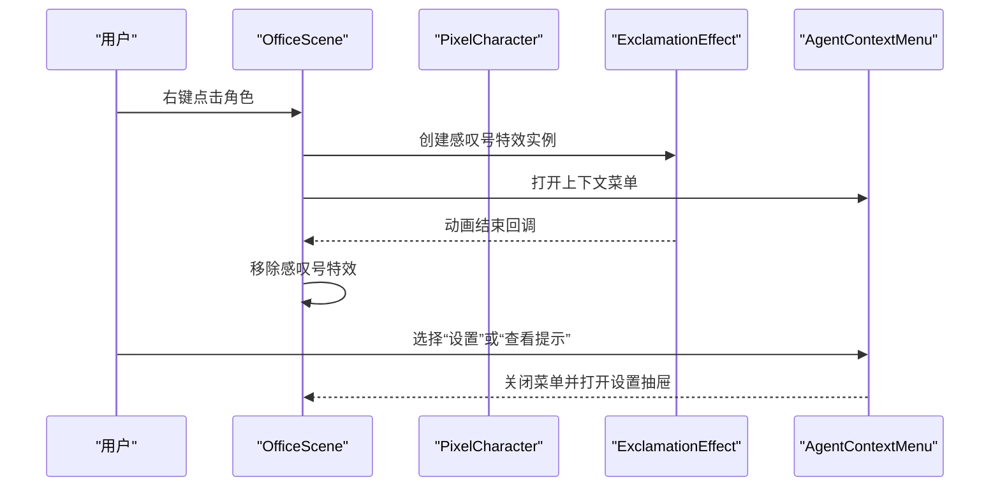
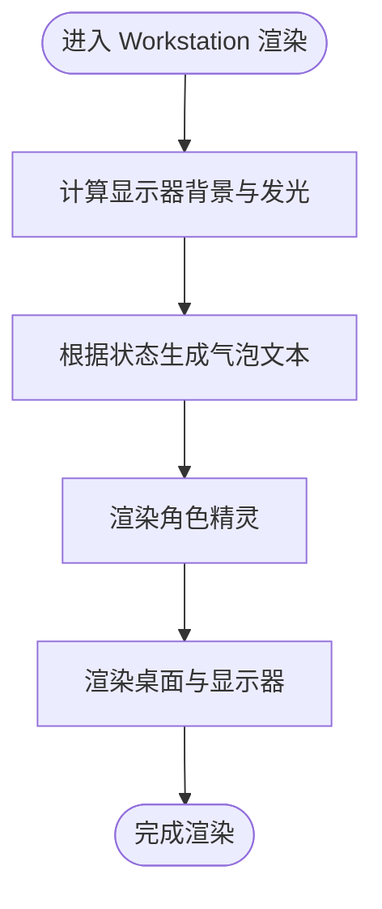
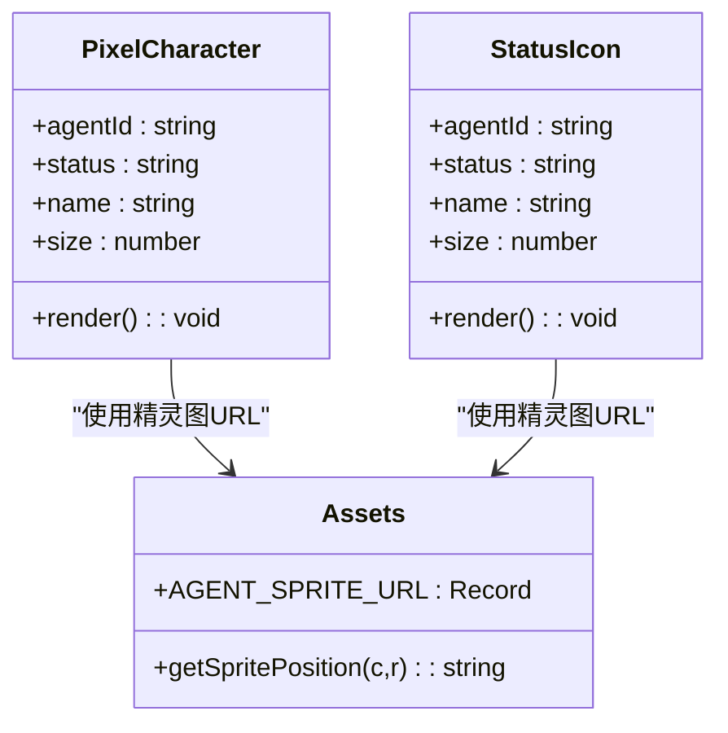
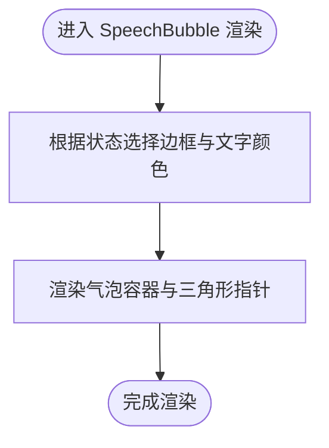
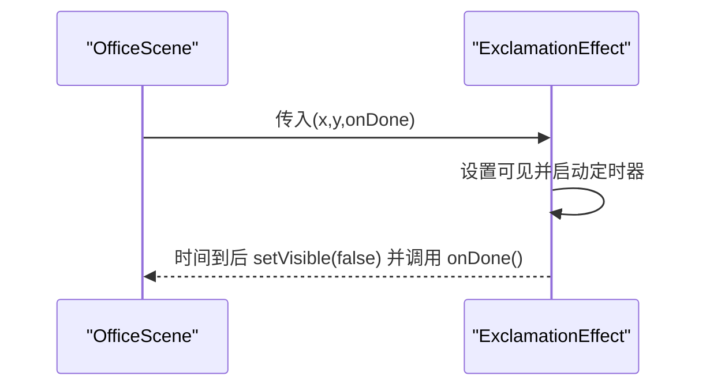
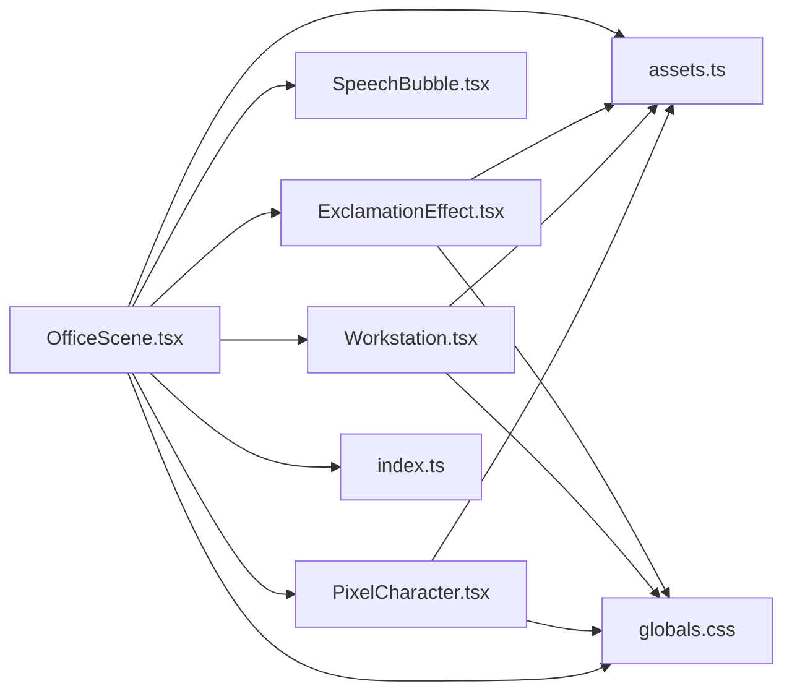

# 场景渲染系统

<cite>
**本文引用的文件**
- [OfficeScene.tsx](file://frontend/components/office/OfficeScene.tsx)
- [Workstation.tsx](file://frontend/components/office/Workstation.tsx)
- [PixelCharacter.tsx](file://frontend/components/office/PixelCharacter.tsx)
- [SpeechBubble.tsx](file://frontend/components/office/SpeechBubble.tsx)
- [ExclamationEffect.tsx](file://frontend/components/office/ExclamationEffect.tsx)
- [assets.ts](file://frontend/lib/assets.ts)
- [index.ts](file://frontend/types/index.ts)
- [globals.css](file://frontend/app/globals.css)
</cite>

## 目录
1. [引言](#引言)
2. [项目结构](#项目结构)
3. [核心组件](#核心组件)
4. [架构总览](#架构总览)
5. [详细组件分析](#详细组件分析)
6. [依赖关系分析](#依赖关系分析)
7. [性能考虑](#性能考虑)
8. [故障排查指南](#故障排查指南)
9. [结论](#结论)
10. [附录](#附录)

## 引言
本技术文档围绕 OfficeScene 办公场景渲染系统展开，系统以像素风格为视觉基调，采用纯前端 React 组件与 Tailwind/CSS 动画实现场景布局、角色渲染、状态指示与交互反馈。文档重点覆盖：
- 场景布局与空间组织：背景图层、角色定位、层级与遮挡关系
- 工作台 Workstation 的实现：桌面、显示器、角色与状态指示
- 像素角色 PixelCharacter 的渲染机制：精灵图、动画序列与状态表现
- 场景元素层次管理：Z-index 排序、碰撞检测与交互范围
- 场景优化策略：视口裁剪、延迟加载与资源预加载
- 面向开发者的场景构建指导与性能优化建议

## 项目结构
本系统位于前端子项目，核心文件分布如下：
- 场景容器与布局：OfficeScene.tsx
- 角色与状态：PixelCharacter.tsx、SpeechBubble.tsx、ExclamationEffect.tsx
- 工作台组件：Workstation.tsx
- 资源与映射：assets.ts（背景、精灵、状态图）
- 类型定义：index.ts（节点状态、任务数据等）
- 设计系统与动画：globals.css（像素风格、扫描线、动画）

图表来源
- [OfficeScene.tsx:1-428](file://frontend/components/office/OfficeScene.tsx#L1-L428)
- [Workstation.tsx:1-120](file://frontend/components/office/Workstation.tsx#L1-L120)
- [PixelCharacter.tsx:1-83](file://frontend/components/office/PixelCharacter.tsx#L1-L83)
- [SpeechBubble.tsx:1-50](file://frontend/components/office/SpeechBubble.tsx#L1-L50)
- [ExclamationEffect.tsx:1-45](file://frontend/components/office/ExclamationEffect.tsx#L1-L45)
- [assets.ts:1-125](file://frontend/lib/assets.ts#L1-L125)
- [index.ts:1-119](file://frontend/types/index.ts#L1-L119)
- [globals.css:1-386](file://frontend/app/globals.css#L1-L386)

章节来源
- [OfficeScene.tsx:1-428](file://frontend/components/office/OfficeScene.tsx#L1-L428)
- [assets.ts:1-125](file://frontend/lib/assets.ts#L1-L125)
- [index.ts:1-119](file://frontend/types/index.ts#L1-L119)
- [globals.css:1-386](file://frontend/app/globals.css#L1-L386)

## 核心组件
- OfficeScene：场景主容器，负责背景图层、角色叠加、底部面板、悬浮提示与上下文菜单等
- PixelCharacter：单个代理角色的像素精灵渲染，支持不同状态下的动画与徽标
- SpeechBubble：角色上方的状态气泡，根据状态改变边框与文字颜色
- ExclamationEffect：右键点击时的感叹号特效，带淡出动画与生命周期回调
- Workstation：工作台组件，包含桌面、显示器与角色，显示器随状态发光与图标变化

章节来源
- [OfficeScene.tsx:1-428](file://frontend/components/office/OfficeScene.tsx#L1-L428)
- [PixelCharacter.tsx:1-83](file://frontend/components/office/PixelCharacter.tsx#L1-L83)
- [SpeechBubble.tsx:1-50](file://frontend/components/office/SpeechBubble.tsx#L1-L50)
- [ExclamationEffect.tsx:1-45](file://frontend/components/office/ExclamationEffect.tsx#L1-L45)
- [Workstation.tsx:1-120](file://frontend/components/office/Workstation.tsx#L1-L120)

## 架构总览
系统采用“容器 + 组件”的分层架构：
- 容器层：OfficeScene 负责场景布局、状态聚合与事件分发
- 渲染层：PixelCharacter、Workstation、SpeechBubble 等组件负责具体元素的绘制与动画
- 资源层：assets.ts 提供背景图、精灵图与状态图的统一映射
- 类型层：index.ts 提供节点状态、任务数据等类型定义
- 样式层：globals.css 提供像素风格、扫描线与各类动画

图表来源
- [OfficeScene.tsx:1-428](file://frontend/components/office/OfficeScene.tsx#L1-L428)
- [PixelCharacter.tsx:1-83](file://frontend/components/office/PixelCharacter.tsx#L1-L83)
- [SpeechBubble.tsx:1-50](file://frontend/components/office/SpeechBubble.tsx#L1-L50)
- [ExclamationEffect.tsx:1-45](file://frontend/components/office/ExclamationEffect.tsx#L1-L45)
- [Workstation.tsx:1-120](file://frontend/components/office/Workstation.tsx#L1-L120)
- [assets.ts:1-125](file://frontend/lib/assets.ts#L1-L125)
- [index.ts:1-119](file://frontend/types/index.ts#L1-L119)
- [globals.css:1-386](file://frontend/app/globals.css#L1-L386)

## 详细组件分析

### OfficeScene 场景容器
职责与特性：
- 背景图层：通过背景图覆盖整个房间区域，使用背景尺寸与定位确保画面比例一致
- 角色叠加：基于固定配置在场景中按百分比定位多个角色，支持右键上下文菜单与点击交互
- 底部面板：日志、状态、访客三个面板，展示节点运行状态与摘要信息
- 浮动状态徽章：根据任务整体状态显示“工作中/全部完成/出错”
- 交互反馈：右键触发感叹号特效，弹出上下文菜单；支持设置抽屉

图表来源
- [OfficeScene.tsx:80-94](file://frontend/components/office/OfficeScene.tsx#L80-L94)
- [OfficeScene.tsx:394-414](file://frontend/components/office/OfficeScene.tsx#L394-L414)
- [ExclamationEffect.tsx:15-44](file://frontend/components/office/ExclamationEffect.tsx#L15-L44)

章节来源
- [OfficeScene.tsx:1-428](file://frontend/components/office/OfficeScene.tsx#L1-L428)

### Workstation 工作台
职责与特性：
- 外观：桌面、显示器底座与桌面腿构成，显示器背景与发光效果随状态变化
- 角色：在显示器上方放置 PixelCharacter，实现“坐姿”角色
- 状态指示：根据节点状态在显示器上显示运行中的脉冲点、完成的勾号、失败的叉号
- 文本气泡：根据状态显示“处理中/摘要/出错了!”
- 交互：支持点击与右键菜单，用于打开角色设置或查看提示

图表来源
- [Workstation.tsx:20-119](file://frontend/components/office/Workstation.tsx#L20-L119)
- [PixelCharacter.tsx:35-63](file://frontend/components/office/PixelCharacter.tsx#L35-L63)

章节来源
- [Workstation.tsx:1-120](file://frontend/components/office/Workstation.tsx#L1-L120)

### PixelCharacter 像素角色
职责与特性：
- 精灵图：每个代理对应独立透明 PNG 精灵图，通过资源映射表进行选择
- 动画序列：根据状态应用不同的 CSS 动画类，idle/work/done/idle 失败等
- 状态徽标：在角色下方显示状态符号（工作中/完成/失败），颜色与状态一致
- 尺寸控制：支持传入 size 参数调整渲染尺寸

图表来源
- [PixelCharacter.tsx:13-83](file://frontend/components/office/PixelCharacter.tsx#L13-L83)
- [assets.ts:68-75](file://frontend/lib/assets.ts#L68-L75)

章节来源
- [PixelCharacter.tsx:1-83](file://frontend/components/office/PixelCharacter.tsx#L1-L83)
- [assets.ts:1-125](file://frontend/lib/assets.ts#L1-L125)

### SpeechBubble 状态气泡
职责与特性：
- 文本内容：根据节点状态动态生成“处理中/摘要/出错了!”
- 边框与文字颜色：根据状态切换蓝色/绿色/红色/灰色系
- 形状与指向：底部三角形指针指向角色，配合浮动动画提升可读性

图表来源
- [SpeechBubble.tsx:12-49](file://frontend/components/office/SpeechBubble.tsx#L12-L49)

章节来源
- [SpeechBubble.tsx:1-50](file://frontend/components/office/SpeechBubble.tsx#L1-L50)

### ExclamationEffect 感叹号特效
职责与特性：
- 生命周期：创建后延时自动隐藏并触发回调，避免内存泄漏
- 像素化渲染：使用像素风格图像，保持整体美术一致性
- 绝对定位：根据鼠标坐标定位，确保特效出现在点击位置

图表来源
- [OfficeScene.tsx:80-94](file://frontend/components/office/OfficeScene.tsx#L80-L94)
- [ExclamationEffect.tsx:15-44](file://frontend/components/office/ExclamationEffect.tsx#L15-L44)

章节来源
- [ExclamationEffect.tsx:1-45](file://frontend/components/office/ExclamationEffect.tsx#L1-L45)

### 资源与类型支撑
- 资源映射：assets.ts 提供背景图、精灵图与状态图的集中化路径与行列映射
- 状态枚举：index.ts 定义节点状态与任务状态，保证前后端一致
- 动画与像素风格：globals.css 提供像素风格、扫描线与各类动画，统一视觉语言

章节来源
- [assets.ts:1-125](file://frontend/lib/assets.ts#L1-L125)
- [index.ts:1-119](file://frontend/types/index.ts#L1-L119)
- [globals.css:1-386](file://frontend/app/globals.css#L1-L386)

## 依赖关系分析
- OfficeScene 依赖：PixelCharacter、SpeechBubble、ExclamationEffect、Workstation、assets、types、样式
- PixelCharacter 依赖：assets 中的精灵图映射
- Workstation 依赖：PixelCharacter、SpeechBubble、assets
- ExclamationEffect 依赖：assets 中的效果图
- 样式依赖：globals.css 提供全局动画与像素风格

图表来源
- [OfficeScene.tsx:1-428](file://frontend/components/office/OfficeScene.tsx#L1-L428)
- [PixelCharacter.tsx:1-83](file://frontend/components/office/PixelCharacter.tsx#L1-L83)
- [SpeechBubble.tsx:1-50](file://frontend/components/office/SpeechBubble.tsx#L1-L50)
- [ExclamationEffect.tsx:1-45](file://frontend/components/office/ExclamationEffect.tsx#L1-L45)
- [Workstation.tsx:1-120](file://frontend/components/office/Workstation.tsx#L1-L120)
- [assets.ts:1-125](file://frontend/lib/assets.ts#L1-L125)
- [index.ts:1-119](file://frontend/types/index.ts#L1-L119)
- [globals.css:1-386](file://frontend/app/globals.css#L1-L386)

章节来源
- [OfficeScene.tsx:1-428](file://frontend/components/office/OfficeScene.tsx#L1-L428)
- [assets.ts:1-125](file://frontend/lib/assets.ts#L1-L125)
- [index.ts:1-119](file://frontend/types/index.ts#L1-L119)
- [globals.css:1-386](file://frontend/app/globals.css#L1-L386)

## 性能考虑
- 视口裁剪与懒加载
  - 场景容器采用绝对定位与背景图覆盖，减少 DOM 层级深度；仅在需要时渲染气泡与特效
  - 像素角色与特效使用 CSS 动画而非频繁重排，降低主线程压力
- 资源优化
  - 精灵图与背景图集中管理，避免重复请求；使用像素化渲染保持清晰度
  - 通过资源映射表统一管理路径，便于缓存与预加载
- 动画与交互
  - 使用 CSS 动画替代 JavaScript 动画，利用 GPU 加速
  - 对于高频更新的状态面板，建议采用虚拟滚动与节流策略（在现有实现基础上扩展）
- 内存与生命周期
  - 特效组件在动画结束后及时销毁，避免残留节点
  - 上下文菜单与抽屉组件在关闭时清理事件监听

[本节为通用性能建议，不直接分析特定文件，故无章节来源]

## 故障排查指南
- 角色未显示或显示异常
  - 检查资源映射是否正确，确认 agentId 是否存在于映射表中
  - 确认精灵图路径有效且可访问
- 状态气泡颜色与文本不符
  - 核对节点状态值是否符合预期，检查状态到颜色的映射逻辑
- 右键特效不消失
  - 检查特效组件的回调是否被正确调用，确认定时器是否被清理
- 工作台显示器无发光或图标不更新
  - 检查状态到背景与图标的映射函数，确认条件分支覆盖所有状态

章节来源
- [assets.ts:68-75](file://frontend/lib/assets.ts#L68-L75)
- [SpeechBubble.tsx:12-49](file://frontend/components/office/SpeechBubble.tsx#L12-L49)
- [ExclamationEffect.tsx:15-44](file://frontend/components/office/ExclamationEffect.tsx#L15-L44)
- [Workstation.tsx:30-90](file://frontend/components/office/Workstation.tsx#L30-L90)

## 结论
OfficeScene 场景渲染系统以清晰的分层架构与统一的资源/类型/样式体系，实现了像素风格的办公场景渲染。通过容器组件编排、组件化渲染与 CSS 动画，系统在保证视觉一致性的同时具备良好的可维护性与扩展性。建议在后续迭代中引入更完善的虚拟化与节流策略，进一步优化大规模节点场景下的性能表现。

[本节为总结性内容，不直接分析特定文件，故无章节来源]

## 附录
- 开发者构建指导
  - 新增代理角色：在资源映射表中添加精灵图路径，并在状态映射中补充对应状态图
  - 新增场景面板：参考 OfficeScene 的面板结构，复用状态图标与气泡组件
  - 自定义动画：在样式文件中新增关键帧动画，并在组件中应用对应的类名
- 性能优化建议
  - 对日志与访客列表启用虚拟滚动，限制一次性渲染的节点数量
  - 对频繁更新的状态徽章与气泡文本采用防抖/节流策略
  - 对背景图与精灵图进行缓存与预加载，减少首屏等待时间

[本节为通用指导与建议，不直接分析特定文件，故无章节来源]