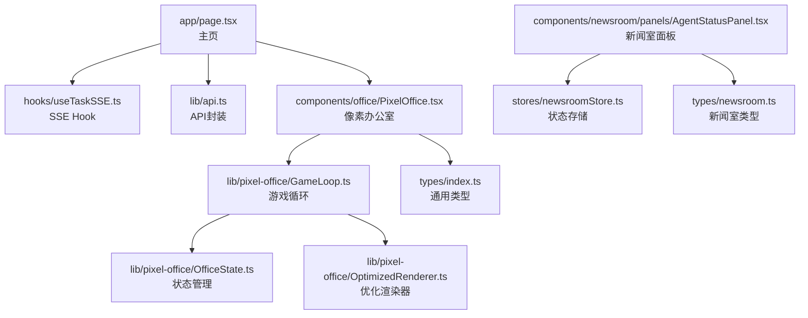
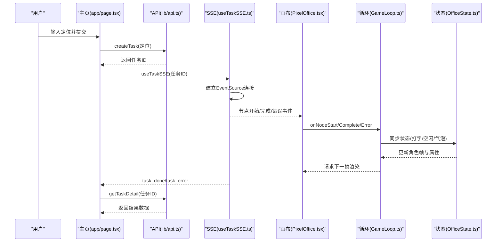
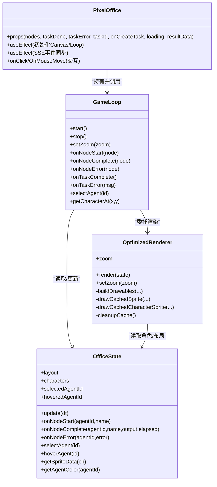
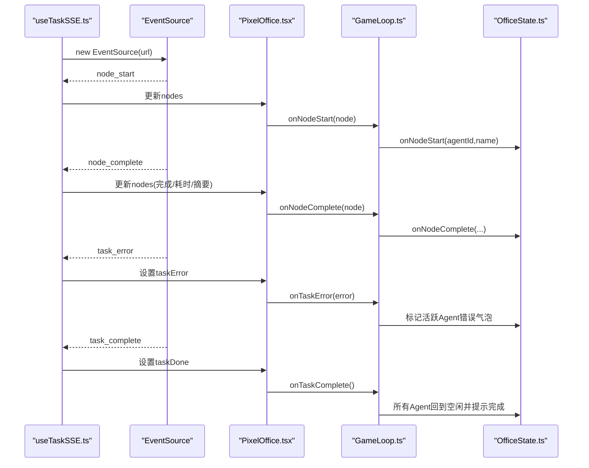
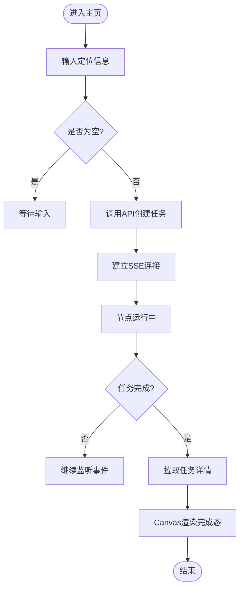
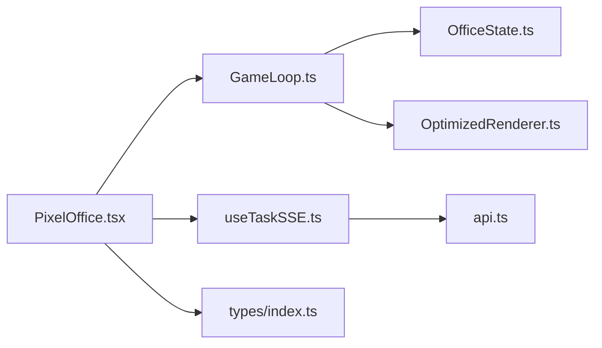

# 前端开发

<cite>
**本文引用的文件**
- [package.json](file://frontend/package.json)
- [next.config.ts](file://frontend/next.config.ts)
- [tsconfig.json](file://frontend/tsconfig.json)
- [app/layout.tsx](file://frontend/app/layout.tsx)
- [app/page.tsx](file://frontend/app/page.tsx)
- [lib/api.ts](file://frontend/lib/api.ts)
- [types/index.ts](file://frontend/types/index.ts)
- [hooks/useTaskSSE.ts](file://frontend/hooks/useTaskSSE.ts)
- [components/office/PixelOffice.tsx](file://frontend/components/office/PixelOffice.tsx)
- [lib/pixel-office/OfficeState.ts](file://frontend/lib/pixel-office/OfficeState.ts)
- [lib/pixel-office/GameLoop.ts](file://frontend/lib/pixel-office/GameLoop.ts)
- [lib/pixel-office/OptimizedRenderer.ts](file://frontend/lib/pixel-office/OptimizedRenderer.ts)
- [components/newsroom/panels/AgentStatusPanel.tsx](file://frontend/components/newsroom/panels/AgentStatusPanel.tsx)
- [types/newsroom.ts](file://frontend/types/newsroom.ts)
- [stores/newsroomStore.ts](file://frontend/stores/newsroomStore.ts)
</cite>

## 目录
1. [引言](#引言)
2. [项目结构](#项目结构)
3. [核心组件](#核心组件)
4. [架构总览](#架构总览)
5. [组件详解](#组件详解)
6. [依赖关系分析](#依赖关系分析)
7. [性能考量](#性能考量)
8. [故障排查指南](#故障排查指南)
9. [结论](#结论)
10. [附录](#附录)

## 引言
本指南面向HotClaw前端开发者，系统讲解基于Next.js的应用结构、页面组件架构与状态管理策略；深入剖析像素办公室系统（Canvas 2D渲染引擎、OfficeState状态管理、GameLoop游戏循环）；阐述实时通信（SSE事件流）、事件监听与错误重连机制；总结组件库设计理念（像素风格UI、交互式Agent控制、响应式布局）；并提供API封装、类型定义与样式系统的技术细节、开发环境配置、调试工具与性能优化建议。

## 项目结构
- 应用入口与路由
  - 页面入口位于 app/page.tsx，负责任务创建、SSE订阅与结果拉取。
  - 根布局 app/layout.tsx 提供全局样式与元数据。
- 状态与逻辑
  - 自定义Hook hooks/useTaskSSE.ts 负责SSE事件流的建立、监听与状态复位。
  - API封装 lib/api.ts 提供统一请求与后端接口抽象。
  - 类型定义 types/index.ts 与 types/newsroom.ts 提供前后端共享的数据契约。
- 像素办公室系统
  - 组件 components/office/PixelOffice.tsx 将Canvas渲染、交互与SSE事件联动。
  - 状态管理 lib/pixel-office/OfficeState.ts 与渲染调度 lib/pixel-office/GameLoop.ts、lib/pixel-office/OptimizedRenderer.ts 协同实现帧循环与高效渲染。
- 新闻室（扩展场景）
  - 组件 components/newsroom/panels/AgentStatusPanel.tsx 与状态 stores/newsroomStore.ts、类型 types/newsroom.ts 展示了另一种像素风格场景的UI与状态组织方式。

**图表来源**
- [app/page.tsx:1-63](file://frontend/app/page.tsx#L1-L63)
- [hooks/useTaskSSE.ts:1-124](file://frontend/hooks/useTaskSSE.ts#L1-L124)
- [lib/api.ts:1-110](file://frontend/lib/api.ts#L1-L110)
- [components/office/PixelOffice.tsx:1-327](file://frontend/components/office/PixelOffice.tsx#L1-L327)
- [lib/pixel-office/GameLoop.ts:1-143](file://frontend/lib/pixel-office/GameLoop.ts#L1-L143)
- [lib/pixel-office/OfficeState.ts:1-247](file://frontend/lib/pixel-office/OfficeState.ts#L1-L247)
- [lib/pixel-office/OptimizedRenderer.ts:1-569](file://frontend/lib/pixel-office/OptimizedRenderer.ts#L1-L569)
- [types/index.ts:1-119](file://frontend/types/index.ts#L1-L119)
- [components/newsroom/panels/AgentStatusPanel.tsx:1-132](file://frontend/components/newsroom/panels/AgentStatusPanel.tsx#L1-L132)
- [stores/newsroomStore.ts:1-91](file://frontend/stores/newsroomStore.ts#L1-L91)
- [types/newsroom.ts:1-87](file://frontend/types/newsroom.ts#L1-L87)

**章节来源**
- [package.json:1-23](file://frontend/package.json#L1-L23)
- [next.config.ts:1-15](file://frontend/next.config.ts#L1-L15)
- [tsconfig.json:1-42](file://frontend/tsconfig.json#L1-L42)
- [app/layout.tsx:1-16](file://frontend/app/layout.tsx#L1-L16)
- [app/page.tsx:1-63](file://frontend/app/page.tsx#L1-L63)

## 核心组件
- 像素办公室组件（Canvas驱动）
  - 负责Canvas初始化、尺寸适配、交互（点击/悬停）、SSE事件同步与侧栏节点面板展示。
  - 参考路径：[components/office/PixelOffice.tsx:1-327](file://frontend/components/office/PixelOffice.tsx#L1-L327)
- SSE Hook（实时事件）
  - 维护节点状态数组、任务完成/错误标志，建立并监听EventSource事件流，提供reset能力。
  - 参考路径：[hooks/useTaskSSE.ts:1-124](file://frontend/hooks/useTaskSSE.ts#L1-L124)
- API封装（统一请求）
  - 封装基础URL、通用响应结构校验、任务/Agent/Skill相关接口。
  - 参考路径：[lib/api.ts:1-110](file://frontend/lib/api.ts#L1-L110)
- 类型定义（契约）
  - 任务/节点状态、SSE事件类型、Agent角色、新闻室场景类型等。
  - 参考路径：[types/index.ts:1-119](file://frontend/types/index.ts#L1-L119)、[types/newsroom.ts:1-87](file://frontend/types/newsroom.ts#L1-L87)

**章节来源**
- [components/office/PixelOffice.tsx:18-327](file://frontend/components/office/PixelOffice.tsx#L18-L327)
- [hooks/useTaskSSE.ts:7-124](file://frontend/hooks/useTaskSSE.ts#L7-L124)
- [lib/api.ts:12-110](file://frontend/lib/api.ts#L12-L110)
- [types/index.ts:3-119](file://frontend/types/index.ts#L3-L119)
- [types/newsroom.ts:1-87](file://frontend/types/newsroom.ts#L1-L87)

## 架构总览
- 前端框架与构建
  - Next.js 16，启用TypeScript与TailwindCSS，路径别名@/*，开发模式支持TurboPack加速。
- 代理与后端通信
  - next.config.ts 将 /api/* 重写到本地后端服务，便于开发联调。
- 数据流
  - 用户在主页输入定位信息，调用API创建任务；随后通过SSE订阅任务节点事件；Canvas中的OfficeState与GameLoop接收事件并驱动渲染；任务完成后拉取结果详情。

**图表来源**
- [app/page.tsx:14-62](file://frontend/app/page.tsx#L14-L62)
- [lib/api.ts:26-50](file://frontend/lib/api.ts#L26-L50)
- [hooks/useTaskSSE.ts:28-124](file://frontend/hooks/useTaskSSE.ts#L28-L124)
- [components/office/PixelOffice.tsx:77-107](file://frontend/components/office/PixelOffice.tsx#L77-L107)
- [lib/pixel-office/GameLoop.ts:54-97](file://frontend/lib/pixel-office/GameLoop.ts#L54-L97)
- [lib/pixel-office/OfficeState.ts:169-212](file://frontend/lib/pixel-office/OfficeState.ts#L169-L212)

## 组件详解

### 像素办公室系统（Canvas 2D渲染引擎）
- 结构与职责
  - PixelOffice：负责Canvas初始化、尺寸适配、交互事件（点击/悬停）、SSE事件同步、侧栏节点面板与顶部状态指示。
  - GameLoop：基于requestAnimationFrame的帧循环，驱动OfficeState更新与OptimizedRenderer渲染。
  - OfficeState：维护6个Agent角色的状态、动画帧与时序、气泡显示与选择/悬停状态。
  - OptimizedRenderer：优化的Canvas渲染器，包含精灵缓存、颜色调色板缓存、Z排序与按需清理。
- 数据与流程
  - 从SSE Hook接收节点状态变更，映射到OfficeState对应Agent；GameLoop每帧更新状态并触发渲染；渲染器根据角色状态与帧索引绘制不同精灵帧与标签气泡。

**图表来源**
- [components/office/PixelOffice.tsx:28-137](file://frontend/components/office/PixelOffice.tsx#L28-L137)
- [lib/pixel-office/GameLoop.ts:10-143](file://frontend/lib/pixel-office/GameLoop.ts#L10-L143)
- [lib/pixel-office/OfficeState.ts:53-246](file://frontend/lib/pixel-office/OfficeState.ts#L53-L246)
- [lib/pixel-office/OptimizedRenderer.ts:56-569](file://frontend/lib/pixel-office/OptimizedRenderer.ts#L56-L569)

**章节来源**
- [components/office/PixelOffice.tsx:11-137](file://frontend/components/office/PixelOffice.tsx#L11-L137)
- [lib/pixel-office/GameLoop.ts:27-97](file://frontend/lib/pixel-office/GameLoop.ts#L27-L97)
- [lib/pixel-office/OfficeState.ts:53-246](file://frontend/lib/pixel-office/OfficeState.ts#L53-L246)
- [lib/pixel-office/OptimizedRenderer.ts:100-132](file://frontend/lib/pixel-office/OptimizedRenderer.ts#L100-L132)

### 实时通信系统（SSE事件流）
- 事件模型
  - 节点事件：node_start、node_complete、node_error；任务事件：task_complete、task_error。
  - Hook内部维护初始节点顺序与状态，按事件更新对应节点的status、耗时、输出摘要或错误信息。
- 连接与重连
  - 建立EventSource连接；在任务完成/错误时关闭连接；onerror回调确保异常时关闭连接，避免悬挂。
  - reset函数用于新任务开始前重置节点状态。
- 与Canvas联动
  - PixelOffice监听节点状态变化，调用GameLoop的事件处理方法，驱动OfficeState更新与渲染。

**图表来源**
- [hooks/useTaskSSE.ts:58-120](file://frontend/hooks/useTaskSSE.ts#L58-L120)
- [components/office/PixelOffice.tsx:77-107](file://frontend/components/office/PixelOffice.tsx#L77-L107)
- [lib/pixel-office/GameLoop.ts:54-97](file://frontend/lib/pixel-office/GameLoop.ts#L54-L97)
- [lib/pixel-office/OfficeState.ts:169-212](file://frontend/lib/pixel-office/OfficeState.ts#L169-L212)

**章节来源**
- [hooks/useTaskSSE.ts:28-124](file://frontend/hooks/useTaskSSE.ts#L28-L124)
- [components/office/PixelOffice.tsx:77-107](file://frontend/components/office/PixelOffice.tsx#L77-L107)

### 组件库与像素风格UI
- 设计理念
  - 像素风格：使用monospace字体、固定像素缩放、圆角矩形与高对比色彩；Canvas渲染保证像素化效果。
  - 交互式Agent控制：点击/悬停角色，显示信息面板；右侧节点面板与顶部状态指示增强可观测性。
  - 响应式布局：Canvas随容器尺寸变化自适应，顶部工具栏与侧边面板配合主画布区域。
- 新闻室场景（扩展）
  - AgentStatusPanel展示Agent状态、技能与任务统计；newsroomStore使用useReducer组织场景与业务状态；types/newsroom.ts定义场景数据结构。

**图表来源**
- [app/page.tsx:38-62](file://frontend/app/page.tsx#L38-L62)
- [lib/api.ts:26-35](file://frontend/lib/api.ts#L26-L35)
- [hooks/useTaskSSE.ts:102-111](file://frontend/hooks/useTaskSSE.ts#L102-L111)
- [components/office/PixelOffice.tsx:235-262](file://frontend/components/office/PixelOffice.tsx#L235-L262)

**章节来源**
- [components/newsroom/panels/AgentStatusPanel.tsx:14-132](file://frontend/components/newsroom/panels/AgentStatusPanel.tsx#L14-L132)
- [stores/newsroomStore.ts:45-91](file://frontend/stores/newsroomStore.ts#L45-L91)
- [types/newsroom.ts:16-87](file://frontend/types/newsroom.ts#L16-L87)

### API调用封装与类型系统
- API封装要点
  - 统一BASE路径与响应结构校验（code=0），错误抛出；提供任务、Agent、Skill相关接口。
  - SSE流地址通过getTaskStreamUrl拼接。
- 类型系统
  - 任务/节点状态枚举、SSE事件类型、Agent角色与新闻室场景类型，确保前后端一致。
- 样式系统
  - TailwindCSS + 自定义全局样式；路径别名@/*简化导入；next.config.ts启用重写以代理/api/*到后端。

**章节来源**
- [lib/api.ts:12-110](file://frontend/lib/api.ts#L12-L110)
- [types/index.ts:3-119](file://frontend/types/index.ts#L3-L119)
- [types/newsroom.ts:1-87](file://frontend/types/newsroom.ts#L1-L87)
- [next.config.ts:3-11](file://frontend/next.config.ts#L3-L11)

## 依赖关系分析
- 组件耦合
  - PixelOffice高度依赖GameLoop与OfficeState；GameLoop依赖OfficeState与OptimizedRenderer；SSE Hook独立于渲染层但通过props与事件驱动渲染。
- 外部依赖
  - Next.js、React、TypeScript、TailwindCSS；浏览器原生EventSource与Canvas 2D。
- 可能的循环依赖
  - 当前模块间为单向依赖（组件→循环→状态/渲染），未见循环导入。

**图表来源**
- [components/office/PixelOffice.tsx:13-16](file://frontend/components/office/PixelOffice.tsx#L13-L16)
- [lib/pixel-office/GameLoop.ts:6-8](file://frontend/lib/pixel-office/GameLoop.ts#L6-L8)
- [lib/pixel-office/OfficeState.ts:9-24](file://frontend/lib/pixel-office/OfficeState.ts#L9-L24)
- [lib/pixel-office/OptimizedRenderer.ts:10-24](file://frontend/lib/pixel-office/OptimizedRenderer.ts#L10-L24)
- [hooks/useTaskSSE.ts:3-5](file://frontend/hooks/useTaskSSE.ts#L3-L5)
- [lib/api.ts:3-10](file://frontend/lib/api.ts#L3-L10)
- [types/index.ts:3-15](file://frontend/types/index.ts#L3-L15)

**章节来源**
- [components/office/PixelOffice.tsx:13-16](file://frontend/components/office/PixelOffice.tsx#L13-L16)
- [lib/pixel-office/GameLoop.ts:6-8](file://frontend/lib/pixel-office/GameLoop.ts#L6-L8)
- [lib/pixel-office/OfficeState.ts:9-24](file://frontend/lib/pixel-office/OfficeState.ts#L9-L24)
- [lib/pixel-office/OptimizedRenderer.ts:10-24](file://frontend/lib/pixel-office/OptimizedRenderer.ts#L10-L24)
- [hooks/useTaskSSE.ts:3-5](file://frontend/hooks/useTaskSSE.ts#L3-L5)
- [lib/api.ts:3-10](file://frontend/lib/api.ts#L3-L10)
- [types/index.ts:3-15](file://frontend/types/index.ts#L3-L15)

## 性能考量
- 渲染优化
  - 精灵缓存与颜色调色板缓存：减少重复像素级绘制与颜色映射计算。
  - 帧计数清理：定期清理缓存，避免内存膨胀。
  - Z排序与按需绘制：仅绘制可见元素，降低每帧绘制成本。
- 循环节流
  - dt上限保护（最大0.1秒），避免长时间未刷新导致的跳变。
- 事件与网络
  - 任务完成后及时关闭SSE连接；onerror确保异常时释放资源。
- 开发体验
  - 启用imageRendering: 'pixelated' 保证Canvas像素风格；合理缩放参数（zoom）平衡清晰度与性能。

**章节来源**
- [lib/pixel-office/OptimizedRenderer.ts:61-98](file://frontend/lib/pixel-office/OptimizedRenderer.ts#L61-L98)
- [lib/pixel-office/OptimizedRenderer.ts:125-129](file://frontend/lib/pixel-office/OptimizedRenderer.ts#L125-L129)
- [lib/pixel-office/GameLoop.ts:30-38](file://frontend/lib/pixel-office/GameLoop.ts#L30-L38)
- [hooks/useTaskSSE.ts:113-119](file://frontend/hooks/useTaskSSE.ts#L113-L119)

## 故障排查指南
- 无法连接后端
  - 检查next.config.ts的重写规则是否正确指向后端地址。
  - 确认API返回的响应结构code字段是否为0，非0时会抛出错误。
- SSE不生效
  - 确认任务ID有效且SSE URL拼接正确；检查浏览器EventSource支持与CORS设置。
  - 若出现连接异常，onerror会关闭连接，可在控制台查看网络面板。
- Canvas不渲染或闪烁
  - 确认Canvas尺寸更新逻辑（窗口resize）与初始化；检查zoom参数与精灵缓存是否被清理。
  - 确保requestAnimationFrame循环正常启动与停止。
- 任务完成后未拉取结果
  - 确认taskDone标志与结果拉取逻辑；注意结果拉取失败为非致命错误，不影响整体流程。

**章节来源**
- [next.config.ts:4-11](file://frontend/next.config.ts#L4-L11)
- [lib/api.ts:14-24](file://frontend/lib/api.ts#L14-L24)
- [hooks/useTaskSSE.ts:113-119](file://frontend/hooks/useTaskSSE.ts#L113-L119)
- [lib/pixel-office/GameLoop.ts:27-46](file://frontend/lib/pixel-office/GameLoop.ts#L27-L46)
- [app/page.tsx:21-31](file://frontend/app/page.tsx#L21-L31)

## 结论
本指南系统梳理了HotClaw前端的Next.js应用结构、像素办公室渲染体系、SSE实时通信与状态管理策略，并提供了组件库设计、API封装、类型定义与样式系统的实践要点。通过优化渲染与事件处理，前端能够在Canvas上流畅呈现多Agent协作的像素风格场景，同时保持良好的可维护性与扩展性。

## 附录
- 开发环境配置
  - 使用Next.js 16与TypeScript；启用路径别名@/*；TailwindCSS集成；开发脚本支持TurboPack加速。
- 调试工具
  - 浏览器开发者工具：Network（SSE与API）、Elements（Canvas像素渲染）、Performance（帧率与内存）。
- 性能优化建议
  - 控制帧率与dt上限；利用精灵与颜色缓存；按需清理缓存；避免频繁创建临时对象；合理使用Z排序与最小绘制区域。

**章节来源**
- [package.json:5-10](file://frontend/package.json#L5-L10)
- [tsconfig.json:25-29](file://frontend/tsconfig.json#L25-L29)
- [next.config.ts:3-11](file://frontend/next.config.ts#L3-L11)