# 前端微信集成

<cite>
**本文档引用的文件**
- [wechat_routes.py](file://backend/app/api/wechat_routes.py)
- [wechat_config.py](file://backend/app/models/wechat_config.py)
- [wechat_token_service.py](file://backend/app/services/wechat_token_service.py)
- [wechat_publish_service.py](file://backend/app/services/wechat_publish_service.py)
- [wechat_media_service.py](file://backend/app/services/wechat_media_service.py)
- [wechat_draft_service.py](file://backend/app/services/wechat_draft_service.py)
- [publish_record_service.py](file://backend/app/services/publish_record_service.py)
- [publish_decision_service.py](file://backend/app/services/publish_decision_service.py)
- [draft_routes.py](file://backend/app/api/draft_routes.py)
- [draft_service.py](file://backend/app/services/draft_service.py)
- [wechat.py](file://backend/app/schemas/wechat.py)
- [api.ts](file://frontend/lib/api.ts)
- [page.tsx](file://frontend/app/settings/wechat/[id]/page.tsx)
- [page.tsx](file://frontend/app/drafts/[id]/page.tsx)
- [WeChatArticle.tsx](file://frontend/components/WeChatArticle.tsx)
- [index.ts](file://frontend/types/index.ts)
- [main.py](file://backend/app/main.py)
</cite>

## 更新摘要
**变更内容**
- 新增发布保护层决策结果展示功能，支持发布决策状态的可视化呈现
- 新增发布决策类型定义，包括决策类型和决策结果结构
- 扩展发布状态处理逻辑，支持决策结果的不同状态分支
- 更新前端界面，展示发布决策详情和原因信息
- **更新：前端路由一致性改进，动态页面统一使用现代Next.js 16的useParams模式**
- **更新：移除了Promise处理，提升了路由参数访问的可靠性和代码可读性**

## 目录
1. [简介](#简介)
2. [项目结构](#项目结构)
3. [核心组件](#核心组件)
4. [架构概览](#架构概览)
5. [详细组件分析](#详细组件分析)
6. [发布保护层与决策结果](#发布保护层与决策结果)
7. [发布历史与重试功能](#发布历史与重试功能)
8. [路由参数访问改进](#路由参数访问改进)
9. [依赖关系分析](#依赖关系分析)
10. [性能考虑](#性能考虑)
11. [故障排除指南](#故障排除指南)
12. [结论](#结论)

## 简介

本文档详细介绍了 HotClaw 项目中的前端微信集成功能。该项目是一个基于多智能体的内容生产平台，专门用于微信公众号的内容创作和发布。前端微信集成模块提供了完整的微信公众号配置、内容预览、发布历史查看和重试控制功能。

系统采用前后端分离架构，后端使用 FastAPI 提供 RESTful API，前端使用 Next.js 构建用户界面。微信集成功能包括：

- 微信公众号凭证配置管理
- 草稿内容预览和格式化
- 图片资源处理和上传
- 草稿创建和发布流程
- 发布状态查询和跟踪
- **新增：发布保护层决策结果展示**
- **新增：发布决策状态可视化**
- **新增：手动刷新发布状态**
- **更新：统一使用Next.js 16的useParams模式进行路由参数访问**
- **更新：移除Promise处理，提升代码可读性**

## 项目结构

项目采用模块化的文件组织方式，主要分为前端和后端两个部分：

```mermaid
graph TB
subgraph "前端 (frontend)"
A[lib/api.ts] --> B[app/settings/wechat/[id]/page.tsx]
C[app/drafts/[id]/page.tsx] --> B
D[components/WeChatArticle.tsx] --> B
E[types/index.ts] --> A
F[types/index.ts] --> B
end
subgraph "后端 (backend)"
G[app/api/wechat_routes.py] --> H[app/services/wechat_token_service.py]
H --> I[app/services/wechat_media_service.py]
I --> J[app/services/wechat_draft_service.py]
J --> K[app/services/wechat_publish_service.py]
L[app/models/wechat_config.py] --> G
M[app/schemas/wechat.py] --> G
N[app/api/draft_routes.py] --> O[app/services/publish_record_service.py]
O --> P[发布记录模型]
Q[app/services/publish_decision_service.py] --> R[发布决策模型]
R --> S[PublishDecisionResult]
end
B --> A
A --> G
```

**图表来源**
- [api.ts:1-733](file://frontend/lib/api.ts#L1-733)
- [page.tsx:1-628](file://frontend/app/drafts/[id]/page.tsx#L1-628)
- [wechat_routes.py:1-349](file://backend/app/api/wechat_routes.py#L1-349)
- [publish_record_service.py:1-433](file://backend/app/services/publish_record_service.py#L1-433)
- [publish_decision_service.py:93-126](file://backend/app/services/publish_decision_service.py#L93-126)

**章节来源**
- [api.ts:1-733](file://frontend/lib/api.ts#L1-733)
- [page.tsx:1-628](file://frontend/app/drafts/[id]/page.tsx#L1-628)
- [wechat_routes.py:1-349](file://backend/app/api/wechat_routes.py#L1-349)
- [publish_record_service.py:1-433](file://backend/app/services/publish_record_service.py#L1-433)
- [publish_decision_service.py:93-126](file://backend/app/services/publish_decision_service.py#L93-126)

## 核心组件

### 前端组件

1. **微信配置页面** (`frontend/app/settings/wechat/[id]/page.tsx`)
   - 提供微信公众号凭证配置界面
   - 支持创建、更新和测试连接功能
   - 实时状态显示和错误处理
   - **更新：使用Next.js 16的useParams模式获取路由参数**

2. **草稿详情页面** (`frontend/app/drafts/[id]/page.tsx`)
   - **新增：发布历史查看功能**
   - **新增：重试控制按钮**
   - **新增：发布状态刷新功能**
   - **新增：发布保护层决策结果展示**
   - 展示完整的发布尝试记录和状态变化
   - **更新：使用Next.js 16的useParams模式获取路由参数**

3. **微信文章组件** (`frontend/components/WeChatArticle.tsx`)
   - Markdown 到 HTML 的转换和渲染
   - 支持多种格式化选项（标题、列表、代码块等）
   - 导出功能（Markdown 和 HTML）

4. **API 客户端** (`frontend/lib/api.ts`)
   - 统一的 API 调用封装
   - 错误处理和响应解析
   - SSE 流式数据支持
   - **新增：发布记录相关接口**
   - **新增：发布决策相关接口**

### 后端组件

1. **微信路由** (`backend/app/api/wechat_routes.py`)
   - 提供微信配置的 CRUD 操作
   - 连接测试功能
   - 数据验证和安全处理
   - **新增：发布记录刷新接口**

2. **草稿路由** (`backend/app/api/draft_routes.py`)
   - **新增：发布历史查询接口**
   - **新增：重试发布接口**
   - **新增：发布状态刷新接口**

3. **发布决策服务** (`backend/app/services/publish_decision_service.py`)
   - **新增：完整的发布保护层决策处理**
   - 提供结构化的决策结果
   - 支持多种决策类型和原因码
   - 记录详细的检查信息

4. **草稿服务** (`backend/app/services/draft_service.py`)
   - **新增：集成发布决策服务**
   - 处理决策结果的不同状态分支
   - 支持决策结果的持久化

5. **微信配置模型** (`backend/app/models/wechat_config.py`)
   - 数据库模型定义
   - 字段约束和索引
   - 关系映射
   - **新增：发布记录模型**

6. **发布记录服务** (`backend/app/services/publish_record_service.py`)
   - **新增：完整的发布记录生命周期管理**
   - 支持重试记录创建和状态同步
   - 提供发布历史查询功能

**章节来源**
- [page.tsx:1-628](file://frontend/app/drafts/[id]/page.tsx#L1-628)
- [WeChatArticle.tsx:1-351](file://frontend/components/WeChatArticle.tsx#L1-351)
- [api.ts:1-733](file://frontend/lib/api.ts#L1-733)
- [wechat_routes.py:1-349](file://backend/app/api/wechat_routes.py#L1-349)
- [draft_routes.py:1-441](file://backend/app/api/draft_routes.py#L1-441)
- [publish_decision_service.py:93-126](file://backend/app/services/publish_decision_service.py#L93-126)
- [draft_service.py:333-378](file://backend/app/services/draft_service.py#L333-378)
- [wechat_config.py:1-100](file://backend/app/models/wechat_config.py#L1-100)
- [publish_record_service.py:1-433](file://backend/app/services/publish_record_service.py#L1-433)

## 架构概览

系统采用分层架构设计，实现了清晰的关注点分离：

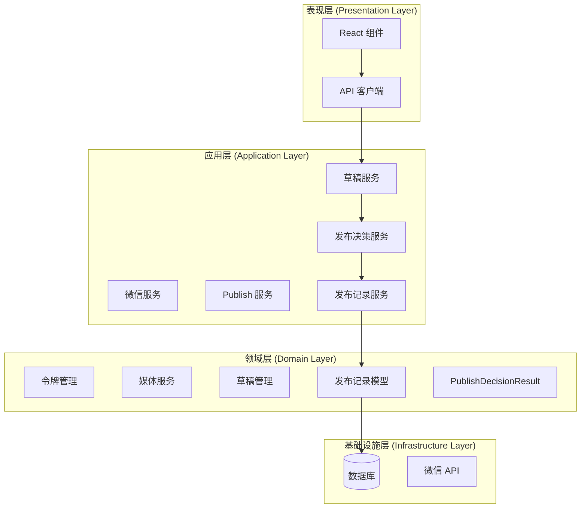
```mermaid
graph TB
subgraph "表现层 (Presentation Layer)"
UI[React 组件]
API[API 客户端]
end
subgraph "应用层 (Application Layer)"
WS[微信服务]
DS[草稿服务]
PS[Publish 服务]
PRS[发布记录服务]
PDS[发布决策服务]
end
subgraph "领域层 (Domain Layer)"
TM[令牌管理]
MS[媒体服务]
DM[草稿管理]
PRM[发布记录模型]
PDR[PublishDecisionResult]
end
subgraph "基础设施层 (Infrastructure Layer)"
DB[(数据库)]
WX[微信 API]
end
UI --> API
API --> DS
DS --> PDS
PDS --> PRS
PRS --> PRM
PRM --> DB
```

**图表来源**
- [wechat_token_service.py:1-163](file://backend/app/services/wechat_token_service.py#L1-163)
- [wechat_media_service.py:1-257](file://backend/app/services/wechat_media_service.py#L1-257)
- [wechat_draft_service.py:1-335](file://backend/app/services/wechat_draft_service.py#L1-335)
- [wechat_publish_service.py:1-345](file://backend/app/services/wechat_publish_service.py#L1-345)
- [publish_record_service.py:1-433](file://backend/app/services/publish_record_service.py#L1-433)
- [publish_decision_service.py:93-126](file://backend/app/services/publish_decision_service.py#L93-126)

### 数据流架构

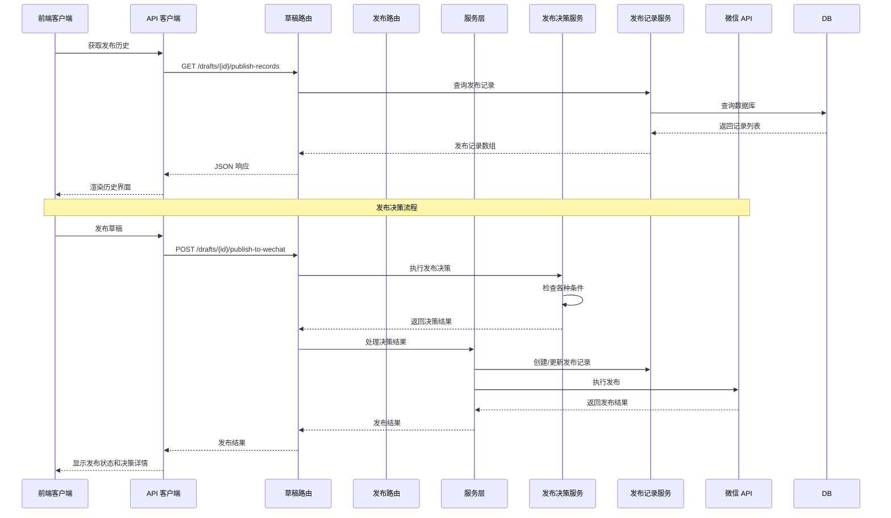
```mermaid
sequenceDiagram
participant Client as 前端客户端
participant API as API 客户端
participant DraftRoute as 草稿路由
participant PublishRoute as 发布路由
participant Service as 服务层
participant DecisionService as 发布决策服务
participant RecordService as 发布记录服务
participant WX as 微信 API
Client->>API : 获取发布历史
API->>DraftRoute : GET /drafts/{id}/publish-records
DraftRoute->>RecordService : 查询发布记录
RecordService->>DB : 查询数据库
DB-->>RecordService : 返回记录列表
RecordService-->>DraftRoute : 发布记录数组
DraftRoute-->>API : JSON 响应
API-->>Client : 渲染历史界面
Note over Client,WX : 发布决策流程
Client->>API : 发布草稿
API->>DraftRoute : POST /drafts/{id}/publish-to-wechat
DraftRoute->>DecisionService : 执行发布决策
DecisionService->>DecisionService : 检查各种条件
DecisionService-->>DraftRoute : 返回决策结果
DraftRoute->>Service : 处理决策结果
Service->>RecordService : 创建/更新发布记录
Service->>WX : 执行发布
WX-->>Service : 返回发布结果
Service-->>DraftRoute : 发布结果
DraftRoute-->>API : 发布结果
API-->>Client : 显示发布状态和决策详情
```

**图表来源**
- [api.ts:670-677](file://frontend/lib/api.ts#L670-677)
- [draft_routes.py:342-441](file://backend/app/api/draft_routes.py#L342-441)
- [publish_record_service.py:265-317](file://backend/app/services/publish_record_service.py#L265-317)
- [publish_decision_service.py:159-177](file://backend/app/services/publish_decision_service.py#L159-177)

**章节来源**
- [main.py:30-39](file://backend/app/main.py#L30-39)
- [wechat_routes.py:21-22](file://backend/app/api/wechat_routes.py#L21-22)

## 详细组件分析

### 前端微信配置页面

微信配置页面是用户与微信集成交互的核心界面，提供了完整的配置管理功能：

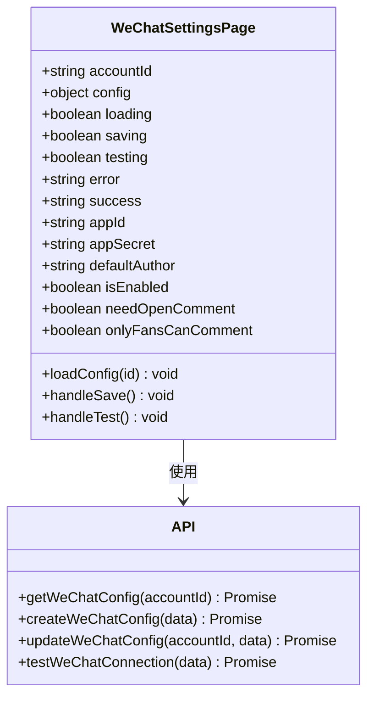
```mermaid
classDiagram
class WeChatSettingsPage {
+string accountId
+object config
+boolean loading
+boolean saving
+boolean testing
+string error
+string success
+string appId
+string appSecret
+string defaultAuthor
+boolean isEnabled
+boolean needOpenComment
+boolean onlyFansCanComment
+loadConfig(id) void
+handleSave() void
+handleTest() void
}
class API {
+getWeChatConfig(accountId) Promise
+createWeChatConfig(data) Promise
+updateWeChatConfig(accountId, data) Promise
+testWeChatConnection(data) Promise
}
WeChatSettingsPage --> API : 使用
```

**图表来源**
- [page.tsx:11-311](file://frontend/app/settings/wechat/[id]/page.tsx#L11-311)
- [api.ts:627-668](file://frontend/lib/api.ts#L627-668)

#### 表单字段设计

| 字段名 | 类型 | 描述 | 验证规则 |
|--------|------|------|----------|
| appId | string | 微信 App ID | 必填，格式验证 |
| appSecret | string | 微信 App Secret | 可选，密码类型 |
| defaultAuthor | string | 默认作者名称 | 可选，长度限制 |
| isEnabled | boolean | 是否启用微信发布 | 必填，布尔值 |
| needOpenComment | boolean | 是否开启评论功能 | 必填，布尔值 |
| onlyFansCanComment | boolean | 仅粉丝可评论 | 必填，布尔值 |

#### 状态管理流程

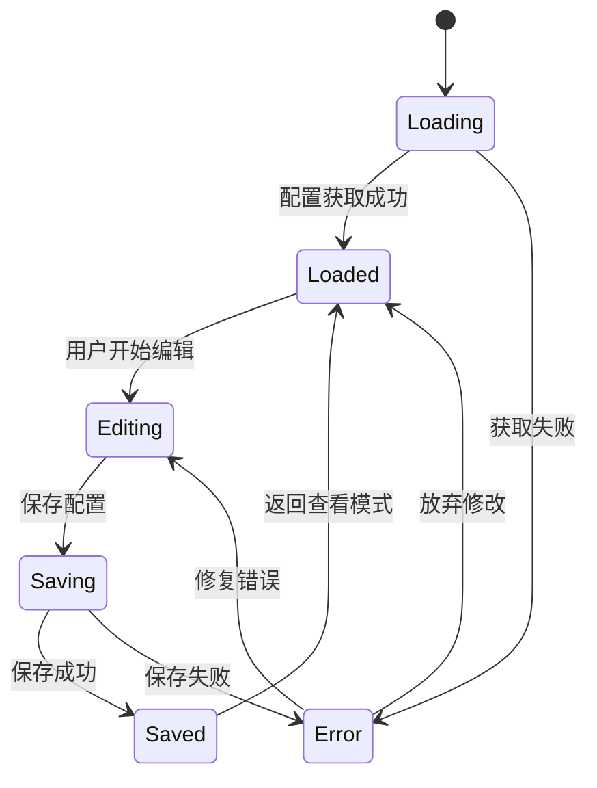
```mermaid
stateDiagram-v2
[*] --> Loading
Loading --> Loaded : 配置获取成功
Loading --> Error : 获取失败
Loaded --> Editing : 用户开始编辑
Editing --> Saving : 保存配置
Saving --> Saved : 保存成功
Saving --> Error : 保存失败
Saved --> Loaded : 返回查看模式
Error --> Editing : 修复错误
Error --> Loaded : 放弃修改
```

**图表来源**
- [page.tsx:35-93](file://frontend/app/settings/wechat/[id]/page.tsx#L35-93)

**章节来源**
- [page.tsx:1-311](file://frontend/app/settings/wechat/[id]/page.tsx#L1-311)
- [index.ts:408-453](file://frontend/types/index.ts#L408-453)

### 前端草稿详情页面

**更新** 草稿详情页面新增了完整的发布历史查看、重试控制和发布保护层决策结果展示功能：

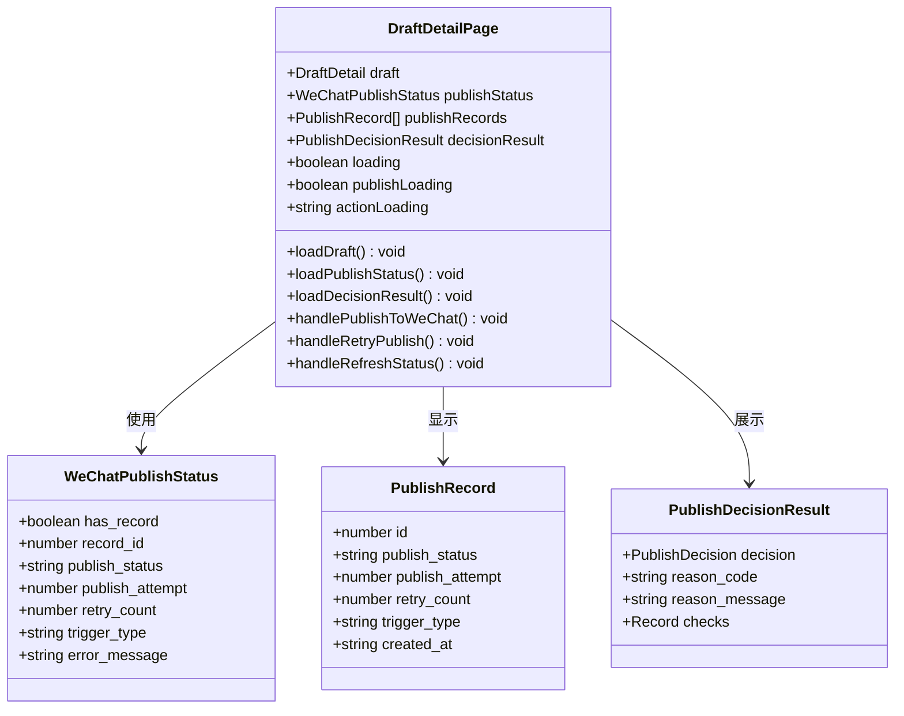
```mermaid
classDiagram
class DraftDetailPage {
+DraftDetail draft
+WeChatPublishStatus publishStatus
+PublishRecord[] publishRecords
+PublishDecisionResult decisionResult
+boolean loading
+boolean publishLoading
+string actionLoading
+loadDraft() void
+loadPublishStatus() void
+loadDecisionResult() void
+handlePublishToWeChat() void
+handleRetryPublish() void
+handleRefreshStatus() void
}
class WeChatPublishStatus {
+boolean has_record
+number record_id
+string publish_status
+number publish_attempt
+number retry_count
+string trigger_type
+string error_message
}
class PublishRecord {
+number id
+string publish_status
+number publish_attempt
+number retry_count
+string trigger_type
+string created_at
}
class PublishDecisionResult {
+PublishDecision decision
+string reason_code
+string reason_message
+Record<string, unknown> checks
}
DraftDetailPage --> WeChatPublishStatus : 使用
DraftDetailPage --> PublishRecord : 显示
DraftDetailPage --> PublishDecisionResult : 展示
```

**图表来源**
- [page.tsx:20-138](file://frontend/app/drafts/[id]/page.tsx#L20-138)
- [index.ts:314-319](file://frontend/types/index.ts#L314-319)

#### 发布决策结果展示

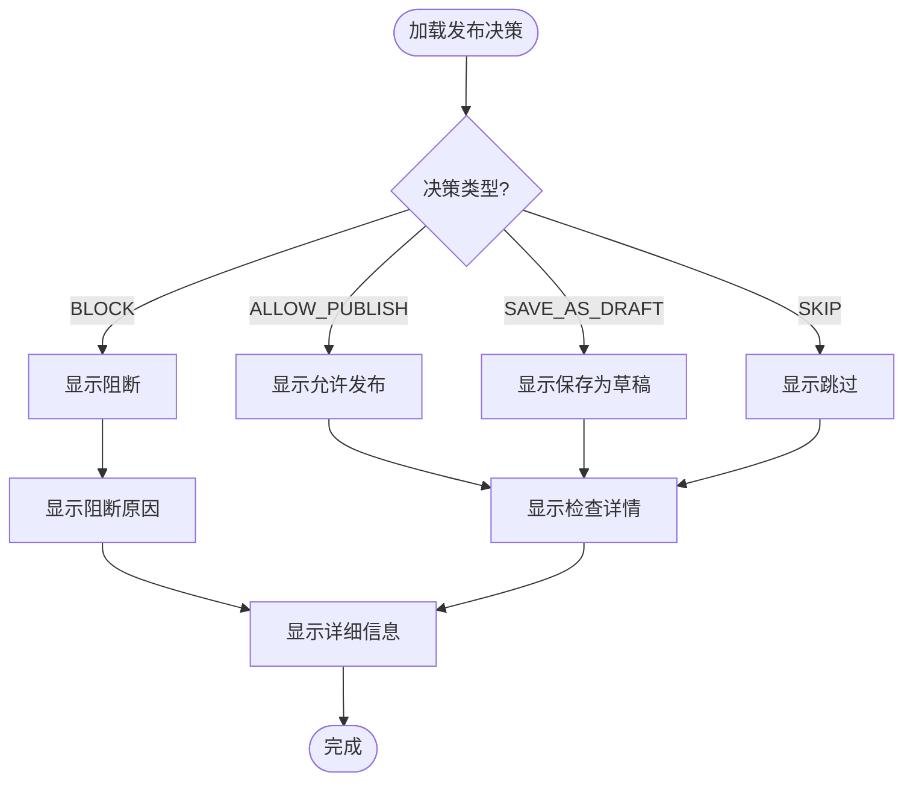
```mermaid
flowchart TD
Start([加载发布决策]) --> CheckDecision{"决策类型?"}
CheckDecision --> |ALLOW_PUBLISH| ShowAllow["显示允许发布"]
CheckDecision --> |SAVE_AS_DRAFT| ShowSave["显示保存为草稿"]
CheckDecision --> |SKIP| ShowSkip["显示跳过"]
CheckDecision --> |BLOCK| ShowBlock["显示阻断"]
ShowAllow --> ShowChecks["显示检查详情"]
ShowSave --> ShowChecks
ShowSkip --> ShowChecks
ShowBlock --> ShowReason["显示阻断原因"]
ShowReason --> ShowMessage["显示详细信息"]
ShowChecks --> ShowMessage
ShowMessage --> End([完成])
```

**图表来源**
- [page.tsx:380-400](file://frontend/app/drafts/[id]/page.tsx#L380-400)

#### 发布历史展示

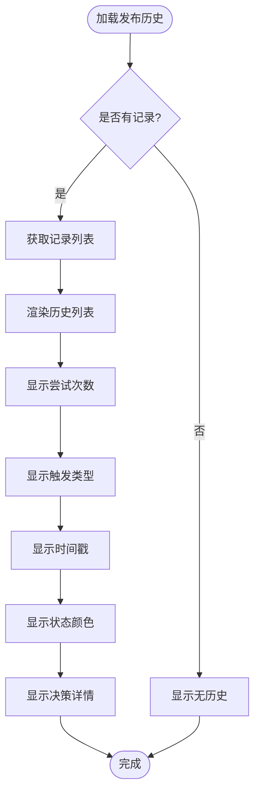
```mermaid
flowchart TD
Start([加载发布历史]) --> CheckRecords{"是否有记录?"}
CheckRecords --> |否| NoHistory["显示无历史"]
CheckRecords --> |是| LoadRecords["获取记录列表"]
LoadRecords --> RenderList["渲染历史列表"]
RenderList --> ShowAttempts["显示尝试次数"]
ShowAttempts --> ShowTrigger["显示触发类型"]
ShowTrigger --> ShowTimestamp["显示时间戳"]
ShowTimestamp --> ShowStatus["显示状态颜色"]
ShowStatus --> ShowDecision["显示决策详情"]
ShowDecision --> End([完成])
NoHistory --> End
```

**图表来源**
- [page.tsx:380-400](file://frontend/app/drafts/[id]/page.tsx#L380-400)

#### 重试控制流程

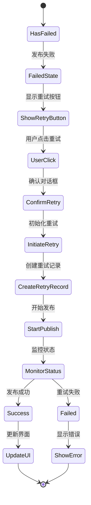
```mermaid
stateDiagram-v2
[*] --> HasFailed
HasFailed --> FailedState : 发布失败
FailedState --> ShowRetryButton : 显示重试按钮
ShowRetryButton --> UserClick : 用户点击重试
UserClick --> ConfirmRetry : 确认对话框
ConfirmRetry --> InitiateRetry : 初始化重试
InitiateRetry --> CreateRetryRecord : 创建重试记录
CreateRetryRecord --> StartPublish : 开始发布
StartPublish --> MonitorStatus : 监控状态
MonitorStatus --> Success : 发布成功
MonitorStatus --> Failed : 重试失败
Success --> UpdateUI : 更新界面
Failed --> ShowError : 显示错误
UpdateUI --> [*]
ShowError --> [*]
```

**图表来源**
- [page.tsx:103-120](file://frontend/app/drafts/[id]/page.tsx#L103-120)
- [draft_routes.py:384-441](file://backend/app/api/draft_routes.py#L384-441)

**章节来源**
- [page.tsx:1-628](file://frontend/app/drafts/[id]/page.tsx#L1-628)
- [index.ts:314-319](file://frontend/types/index.ts#L314-319)

### 前端文章渲染组件

WeChatArticle 组件提供了强大的内容渲染和导出功能：

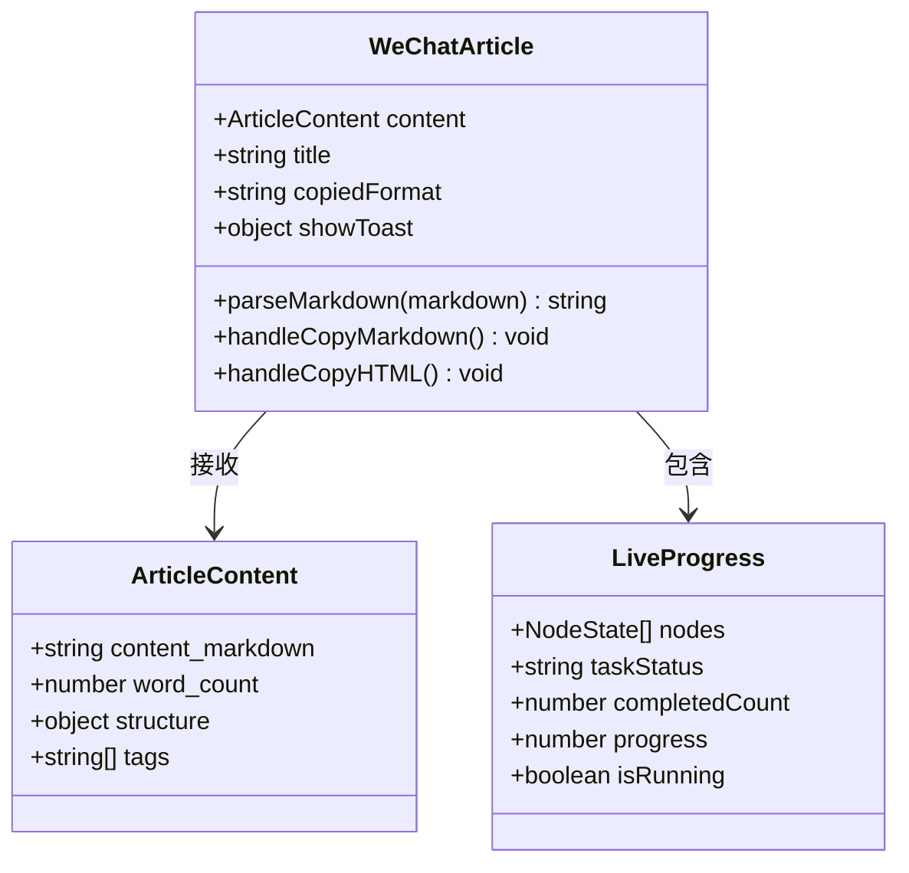
```mermaid
classDiagram
class WeChatArticle {
+ArticleContent content
+string title
+string copiedFormat
+object showToast
+parseMarkdown(markdown) string
+handleCopyMarkdown() void
+handleCopyHTML() void
}
class ArticleContent {
+string content_markdown
+number word_count
+object structure
+string[] tags
}
class LiveProgress {
+NodeState[] nodes
+string taskStatus
+number completedCount
+number progress
+boolean isRunning
}
WeChatArticle --> ArticleContent : 接收
WeChatArticle --> LiveProgress : 包含
```

**图表来源**
- [WeChatArticle.tsx:6-351](file://frontend/components/WeChatArticle.tsx#L6-351)

#### Markdown 解析流程

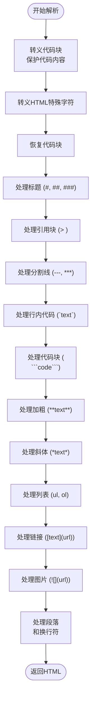
```mermaid
flowchart TD
Start([开始解析]) --> EscapeCode["转义代码块<br/>保护代码内容"]
EscapeCode --> EscapeHTML["转义HTML特殊字符"]
EscapeHTML --> RestoreCode["恢复代码块"]
RestoreCode --> ProcessHeaders["处理标题 (#, ##, ###)"]
ProcessHeaders --> ProcessBlockquotes["处理引用块 (> )"]
ProcessBlockquotes --> ProcessHR["处理分割线 (---, ***)"]
ProcessHR --> ProcessInlineCode["处理行内代码 (`text`)"]
ProcessInlineCode --> ProcessPre["处理代码块 (
```code```)"]
    ProcessPre --> ProcessBold["处理加粗 (**text**)"]
    ProcessBold --> ProcessItalic["处理斜体 (*text*)"]
    ProcessItalic --> ProcessLists["处理列表 (ul, ol)"]
    ProcessLists --> ProcessLinks["处理链接 ([text](url))"]
    ProcessLinks --> ProcessImages["处理图片 (![](url))"]
    ProcessImages --> ProcessParagraphs["处理段落<br/>和换行符"]
    ProcessParagraphs --> End([返回HTML])
```

**图表来源**
- [WeChatArticle.tsx:22-113](file://frontend/components/WeChatArticle.tsx#L22-113)

**章节来源**
- [WeChatArticle.tsx:1-351](file://frontend/components/WeChatArticle.tsx#L1-351)

### 后端服务架构

后端采用服务导向架构，每个服务负责特定的功能领域：

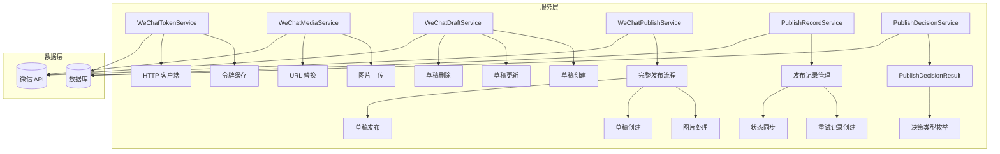
```mermaid
graph TB
subgraph "服务层"
A[WeChatTokenService] --> B[令牌缓存]
A --> C[HTTP 客户端]
D[WeChatMediaService] --> E[图片上传]
D --> F[URL 替换]
G[WeChatDraftService] --> H[草稿创建]
G --> I[草稿更新]
G --> J[草稿删除]
K[WeChatPublishService] --> L[完整发布流程]
L --> M[图片处理]
L --> N[草稿创建]
L --> O[草稿发布]
P[PublishRecordService] --> Q[发布记录管理]
Q --> R[重试记录创建]
Q --> S[状态同步]
T[PublishDecisionService] --> U[PublishDecisionResult]
U --> V[决策类型枚举]
end
subgraph "数据层"
W[(数据库)]
X[(微信 API)]
end
A --> W
D --> X
G --> X
K --> X
P --> W
T --> W
```

**图表来源**
- [wechat_token_service.py:26-163](file://backend/app/services/wechat_token_service.py#L26-163)
- [wechat_media_service.py:25-257](file://backend/app/services/wechat_media_service.py#L25-257)
- [wechat_draft_service.py:23-335](file://backend/app/services/wechat_draft_service.py#L23-335)
- [wechat_publish_service.py:23-345](file://backend/app/services/wechat_publish_service.py#L23-345)
- [publish_record_service.py:30-433](file://backend/app/services/publish_record_service.py#L30-433)
- [publish_decision_service.py:93-126](file://backend/app/services/publish_decision_service.py#L93-126)

#### 访问令牌管理

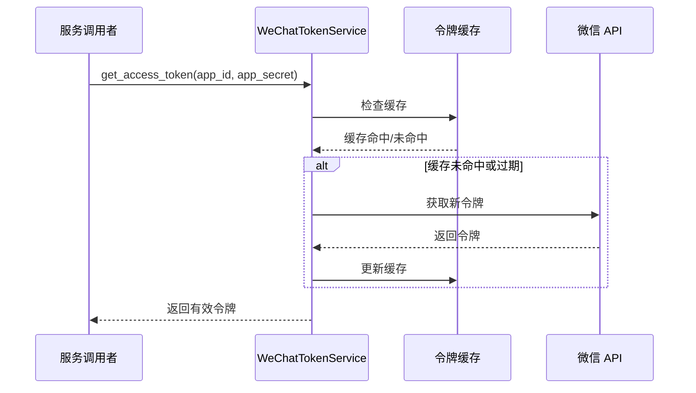
```mermaid
sequenceDiagram
participant Service as 服务调用者
participant TokenService as WeChatTokenService
participant Cache as 令牌缓存
participant WX as 微信 API
Service->>TokenService : get_access_token(app_id, app_secret)
TokenService->>Cache : 检查缓存
Cache-->>TokenService : 缓存命中/未命中
alt 缓存未命中或过期
TokenService->>WX : 获取新令牌
WX-->>TokenService : 返回令牌
TokenService->>Cache : 更新缓存
end
TokenService-->>Service : 返回有效令牌
```

**图表来源**
- [wechat_token_service.py:40-86](file://backend/app/services/wechat_token_service.py#L40-86)

#### 发布决策处理流程

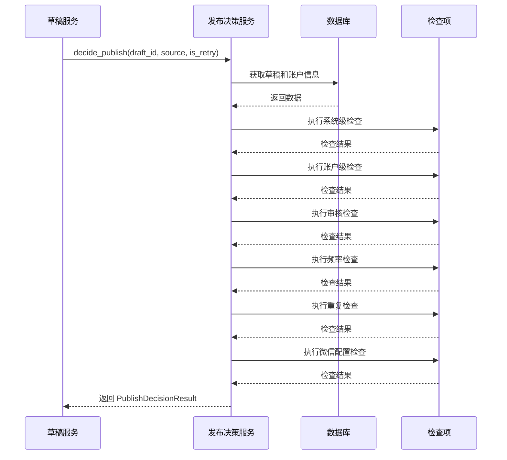
```mermaid
sequenceDiagram
participant Service as 草稿服务
participant DecisionService as 发布决策服务
participant DB as 数据库
participant Checks as 检查项
Service->>DecisionService : decide_publish(draft_id, source, is_retry)
DecisionService->>DB : 获取草稿和账户信息
DB-->>DecisionService : 返回数据
DecisionService->>Checks : 执行系统级检查
Checks-->>DecisionService : 检查结果
DecisionService->>Checks : 执行账户级检查
Checks-->>DecisionService : 检查结果
DecisionService->>Checks : 执行审核检查
Checks-->>DecisionService : 检查结果
DecisionService->>Checks : 执行频率检查
Checks-->>DecisionService : 检查结果
DecisionService->>Checks : 执行重复检查
Checks-->>DecisionService : 检查结果
DecisionService->>Checks : 执行微信配置检查
Checks-->>DecisionService : 检查结果
DecisionService-->>Service : 返回 PublishDecisionResult
```

**图表来源**
- [publish_decision_service.py:159-177](file://backend/app/services/publish_decision_service.py#L159-177)

**章节来源**
- [wechat_token_service.py:1-163](file://backend/app/services/wechat_token_service.py#L1-163)
- [wechat_publish_service.py:1-345](file://backend/app/services/wechat_publish_service.py#L1-345)
- [publish_decision_service.py:93-126](file://backend/app/services/publish_decision_service.py#L93-126)

### 数据模型设计

**更新** 微信配置采用关系型数据库设计，支持完整的配置管理和发布历史记录：

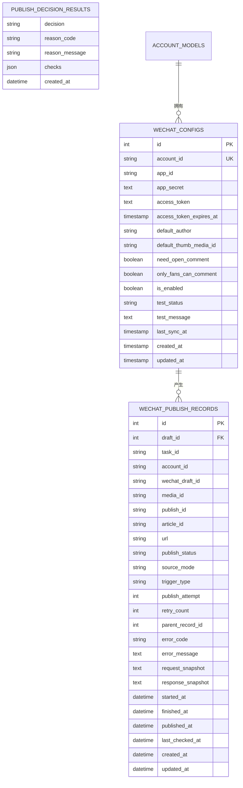
```mermaid
erDiagram
WECHAT_PUBLISH_RECORDS {
int id PK
int draft_id FK
string task_id
string account_id
string wechat_draft_id
string media_id
string publish_id
string article_id
string url
string publish_status
string source_mode
string trigger_type
int publish_attempt
int retry_count
int parent_record_id
string error_code
text error_message
text request_snapshot
text response_snapshot
datetime started_at
datetime finished_at
datetime published_at
datetime last_checked_at
datetime created_at
datetime updated_at
}
PUBLISH_DECISION_RESULTS {
string decision
string reason_code
string reason_message
json checks
datetime created_at
}
WECHAT_CONFIGS {
int id PK
string account_id UK
string app_id
text app_secret
text access_token
timestamp access_token_expires_at
string default_author
string default_thumb_media_id
boolean need_open_comment
boolean only_fans_can_comment
boolean is_enabled
string test_status
text test_message
timestamp last_sync_at
timestamp created_at
timestamp updated_at
}
ACCOUNT_MODELS ||--o{ WECHAT_CONFIGS : "拥有"
WECHAT_CONFIGS ||--o{ WECHAT_PUBLISH_RECORDS : "产生"
```

**图表来源**
- [wechat_config.py:10-100](file://backend/app/models/wechat_config.py#L10-100)
- [publish_decision_service.py:93-126](file://backend/app/services/publish_decision_service.py#L93-126)

**章节来源**
- [wechat_config.py:1-100](file://backend/app/models/wechat_config.py#L1-100)
- [publish_decision_service.py:93-126](file://backend/app/services/publish_decision_service.py#L93-126)

## 发布保护层与决策结果

### 发布决策模型

**新增** 发布决策模型提供了结构化的决策结果：

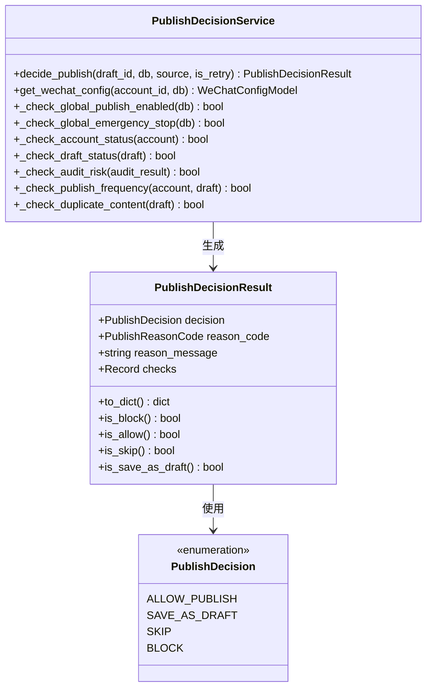
```mermaid
classDiagram
class PublishDecision {
<<enumeration>>
ALLOW_PUBLISH
SAVE_AS_DRAFT
SKIP
BLOCK
}
class PublishDecisionResult {
+PublishDecision decision
+PublishReasonCode reason_code
+string reason_message
+Record<string, unknown> checks
+to_dict() dict
+is_block() bool
+is_allow() bool
+is_skip() bool
+is_save_as_draft() bool
}
class PublishDecisionService {
+decide_publish(draft_id, db, source, is_retry) PublishDecisionResult
+get_wechat_config(account_id, db) WeChatConfigModel
+_check_global_publish_enabled(db) bool
+_check_global_emergency_stop(db) bool
+_check_account_status(account) bool
+_check_draft_status(draft) bool
+_check_audit_risk(audit_result) bool
+_check_publish_frequency(account, draft) bool
+_check_duplicate_content(draft) bool
}
PublishDecisionResult --> PublishDecision : 使用
PublishDecisionService --> PublishDecisionResult : 生成
```

**图表来源**
- [publish_decision_service.py:93-126](file://backend/app/services/publish_decision_service.py#L93-126)
- [publish_decision_service.py:128-146](file://backend/app/services/publish_decision_service.py#L128-146)

### 发布决策类型定义

**新增** 前端类型定义支持发布决策结果的类型安全：

```mermaid
classDiagram
class PublishDecision {
<<type>>
"ALLOW_PUBLISH"
"SAVE_AS_DRAFT"
"SKIP"
"BLOCK"
}
class PublishDecisionResult {
+PublishDecision decision
+string reason_code
+string reason_message
+Record<string, unknown> checks
}
PublishDecision --> PublishDecisionResult : 枚举值
```

**图表来源**
- [index.ts:311-319](file://frontend/types/index.ts#L311-319)

### 决策结果处理流程

**新增** 系统支持多种决策类型的处理：

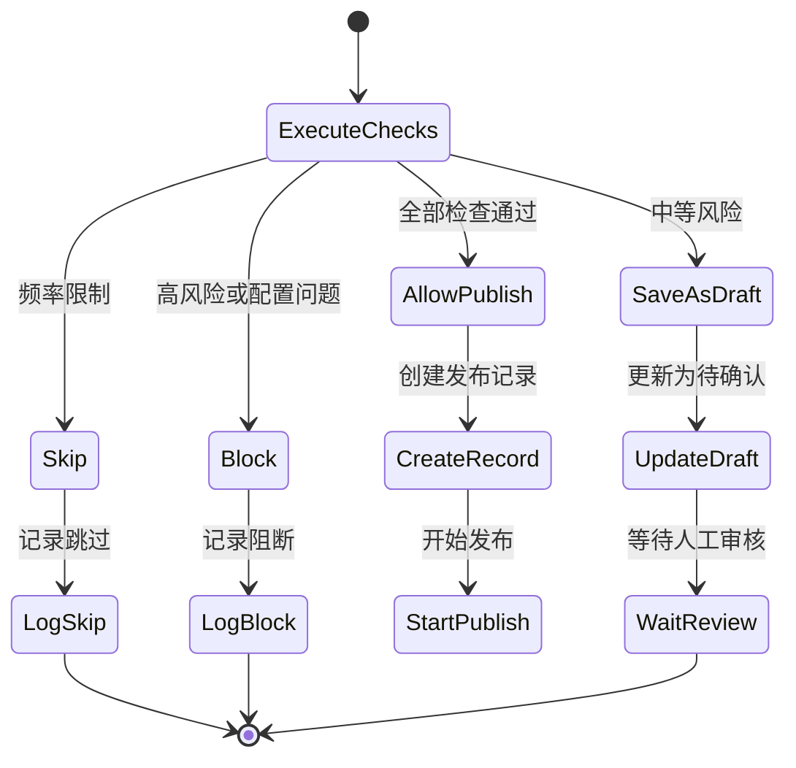
```mermaid
stateDiagram-v2
[*] --> ExecuteChecks
ExecuteChecks --> AllowPublish : 全部检查通过
ExecuteChecks --> SaveAsDraft : 中等风险
ExecuteChecks --> Skip : 频率限制
ExecuteChecks --> Block : 高风险或配置问题
AllowPublish --> CreateRecord : 创建发布记录
SaveAsDraft --> UpdateDraft : 更新为待确认
Skip --> LogSkip : 记录跳过
Block --> LogBlock : 记录阻断
CreateRecord --> StartPublish : 开始发布
UpdateDraft --> WaitReview : 等待人工审核
LogSkip --> [*]
LogBlock --> [*]
WaitReview --> [*]
```

**图表来源**
- [draft_service.py:341-378](file://backend/app/services/draft_service.py#L341-378)

### 发布决策结果展示

**新增** 前端提供完整的发布决策结果展示功能：

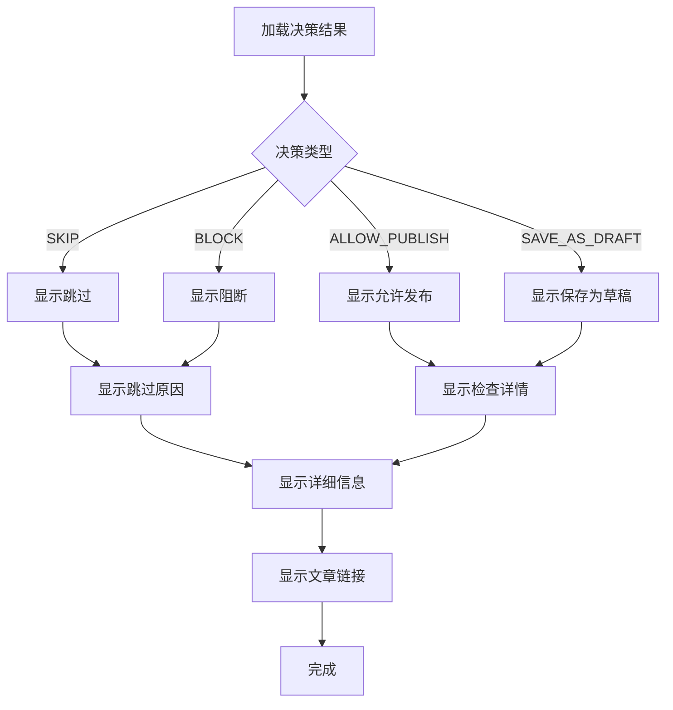
```mermaid
flowchart TD
LoadDecision[加载决策结果] --> CheckDecision{决策类型}
CheckDecision --> |ALLOW_PUBLISH| ShowAllow["显示允许发布"]
CheckDecision --> |SAVE_AS_DRAFT| ShowSave["显示保存为草稿"]
CheckDecision --> |SKIP| ShowSkip["显示跳过"]
CheckDecision --> |BLOCK| ShowBlock["显示阻断"]
ShowAllow --> ShowChecks["显示检查详情"]
ShowSave --> ShowChecks
ShowSkip --> ShowReason["显示跳过原因"]
ShowBlock --> ShowReason
ShowReason --> ShowMessage["显示详细信息"]
ShowChecks --> ShowMessage
ShowMessage --> ShowURL[显示文章链接]
ShowURL --> Complete[完成]
```

**图表来源**
- [page.tsx:380-400](file://frontend/app/drafts/[id]/page.tsx#L380-400)

**章节来源**
- [publish_decision_service.py:93-126](file://backend/app/services/publish_decision_service.py#L93-126)
- [draft_service.py:333-378](file://backend/app/services/draft_service.py#L333-378)
- [index.ts:311-319](file://frontend/types/index.ts#L311-319)

## 发布历史与重试功能

### 发布记录模型

**新增** 发布记录模型支持完整的发布历史追踪：

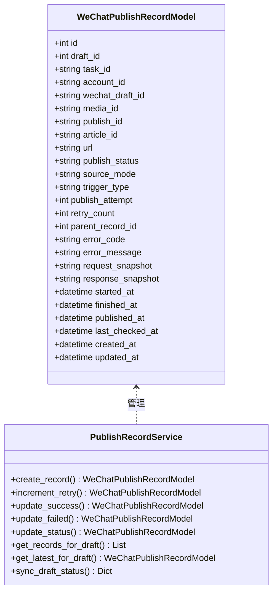
```mermaid
classDiagram
class WeChatPublishRecordModel {
+int id
+int draft_id
+string task_id
+string account_id
+string wechat_draft_id
+string media_id
+string publish_id
+string article_id
+string url
+string publish_status
+string source_mode
+string trigger_type
+int publish_attempt
+int retry_count
+int parent_record_id
+string error_code
+string error_message
+string request_snapshot
+string response_snapshot
+datetime started_at
+datetime finished_at
+datetime published_at
+datetime last_checked_at
+datetime created_at
+datetime updated_at
}
class PublishRecordService {
+create_record() WeChatPublishRecordModel
+increment_retry() WeChatPublishRecordModel
+update_success() WeChatPublishRecordModel
+update_failed() WeChatPublishRecordModel
+update_status() WeChatPublishRecordModel
+get_records_for_draft() List
+get_latest_for_draft() WeChatPublishRecordModel
+sync_draft_status() Dict
}
WeChatPublishRecordModel <.. PublishRecordService : 管理
```

**图表来源**
- [wechat_config.py:50-100](file://backend/app/models/wechat_config.py#L50-100)
- [publish_record_service.py:30-433](file://backend/app/services/publish_record_service.py#L30-433)

### 发布历史查看

**新增** 前端提供完整的发布历史查看功能：

```mermaid
flowchart TD
LoadDraft[加载草稿] --> CheckStatus[检查发布状态]
CheckStatus --> HasRecord{有发布记录?}
HasRecord --> |是| LoadRecords[加载发布记录]
HasRecord --> |否| ShowBasic[显示基础状态]
LoadRecords --> RenderHistory[渲染历史列表]
RenderHistory --> ShowAttempt[显示尝试次数]
ShowAttempt --> ShowTrigger[显示触发类型]
ShowTrigger --> ShowStatus[显示状态颜色]
ShowStatus --> ShowDecision[显示决策详情]
ShowDecision --> ShowError[显示错误信息]
ShowError --> ShowURL[显示文章链接]
ShowURL --> Complete[完成]
ShowBasic --> Complete
```

**图表来源**
- [page.tsx:380-400](file://frontend/app/drafts/[id]/page.tsx#L380-400)
- [draft_routes.py:342-381](file://backend/app/api/draft_routes.py#L342-381)

### 重试控制机制

**新增** 系统支持多种重试场景：

```mermaid
stateDiagram-v2
[*] --> Pending
Pending --> Publishing : 开始发布
Publishing --> Published : 发布成功
Publishing --> Failed : 发布失败
Failed --> ManualRetry : 手动重试
ManualRetry --> Pending : 创建重试记录
AutoRetry --> Pending : 自动重试
ManualRetry --> MaxRetries : 达到最大重试次数
MaxRetries --> Failed : 标记失败
Published --> [*]
```

**图表来源**
- [publish_record_service.py:265-317](file://backend/app/services/publish_record_service.py#L265-317)
- [draft_routes.py:384-441](file://backend/app/api/draft_routes.py#L384-441)

### 发布状态刷新

**新增** 支持手动刷新微信发布状态：

```mermaid
sequenceDiagram
participant Client as 前端客户端
participant API as API 客户端
participant RefreshRoute as 刷新路由
participant RecordService as 发布记录服务
participant WX as 微信 API
Client->>API : 刷新发布状态
API->>RefreshRoute : POST /wechat/publish-records/{id}/refresh-status
RefreshRoute->>RecordService : 获取记录
RecordService->>DB : 查询数据库
DB-->>RecordService : 返回记录
RecordService->>WX : 查询微信状态
WX-->>RecordService : 返回最新状态
RecordService->>RecordService : 更新本地状态
RecordService->>DB : 写入数据库
RefreshRoute-->>API : 刷新结果
API-->>Client : 显示最新状态
```

**图表来源**
- [wechat_routes.py:246-348](file://backend/app/api/wechat_routes.py#L246-348)
- [publish_record_service.py:225-263](file://backend/app/services/publish_record_service.py#L225-263)

**章节来源**
- [publish_record_service.py:1-433](file://backend/app/services/publish_record_service.py#L1-433)
- [draft_routes.py:342-441](file://backend/app/api/draft_routes.py#L342-441)
- [wechat_routes.py:246-348](file://backend/app/api/wechat_routes.py#L246-348)

## 路由参数访问改进

**更新** 前端路由参数访问采用了现代化的Next.js 16 useParams模式，提升了代码的可靠性和可读性：

### useParams模式的优势

```mermaid
flowchart TD
Start([路由参数访问]) --> OldMethod["传统 Promise 处理"]
OldMethod --> ModernMethod["Next.js 16 useParams 模式"]
ModernMethod --> TypeSafety["类型安全"]
ModernMethod --> Reliability["可靠性提升"]
ModernMethod --> Readability["代码可读性"]
ModernMethod --> AsyncSupport["异步支持"]
ModernMethod --> ErrorHandling["错误处理"]
```

### 微信配置页面路由参数访问

```typescript
// 更新前的Promise处理方式
const params = await router.query;
const accountId = params.id;

// 更新后的useParams模式
const params = useParams<{ id: string }>();
const accountId = params?.id ?? "";
```

### 草稿详情页面路由参数访问

```typescript
// 更新前的Promise处理方式
const params = await router.query;
const draftId = Number(params.id);

// 更新后的useParams模式
const params = useParams();
const draftId = Number(params.id);
```

### 路由参数类型定义

```typescript
// useParams的类型定义
interface RouteParams {
  id: string;
}

// 在组件中使用
const params = useParams<RouteParams>();
const accountId = params?.id ?? "";
```

### 错误处理改进

```mermaid
stateDiagram-v2
[*] --> ParamsAccess
ParamsAccess --> CheckParams{"参数是否存在?"}
CheckParams --> |存在| SafeAccess["安全访问参数"]
CheckParams --> |不存在| DefaultFallback["默认值回退"]
SafeAccess --> TypeConversion["类型转换"]
DefaultFallback --> TypeConversion
TypeConversion --> Success["参数可用"]
Success --> [*]
```

### 性能优化

- **即时访问**：useParams提供即时的路由参数访问，无需等待Promise解析
- **类型推断**：编译时类型检查，减少运行时错误
- **内存效率**：避免Promise对象的额外内存开销
- **渲染优化**：更高效的组件渲染和更新机制

**章节来源**
- [page.tsx:8-22](file://frontend/app/settings/wechat/[id]/page.tsx#L8-L22)
- [page.tsx:20-22](file://frontend/app/drafts/[id]/page.tsx#L20-L22)

## 依赖关系分析

系统采用模块化设计，各组件间依赖关系清晰：

```mermaid
graph TB
subgraph "前端依赖"
A[api.ts] --> B[types/index.ts]
C[page.tsx - 设置页] --> A
C --> D[WeChatArticle.tsx]
E[page.tsx - 草稿页] --> A
F[WeChatArticle.tsx] --> B
end
subgraph "后端依赖"
G[wechat_routes.py] --> H[wechat_config.py]
G --> I[wechat.py]
G --> J[wechat_token_service.py]
K[draft_routes.py] --> L[publish_record_service.py]
M[wechat_publish_service.py] --> J
M --> N[wechat_media_service.py]
M --> O[wechat_draft_service.py]
P[wechat_token_service.py] --> Q[httpx]
N --> Q
O --> Q
M --> Q
L --> R[SQLAlchemy]
S[httpx] --> T[异步客户端]
U[publish_decision_service.py] --> V[PublishDecisionResult]
end
subgraph "外部依赖"
W[FastAPI]
X[SQLAlchemy]
Y[httpx]
Z[Pydantic]
AA[异步数据库]
BB[PublishDecisionResult]
end
A --> W
G --> W
K --> W
H --> X
I --> Z
J --> Y
L --> AA
U --> BB
```

**图表来源**
- [api.ts:18-40](file://frontend/lib/api.ts#L18-40)
- [page.tsx:3-5](file://frontend/app/drafts/[id]/page.tsx#L3-5)
- [wechat_routes.py:3-19](file://backend/app/api/wechat_routes.py#L3-19)
- [draft_routes.py:1-25](file://backend/app/api/draft_routes.py#L1-25)
- [wechat_token_service.py:9-15](file://backend/app/services/wechat_token_service.py#L9-15)
- [publish_decision_service.py:93-126](file://backend/app/services/publish_decision_service.py#L93-126)

### 错误处理机制

系统实现了多层次的错误处理策略：

```mermaid
flowchart TD
Start([请求开始]) --> Validate["参数验证"]
Validate --> Valid{"验证通过?"}
Valid --> |否| ValidationError["返回验证错误"]
Valid --> |是| Process["处理业务逻辑"]
Process --> Success{"操作成功?"}
Success --> |否| BusinessError["业务错误处理"]
Success --> |是| Cache["更新缓存"]
Cache --> Response["返回成功响应"]
BusinessError --> ErrorType{"错误类型?"}
ErrorType --> |WeChatTokenError| TokenError["令牌错误"]
ErrorType --> |WeChatMediaError| MediaError["媒体错误"]
ErrorType --> |WeChatDraftError| DraftError["草稿错误"]
ErrorType --> |WeChatPublishError| PublishError["发布错误"]
ErrorType --> |PublishRecordError| RecordError["发布记录错误"]
ErrorType --> |PublishDecisionError| DecisionError["发布决策错误"]
TokenError --> ErrorResponse["返回错误响应"]
MediaError --> ErrorResponse
DraftError --> ErrorResponse
PublishError --> ErrorResponse
RecordError --> ErrorResponse
DecisionError --> ErrorResponse
ValidationError --> ErrorResponse
ErrorResponse --> End([结束])
Response --> End
```

**图表来源**
- [wechat_token_service.py:21-23](file://backend/app/services/wechat_token_service.py#L21-23)
- [wechat_media_service.py:20-22](file://backend/app/services/wechat_media_service.py#L20-22)
- [wechat_draft_service.py:18-20](file://backend/app/services/wechat_draft_service.py#L18-20)
- [wechat_publish_service.py:18-20](file://backend/app/services/wechat_publish_service.py#L18-20)
- [publish_record_service.py:25-27](file://backend/app/services/publish_record_service.py#L25-27)
- [publish_decision_service.py:84-91](file://backend/app/services/publish_decision_service.py#L84-91)

**章节来源**
- [api.ts:53-64](file://frontend/lib/api.ts#L53-64)
- [wechat_routes.py:186-198](file://backend/app/api/wechat_routes.py#L186-198)

## 性能考虑

### 缓存策略

系统实现了多级缓存机制来优化性能：

1. **令牌缓存** (`wechat_token_service.py`)
   - 模块级内存缓存
   - 提前5分钟刷新机制
   - 线程安全设计

2. **响应缓存** (`frontend/lib/api.ts`)
   - 统一的请求缓存机制
   - 自动去重和失效处理

3. **发布记录缓存** (`publish_record_service.py`)
   - **新增：发布记录查询缓存**
   - 支持最新记录快速获取

4. **发布决策缓存** (`publish_decision_service.py`)
   - **新增：决策结果缓存**
   - 支持重复决策的快速返回

### 异步处理

```mermaid
sequenceDiagram
participant Client as 客户端
participant API as API 客户端
participant Service as 服务层
participant Cache as 缓存层
participant DB as 数据库
participant WX as 微信 API
Client->>API : 发起异步请求
API->>Service : 异步处理
Service->>Cache : 检查缓存
alt 缓存命中
Cache-->>Service : 返回缓存数据
else 缓存未命中
Service->>DB : 查询数据库
DB-->>Service : 返回数据库数据
Service->>WX : 调用微信 API
WX-->>Service : 返回 API 数据
Service->>Cache : 写入缓存
end
Service-->>API : 返回处理结果
API-->>Client : 异步响应
```

**图表来源**
- [wechat_token_service.py:62-85](file://backend/app/services/wechat_token_service.py#L62-85)
- [api.ts:53-64](file://frontend/lib/api.ts#L53-64)

### 并发控制

系统通过以下机制控制并发访问：

- **令牌服务**：全局单例模式，避免重复获取
- **HTTP 客户端**：使用异步客户端，支持并发请求
- **数据库连接**：使用连接池，限制最大连接数
- **发布记录服务**：**新增：支持并发重试记录创建**
- **发布决策服务**：**新增：支持并发决策处理**

### 路由参数访问优化

**更新** useParams模式带来的性能提升：

- **即时响应**：避免Promise解析的等待时间
- **类型安全**：编译时类型检查，减少运行时错误
- **内存效率**：减少Promise对象的内存占用
- **渲染性能**：更高效的组件更新机制
- **开发体验**：更好的TypeScript支持和IDE提示

## 故障排除指南

### 常见问题及解决方案

#### 1. 微信连接测试失败

**症状**：连接测试返回失败

**可能原因**：
- AppID 或 AppSecret 错误
- 网络连接问题
- 微信 API 服务不可用

**解决步骤**：
1. 验证 AppID 和 AppSecret 格式
2. 检查网络连接状态
3. 查看后端日志获取详细错误信息

#### 2. 图片上传失败

**症状**：文章中的图片无法正确显示

**可能原因**：
- 外部图片链接不可访问
- 微信 API 上传限制
- 图片格式不支持

**解决步骤**：
1. 检查图片 URL 可访问性
2. 验证图片格式是否在支持列表中
3. 查看上传日志获取具体错误

#### 3. 草稿发布超时

**症状**：发布操作长时间无响应

**可能原因**：
- 徑 API 响应慢
- 网络延迟
- 令牌过期

**解决步骤**：
1. 检查网络连接质量
2. 验证访问令牌有效性
3. 查看后端超时日志

#### 4. 发布历史查看失败

**症状**：发布历史页面无法加载

**可能原因**：
- 数据库连接问题
- 发布记录不存在
- 权限不足

**解决步骤**：
1. 检查数据库连接状态
2. 验证草稿 ID 有效性
3. 查看后端日志获取详细错误信息

#### 5. 发布决策结果展示异常

**症状**：发布决策结果无法正确显示

**可能原因**：
- 前端类型定义不匹配
- 后端决策结果格式变化
- 网络传输错误

**解决步骤**：
1. 检查前端类型定义是否最新
2. 验证后端返回的数据格式
3. 查看网络请求和响应
4. 检查浏览器控制台错误

#### 6. 重试发布失败

**症状**：重试按钮点击无效或报错

**可能原因**：
- 已达到最大重试次数
- 发布记录状态不支持重试
- 微信 API 调用失败

**解决步骤**：
1. 检查当前重试次数
2. 验证发布记录状态
3. 查看重试日志获取具体错误

#### 7. 路由参数访问问题

**症状**：路由参数获取失败或类型错误

**可能原因**：
- useParams模式使用不当
- 类型定义缺失
- 参数未正确传递

**解决步骤**：
1. 检查useParams的类型定义
2. 验证路由参数的传递方式
3. 查看TypeScript编译错误
4. 确保参数的可选性处理

**章节来源**
- [wechat_token_service.py:127-135](file://backend/app/services/wechat_token_service.py#L127-135)
- [wechat_media_service.py:96-105](file://backend/app/services/wechat_media_service.py#L96-105)
- [wechat_publish_service.py:190-199](file://backend/app/services/wechat_publish_service.py#L190-199)
- [publish_record_service.py:286-289](file://backend/app/services/publish_record_service.py#L286-289)
- [publish_decision_service.py:84-91](file://backend/app/services/publish_decision_service.py#L84-91)

### 调试工具和技巧

1. **前端调试**：使用浏览器开发者工具检查网络请求
2. **后端日志**：查看结构化日志获取详细错误信息
3. **状态监控**：通过 SSE 流查看实时状态更新
4. **缓存检查**：验证令牌和响应缓存状态
5. **发布记录检查**：验证发布历史数据完整性
6. **决策结果检查**：验证发布决策数据结构
7. **路由参数调试**：使用console.log检查useParams返回值
8. **类型检查**：利用TypeScript的类型推断功能

## 结论

HotClaw 项目的前端微信集成功现了完整的微信公众号内容发布解决方案。**更新后的版本**增加了发布保护层决策结果展示、发布历史查看、重试控制和状态刷新功能，同时采用了现代化的Next.js 16 useParams模式，显著提升了路由参数访问的可靠性和代码可读性。

### 主要优势

1. **模块化设计**：前后端分离，职责明确
2. **安全性**：敏感信息加密存储，令牌自动管理
3. **可靠性**：多重错误处理和重试机制
4. **可扩展性**：插件化架构，易于功能扩展
5. **用户体验**：直观的界面设计和实时反馈
6. **现代化技术栈**：采用Next.js 16的useParams模式
7. **类型安全**：完整的TypeScript支持
8. **性能优化**：即时路由参数访问，提升渲染效率

### 技术亮点

- **异步架构**：支持高并发和实时更新
- **缓存优化**：智能缓存策略提升性能
- **错误处理**：全面的异常捕获和恢复机制
- **监控追踪**：完整的日志记录和状态跟踪
- **路由参数优化**：useParams模式提升开发体验
- **类型推断**：编译时类型检查确保代码质量
- **现代化UI**：基于Next.js 16的组件架构

### 功能增强

**新增功能特性**：
- 发布保护层决策结果展示：用户可以查看详细的发布决策信息
- 发布决策状态可视化：不同类型决策的直观展示
- 发布历史查看：用户可以查看完整的发布尝试记录
- 重试控制：支持手动触发重试和自动重试机制
- 状态刷新：支持手动同步微信发布状态
- 最大重试限制：防止无限重试，最多3次重试
- 触发类型追踪：区分手动、自动和重试触发类型
- 决策检查详情：显示具体的检查条件和结果
- **路由参数访问优化**：useParams模式替代Promise处理
- **类型安全保证**：编译时类型检查确保参数正确性

该集成方案为微信公众号的内容创作和发布提供了完整的技术支撑，具备良好的可维护性和扩展性，能够满足不同规模企业的需求。**更新后的版本**显著提升了系统的可靠性和用户体验，为内容发布提供了更加完善的保障。现代化的路由参数访问模式不仅提升了代码的可读性，还为未来的功能扩展奠定了坚实的基础。