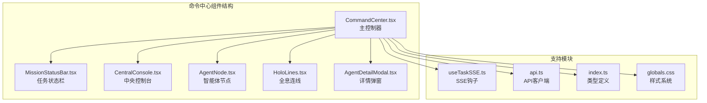
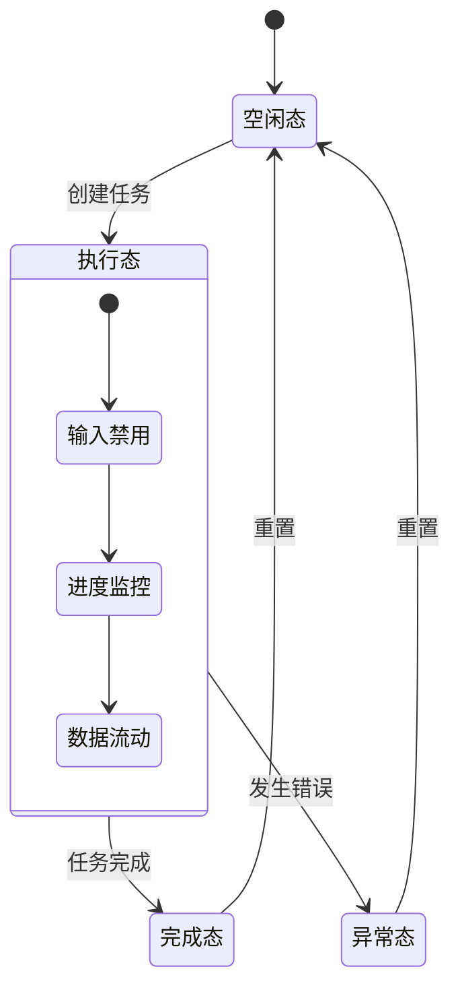
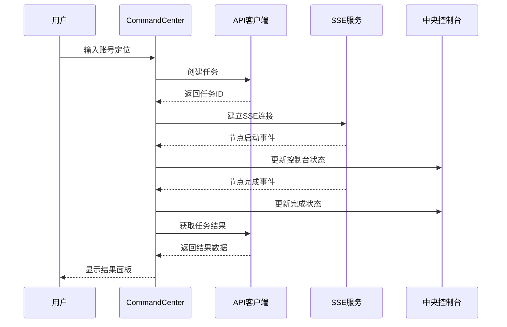
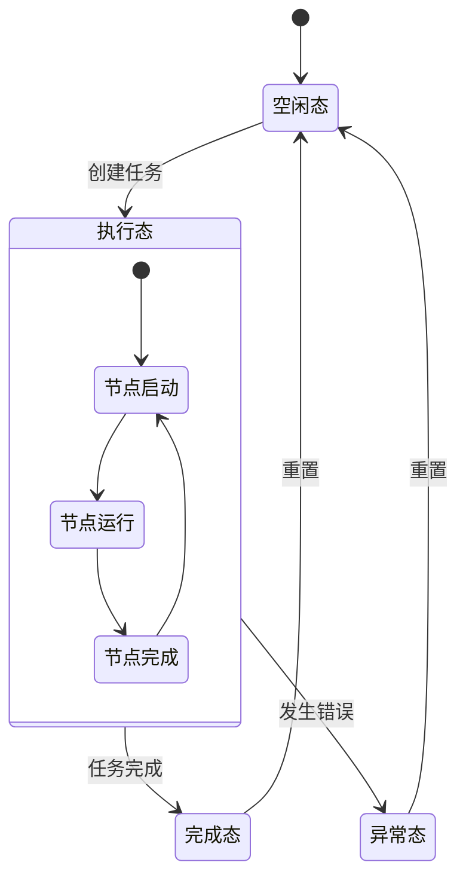
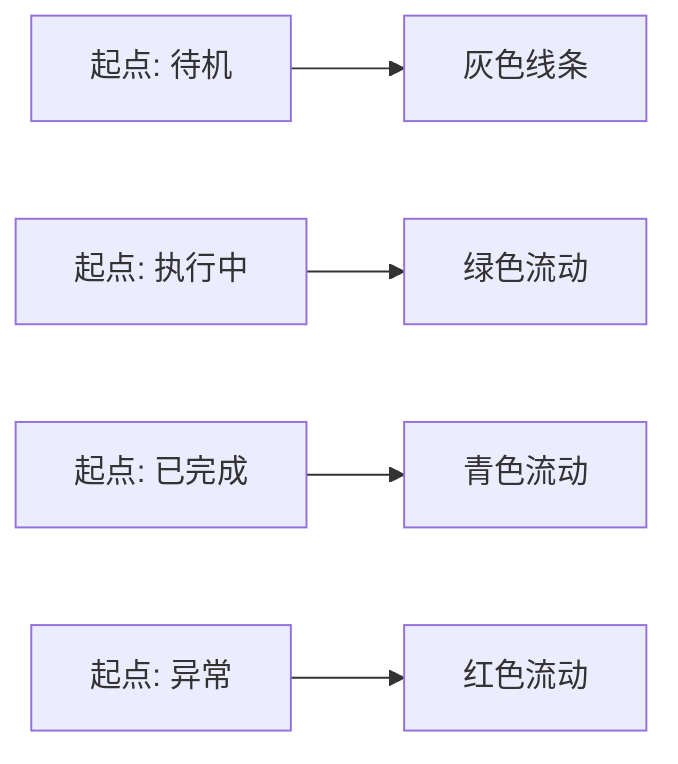
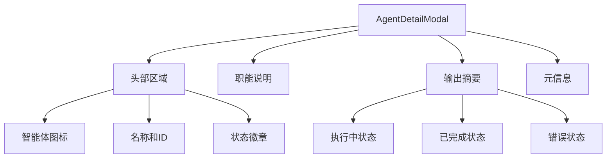
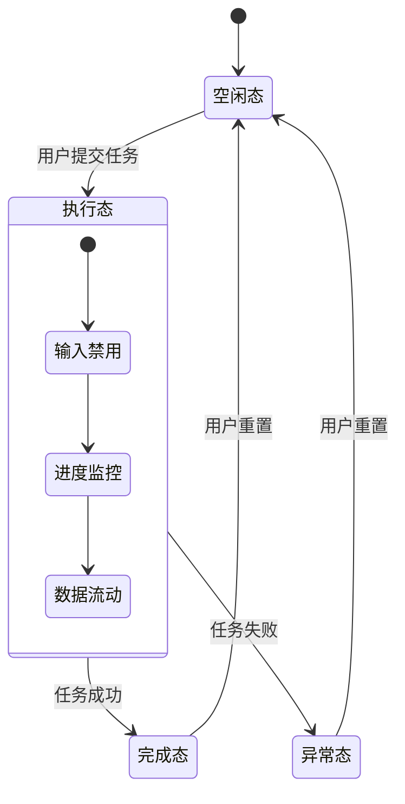
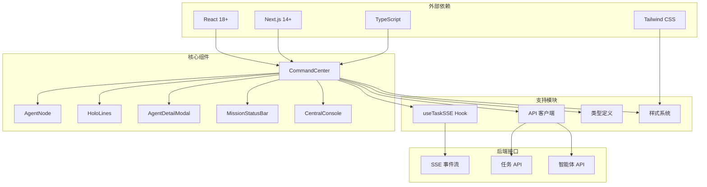
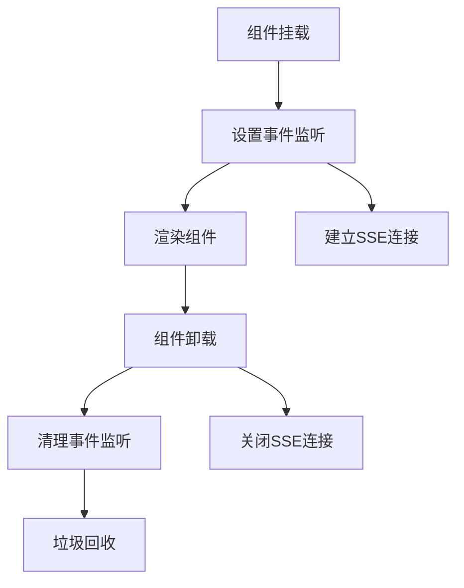
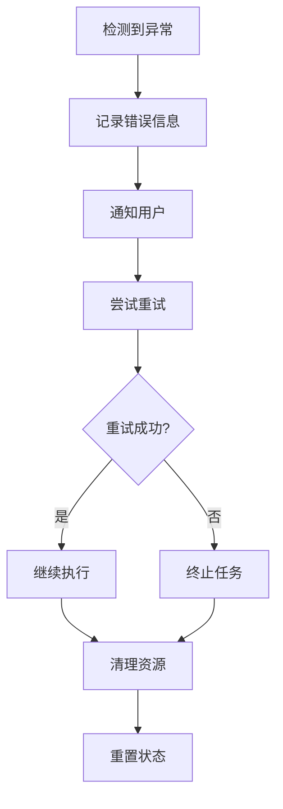

# 命令中心界面

<cite>
**本文档引用的文件**
- [CommandCenter.tsx](file://frontend/components/command-center/CommandCenter.tsx)
- [AgentNode.tsx](file://frontend/components/command-center/AgentNode.tsx)
- [HoloLines.tsx](file://frontend/components/command-center/HoloLines.tsx)
- [AgentDetailModal.tsx](file://frontend/components/command-center/AgentDetailModal.tsx)
- [MissionStatusBar.tsx](file://frontend/components/command-center/MissionStatusBar.tsx)
- [CentralConsole.tsx](file://frontend/components/command-center/CentralConsole.tsx)
- [useTaskSSE.ts](file://frontend/hooks/useTaskSSE.ts)
- [api.ts](file://frontend/lib/api.ts)
- [index.ts](file://frontend/types/index.ts)
- [globals.css](file://frontend/app/globals.css)
</cite>

## 更新摘要
**所做更改**
- 更新界面设计理念说明，反映从深空主题到简洁控制台设计的转变
- 移除环形智能体布局和全息连线的相关描述
- 更新组件架构分析，反映新的三态展示设计
- 修正视觉层次控制说明，删除主节点高亮和次节点淡化功能
- 更新性能考虑章节，移除视觉层次控制的性能优化说明

## 目录
1. [简介](#简介)
2. [项目结构](#项目结构)
3. [核心组件](#核心组件)
4. [架构概览](#架构概览)
5. [详细组件分析](#详细组件分析)
6. [依赖关系分析](#依赖关系分析)
7. [性能考虑](#性能考虑)
8. [故障排除指南](#故障排除指南)
9. [结论](#结论)

## 简介

命令中心界面是 HotClaw 内容创作平台的核心交互界面，采用简洁的控制台设计理念，模拟现代 SaaS 控制台的工作流程。该界面通过中央控制台展示任务创建和状态监控，提供直观的任务执行流程体验。

界面采用现代化的 React + TypeScript 架构，结合 SSE（Server-Sent Events）实现实时状态更新，为用户提供流畅的任务执行监控体验。

**更新** 界面设计理念已从深空主题的沉浸式体验转变为简洁实用的控制台设计，更加注重功能性和易用性

## 项目结构

命令中心界面位于前端项目的 `components/command-center` 目录下，包含以下核心组件：



**图表来源**
- [CommandCenter.tsx:1-318](file://frontend/components/command-center/CommandCenter.tsx#L1-L318)
- [MissionStatusBar.tsx:1-205](file://frontend/components/command-center/MissionStatusBar.tsx#L1-L205)
- [CentralConsole.tsx:1-297](file://frontend/components/command-center/CentralConsole.tsx#L1-L297)

**章节来源**
- [CommandCenter.tsx:1-318](file://frontend/components/command-center/CommandCenter.tsx#L1-L318)
- [AgentNode.tsx:1-198](file://frontend/components/command-center/AgentNode.tsx#L1-L198)
- [HoloLines.tsx:1-123](file://frontend/components/command-center/HoloLines.tsx#L1-L123)

## 核心组件

### 智能体元数据系统

系统预定义了六个核心智能体的元数据，每个智能体都有独特的图标和职能描述：

| 智能体ID | 图标 | 职能描述 |
|---------|------|----------|
| profile_parsing | 📡 | 解析账号定位，提取领域关键词，生成结构化画像数据 |
| hot_topic_analysis | 🔥 | 多搜索引擎并发抓取热点，分析与账号领域相关度和时效性 |
| topic_planning | 💡 | 基于热点和画像，策划 3-5 个选题方向，评估吸引力与可行性 |
| title_generation | ✏️ | 为每个选题生成多个候选标题，结合多种标题策略预测点击率 |
| content_writing | 📄 | 按选定标题与大纲，撰写 1500-3000 字结构化文章正文 |
| audit | 🛡️ | 对内容进行合规性检查、风险评估，质量评分与优化建议 |

### 三态展示设计

命令中心界面采用简洁的三态展示模式，替代了原有的环形布局：



**图表来源**
- [CentralConsole.tsx:62-296](file://frontend/components/command-center/CentralConsole.tsx#L62-L296)

**章节来源**
- [CommandCenter.tsx:99-159](file://frontend/components/command-center/CommandCenter.tsx#L99-L159)
- [CentralConsole.tsx:62-296](file://frontend/components/command-center/CentralConsole.tsx#L62-L296)

## 架构概览

命令中心界面采用分层架构设计，实现了清晰的关注点分离：



**图表来源**
- [CommandCenter.tsx:134-150](file://frontend/components/command-center/CommandCenter.tsx#L134-L150)
- [useTaskSSE.ts:128-229](file://frontend/hooks/useTaskSSE.ts#L128-L229)
- [api.ts:56-80](file://frontend/lib/api.ts#L56-L80)

### 状态管理模式

系统采用 React 状态提升模式，实现了高效的状态管理：



**图表来源**
- [CommandCenter.tsx:99-159](file://frontend/components/command-center/CommandCenter.tsx#L99-L159)
- [useTaskSSE.ts:82-232](file://frontend/hooks/useTaskSSE.ts#L82-L232)

**章节来源**
- [CommandCenter.tsx:99-159](file://frontend/components/command-center/CommandCenter.tsx#L99-L159)
- [useTaskSSE.ts:82-232](file://frontend/hooks/useTaskSSE.ts#L82-L232)

## 详细组件分析

### CommandCenter 主控制器

CommandCenter 作为整个命令中心的协调者，负责管理全局状态和组件间的通信。

#### 核心功能特性

1. **实时状态管理**：通过 useTaskSSE Hook 管理 SSE 连接和节点状态
2. **响应式布局**：动态跟踪视口尺寸变化，适配不同屏幕分辨率
3. **任务生命周期**：从创建到完成的完整流程控制
4. **结果数据处理**：任务完成后自动获取并展示结果

#### 界面设计理念

**更新** 界面设计已从深空主题转向简洁实用的控制台风格：

- **中央控制台**：固定在视口中心，作为主要交互区域
- **状态栏**：顶部固定显示，提供实时状态信息
- **结果面板**：任务完成后显示，提供结果概览
- **模态弹窗**：智能体详情展示，采用毛玻璃效果

**章节来源**
- [CommandCenter.tsx:99-159](file://frontend/components/command-center/CommandCenter.tsx#L99-L159)

### AgentNode 智能体节点

AgentNode 组件实现了每个智能体的可视化表现，采用多层次的视觉反馈系统。

#### 视觉效果实现

```mermaid
classDiagram
class AgentNode {
+AgentNodeData agent
+position : {x : number, y : number}
+onExpand : Function
+delay : number
+render() JSX.Element
}
class VisualEffects {
+scale : 1.06-1.08
+opacity : 1.0
+saturate : 1.0
+transition : 0.3s
}
AgentNode --> VisualEffects : 应用
```

**图表来源**
- [AgentNode.tsx:48-51](file://frontend/components/command-center/AgentNode.tsx#L48-L51)
- [AgentNode.tsx:86-92](file://frontend/components/command-center/AgentNode.tsx#L86-L92)

#### 状态视觉设计

| 状态 | 视觉效果 | 动画效果 | 颜色方案 | 层次权重 |
|------|----------|----------|----------|----------|
| pending | 暗灰色，静态 | 无 | --cc-pending | 低 |
| running | 绿色脉冲 + 旋转外环 | 脉冲 + 旋转 | --cc-active | 高 |
| completed | 青色持续光晕 | 无 | --cc-done | 中 |
| failed | 红色脉冲 | 脉冲 | --cc-error | 中 |

#### 交互行为

```mermaid
classDiagram
class AgentNode {
+AgentNodeData agent
+position : {x : number, y : number}
+onExpand : Function
+delay : number
+render() JSX.Element
}
class AgentNodeData {
+string node_id
+string agent_id
+string name
+string description
+string icon
+NodeStatus status
+string output_summary
+string error
+number elapsed_seconds
+number index
}
AgentNode --> AgentNodeData : 使用
```

**图表来源**
- [AgentNode.tsx:30-49](file://frontend/components/command-center/AgentNode.tsx#L30-L49)
- [AgentNode.tsx:60-197](file://frontend/components/command-center/AgentNode.tsx#L60-L197)

**章节来源**
- [AgentNode.tsx:60-197](file://frontend/components/command-center/AgentNode.tsx#L60-L197)

### HoloLines 全息连线

HoloLines 组件使用 SVG 贝塞尔曲线绘制智能体节点间的连接关系，实现数据流向的可视化。

#### 技术实现要点

1. **贝塞尔曲线算法**：使用二次贝塞尔曲线创建优雅的弧形连接
2. **双层线条设计**：背景线 + 流动粒子效果
3. **状态驱动的颜色**：根据节点状态动态调整连线颜色
4. **动画控制**：通过 stroke-dasharray 和 stroke-dashoffset 实现流动效果

#### 连线状态映射



**图表来源**
- [HoloLines.tsx:43-105](file://frontend/components/command-center/HoloLines.tsx#L43-L105)

**章节来源**
- [HoloLines.tsx:43-105](file://frontend/components/command-center/HoloLines.tsx#L43-L105)

### AgentDetailModal 详情弹窗

AgentDetailModal 提供智能体的详细信息展示，采用模态弹窗设计，支持键盘快捷键操作。

#### 设计特色

1. **毛玻璃效果**：使用 backdrop-filter 实现高级视觉体验
2. **动画入场**：slide-up + fade-in 的组合动画
3. **键盘支持**：ESC 键快速关闭弹窗
4. **响应式布局**：自适应不同屏幕尺寸

#### 信息展示层次



**图表来源**
- [AgentDetailModal.tsx:123-551](file://frontend/components/command-center/AgentDetailModal.tsx#L123-L551)

**章节来源**
- [AgentDetailModal.tsx:123-551](file://frontend/components/command-center/AgentDetailModal.tsx#L123-L551)

### MissionStatusBar 任务状态栏

MissionStatusBar 作为顶部状态栏，提供实时的任务执行信息和快速导航功能。

#### 状态指示系统

| 状态 | 指示器颜色 | 文案 | 触发条件 |
|------|------------|------|----------|
| 连接中 | 绿色 | 链路传输中 | SSE 连接成功 |
| 任务完成 | 青色 | 任务完成 | 所有节点完成 |
| 执行异常 | 红色 | 执行异常 | 任务错误 |
| 待命 | 灰色 | 待命 | 空闲状态 |

#### 导航功能

状态栏右侧提供三个主要导航入口：
- **历史**：查看任务历史记录
- **智能体**：管理智能体配置
- **LLM**：配置语言模型提供商

**章节来源**
- [MissionStatusBar.tsx:49-204](file://frontend/components/command-center/MissionStatusBar.tsx#L49-L204)

### CentralConsole 中央控制台

CentralConsole 是用户的主要交互区域，提供任务创建、状态监控和结果查看功能。

#### 三态展示设计



**图表来源**
- [CentralConsole.tsx:62-296](file://frontend/components/command-center/CentralConsole.tsx#L62-L296)

**章节来源**
- [CentralConsole.tsx:62-296](file://frontend/components/command-center/CentralConsole.tsx#L62-L296)

## 依赖关系分析

命令中心界面的依赖关系体现了清晰的分层架构：



**图表来源**
- [CommandCenter.tsx:26-33](file://frontend/components/command-center/CommandCenter.tsx#L26-L33)
- [useTaskSSE.ts:32-34](file://frontend/hooks/useTaskSSE.ts#L32-L34)
- [api.ts:18-25](file://frontend/lib/api.ts#L18-L25)

### 组件耦合度分析

| 组件 | 内聚性 | 耦合度 | 说明 |
|------|--------|--------|------|
| CommandCenter | 高 | 中等 | 作为协调者，管理多个子组件 |
| AgentNode | 高 | 低 | 专注于单个节点的渲染 |
| HoloLines | 中等 | 低 | 专门处理连线绘制 |
| AgentDetailModal | 高 | 低 | 专注详情展示功能 |
| MissionStatusBar | 中等 | 低 | 提供状态信息 |
| CentralConsole | 中等 | 低 | 处理用户交互 |

**更新** 移除了 AgentNode 与 CommandCenter 的视觉层次控制交互关系，因为新的设计不再使用主节点高亮和次节点淡化功能

**章节来源**
- [CommandCenter.tsx:26-33](file://frontend/components/command-center/CommandCenter.tsx#L26-L33)
- [useTaskSSE.ts:32-34](file://frontend/hooks/useTaskSSE.ts#L32-L34)

## 性能考虑

### 渲染优化策略

1. **条件渲染**：仅在必要时渲染组件，减少 DOM 操作
2. **动画优化**：使用 CSS 动画而非 JavaScript 动画
3. **事件委托**：合理使用事件处理器，避免内存泄漏
4. **状态提升**：减少组件间的状态同步开销

### 内存管理



**图表来源**
- [useTaskSSE.ts:224-229](file://frontend/hooks/useTaskSSE.ts#L224-L229)

### 实时性优化

1. **SSE 连接管理**：自动重连机制，确保连接稳定性
2. **状态更新批处理**：合并频繁的状态更新
3. **防抖处理**：对用户输入进行防抖处理
4. **资源释放**：及时清理定时器和事件监听器

**更新** 移除了视觉层次控制的性能优化说明，因为新的设计不再使用主节点高亮和次节点淡化功能

## 故障排除指南

### 常见问题及解决方案

#### SSE 连接问题

**症状**：节点状态不更新，控制台显示连接失败

**诊断步骤**：
1. 检查网络连接状态
2. 验证后端服务是否正常运行
3. 查看浏览器开发者工具的 Network 标签
4. 确认 CORS 配置正确

**解决方法**：
```typescript
// 检查 SSE 连接状态
if (!isConnected) {
  // 重新建立连接
  reset();
  // 等待自动重连
  setTimeout(() => {
    // 超时处理
  }, 5000);
}
```

#### 任务执行异常

**症状**：任务卡在某个节点，状态长时间保持 running

**诊断方法**：
1. 检查智能体配置是否正确
2. 验证 LLM 提供商连接状态
3. 查看后端日志获取详细错误信息

**处理流程**：


#### 性能问题

**症状**：界面响应缓慢，动画卡顿

**优化措施**：
1. 减少不必要的 re-render
2. 使用 React.memo 优化子组件
3. 实施虚拟滚动（如适用）
4. 延迟加载非关键资源

**更新** 移除了视觉层次控制的性能问题排查说明

**章节来源**
- [useTaskSSE.ts:215-219](file://frontend/hooks/useTaskSSE.ts#L215-L219)
- [CommandCenter.tsx:121-132](file://frontend/components/command-center/CommandCenter.tsx#L121-L132)

## 结论

命令中心界面展现了现代 SaaS 控制台的优秀实践，通过简洁实用的设计理念、高效的实时通信机制和直观的用户交互，为用户提供了专业的内容创作工作流程监控界面。

### 主要优势

1. **设计理念清晰**：从深空主题转向简洁实用的控制台设计
2. **架构清晰**：分层设计使得代码易于维护和扩展
3. **用户体验优秀**：三态展示设计提供清晰的状态反馈
4. **技术栈先进**：采用最新的 React 和 Next.js 技术
5. **可扩展性强**：模块化设计便于功能扩展

**更新** 新的设计理念显著提升了界面的专业性和易用性：

- **简洁实用**：移除了复杂的视觉效果，专注于核心功能
- **三态展示**：清晰区分空闲、执行、完成三种状态
- **中央控制台**：固定在视口中心，提供主要交互体验
- **状态栏设计**：顶部固定显示，提供实时状态信息

### 改进建议

1. **错误边界**：添加 React Error Boundaries 提升稳定性
2. **测试覆盖**：增加单元测试和集成测试
3. **性能监控**：集成性能监控工具
4. **国际化**：支持多语言界面

该界面为内容创作平台提供了坚实的技术基础，通过持续的优化和改进，能够更好地服务于用户的内容创作需求。