# Sprite SSE集成

<cite>
**本文档引用的文件**
- [useSpriteSSE.ts](file://frontend/hooks/useSpriteSSE.ts)
- [api.ts](file://frontend/lib/api.ts)
- [PixelCharacter.tsx](file://frontend/components/office/PixelCharacter.tsx)
- [OfficeScene.tsx](file://frontend/components/office/OfficeScene.tsx)
- [index.ts](file://frontend/types/index.ts)
- [assets.ts](file://frontend/lib/assets.ts)
- [stream_routes.py](file://backend/app/api/stream_routes.py)
- [SpeechBubble.tsx](file://frontend/components/office/SpeechBubble.tsx)
- [ResultPanel.tsx](file://frontend/components/office/ResultPanel.tsx)
- [TaskInput.tsx](file://frontend/components/office/TaskInput.tsx)
- [AgentContextMenu.tsx](file://frontend/components/office/AgentContextMenu.tsx)
- [taskStore.ts](file://frontend/store/taskStore.ts)
</cite>

## 目录
1. [简介](#简介)
2. [项目结构](#项目结构)
3. [核心组件](#核心组件)
4. [架构概览](#架构概览)
5. [详细组件分析](#详细组件分析)
6. [依赖关系分析](#依赖关系分析)
7. [性能考虑](#性能考虑)
8. [故障排除指南](#故障排除指南)
9. [结论](#结论)

## 简介

Sprite SSE集成是HotClaw项目中的一个关键特性，它实现了基于Server-Sent Events (SSE) 的实时任务状态监控系统。该系统通过像素艺术角色（Sprite Characters）的动态表现，为用户提供直观的任务执行可视化体验。

该集成的核心价值在于：
- **实时状态同步**：通过SSE实现后端任务状态的实时推送
- **视觉化反馈**：利用像素艺术角色展示各智能体的工作状态
- **用户体验优化**：提供直观的任务执行进度和结果展示
- **系统解耦**：前后端通过标准化的SSE协议进行通信

## 项目结构

HotClaw项目采用前后端分离的架构设计，SSE集成主要涉及前端Hook、API客户端、UI组件以及后端SSE路由四个层面：

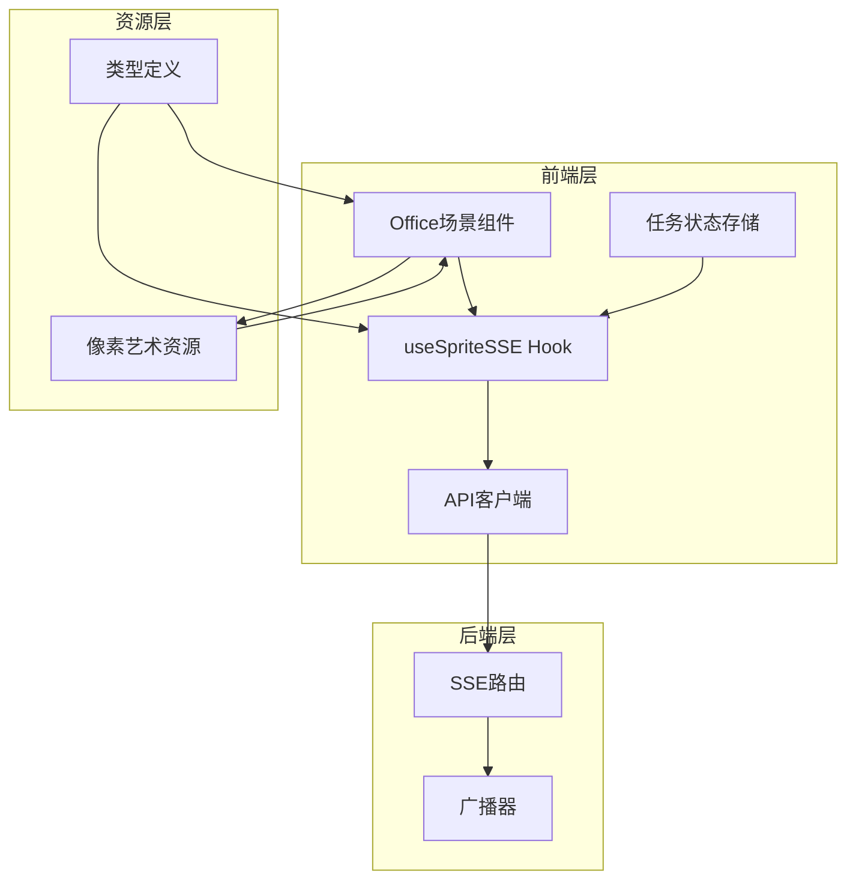

**图表来源**
- [useSpriteSSE.ts:1-153](file://frontend/hooks/useSpriteSSE.ts#L1-L153)
- [api.ts:1-363](file://frontend/lib/api.ts#L1-L363)
- [stream_routes.py:1-96](file://backend/app/api/stream_routes.py#L1-L96)

**章节来源**
- [useSpriteSSE.ts:1-153](file://frontend/hooks/useSpriteSSE.ts#L1-L153)
- [api.ts:1-363](file://frontend/lib/api.ts#L1-L363)
- [stream_routes.py:1-96](file://backend/app/api/stream_routes.py#L1-L96)

## 核心组件

### Sprite状态管理系统

Sprite SSE集成的核心是`useSpriteSSE` Hook，它负责管理6个智能体的状态同步和UI更新：

| 智能体类型 | 角色描述 | 像素角色 | 状态映射 |
|-----------|----------|----------|----------|
| profile_agent | 账号定位解析 | 分析型(蓝紫色) | pending → running → completed/failure |
| hot_topic_agent | 热点分析 | 热点型(橙色) | pending → running → completed/failure |
| topic_planner_agent | 选题策划 | 策划型(绿色) | pending → running → completed/failure |
| title_generator_agent | 标题生成 | 标题型(红色) | pending → running → completed/failure |
| content_writer_agent | 正文生成 | 创作型(紫色) | pending → running → completed/failure |
| audit_agent | 审核评估 | 审核型(黄色) | pending → running → completed/failure |

### SSE事件类型定义

系统定义了四种关键的SSE事件类型：

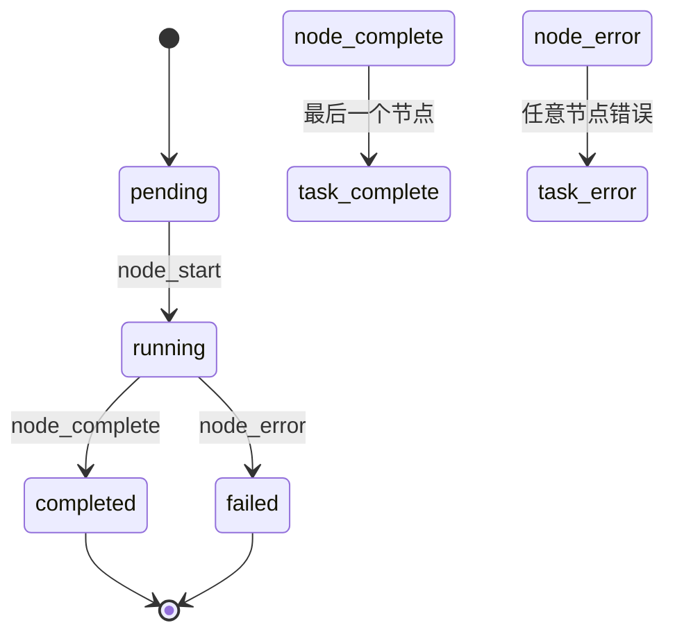

**图表来源**
- [useSpriteSSE.ts:75-124](file://frontend/hooks/useSpriteSSE.ts#L75-L124)
- [index.ts:66-95](file://frontend/types/index.ts#L66-L95)

**章节来源**
- [useSpriteSSE.ts:10-46](file://frontend/hooks/useSpriteSSE.ts#L10-L46)
- [index.ts:66-95](file://frontend/types/index.ts#L66-L95)

## 架构概览

### 整体架构流程

SSE集成采用经典的发布-订阅模式，通过EventSource实现客户端的自动重连机制：

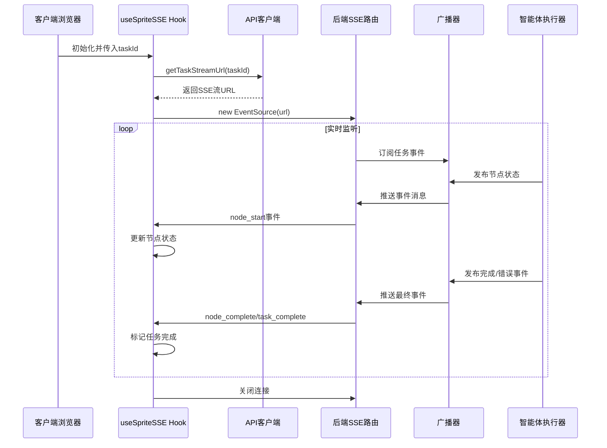

**图表来源**
- [useSpriteSSE.ts:64-135](file://frontend/hooks/useSpriteSSE.ts#L64-L135)
- [api.ts:97-103](file://frontend/lib/api.ts#L97-L103)
- [stream_routes.py:37-95](file://backend/app/api/stream_routes.py#L37-L95)

### 数据流架构

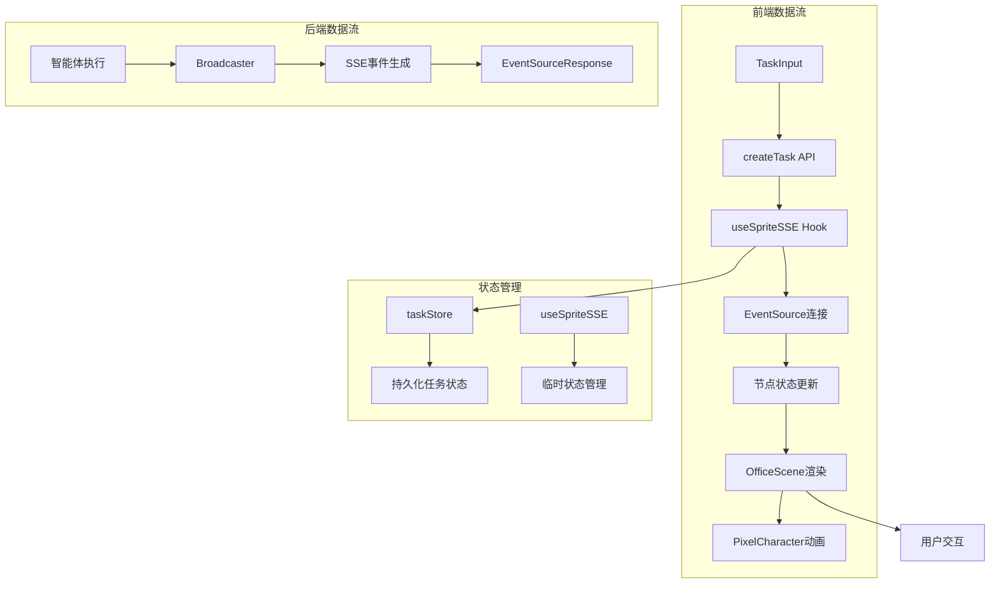

**图表来源**
- [TaskInput.tsx:13-54](file://frontend/components/office/TaskInput.tsx#L13-L54)
- [useSpriteSSE.ts:49-137](file://frontend/hooks/useSpriteSSE.ts#L49-L137)
- [taskStore.ts:82-116](file://frontend/store/taskStore.ts#L82-L116)

**章节来源**
- [useSpriteSSE.ts:49-137](file://frontend/hooks/useSpriteSSE.ts#L49-L137)
- [taskStore.ts:82-116](file://frontend/store/taskStore.ts#L82-L116)

## 详细组件分析

### useSpriteSSE Hook组件

`useSpriteSSE`是SSE集成的核心Hook，负责管理智能体状态的实时更新：

#### 状态管理机制

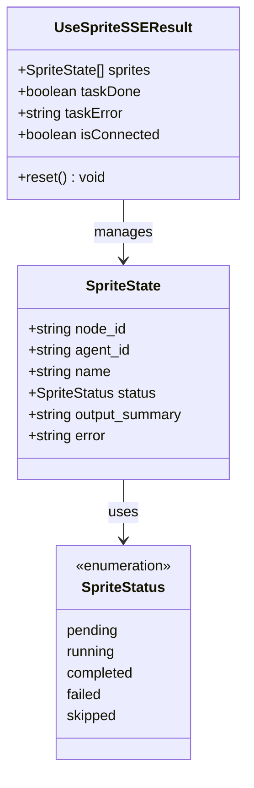

**图表来源**
- [useSpriteSSE.ts:10-46](file://frontend/hooks/useSpriteSSE.ts#L10-L46)

#### 事件处理流程

Hook实现了完整的事件处理生命周期：

1. **初始化阶段**：设置初始状态和连接标志
2. **连接建立**：创建EventSource实例并注册事件监听器
3. **实时更新**：处理node_start、node_complete、node_error事件
4. **任务完成**：处理task_complete和task_error事件
5. **清理阶段**：组件卸载时关闭连接和清理状态

**章节来源**
- [useSpriteSSE.ts:49-137](file://frontend/hooks/useSpriteSSE.ts#L49-L137)

### API客户端集成

API客户端专门处理SSE流的URL生成和请求封装：

#### SSE URL生成策略

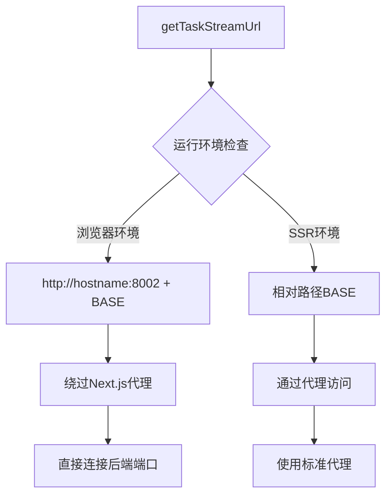

**图表来源**
- [api.ts:97-103](file://frontend/lib/api.ts#L97-L103)

#### 错误处理机制

API客户端实现了完善的错误处理策略：
- 统一的响应格式验证
- 业务错误的异常抛出
- SSE连接的特殊处理逻辑

**章节来源**
- [api.ts:39-50](file://frontend/lib/api.ts#L39-L50)
- [api.ts:97-103](file://frontend/lib/api.ts#L97-L103)

### Office场景渲染组件

OfficeScene组件负责将SSE状态转换为可视化的像素艺术场景：

#### 布局设计原则

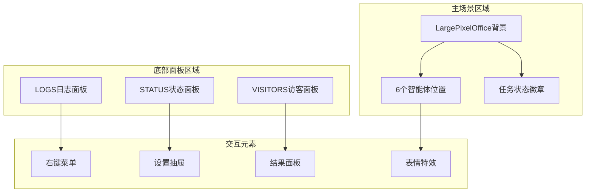

**图表来源**
- [OfficeScene.tsx:110-427](file://frontend/components/office/OfficeScene.tsx#L110-L427)

#### 智能体状态映射

OfficeScene将SSE状态映射到具体的UI元素：

| 状态类型 | UI表现 | 动画效果 | 文本显示 |
|----------|--------|----------|----------|
| pending | 静态像素角色 | 微弱脉动 | IDLE |
| running | 工作动画 | 持续工作 | WORK |
| completed | 完成状态 | 成功动画 | DONE |
| failed | 失败状态 | 警告闪烁 | ALRT |

**章节来源**
- [OfficeScene.tsx:144-182](file://frontend/components/office/OfficeScene.tsx#L144-L182)
- [OfficeScene.tsx:296-337](file://frontend/components/office/OfficeScene.tsx#L296-L337)

### 像素角色渲染组件

PixelCharacter组件负责单个智能体的像素艺术渲染：

#### 动画状态系统

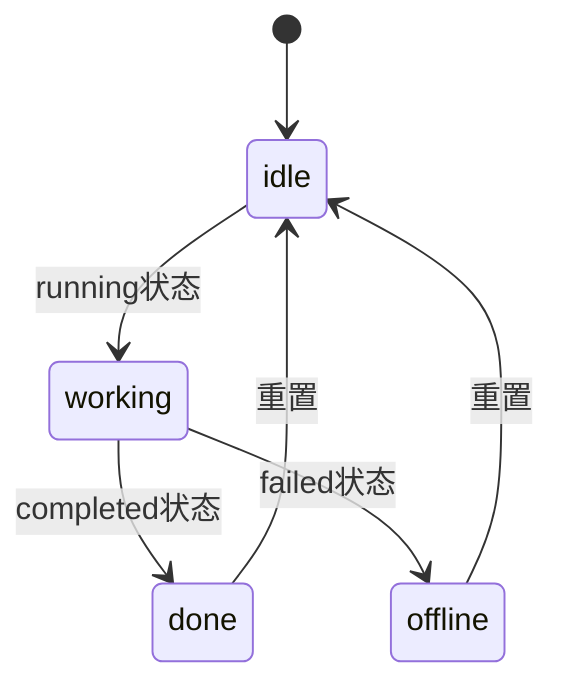

**图表来源**
- [PixelCharacter.tsx:27-32](file://frontend/components/office/PixelCharacter.tsx#L27-L32)

#### 资源管理策略

组件通过assets模块集中管理所有像素艺术资源：
- 主精灵表：包含6个智能体的idle和work状态
- 专用角色图：每个智能体的独立PNG文件
- 效果资源：表情符号和UI元素

**章节来源**
- [PixelCharacter.tsx:35-63](file://frontend/components/office/PixelCharacter.tsx#L35-L63)
- [assets.ts:68-75](file://frontend/lib/assets.ts#L68-L75)

### 后端SSE路由实现

后端使用FastAPI和sse-starlette库实现SSE流式传输：

#### 事件生成器架构

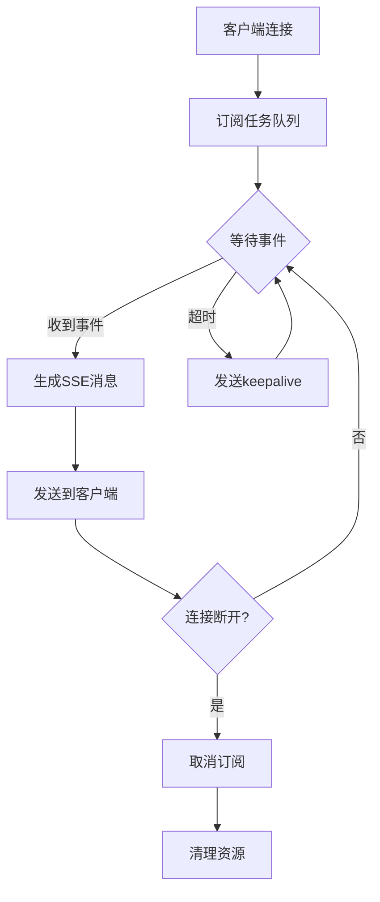

**图表来源**
- [stream_routes.py:53-95](file://backend/app/api/stream_routes.py#L53-L95)

#### 连接保活机制

后端实现了智能的连接保活策略：
- 30秒超时检测
- 自动keepalive注释发送
- 客户端断开检测
- 资源清理和订阅取消

**章节来源**
- [stream_routes.py:63-95](file://backend/app/api/stream_routes.py#L63-L95)

## 依赖关系分析

### 组件依赖图

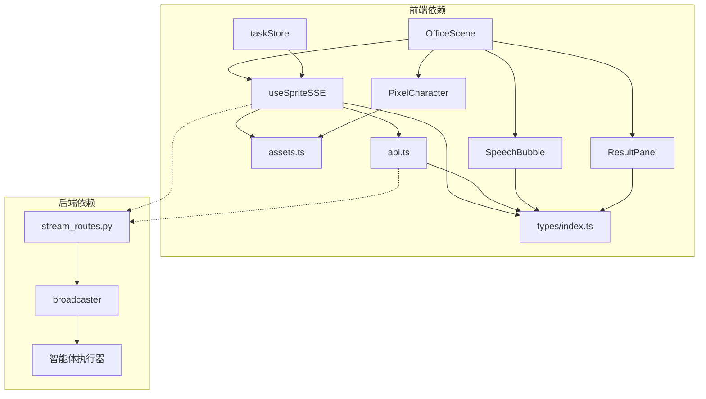

**图表来源**
- [useSpriteSSE.ts:3-4](file://frontend/hooks/useSpriteSSE.ts#L3-L4)
- [OfficeScene.tsx:18-27](file://frontend/components/office/OfficeScene.tsx#L18-L27)

### 数据类型依赖

系统定义了完整的类型体系来确保类型安全：

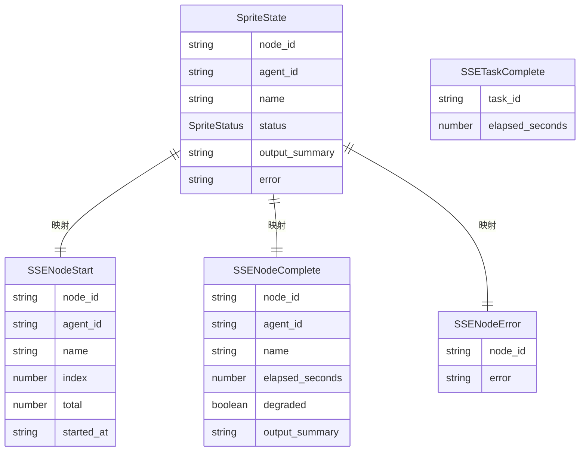

**图表来源**
- [index.ts:45-95](file://frontend/types/index.ts#L45-L95)
- [useSpriteSSE.ts:10-17](file://frontend/hooks/useSpriteSSE.ts#L10-L17)

**章节来源**
- [index.ts:45-95](file://frontend/types/index.ts#L45-L95)
- [useSpriteSSE.ts:10-17](file://frontend/hooks/useSpriteSSE.ts#L10-L17)

## 性能考虑

### SSE连接优化

1. **自动重连机制**：EventSource内置的自动重连功能确保连接稳定性
2. **keepalive保活**：每30秒发送keepalive注释防止代理超时
3. **连接池管理**：合理管理EventSource实例的生命周期

### 渲染性能优化

1. **状态最小化**：仅在必要时更新组件状态
2. **CSS动画**：使用GPU加速的CSS动画而非JavaScript动画
3. **资源预加载**：像素艺术资源的预加载和缓存策略

### 内存管理

1. **订阅清理**：组件卸载时自动取消SSE订阅
2. **状态重置**：提供reset方法重置Hook内部状态
3. **资源释放**：及时释放EventSource连接和定时器

## 故障排除指南

### 常见问题诊断

#### 连接问题

| 问题症状 | 可能原因 | 解决方案 |
|----------|----------|----------|
| 无法建立SSE连接 | CORS配置错误 | 检查后端CORS设置 |
| 连接频繁断开 | 代理超时 | 调整代理超时配置 |
| 无事件推送 | 任务ID无效 | 验证任务ID存在性 |
| 状态不更新 | 前端Hook未正确初始化 | 检查taskId传递 |

#### 渲染问题

| 问题症状 | 可能原因 | 解决方案 |
|----------|----------|----------|
| 角色动画不显示 | CSS类名错误 | 检查动画类名拼写 |
| 状态颜色异常 | 状态映射错误 | 验证状态到颜色的映射 |
| 资源加载失败 | 路径配置错误 | 检查assets.ts中的路径配置 |

#### 后端问题

| 问题症状 | 可能原因 | 解决方案 |
|----------|----------|----------|
| SSE流阻塞 | 代理缓冲问题 | 直接连接后端端口 |
| 事件丢失 | 订阅管理错误 | 检查订阅和取消订阅逻辑 |
| 内存泄漏 | 未清理订阅者 | 确认finally块执行 |

**章节来源**
- [useSpriteSSE.ts:126-134](file://frontend/hooks/useSpriteSSE.ts#L126-L134)
- [stream_routes.py:90-95](file://backend/app/api/stream_routes.py#L90-L95)

### 调试技巧

1. **浏览器开发者工具**：监控Network标签页中的SSE连接
2. **控制台日志**：利用console.log跟踪事件处理流程
3. **状态检查**：使用React DevTools检查组件状态变化
4. **后端日志**：监控SSE事件的发送和接收情况

## 结论

Sprite SSE集成为HotClaw项目提供了强大而直观的任务状态可视化能力。通过精心设计的架构和组件，系统实现了：

1. **实时性保证**：基于SSE的双向实时通信，确保状态更新的即时性
2. **用户体验优化**：像素艺术角色的动态表现提供了直观的视觉反馈
3. **系统稳定性**：完善的错误处理和连接保活机制确保系统可靠性
4. **可维护性**：清晰的组件分离和类型定义便于后续维护和扩展

该集成不仅提升了系统的功能性，更重要的是为用户提供了沉浸式的交互体验，体现了现代Web应用在实时性和视觉表现方面的最佳实践。通过合理的架构设计和性能优化，Sprite SSE集成为HotClaw项目奠定了坚实的技术基础。