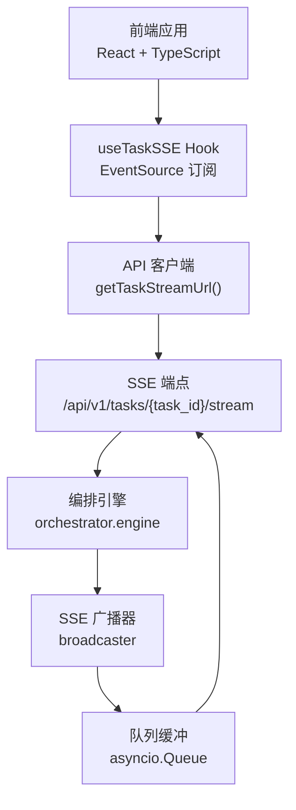
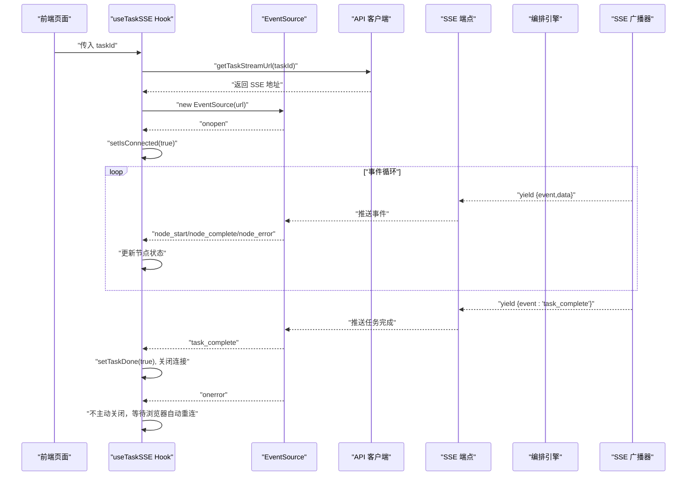
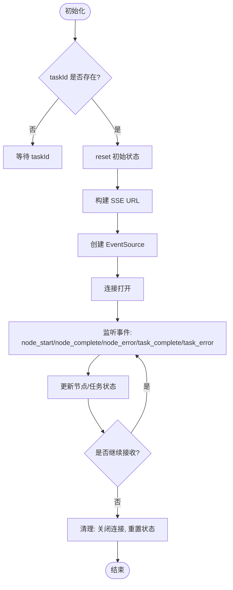
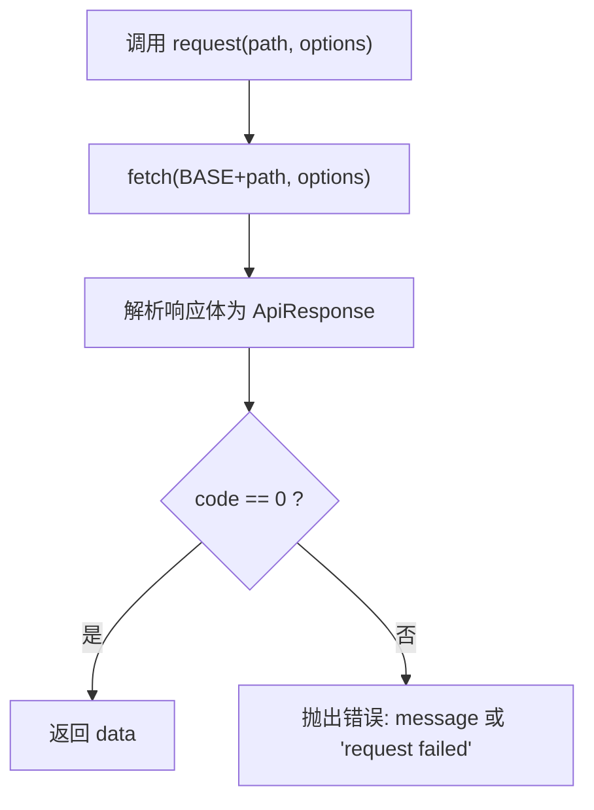
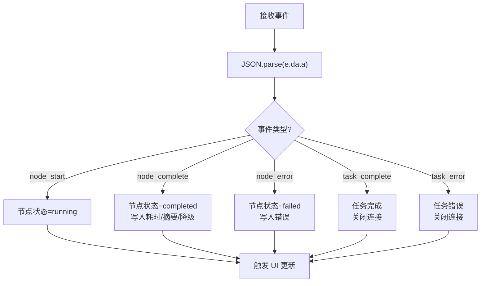
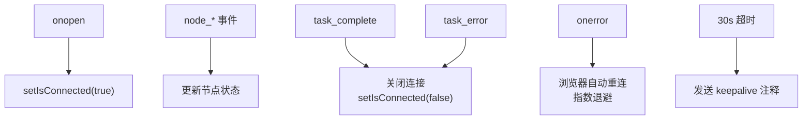
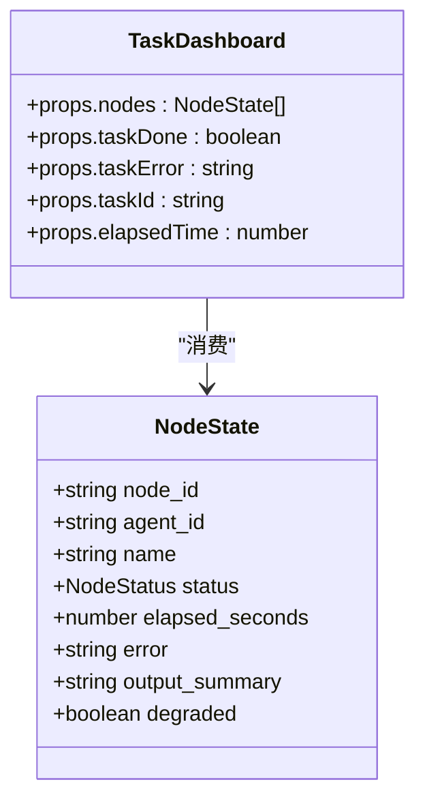
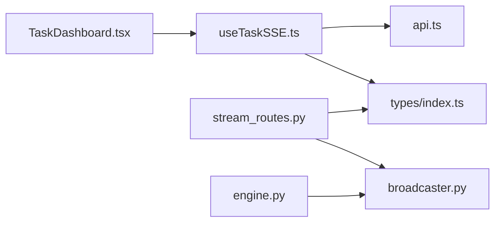

# 实时通信系统

<cite>
**本文引用的文件**
- [useTaskSSE.ts](file://frontend/hooks/useTaskSSE.ts)
- [api.ts](file://frontend/lib/api.ts)
- [TaskDashboard.tsx](file://frontend/components/dashboard/TaskDashboard.tsx)
- [index.ts](file://frontend/types/index.ts)
- [stream_routes.py](file://backend/app/api/stream_routes.py)
- [broadcaster.py](file://backend/app/orchestrator/broadcaster.py)
- [engine.py](file://backend/app/orchestrator/engine.py)
- [page.tsx](file://frontend/app/page.tsx)
</cite>

## 目录
1. [简介](#简介)
2. [项目结构](#项目结构)
3. [核心组件](#核心组件)
4. [架构总览](#架构总览)
5. [详细组件分析](#详细组件分析)
6. [依赖分析](#依赖分析)
7. [性能考虑](#性能考虑)
8. [故障排查指南](#故障排查指南)
9. [结论](#结论)
10. [附录](#附录)

## 简介
本文件为实时通信系统的完整技术文档，聚焦于基于 Server-Sent Events（SSE）的任务执行事件流实现。内容涵盖：
- SSE 连接建立、事件监听与断线自动重连机制
- useTaskSSE 自定义 Hook 的设计与实现：事件源管理、状态同步、错误处理
- API 调用封装策略：请求拦截、响应处理、错误重试
- 实时数据流处理：事件解析、状态更新、UI 同步
- 连接状态监控、心跳检测与网络异常处理
- 性能优化建议、内存泄漏防护与调试工具使用

## 项目结构
前端采用 React + TypeScript，后端采用 FastAPI + Python。实时通信由前端的 useTaskSSE Hook 通过 EventSource 订阅后端 SSE 流，后端通过广播器将任务节点状态推送给前端。

**图示来源**
- [useTaskSSE.ts:28-143](file://frontend/hooks/useTaskSSE.ts#L28-L143)
- [api.ts:48-55](file://frontend/lib/api.ts#L48-L55)
- [stream_routes.py:14-42](file://backend/app/api/stream_routes.py#L14-L42)
- [engine.py:89-234](file://backend/app/orchestrator/engine.py#L89-L234)
- [broadcaster.py:11-99](file://backend/app/orchestrator/broadcaster.py#L11-L99)

**章节来源**
- [page.tsx:1-8](file://frontend/app/page.tsx#L1-L8)

## 核心组件
- useTaskSSE Hook：负责创建 EventSource、订阅节点开始/完成/错误以及任务完成/错误事件，维护节点状态数组与任务整体状态，并在组件卸载或任务变更时清理连接。
- API 客户端：统一的请求封装与错误处理；提供 getTaskStreamUrl 以绕过 Next.js 反向代理，直接连接后端服务。
- SSE 广播器：按 task_id 维护订阅者队列与历史事件缓冲，支持延迟加入的订阅者重放历史事件。
- 编排引擎：顺序调度各 Agent 执行，向广播器推送节点开始/完成/错误与任务完成事件，并在完成后关闭流。
- 仪表盘组件：消费 useTaskSSE 返回的状态，计算并展示任务进度、成功率、平均耗时等指标。

**章节来源**
- [useTaskSSE.ts:28-143](file://frontend/hooks/useTaskSSE.ts#L28-L143)
- [api.ts:14-24](file://frontend/lib/api.ts#L14-L24)
- [api.ts:48-55](file://frontend/lib/api.ts#L48-L55)
- [broadcaster.py:30-84](file://backend/app/orchestrator/broadcaster.py#L30-L84)
- [engine.py:124-232](file://backend/app/orchestrator/engine.py#L124-L232)
- [TaskDashboard.tsx:21-176](file://frontend/components/dashboard/TaskDashboard.tsx#L21-L176)

## 架构总览
SSE 事件流从后端编排引擎产生，经广播器入队并缓存，前端通过 EventSource 持续拉取。后端在空闲或超时情况下发送 keepalive 注释，浏览器自动重连，确保连接鲁棒性。

**图示来源**
- [useTaskSSE.ts:60-140](file://frontend/hooks/useTaskSSE.ts#L60-L140)
- [api.ts:48-55](file://frontend/lib/api.ts#L48-L55)
- [stream_routes.py:18-42](file://backend/app/api/stream_routes.py#L18-L42)
- [engine.py:124-232](file://backend/app/orchestrator/engine.py#L124-L232)
- [broadcaster.py:57-78](file://backend/app/orchestrator/broadcaster.py#L57-L78)

## 详细组件分析

### useTaskSSE Hook 设计与实现
- 事件源管理
  - 使用 useRef 存储 EventSource 实例，确保清理时可安全关闭。
  - 在 taskId 变化时 reset 初始状态，避免旧任务状态污染新任务。
- 状态同步
  - 维护节点状态数组，初始节点顺序与后端工作流一致。
  - 通过事件监听更新节点状态、耗时、摘要与降级标记。
- 错误处理
  - 任务级错误与节点级错误分别处理，设置错误信息并断开连接。
  - onerror 不主动关闭，交由浏览器自动指数退避重连。
- 生命周期
  - 清理函数中显式关闭连接并重置连接状态。

**图示来源**
- [useTaskSSE.ts:28-143](file://frontend/hooks/useTaskSSE.ts#L28-L143)

**章节来源**
- [useTaskSSE.ts:28-143](file://frontend/hooks/useTaskSSE.ts#L28-L143)

### API 调用封装策略
- 统一请求封装
  - request 函数统一添加 JSON 头部，解析响应体并校验 code 字段，非 0 抛出错误。
- SSE 地址构造
  - getTaskStreamUrl 在浏览器环境直接连接后端 8002 端口，绕过 Next.js 代理以避免响应缓冲。
- 错误重试
  - 当前未实现客户端侧自动重试；SSE 依靠浏览器自动重连与后端 keepalive。

**图示来源**
- [api.ts:14-24](file://frontend/lib/api.ts#L14-L24)

**章节来源**
- [api.ts:14-24](file://frontend/lib/api.ts#L14-L24)
- [api.ts:48-55](file://frontend/lib/api.ts#L48-L55)

### 实时数据流处理流程
- 事件解析
  - 前端解析事件数据为 JSON，更新对应节点状态字段。
- 状态更新
  - 节点状态：pending → running → completed 或 failed。
  - 任务状态：taskDone、taskError、isConnected。
- UI 同步
  - 仪表盘组件根据节点状态计算进度、成功率与平均耗时，实时渲染。

**图示来源**
- [useTaskSSE.ts:74-127](file://frontend/hooks/useTaskSSE.ts#L74-L127)
- [TaskDashboard.tsx:29-47](file://frontend/components/dashboard/TaskDashboard.tsx#L29-L47)

**章节来源**
- [useTaskSSE.ts:74-127](file://frontend/hooks/useTaskSSE.ts#L74-L127)
- [TaskDashboard.tsx:21-176](file://frontend/components/dashboard/TaskDashboard.tsx#L21-L176)

### 连接状态监控、心跳检测与网络异常处理
- 连接状态
  - onopen 设置 isConnected=true；task_complete 与 task_error 时设为 false 并关闭连接。
- 心跳检测
  - 后端在超时（30 秒）时发送 keepalive 注释，维持长连接活跃。
- 网络异常
  - onerror 不主动关闭，依赖浏览器 EventSource 自动重连与指数退避。

**图示来源**
- [useTaskSSE.ts:69-133](file://frontend/hooks/useTaskSSE.ts#L69-L133)
- [stream_routes.py:24-29](file://backend/app/api/stream_routes.py#L24-L29)

**章节来源**
- [useTaskSSE.ts:69-133](file://frontend/hooks/useTaskSSE.ts#L69-L133)
- [stream_routes.py:18-42](file://backend/app/api/stream_routes.py#L18-L42)

### 数据模型与事件类型
- 节点状态枚举：pending、running、completed、failed、skipped
- 任务状态枚举：pending、running、completed、failed
- SSE 事件接口：SSENodeStart、SSENodeComplete、SSENodeError、SSETaskComplete

**图示来源**
- [useTaskSSE.ts:7-16](file://frontend/hooks/useTaskSSE.ts#L7-L16)
- [TaskDashboard.tsx:13-19](file://frontend/components/dashboard/TaskDashboard.tsx#L13-L19)
- [index.ts:5-6](file://frontend/types/index.ts#L5-L6)

**章节来源**
- [index.ts:5-6](file://frontend/types/index.ts#L5-L6)
- [index.ts:66-95](file://frontend/types/index.ts#L66-L95)
- [useTaskSSE.ts:7-16](file://frontend/hooks/useTaskSSE.ts#L7-L16)
- [TaskDashboard.tsx:13-19](file://frontend/components/dashboard/TaskDashboard.tsx#L13-L19)

## 依赖分析
- 前端依赖
  - useTaskSSE 依赖 API 客户端提供的 getTaskStreamUrl 与类型定义。
  - 仪表盘组件依赖 useTaskSSE 返回的状态进行渲染。
- 后端依赖
  - SSE 端点依赖广播器；编排引擎在执行过程中向广播器推送事件；广播器使用 asyncio.Queue 缓冲事件。

**图示来源**
- [useTaskSSE.ts:3-5](file://frontend/hooks/useTaskSSE.ts#L3-L5)
- [api.ts:3-10](file://frontend/lib/api.ts#L3-L10)
- [TaskDashboard.tsx:10-11](file://frontend/components/dashboard/TaskDashboard.tsx#L10-L11)
- [stream_routes.py:9](file://backend/app/api/stream_routes.py#L9)
- [engine.py:26](file://backend/app/orchestrator/engine.py#L26)
- [broadcaster.py:11-99](file://backend/app/orchestrator/broadcaster.py#L11-L99)

**章节来源**
- [useTaskSSE.ts:3-5](file://frontend/hooks/useTaskSSE.ts#L3-L5)
- [api.ts:3-10](file://frontend/lib/api.ts#L3-L10)
- [TaskDashboard.tsx:10-11](file://frontend/components/dashboard/TaskDashboard.tsx#L10-L11)
- [stream_routes.py:9](file://backend/app/api/stream_routes.py#L9)
- [engine.py:26](file://backend/app/orchestrator/engine.py#L26)
- [broadcaster.py:11-99](file://backend/app/orchestrator/broadcaster.py#L11-L99)

## 性能考虑
- 事件缓冲与历史重放
  - 广播器对每个 task_id 维护历史事件列表，延迟加入订阅者可重放历史，避免竞态条件。
- 心跳与超时
  - 后端 30 秒超时发送 keepalive 注释，减少连接中断感知延迟。
- 内存管理
  - 任务结束后清理历史事件与订阅者，避免内存泄漏。
- UI 更新粒度
  - 仅在必要字段变化时触发状态更新，降低渲染成本。

[本节为通用性能建议，无需特定文件引用]

## 故障排查指南
- 常见问题
  - 连接未建立：检查 getTaskStreamUrl 返回地址与后端端口可达性。
  - 事件不更新：确认编排引擎是否正确推送节点与任务事件。
  - 断线频繁：检查浏览器 EventSource 自动重连行为与网络稳定性。
- 调试建议
  - 前端：开启控制台日志，观察连接打开、事件接收与错误警告。
  - 后端：查看广播器订阅/取消订阅与历史事件清理日志。

**章节来源**
- [useTaskSSE.ts:69-133](file://frontend/hooks/useTaskSSE.ts#L69-L133)
- [broadcaster.py:47-84](file://backend/app/orchestrator/broadcaster.py#L47-L84)

## 结论
该实时通信系统通过 EventSource + SSE 实现了从前端到后端的低延迟事件推送。useTaskSSE Hook 提供简洁的事件订阅与状态管理能力；后端广播器与编排引擎保证事件的可靠分发与历史重放。结合心跳与自动重连机制，系统具备良好的鲁棒性与可维护性。后续可在客户端增加可配置的重试策略与更细粒度的 UI 动画反馈，进一步提升用户体验。

## 附录
- 关键实现路径
  - [useTaskSSE.ts:28-143](file://frontend/hooks/useTaskSSE.ts#L28-L143)
  - [api.ts:48-55](file://frontend/lib/api.ts#L48-L55)
  - [stream_routes.py:14-42](file://backend/app/api/stream_routes.py#L14-L42)
  - [broadcaster.py:30-84](file://backend/app/orchestrator/broadcaster.py#L30-L84)
  - [engine.py:124-232](file://backend/app/orchestrator/engine.py#L124-L232)
  - [TaskDashboard.tsx:21-176](file://frontend/components/dashboard/TaskDashboard.tsx#L21-L176)