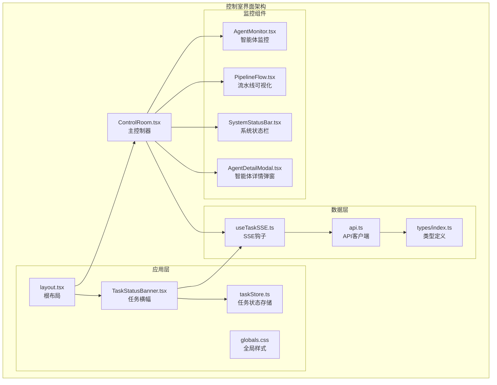
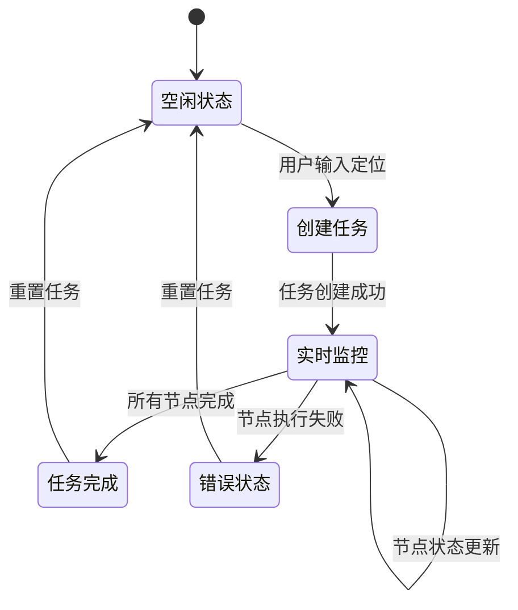
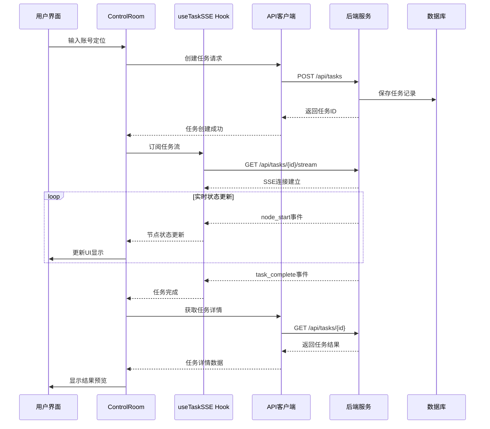
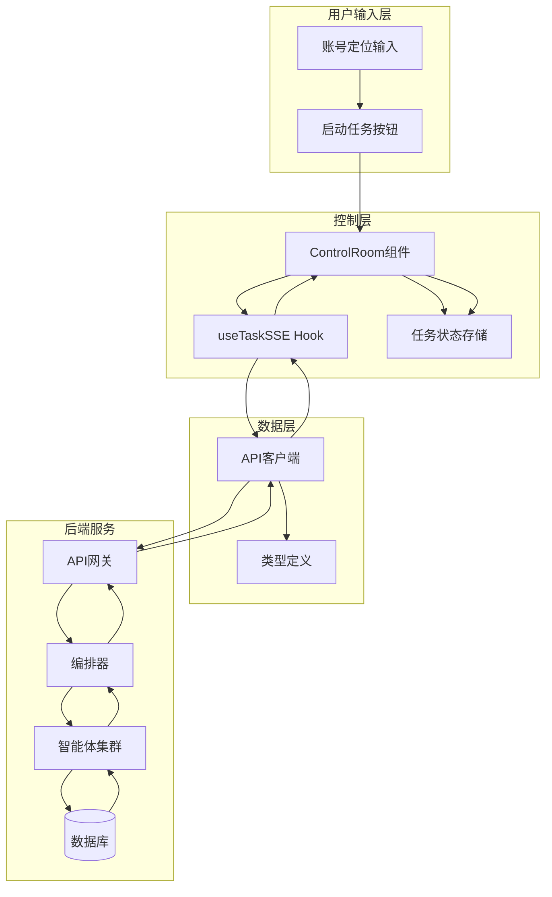
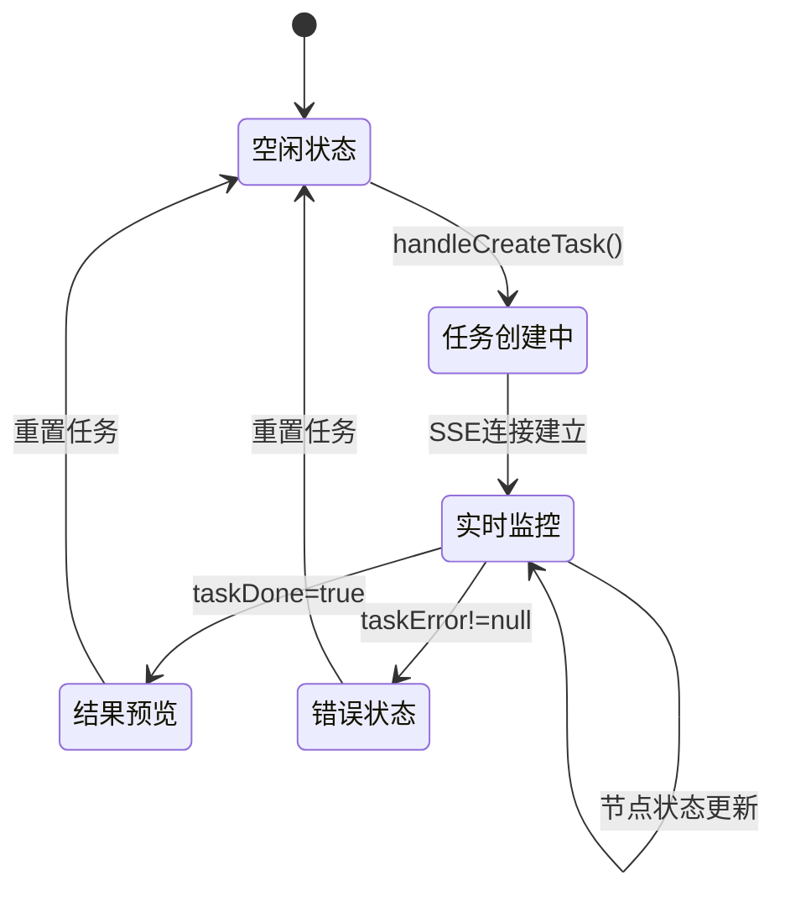
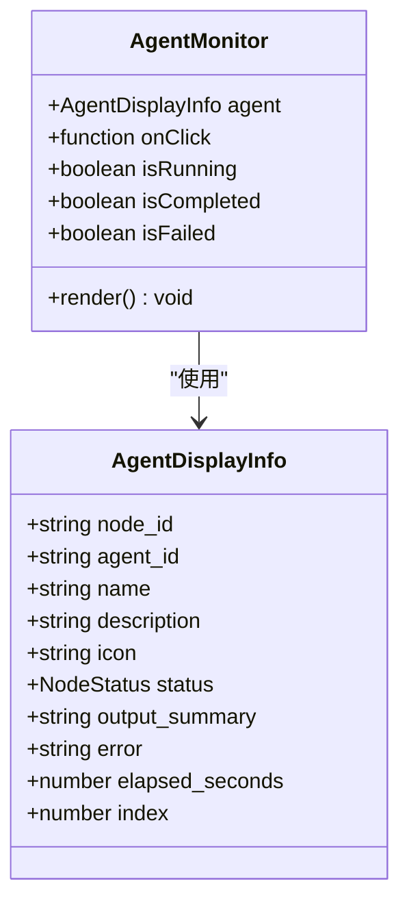
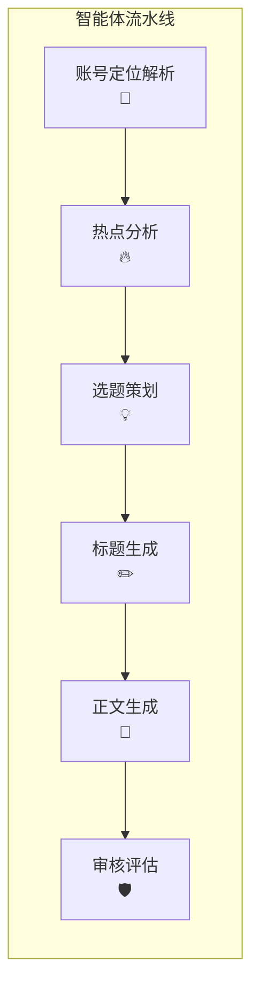
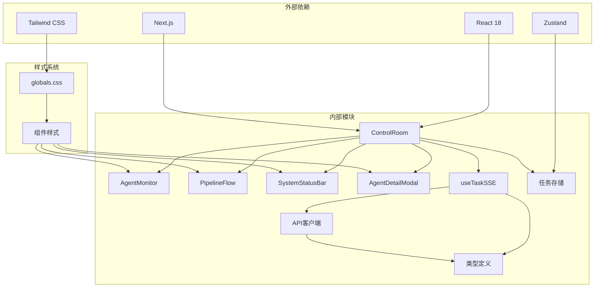
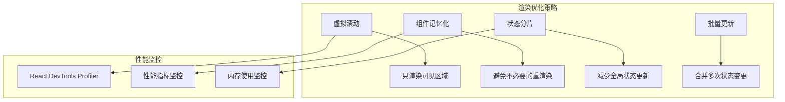
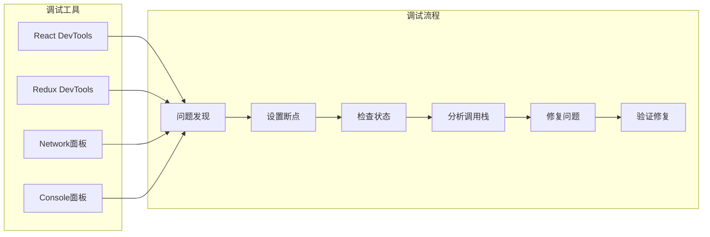

# 控制室界面

<cite>
**本文档引用的文件**
- [ControlRoom.tsx](file://frontend/components/control-room/ControlRoom.tsx)
- [AgentMonitor.tsx](file://frontend/components/control-room/AgentMonitor.tsx)
- [PipelineFlow.tsx](file://frontend/components/control-room/PipelineFlow.tsx)
- [SystemStatusBar.tsx](file://frontend/components/control-room/SystemStatusBar.tsx)
- [AgentDetailModal.tsx](file://frontend/components/control-room/AgentDetailModal.tsx)
- [useTaskSSE.ts](file://frontend/hooks/useTaskSSE.ts)
- [api.ts](file://frontend/lib/api.ts)
- [index.ts](file://frontend/types/index.ts)
- [layout.tsx](file://frontend/app/layout.tsx)
- [TaskStatusBanner.tsx](file://frontend/components/TaskStatusBanner.tsx)
- [taskStore.ts](file://frontend/store/taskStore.ts)
- [globals.css](file://frontend/app/globals.css)
- [ARCHITECTURE.md](file://ARCHITECTURE.md)
</cite>

## 更新摘要
**变更内容**
- 更新了控制室界面的架构设计，反映从网格化监控面板到简化控制台设计的转变
- 重新分析了运营指标展示和操作简化的实现方式
- 更新了组件交互设计和状态管理架构
- 修正了流水线可视化的实现细节

## 目录
1. [简介](#简介)
2. [项目结构](#项目结构)
3. [核心组件](#核心组件)
4. [架构概览](#架构概览)
5. [详细组件分析](#详细组件分析)
6. [依赖关系分析](#依赖关系分析)
7. [性能考量](#性能考量)
8. [故障排除指南](#故障排除指南)
9. [结论](#结论)

## 简介

控制室界面是 HotClaw 多智能体公众号内容生产平台的核心可视化组件。经过重大重构后，该界面采用了简化的控制台设计，更加注重运营指标的直接展示和操作的简化。通过直观的视觉设计和实时数据流，用户可以全面了解内容生产流水线的执行状态。

新的界面设计摒弃了复杂的网格化监控面板，转而采用更加简洁的控制台布局，提供任务创建、实时监控、结果预览和系统状态反馈的一体化体验。界面支持实时任务状态更新、智能体详情查看、系统健康状态监控等功能，同时优化了用户体验和操作效率。

## 项目结构

控制室界面位于前端项目的 `components/control-room` 目录下，采用模块化的组件设计，经过重构后更加注重功能的集中化和操作的简化：

**图表来源**
- [ControlRoom.tsx:1-385](file://frontend/components/control-room/ControlRoom.tsx#L1-L385)
- [useTaskSSE.ts:1-233](file://frontend/hooks/useTaskSSE.ts#L1-L233)
- [api.ts:1-733](file://frontend/lib/api.ts#L1-L733)

**章节来源**
- [ControlRoom.tsx:1-385](file://frontend/components/control-room/ControlRoom.tsx#L1-L385)
- [ARCHITECTURE.md:191-290](file://ARCHITECTURE.md#L191-L290)

## 核心组件

控制室界面由多个精心设计的组件构成，每个组件都有明确的职责和功能。经过重构后，组件更加专注于核心功能的简化和优化：

### 主要组件职责

| 组件 | 职责 | 关键特性 |
|------|------|----------|
| ControlRoom | 主控制器，协调所有子组件 | 任务创建、状态管理、事件处理、布局优化 |
| AgentMonitor | 智能体状态监控 | 实时状态显示、详情查看、动画效果、简化交互 |
| PipelineFlow | 流水线可视化 | 节点连接、状态指示、进度展示、响应式设计 |
| SystemStatusBar | 系统状态反馈 | 连接状态、任务进度、时间显示、底部固定布局 |
| AgentDetailModal | 智能体详情展示 | 详细信息、错误处理、输出摘要、模态窗口 |

### 状态管理架构

**章节来源**
- [ControlRoom.tsx:39-100](file://frontend/components/control-room/ControlRoom.tsx#L39-L100)
- [useTaskSSE.ts:82-233](file://frontend/hooks/useTaskSSE.ts#L82-L233)

## 架构概览

控制室界面采用前后端分离的架构设计，通过 SSE 实现实时状态推送。经过重构后，架构更加注重用户体验和操作效率：

**图表来源**
- [useTaskSSE.ts:128-230](file://frontend/hooks/useTaskSSE.ts#L128-L230)
- [api.ts:56-67](file://frontend/lib/api.ts#L56-L67)
- [ControlRoom.tsx:48-57](file://frontend/components/control-room/ControlRoom.tsx#L48-L57)

### 数据流架构

**图表来源**
- [ControlRoom.tsx:39-100](file://frontend/components/control-room/ControlRoom.tsx#L39-L100)
- [useTaskSSE.ts:82-233](file://frontend/hooks/useTaskSSE.ts#L82-L233)
- [api.ts:18-50](file://frontend/lib/api.ts#L18-L50)

**章节来源**
- [ARCHITECTURE.md:37-78](file://ARCHITECTURE.md#L37-L78)
- [ARCHITECTURE.md:325-360](file://ARCHITECTURE.md#L325-L360)

## 详细组件分析

### ControlRoom 主控制器

ControlRoom 是整个控制室界面的核心组件，负责协调所有子组件的工作。经过重构后，组件更加注重布局优化和用户体验：

#### 核心功能特性

| 功能 | 实现方式 | 用途 |
|------|----------|------|
| 任务创建 | `handleCreateTask()` | 发起新的内容生产任务 |
| 实时监控 | `useTaskSSE()` | 监控任务执行状态 |
| 结果展示 | `fetchResult()` | 获取并显示任务结果 |
| 状态管理 | `useState` | 管理组件内部状态 |
| 事件处理 | `useEffect` | 处理副作用和生命周期 |
| 布局优化 | Flexbox/Grid | 实现响应式布局 |

#### 状态流转

**图表来源**
- [ControlRoom.tsx:59-80](file://frontend/components/control-room/ControlRoom.tsx#L59-L80)
- [ControlRoom.tsx:100-170](file://frontend/components/control-room/ControlRoom.tsx#L100-L170)

**章节来源**
- [ControlRoom.tsx:39-385](file://frontend/components/control-room/ControlRoom.tsx#L39-L385)

### AgentMonitor 智能体监控

AgentMonitor 组件负责显示单个智能体的详细状态信息。经过重构后，组件更加简洁，专注于核心状态展示：

#### 状态指示系统

| 状态 | 图标 | 颜色 | 动画效果 |
|------|------|------|----------|
| 等待中 | ⏳ | 灰色 | 静止 |
| 执行中 | 🔄 | 绿色 | 呼吸动画 |
| 已完成 | ✅ | 蓝色 | 完成效果 |
| 异常 | ❌ | 红色 | 闪烁效果 |
| 已跳过 | — | 灰色 | 静止 |

#### 交互设计

**图表来源**
- [AgentMonitor.tsx:5-16](file://frontend/components/control-room/AgentMonitor.tsx#L5-L16)
- [AgentMonitor.tsx:31-174](file://frontend/components/control-room/AgentMonitor.tsx#L31-L174)

**章节来源**
- [AgentMonitor.tsx:1-174](file://frontend/components/control-room/AgentMonitor.tsx#L1-L174)

### PipelineFlow 流水线可视化

PipelineFlow 组件提供智能体执行流程的可视化展示。经过重构后，组件更加简洁，专注于核心的流程展示：

#### 流水线设计

**图表来源**
- [PipelineFlow.tsx:16-68](file://frontend/components/control-room/PipelineFlow.tsx#L16-L68)

**章节来源**
- [PipelineFlow.tsx:1-68](file://frontend/components/control-room/PipelineFlow.tsx#L1-L68)

### SystemStatusBar 系统状态栏

SystemStatusBar 提供系统级别的状态反馈和进度指示。经过重构后，组件更加简洁，专注于核心状态展示：

#### 状态指示器

| 状态类型 | 显示内容 | 颜色编码 |
|----------|----------|----------|
| 连接状态 | SSE 实时连接 | 绿色脉冲 |
| 任务状态 | 待命/任务完成 | 灰色/蓝色 |
| 错误状态 | ERR: 错误信息 | 红色 |
| 进度显示 | 完成数量/总数 | 百分比进度条 |
| 时间显示 | 当前系统时间 | 静态显示 |

**章节来源**
- [SystemStatusBar.tsx:14-71](file://frontend/components/control-room/SystemStatusBar.tsx#L14-L71)

### AgentDetailModal 智能体详情弹窗

AgentDetailModal 提供智能体执行详情的详细展示。经过重构后，组件更加简洁，专注于核心信息展示：

#### 详情信息展示

| 信息类别 | 显示内容 | 更新时机 |
|----------|----------|----------|
| 基本信息 | 名称、ID、图标 | 组件挂载 |
| 状态信息 | 当前状态、耗时、任务ID | 状态变化 |
| 功能描述 | 智能体功能说明 | 组件挂载 |
| 输出摘要 | 执行结果摘要 | 节点完成 |
| 错误信息 | 错误详情 | 节点失败 |
| 实时进度 | 执行进度条 | 节点运行中 |

**章节来源**
- [AgentDetailModal.tsx:21-149](file://frontend/components/control-room/AgentDetailModal.tsx#L21-L149)

## 依赖关系分析

控制室界面的依赖关系体现了清晰的关注点分离。经过重构后，依赖关系更加简洁：

**图表来源**
- [ControlRoom.tsx:1-11](file://frontend/components/control-room/ControlRoom.tsx#L1-L11)
- [useTaskSSE.ts:32-34](file://frontend/hooks/useTaskSSE.ts#L32-L34)
- [api.ts:18-25](file://frontend/lib/api.ts#L18-L25)

### 核心依赖关系

| 依赖类型 | 依赖方 | 被依赖方 | 用途 |
|----------|--------|----------|------|
| 组件依赖 | ControlRoom | AgentMonitor, PipelineFlow, SystemStatusBar, AgentDetailModal | 协调子组件 |
| 状态管理 | ControlRoom | useTaskSSE, taskStore | 管理应用状态 |
| 数据访问 | useTaskSSE | api.ts | 处理API请求 |
| 类型定义 | 所有组件 | types/index.ts | 提供类型安全 |
| 样式系统 | 所有组件 | globals.css | 统一样式设计 |

**章节来源**
- [ControlRoom.tsx:3-10](file://frontend/components/control-room/ControlRoom.tsx#L3-L10)
- [useTaskSSE.ts:32-34](file://frontend/hooks/useTaskSSE.ts#L32-L34)
- [api.ts:18-25](file://frontend/lib/api.ts#L18-L25)

## 性能考量

控制室界面在设计时充分考虑了性能优化。经过重构后，性能优化策略更加聚焦：

### 实时性能优化

| 优化策略 | 实现方式 | 性能收益 |
|----------|----------|----------|
| SSE连接池 | 单例模式管理EventSource实例 | 减少连接开销 |
| 状态更新优化 | 函数式更新避免闭包陷阱 | 提升渲染性能 |
| 组件懒加载 | 按需加载大型组件 | 减少初始加载时间 |
| 动画性能 | CSS3硬件加速 | 提升动画流畅度 |
| 内存管理 | 清理定时器和事件监听器 | 防止内存泄漏 |

### 渲染性能优化

### 网络性能优化

| 优化措施 | 实现细节 | 效果 |
|----------|----------|------|
| SSE直连 | 绕过Next.js代理直连后端 | 降低延迟 |
| 连接重试 | 指数退避算法 | 提高稳定性 |
| 错误处理 | 自动重连机制 | 减少断线影响 |
| 缓存策略 | localStorage持久化 | 提升用户体验 |

**章节来源**
- [useTaskSSE.ts:19-30](file://frontend/hooks/useTaskSSE.ts#L19-L30)
- [useTaskSSE.ts:215-229](file://frontend/hooks/useTaskSSE.ts#L215-L229)
- [api.ts:82-103](file://frontend/lib/api.ts#L82-L103)

## 故障排除指南

### 常见问题及解决方案

#### SSE连接问题

| 问题症状 | 可能原因 | 解决方案 |
|----------|----------|----------|
| 无法建立SSE连接 | CORS配置错误 | 检查后端CORS设置 |
| 连接频繁断开 | 网络不稳定 | 实现自动重连机制 |
| 事件接收延迟 | 代理缓存问题 | 直连后端端口 |
| 状态不同步 | 事件丢失 | 实现事件确认机制 |

#### 状态管理问题

| 问题症状 | 可能原因 | 解决方案 |
|----------|----------|----------|
| 状态更新异常 | 闭包陷阱 | 使用函数式更新 |
| 内存泄漏 | 事件监听器未清理 | 实现清理函数 |
| 性能下降 | 状态过大 | 实施状态分片 |
| 数据不一致 | 并发更新冲突 | 使用原子更新 |

#### 样式问题

| 问题症状 | 可能原因 | 解决方案 |
|----------|----------|----------|
| 样式不生效 | CSS作用域问题 | 检查Tailwind配置 |
| 动画卡顿 | GPU加速不足 | 优化CSS动画属性 |
| 响应式失效 | 断点配置错误 | 调整媒体查询 |
| 主题不一致 | 变量定义缺失 | 补充CSS变量 |

**章节来源**
- [useTaskSSE.ts:19-30](file://frontend/hooks/useTaskSSE.ts#L19-L30)
- [useTaskSSE.ts:215-229](file://frontend/hooks/useTaskSSE.ts#L215-L229)
- [globals.css:8-48](file://frontend/app/globals.css#L8-L48)

### 调试技巧

#### 开发工具使用

#### 性能分析

| 分析工具 | 使用场景 | 关键指标 |
|----------|----------|----------|
| React Profiler | 组件渲染性能 | 渲染时间、重渲染次数 |
| Chrome DevTools | 内存使用情况 | 堆内存、垃圾回收 |
| Network面板 | 网络性能 | 响应时间、连接数 |
| Lighthouse | 总体性能 | 性能分数、最佳实践 |

**章节来源**
- [useTaskSSE.ts:128-147](file://frontend/hooks/useTaskSSE.ts#L128-L147)
- [taskStore.ts:118-151](file://frontend/store/taskStore.ts#L118-L151)

## 结论

控制室界面作为 HotClaw 平台的核心可视化组件，展现了现代前端开发的最佳实践。经过重大重构后，界面采用了更加简洁的控制台设计，更加注重运营指标的直接展示和操作的简化。

### 主要成就

1. **架构设计优秀** - 清晰的组件分层和职责分离
2. **实时性能卓越** - 基于SSE的高效状态推送
3. **用户体验出色** - 简洁的控制台设计和流畅的交互
4. **技术栈先进** - 采用React 18、TypeScript、Zustand等现代技术
5. **可维护性强** - 模块化设计便于后续扩展和维护

### 技术亮点

- **SSE实时通信** - 实现了低延迟的任务状态更新
- **状态管理优化** - 使用Zustand实现轻量级状态管理
- **样式系统完善** - 基于Tailwind CSS的现代化样式设计
- **性能优化到位** - 多层次的性能优化策略
- **错误处理健全** - 完善的错误捕获和恢复机制

该控制室界面不仅满足了当前的功能需求，还为未来的功能扩展奠定了坚实的基础。其模块化的设计理念和先进的技术选型，确保了系统的可扩展性和可维护性。