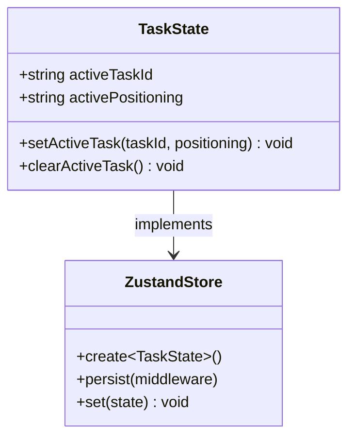
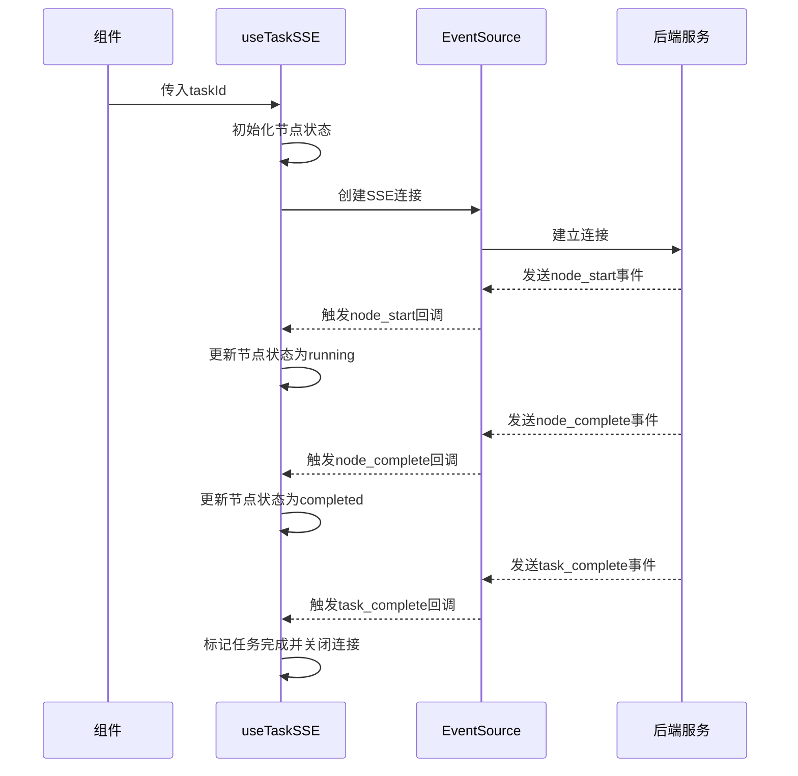
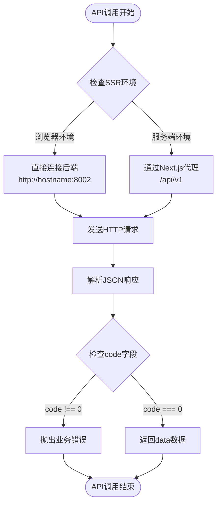
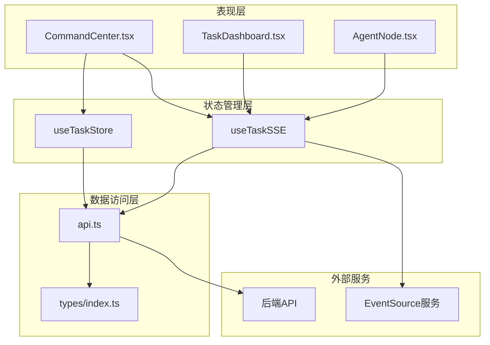
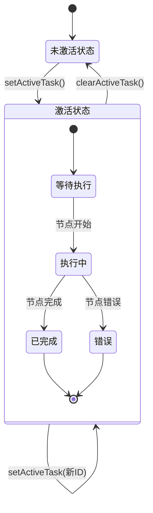
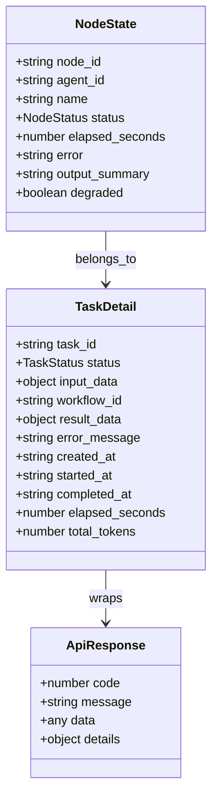
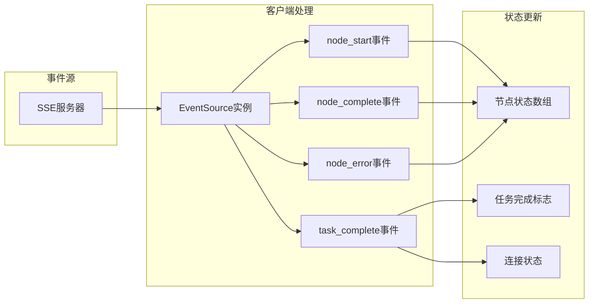
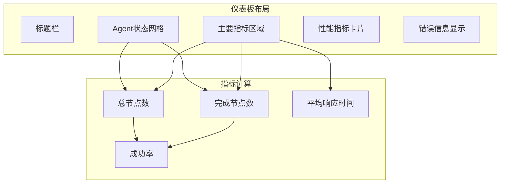
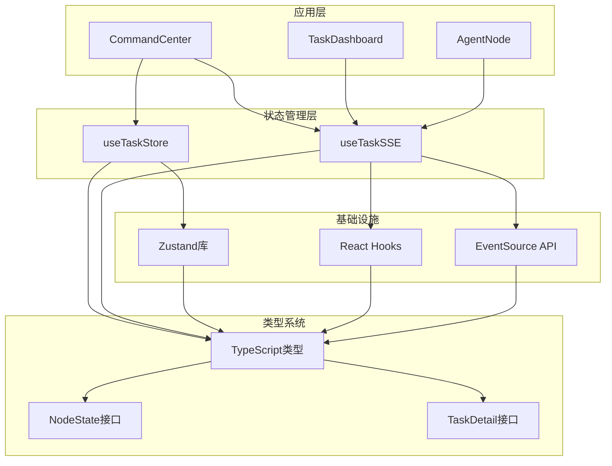
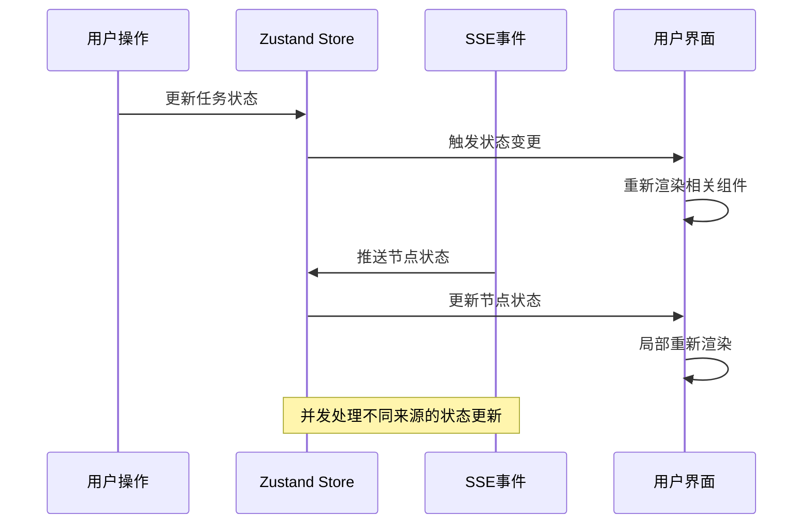

# Zustand状态管理

<cite>
**本文档引用的文件**
- [taskStore.ts](file://frontend/store/taskStore.ts)
- [useTaskSSE.ts](file://frontend/hooks/useTaskSSE.ts)
- [api.ts](file://frontend/lib/api.ts)
- [TaskDashboard.tsx](file://frontend/components/dashboard/TaskDashboard.tsx)
- [index.ts](file://frontend/types/index.ts)
- [package.json](file://frontend/package.json)
- [page.tsx](file://frontend/app/page.tsx)
</cite>

## 目录
1. [简介](#简介)
2. [项目结构](#项目结构)
3. [核心组件](#核心组件)
4. [架构概览](#架构概览)
5. [详细组件分析](#详细组件分析)
6. [依赖关系分析](#依赖关系分析)
7. [性能考虑](#性能考虑)
8. [故障排除指南](#故障排除指南)
9. [结论](#结论)

## 简介

本文档深入分析了HotClaw项目中的Zustand状态管理系统，这是一个基于React的状态管理解决方案。项目采用了现代前端技术栈，结合Zustand轻量级状态管理库和persist中间件，实现了高效的全局状态管理。

Zustand作为项目的核心状态管理工具，提供了简洁的API和强大的功能，包括：
- **轻量级设计**：相比Redux更加简洁易用
- **TypeScript集成**：完整的类型安全支持
- **持久化能力**：通过persist中间件实现localStorage持久化
- **高性能更新**：精确的状态订阅和更新机制

## 项目结构

前端项目采用模块化组织结构，状态管理相关的核心文件分布如下：

```mermaid
graph TB
subgraph "前端应用结构"
A[store/] --> B[taskStore.ts<br/>任务状态管理]
C[hooks/] --> D[useTaskSSE.ts<br/>SSE事件钩子]
E[lib/] --> F[api.ts<br/>API客户端]
G[components/] --> H[TaskDashboard.tsx<br/>任务仪表板]
I[types/] --> J[index.ts<br/>类型定义]
end
subgraph "依赖管理"
K[package.json] --> L[zustand@^5.0.12<br/>状态管理库]
K --> M[react@^19.2.4<br/>React框架]
end
```

**图表来源**
- [taskStore.ts:1-151](file://frontend/store/taskStore.ts#L1-L151)
- [useTaskSSE.ts:1-233](file://frontend/hooks/useTaskSSE.ts#L1-L233)
- [api.ts:1-363](file://frontend/lib/api.ts#L1-L363)

**章节来源**
- [taskStore.ts:1-151](file://frontend/store/taskStore.ts#L1-L151)
- [package.json:1-24](file://frontend/package.json#L1-L24)

## 核心组件

### 任务状态存储 (TaskStore)

任务状态存储是Zustand状态管理的核心组件，负责管理当前活跃任务的相关状态信息。

#### 状态结构定义



**图表来源**
- [taskStore.ts:39-64](file://frontend/store/taskStore.ts#L39-L64)
- [taskStore.ts:82-116](file://frontend/store/taskStore.ts#L82-L116)

#### 核心功能特性

1. **类型安全的状态管理**：通过TypeScript泛型确保状态结构的完整性
2. **持久化存储**：使用localStorage实现跨页面刷新的状态保持
3. **简洁的API设计**：提供直观的方法来管理任务状态
4. **自动序列化**：persist中间件自动处理状态的序列化和反序列化

**章节来源**
- [taskStore.ts:35-116](file://frontend/store/taskStore.ts#L35-L116)

### SSE事件钩子 (useTaskSSE)

SSE事件钩子封装了EventSource API，提供了实时任务状态推送的React Hook接口。

#### 事件处理流程



**图表来源**
- [useTaskSSE.ts:82-232](file://frontend/hooks/useTaskSSE.ts#L82-L232)

#### 核心事件类型

| 事件类型 | 描述 | 数据结构 |
|---------|------|----------|
| node_start | 节点开始执行 | SSENodeStart |
| node_complete | 节点执行完成 | SSENodeComplete |
| node_error | 节点执行错误 | SSENodeError |
| task_complete | 任务完成 | SSETaskComplete |

**章节来源**
- [useTaskSSE.ts:48-214](file://frontend/hooks/useTaskSSE.ts#L48-L214)

### API客户端

API客户端封装了所有后端API调用，提供了统一的请求处理机制。

#### 请求处理流程



**图表来源**
- [api.ts:39-50](file://frontend/lib/api.ts#L39-L50)
- [api.ts:97-103](file://frontend/lib/api.ts#L97-L103)

**章节来源**
- [api.ts:39-103](file://frontend/lib/api.ts#L39-L103)

## 架构概览

项目采用分层架构设计，将状态管理、事件处理和UI组件清晰分离：



**图表来源**
- [page.tsx:1-8](file://frontend/app/page.tsx#L1-L8)
- [TaskDashboard.tsx:21-176](file://frontend/components/dashboard/TaskDashboard.tsx#L21-L176)

## 详细组件分析

### 任务状态管理组件

#### 状态生命周期管理



**图表来源**
- [taskStore.ts:94-108](file://frontend/store/taskStore.ts#L94-L108)

#### 类型系统设计

项目建立了完整的类型系统来确保状态管理的类型安全：



**图表来源**
- [useTaskSSE.ts:37-46](file://frontend/hooks/useTaskSSE.ts#L37-L46)
- [index.ts:31-43](file://frontend/types/index.ts#L31-L43)
- [index.ts:10-15](file://frontend/types/index.ts#L10-L15)

**章节来源**
- [taskStore.ts:39-64](file://frontend/store/taskStore.ts#L39-L64)
- [index.ts:5-64](file://frontend/types/index.ts#L5-L64)

### 实时事件处理组件

#### 事件流处理机制



**图表来源**
- [useTaskSSE.ts:149-214](file://frontend/hooks/useTaskSSE.ts#L149-L214)

#### 错误处理策略

SSE钩子实现了robust的错误处理机制：

| 错误类型 | 处理策略 | 用户反馈 |
|---------|----------|----------|
| 连接失败 | 自动重连机制 | 控制台警告日志 |
| 节点错误 | 标记节点为failed状态 | 显示错误信息 |
| 任务中断 | 关闭连接并重置状态 | 仪表板显示错误状态 |
| 网络异常 | EventSource内置重连 | 无用户干预 |

**章节来源**
- [useTaskSSE.ts:215-229](file://frontend/hooks/useTaskSSE.ts#L215-L229)

### 仪表板组件

#### 实时监控面板

任务仪表板提供了全面的实时监控功能：



**图表来源**
- [TaskDashboard.tsx:21-176](file://frontend/components/dashboard/TaskDashboard.tsx#L21-L176)

**章节来源**
- [TaskDashboard.tsx:21-176](file://frontend/components/dashboard/TaskDashboard.tsx#L21-L176)

## 依赖关系分析

### 核心依赖关系



**图表来源**
- [package.json:21](file://frontend/package.json#L21)
- [taskStore.ts:28-29](file://frontend/store/taskStore.ts#L28-L29)

### 版本兼容性

项目依赖的关键版本信息：

| 依赖包 | 版本要求 | 用途 | 兼容性 |
|--------|----------|------|--------|
| zustand | ^5.0.12 | 状态管理 | ✅ 稳定版本 |
| react | ^19.2.4 | React框架 | ✅ 最新版本 |
| next | ^16.2.1 | Web框架 | ✅ 现代版本 |
| typescript | ^5.9.3 | 类型系统 | ✅ 最新版本 |

**章节来源**
- [package.json:11-22](file://frontend/package.json#L11-L22)

## 性能考虑

### 状态更新优化

1. **精确订阅**：使用选择器函数只订阅必要的状态字段
2. **函数式更新**：避免闭包陷阱，确保状态更新的正确性
3. **内存管理**：及时清理SSE连接，防止内存泄漏

### 并发处理



### 缓存策略

1. **持久化缓存**：使用localStorage缓存任务上下文
2. **组件缓存**：React.memo优化组件渲染
3. **请求缓存**：API客户端避免重复请求

## 故障排除指南

### 常见问题及解决方案

#### Zustand状态不更新

**问题症状**：组件不响应状态变化

**排查步骤**：
1. 检查状态订阅方式是否正确
2. 确认使用选择器函数而非整个状态对象
3. 验证状态更新函数的调用时机

**解决方案**：
```typescript
// ❌ 错误用法
const store = useTaskStore()

// ✅ 正确用法
const activeTaskId = useTaskStore(state => state.activeTaskId)
```

#### SSE连接问题

**问题症状**：实时状态更新失效

**排查步骤**：
1. 检查后端SSE服务是否正常运行
2. 验证网络连接和防火墙设置
3. 确认EventSource实例的正确创建和销毁

**解决方案**：
```typescript
// 确保正确的清理逻辑
return () => {
  if (esRef.current) {
    esRef.current.close()
  }
}
```

#### 类型错误

**问题症状**：TypeScript编译错误

**排查步骤**：
1. 检查类型定义是否完整
2. 确认接口扩展的正确性
3. 验证泛型参数的使用

**解决方案**：
```typescript
// 确保类型安全的泛型使用
export const useTaskStore = create<TaskState>()(
  persist(/* ... */)
)
```

**章节来源**
- [taskStore.ts:140-150](file://frontend/store/taskStore.ts#L140-L150)
- [useTaskSSE.ts:215-229](file://frontend/hooks/useTaskSSE.ts#L215-L229)

## 结论

HotClaw项目中的Zustand状态管理系统展现了现代前端状态管理的最佳实践。通过精心设计的架构和完善的类型系统，项目实现了：

1. **简洁高效的状态管理**：Zustand的轻量级设计使得状态管理变得简单直观
2. **可靠的持久化机制**：localStorage持久化确保用户体验的一致性
3. **实时事件处理**：SSE技术提供了流畅的实时状态更新体验
4. **完整的类型安全**：TypeScript类型系统确保了代码的可靠性

该状态管理方案为类似项目提供了优秀的参考模板，特别是在需要平衡简洁性和功能性需求的场景中。通过合理的架构设计和最佳实践的应用，项目成功地实现了高性能、可维护的状态管理解决方案。