# 状态管理

<cite>
**本文引用的文件**
- [useTaskSSE.ts](file://frontend/hooks/useTaskSSE.ts)
- [api.ts](file://frontend/lib/api.ts)
- [index.ts](file://frontend/types/index.ts)
- [context.tsx](file://frontend/app/(shell)/context.tsx)
- [layout.tsx](file://frontend/app/(shell)/layout.tsx)
- [page.tsx](file://frontend/app/(shell)/page.tsx)
- [accounts/page.tsx](file://frontend/app/(shell)/accounts/page.tsx)
- [drafts/page.tsx](file://frontend/app/(shell)/drafts/page.tsx)
- [history/page.tsx](file://frontend/app/(shell)/history/page.tsx)
- [ControlRoom.tsx](file://frontend/components/control-room/ControlRoom.tsx)
- [PipelineFlow.tsx](file://frontend/components/control-room/PipelineFlow.tsx)
- [SystemStatusBar.tsx](file://frontend/components/control-room/SystemStatusBar.tsx)
- [AgentMonitor.tsx](file://frontend/components/control-room/AgentMonitor.tsx)
- [TaskDashboard.tsx](file://frontend/components/dashboard/TaskDashboard.tsx)
- [BigScreen.tsx](file://frontend/components/office/BigScreen.tsx)
- [OfficeScene.tsx](file://frontend/components/office/OfficeScene.tsx)
- [PixelCharacter.tsx](file://frontend/components/office/PixelCharacter.tsx)
- [ResultPanel.tsx](file://frontend/components/office/ResultPanel.tsx)
- [TaskInput.tsx](file://frontend/components/office/TaskInput.tsx)
- [Workstation.tsx](file://frontend/components/office/Workstation.tsx)
- [NewsroomScene.tsx](file://frontend/components/NewsroomScene.tsx)
- [WeChatArticle.tsx](file://frontend/components/WeChatArticle.tsx)
- [route.ts](file://OpenClaw-bot-review-main/app/api/task-stream/route.ts)
- [route.ts](file://OpenClaw-bot-review-main/app/api/tasks/[taskId]/route.ts)
- [route.ts](file://OpenClaw-bot-review-main/app/api/tasks/[taskId]/nodes/route.ts)
- [route.ts](file://OpenClaw-bot-review-main/app/api/tasks/[taskId]/stream/route.ts)
- [engine.py](file://backend/app/orchestrator/engine.py)
- [broadcaster.py](file://backend/app/orchestrator/broadcaster.py)
- [stream_routes.py](file://backend/app/api/stream_routes.py)
</cite>

## 更新摘要
**变更内容**
- 新增Shell上下文系统章节，介绍跨视图数据同步机制
- 更新状态管理模式，增加Shell上下文作为全局状态管理方案
- 新增实时状态同步章节，详细说明SSE事件处理和状态合并策略
- 更新最佳实践，包含Shell上下文的使用建议和性能优化

## 目录
1. 引言
2. 项目结构
3. 核心组件
4. 架构总览
5. 详细组件分析
6. Shell上下文系统
7. 实时状态同步机制
8. 依赖关系分析
9. 性能考量
10. 故障排查指南
11. 结论
12. 附录

## 引言
本文件为前端状态管理系统的完整技术文档，聚焦于三类状态管理模式：局部状态（组件内）、全局状态（跨组件共享）与组件间状态共享（通过上下文或外部状态源）。文档以任务执行流水线的实时状态流为核心场景，系统性阐述状态模型、动作定义、订阅机制、实时同步（SSE）、以及可扩展到新闻室（newsroom）等场景的通用设计方法。特别新增的Shell上下文系统提供了跨视图的数据同步和实时更新能力，实现了真正的全局状态管理。同时给出性能优化、内存管理、持久化与时间旅行调试的实践建议，并提供面向前端开发者的最佳实践清单。

## 项目结构
前端采用按功能域组织的目录结构，状态管理相关的关键位置如下：
- hooks：自定义 Hook，负责订阅后端 SSE 实时事件，维护节点级状态与任务完成态
- app/(shell)：Shell上下文系统，提供跨视图的全局状态管理
- lib：API 客户端封装，统一请求与错误处理，提供 SSE 连接地址构造
- types：共享类型定义，明确任务、节点、SSE 事件的数据契约
- components：业务组件，包含控制室、仪表盘、像素办公室、新闻室等，承载局部状态与渲染逻辑
- backend：后端流式接口与广播器，负责将任务执行状态推送到客户端

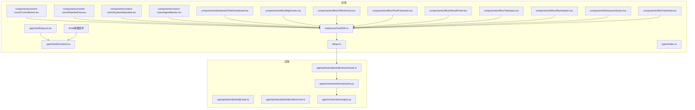

**图表来源**
- [useTaskSSE.ts:1-144](file://frontend/hooks/useTaskSSE.ts#L1-L144)
- [context.tsx:1-52](file://frontend/app/(shell)/context.tsx#L1-L52)
- [layout.tsx:1-574](file://frontend/app/(shell)/layout.tsx#L1-L574)
- [api.ts:1-289](file://frontend/lib/api.ts#L1-L289)
- [index.ts:1-119](file://frontend/types/index.ts#L1-L119)

**章节来源**
- [useTaskSSE.ts:1-144](file://frontend/hooks/useTaskSSE.ts#L1-L144)
- [context.tsx:1-52](file://frontend/app/(shell)/context.tsx#L1-L52)
- [layout.tsx:1-574](file://frontend/app/(shell)/layout.tsx#L1-L574)
- [api.ts:1-289](file://frontend/lib/api.ts#L1-L289)
- [index.ts:1-119](file://frontend/types/index.ts#L1-L119)

## 核心组件
本节聚焦于状态管理的核心构件：SSE Hook、Shell上下文系统、API 客户端、类型契约与业务组件。

- SSE Hook（任务节点状态订阅）
  - 职责：建立与后端的 Server-Sent Events 连接，接收节点开始、完成、失败与任务完成/错误事件，维护节点列表与任务整体状态
  - 关键点：初始节点集、状态枚举、事件监听与去重更新、连接生命周期管理
  - 返回值：nodes、taskDone、taskError、isConnected、reset

- Shell上下文系统（跨视图全局状态）
  - 职责：提供Shell布局的共享状态给所有子视图使用，实现跨视图的数据同步
  - 关键点：DashboardStats、RecentEvent、ShellContextValue类型定义，Provider模式
  - 返回值：stats、accounts、drafts、tasks、events、refreshData函数

- API 客户端
  - 职责：统一请求封装、错误抛出、SSE 地址构造（浏览器直连后端避免代理缓冲）
  - 关键点：基础路径、响应体校验、SSE URL 适配开发/生产环境

- 类型契约
  - 职责：定义任务、节点、SSE 事件的结构，确保前后端一致
  - 关键点：TaskStatus/NodeStatus、SSENodeStart/SSENodeComplete/SSENodeError/SSETaskComplete

- 业务组件
  - 控制室：集中展示任务与节点状态，驱动实时可视化
  - 仪表盘：聚合统计与历史任务列表
  - 像素办公室：角色化渲染与交互面板
  - 新闻室：内容场景渲染与交互

**章节来源**
- [useTaskSSE.ts:28-143](file://frontend/hooks/useTaskSSE.ts#L28-L143)
- [context.tsx:13-51](file://frontend/app/(shell)/context.tsx#L13-L51)
- [api.ts:48-55](file://frontend/lib/api.ts#L48-L55)
- [index.ts:5-94](file://frontend/types/index.ts#L5-L94)

## 架构总览
下图展示了从前端 Hook 到后端引擎的完整数据流，以及Shell上下文系统的跨视图同步机制：前端通过 SSE 订阅后端广播的任务节点状态，组件基于状态进行渲染与交互；Shell布局提供全局状态给所有子视图共享；后端由引擎驱动工作流，广播器将状态事件推送给客户端。

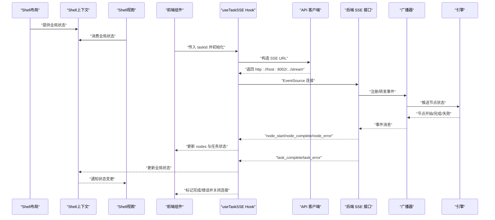

**图表来源**
- [layout.tsx:535-573](file://frontend/app/(shell)/layout.tsx#L535-L573)
- [context.tsx:43-51](file://frontend/app/(shell)/context.tsx#L43-L51)
- [useTaskSSE.ts:60-139](file://frontend/hooks/useTaskSSE.ts#L60-L139)
- [api.ts:48-55](file://frontend/lib/api.ts#L48-L55)
- [route.ts](file://OpenClaw-bot-review-main/app/api/tasks/[taskId]/stream/route.ts)
- [broadcaster.py](file://backend/app/orchestrator/broadcaster.py)
- [engine.py](file://backend/app/orchestrator/engine.py)

## 详细组件分析

### 组件一：SSE Hook（任务节点状态订阅）
- 设计要点
  - 初始节点集与状态机：根据后端流水线顺序初始化节点，状态枚举覆盖 pending/running/completed/failed/skipped
  - 事件处理：分别监听节点开始、完成、错误与任务完成/错误事件，原子更新对应节点字段（耗时、摘要、降级标志、错误信息）
  - 生命周期：自动重连、错误不主动关闭连接、清理时显式关闭
  - 导出能力：返回 nodes、taskDone、taskError、isConnected、reset

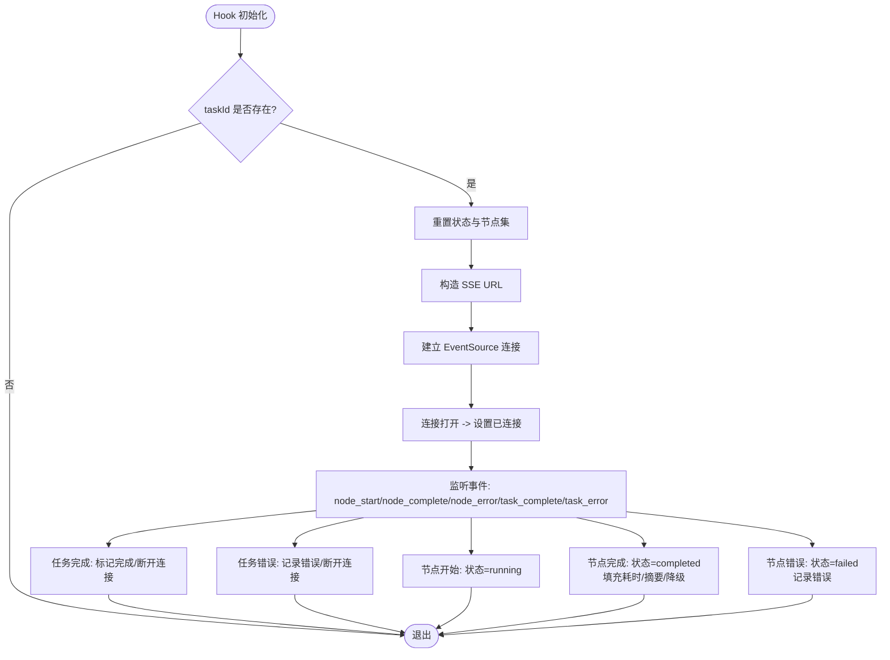

**图表来源**
- [useTaskSSE.ts:28-143](file://frontend/hooks/useTaskSSE.ts#L28-L143)

**章节来源**
- [useTaskSSE.ts:28-143](file://frontend/hooks/useTaskSSE.ts#L28-L143)

### 组件二：Shell上下文系统（跨视图全局状态）
- 设计要点
  - 类型定义：DashboardStats、RecentEvent、ShellContextValue接口，确保类型安全
  - Provider模式：ShellContext.Provider提供全局状态，子组件通过useShellContext消费
  - 数据同步：统一的数据源，确保所有视图看到一致的状态
  - 实时更新：定时刷新机制，30秒自动更新一次

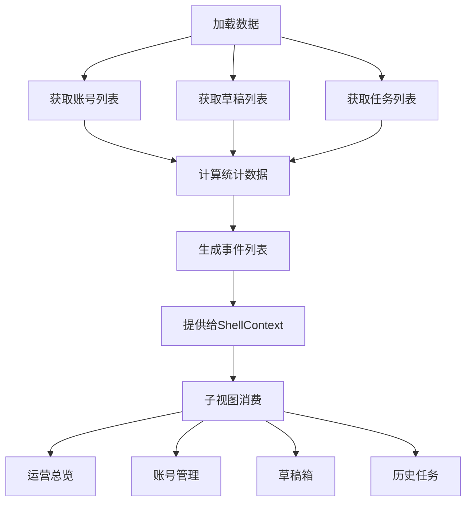

**图表来源**
- [layout.tsx:455-533](file://frontend/app/(shell)/layout.tsx#L455-L533)
- [context.tsx:13-51](file://frontend/app/(shell)/context.tsx#L13-L51)

**章节来源**
- [layout.tsx:455-533](file://frontend/app/(shell)/layout.tsx#L455-L533)
- [context.tsx:13-51](file://frontend/app/(shell)/context.tsx#L13-L51)

### 组件三：API 客户端（SSE 地址与请求封装）
- 设计要点
  - 基础路径与统一错误处理：所有 API 请求走统一的 request 封装，响应体 code 校验失败抛错
  - SSE 地址构造：浏览器环境直接连接后端 8002 端口，绕过 Next.js 反向代理缓冲，保证事件实时性
  - 任务相关接口：创建任务、查询详情、节点列表、任务列表

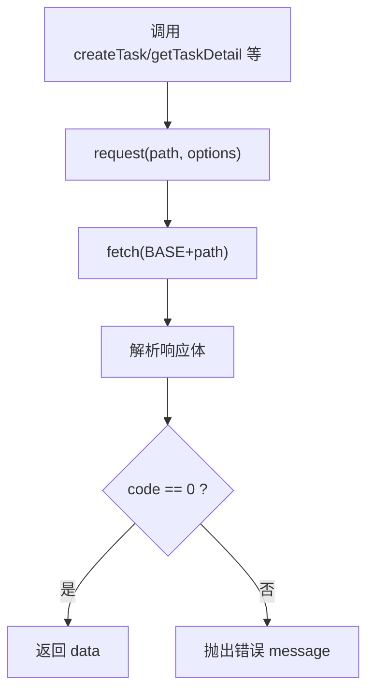

**图表来源**
- [api.ts:14-24](file://frontend/lib/api.ts#L14-L24)
- [api.ts:48-55](file://frontend/lib/api.ts#L48-L55)

**章节来源**
- [api.ts:14-24](file://frontend/lib/api.ts#L14-L24)
- [api.ts:48-55](file://frontend/lib/api.ts#L48-L55)

### 组件四：类型契约（任务/节点/SSE 事件）
- 设计要点
  - 状态枚举：TaskStatus/NodeStatus 明确任务与节点生命周期
  - 数据模型：TaskDetail/NodeRun/SSE* 事件结构，确保前后端一致
  - 事件边界：SSENodeStart/SSENodeComplete/SSENodeError/SSETaskComplete

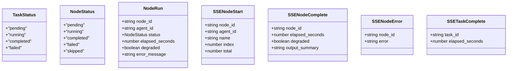

**图表来源**
- [index.ts:5-94](file://frontend/types/index.ts#L5-L94)

**章节来源**
- [index.ts:5-94](file://frontend/types/index.ts#L5-L94)

### 组件五：控制室与可视化（状态消费）
- 控制室（ControlRoom）：聚合展示任务与节点状态，驱动 PipelineFlow 与 SystemStatusBar
- 流水线（PipelineFlow）：按节点顺序渲染，依据状态高亮与进度
- 状态栏（SystemStatusBar）：显示系统健康度与总体任务状态
- 监控（AgentMonitor）：单个代理的运行时状态与日志

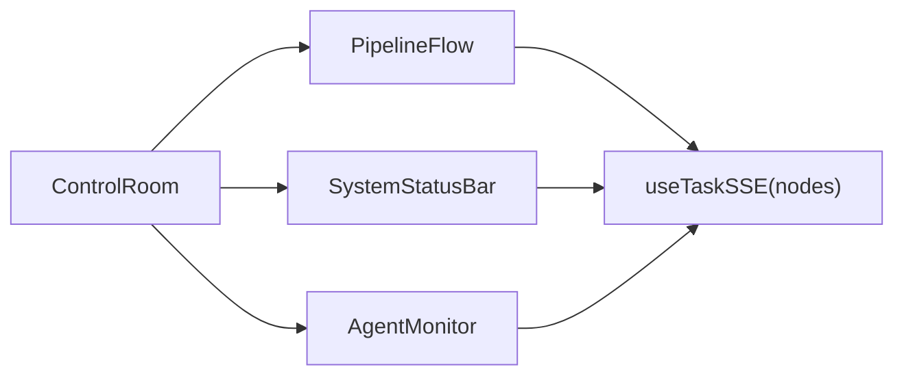

**图表来源**
- [ControlRoom.tsx](file://frontend/components/control-room/ControlRoom.tsx)
- [PipelineFlow.tsx](file://frontend/components/control-room/PipelineFlow.tsx)
- [SystemStatusBar.tsx](file://frontend/components/control-room/SystemStatusBar.tsx)
- [AgentMonitor.tsx](file://frontend/components/control-room/AgentMonitor.tsx)
- [useTaskSSE.ts:28-143](file://frontend/hooks/useTaskSSE.ts#L28-L143)

**章节来源**
- [ControlRoom.tsx](file://frontend/components/control-room/ControlRoom.tsx)
- [PipelineFlow.tsx](file://frontend/components/control-room/PipelineFlow.tsx)
- [SystemStatusBar.tsx](file://frontend/components/control-room/SystemStatusBar.tsx)
- [AgentMonitor.tsx](file://frontend/components/control-room/AgentMonitor.tsx)

### 组件六：像素办公室与新闻室（局部状态与渲染）
- 办公室（OfficeScene/PixelCharacter/Workstation/BigScreen/ResultPanel/TaskInput）：以角色与工作站为单位的局部状态，如对话气泡、结果面板、输入框等
- 新闻室（NewsroomScene/WeChatArticle）：内容场景的渲染与交互

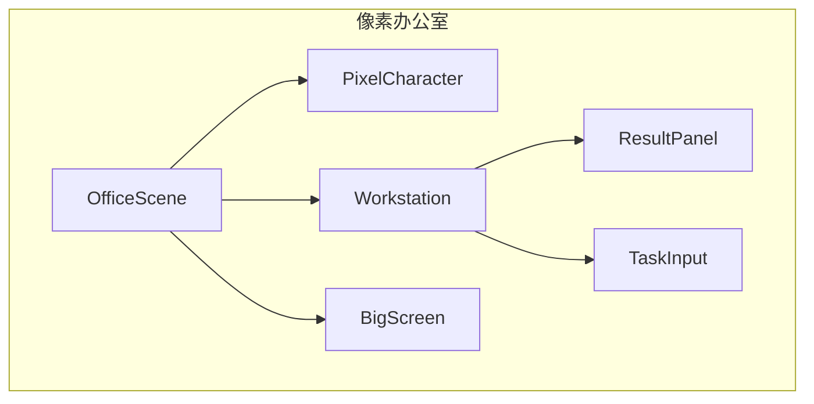

**图表来源**
- [OfficeScene.tsx](file://frontend/components/office/OfficeScene.tsx)
- [PixelCharacter.tsx](file://frontend/components/office/PixelCharacter.tsx)
- [Workstation.tsx](file://frontend/components/office/Workstation.tsx)
- [BigScreen.tsx](file://frontend/components/office/BigScreen.tsx)
- [ResultPanel.tsx](file://frontend/components/office/ResultPanel.tsx)
- [TaskInput.tsx](file://frontend/components/office/TaskInput.tsx)
- [NewsroomScene.tsx](file://frontend/components/NewsroomScene.tsx)
- [WeChatArticle.tsx](file://frontend/components/WeChatArticle.tsx)

**章节来源**
- [OfficeScene.tsx](file://frontend/components/office/OfficeScene.tsx)
- [PixelCharacter.tsx](file://frontend/components/office/PixelCharacter.tsx)
- [Workstation.tsx](file://frontend/components/office/Workstation.tsx)
- [BigScreen.tsx](file://frontend/components/office/BigScreen.tsx)
- [ResultPanel.tsx](file://frontend/components/office/ResultPanel.tsx)
- [TaskInput.tsx](file://frontend/components/office/TaskInput.tsx)
- [NewsroomScene.tsx](file://frontend/components/NewsroomScene.tsx)
- [WeChatArticle.tsx](file://frontend/components/WeChatArticle.tsx)

### 组件七：后端流式接口与广播（SSE 事件源）
- 后端路由：提供任务详情、节点列表、SSE 事件流
- 广播器：将节点状态变化广播给所有连接的客户端
- 引擎：驱动工作流执行，触发节点状态变更

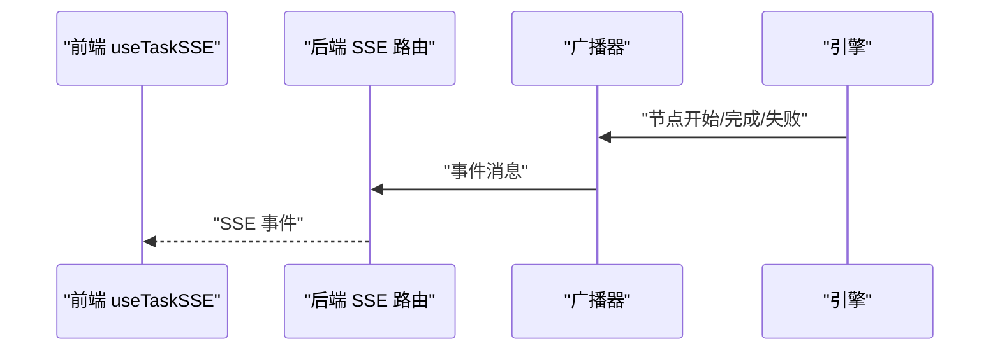

**图表来源**
- [route.ts](file://OpenClaw-bot-review-main/app/api/tasks/[taskId]/stream/route.ts)
- [broadcaster.py](file://backend/app/orchestrator/broadcaster.py)
- [engine.py](file://backend/app/orchestrator/engine.py)

**章节来源**
- [route.ts](file://OpenClaw-bot-review-main/app/api/tasks/[taskId]/stream/route.ts)
- [broadcaster.py](file://backend/app/orchestrator/broadcaster.py)
- [engine.py](file://backend/app/orchestrator/engine.py)

## Shell上下文系统

### Shell上下文架构
Shell上下文系统是HotClaw项目中最重要的全局状态管理方案，它提供了跨视图的数据同步和实时更新能力。该系统基于React Context模式构建，为整个Shell布局提供统一的状态管理。

### 核心组件

#### ShellContextValue接口
定义了Shell上下文提供的所有状态数据：
- stats：仪表板统计数据（今日任务、待确认草稿、今日发布、发布失败）
- accounts：账号列表数据
- drafts：草稿列表数据  
- tasks：任务列表数据
- events：最近事件列表
- refreshData：刷新数据的函数

#### DashboardStats类型
包含核心运营指标：
- todayTasks：今日任务数量
- pendingDrafts：待确认草稿数量
- publishedToday：今日发布数量
- publishFailed：发布失败数量

#### RecentEvent类型
定义最近事件的数据结构：
- id：事件唯一标识
- type：事件类型（task/draft/publish）
- action：操作描述
- title：事件标题
- accountName：账号名称（可选）
- time：事件时间
- status：事件状态（success/failed/pending/info）

### 数据流管理

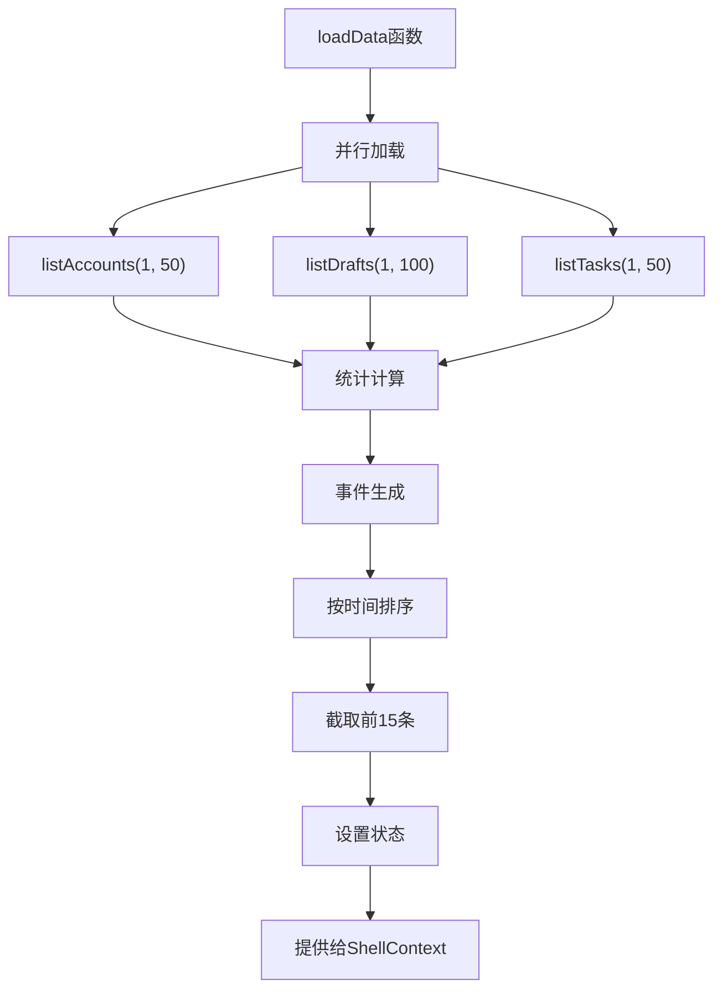

**图表来源**
- [layout.tsx:455-533](file://frontend/app/(shell)/layout.tsx#L455-L533)

### 实时更新机制
Shell上下文系统采用定时刷新机制确保数据的实时性：
- 初始加载：组件挂载时立即加载数据
- 定时刷新：每30秒自动调用loadData函数
- 手动刷新：通过refreshData函数触发即时刷新
- 组件卸载：清理定时器，防止内存泄漏

### 视图集成
各个Shell视图通过useShellContext钩子消费全局状态：

#### 运营总览视图
- 使用stats数据渲染核心运营指标卡片
- 使用drafts数据渲染待处理中心
- 使用drafts数据渲染内容流转看板

#### 账号管理视图
- 使用accounts数据渲染账号列表
- 使用refreshData函数在操作后刷新数据
- 支持账号运行状态的实时更新

#### 草稿箱视图
- 使用drafts数据渲染草稿列表
- 使用refreshData函数在操作后刷新数据
- 支持草稿状态的实时更新

#### 历史任务视图
- 使用tasks数据渲染任务列表
- 使用refreshData函数在操作后刷新数据
- 支持任务状态的实时更新

**章节来源**
- [context.tsx:13-51](file://frontend/app/(shell)/context.tsx#L13-L51)
- [layout.tsx:455-533](file://frontend/app/(shell)/layout.tsx#L455-L533)
- [page.tsx:97-114](file://frontend/app/(shell)/page.tsx#L97-L114)
- [accounts/page.tsx:16-52](file://frontend/app/(shell)/accounts/page.tsx#L16-L52)
- [drafts/page.tsx:23-109](file://frontend/app/(shell)/drafts/page.tsx#L23-L109)
- [history/page.tsx:32-73](file://frontend/app/(shell)/history/page.tsx#L32-L73)

## 实时状态同步机制

### SSE事件处理流程
HotClaw项目采用Server-Sent Events (SSE)技术实现实时状态同步，该机制具有以下特点：
- 单向通信：服务器向客户端推送事件
- 自动重连：浏览器内置EventSource支持自动重连
- 低延迟：避免轮询造成的延迟
- 轻量级：相比WebSocket更简单

### 事件类型定义
系统定义了完整的SSE事件类型，确保前后端数据一致性：

#### 节点事件
- node_start：节点开始执行
- node_complete：节点执行完成
- node_error：节点执行失败

#### 任务事件
- task_complete：任务完成
- task_error：任务失败

### 状态合并策略
当接收到SSE事件时，系统采用原子更新策略：
- 节点状态：直接替换对应节点的状态字段
- 任务状态：更新任务的整体状态
- 错误信息：记录详细的错误描述
- 耗时统计：更新节点执行耗时

### 事件监听与处理

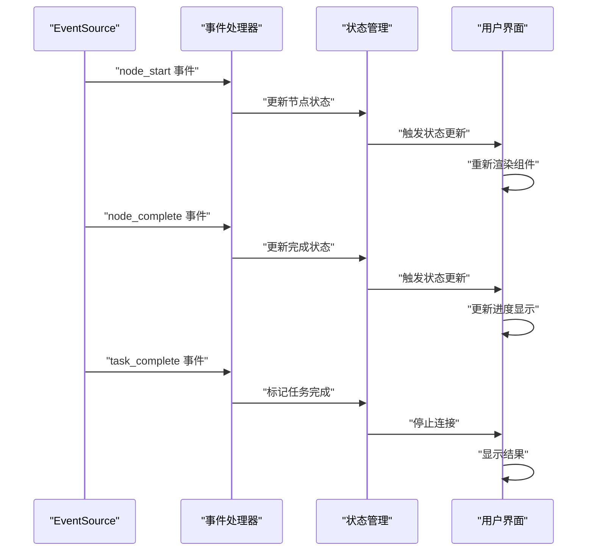

**图表来源**
- [useTaskSSE.ts:60-139](file://frontend/hooks/useTaskSSE.ts#L60-L139)

### 性能优化措施
- 连接池管理：复用EventSource连接，避免频繁创建销毁
- 事件去重：防止重复事件导致的重复渲染
- 批量更新：对连续的节点完成事件进行批量处理
- 内存清理：组件卸载时自动清理事件监听器

**章节来源**
- [useTaskSSE.ts:28-143](file://frontend/hooks/useTaskSSE.ts#L28-L143)

## 依赖关系分析
- 前端依赖链
  - 组件依赖 useTaskSSE 提供的节点状态和Shell上下文提供的全局状态
  - useTaskSSE 依赖 api.ts 的 SSE URL 构造与通用请求封装
  - Shell上下文依赖layout.tsx的loadData函数提供数据源
  - 类型定义被组件与 Hook 共同引用，确保数据一致性
- 后端依赖链
  - SSE 路由依赖广播器，广播器依赖引擎的工作流状态

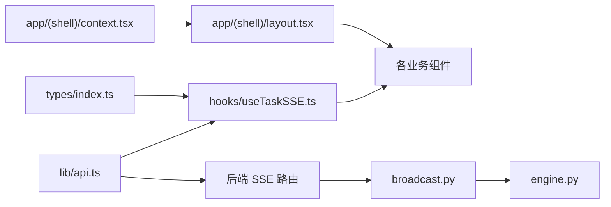

**图表来源**
- [index.ts:1-119](file://frontend/types/index.ts#L1-L119)
- [useTaskSSE.ts:1-144](file://frontend/hooks/useTaskSSE.ts#L1-L144)
- [context.tsx:1-52](file://frontend/app/(shell)/context.tsx#L1-L52)
- [layout.tsx:1-574](file://frontend/app/(shell)/layout.tsx#L1-L574)
- [api.ts:1-289](file://frontend/lib/api.ts#L1-L289)
- [route.ts](file://OpenClaw-bot-review-main/app/api/tasks/[taskId]/stream/route.ts)
- [broadcaster.py](file://backend/app/orchestrator/broadcaster.py)
- [engine.py](file://backend/app/orchestrator/engine.py)

**章节来源**
- [index.ts:1-119](file://frontend/types/index.ts#L1-L119)
- [useTaskSSE.ts:1-144](file://frontend/hooks/useTaskSSE.ts#L1-L144)
- [context.tsx:1-52](file://frontend/app/(shell)/context.tsx#L1-L52)
- [layout.tsx:1-574](file://frontend/app/(shell)/layout.tsx#L1-L574)
- [api.ts:1-289](file://frontend/lib/api.ts#L1-L289)

## 性能考量
- SSE 连接与重连
  - 使用浏览器内置 EventSource 自动指数退避重连，避免频繁重建连接带来的抖动
  - 在错误回调中不主动关闭连接，交由浏览器处理
- Shell上下文性能优化
  - 数据缓存：30秒自动刷新，避免过于频繁的API调用
  - 组件分离：将全局状态与局部状态分离，减少不必要的重渲染
  - 懒加载：只在需要时才加载和渲染数据
- 状态更新与渲染
  - 采用不可变更新策略，对节点数组进行映射更新，减少不必要的重渲染
  - 仅在节点状态变化时触发局部更新，避免全量刷新
- 内存优化
  - 清理阶段显式关闭 EventSource，释放资源
  - 任务完成后及时关闭连接，避免后台持续占用
  - Shell上下文组件卸载时清理定时器
- 网络与代理
  - 直连后端 8002 端口，绕过 Next.js 反向代理缓冲，降低延迟与丢帧风险
- 批量与去抖
  - 对高频事件（如节点完成）进行去抖处理，避免 UI 抖动
  - Shell上下文的定时刷新避免了频繁的手动刷新
- 缓存与预取
  - 对任务列表与配置类数据进行缓存，减少重复请求
  - Shell上下文提供统一的数据源，避免重复请求
- 监控指标
  - 记录连接耗时、事件到达延迟、错误率，用于性能评估与告警

## 故障排查指南
- 连接问题
  - 检查 SSE URL 构造是否正确（开发环境直连后端 8002）
  - 查看浏览器网络面板，确认 EventSource 成功建立且未被拦截
- 事件缺失
  - 确认后端广播器是否正常推送事件
  - 检查节点状态是否按预期流转（开始/完成/失败）
- Shell上下文问题
  - 确认useShellContext钩子在ShellLayout内部使用
  - 检查数据加载函数是否正常执行
  - 验证定时刷新机制是否正常工作
- 错误处理
  - 任务错误事件会设置 taskError 并关闭连接，需查看错误信息
  - 节点错误事件会标记节点失败并记录错误
  - Shell上下文错误会在控制台输出详细信息
- 资源泄漏
  - 确保在组件卸载时调用 reset 或清理 Effect，关闭 EventSource
  - Shell上下文组件卸载时自动清理定时器

**章节来源**
- [useTaskSSE.ts:129-139](file://frontend/hooks/useTaskSSE.ts#L129-L139)
- [api.ts:48-55](file://frontend/lib/api.ts#L48-L55)
- [layout.tsx:535-540](file://frontend/app/(shell)/layout.tsx#L535-L540)

## 结论
本文从任务执行流水线的实时状态流出发，系统性梳理了前端状态管理的实现方式：以 Hook 为核心的事件订阅、以类型契约保障的数据一致性、以组件化的渲染与交互。特别新增的Shell上下文系统提供了跨视图的数据同步和实时更新能力，实现了真正的全局状态管理。在此基础上，可将该模式扩展至新闻室等其他场景，实现局部状态、全局状态与组件间状态共享的统一范式。通过合理的性能与内存优化策略，可在复杂业务场景下保持稳定与高效。

## 附录

### 状态管理模式与最佳实践
- 局部状态
  - 适用：组件内部 UI 状态（如表单、抽屉、模态框）
  - 建议：使用 useState/自定义 Hook，避免上提至全局
- 全局状态
  - 适用：跨页面共享的用户会话、主题、语言等
  - 建议：使用 React Context 或轻量状态库（如 Zustand），避免过度拆分
  - Shell上下文：适用于Shell布局内的跨视图状态共享
- 组件间状态共享
  - 适用：兄弟组件、祖先后代之间的协同状态
  - 建议：通过公共父组件或共享 Context 管理，必要时引入集中式状态库
- 状态持久化
  - 建议：对关键 UI 状态（如筛选条件、布局）进行 localStorage/sessionStorage 持久化
- 时间旅行调试
  - 建议：对关键业务流程记录快照，支持回放与重放
- 状态导出
  - 建议：提供导出接口，将当前状态序列化为 JSON，便于审计与迁移

### OfficeState 状态管理架构（概念性说明）
- 状态分层
  - 应用层：用户会话、主题、语言
  - 业务层：任务、节点、代理、技能、LLM 提供商等
  - 视图层：像素角色、工作站、大屏、结果面板等
- 更新策略
  - 单向数据流：Action -> Reducer -> State -> View
  - 事件驱动：SSE 事件作为外部 Action，驱动状态变更
  - Shell上下文：Provider-Consumer模式，统一状态管理
- 性能优化
  - 分片加载：按需渲染与懒加载
  - 选择器优化：使用 Reselect 或 useMemo 减少重渲染
  - 事件合并：对高频事件进行批处理
  - 数据缓存：合理利用缓存减少API调用

### newsroomStore 设计与实现（概念性说明）
- 状态模型
  - 文章集合、当前选中项、过滤器、排序规则、加载状态
- 动作定义
  - 加载文章、切换文章、应用过滤器、清空状态
- 订阅机制
  - 通过 Hook 订阅 store 变更，组件局部更新
- 实时同步
  - SSE 订阅后端推送的新增/更新事件，合并到本地状态
- 持久化与调试
  - 支持状态快照与导出，结合时间旅行进行调试

### Shell上下文系统最佳实践
- 数据一致性
  - 使用统一的数据源，确保所有视图看到一致的状态
  - 定时刷新机制保证数据的实时性
- 性能优化
  - 合理设置刷新间隔，平衡实时性和性能
  - 使用组件分离，避免不必要的重渲染
- 错误处理
  - 提供错误边界，优雅处理数据加载失败
  - 记录详细的错误信息，便于调试
- 可扩展性
  - 模块化设计，便于添加新的状态字段
  - 类型安全，确保数据结构的一致性