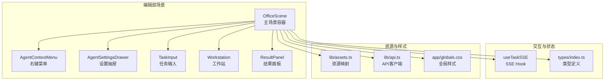
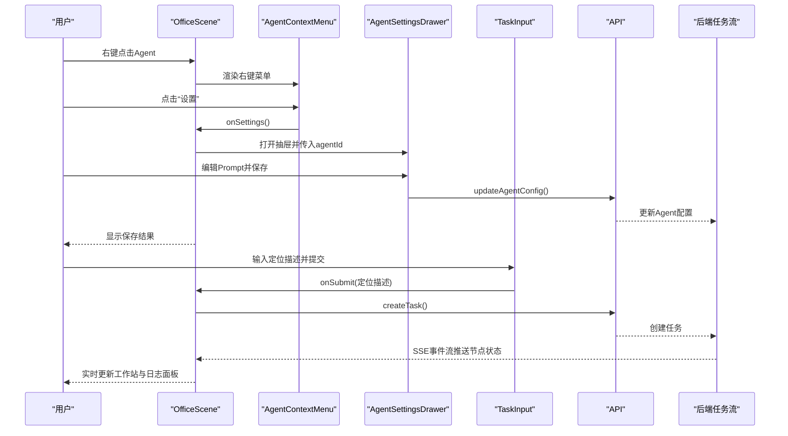
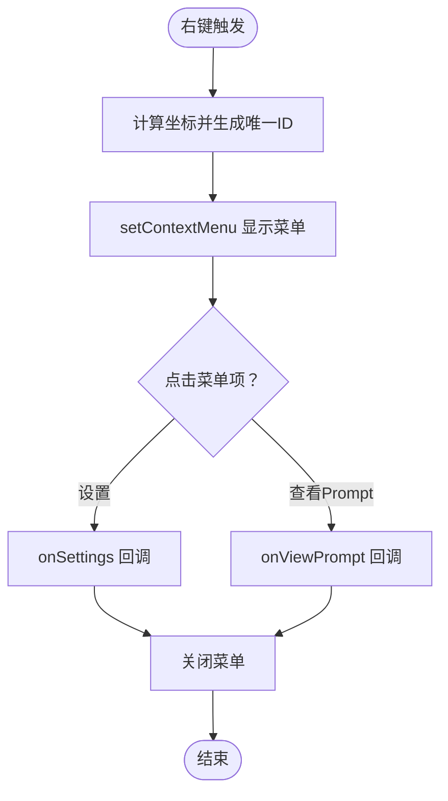
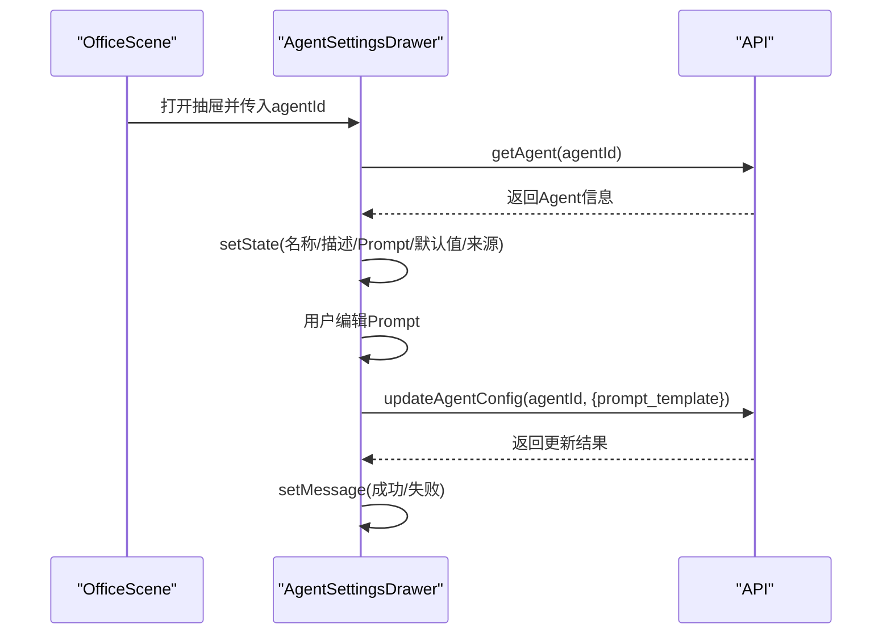
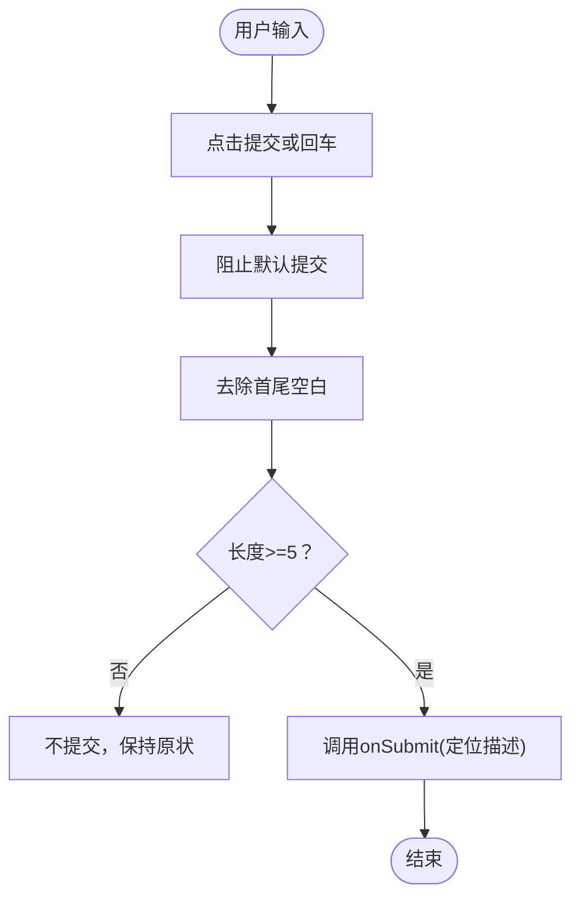
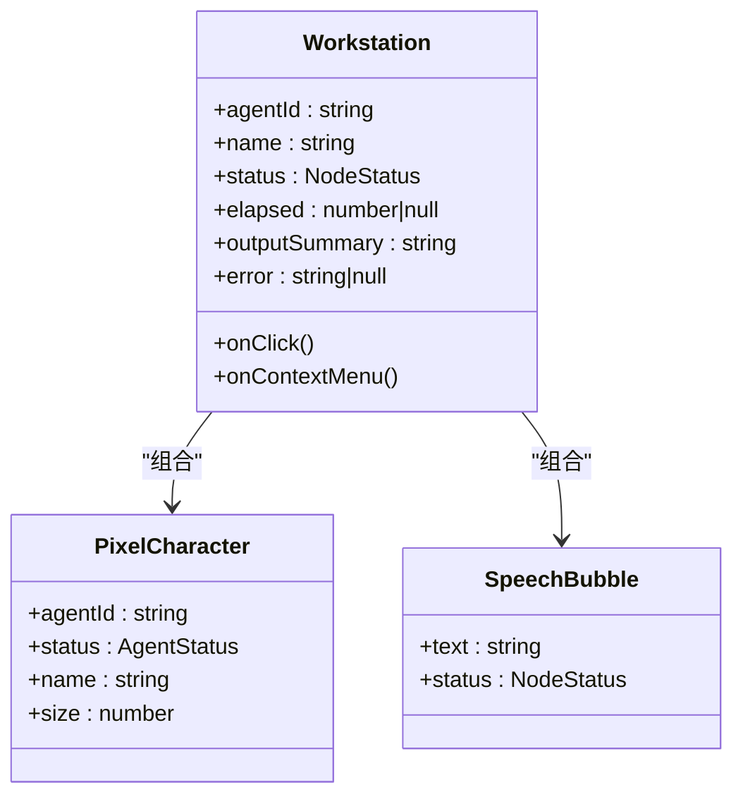
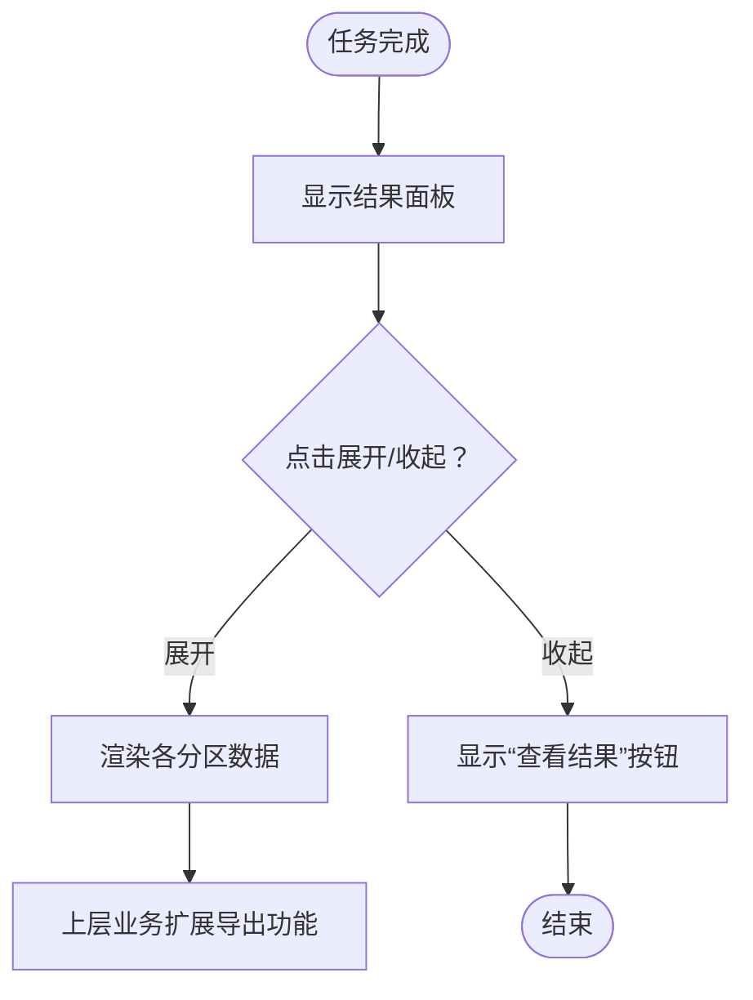
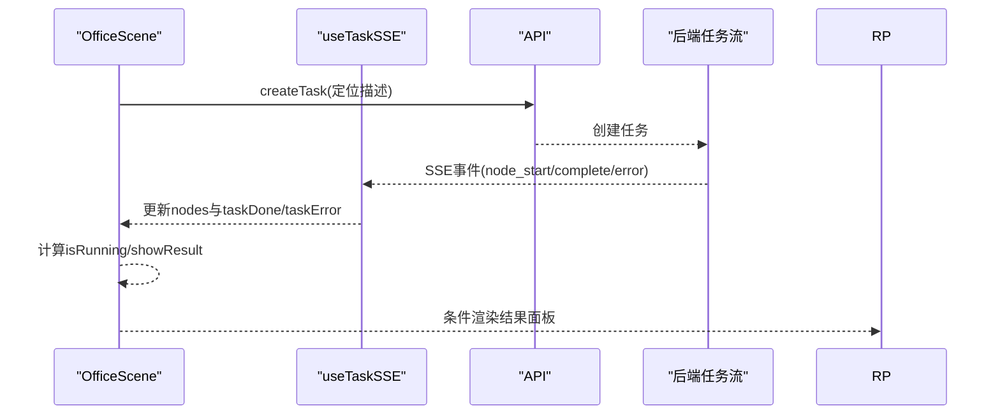
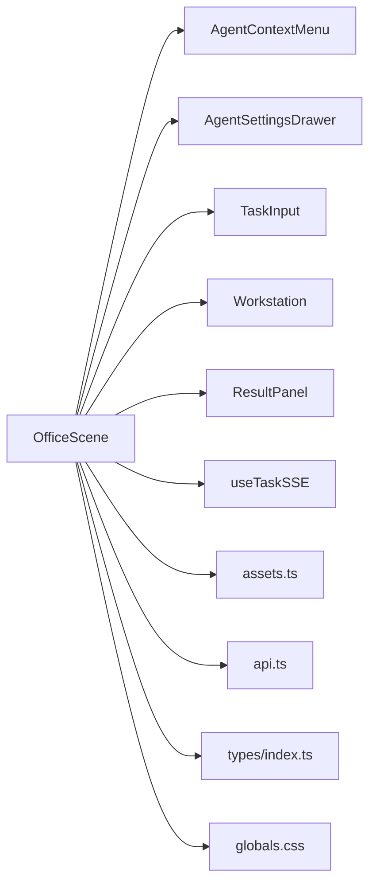

# 交互式Agent控制

<cite>
**本文引用的文件列表**
- [AgentContextMenu.tsx](file://frontend/components/office/AgentContextMenu.tsx)
- [AgentSettingsDrawer.tsx](file://frontend/components/office/AgentSettingsDrawer.tsx)
- [TaskInput.tsx](file://frontend/components/office/TaskInput.tsx)
- [Workstation.tsx](file://frontend/components/office/Workstation.tsx)
- [ResultPanel.tsx](file://frontend/components/office/ResultPanel.tsx)
- [PixelCharacter.tsx](file://frontend/components/office/PixelCharacter.tsx)
- [SpeechBubble.tsx](file://frontend/components/office/SpeechBubble.tsx)
- [OfficeScene.tsx](file://frontend/components/office/OfficeScene.tsx)
- [useTaskSSE.ts](file://frontend/hooks/useTaskSSE.ts)
- [api.ts](file://frontend/lib/api.ts)
- [assets.ts](file://frontend/lib/assets.ts)
- [index.ts](file://frontend/types/index.ts)
- [globals.css](file://frontend/app/globals.css)
</cite>

## 目录
1. [简介](#简介)
2. [项目结构](#项目结构)
3. [核心组件](#核心组件)
4. [架构总览](#架构总览)
5. [组件详解](#组件详解)
6. [依赖关系分析](#依赖关系分析)
7. [性能考量](#性能考量)
8. [故障排查指南](#故障排查指南)
9. [结论](#结论)
10. [附录](#附录)

## 简介
本文件为“交互式Agent控制”子系统的完整技术文档，聚焦于编辑部场景中的Agent控制与可视化交互。内容涵盖：
- Agent上下文菜单（右键菜单、快捷操作、状态切换）
- Agent设置抽屉（配置面板、参数调整、实时预览）
- 任务输入组件（表单校验、数据绑定、提交流程）
- 工作站组件（状态管理、Agent分配、工作流与进度跟踪）
- 结果面板（数据展示、图表渲染、信息汇总、导出）
- 组件间通信机制、事件处理与状态同步策略
- 用户体验优化、响应式设计与无障碍支持
- 面向开发者的组件扩展与二次开发指南

## 项目结构
该子系统位于前端工程的“office”组件目录下，围绕一个像素风的“编辑部房间”场景构建，包含多个可交互的UI组件与状态管理Hook，并通过API层与后端任务流进行连接。

**图示来源**
- [OfficeScene.tsx:1-428](file://frontend/components/office/OfficeScene.tsx#L1-L428)
- [AgentContextMenu.tsx:1-84](file://frontend/components/office/AgentContextMenu.tsx#L1-L84)
- [AgentSettingsDrawer.tsx:1-175](file://frontend/components/office/AgentSettingsDrawer.tsx#L1-L175)
- [TaskInput.tsx:1-55](file://frontend/components/office/TaskInput.tsx#L1-L55)
- [Workstation.tsx:1-120](file://frontend/components/office/Workstation.tsx#L1-L120)
- [ResultPanel.tsx:1-146](file://frontend/components/office/ResultPanel.tsx#L1-L146)
- [useTaskSSE.ts:1-144](file://frontend/hooks/useTaskSSE.ts#L1-L144)
- [api.ts:1-289](file://frontend/lib/api.ts#L1-L289)
- [assets.ts:1-125](file://frontend/lib/assets.ts#L1-L125)
- [index.ts:1-119](file://frontend/types/index.ts#L1-L119)
- [globals.css:1-386](file://frontend/app/globals.css#L1-L386)

**章节来源**
- [OfficeScene.tsx:1-428](file://frontend/components/office/OfficeScene.tsx#L1-L428)

## 核心组件
- 上下文菜单：提供右键菜单入口，支持“设置”“查看Prompt”等快捷操作，点击外部自动关闭。
- 设置抽屉：右侧滑入式配置面板，支持加载Agent信息、编辑System Prompt、恢复默认、保存配置。
- 任务输入：底部输入面板，负责接收用户输入的任务定位描述，进行长度校验并触发任务创建。
- 工作站：桌面+显示器+像素角色的组合，根据Agent状态显示不同颜色与动画，悬浮气泡提示处理状态。
- 结果面板：任务完成后从右侧滑出，展示账号画像、选题、标题、正文草稿与审核结果等。

**章节来源**
- [AgentContextMenu.tsx:1-84](file://frontend/components/office/AgentContextMenu.tsx#L1-L84)
- [AgentSettingsDrawer.tsx:1-175](file://frontend/components/office/AgentSettingsDrawer.tsx#L1-L175)
- [TaskInput.tsx:1-55](file://frontend/components/office/TaskInput.tsx#L1-L55)
- [Workstation.tsx:1-120](file://frontend/components/office/Workstation.tsx#L1-L120)
- [ResultPanel.tsx:1-146](file://frontend/components/office/ResultPanel.tsx#L1-L146)

## 架构总览
系统采用“场景容器 + 多组件 + Hook + API”的分层架构：
- 场景容器负责布局、状态聚合与事件分发
- 组件各自承担UI职责与局部状态
- Hook封装SSE事件流，统一节点状态管理
- API层对接后端任务流与Agent配置

**图示来源**
- [OfficeScene.tsx:80-94](file://frontend/components/office/OfficeScene.tsx#L80-L94)
- [AgentContextMenu.tsx:55-80](file://frontend/components/office/AgentContextMenu.tsx#L55-L80)
- [AgentSettingsDrawer.tsx:48-60](file://frontend/components/office/AgentSettingsDrawer.tsx#L48-L60)
- [TaskInput.tsx:16-21](file://frontend/components/office/TaskInput.tsx#L16-L21)
- [api.ts:26-31](file://frontend/lib/api.ts#L26-L31)
- [useTaskSSE.ts:64-127](file://frontend/hooks/useTaskSSE.ts#L64-L127)

## 组件详解

### Agent上下文菜单（右键菜单）
- 功能要点
  - 右键触发：在编辑部场景中对每个Agent位置监听右键事件，弹出菜单
  - 快捷操作：支持“设置”“查看Prompt”，点击后自动关闭菜单
  - 外部点击关闭：监听document级鼠标事件，点击菜单外区域自动关闭
  - 视觉风格：像素边框、深色背景、等宽字体，符合整体主题
- 关键交互
  - onContextMenu -> handleAgentContextMenu -> setContextMenu -> 渲染菜单
  - 菜单项回调 -> onSettings/onViewPrompt -> 关闭菜单并打开设置抽屉或查看Prompt
- 状态与事件
  - 状态：contextMenu（包含agentId、agentName、坐标）
  - 事件：mousedown（document）用于关闭菜单

**图示来源**
- [OfficeScene.tsx:80-94](file://frontend/components/office/OfficeScene.tsx#L80-L94)
- [AgentContextMenu.tsx:30-38](file://frontend/components/office/AgentContextMenu.tsx#L30-L38)

**章节来源**
- [AgentContextMenu.tsx:1-84](file://frontend/components/office/AgentContextMenu.tsx#L1-L84)
- [OfficeScene.tsx:80-94](file://frontend/components/office/OfficeScene.tsx#L80-L94)

### Agent设置抽屉（配置面板）
- 功能要点
  - 加载Agent信息：首次打开时异步拉取Agent基本信息与默认Prompt
  - Prompt编辑：支持自定义System Prompt，区分“默认/自定义”来源
  - 恢复默认：一键恢复到默认System Prompt
  - 保存配置：调用API更新Agent配置，更新promptSource并反馈消息
  - 动画与遮罩：右侧滑入动画与半透明遮罩，点击遮罩关闭
- 数据流
  - loadAgent -> setState -> 表单受控
  - handleSave -> updateAgentConfig -> setMessage -> 成功/失败提示
- 错误处理
  - 加载失败/保存失败分别设置错误消息
  - loading/saving状态禁用按钮，避免重复提交

**图示来源**
- [AgentSettingsDrawer.tsx:26-60](file://frontend/components/office/AgentSettingsDrawer.tsx#L26-L60)
- [api.ts:77-89](file://frontend/lib/api.ts#L77-L89)

**章节来源**
- [AgentSettingsDrawer.tsx:1-175](file://frontend/components/office/AgentSettingsDrawer.tsx#L1-L175)
- [api.ts:77-89](file://frontend/lib/api.ts#L77-L89)

### 任务输入组件（表单校验与提交）
- 功能要点
  - 输入限制：最小长度校验（例如至少5个字符），防止无效输入
  - 禁用逻辑：当存在运行中任务或加载中时禁用输入与提交按钮
  - 提交流程：阻止默认提交，清理空白，调用父组件onSubmit
- 交互细节
  - 受控组件：input受useState驱动
  - 按钮状态：disabled根据loading/disabled/text长度动态变化
  - 占位提示：提供示例输入，提升可用性

**图示来源**
- [TaskInput.tsx:16-21](file://frontend/components/office/TaskInput.tsx#L16-L21)

**章节来源**
- [TaskInput.tsx:1-55](file://frontend/components/office/TaskInput.tsx#L1-L55)

### 工作站组件（状态管理与进度跟踪）
- 功能要点
  - 状态指示：根据NodeStatus设置显示器背景色与发光效果
  - 进度提示：运行中显示“处理中”，完成显示摘要前20字符，失败显示“出错了!”
  - 角色动画：根据状态应用不同的像素动画类，配合气泡文本
  - 计时显示：当有elapsed时显示秒数
- 设计细节
  - deskColor/monitorBg/monitorGlow按状态动态计算
  - bubbleText根据状态与输出摘要生成
  - PixelCharacter与SpeechBubble作为子组件组合

**图示来源**
- [Workstation.tsx:19-118](file://frontend/components/office/Workstation.tsx#L19-L118)
- [PixelCharacter.tsx:35-62](file://frontend/components/office/PixelCharacter.tsx#L35-L62)
- [SpeechBubble.tsx:12-48](file://frontend/components/office/SpeechBubble.tsx#L12-L48)

**章节来源**
- [Workstation.tsx:1-120](file://frontend/components/office/Workstation.tsx#L1-L120)
- [PixelCharacter.tsx:1-83](file://frontend/components/office/PixelCharacter.tsx#L1-L83)
- [SpeechBubble.tsx:1-50](file://frontend/components/office/SpeechBubble.tsx#L1-L50)

### 结果面板（数据展示与导出）
- 功能要点
  - 展示模式：初始隐藏，点击“查看结果”按钮展开；再次点击收起
  - 数据分区：账号画像、候选选题、候选标题、正文草稿、审核结果
  - 导出能力：当前实现为只读展示，如需导出可在上层业务层扩展
- 布局与交互
  - 固定右侧栏，带垂直滚动
  - 每个分区使用Section/KV辅助组件组织键值对
  - 文章正文以等宽文本展示，支持滚动查看

**图示来源**
- [ResultPanel.tsx:11-27](file://frontend/components/office/ResultPanel.tsx#L11-L27)
- [ResultPanel.tsx:50-122](file://frontend/components/office/ResultPanel.tsx#L50-L122)

**章节来源**
- [ResultPanel.tsx:1-146](file://frontend/components/office/ResultPanel.tsx#L1-L146)

### 组件间通信与状态同步
- 事件链路
  - OfficeScene作为中枢：聚合nodes、taskDone、taskError、taskId、resultData
  - 右键菜单 -> 设置抽屉：通过agentId传递，抽屉内异步加载并更新
  - 任务输入 -> API -> SSE：创建任务后通过SSE事件流更新nodes状态
- 状态同步
  - useTaskSSE维护节点状态数组，监听node_start/node_complete/node_error/task_complete/task_error
  - OfficeScene根据nodes与taskDone/TaskError决定是否展示结果面板与状态徽章
- 无障碍与响应式
  - 使用语义化标签与title属性提供可访问性提示
  - 响应式断点与等宽字体确保在小屏设备上的可读性

**图示来源**
- [OfficeScene.tsx:62-72](file://frontend/components/office/OfficeScene.tsx#L62-L72)
- [useTaskSSE.ts:60-127](file://frontend/hooks/useTaskSSE.ts#L60-L127)
- [api.ts:26-31](file://frontend/lib/api.ts#L26-L31)

**章节来源**
- [OfficeScene.tsx:1-428](file://frontend/components/office/OfficeScene.tsx#L1-L428)
- [useTaskSSE.ts:1-144](file://frontend/hooks/useTaskSSE.ts#L1-L144)
- [api.ts:1-289](file://frontend/lib/api.ts#L1-L289)

## 依赖关系分析
- 组件依赖
  - OfficeScene依赖所有子组件与Hook，是控制中心
  - PixelCharacter/SpeechBubble被Workstation与场景中的Agent覆盖层复用
  - AgentContextMenu与AgentSettingsDrawer通过OfficeScene进行状态协调
- 资源与样式
  - assets.ts集中管理精灵图与UI资源路径
  - globals.css提供像素风主题与动画基元
- 类型与API
  - types/index.ts定义任务与节点状态、SSE事件类型
  - api.ts封装后端接口，统一错误处理

**图示来源**
- [OfficeScene.tsx:14-47](file://frontend/components/office/OfficeScene.tsx#L14-L47)
- [assets.ts:1-125](file://frontend/lib/assets.ts#L1-L125)
- [api.ts:1-289](file://frontend/lib/api.ts#L1-L289)
- [index.ts:1-119](file://frontend/types/index.ts#L1-L119)
- [globals.css:1-386](file://frontend/app/globals.css#L1-L386)

**章节来源**
- [OfficeScene.tsx:1-428](file://frontend/components/office/OfficeScene.tsx#L1-L428)
- [assets.ts:1-125](file://frontend/lib/assets.ts#L1-L125)
- [api.ts:1-289](file://frontend/lib/api.ts#L1-L289)
- [index.ts:1-119](file://frontend/types/index.ts#L1-L119)
- [globals.css:1-386](file://frontend/app/globals.css#L1-L386)

## 性能考量
- 事件源连接
  - useTaskSSE使用EventSource，浏览器自动重连与指数退避，减少手动心跳
  - 连接关闭时机：task_complete与task_error时主动关闭，避免资源泄漏
- 渲染优化
  - OfficeScene仅在状态变更时重绘相关区域（nodes、taskDone、taskError）
  - 抽屉与菜单采用条件渲染，避免常驻DOM
- 图像与动画
  - 精灵图与像素化渲染，减少缩放模糊
  - 动画使用CSS keyframes，避免JavaScript动画抖动

[本节为通用性能建议，无需特定文件引用]

## 故障排查指南
- 右键菜单无法关闭
  - 检查document级mousedown事件是否正确绑定与解绑
  - 确认onClose回调是否被正确传递给AgentContextMenu
- 设置抽屉无法加载或保存失败
  - 检查agentId是否有效
  - 查看API返回的错误码与消息，确认网络请求是否成功
- 任务无法创建或SSE无事件
  - 确认createTask请求体格式与后端路由一致
  - 检查SSE URL是否正确（浏览器直连后端，避免代理缓冲）
- 结果面板不显示
  - 确认taskDone为true且resultData非空
  - 检查OfficeScene中showResult计算逻辑

**章节来源**
- [AgentContextMenu.tsx:30-38](file://frontend/components/office/AgentContextMenu.tsx#L30-L38)
- [AgentSettingsDrawer.tsx:26-42](file://frontend/components/office/AgentSettingsDrawer.tsx#L26-L42)
- [api.ts:26-31](file://frontend/lib/api.ts#L26-L31)
- [useTaskSSE.ts:64-127](file://frontend/hooks/useTaskSSE.ts#L64-L127)
- [OfficeScene.tsx:71-72](file://frontend/components/office/OfficeScene.tsx#L71-L72)

## 结论
本系统通过像素风格的编辑部场景，将Agent控制、任务编排与实时可视化有机结合。上下文菜单与设置抽屉提供了便捷的配置入口，任务输入与SSE事件流保证了流畅的工作流体验，结果面板则实现了多维度的信息汇总与展示。整体架构清晰、组件职责明确，具备良好的扩展性与可维护性。

[本节为总结性内容，无需特定文件引用]

## 附录

### 开发与扩展指南
- 新增Agent角色
  - 在assets.ts中添加新的精灵图路径与映射
  - 在OfficeScene的AGENT_CONFIG中新增位置与角色信息
  - 在Workstation中根据新角色调整状态样式
- 新增节点与SSE事件
  - 在types/index.ts中扩展NodeState与SSE事件类型
  - 在useTaskSSE.ts中添加对应事件监听与状态更新
  - 在OfficeScene中渲染新节点状态与日志
- 自定义样式与动画
  - 在globals.css中新增动画与主题变量
  - 通过className组合实现组件级样式复用
- 无障碍与可访问性
  - 为交互元素提供title与aria-label
  - 使用键盘可导航（Tab顺序合理，Enter/Space激活）
  - 提供高对比度与低闪烁模式支持

[本节为通用开发建议，无需特定文件引用]