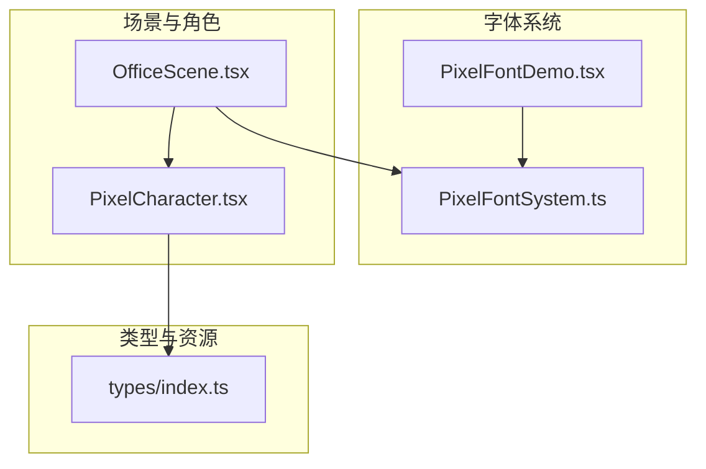
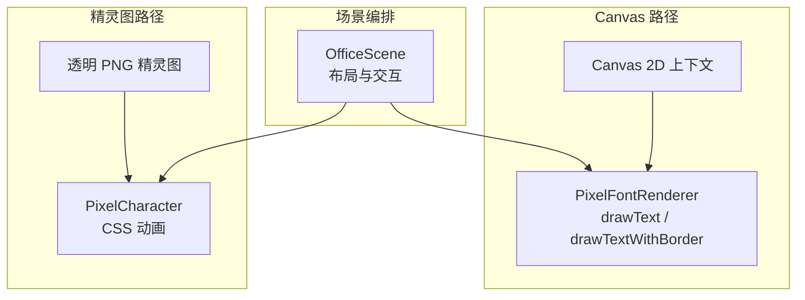
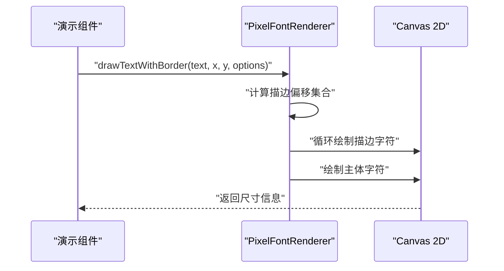
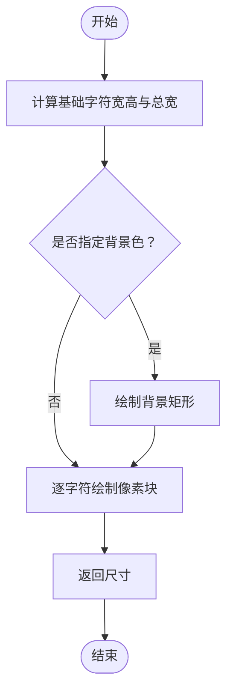
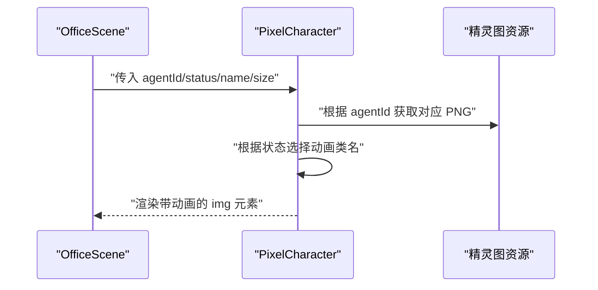
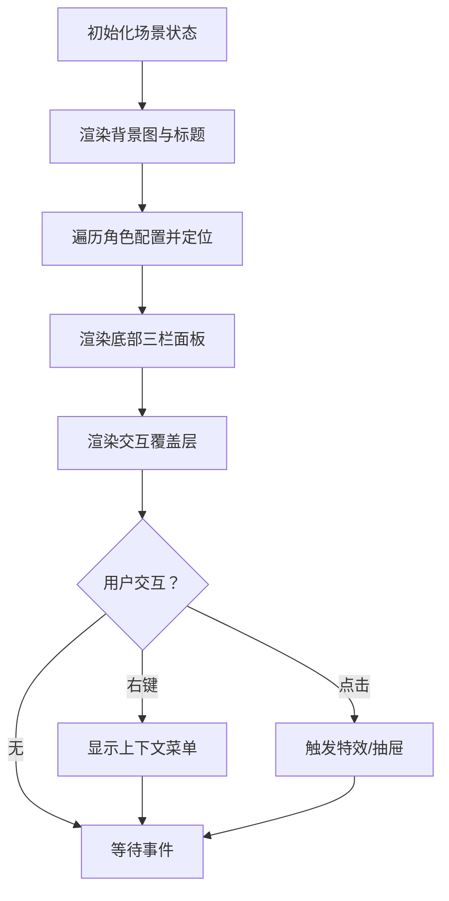
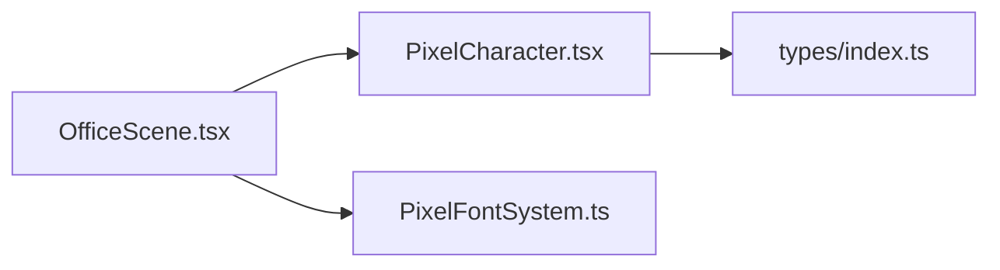

# 像素风格组件

<cite>
**本文引用的文件**
- [PixelFontSystem.ts](file://frontend/lib/pixel-font/PixelFontSystem.ts)
- [PixelFontDemo.tsx](file://frontend/components/demo/PixelFontDemo.tsx)
- [PixelCharacter.tsx](file://frontend/components/office/PixelCharacter.tsx)
- [OfficeScene.tsx](file://frontend/components/office/OfficeScene.tsx)
- [index.ts](file://frontend/types/index.ts)
</cite>

## 目录
1. [简介](#简介)
2. [项目结构](#项目结构)
3. [核心组件](#核心组件)
4. [架构总览](#架构总览)
5. [详细组件分析](#详细组件分析)
6. [依赖关系分析](#依赖关系分析)
7. [性能考虑](#性能考虑)
8. [故障排查指南](#故障排查指南)
9. [结论](#结论)
10. [附录](#附录)

## 简介
本文件面向开发者，系统化梳理并讲解本仓库中的像素风格组件体系，重点覆盖以下方面：
- Canvas 2D 渲染引擎：像素艺术绘制、纹理管理与动画系统
- 角色渲染器、场景渲染器与像素字体系统的设计与实现
- 坐标系统、层级管理与交互逻辑
- 颜色调色板、透明度处理与特效实现
- 渲染性能优化策略、内存管理与 GPU 加速方案
- 像素艺术创作规范、尺寸标准与质量控制要求

## 项目结构
本项目前端采用 Next.js 架构，像素风格组件主要分布在以下位置：
- 字体系统：frontend/lib/pixel-font
- 场景与角色：frontend/components/office
- 演示与集成：frontend/components/demo
- 类型定义：frontend/types



图表来源
- [PixelFontSystem.ts:1-579](file://frontend/lib/pixel-font/PixelFontSystem.ts#L1-L579)
- [PixelFontDemo.tsx:1-149](file://frontend/components/demo/PixelFontDemo.tsx#L1-L149)
- [OfficeScene.tsx:1-428](file://frontend/components/office/OfficeScene.tsx#L1-L428)
- [PixelCharacter.tsx:1-83](file://frontend/components/office/PixelCharacter.tsx#L1-L83)
- [index.ts:1-119](file://frontend/types/index.ts#L1-L119)

章节来源
- [PixelFontSystem.ts:1-579](file://frontend/lib/pixel-font/PixelFontSystem.ts#L1-L579)
- [PixelFontDemo.tsx:1-149](file://frontend/components/demo/PixelFontDemo.tsx#L1-L149)
- [OfficeScene.tsx:1-428](file://frontend/components/office/OfficeScene.tsx#L1-L428)
- [PixelCharacter.tsx:1-83](file://frontend/components/office/PixelCharacter.tsx#L1-L83)
- [index.ts:1-119](file://frontend/types/index.ts#L1-L119)

## 核心组件
- 像素字体渲染器：基于 Canvas 2D 的自定义像素字体绘制，支持缩放、间距、背景与描边效果，并提供预设样式与 DOM 元素创建能力。
- 角色渲染器：以透明 PNG 精灵图叠加在场景背景之上，通过 CSS 动画实现工作/完成/空闲等状态的像素级动画。
- 场景渲染器：负责房间布局、面板区域、交互层叠与状态提示的整体编排。

章节来源
- [PixelFontSystem.ts:394-538](file://frontend/lib/pixel-font/PixelFontSystem.ts#L394-L538)
- [PixelCharacter.tsx:35-62](file://frontend/components/office/PixelCharacter.tsx#L35-L62)
- [OfficeScene.tsx:62-222](file://frontend/components/office/OfficeScene.tsx#L62-L222)

## 架构总览
像素风格组件的渲染路径分为两条主线：
- Canvas 路径：通过 PixelFontRenderer 在 Canvas 上逐像素绘制字符，适合需要精确像素控制与特效的场景。
- 精灵图路径：通过 PixelCharacter 将 PNG 精灵图叠加到场景背景上，适合角色与图标的状态展示与轻量动画。



图表来源
- [PixelFontSystem.ts:394-538](file://frontend/lib/pixel-font/PixelFontSystem.ts#L394-L538)
- [PixelCharacter.tsx:35-62](file://frontend/components/office/PixelCharacter.tsx#L35-L62)
- [OfficeScene.tsx:110-222](file://frontend/components/office/OfficeScene.tsx#L110-L222)

## 详细组件分析

### 像素字体系统（PixelFontRenderer）
- 设计要点
  - 自定义字符映射表：每个字符由固定尺寸的像素矩阵表示，保证一致的像素风格。
  - 绘制流程：按字符索引像素矩阵，结合缩放与间距参数，逐像素填充到 Canvas。
  - 效果扩展：支持背景填充、描边（多方向偏移绘制）与 DOM 文本元素创建。
  - 样式系统：提供预设样式常量，统一标题、成功、警告、信息、弱化等视觉语义。

```mermaid
classDiagram
class PixelFontRenderer {
-ctx : CanvasRenderingContext2D
-defaultOptions : PixelFontOptions
+constructor(ctx)
+drawText(text, x, y, options) : {width,height}
-drawCharacter(char, x, y, scale, color)
+measureText(text, scale, spacing) : {width,height}
+drawTextWithBorder(text, x, y, options) : {width,height}
+static createPixelTextElement(text, className, style) : HTMLElement
}
class PixelFontOptions {
+scale : number
+color : string
+backgroundColor : string
+spacing : number
}
PixelFontRenderer --> PixelFontOptions : "使用"
```

图表来源
- [PixelFontSystem.ts:387-401](file://frontend/lib/pixel-font/PixelFontSystem.ts#L387-L401)
- [PixelFontSystem.ts:394-538](file://frontend/lib/pixel-font/PixelFontSystem.ts#L394-L538)

- 关键流程（带描边文本）


图表来源
- [PixelFontSystem.ts:485-515](file://frontend/lib/pixel-font/PixelFontSystem.ts#L485-L515)
- [PixelFontDemo.tsx:68-75](file://frontend/components/demo/PixelFontDemo.tsx#L68-L75)

- 文本测量与布局


图表来源
- [PixelFontSystem.ts:410-441](file://frontend/lib/pixel-font/PixelFontSystem.ts#L410-L441)

章节来源
- [PixelFontSystem.ts:7-385](file://frontend/lib/pixel-font/PixelFontSystem.ts#L7-L385)
- [PixelFontSystem.ts:394-538](file://frontend/lib/pixel-font/PixelFontSystem.ts#L394-L538)
- [PixelFontDemo.tsx:12-91](file://frontend/components/demo/PixelFontDemo.tsx#L12-L91)

### 角色渲染器（PixelCharacter）
- 设计要点
  - 使用透明 PNG 精灵图承载角色外观，避免 Canvas 绘制开销。
  - 通过 CSS 动画类实现“工作”“完成”“空闲”等状态的像素级动画。
  - 提供主角色与状态图标两种尺寸规格，适配不同面板需求。
  - 通过 imageRendering: pixelated 强制像素化缩放，保持清晰锐利的像素风格。



图表来源
- [PixelCharacter.tsx:35-62](file://frontend/components/office/PixelCharacter.tsx#L35-L62)
- [OfficeScene.tsx:144-182](file://frontend/components/office/OfficeScene.tsx#L144-L182)

章节来源
- [PixelCharacter.tsx:1-83](file://frontend/components/office/PixelCharacter.tsx#L1-L83)
- [OfficeScene.tsx:29-37](file://frontend/components/office/OfficeScene.tsx#L29-L37)

### 场景渲染器（OfficeScene）
- 设计要点
  - 房间背景采用大图铺贴，配合顶部导航与底部三栏面板，形成完整的像素风办公场景。
  - 通过绝对定位与 transform: translate(-50%, -50%) 实现角色在网格上的精确定位。
  - 交互层叠：右键弹出菜单、气泡提示、感叹号特效、侧边设置抽屉等，均通过状态管理控制显示与销毁。
  - 状态反馈：任务进行中、完成、错误等状态以浮动徽章与面板文字呈现。



图表来源
- [OfficeScene.tsx:110-222](file://frontend/components/office/OfficeScene.tsx#L110-L222)
- [OfficeScene.tsx:391-425](file://frontend/components/office/OfficeScene.tsx#L391-L425)

章节来源
- [OfficeScene.tsx:1-428](file://frontend/components/office/OfficeScene.tsx#L1-L428)

### 坐标系统、层级管理与交互逻辑
- 坐标系统
  - Canvas 坐标系：原点位于左上角，向右为 X 正方向，向下为 Y 正方向。像素字体绘制时以字符为单位进行像素填充。
  - 场景坐标系：使用百分比定位与 transform 进行角色定位，确保在不同分辨率下的相对位置稳定。
- 层级管理
  - 背景图层（Room）< 文本/气泡层（SpeechBubble）< 角色层（PixelCharacter）< 交互覆盖层（菜单/抽屉/特效）。
- 交互逻辑
  - 右键菜单：记录鼠标坐标，生成唯一 id 并添加到状态数组，渲染后回调完成清理。
  - 状态图标：在面板中以小尺寸精灵图展示角色状态，便于快速浏览。

章节来源
- [PixelFontSystem.ts:410-441](file://frontend/lib/pixel-font/PixelFontSystem.ts#L410-L441)
- [OfficeScene.tsx:155-182](file://frontend/components/office/OfficeScene.tsx#L155-L182)
- [OfficeScene.tsx:394-421](file://frontend/components/office/OfficeScene.tsx#L394-L421)

### 颜色调色板、透明度与特效
- 调色板与透明度
  - 字体颜色：通过 options.color 控制；背景可选透明或指定色块。
  - 角色状态：通过 CSS 文本色与边框色区分状态（如黄色工作、绿色完成、红色错误）。
- 特效实现
  - 描边：通过 8 方向偏移绘制字符，形成黑底描边效果。
  - 动画：角色使用 CSS 动画类实现像素级跳动与完成动作。
  - 特殊提示：感叹号特效与浮动徽章用于强调任务状态。

章节来源
- [PixelFontSystem.ts:485-515](file://frontend/lib/pixel-font/PixelFontSystem.ts#L485-L515)
- [PixelCharacter.tsx:27-32](file://frontend/components/office/PixelCharacter.tsx#L27-L32)
- [OfficeScene.tsx:191-221](file://frontend/components/office/OfficeScene.tsx#L191-L221)

## 依赖关系分析
- 组件耦合
  - OfficeScene 依赖 PixelCharacter 与 PixelFontRenderer，分别用于角色渲染与文本绘制。
  - PixelCharacter 依赖资源映射表（通过 AGENT_SPRITE_URL），并使用类型定义中的 AgentCharacter 结构。
- 外部依赖
  - Canvas 2D API：用于像素级绘制与文本测量。
  - CSS 动画与 imageRendering：用于角色动画与像素化缩放。
  - Next.js 图像与链接组件：用于场景背景与导航。



图表来源
- [OfficeScene.tsx:18-25](file://frontend/components/office/OfficeScene.tsx#L18-L25)
- [PixelCharacter.tsx](file://frontend/components/office/PixelCharacter.tsx#L9)
- [index.ts:98-107](file://frontend/types/index.ts#L98-L107)

章节来源
- [OfficeScene.tsx:1-428](file://frontend/components/office/OfficeScene.tsx#L1-L428)
- [PixelCharacter.tsx:1-83](file://frontend/components/office/PixelCharacter.tsx#L1-L83)
- [PixelFontSystem.ts:1-579](file://frontend/lib/pixel-font/PixelFontSystem.ts#L1-L579)
- [index.ts:1-119](file://frontend/types/index.ts#L1-L119)

## 性能考虑
- Canvas 绘制优化
  - 批量绘制：尽量合并多次 fillRect 调用，减少上下文切换。
  - 禁用平滑：确保像素风格不被浏览器插值破坏（演示中已设置 imageSmoothingEnabled=false）。
  - 文本测量缓存：对常用字符串尺寸进行缓存，避免重复计算。
- 精灵图与动画
  - 使用 PNG 精灵图而非 Canvas 绘制角色，降低 CPU 占用。
  - CSS 动画优于 JavaScript 动画，充分利用 GPU。
- 内存管理
  - 合理销毁临时特效与菜单，避免 DOM 泄漏。
  - 对于大量动态文本，建议复用渲染器实例并重用上下文。
- GPU 加速
  - 开启硬件加速：使用 transform 与 opacity 动画，避免触发布局与重绘。
  - 使用 imageRendering: pixelated 保持像素风格的同时让浏览器尽可能优化缩放。

## 故障排查指南
- 文本未显示或模糊
  - 检查 Canvas 上下文的 imageSmoothingEnabled 是否被关闭。
  - 确认字符映射表中是否存在未覆盖的字符，必要时回退为空格。
- 动画异常
  - 确认 CSS 动画类名拼写正确且 Tailwind 已正确加载。
  - 检查 imageRendering: pixelated 是否生效。
- 交互无效
  - 确保事件处理器未被条件禁用（如任务进行中时禁用输入）。
  - 检查状态数组中特效项的 id 与清理逻辑是否匹配。

章节来源
- [PixelFontDemo.tsx:20-22](file://frontend/components/demo/PixelFontDemo.tsx#L20-L22)
- [PixelCharacter.tsx:47-49](file://frontend/components/office/PixelCharacter.tsx#L47-L49)
- [OfficeScene.tsx:234-239](file://frontend/components/office/OfficeScene.tsx#L234-L239)

## 结论
本像素风格组件体系通过“Canvas 字体 + 精灵图角色 + 场景编排”的组合，实现了高还原度的像素艺术渲染与良好的交互体验。遵循本文的坐标系统、层级管理、性能优化与质量控制建议，可在复杂场景中保持稳定的帧率与一致的像素风格。

## 附录

### 像素艺术创作规范与尺寸标准
- 字符尺寸
  - 基础字符像素矩阵：宽高固定，便于对齐与缩放。
  - 推荐缩放倍数：整数倍（2x/3x）以避免插值模糊。
- 精灵图规范
  - 建议使用 1:1 比例的正方形图，便于定位与对齐。
  - 透明背景，避免多余边距影响定位。
- 颜色与透明
  - 使用有限调色板，确保在不同设备上的一致性。
  - 透明像素用于裁剪与遮罩，避免硬边缘毛刺。

### 质量控制清单
- 渲染一致性：检查不同缩放倍数下的像素对齐情况。
- 动画流畅性：在低端设备上验证 CSS 动画帧率。
- 交互响应：确认右键菜单与抽屉的触发与销毁逻辑。
- 文本可读性：在不同背景下测试字体对比度与描边效果。