# 响应式布局系统

<cite>
**本文档引用的文件**
- [frontend/app/layout.tsx](file://frontend/app/layout.tsx)
- [frontend/app/globals.css](file://frontend/app/globals.css)
- [frontend/components/office/BigScreen.tsx](file://frontend/components/office/BigScreen.tsx)
- [frontend/components/office/OfficeScene.tsx](file://frontend/components/office/OfficeScene.tsx)
- [frontend/types/index.ts](file://frontend/types/index.ts)
- [frontend/postcss.config.js](file://frontend/postcss.config.js)
- [frontend/next.config.ts](file://frontend/next.config.ts)
- [frontend/package.json](file://frontend/package.json)
- [OpenClaw-bot-review-main/prd/mobile_adaptation_checklist.md](file://OpenClaw-bot-review-main/prd/mobile_adaptation_checklist.md)
</cite>

## 目录
1. [简介](#简介)
2. [项目结构](#项目结构)
3. [核心组件](#核心组件)
4. [架构概览](#架构概览)
5. [详细组件分析](#详细组件分析)
6. [依赖关系分析](#依赖关系分析)
7. [性能考虑](#性能考虑)
8. [故障排除指南](#故障排除指南)
9. [结论](#结论)
10. [附录](#附录)

## 简介

本项目是一个基于 Next.js 和 TailwindCSS 的响应式布局系统，专注于多智能体内容生产平台的用户界面设计。该系统采用现代化的前端技术栈，实现了从桌面端到移动端的完整响应式适配，特别针对大屏幕显示场景进行了优化。

系统的核心特色包括：
- 基于 TailwindCSS 的原子化样式系统
- 自定义设计系统和 CSS 变量管理
- 大屏幕仪表板和像素艺术风格的办公场景
- 完整的响应式断点策略和移动端适配
- 高性能的动画效果和视觉反馈

## 项目结构

前端项目采用模块化的目录结构，主要分为以下几个部分：

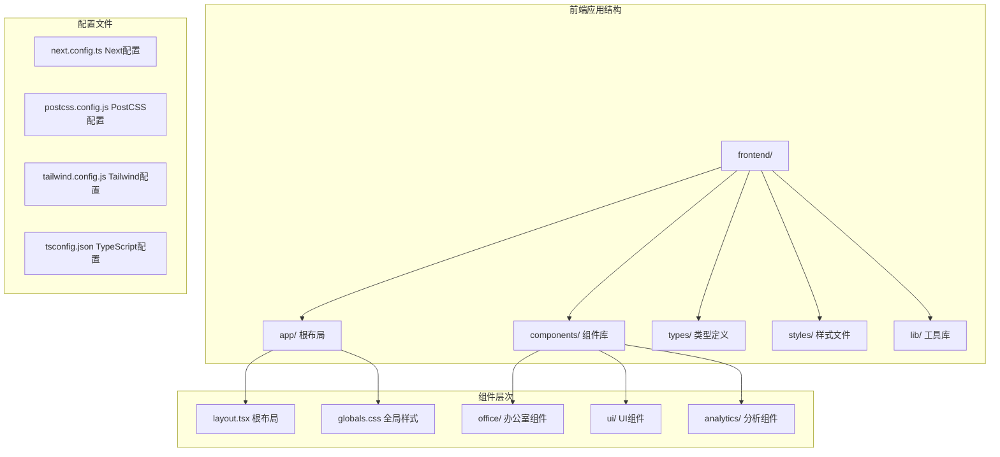

**图表来源**
- [frontend/app/layout.tsx:1-16](file://frontend/app/layout.tsx#L1-L16)
- [frontend/app/globals.css:1-386](file://frontend/app/globals.css#L1-L386)

**章节来源**
- [frontend/app/layout.tsx:1-16](file://frontend/app/layout.tsx#L1-L16)
- [frontend/package.json:1-23](file://frontend/package.json#L1-L23)

## 核心组件

### 根布局系统

根布局系统是整个应用的基础框架，负责全局样式注入和页面结构组织。

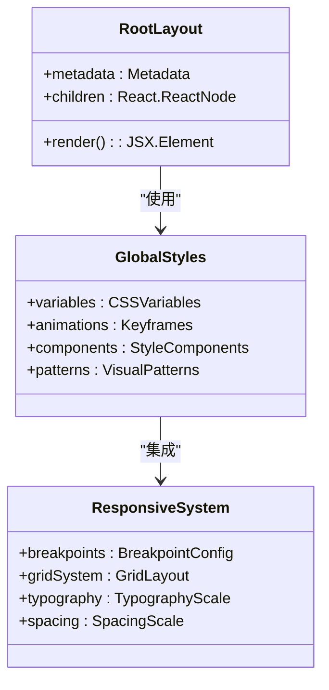

**图表来源**
- [frontend/app/layout.tsx:9-15](file://frontend/app/layout.tsx#L9-L15)
- [frontend/app/globals.css:7-32](file://frontend/app/globals.css#L7-L32)

### 设计系统架构

系统采用自定义的设计系统，通过 CSS 变量实现统一的主题管理：

| 设计元素 | 变量名称 | 颜色值 | 用途 |
|---------|----------|--------|------|
| 背景深色 | `--cr-bg-deep` | #080c18 | 页面基础背景 |
| 背景表面 | `--cr-bg-surface` | #111827 | 卡片和面板背景 |
| 文本主色 | `--cr-text-primary` | #e2e8f0 | 主要文本颜色 |
| 强调色 | `--cr-accent` | #00e5ff | 重要元素强调色 |
| 成功色 | `--cr-green` | #22c55e | 成功状态指示 |
| 错误色 | `--cr-red` | #ef4444 | 错误状态指示 |

**章节来源**
- [frontend/app/globals.css:7-32](file://frontend/app/globals.css#L7-L32)
- [frontend/app/globals.css:38-46](file://frontend/app/globals.css#L38-L46)

## 架构概览

### 响应式断点策略

系统采用基于 TailwindCSS 的响应式断点体系，结合自定义的像素艺术风格需求：

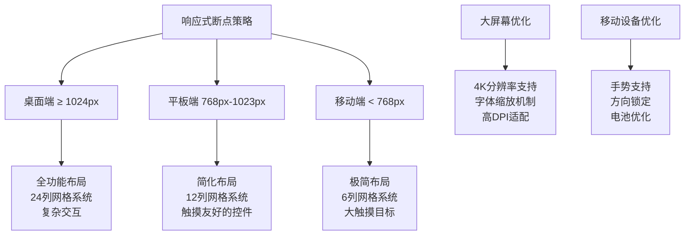

**图表来源**
- [OpenClaw-bot-review-main/prd/mobile_adaptation_checklist.md:14-26](file://OpenClaw-bot-review-main/prd/mobile_adaptation_checklist.md#L14-L26)

### 样式继承和主题定制

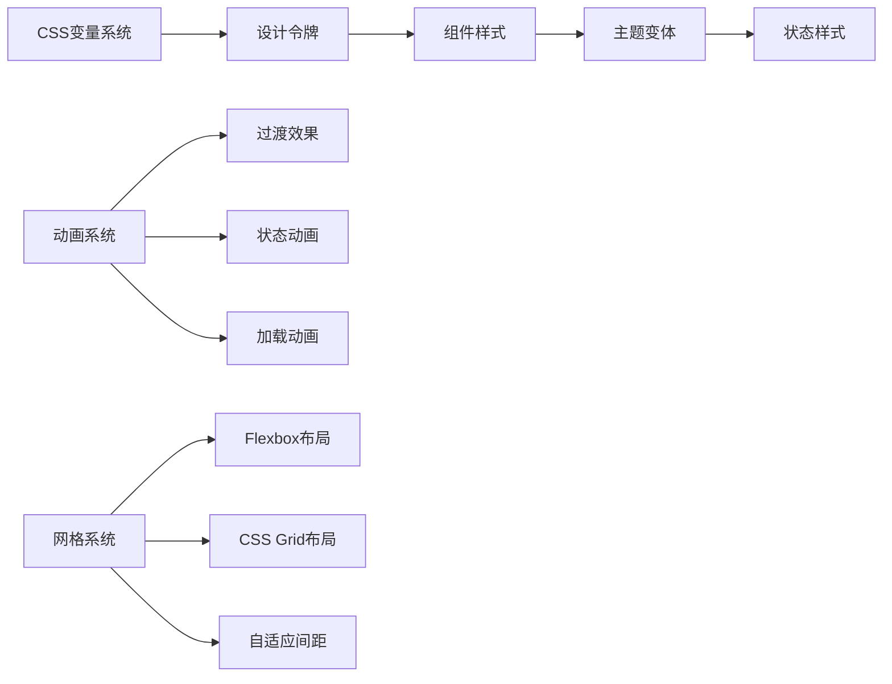

**图表来源**
- [frontend/app/globals.css:90-138](file://frontend/app/globals.css#L90-L138)
- [frontend/app/globals.css:264-341](file://frontend/app/globals.css#L264-L341)

**章节来源**
- [OpenClaw-bot-review-main/prd/mobile_adaptation_checklist.md:14-26](file://OpenClaw-bot-review-main/prd/mobile_adaptation_checklist.md#L14-L26)

## 详细组件分析

### 大屏幕显示器组件

BigScreen 组件是专为大屏幕设计的全屏展示组件，实现了类似 CRT 显示器的视觉效果：

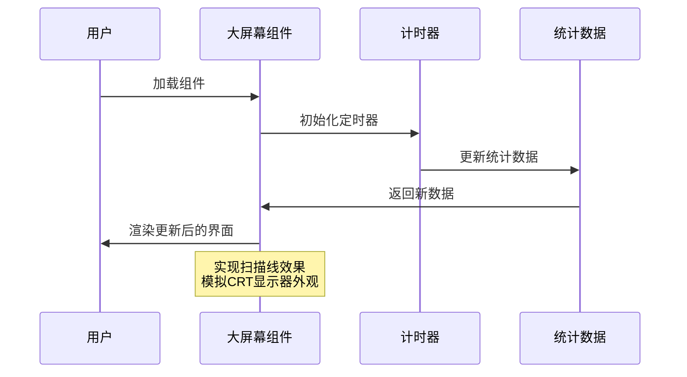

**图表来源**
- [frontend/components/office/BigScreen.tsx:23-36](file://frontend/components/office/BigScreen.tsx#L23-L36)
- [frontend/components/office/BigScreen.tsx:38-89](file://frontend/components/office/BigScreen.tsx#L38-L89)

#### 核心特性

1. **实时数据更新**: 每3秒自动更新粉丝数和阅读量
2. **扫描线效果**: 通过伪元素实现 CRT 显示器特有的扫描线纹理
3. **状态指示**: 不同的颜色和动画表示不同的数据状态
4. **响应式尺寸**: 支持不同屏幕尺寸的自适应布局

**章节来源**
- [frontend/components/office/BigScreen.tsx:1-100](file://frontend/components/office/BigScreen.tsx#L1-L100)

### 办公室场景组件

OfficeScene 是整个应用的核心组件，实现了完整的像素艺术风格办公场景：

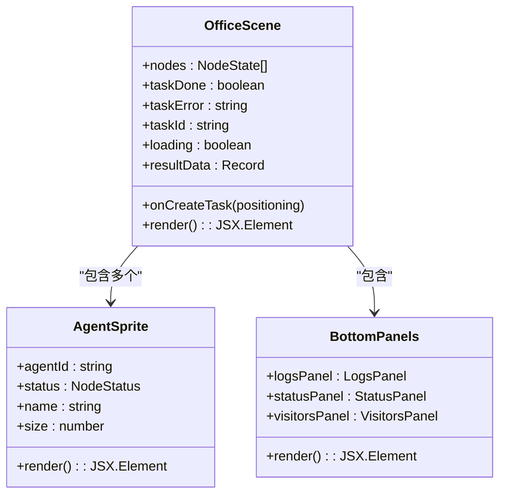

**图表来源**
- [frontend/components/office/OfficeScene.tsx:62-70](file://frontend/components/office/OfficeScene.tsx#L62-L70)
- [frontend/components/office/OfficeScene.tsx:145-182](file://frontend/components/office/OfficeScene.tsx#L145-L182)

#### 布局架构

组件采用双层布局设计：

1. **上半部分 - 办公场景**
   - 全屏背景图像展示
   - 6个智能体角色的定位和交互
   - 实时状态气泡提示系统

2. **下半部分 - 控制面板**
   - 三个功能面板的垂直排列
   - 日志记录、状态监控、访客管理
   - 响应式网格布局

**章节来源**
- [frontend/components/office/OfficeScene.tsx:110-427](file://frontend/components/office/OfficeScene.tsx#L110-L427)

### Flexbox 和 Grid 布局应用

系统广泛使用现代 CSS 布局技术：

#### Flexbox 应用场景

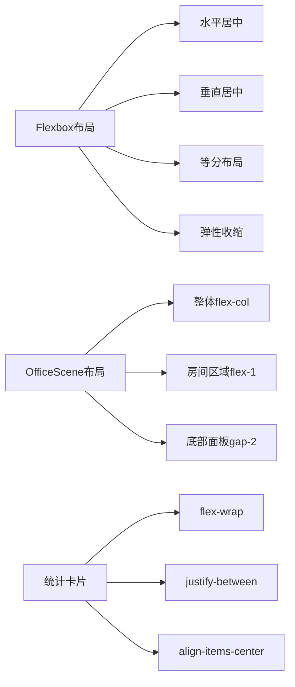

**图表来源**
- [frontend/components/office/OfficeScene.tsx:225-226](file://frontend/components/office/OfficeScene.tsx#L225-L226)
- [frontend/components/office/BigScreen.tsx:53-67](file://frontend/components/office/BigScreen.tsx#L53-L67)

#### CSS Grid 应用场景

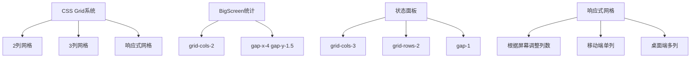

**图表来源**
- [frontend/components/office/BigScreen.tsx:62-67](file://frontend/components/office/BigScreen.tsx#L62-L67)
- [frontend/components/office/OfficeScene.tsx:296-337](file://frontend/components/office/OfficeScene.tsx#L296-L337)

**章节来源**
- [frontend/components/office/BigScreen.tsx:53-67](file://frontend/components/office/BigScreen.tsx#L53-L67)
- [frontend/components/office/OfficeScene.tsx:296-337](file://frontend/components/office/OfficeScene.tsx#L296-L337)

## 依赖关系分析

### 技术栈依赖

```mermaid
graph TB
subgraph "前端框架"
A[Next.js 16.2.1] --> B[React 19.2.4]
A --> C[TypeScript 5.9.3]
end
subgraph "样式系统"
D[TailwindCSS 4.2.2] --> E[PostCSS 8.5.8]
F[@tailwindcss/postcss] --> D
end
subgraph "开发工具"
G[React Hooks] --> H[状态管理]
I[类型安全] --> J[编译时检查]
end
subgraph "运行时依赖"
K[浏览器兼容性] --> L[渐进增强]
M[性能优化] --> N[懒加载]
end
```

**图表来源**
- [frontend/package.json:11-21](file://frontend/package.json#L11-L21)

### 构建流程依赖

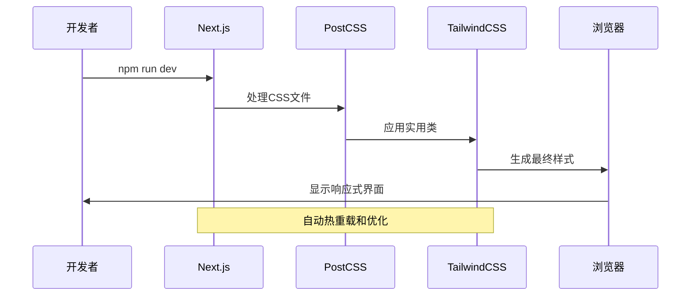

**图表来源**
- [frontend/postcss.config.js:1-6](file://frontend/postcss.config.js#L1-L6)
- [frontend/next.config.ts:3-12](file://frontend/next.config.ts#L3-L12)

**章节来源**
- [frontend/package.json:11-21](file://frontend/package.json#L11-L21)
- [frontend/postcss.config.js:1-6](file://frontend/postcss.config.js#L1-L6)

## 性能考虑

### 响应式性能优化

1. **CSS 变量优化**
   - 使用 CSS 变量减少重复样式定义
   - 支持动态主题切换而无需重新编译

2. **动画性能**
   - 使用 transform 和 opacity 进行动画以利用 GPU 加速
   - 限制动画频率和复杂度以保持流畅度

3. **图片优化**
   - 使用现代格式如 WebP
   - 实现懒加载和尺寸适配

### 移动端性能

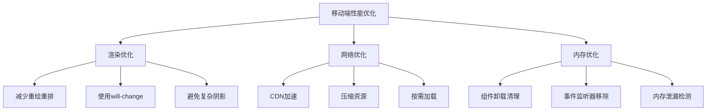

**章节来源**
- [frontend/app/globals.css:90-138](file://frontend/app/globals.css#L90-L138)
- [OpenClaw-bot-review-main/prd/mobile_adaptation_checklist.md:1-61](file://OpenClaw-bot-review-main/prd/mobile_adaptation_checklist.md#L1-L61)

## 故障排除指南

### 常见问题诊断

1. **样式不生效**
   - 检查 TailwindCSS 配置是否正确
   - 确认 CSS 变量引用格式
   - 验证 PostCSS 处理链

2. **响应式断点异常**
   - 检查媒体查询优先级
   - 验证断点定义顺序
   - 确认容器查询支持

3. **动画性能问题**
   - 检查硬件加速属性
   - 优化动画复杂度
   - 监控 FPS 性能

### 调试工具建议

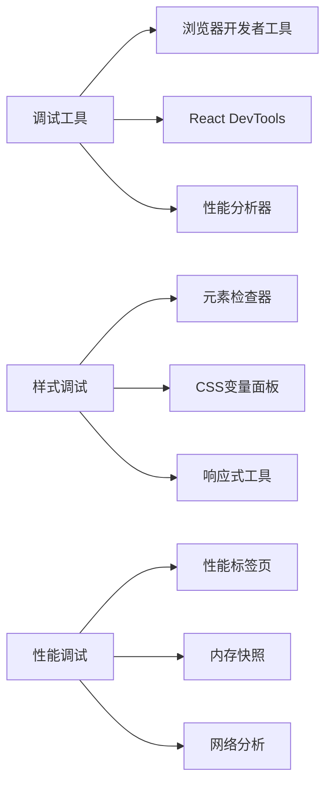

**章节来源**
- [frontend/app/globals.css:1-386](file://frontend/app/globals.css#L1-L386)

## 结论

本响应式布局系统成功实现了从桌面端到移动端的完整适配，特别针对大屏幕显示场景进行了深度优化。系统采用现代化的技术栈和设计原则，提供了良好的可维护性和扩展性。

### 主要优势

1. **完整的响应式支持**: 覆盖从移动端到大屏幕的全设备范围
2. **高性能实现**: 优化的动画和渲染性能
3. **可维护性强**: 模块化的组件架构和清晰的样式系统
4. **用户体验优秀**: 直观的交互设计和及时的状态反馈

### 发展方向

1. **进一步优化移动端体验**
2. **增强无障碍访问支持**
3. **扩展主题定制能力**
4. **提升国际化支持**

## 附录

### 最佳实践清单

1. **响应式设计最佳实践**
   - 移动优先的设计理念
   - 合理的断点选择和使用
   - 触摸友好的交互设计

2. **样式管理最佳实践**
   - 统一的命名规范
   - 组件样式的封装
   - CSS 变量的合理使用

3. **性能优化最佳实践**
   - 渐进式增强策略
   - 资源加载优化
   - 内存使用监控

### 维护指南

1. **定期更新检查**
   - 浏览器兼容性测试
   - 性能基准测试
   - 用户体验评估

2. **代码质量保证**
   - 代码审查流程
   - 单元测试覆盖率
   - 文档维护更新