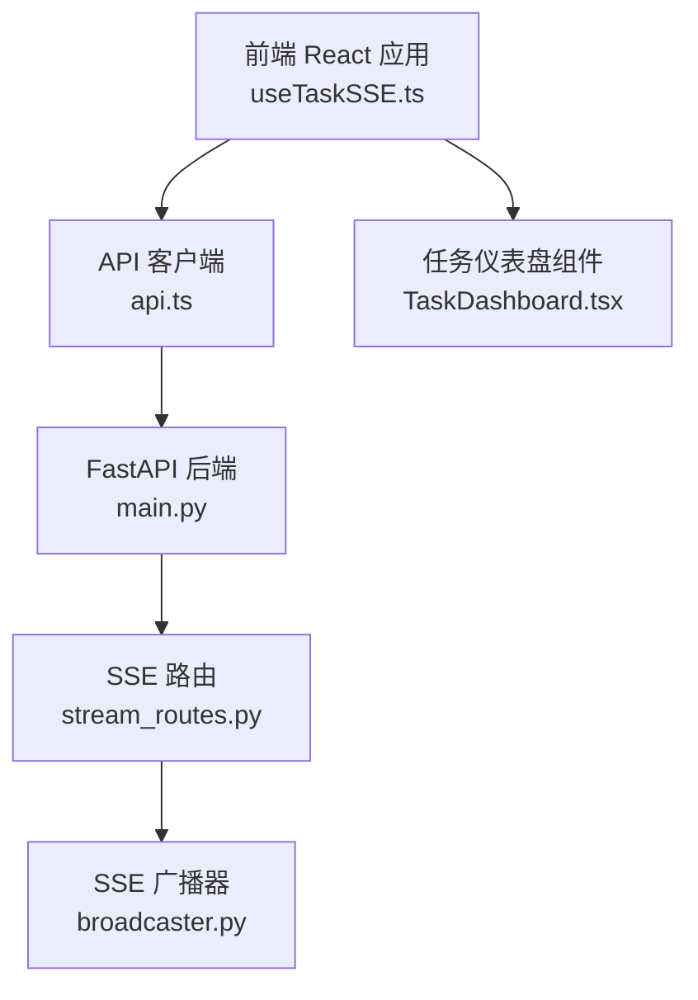
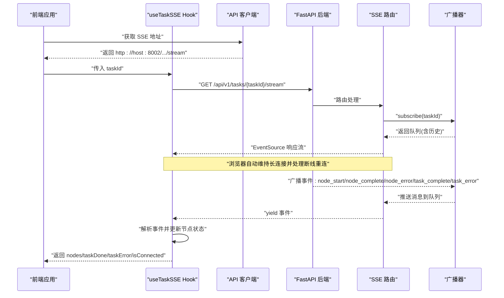
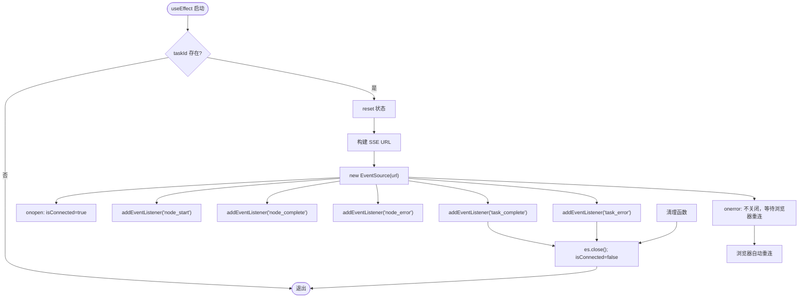
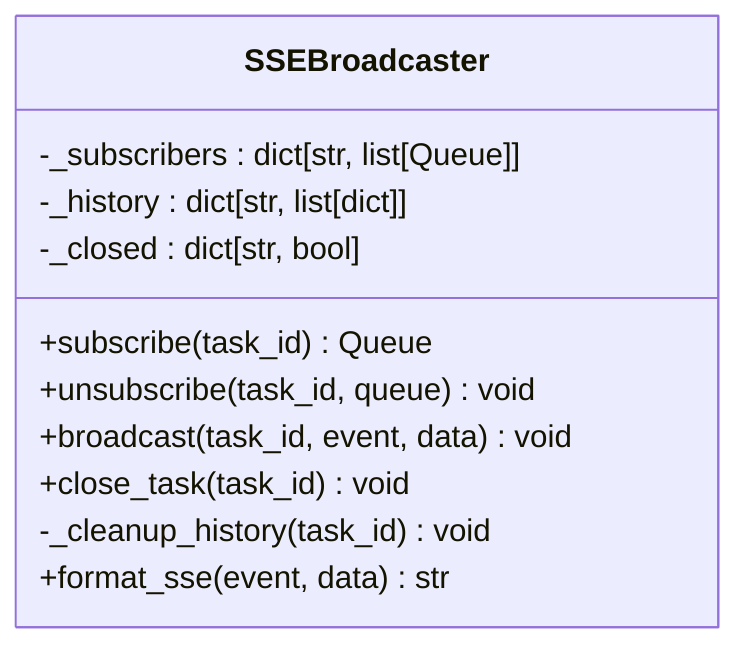
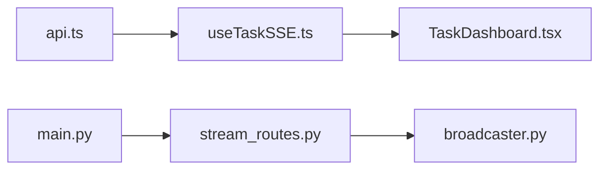

# 实时通信系统

<cite>
**本文引用的文件**
- [useTaskSSE.ts](file://frontend/hooks/useTaskSSE.ts)
- [api.ts](file://frontend/lib/api.ts)
- [TaskDashboard.tsx](file://frontend/components/dashboard/TaskDashboard.tsx)
- [broadcaster.py](file://backend/app/orchestrator/broadcaster.py)
- [stream_routes.py](file://backend/app/api/stream_routes.py)
- [main.py](file://backend/app/main.py)
- [index.ts](file://frontend/types/index.ts)
- [ARCHITECTURE.md](file://ARCHITECTURE.md)
</cite>

## 目录
1. [简介](#简介)
2. [项目结构](#项目结构)
3. [核心组件](#核心组件)
4. [架构总览](#架构总览)
5. [详细组件分析](#详细组件分析)
6. [依赖关系分析](#依赖关系分析)
7. [性能考量](#性能考量)
8. [故障排查指南](#故障排查指南)
9. [结论](#结论)
10. [附录](#附录)

## 简介
本文件面向开发者，系统性阐述实时通信子系统的设计与实现，重点覆盖：
- SSE（Server-Sent Events）事件流的实现原理：连接建立、消息格式、错误处理与自动重连
- useTaskSSE 自定义 Hook 的设计架构：连接管理、事件监听、状态同步与清理
- 后端广播器的实现机制：事件分发、客户端管理、连接池与历史缓冲
- 实时状态推送策略：增量更新、缓存机制与离线恢复
- 连接重试机制、心跳检测与超时处理
- WebSocket 替代方案、性能监控与调试工具使用
- 面向集成与优化的最佳实践

## 项目结构
实时通信系统由前端 React Hook 与后端 FastAPI 路由组成，二者通过 SSE 单向事件流协同工作：
- 前端：useTaskSSE Hook 负责建立/维护 EventSource 连接，解析事件并更新节点状态
- 后端：SSE 路由将任务事件推送到 EventSource 响应流；广播器负责事件缓冲与订阅管理
- 类型与 API：共享类型定义与 SSE 连接地址构造

**图表来源**
- [useTaskSSE.ts:1-144](file://frontend/hooks/useTaskSSE.ts#L1-L144)
- [api.ts:48-55](file://frontend/lib/api.ts#L48-L55)
- [main.py:141-147](file://backend/app/main.py#L141-L147)
- [stream_routes.py:14-42](file://backend/app/api/stream_routes.py#L14-L42)
- [broadcaster.py:11-99](file://backend/app/orchestrator/broadcaster.py#L11-L99)
- [TaskDashboard.tsx:1-176](file://frontend/components/dashboard/TaskDashboard.tsx#L1-L176)

**章节来源**
- [useTaskSSE.ts:1-144](file://frontend/hooks/useTaskSSE.ts#L1-L144)
- [api.ts:48-55](file://frontend/lib/api.ts#L48-L55)
- [main.py:141-147](file://backend/app/main.py#L141-L147)
- [stream_routes.py:14-42](file://backend/app/api/stream_routes.py#L14-L42)
- [broadcaster.py:11-99](file://backend/app/orchestrator/broadcaster.py#L11-L99)
- [TaskDashboard.tsx:1-176](file://frontend/components/dashboard/TaskDashboard.tsx#L1-L176)

## 核心组件
- 前端 useTaskSSE Hook：负责 SSE 连接生命周期、事件监听与状态同步
- API 客户端：构造 SSE 连接 URL，避免 Next.js 代理导致的响应缓冲
- SSE 路由：将订阅队列转换为 EventSource 响应流，支持心跳与断开检测
- 广播器：按任务维度维护订阅队列、历史缓冲与关闭信号
- 类型定义：统一前后端事件结构，确保数据一致性
- 仪表盘组件：聚合节点状态，计算实时指标并渲染

**章节来源**
- [useTaskSSE.ts:28-143](file://frontend/hooks/useTaskSSE.ts#L28-L143)
- [api.ts:48-55](file://frontend/lib/api.ts#L48-L55)
- [stream_routes.py:14-42](file://backend/app/api/stream_routes.py#L14-L42)
- [broadcaster.py:30-94](file://backend/app/orchestrator/broadcaster.py#L30-L94)
- [index.ts:66-95](file://frontend/types/index.ts#L66-L95)
- [TaskDashboard.tsx:21-47](file://frontend/components/dashboard/TaskDashboard.tsx#L21-L47)

## 架构总览
SSE 实时通信采用“后端广播 + 前端订阅”的单向推送模型：
- 任务创建后，前端通过 SSE 路由建立连接
- 后端广播器按任务维度维护订阅队列与历史缓冲
- 事件类型包括节点开始、节点完成、节点错误、任务完成、任务错误
- 前端 Hook 解析事件并更新节点状态，仪表盘组件渲染实时指标

**图表来源**
- [useTaskSSE.ts:60-140](file://frontend/hooks/useTaskSSE.ts#L60-L140)
- [api.ts:48-55](file://frontend/lib/api.ts#L48-L55)
- [stream_routes.py:14-42](file://backend/app/api/stream_routes.py#L14-L42)
- [broadcaster.py:30-94](file://backend/app/orchestrator/broadcaster.py#L30-L94)

**章节来源**
- [useTaskSSE.ts:60-140](file://frontend/hooks/useTaskSSE.ts#L60-L140)
- [stream_routes.py:14-42](file://backend/app/api/stream_routes.py#L14-L42)
- [broadcaster.py:30-94](file://backend/app/orchestrator/broadcaster.py#L30-L94)

## 详细组件分析

### 前端 useTaskSSE Hook 设计
- 连接管理
  - 基于 taskId 构造 SSE URL 并创建 EventSource
  - onopen 设置连接状态为已连接
  - onerror 不主动关闭连接，交由浏览器自动指数退避重连
  - 清理时主动关闭连接并重置状态
- 事件监听与状态同步
  - 监听 node_start：将对应节点状态置为运行中
  - 监听 node_complete：填充耗时、摘要与降级标志
  - 监听 node_error：记录错误信息
  - 监听 task_complete：标记任务完成并关闭连接
  - 监听 task_error：记录任务级错误并关闭连接
- 初始化与重置
  - reset 将节点状态重置为初始 pending，清空任务完成/错误状态与连接状态

**图表来源**
- [useTaskSSE.ts:60-140](file://frontend/hooks/useTaskSSE.ts#L60-L140)

**章节来源**
- [useTaskSSE.ts:28-143](file://frontend/hooks/useTaskSSE.ts#L28-L143)

### API 客户端与 SSE URL 构造
- 为避免 Next.js 代理导致的响应缓冲，SSE 直连后端 FastAPI 服务
- 在浏览器环境直接拼接 http://hostname:8002，开发环境端口固定
- 在 SSR/非浏览器环境使用相对路径

**章节来源**
- [api.ts:48-55](file://frontend/lib/api.ts#L48-L55)

### SSE 路由与心跳保活
- 路由通过广播器订阅任务队列，逐条产出事件
- 使用超时等待队列消息，超时则发送注释型 keepalive，维持连接活跃
- 断开检测：若请求变为断开，立即结束循环并取消订阅
- 事件格式：事件名与数据 JSON 序列化

**章节来源**
- [stream_routes.py:14-42](file://backend/app/api/stream_routes.py#L14-L42)

### 广播器：事件分发与订阅管理
- 订阅管理
  - subscribe：为任务创建队列，先回放历史事件，再加入活跃订阅列表
  - unsubscribe：移除队列，若订阅列表为空则清理
- 事件广播
  - broadcast：将事件写入历史缓冲并投递至所有活跃订阅
  - close_task：标记任务关闭，向所有订阅发送结束哨兵并清理订阅
- 历史缓冲与内存保护
  - 历史缓冲用于晚到订阅者回放
  - 任务关闭后延迟清理历史，防止内存泄漏

**图表来源**
- [broadcaster.py:11-99](file://backend/app/orchestrator/broadcaster.py#L11-L99)

**章节来源**
- [broadcaster.py:30-94](file://backend/app/orchestrator/broadcaster.py#L30-L94)

### 事件类型与数据模型
- 事件类型
  - node_start：节点开始执行
  - node_complete：节点完成，携带耗时、摘要与降级标志
  - node_error：节点错误，携带错误信息
  - task_complete：任务完成
  - task_error：任务级错误
- 数据模型
  - 节点状态：包含节点 ID、Agent ID、名称、状态、耗时、错误、摘要、降级标志
  - 任务状态：完成标志、错误信息、连接状态

**章节来源**
- [index.ts:66-95](file://frontend/types/index.ts#L66-L95)
- [useTaskSSE.ts:7-16](file://frontend/hooks/useTaskSSE.ts#L7-L16)

### 仪表盘组件：实时指标与渲染
- 计算完成节点数、成功率、平均响应时间
- 渲染进度环、运行时间、平均响应、节点状态网格与错误提示
- 根据节点状态动态切换颜色与动画

**章节来源**
- [TaskDashboard.tsx:21-47](file://frontend/components/dashboard/TaskDashboard.tsx#L21-L47)

## 依赖关系分析
- 前端依赖
  - useTaskSSE 依赖 API 客户端提供的 SSE URL
  - 仪表盘组件依赖 useTaskSSE 返回的节点状态
- 后端依赖
  - SSE 路由依赖广播器进行订阅与事件分发
  - 广播器依赖异步队列实现事件缓冲与并发推送
- 全局路由注册
  - main.py 注册 SSE 路由与其他业务路由

**图表来源**
- [api.ts:48-55](file://frontend/lib/api.ts#L48-L55)
- [useTaskSSE.ts:28-143](file://frontend/hooks/useTaskSSE.ts#L28-L143)
- [TaskDashboard.tsx:1-176](file://frontend/components/dashboard/TaskDashboard.tsx#L1-L176)
- [stream_routes.py:14-42](file://backend/app/api/stream_routes.py#L14-L42)
- [broadcaster.py:11-99](file://backend/app/orchestrator/broadcaster.py#L11-L99)
- [main.py:141-147](file://backend/app/main.py#L141-L147)

**章节来源**
- [main.py:141-147](file://backend/app/main.py#L141-L147)

## 性能考量
- 连接与重连
  - EventSource 由浏览器自动管理重连与指数退避，前端无需手动重试
  - 后端通过超时与 keepalive 注释维持连接活性，避免空闲断开
- 事件缓冲与回放
  - 广播器为晚到订阅者提供历史事件回放，降低竞态条件影响
  - 任务完成后延迟清理历史，平衡内存占用与回放需求
- 前端状态更新
  - 事件驱动的增量更新减少不必要的重渲染
  - 仪表盘组件按需计算指标，避免高频重算
- 端口直连
  - SSE 直连后端端口避免代理层缓冲，提升实时性

**章节来源**
- [useTaskSSE.ts:129-133](file://frontend/hooks/useTaskSSE.ts#L129-L133)
- [stream_routes.py:24-38](file://backend/app/api/stream_routes.py#L24-L38)
- [broadcaster.py:60-68](file://backend/app/orchestrator/broadcaster.py#L60-L68)
- [api.ts:48-55](file://frontend/lib/api.ts#L48-L55)

## 故障排查指南
- 前端连接问题
  - 检查是否正确传入 taskId，确认 URL 构造与端口
  - 观察 onerror 日志，确认浏览器是否在自动重连
  - 清理函数会在卸载时关闭连接，确保不会残留
- 后端事件未到达
  - 确认广播器是否已订阅任务队列且未提前关闭
  - 检查广播器历史缓冲是否正确写入与投递
  - 关注 SSE 路由的断开检测与 keepalive 逻辑
- 任务完成但前端未关闭
  - 确认广播器是否发出结束哨兵并清理订阅
  - 检查前端 onerror 是否拦截了正常关闭行为
- 错误处理
  - 任务级错误与节点级错误分别触发不同事件，前端需分别处理
  - 仪表盘组件展示错误信息，便于快速定位

**章节来源**
- [useTaskSSE.ts:60-140](file://frontend/hooks/useTaskSSE.ts#L60-L140)
- [stream_routes.py:14-42](file://backend/app/api/stream_routes.py#L14-L42)
- [broadcaster.py:70-84](file://backend/app/orchestrator/broadcaster.py#L70-L84)

## 结论
本实时通信系统以 SSE 为核心，结合前端 Hook 与后端广播器，实现了低耦合、高可靠的任务状态推送。其特性包括：
- 单向事件流、自动重连与心跳保活
- 历史事件回放与订阅生命周期管理
- 增量状态更新与可视化仪表盘
- 易于集成与扩展的架构设计

对于需要更高吞吐或双向通信的场景，可考虑引入 WebSocket；但在当前 MVP 场景下，SSE 已满足实时可视化与可观测性的需求。

## 附录

### 事件格式与字段说明
- 事件类型
  - node_start：节点开始
  - node_complete：节点完成
  - node_error：节点错误
  - task_complete：任务完成
  - task_error：任务错误
- 字段
  - 节点状态：节点 ID、Agent ID、名称、状态、耗时、错误、摘要、降级标志
  - 任务状态：完成标志、错误信息、连接状态

**章节来源**
- [index.ts:66-95](file://frontend/types/index.ts#L66-L95)
- [useTaskSSE.ts:7-16](file://frontend/hooks/useTaskSSE.ts#L7-L16)

### WebSocket 替代方案建议
- 适用场景：需要双向通信、高并发、低延迟
- 方案要点：引入 WebSocket 服务器，维护连接池与房间管理；事件格式与 SSE 类似，但需处理握手、心跳与断线重连
- 注意事项：增加反向代理与负载均衡配置，确保连接稳定性与扩展性

[本节为概念性建议，不直接映射到现有代码文件]

### 性能监控与调试工具
- 前端
  - 浏览器网络面板观察 SSE 连接与事件频率
  - 控制台日志跟踪事件接收与状态更新
- 后端
  - 结构化日志记录订阅/广播/关闭事件
  - 监控队列长度与历史缓冲大小，评估内存占用
- 可视化
  - 仪表盘组件展示成功率、平均响应时间与节点状态

**章节来源**
- [TaskDashboard.tsx:21-47](file://frontend/components/dashboard/TaskDashboard.tsx#L21-L47)
- [broadcaster.py:43-44](file://backend/app/orchestrator/broadcaster.py#L43-L44)

### 集成与优化指南
- 集成步骤
  - 在页面中调用 useTaskSSE 并传入 taskId
  - 将返回的 nodes 与 taskDone/taskError/isConnected 用于渲染与控制
  - 在仪表盘组件中展示实时指标
- 优化建议
  - 保持事件粒度适中，避免过于频繁的节点事件
  - 合理设置 keepalive 间隔，平衡连接活性与带宽
  - 对历史缓冲进行容量与过期策略管理

**章节来源**
- [useTaskSSE.ts:28-143](file://frontend/hooks/useTaskSSE.ts#L28-L143)
- [TaskDashboard.tsx:21-47](file://frontend/components/dashboard/TaskDashboard.tsx#L21-L47)