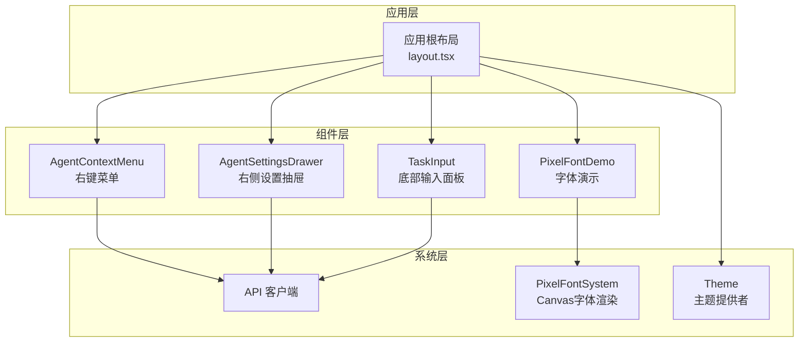
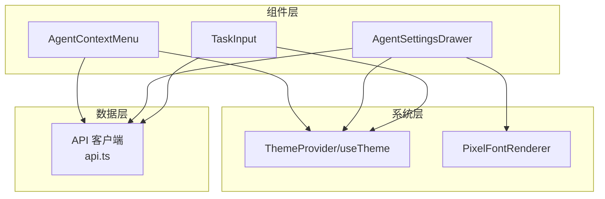
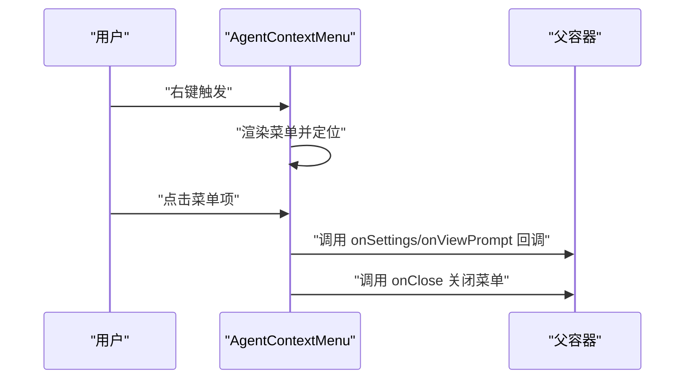
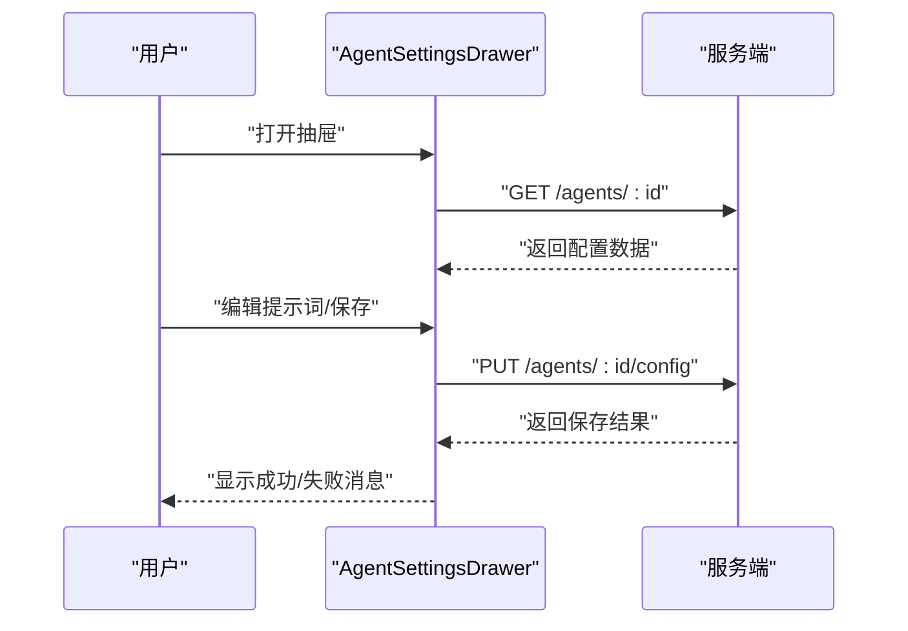
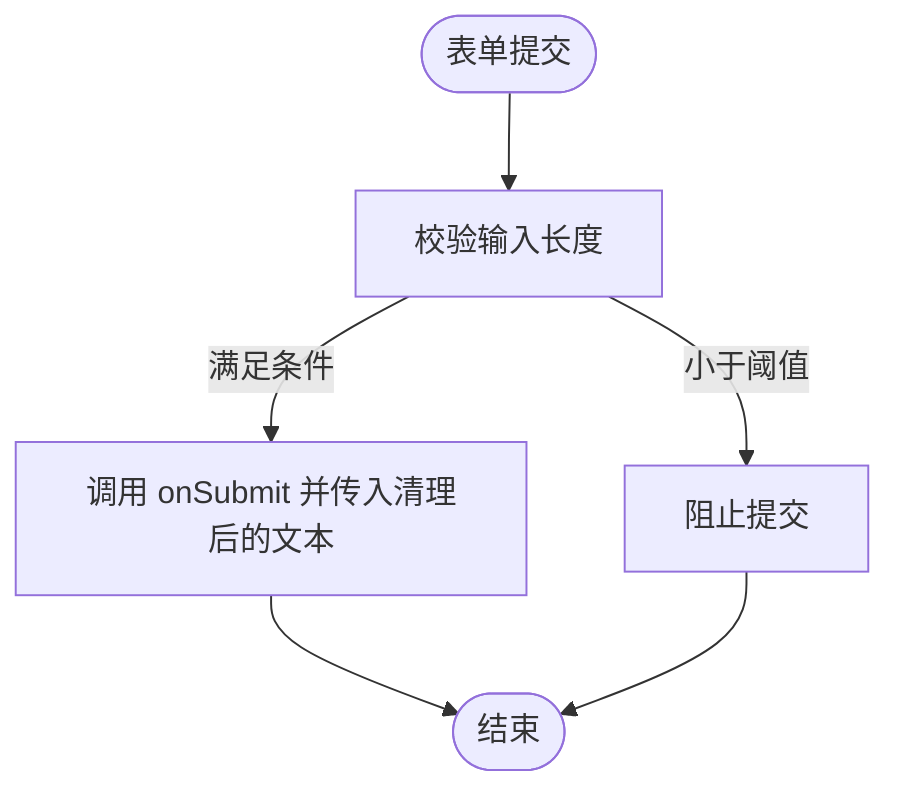
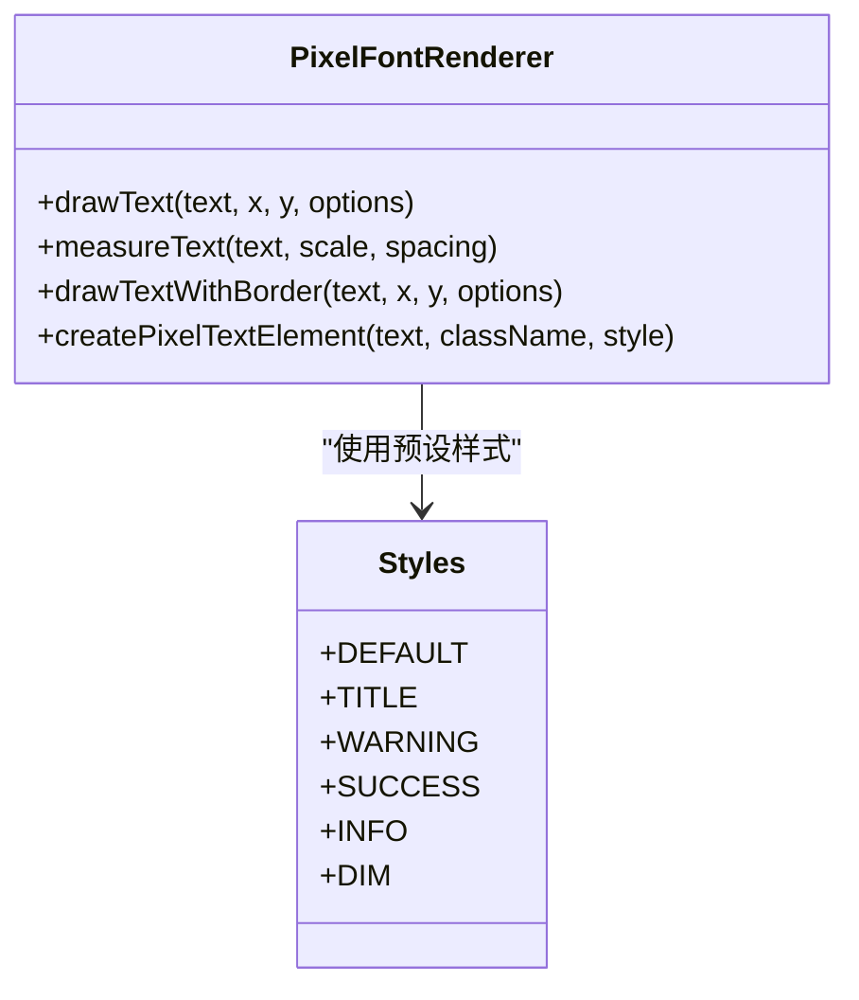
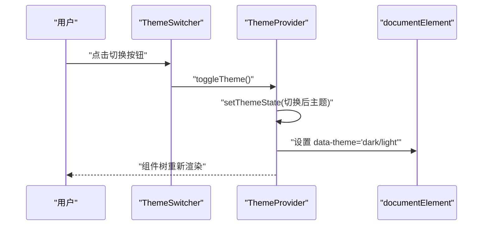
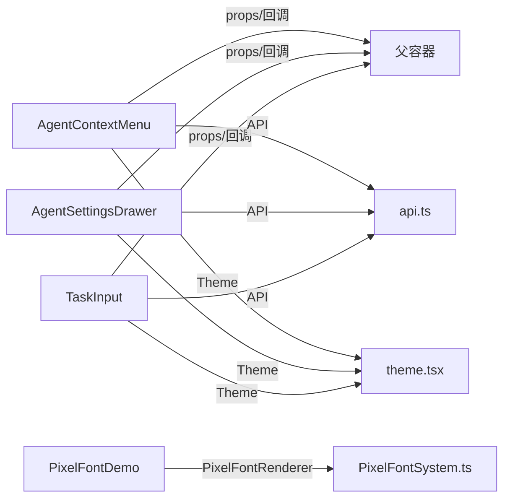

# 组件库设计

<cite>
**本文引用的文件**
- [AgentContextMenu.tsx](file://frontend/components/office/AgentContextMenu.tsx)
- [AgentSettingsDrawer.tsx](file://frontend/components/office/AgentSettingsDrawer.tsx)
- [TaskInput.tsx](file://frontend/components/office/TaskInput.tsx)
- [PixelFontDemo.tsx](file://frontend/components/demo/PixelFontDemo.tsx)
- [PixelFontSystem.ts](file://frontend/lib/pixel-font/PixelFontSystem.ts)
- [theme.tsx](file://OpenClaw-bot-review-main/lib/theme.tsx)
- [api.ts](file://frontend/lib/api.ts)
- [layout.tsx](file://frontend/app/layout.tsx)
</cite>

## 目录
1. [引言](#引言)
2. [项目结构](#项目结构)
3. [核心组件](#核心组件)
4. [架构总览](#架构总览)
5. [详细组件分析](#详细组件分析)
6. [依赖关系分析](#依赖关系分析)
7. [性能考虑](#性能考虑)
8. [故障排查指南](#故障排查指南)
9. [结论](#结论)
10. [附录](#附录)

## 引言
本文件面向前端开发者，系统化梳理并输出“像素风格UI组件库”的设计理念、实现策略与最佳实践。重点覆盖以下方面：
- 像素风格组件的抽象与属性定义、行为规范
- 交互式Agent控制组件（上下文菜单、设置抽屉、输入面板）的设计与实现
- 响应式布局与移动端适配策略
- 组件间通信模式（props、事件回调、状态共享）
- 复用策略、样式系统与主题定制
- 可访问性、性能优化与测试策略

## 项目结构
本组件库位于前端子工程，围绕“像素风格”主题构建，主要由三部分组成：
- 交互式办公场景组件：Agent上下文菜单、设置抽屉、任务输入面板等
- 像素字体系统：Canvas渲染与预设样式，支撑统一视觉语言
- 主题系统：基于React Context的主题切换与持久化

图示来源
- [layout.tsx:1-16](file://frontend/app/layout.tsx#L1-L16)
- [AgentContextMenu.tsx:1-84](file://frontend/components/office/AgentContextMenu.tsx#L1-L84)
- [AgentSettingsDrawer.tsx:1-175](file://frontend/components/office/AgentSettingsDrawer.tsx#L1-L175)
- [TaskInput.tsx:1-55](file://frontend/components/office/TaskInput.tsx#L1-L55)
- [PixelFontDemo.tsx:1-149](file://frontend/components/demo/PixelFontDemo.tsx#L1-L149)
- [PixelFontSystem.ts:1-579](file://frontend/lib/pixel-font/PixelFontSystem.ts#L1-L579)
- [theme.tsx:1-63](file://OpenClaw-bot-review-main/lib/theme.tsx#L1-L63)
- [api.ts:1-289](file://frontend/lib/api.ts#L1-L289)

章节来源
- [layout.tsx:1-16](file://frontend/app/layout.tsx#L1-L16)

## 核心组件
本节从“抽象—属性—行为—样式”四个维度，总结像素风格组件库的关键设计原则。

- 抽象与职责
  - 上下文菜单：承载Agent的快速操作入口，强调轻量、无阻塞交互
  - 设置抽屉：集中管理Agent配置，强调可编辑性与即时反馈
  - 任务输入：承接用户输入，强调输入校验与派发流程
  - 像素字体：提供一致的像素风格文本呈现，支持Canvas与DOM两种形态
  - 主题系统：提供主题切换与持久化，统一组件视觉基底

- 属性定义（通用约束）
  - 尺寸与间距：采用固定字号与行高，确保像素对齐；通过scale/spacing控制密度
  - 颜色体系：以“深蓝主基调+高对比强调色”为主，辅以黄色、青色、红色等语义色
  - 边框与背景：统一使用像素风格边框类名，保证视觉一致性
  - 状态字段：loading/disabled/message等，用于反馈当前状态

- 行为规范
  - 事件回调：通过onSubmit、onClose、onSettings、onViewPrompt等回调解耦交互
  - 数据流：从API加载数据，更新内部状态，再通过回调或全局状态同步
  - 可访问性：提供键盘可达、焦点管理与语义标签，避免仅依赖图像传达信息

- 样式系统
  - 使用Tailwind类名组合像素风格边框、背景与文字样式
  - 通过CSS变量与data-theme属性实现主题切换
  - Canvas字体系统提供可扩展的文本渲染能力

章节来源
- [AgentContextMenu.tsx:9-17](file://frontend/components/office/AgentContextMenu.tsx#L9-L17)
- [AgentSettingsDrawer.tsx:10-14](file://frontend/components/office/AgentSettingsDrawer.tsx#L10-L14)
- [TaskInput.tsx:7-11](file://frontend/components/office/TaskInput.tsx#L7-L11)
- [PixelFontSystem.ts:387-392](file://frontend/lib/pixel-font/PixelFontSystem.ts#L387-L392)
- [theme.tsx:5-11](file://OpenClaw-bot-review-main/lib/theme.tsx#L5-L11)

## 架构总览
组件库遵循“组件-系统-数据”三层架构：
- 组件层：负责UI与交互，暴露清晰的props与回调
- 系统层：主题系统与像素字体系统，提供跨组件的通用能力
- 数据层：API客户端封装HTTP请求与错误处理，统一响应格式

图示来源
- [AgentContextMenu.tsx:1-84](file://frontend/components/office/AgentContextMenu.tsx#L1-L84)
- [AgentSettingsDrawer.tsx:1-175](file://frontend/components/office/AgentSettingsDrawer.tsx#L1-L175)
- [TaskInput.tsx:1-55](file://frontend/components/office/TaskInput.tsx#L1-L55)
- [theme.tsx:1-63](file://OpenClaw-bot-review-main/lib/theme.tsx#L1-L63)
- [PixelFontSystem.ts:394-538](file://frontend/lib/pixel-font/PixelFontSystem.ts#L394-L538)
- [api.ts:1-289](file://frontend/lib/api.ts#L1-L289)

## 详细组件分析

### AgentContextMenu：像素风格右键菜单
- 设计理念
  - 轻量弹出、快速操作、无侵入式关闭
  - 使用像素边框与高对比色彩，确保在复杂场景中清晰可见
- 关键属性
  - agentId/agentName：标识与展示
  - x/y：定位
  - onClose/onSettings/onViewPrompt：事件回调
- 行为逻辑
  - 点击外部区域自动关闭
  - 菜单项点击后先回调再关闭，保证交互闭环
- 样式要点
  - 绝对定位与z-index，避免被其他元素遮挡
  - 使用像素边框类名与深色背景，突出菜单边界

图示来源
- [AgentContextMenu.tsx:19-84](file://frontend/components/office/AgentContextMenu.tsx#L19-L84)

章节来源
- [AgentContextMenu.tsx:9-17](file://frontend/components/office/AgentContextMenu.tsx#L9-L17)
- [AgentContextMenu.tsx:30-38](file://frontend/components/office/AgentContextMenu.tsx#L30-L38)

### AgentSettingsDrawer：右侧设置抽屉
- 设计理念
  - 右侧滑入式抽屉，承载Agent配置编辑
  - 加载态、保存态与消息提示，提升可用性
- 关键属性
  - agentId/open/onClose：控制打开与关闭
- 行为逻辑
  - 打开时异步加载Agent配置，失败显示错误消息
  - 保存成功后更新prompt源状态，并提示结果
  - 支持恢复默认提示词
- 样式要点
  - 固定宽高与动画入场效果
  - 使用像素边框与深色背景，强调边界与层次

图示来源
- [AgentSettingsDrawer.tsx:16-66](file://frontend/components/office/AgentSettingsDrawer.tsx#L16-L66)
- [AgentSettingsDrawer.tsx:26-42](file://frontend/components/office/AgentSettingsDrawer.tsx#L26-L42)
- [AgentSettingsDrawer.tsx:48-60](file://frontend/components/office/AgentSettingsDrawer.tsx#L48-L60)
- [api.ts:77-89](file://frontend/lib/api.ts#L77-L89)

章节来源
- [AgentSettingsDrawer.tsx:10-14](file://frontend/components/office/AgentSettingsDrawer.tsx#L10-L14)
- [AgentSettingsDrawer.tsx:26-46](file://frontend/components/office/AgentSettingsDrawer.tsx#L26-L46)
- [AgentSettingsDrawer.tsx:48-65](file://frontend/components/office/AgentSettingsDrawer.tsx#L48-L65)
- [api.ts:77-89](file://frontend/lib/api.ts#L77-L89)

### TaskInput：底部任务输入面板
- 设计理念
  - 低干扰输入区，聚焦用户意图表达
  - 输入校验与禁用态控制，防止无效提交
- 关键属性
  - onSubmit/loading/disabled：提交、加载与禁用控制
- 行为逻辑
  - 表单提交前进行最小长度校验
  - 根据loading/disabled动态调整按钮状态
- 样式要点
  - 最大宽度限制与居中布局，适配不同屏幕
  - 输入框与按钮的像素风格边框与高对比色

图示来源
- [TaskInput.tsx:13-21](file://frontend/components/office/TaskInput.tsx#L13-L21)

章节来源
- [TaskInput.tsx:7-11](file://frontend/components/office/TaskInput.tsx#L7-L11)
- [TaskInput.tsx:16-21](file://frontend/components/office/TaskInput.tsx#L16-L21)

### 像素字体系统：Canvas与样式双轨
- 设计理念
  - 自定义像素字体映射，替代浏览器默认字体
  - 同时提供Canvas渲染与DOM生成能力，满足不同场景
- 关键能力
  - 文本绘制与尺寸测量
  - 带边框文本渲染
  - 预设样式集合与CSS辅助类
- 使用建议
  - Canvas场景优先：高精度、可扩展
  - DOM场景：简单文本、SEO友好

图示来源
- [PixelFontSystem.ts:394-538](file://frontend/lib/pixel-font/PixelFontSystem.ts#L394-L538)
- [PixelFontSystem.ts:540-548](file://frontend/lib/pixel-font/PixelFontSystem.ts#L540-L548)

章节来源
- [PixelFontDemo.tsx:1-149](file://frontend/components/demo/PixelFontDemo.tsx#L1-L149)
- [PixelFontSystem.ts:7-385](file://frontend/lib/pixel-font/PixelFontSystem.ts#L7-L385)
- [PixelFontSystem.ts:394-538](file://frontend/lib/pixel-font/PixelFontSystem.ts#L394-L538)
- [PixelFontSystem.ts:540-579](file://frontend/lib/pixel-font/PixelFontSystem.ts#L540-L579)

### 主题系统：主题切换与持久化
- 设计理念
  - 基于React Context的状态共享
  - 通过data-theme属性与localStorage实现持久化
- 关键能力
  - 主题切换、状态读取、切换按钮
  - 在挂载时读取本地存储，恢复上次主题

图示来源
- [theme.tsx:51-62](file://OpenClaw-bot-review-main/lib/theme.tsx#L51-L62)
- [theme.tsx:19-44](file://OpenClaw-bot-review-main/lib/theme.tsx#L19-L44)
- [theme.tsx:22-28](file://OpenClaw-bot-review-main/lib/theme.tsx#L22-L28)

章节来源
- [theme.tsx:5-11](file://OpenClaw-bot-review-main/lib/theme.tsx#L5-L11)
- [theme.tsx:19-44](file://OpenClaw-bot-review-main/lib/theme.tsx#L19-L44)
- [theme.tsx:51-62](file://OpenClaw-bot-review-main/lib/theme.tsx#L51-L62)

## 依赖关系分析
- 组件间通信
  - 父组件通过props传递AgentId、回调函数与状态
  - 子组件通过回调向上通知，实现松耦合
- 组件与系统
  - 主题系统通过Context为所有组件提供主题能力
  - 像素字体系统作为工具类被演示组件使用
- 组件与数据
  - 三个核心组件均依赖API客户端进行数据读写

图示来源
- [AgentContextMenu.tsx:1-84](file://frontend/components/office/AgentContextMenu.tsx#L1-L84)
- [AgentSettingsDrawer.tsx:1-175](file://frontend/components/office/AgentSettingsDrawer.tsx#L1-L175)
- [TaskInput.tsx:1-55](file://frontend/components/office/TaskInput.tsx#L1-L55)
- [api.ts:1-289](file://frontend/lib/api.ts#L1-L289)
- [theme.tsx:1-63](file://OpenClaw-bot-review-main/lib/theme.tsx#L1-L63)
- [PixelFontDemo.tsx:1-149](file://frontend/components/demo/PixelFontDemo.tsx#L1-L149)
- [PixelFontSystem.ts:1-579](file://frontend/lib/pixel-font/PixelFontSystem.ts#L1-L579)

章节来源
- [AgentContextMenu.tsx:1-84](file://frontend/components/office/AgentContextMenu.tsx#L1-L84)
- [AgentSettingsDrawer.tsx:1-175](file://frontend/components/office/AgentSettingsDrawer.tsx#L1-L175)
- [TaskInput.tsx:1-55](file://frontend/components/office/TaskInput.tsx#L1-L55)
- [api.ts:1-289](file://frontend/lib/api.ts#L1-L289)
- [theme.tsx:1-63](file://OpenClaw-bot-review-main/lib/theme.tsx#L1-L63)
- [PixelFontDemo.tsx:1-149](file://frontend/components/demo/PixelFontDemo.tsx#L1-L149)
- [PixelFontSystem.ts:1-579](file://frontend/lib/pixel-font/PixelFontSystem.ts#L1-L579)

## 性能考虑
- 渲染性能
  - 像素字体Canvas渲染需避免频繁重绘，建议缓存已绘制文本或按需刷新
  - 抽屉与菜单使用绝对定位与z-index，减少布局抖动
- 网络与状态
  - 设置抽屉加载与保存过程使用loading/disabled，避免重复请求
  - API客户端统一错误处理，减少上层重复判断
- 可访问性
  - 为按钮与输入框提供明确的aria-label与tab索引
  - 避免仅用颜色区分状态，补充文字提示
- 移动端优化
  - 控制触摸目标最小尺寸（≥44px），确保点击命中率
  - 为窄屏场景提供合适的最大宽度与内边距

## 故障排查指南
- 右键菜单不消失
  - 检查是否正确绑定外部点击事件与清理逻辑
  - 确认z-index与定位未被其他元素覆盖
- 设置抽屉无法加载/保存
  - 核对agentId是否为空
  - 检查API返回code与message，确认网络连通性
- 输入面板无法提交
  - 确认输入长度是否达到最小阈值
  - 检查loading/disabled状态是否被意外置位
- 主题切换无效
  - 检查localStorage中是否存在合法主题值
  - 确认data-theme属性是否正确写入documentElement

章节来源
- [AgentContextMenu.tsx:30-38](file://frontend/components/office/AgentContextMenu.tsx#L30-L38)
- [AgentSettingsDrawer.tsx:26-42](file://frontend/components/office/AgentSettingsDrawer.tsx#L26-L42)
- [AgentSettingsDrawer.tsx:48-60](file://frontend/components/office/AgentSettingsDrawer.tsx#L48-L60)
- [TaskInput.tsx:16-21](file://frontend/components/office/TaskInput.tsx#L16-L21)
- [theme.tsx:22-28](file://OpenClaw-bot-review-main/lib/theme.tsx#L22-L28)

## 结论
本组件库以“像素风格”为核心视觉语言，结合主题系统与像素字体系统，提供了统一且可扩展的组件能力。通过清晰的props与回调约定、完善的加载与错误处理、以及可访问性与性能优化策略，能够支撑编辑部场景下的Agent控制与内容生产流程。建议在后续迭代中持续完善测试覆盖与文档示例，进一步提升组件复用性与维护效率。

## 附录
- 组件复用策略
  - 将通用交互（如外显关闭、加载态）抽象为Hook或高阶组件
  - 将样式常量与主题变量收敛至单一文件，便于统一修改
- 样式系统与主题定制
  - 以CSS变量与data-theme配合，实现明暗主题无缝切换
  - 为常用尺寸、颜色与边框提供语义化类名，降低模板代码复杂度
- 测试策略建议
  - 单元测试：针对API客户端与工具类（如Canvas渲染）编写快照与行为测试
  - 集成测试：模拟用户交互（点击、输入、提交）验证组件链路
  - 可访问性测试：使用自动化工具与人工评审相结合的方式