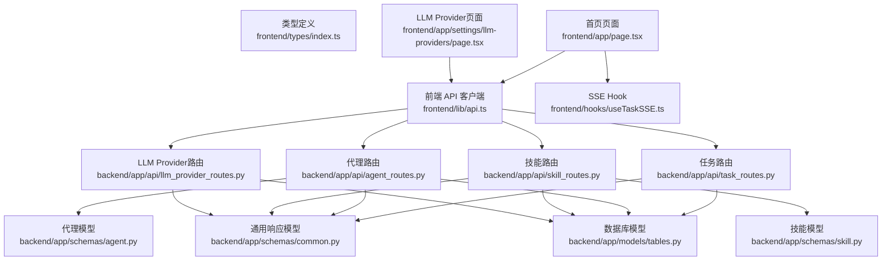
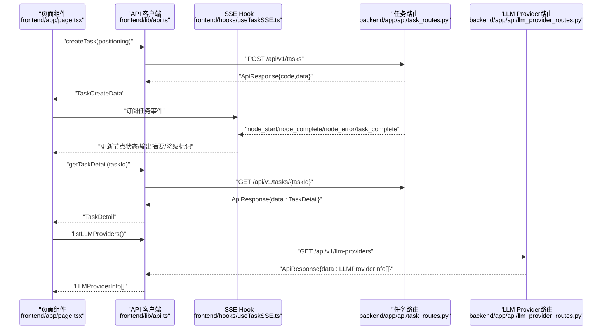
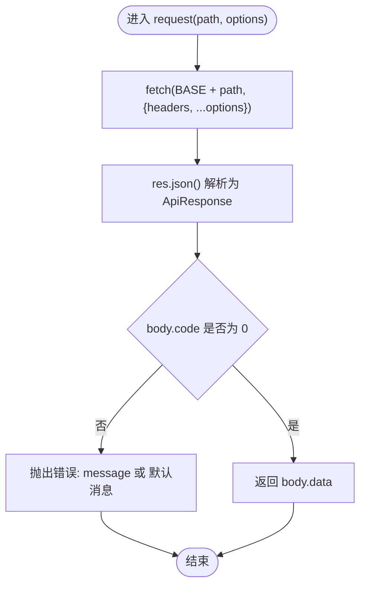
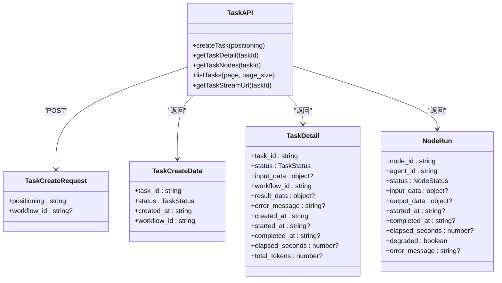
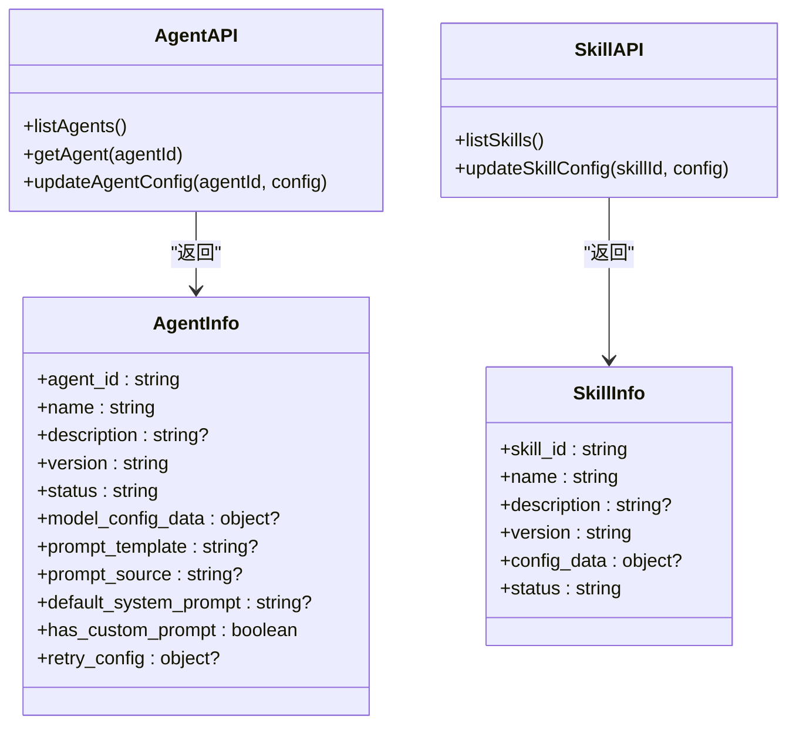
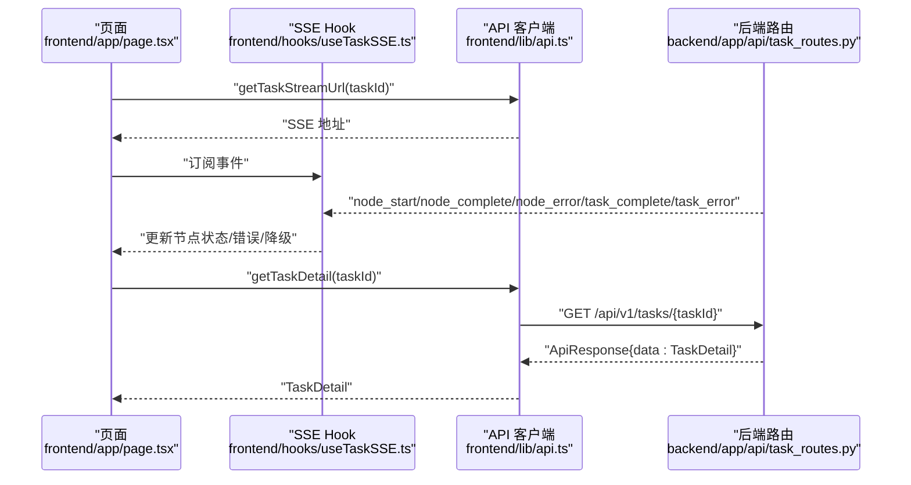
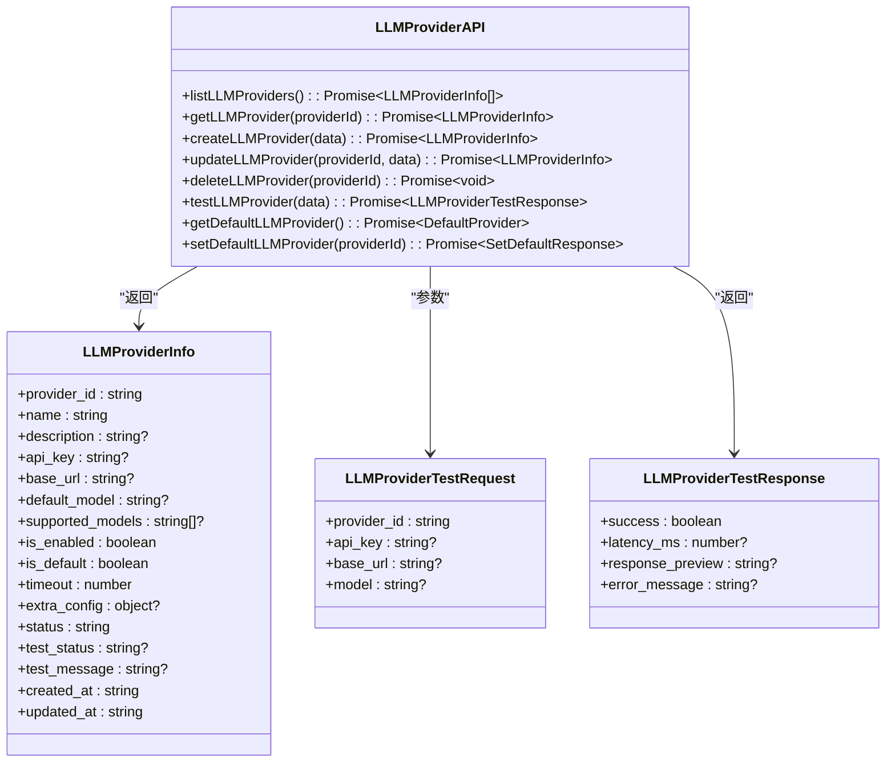
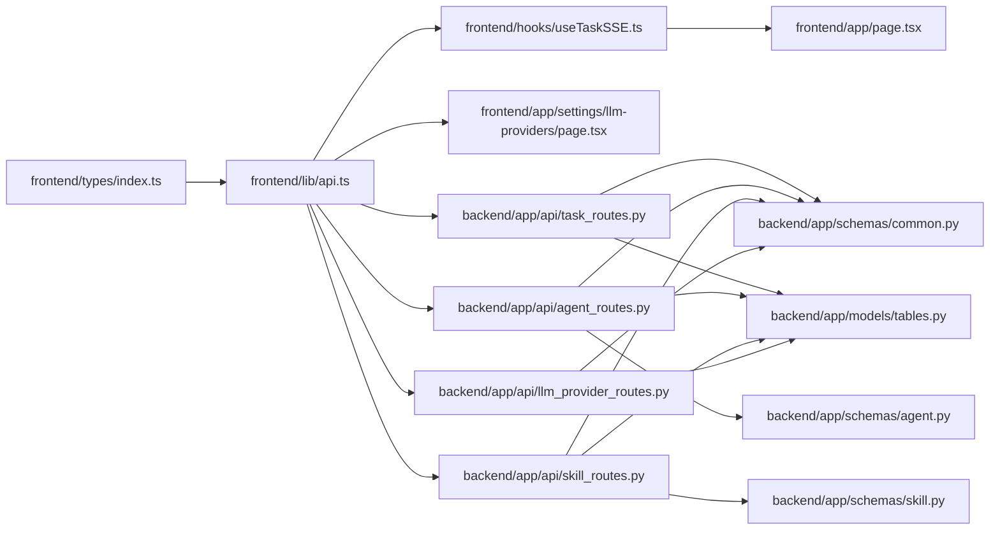

# API客户端

<cite>
**本文引用的文件**
- [frontend/lib/api.ts](file://frontend/lib/api.ts)
- [frontend/types/index.ts](file://frontend/types/index.ts)
- [frontend/hooks/useTaskSSE.ts](file://frontend/hooks/useTaskSSE.ts)
- [frontend/app/page.tsx](file://frontend/app/page.tsx)
- [frontend/app/settings/llm-providers/page.tsx](file://frontend/app/settings/llm-providers/page.tsx)
- [backend/app/api/task_routes.py](file://backend/app/api/task_routes.py)
- [backend/app/api/agent_routes.py](file://backend/app/api/agent_routes.py)
- [backend/app/api/skill_routes.py](file://backend/app/api/skill_routes.py)
- [backend/app/api/llm_provider_routes.py](file://backend/app/api/llm_provider_routes.py)
- [backend/app/schemas/common.py](file://backend/app/schemas/common.py)
- [backend/app/schemas/agent.py](file://backend/app/schemas/agent.py)
- [backend/app/schemas/skill.py](file://backend/app/schemas/skill.py)
- [backend/app/models/tables.py](file://backend/app/models/tables.py)
</cite>

## 目录
1. [简介](#简介)
2. [项目结构](#项目结构)
3. [核心组件](#核心组件)
4. [架构总览](#架构总览)
5. [详细组件分析](#详细组件分析)
6. [LLM Provider管理API](#llm-provider管理api)
7. [依赖分析](#依赖分析)
8. [性能考虑](#性能考虑)
9. [故障排查指南](#故障排查指南)
10. [结论](#结论)
11. [附录](#附录)

## 简介
本文件系统化梳理 HotClaw 前端 API 客户端的设计与实现，覆盖以下主题：
- HTTP 请求封装：统一基地址、请求头、错误处理与响应解包
- TypeScript 类型体系：共享类型、后端响应包装模型与前端调用签名
- 认证与拦截：当前实现未内置认证；可扩展请求拦截器与响应拦截器
- 缓存与去重：当前未实现；可引入内存/浏览器缓存与请求去重
- 数据预加载：通过 SSE 实时事件驱动页面状态更新
- 版本管理与兼容：后端以 /api/v1 作为版本前缀；建议在客户端固定版本并做向后兼容
- 调试与监控：SSE 事件日志、错误提示、网络面板与性能指标采集
- 兼容与降级：后端返回统一响应体，便于前端在异常时进行降级展示
- **新增** LLM Provider管理：支持多供应商配置、测试连接、默认提供商管理

## 项目结构
前端 API 客户端位于 frontend/lib/api.ts，配套类型定义在 frontend/types/index.ts；实时事件通过 hooks/useTaskSSE.ts 消费；页面入口在 frontend/app/page.tsx 中触发任务创建并订阅事件。**新增** LLM Provider管理界面位于 frontend/app/settings/llm-providers/page.tsx。



**图表来源**
- [frontend/lib/api.ts:1-284](file://frontend/lib/api.ts#L1-L284)
- [frontend/types/index.ts:1-119](file://frontend/types/index.ts#L1-L119)
- [frontend/hooks/useTaskSSE.ts:1-124](file://frontend/hooks/useTaskSSE.ts#L1-L124)
- [frontend/app/page.tsx:1-95](file://frontend/app/page.tsx#L1-L95)
- [frontend/app/settings/llm-providers/page.tsx:1-529](file://frontend/app/settings/llm-providers/page.tsx#L1-L529)
- [backend/app/api/task_routes.py:1-163](file://backend/app/api/task_routes.py#L1-L163)
- [backend/app/api/agent_routes.py:1-115](file://backend/app/api/agent_routes.py#L1-L115)
- [backend/app/api/skill_routes.py:1-61](file://backend/app/api/skill_routes.py#L1-L61)
- [backend/app/api/llm_provider_routes.py:1-326](file://backend/app/api/llm_provider_routes.py#L1-L326)
- [backend/app/schemas/common.py:1-27](file://backend/app/schemas/common.py#L1-L27)
- [backend/app/schemas/agent.py:1-29](file://backend/app/schemas/agent.py#L1-L29)
- [backend/app/schemas/skill.py:1-22](file://backend/app/schemas/skill.py#L1-L22)
- [backend/app/models/tables.py:1-285](file://backend/app/models/tables.py#L1-L285)

**章节来源**
- [frontend/lib/api.ts:1-284](file://frontend/lib/api.ts#L1-L284)
- [frontend/types/index.ts:1-119](file://frontend/types/index.ts#L1-L119)
- [frontend/hooks/useTaskSSE.ts:1-124](file://frontend/hooks/useTaskSSE.ts#L1-L124)
- [frontend/app/page.tsx:1-95](file://frontend/app/page.tsx#L1-L95)
- [frontend/app/settings/llm-providers/page.tsx:1-529](file://frontend/app/settings/llm-providers/page.tsx#L1-L529)
- [backend/app/api/task_routes.py:1-163](file://backend/app/api/task_routes.py#L1-L163)
- [backend/app/api/agent_routes.py:1-115](file://backend/app/api/agent_routes.py#L1-L115)
- [backend/app/api/skill_routes.py:1-61](file://backend/app/api/skill_routes.py#L1-L61)
- [backend/app/api/llm_provider_routes.py:1-326](file://backend/app/api/llm_provider_routes.py#L1-L326)
- [backend/app/schemas/common.py:1-27](file://backend/app/schemas/common.py#L1-L27)
- [backend/app/schemas/agent.py:1-29](file://backend/app/schemas/agent.py#L1-L29)
- [backend/app/schemas/skill.py:1-22](file://backend/app/schemas/skill.py#L1-L22)
- [backend/app/models/tables.py:1-285](file://backend/app/models/tables.py#L1-L285)

## 核心组件
- 统一请求函数：封装 fetch、统一头部、JSON 解析与错误抛出
- 任务相关 API：创建任务、查询详情、节点执行记录、分页列表、SSE 流地址
- 代理与技能相关 API：列出与查询代理、更新代理配置；列出与更新技能配置
- **新增** LLM Provider管理 API：CRUD操作、测试连接、默认提供商管理
- 类型体系：统一响应包装、任务/节点状态、SSE 事件类型、仪表盘统计、LLM Provider配置
- SSE Hook：订阅任务节点生命周期事件，驱动 UI 状态更新

**章节来源**
- [frontend/lib/api.ts:14-50](file://frontend/lib/api.ts#L14-L50)
- [frontend/lib/api.ts:26-110](file://frontend/lib/api.ts#L26-L110)
- [frontend/lib/api.ts:112-231](file://frontend/lib/api.ts#L112-L231)
- [frontend/types/index.ts:10-15](file://frontend/types/index.ts#L10-L15)
- [frontend/types/index.ts:19-64](file://frontend/types/index.ts#L19-L64)
- [frontend/types/index.ts:67-94](file://frontend/types/index.ts#L67-L94)
- [frontend/hooks/useTaskSSE.ts:28-124](file://frontend/hooks/useTaskSSE.ts#L28-L124)

## 架构总览
前端 API 客户端通过统一的 request 函数发起 HTTP 请求，后端 FastAPI 路由返回统一 ApiResponse 包装体。页面通过 SSE Hook 订阅任务事件，完成后再拉取完整结果。**新增** LLM Provider管理页面通过API客户端管理多个LLM提供商配置。



**图表来源**
- [frontend/app/page.tsx:14-50](file://frontend/app/page.tsx#L14-L50)
- [frontend/lib/api.ts:14-50](file://frontend/lib/api.ts#L14-L50)
- [frontend/hooks/useTaskSSE.ts:58-120](file://frontend/hooks/useTaskSSE.ts#L58-L120)
- [backend/app/api/task_routes.py:19-107](file://backend/app/api/task_routes.py#L19-L107)
- [backend/app/api/llm_provider_routes.py:94-99](file://backend/app/api/llm_provider_routes.py#L94-L99)

## 详细组件分析

### 统一请求与错误处理
- 基地址：固定为 /api/v1
- 请求头：默认 Content-Type: application/json
- 响应解包：读取 JSON 后检查 code 字段，非 0 抛出错误
- 泛型约束：调用方通过类型参数指定返回数据结构



**图表来源**
- [frontend/lib/api.ts:14-24](file://frontend/lib/api.ts#L14-L24)

**章节来源**
- [frontend/lib/api.ts:12-24](file://frontend/lib/api.ts#L12-L24)

### 任务 API 设计
- 创建任务：POST /api/v1/tasks，入参包含定位信息与可选工作流 ID
- 查询详情：GET /api/v1/tasks/{taskId}，返回任务全量信息（含结果）
- 查询节点：GET /api/v1/tasks/{taskId}/nodes，返回节点执行记录
- 列表分页：GET /api/v1/tasks?page&page_size，返回任务摘要与分页元数据
- SSE 地址：GET /api/v1/tasks/{taskId}/stream，用于实时事件流



**图表来源**
- [frontend/lib/api.ts:26-50](file://frontend/lib/api.ts#L26-L50)
- [frontend/types/index.ts:19-64](file://frontend/types/index.ts#L19-L64)
- [frontend/types/index.ts:45-56](file://frontend/types/index.ts#L45-L56)

**章节来源**
- [frontend/lib/api.ts:26-50](file://frontend/lib/api.ts#L26-L50)
- [frontend/types/index.ts:19-64](file://frontend/types/index.ts#L19-L64)
- [frontend/types/index.ts:45-56](file://frontend/types/index.ts#L45-L56)
- [backend/app/api/task_routes.py:19-162](file://backend/app/api/task_routes.py#L19-L162)

### 代理与技能 API 设计
- 代理：列出代理、查询单个代理、更新代理配置（模型参数、提示词模板、重试配置）
- 技能：列出技能、更新技能配置（配置数据）



**图表来源**
- [frontend/lib/api.ts:68-110](file://frontend/lib/api.ts#L68-L110)
- [frontend/types/index.ts:54-70](file://frontend/types/index.ts#L54-L70)
- [frontend/types/index.ts:88-95](file://frontend/types/index.ts#L88-L95)
- [backend/app/api/agent_routes.py:17-114](file://backend/app/api/agent_routes.py#L17-L114)
- [backend/app/api/skill_routes.py:17-60](file://backend/app/api/skill_routes.py#L17-L60)

**章节来源**
- [frontend/lib/api.ts:68-110](file://frontend/lib/api.ts#L68-L110)
- [frontend/types/index.ts:54-70](file://frontend/types/index.ts#L54-L70)
- [frontend/types/index.ts:88-95](file://frontend/types/index.ts#L88-L95)
- [backend/app/api/agent_routes.py:17-114](file://backend/app/api/agent_routes.py#L17-L114)
- [backend/app/api/skill_routes.py:17-60](file://backend/app/api/skill_routes.py#L17-L60)

### SSE 实时事件与页面集成
- 事件类型：节点开始、节点完成（含耗时、输出摘要、降级标记）、节点错误、任务完成、任务错误
- 初始节点顺序：与后端流水线一致，便于 UI 对齐
- 页面行为：任务完成后通过 getTaskDetail 拉取最终结果，避免实时流中的冗余数据



**图表来源**
- [frontend/hooks/useTaskSSE.ts:28-124](file://frontend/hooks/useTaskSSE.ts#L28-L124)
- [frontend/app/page.tsx:19-36](file://frontend/app/page.tsx#L19-L36)
- [frontend/lib/api.ts:48-50](file://frontend/lib/api.ts#L48-L50)
- [backend/app/api/task_routes.py:19-107](file://backend/app/api/task_routes.py#L19-L107)

**章节来源**
- [frontend/hooks/useTaskSSE.ts:28-124](file://frontend/hooks/useTaskSSE.ts#L28-L124)
- [frontend/app/page.tsx:19-36](file://frontend/app/page.tsx#L19-L36)
- [frontend/lib/api.ts:48-50](file://frontend/lib/api.ts#L48-L50)
- [backend/app/api/task_routes.py:19-107](file://backend/app/api/task_routes.py#L19-L107)

### 类型安全与数据验证
- 前端类型：统一响应包装、任务/节点状态枚举、SSE 事件类型、代理/技能信息结构
- 后端模型：Pydantic 基类 ApiResponse、分页元数据、任务/节点/账户/文章/审计/代理/技能/工作流/系统日志等 ORM 模型
- 验证策略：后端路由层使用 Pydantic 模型校验请求体；前端通过 TypeScript 接口约束调用与返回值

```mermaid
classDiagram
class ApiResponse {
+code : number
+message : string
+data : any
+details : object?
}
class TaskStatus {
<<enum>>
"pending"|"running"|"completed"|"failed"
}
class NodeStatus {
<<enum>>
"pending"|"running"|"completed"|"failed"|"skipped"
}
class TaskCreateRequest {
+positioning : string
+workflow_id : string?
}
class TaskDetail {
+task_id : string
+status : TaskStatus
+input_data : object?
+workflow_id : string
+result_data : object?
+error_message : string?
+created_at : string
+started_at : string?
+completed_at : string?
+elapsed_seconds : number?
+total_tokens : number?
}
ApiResponse <.. TaskCreateRequest : "请求体"
ApiResponse <.. TaskDetail : "响应体"
```

**图表来源**
- [backend/app/schemas/common.py:7-27](file://backend/app/schemas/common.py#L7-L27)
- [frontend/types/index.ts:5-6](file://frontend/types/index.ts#L5-L6)
- [frontend/types/index.ts:6-7](file://frontend/types/index.ts#L6-L7)
- [frontend/types/index.ts:19-22](file://frontend/types/index.ts#L19-L22)
- [frontend/types/index.ts:31-43](file://frontend/types/index.ts#L31-L43)

**章节来源**
- [backend/app/schemas/common.py:7-27](file://backend/app/schemas/common.py#L7-L27)
- [frontend/types/index.ts:5-6](file://frontend/types/index.ts#L5-L6)
- [frontend/types/index.ts:6-7](file://frontend/types/index.ts#L6-L7)
- [frontend/types/index.ts:19-22](file://frontend/types/index.ts#L19-L22)
- [frontend/types/index.ts:31-43](file://frontend/types/index.ts#L31-L43)

## LLM Provider管理API

### API设计概览
LLM Provider管理API提供了完整的CRUD操作，支持多供应商配置、连接测试和默认提供商管理。



**图表来源**
- [frontend/lib/api.ts:112-231](file://frontend/lib/api.ts#L112-L231)
- [frontend/lib/api.ts:160-172](file://frontend/lib/api.ts#L160-L172)

### 核心功能特性
- **CRUD操作**：支持LLM Provider的创建、读取、更新、删除
- **连接测试**：支持在线测试Provider连接，返回延迟和响应预览
- **默认提供商**：支持设置和获取默认LLM Provider
- **模板支持**：内置多家主流LLM Provider的配置模板
- **状态管理**：支持启用/禁用和测试状态跟踪

### API端点详解
- `GET /api/v1/llm-providers` - 获取所有Provider配置
- `GET /api/v1/llm-providers/{provider_id}` - 获取单个Provider配置
- `POST /api/v1/llm-providers` - 创建新的Provider配置
- `PUT /api/v1/llm-providers/{provider_id}` - 更新Provider配置
- `DELETE /api/v1/llm-providers/{provider_id}` - 删除Provider配置
- `POST /api/v1/llm-providers/test` - 测试Provider连接
- `GET /api/v1/llm-providers/active/default` - 获取默认Provider
- `POST /api/v1/llm-providers/active/default/{provider_id}` - 设置默认Provider

**章节来源**
- [frontend/lib/api.ts:174-231](file://frontend/lib/api.ts#L174-L231)
- [backend/app/api/llm_provider_routes.py:94-325](file://backend/app/api/llm_provider_routes.py#L94-L325)

### 前端页面集成
LLM Provider管理页面提供了完整的用户界面，支持：
- Provider列表展示和选择
- 新建和编辑配置表单
- 连接测试功能
- 默认Provider设置
- 模板快速配置

**章节来源**
- [frontend/app/settings/llm-providers/page.tsx:1-529](file://frontend/app/settings/llm-providers/page.tsx#L1-L529)

## 依赖分析
- 前端 API 客户端依赖共享类型定义，确保调用签名与后端响应一致
- SSE Hook 依赖 API 客户端提供的流地址
- 页面组件依赖 API 客户端与 SSE Hook，协调任务创建、事件订阅与结果拉取
- **新增** LLM Provider页面依赖LLM Provider API客户端
- 后端路由依赖服务层与数据库模型，统一返回 ApiResponse 包装体



**图表来源**
- [frontend/types/index.ts:1-119](file://frontend/types/index.ts#L1-L119)
- [frontend/lib/api.ts:1-284](file://frontend/lib/api.ts#L1-L284)
- [frontend/hooks/useTaskSSE.ts:1-124](file://frontend/hooks/useTaskSSE.ts#L1-L124)
- [frontend/app/page.tsx:1-95](file://frontend/app/page.tsx#L1-L95)
- [frontend/app/settings/llm-providers/page.tsx:1-529](file://frontend/app/settings/llm-providers/page.tsx#L1-L529)
- [backend/app/api/task_routes.py:1-163](file://backend/app/api/task_routes.py#L1-L163)
- [backend/app/api/agent_routes.py:1-115](file://backend/app/api/agent_routes.py#L1-L115)
- [backend/app/api/skill_routes.py:1-61](file://backend/app/api/skill_routes.py#L1-L61)
- [backend/app/api/llm_provider_routes.py:1-326](file://backend/app/api/llm_provider_routes.py#L1-L326)
- [backend/app/schemas/common.py:1-27](file://backend/app/schemas/common.py#L1-L27)
- [backend/app/schemas/agent.py:1-29](file://backend/app/schemas/agent.py#L1-L29)
- [backend/app/schemas/skill.py:1-22](file://backend/app/schemas/skill.py#L1-L22)
- [backend/app/models/tables.py:1-285](file://backend/app/models/tables.py#L1-L285)

**章节来源**
- [frontend/types/index.ts:1-119](file://frontend/types/index.ts#L1-L119)
- [frontend/lib/api.ts:1-284](file://frontend/lib/api.ts#L1-L284)
- [frontend/hooks/useTaskSSE.ts:1-124](file://frontend/hooks/useTaskSSE.ts#L1-L124)
- [frontend/app/page.tsx:1-95](file://frontend/app/page.tsx#L1-L95)
- [frontend/app/settings/llm-providers/page.tsx:1-529](file://frontend/app/settings/llm-providers/page.tsx#L1-L529)
- [backend/app/api/task_routes.py:1-163](file://backend/app/api/task_routes.py#L1-L163)
- [backend/app/api/agent_routes.py:1-115](file://backend/app/api/agent_routes.py#L1-L115)
- [backend/app/api/skill_routes.py:1-61](file://backend/app/api/skill_routes.py#L1-L61)
- [backend/app/api/llm_provider_routes.py:1-326](file://backend/app/api/llm_provider_routes.py#L1-L326)
- [backend/app/schemas/common.py:1-27](file://backend/app/schemas/common.py#L1-L27)
- [backend/app/schemas/agent.py:1-29](file://backend/app/schemas/agent.py#L1-L29)
- [backend/app/schemas/skill.py:1-22](file://backend/app/schemas/skill.py#L1-L22)
- [backend/app/models/tables.py:1-285](file://backend/app/models/tables.py#L1-L285)

## 性能考虑
- 请求并发与去重：当前未实现；建议在客户端引入请求去重（基于 URL+参数）与并发限制，避免重复请求与风暴
- 缓存策略：当前未实现；可在内存或浏览器缓存中按路径键缓存 GET 响应，设置合理 TTL 并支持失效策略
- SSE 事件聚合：SSE 事件频繁到达时，建议在 Hook 内合并 setState 更新，减少渲染抖动
- 分页与懒加载：列表接口已支持分页；建议结合虚拟列表与滚动懒加载提升大列表性能
- 错误与重试：当前统一抛错；建议在客户端增加指数退避重试与最大重试次数，区分可重试与不可重试错误
- 监控指标：建议埋点记录请求耗时、成功/失败率、SSE 连接断开次数与恢复时间
- **新增** LLM Provider测试：测试连接时建议添加超时控制和重试机制

## 故障排查指南
- 常见错误
  - 后端返回 code 非 0：前端 request 将抛出错误，message 为错误描述
  - 网络异常：fetch 失败或 JSON 解析异常，需检查网络与 CORS 设置
  - SSE 连接失败：检查 /api/v1/tasks/{taskId}/stream 可达性与后端事件推送逻辑
  - **新增** LLM Provider测试失败：检查API Key、Base URL配置和网络可达性
- 调试步骤
  - 打开浏览器网络面板，观察 /api/v1 下各端点的请求/响应
  - 在页面中打印 taskId，并确认 SSE 事件是否到达
  - 使用后端日志追踪 trace_id 与 task_id 关联
  - **新增** LLM Provider测试：检查测试响应中的错误信息和延迟数据
- 降级策略
  - 结果拉取失败不阻塞 UI：页面已对结果获取失败进行非致命处理
  - SSE 断连后关闭连接并等待手动重试或自动重连（建议在 Hook 中实现）
  - **新增** LLM Provider配置：默认Provider不存在时使用备用策略或提示用户配置

**章节来源**
- [frontend/lib/api.ts:20-22](file://frontend/lib/api.ts#L20-L22)
- [frontend/app/page.tsx:28-30](file://frontend/app/page.tsx#L28-L30)
- [backend/app/api/task_routes.py:36-44](file://backend/app/api/task_routes.py#L36-L44)
- [backend/app/api/llm_provider_routes.py:268-284](file://backend/app/api/llm_provider_routes.py#L268-L284)

## 结论
HotClaw 前端 API 客户端以简洁的统一请求封装为基础，配合 TypeScript 类型体系与 SSE 实时事件，实现了从任务创建到结果呈现的完整链路。**新增的LLM Provider管理功能**进一步增强了系统的灵活性，支持多供应商配置和动态切换。后端采用统一 ApiResponse 包装，便于前端进行一致化的错误处理与降级展示。后续可在客户端层面引入缓存、请求去重、重试与监控等能力，进一步提升稳定性与用户体验。

## 附录

### RESTful API 基础概念（面向初学者）
- 资源与端点：每个资源对应一个 URL 端点，如 /api/v1/tasks/{taskId}
- 方法语义：GET 获取、POST 创建、PUT 更新、DELETE 删除
- 状态码：2xx 成功、4xx 客户端错误、5xx 服务器错误
- 统一响应：后端返回统一包装体，前端据此判断成功与失败
- 版本控制：通过 /api/v1 前缀隔离不同版本，保证兼容性

### API 版本管理与兼容
- 当前版本：/api/v1
- 建议策略：固定版本号、在客户端维护版本映射、对不兼容变更提供迁移指引与过渡期

### 认证与拦截（扩展建议）
- 认证机制：当前未内置；可引入 Bearer Token 或 Cookie 认证
- 请求拦截器：注入认证头、附加 trace_id、统一错误处理
- 响应拦截器：统一解包、错误分类、自动重试与降级

### 缓存与请求去重（扩展建议）
- 内存缓存：LRU 或基于时间的缓存，键为 URL+参数
- 浏览器缓存：利用 Cache-Control 与 ETag
- 请求去重：同一请求未完成时不重复发起

### 数据预加载与增量更新（扩展建议）
- 预加载：在页面进入时预取必要数据，减少首屏等待
- 增量更新：SSE 事件驱动局部状态更新，避免全量刷新

### LLM Provider管理最佳实践
- **配置安全**：API Key建议加密存储，生产环境使用环境变量
- **连接测试**：定期测试连接状态，及时发现配置问题
- **默认Provider**：合理设置默认Provider，确保系统可用性
- **模板使用**：优先使用内置模板，减少配置错误
- **超时设置**：根据网络环境调整超时时间，平衡性能与可靠性