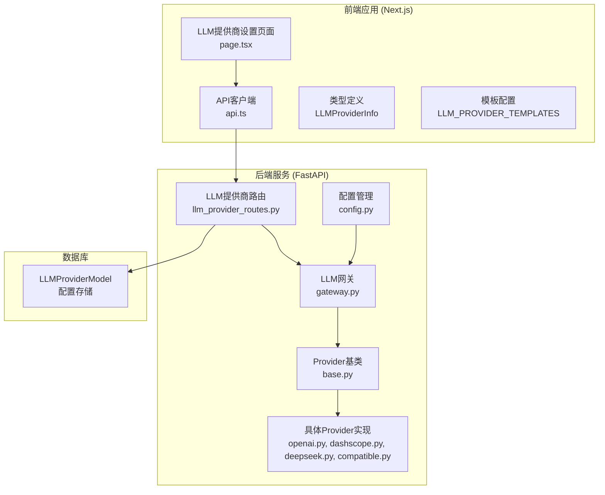
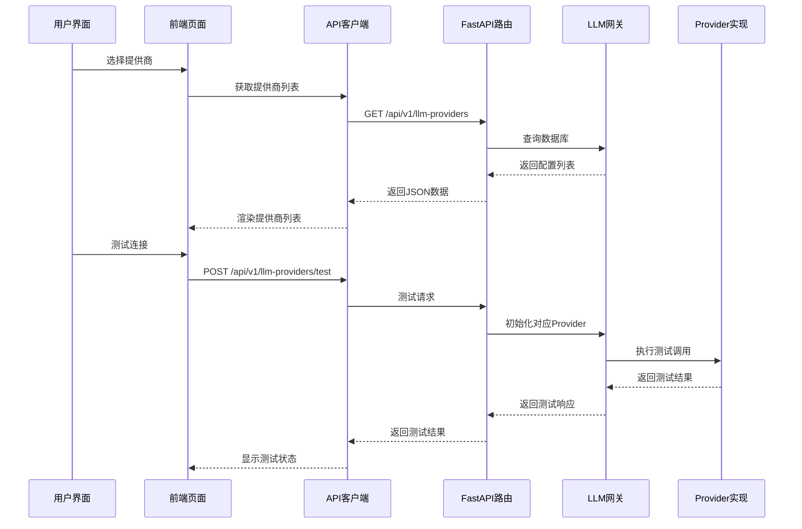
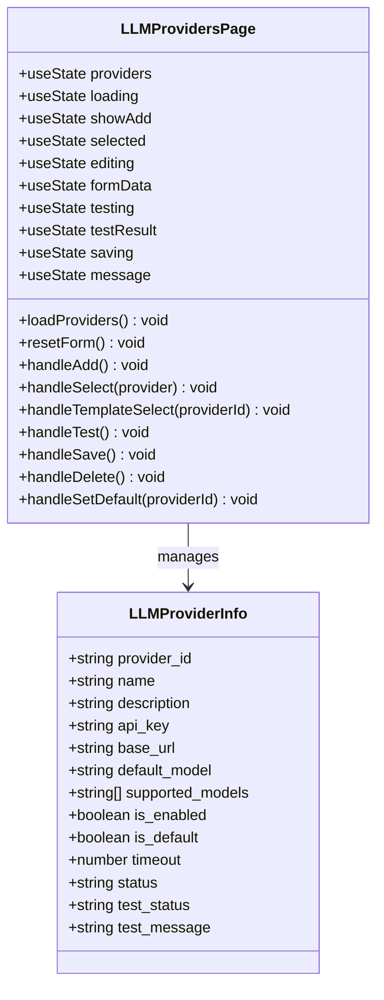
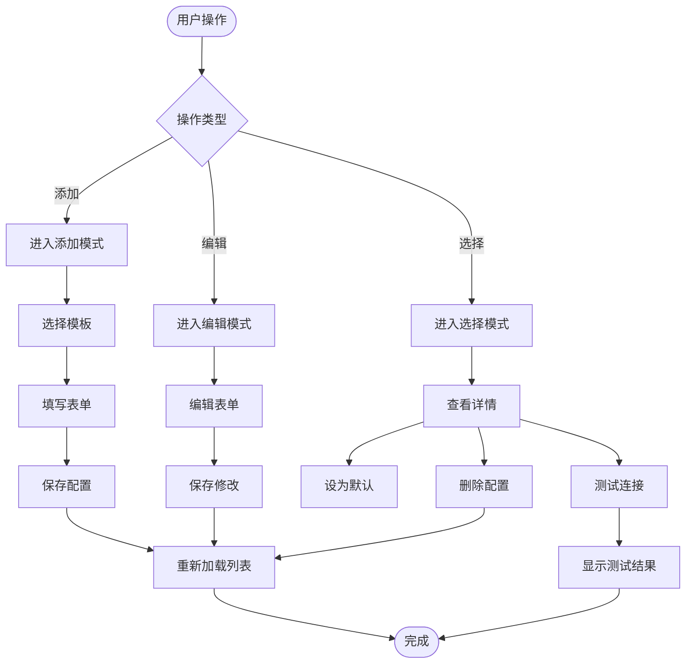
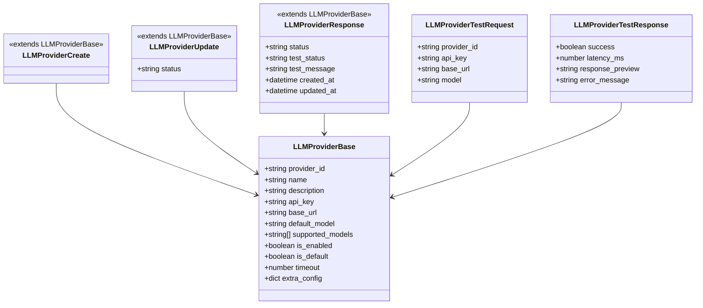
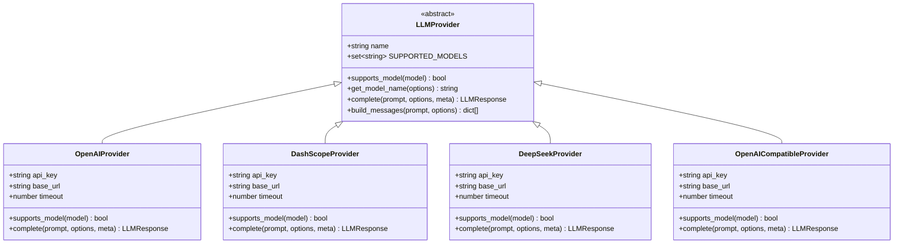
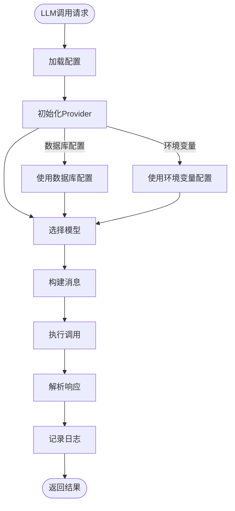
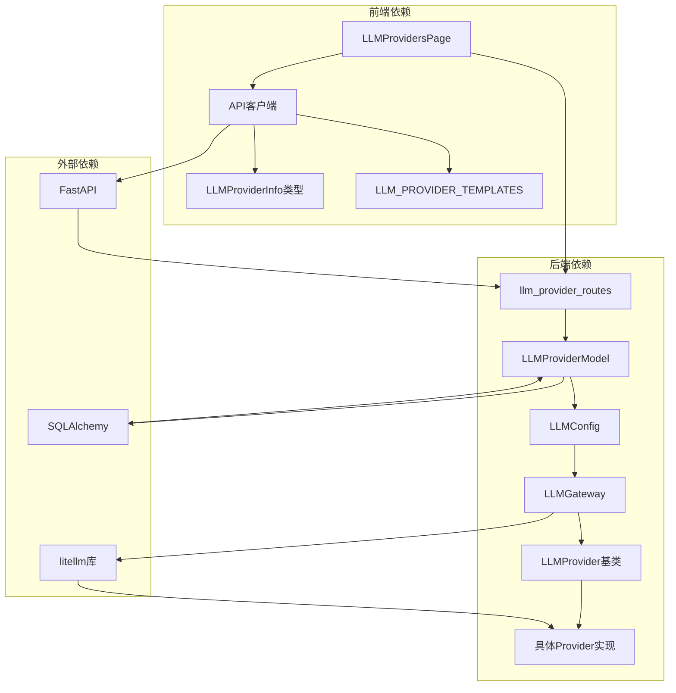

# LLM提供商设置页面

<cite>
**本文档引用的文件**
- [frontend/app/settings/llm-providers/page.tsx](file://frontend/app/settings/llm-providers/page.tsx)
- [frontend/lib/api.ts](file://frontend/lib/api.ts)
- [backend/app/api/llm_provider_routes.py](file://backend/app/api/llm_provider_routes.py)
- [backend/app/llm/providers/openai.py](file://backend/app/llm/providers/openai.py)
- [backend/app/llm/providers/dashscope.py](file://backend/app/llm/providers/dashscope.py)
- [backend/app/llm/providers/deepseek.py](file://backend/app/llm/providers/deepseek.py)
- [backend/app/llm/providers/compatible.py](file://backend/app/llm/providers/compatible.py)
- [backend/app/llm/base.py](file://backend/app/llm/base.py)
- [backend/app/llm/gateway.py](file://backend/app/llm/gateway.py)
- [backend/app/llm/config.py](file://backend/app/llm/config.py)
</cite>

## 目录
1. [简介](#简介)
2. [项目结构](#项目结构)
3. [核心组件](#核心组件)
4. [架构概览](#架构概览)
5. [详细组件分析](#详细组件分析)
6. [依赖关系分析](#依赖关系分析)
7. [性能考虑](#性能考虑)
8. [故障排除指南](#故障排除指南)
9. [结论](#结论)

## 简介

LLM提供商设置页面是HotClaw项目中的一个重要功能模块，允许用户管理和配置不同的大型语言模型提供商。该页面提供了完整的CRUD操作界面，支持多种主流LLM提供商，包括OpenAI、阿里云百炼、DeepSeek等，并且支持本地部署的兼容模式。

该页面的核心功能包括：
- 查看和管理已配置的LLM提供商
- 添加新的LLM提供商配置
- 编辑现有提供商的配置
- 测试提供商连接性
- 设置默认提供商
- 删除不需要的提供商配置

## 项目结构

LLM提供商设置页面采用前后端分离的架构设计，主要分为前端React应用和后端FastAPI服务两部分。



**图表来源**
- [frontend/app/settings/llm-providers/page.tsx:1-529](file://frontend/app/settings/llm-providers/page.tsx#L1-L529)
- [backend/app/api/llm_provider_routes.py:1-326](file://backend/app/api/llm_provider_routes.py#L1-L326)

**章节来源**
- [frontend/app/settings/llm-providers/page.tsx:1-529](file://frontend/app/settings/llm-providers/page.tsx#L1-L529)
- [backend/app/api/llm_provider_routes.py:1-326](file://backend/app/api/llm_provider_routes.py#L1-L326)

## 核心组件

### 前端组件

LLM提供商设置页面是一个完整的React组件，实现了以下核心功能：

1. **状态管理**：使用React Hooks管理表单状态、加载状态、编辑状态等
2. **数据获取**：通过API客户端获取和更新LLM提供商配置
3. **表单验证**：提供实时的表单验证和错误处理
4. **模板选择**：支持预定义的提供商模板快速配置

### 后端API

后端提供了RESTful API接口，支持完整的CRUD操作：

1. **列表查询**：获取所有LLM提供商配置
2. **创建**：新增LLM提供商配置
3. **更新**：修改现有配置
4. **删除**：移除不需要的配置
5. **测试**：验证提供商连接性
6. **默认设置**：管理默认提供商

**章节来源**
- [frontend/lib/api.ts:111-284](file://frontend/lib/api.ts#L111-L284)
- [backend/app/api/llm_provider_routes.py:94-326](file://backend/app/api/llm_provider_routes.py#L94-L326)

## 架构概览

整个LLM提供商设置系统的架构采用了分层设计，确保了良好的可扩展性和维护性。



**图表来源**
- [frontend/app/settings/llm-providers/page.tsx:121-158](file://frontend/app/settings/llm-providers/page.tsx#L121-L158)
- [backend/app/api/llm_provider_routes.py:183-284](file://backend/app/api/llm_provider_routes.py#L183-L284)

## 详细组件分析

### 前端页面组件分析

LLM提供商设置页面是一个功能完整的React组件，实现了以下关键特性：

#### 状态管理架构



**图表来源**
- [frontend/app/settings/llm-providers/page.tsx:16-529](file://frontend/app/settings/llm-providers/page.tsx#L16-L529)
- [frontend/lib/api.ts:113-130](file://frontend/lib/api.ts#L113-L130)

#### 表单处理流程



**图表来源**
- [frontend/app/settings/llm-providers/page.tsx:79-225](file://frontend/app/settings/llm-providers/page.tsx#L79-L225)

**章节来源**
- [frontend/app/settings/llm-providers/page.tsx:16-529](file://frontend/app/settings/llm-providers/page.tsx#L16-L529)

### 后端API路由分析

后端API路由提供了完整的LLM提供商管理功能：

#### 路由定义

```mermaid
graph LR
subgraph "LLM提供商API路由"
A[/api/v1/llm-providers] --> B[GET - 获取所有提供商]
A --> C[POST - 创建提供商]
A --> D[PUT - 更新提供商]
A --> E[DELETE - 删除提供商]
F[/api/v1/llm-providers/test] --> G[POST - 测试连接]
H[/api/v1/llm-providers/active/default] --> I[GET - 获取默认提供商]
H --> J[POST - 设置默认提供商]
end
```

**图表来源**
- [backend/app/api/llm_provider_routes.py:19-326](file://backend/app/api/llm_provider_routes.py#L19-L326)

#### 数据模型

后端使用Pydantic模型定义了完整的数据结构：



**图表来源**
- [backend/app/api/llm_provider_routes.py:27-88](file://backend/app/api/llm_provider_routes.py#L27-L88)

**章节来源**
- [backend/app/api/llm_provider_routes.py:27-326](file://backend/app/api/llm_provider_routes.py#L27-L326)

### LLM Provider实现分析

系统支持四种主要的LLM提供商，每种都有特定的实现：

#### Provider基类架构



**图表来源**
- [backend/app/llm/base.py:74-160](file://backend/app/llm/base.py#L74-L160)
- [backend/app/llm/providers/openai.py:12-185](file://backend/app/llm/providers/openai.py#L12-L185)
- [backend/app/llm/providers/dashscope.py:12-194](file://backend/app/llm/providers/dashscope.py#L12-L194)
- [backend/app/llm/providers/deepseek.py:12-178](file://backend/app/llm/providers/deepseek.py#L12-L178)
- [backend/app/llm/providers/compatible.py:12-191](file://backend/app/llm/providers/compatible.py#L12-L191)

#### 具体Provider实现特点

每个Provider都有其特定的功能和配置要求：

| Provider | 支持模型 | 特点 | 配置要求 |
|---------|----------|------|----------|
| OpenAI | gpt-4o, gpt-4o-mini, gpt-4-turbo, o1系列 | 官方API，高质量输出 | OPENAI_API_KEY |
| DashScope | qwen-turbo, qwen-plus, qwen-max | 阿里云Qwen系列 | DASHSCOPE_API_KEY |
| DeepSeek | deepseek-chat, deepseek-coder, deepseek-reasoner | 专业推理模型 | DEEPSEEK_API_KEY |
| Compatible | 任意模型 | 本地部署兼容 | BASE_URL |

**章节来源**
- [backend/app/llm/providers/openai.py:12-185](file://backend/app/llm/providers/openai.py#L12-L185)
- [backend/app/llm/providers/dashscope.py:12-194](file://backend/app/llm/providers/dashscope.py#L12-L194)
- [backend/app/llm/providers/deepseek.py:12-178](file://backend/app/llm/providers/deepseek.py#L12-L178)
- [backend/app/llm/providers/compatible.py:12-191](file://backend/app/llm/providers/compatible.py#L12-L191)

### LLM网关架构

LLM网关是系统的核心组件，负责统一管理所有LLM提供商：



**图表来源**
- [backend/app/llm/gateway.py:24-440](file://backend/app/llm/gateway.py#L24-L440)

**章节来源**
- [backend/app/llm/gateway.py:24-440](file://backend/app/llm/gateway.py#L24-L440)

## 依赖关系分析

系统各组件之间的依赖关系清晰明确，遵循了良好的软件工程原则：



**图表来源**
- [frontend/lib/api.ts:111-284](file://frontend/lib/api.ts#L111-L284)
- [backend/app/api/llm_provider_routes.py:15-17](file://backend/app/api/llm_provider_routes.py#L15-L17)
- [backend/app/llm/gateway.py:13-20](file://backend/app/llm/gateway.py#L13-L20)

**章节来源**
- [frontend/lib/api.ts:111-284](file://frontend/lib/api.ts#L111-L284)
- [backend/app/api/llm_provider_routes.py:15-17](file://backend/app/api/llm_provider_routes.py#L15-L17)

## 性能考虑

系统在设计时充分考虑了性能优化：

### 前端性能优化

1. **状态管理优化**：使用React Hooks进行细粒度状态管理
2. **条件渲染**：根据状态动态渲染不同UI元素
3. **防抖处理**：对频繁操作进行防抖处理
4. **懒加载**：按需加载Provider模板

### 后端性能优化

1. **连接池管理**：合理管理数据库连接
2. **缓存策略**：使用LRU缓存配置信息
3. **异步处理**：大量使用async/await提高并发性能
4. **超时控制**：为不同Provider设置合理的超时时间

### 网络性能优化

1. **批量操作**：支持批量配置管理
2. **增量更新**：只更新变更的字段
3. **错误重试**：智能的错误重试机制
4. **连接复用**：复用HTTP连接减少开销

## 故障排除指南

### 常见问题及解决方案

#### Provider配置问题

**问题**：Provider无法连接
**原因**：
- API Key配置错误
- Base URL不正确
- 网络连接问题
- 超时设置过短

**解决方案**：
1. 检查API Key格式和有效性
2. 验证Base URL的正确性
3. 测试网络连通性
4. 调整超时时间设置

#### 测试连接失败

**问题**：测试连接总是失败
**排查步骤**：
1. 查看详细的错误信息
2. 检查Provider的supported_models配置
3. 验证模型名称的正确性
4. 确认Provider的可用性状态

#### 默认Provider设置问题

**问题**：默认Provider无法生效
**解决方法**：
1. 确保默认Provider处于启用状态
2. 检查Provider的配置完整性
3. 重新加载系统配置
4. 验证Provider的可用性

**章节来源**
- [backend/app/api/llm_provider_routes.py:268-284](file://backend/app/api/llm_provider_routes.py#L268-L284)
- [frontend/app/settings/llm-providers/page.tsx:121-158](file://frontend/app/settings/llm-providers/page.tsx#L121-L158)

## 结论

LLM提供商设置页面是一个设计精良、功能完整的管理系统，具有以下特点：

### 技术优势

1. **架构清晰**：前后端分离，职责明确
2. **扩展性强**：支持多种Provider，易于添加新Provider
3. **用户体验好**：直观的界面设计和流畅的操作体验
4. **安全性高**：敏感信息加密存储，权限控制严格

### 功能完整性

1. **完整的CRUD操作**：支持所有基本的数据管理功能
2. **连接测试**：内置的连接性测试功能
3. **模板配置**：预定义的配置模板简化设置过程
4. **默认配置**：灵活的默认Provider管理

### 维护便利性

1. **代码结构清晰**：模块化设计便于维护
2. **文档完善**：详细的注释和文档
3. **错误处理完善**：全面的错误处理和恢复机制
4. **日志记录完整**：详细的操作日志便于调试

该系统为HotClaw项目提供了强大的LLM提供商管理能力，为后续的功能扩展奠定了坚实的基础。