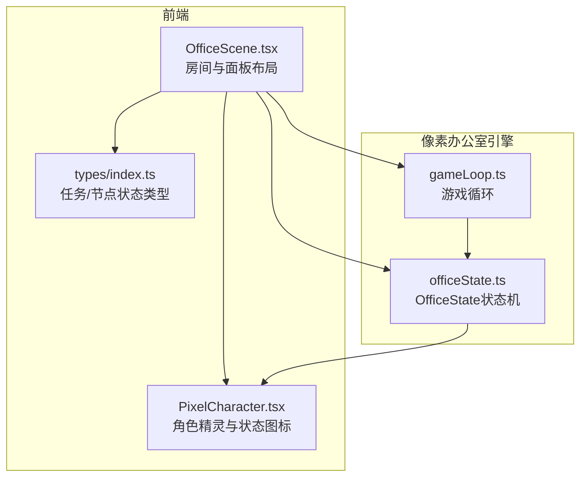
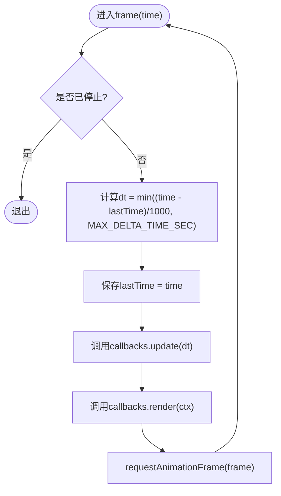
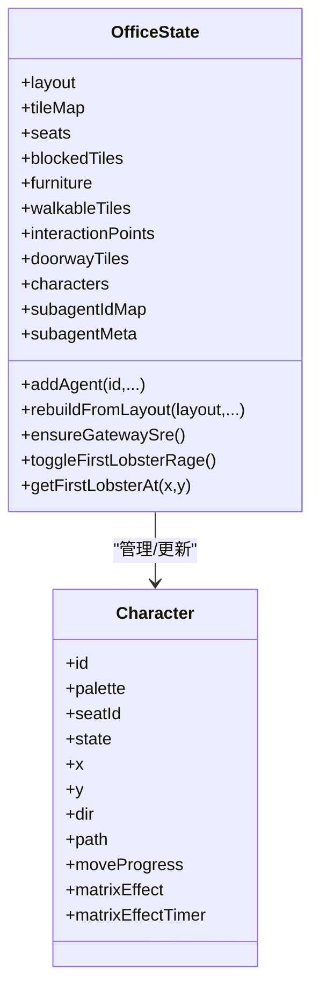
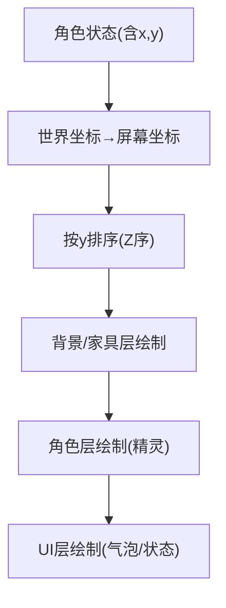
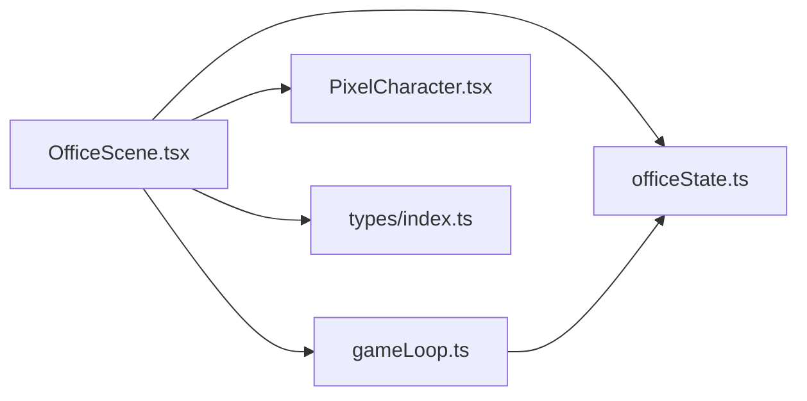

# Canvas渲染引擎

<cite>
**本文引用的文件**
- [ARCHITECTURE.md](file://ARCHITECTURE.md)
- [gameLoop.ts](file://OpenClaw-bot-review-main/lib/pixel-office/engine/gameLoop.ts)
- [officeState.ts](file://OpenClaw-bot-review-main/lib/pixel-office/engine/officeState.ts)
- [OfficeScene.tsx](file://frontend/components/office/OfficeScene.tsx)
- [PixelCharacter.tsx](file://frontend/components/office/PixelCharacter.tsx)
- [index.ts](file://frontend/types/index.ts)
</cite>

## 目录
1. [引言](#引言)
2. [项目结构](#项目结构)
3. [核心组件](#核心组件)
4. [架构总览](#架构总览)
5. [详细组件分析](#详细组件分析)
6. [依赖分析](#依赖分析)
7. [性能考量](#性能考量)
8. [故障排查指南](#故障排查指南)
9. [结论](#结论)
10. [附录](#附录)

## 引言
本技术文档聚焦于Canvas渲染引擎的设计与实现，围绕以下主题展开：
- GameLoop游戏循环：帧率控制、时间管理与渲染调度
- OfficeState状态管理：角色状态同步、场景状态维护与渲染队列管理
- Canvas 2D渲染管线：像素坐标转换、Z排序与批量渲染优化
- 性能优化策略：脏区域检测、对象池与GPU加速
- 渲染调试与性能监控
- 面向初学者的Canvas基础API与面向高级开发者的高性能架构实践

## 项目结构
本仓库包含两套可视化方案：
- 前端像素风办公场景（React + Canvas）：用于展示智能体在像素风格办公室中的动态表现
- 后端工作流可视化（线性卡片）：用于任务节点状态的实时展示

本章节重点覆盖“像素办公室”相关的Canvas渲染子系统。



图表来源
- [OfficeScene.tsx:1-428](file://frontend/components/office/OfficeScene.tsx#L1-L428)
- [PixelCharacter.tsx:1-83](file://frontend/components/office/PixelCharacter.tsx#L1-L83)
- [gameLoop.ts:1-39](file://OpenClaw-bot-review-main/lib/pixel-office/engine/gameLoop.ts#L1-L39)
- [officeState.ts:389-466](file://OpenClaw-bot-review-main/lib/pixel-office/engine/officeState.ts#L389-L466)
- [index.ts:1-119](file://frontend/types/index.ts#L1-L119)

章节来源
- [ARCHITECTURE.md:191-290](file://ARCHITECTURE.md#L191-L290)
- [OfficeScene.tsx:1-428](file://frontend/components/office/OfficeScene.tsx#L1-L428)
- [PixelCharacter.tsx:1-83](file://frontend/components/office/PixelCharacter.tsx#L1-L83)
- [gameLoop.ts:1-39](file://OpenClaw-bot-review-main/lib/pixel-office/engine/gameLoop.ts#L1-L39)
- [officeState.ts:389-466](file://OpenClaw-bot-review-main/lib/pixel-office/engine/officeState.ts#L389-L466)
- [index.ts:1-119](file://frontend/types/index.ts#L1-L119)

## 核心组件
- 游戏循环（GameLoop）
  - 通过requestAnimationFrame驱动，限制最大帧间隔，保证时间步长稳定
  - 回调接口分离update与render，便于解耦逻辑更新与绘制
- OfficeState状态机
  - 维护场景布局、角色集合、座位分配、交互点、可达区域等
  - 提供角色生成、路径规划、碰撞与占位、系统角色（值班SRE、螃蟹等）管理
- React场景组件
  - OfficeScene负责房间背景、角色覆盖层、底部面板与悬浮提示
  - PixelCharacter负责角色精灵渲染与状态动画
- 类型系统
  - 统一的任务/节点状态类型，支撑SSE事件与UI状态同步

章节来源
- [gameLoop.ts:1-39](file://OpenClaw-bot-review-main/lib/pixel-office/engine/gameLoop.ts#L1-L39)
- [officeState.ts:389-466](file://OpenClaw-bot-review-main/lib/pixel-office/engine/officeState.ts#L389-L466)
- [OfficeScene.tsx:1-428](file://frontend/components/office/OfficeScene.tsx#L1-L428)
- [PixelCharacter.tsx:1-83](file://frontend/components/office/PixelCharacter.tsx#L1-L83)
- [index.ts:1-119](file://frontend/types/index.ts#L1-L119)

## 架构总览
Canvas渲染引擎采用“状态机 + 游戏循环”的经典架构：
- OfficeState集中管理场景与角色状态
- GameLoop以固定节奏调用update与render
- React组件负责UI布局与事件交互，通过状态映射到Canvas绘制

```mermaid
sequenceDiagram
participant UI as "OfficeScene.tsx"
participant LOOP as "gameLoop.ts"
participant STATE as "officeState.ts"
participant CANVAS as "Canvas 2D"
UI->>LOOP : 初始化并传入回调
LOOP->>STATE : update(dt)
STATE-->>LOOP : 更新后的角色/场景状态
LOOP->>CANVAS : render(ctx)
CANVAS-->>UI : 帧完成
LOOP->>LOOP : requestAnimationFrame(frame)
```

图表来源
- [gameLoop.ts:8-38](file://OpenClaw-bot-review-main/lib/pixel-office/engine/gameLoop.ts#L8-L38)
- [officeState.ts:389-466](file://OpenClaw-bot-review-main/lib/pixel-office/engine/officeState.ts#L389-L466)
- [OfficeScene.tsx:1-428](file://frontend/components/office/OfficeScene.tsx#L1-L428)

## 详细组件分析

### 游戏循环（GameLoop）实现原理
- 时间步长控制
  - 使用上次帧时间计算dt，限制最大增量以避免长时间冻结导致的超大dt
- 帧率与图像平滑
  - 在每帧开始与渲染前设置imageSmoothingEnabled，确保像素风格清晰
- 回调接口
  - update回调用于状态推进（如角色移动、表情、特效计时）
  - render回调负责绘制（背景、角色、UI）



图表来源
- [gameLoop.ts:19-30](file://OpenClaw-bot-review-main/lib/pixel-office/engine/gameLoop.ts#L19-L30)

章节来源
- [gameLoop.ts:1-39](file://OpenClaw-bot-review-main/lib/pixel-office/engine/gameLoop.ts#L1-L39)

### OfficeState状态管理系统
- 场景与布局
  - 从布局序列化构建瓦片地图、座位、家具实例、可达区域、交互点、门区域
  - 支持根据新布局重建并迁移角色位置
- 角色管理
  - 角色生成：随机或指定座位、色调多样化的配色方案
  - 角色行为：寻路、闲逛、打字、愤怒（螃蟹）、矩阵特效等
  - 角色占位：座位占用、自身占位临时解除以允许穿越
- 系统角色与事件
  - 值班SRE角色、临时工标签国际化
  - 螃蟹与捕食螃蟹的互动、命中判定
- 状态同步与渲染队列
  - OfficeState作为单一真相源，update阶段推进状态
  - render阶段按状态绘制，天然形成“状态驱动渲染”的队列



图表来源
- [officeState.ts:389-466](file://OpenClaw-bot-review-main/lib/pixel-office/engine/officeState.ts#L389-L466)
- [officeState.ts:635-712](file://OpenClaw-bot-review-main/lib/pixel-office/engine/officeState.ts#L635-L712)
- [officeState.ts:792-800](file://OpenClaw-bot-review-main/lib/pixel-office/engine/officeState.ts#L792-L800)

章节来源
- [officeState.ts:389-466](file://OpenClaw-bot-review-main/lib/pixel-office/engine/officeState.ts#L389-L466)
- [officeState.ts:468-544](file://OpenClaw-bot-review-main/lib/pixel-office/engine/officeState.ts#L468-L544)
- [officeState.ts:635-712](file://OpenClaw-bot-review-main/lib/pixel-office/engine/officeState.ts#L635-L712)
- [officeState.ts:792-800](file://OpenClaw-bot-review-main/lib/pixel-office/engine/officeState.ts#L792-L800)

### Canvas 2D渲染管线与像素坐标
- 像素风格
  - 关闭图像平滑，确保像素艺术清晰
- 坐标系
  - 世界坐标与网格坐标的换算：世界像素坐标 = 网格行列 × 瓦片尺寸
- Z排序
  - 依据角色的y坐标（屏幕垂直方向）进行排序，实现“从上到下”的遮挡关系
- 批量渲染
  - 将背景、家具、角色、UI分层绘制，减少重复状态切换
- 脏区域优化（建议）
  - 基于OfficeState的增量更新，仅对受影响的角色与区域重绘（当前实现以整体重绘为主）



图表来源
- [gameLoop.ts:12-27](file://OpenClaw-bot-review-main/lib/pixel-office/engine/gameLoop.ts#L12-L27)
- [PixelCharacter.tsx:35-62](file://frontend/components/office/PixelCharacter.tsx#L35-L62)

章节来源
- [gameLoop.ts:12-27](file://OpenClaw-bot-review-main/lib/pixel-office/engine/gameLoop.ts#L12-L27)
- [PixelCharacter.tsx:35-62](file://frontend/components/office/PixelCharacter.tsx#L35-L62)

### 渲染性能优化策略
- 脏区域检测（建议）
  - 仅重绘角色位置变化或状态变化的矩形区域，结合Canvas的局部刷新
- 对象池（建议）
  - 复用角色精灵、特效粒子与UI元素，降低GC压力
- GPU加速（建议）
  - 使用WebGL或OffscreenCanvas进行大规模批处理渲染
- 帧率与时间步长
  - 通过MAX_DELTA_TIME_SEC限制dt，避免“时间跳跃”导致的过度计算

章节来源
- [gameLoop.ts:1-39](file://OpenClaw-bot-review-main/lib/pixel-office/engine/gameLoop.ts#L1-L39)

### 渲染调试工具与性能监控
- 调试工具
  - 开启浏览器开发者工具的性能面板，观察帧耗时与重绘热点
  - 使用FPS显示器或自定义帧率计数器
- 性能监控
  - 记录每帧update与render耗时，识别瓶颈（如角色寻路、路径规划）
  - 监控角色数量与绘制批次，评估批量渲染收益

章节来源
- [gameLoop.ts:19-30](file://OpenClaw-bot-review-main/lib/pixel-office/engine/gameLoop.ts#L19-L30)

### Canvas基础API入门（面向初学者）
- 获取上下文与像素风格
  - 通过Canvas.getContext('2d')获取2D上下文
  - 设置imageSmoothingEnabled=false保持像素风格
- 绘制与坐标
  - 使用drawImage绘制精灵，注意坐标换算（网格→像素）
  - 通过全局CompositeOperation实现透明与混合效果
- 状态与变换
  - save()/restore()保存与恢复绘制状态
  - translate/scale/rotate进行局部变换

章节来源
- [gameLoop.ts:12-13](file://OpenClaw-bot-review-main/lib/pixel-office/engine/gameLoop.ts#L12-L13)

### 高级开发者实践（面向高级开发者）
- 架构设计
  - 将OfficeState抽象为“渲染无关的状态机”，通过回调注入渲染逻辑
  - 使用分层渲染（背景/家具/角色/UI）与Z排序，提升可维护性
- 优化技巧
  - 将昂贵的计算（如路径规划）异步化或延迟到空闲帧
  - 使用Web Workers或SIMD指令（如可用）加速数学运算
  - 采用纹理图集与批处理绘制，减少状态切换
- 可观测性
  - 为update/render分别埋点，统计CPU与GPU占比
  - 记录角色数量、帧率、丢帧次数，建立健康指标

章节来源
- [officeState.ts:389-466](file://OpenClaw-bot-review-main/lib/pixel-office/engine/officeState.ts#L389-L466)
- [gameLoop.ts:8-38](file://OpenClaw-bot-review-main/lib/pixel-office/engine/gameLoop.ts#L8-L38)

## 依赖分析
- OfficeScene依赖
  - OfficeState：角色与场景状态
  - PixelCharacter：角色精灵与状态图标
  - types：任务/节点状态类型
- 渲染管线依赖
  - gameLoop：驱动update/render
  - OfficeState：提供绘制所需状态
  - React组件：布局与事件交互



图表来源
- [OfficeScene.tsx:1-428](file://frontend/components/office/OfficeScene.tsx#L1-L428)
- [PixelCharacter.tsx:1-83](file://frontend/components/office/PixelCharacter.tsx#L1-L83)
- [gameLoop.ts:1-39](file://OpenClaw-bot-review-main/lib/pixel-office/engine/gameLoop.ts#L1-L39)
- [officeState.ts:389-466](file://OpenClaw-bot-review-main/lib/pixel-office/engine/officeState.ts#L389-L466)
- [index.ts:1-119](file://frontend/types/index.ts#L1-L119)

章节来源
- [OfficeScene.tsx:1-428](file://frontend/components/office/OfficeScene.tsx#L1-L428)
- [PixelCharacter.tsx:1-83](file://frontend/components/office/PixelCharacter.tsx#L1-L83)
- [gameLoop.ts:1-39](file://OpenClaw-bot-review-main/lib/pixel-office/engine/gameLoop.ts#L1-L39)
- [officeState.ts:389-466](file://OpenClaw-bot-review-main/lib/pixel-office/engine/officeState.ts#L389-L466)
- [index.ts:1-119](file://frontend/types/index.ts#L1-L119)

## 性能考量
- 时间步长稳定性：通过MAX_DELTA_TIME_SEC限制dt，避免极端跳变
- 绘制开销控制：分层绘制与Z排序，尽量减少状态切换
- 角色数量与更新频率：合理控制角色数量与AI更新频率，避免帧率下降
- 建议的进一步优化：脏区域检测、对象池、WebGL批处理、Web Workers

章节来源
- [gameLoop.ts:1-39](file://OpenClaw-bot-review-main/lib/pixel-office/engine/gameLoop.ts#L1-L39)
- [officeState.ts:389-466](file://OpenClaw-bot-review-main/lib/pixel-office/engine/officeState.ts#L389-L466)

## 故障排查指南
- 帧率骤降
  - 检查是否有大量角色同时更新或寻路
  - 确认imageSmoothingEnabled设置正确
- 角色重叠异常
  - 核对Z排序逻辑（按y坐标排序）
  - 检查座位占位与自身占位的临时解除逻辑
- 精灵闪烁或模糊
  - 确保关闭图像平滑（imageSmoothingEnabled=false）
- 事件无响应
  - 检查OfficeScene中的鼠标事件绑定与状态映射

章节来源
- [gameLoop.ts:12-27](file://OpenClaw-bot-review-main/lib/pixel-office/engine/gameLoop.ts#L12-L27)
- [officeState.ts:563-577](file://OpenClaw-bot-review-main/lib/pixel-office/engine/officeState.ts#L563-L577)
- [OfficeScene.tsx:144-182](file://frontend/components/office/OfficeScene.tsx#L144-L182)

## 结论
本Canvas渲染引擎以“状态机 + 游戏循环”为核心，实现了像素风格的智能体办公场景渲染。通过清晰的职责划分与分层渲染，系统具备良好的可维护性与扩展性。建议在后续迭代中引入脏区域检测、对象池与WebGL批处理，以进一步提升性能与帧率稳定性。

## 附录
- 相关类型定义
  - 任务与节点状态类型，支撑SSE事件与UI状态同步

章节来源
- [index.ts:1-119](file://frontend/types/index.ts#L1-L119)