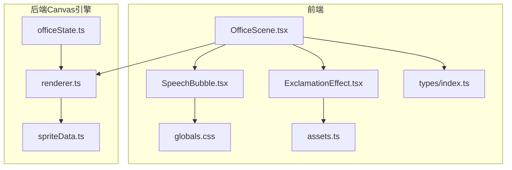
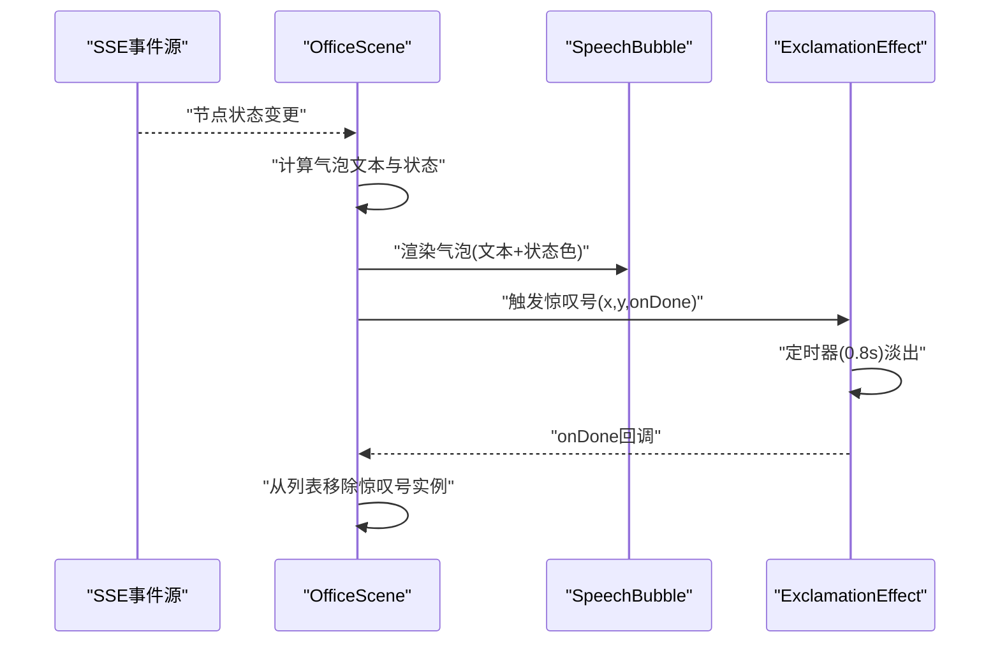
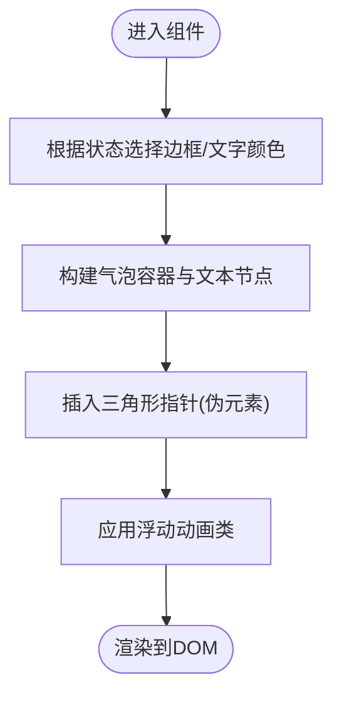
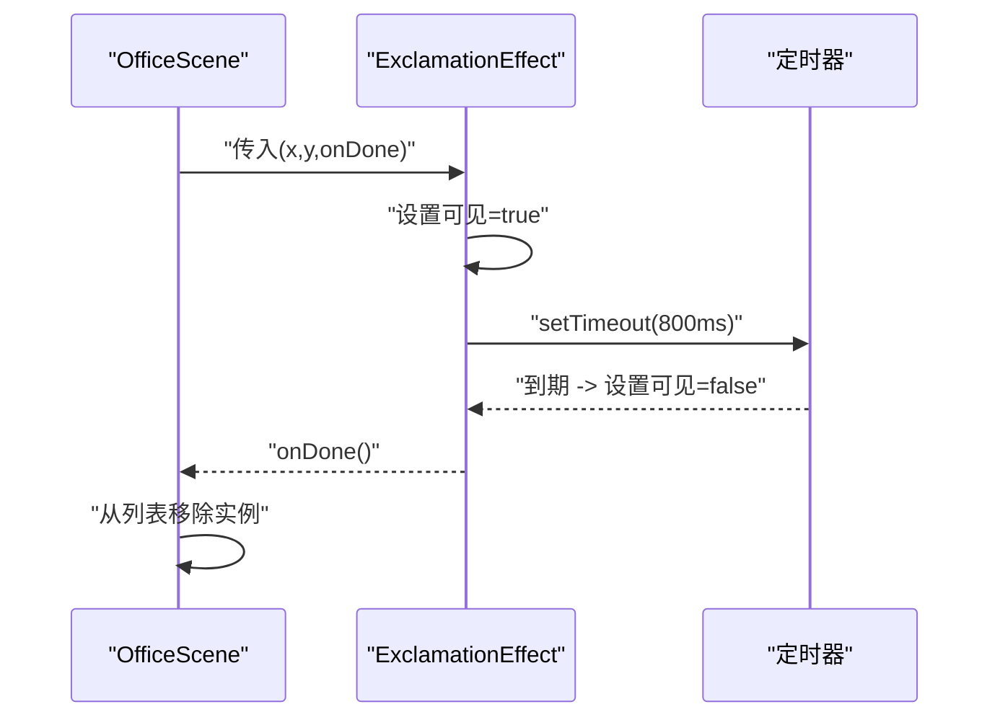
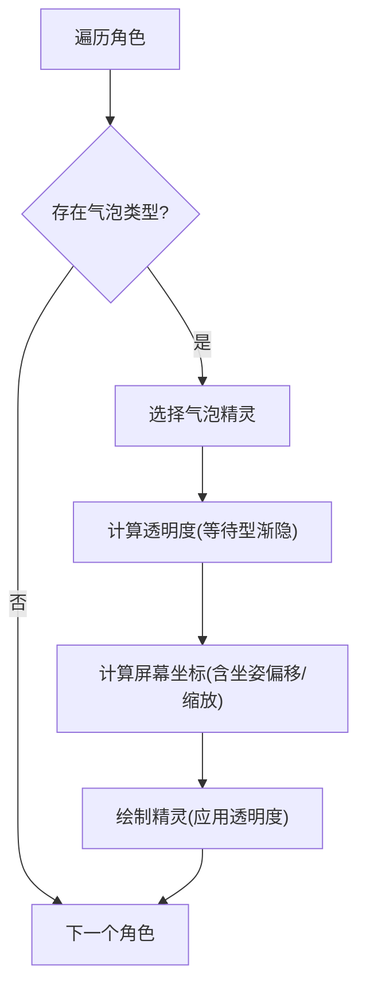
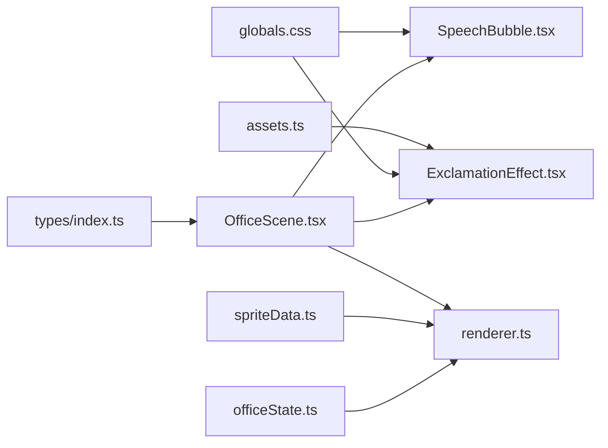

# 任务气泡效果系统

<cite>
**本文引用的文件**
- [SpeechBubble.tsx](file://frontend/components/office/SpeechBubble.tsx)
- [ExclamationEffect.tsx](file://frontend/components/office/ExclamationEffect.tsx)
- [OfficeScene.tsx](file://frontend/components/office/OfficeScene.tsx)
- [globals.css](file://frontend/app/globals.css)
- [assets.ts](file://frontend/lib/assets.ts)
- [types/index.ts](file://frontend/types/index.ts)
- [renderer.ts](file://OpenClaw-bot-review-main/lib/pixel-office/engine/renderer.ts)
- [officeState.ts](file://OpenClaw-bot-review-main/lib/pixel-office/engine/officeState.ts)
- [spriteData.ts](file://OpenClaw-bot-review-main/lib/pixel-office/sprites/spriteData.ts)
</cite>

## 目录
1. [简介](#简介)
2. [项目结构](#项目结构)
3. [核心组件](#核心组件)
4. [架构总览](#架构总览)
5. [详细组件分析](#详细组件分析)
6. [依赖关系分析](#依赖关系分析)
7. [性能考虑](#性能考虑)
8. [故障排查指南](#故障排查指南)
9. [结论](#结论)
10. [附录：样式定制与参数调优](#附录样式定制与参数调优)

## 简介
本文件系统性梳理“任务气泡效果系统”，覆盖前端React组件与后端Canvas渲染两条路径，重点解释以下内容：
- SpeechBubble 组件：气泡形状生成（纯CSS三角形指针）、文本渲染与动态尺寸计算（基于Tailwind类名与像素网格）。
- ExclamationEffect 惊叹号效果：基于像素风格图像的粒子式淡出动画、定时器生命周期与回调回收。
- 气泡位置计算：角色定位、屏幕坐标换算、缩放适配与坐姿偏移修正。
- 状态管理：显示条件、生命周期控制、内存回收与事件回调。
- 样式定制：颜色主题、字体与动画参数调节建议。
- 性能优化：渲染效率、动画开销与资源加载策略。

## 项目结构
该系统由两套实现协同工作：
- 前端（Next.js + TailwindCSS）：用于实时任务节点状态驱动的气泡与惊叹号反馈。
- 后端（Canvas 2D 渲染引擎）：用于像素场景中的气泡与评论渲染，支持缩放缓存与透明度渐变。

图表来源
- [OfficeScene.tsx:144-182](file://frontend/components/office/OfficeScene.tsx#L144-L182)
- [SpeechBubble.tsx:12-49](file://frontend/components/office/SpeechBubble.tsx#L12-L49)
- [ExclamationEffect.tsx:15-44](file://frontend/components/office/ExclamationEffect.tsx#L15-L44)
- [globals.css:54-95](file://frontend/app/globals.css#L54-L95)
- [assets.ts:77-84](file://frontend/lib/assets.ts#L77-L84)
- [renderer.ts:854-887](file://OpenClaw-bot-review-main/lib/pixel-office/engine/renderer.ts#L854-L887)
- [officeState.ts:1490-1526](file://OpenClaw-bot-review-main/lib/pixel-office/engine/officeState.ts#L1490-L1526)
- [spriteData.ts:405-425](file://OpenClaw-bot-review-main/lib/pixel-office/sprites/spriteData.ts#L405-L425)

章节来源
- [OfficeScene.tsx:144-182](file://frontend/components/office/OfficeScene.tsx#L144-L182)
- [renderer.ts:854-887](file://OpenClaw-bot-review-main/lib/pixel-office/engine/renderer.ts#L854-L887)

## 核心组件
- SpeechBubble：根据节点状态动态选择边框与文字颜色，使用纯CSS绘制三角形指针，并通过动画类实现轻微浮动。
- ExclamationEffect：在指定屏幕坐标上渲染像素风格惊叹号，定时淡出并回调销毁。
- OfficeScene：聚合节点状态，决定何时显示气泡与惊叹号，维护动画与交互状态。

章节来源
- [SpeechBubble.tsx:12-49](file://frontend/components/office/SpeechBubble.tsx#L12-L49)
- [ExclamationEffect.tsx:15-44](file://frontend/components/office/ExclamationEffect.tsx#L15-L44)
- [OfficeScene.tsx:74-108](file://frontend/components/office/OfficeScene.tsx#L74-L108)

## 架构总览
前端与后端的气泡系统分别服务于不同渲染层：
- 前端：以React组件形式即时响应SSE推送的任务节点状态变化，生成气泡与惊叹号反馈。
- 后端：在Canvas场景中统一渲染角色气泡与评论，支持缩放缓存、透明度渐变与生命周期管理。

图表来源
- [OfficeScene.tsx:95-108](file://frontend/components/office/OfficeScene.tsx#L95-L108)
- [ExclamationEffect.tsx:18-24](file://frontend/components/office/ExclamationEffect.tsx#L18-L24)
- [globals.css:86-95](file://frontend/app/globals.css#L86-L95)

## 详细组件分析

### SpeechBubble 组件
- 形状与指针：通过绝对定位与伪元素边框组合实现三角形指针，颜色随状态切换。
- 文本渲染：等宽像素字体，文本长度截断策略避免溢出。
- 动态尺寸：基于Tailwind类名的px/相对单位，配合全局像素网格变量保证一致的像素化观感。
- 动画：使用自定义浮动动画，营造轻柔上升感。

图表来源
- [SpeechBubble.tsx:12-49](file://frontend/components/office/SpeechBubble.tsx#L12-L49)
- [globals.css:54-57](file://frontend/app/globals.css#L54-L57)

章节来源
- [SpeechBubble.tsx:12-49](file://frontend/components/office/SpeechBubble.tsx#L12-L49)
- [types/index.ts:5-6](file://frontend/types/index.ts#L5-L6)

### ExclamationEffect 组件
- 生命周期：挂载时启动定时器，到期后隐藏并回调销毁。
- 坐标定位：接收屏幕坐标，减去精灵尺寸的一半以实现中心对齐。
- 视觉反馈：使用像素风格图像与自定义淡出动画，强调即时反馈。
- 资源加载：从集中式资源映射导入精灵图，确保一致性与可维护性。

图表来源
- [ExclamationEffect.tsx:15-44](file://frontend/components/office/ExclamationEffect.tsx#L15-L44)
- [assets.ts:77-84](file://frontend/lib/assets.ts#L77-L84)
- [globals.css:86-95](file://frontend/app/globals.css#L86-L95)

章节来源
- [ExclamationEffect.tsx:15-44](file://frontend/components/office/ExclamationEffect.tsx#L15-L44)
- [assets.ts:77-84](file://frontend/lib/assets.ts#L77-L84)

### Canvas 气泡渲染（后端）
- 状态与计时：等待型气泡具有计时器，临近结束时进行透明度渐变。
- 位置计算：以角色为中心点，结合坐姿偏移与垂直间距，乘以缩放系数并取整，确保像素对齐。
- 精灵缓存：按缩放级别缓存精灵图，减少重复绘制成本。
- 类型区分：权限型气泡全透明，等待型气泡在特定阶段渐隐。

图表来源
- [renderer.ts:854-887](file://OpenClaw-bot-review-main/lib/pixel-office/engine/renderer.ts#L854-L887)
- [officeState.ts:1490-1526](file://OpenClaw-bot-review-main/lib/pixel-office/engine/officeState.ts#L1490-L1526)
- [spriteData.ts:405-425](file://OpenClaw-bot-review-main/lib/pixel-office/sprites/spriteData.ts#L405-L425)

章节来源
- [renderer.ts:854-887](file://OpenClaw-bot-review-main/lib/pixel-office/engine/renderer.ts#L854-L887)
- [officeState.ts:1490-1526](file://OpenClaw-bot-review-main/lib/pixel-office/engine/officeState.ts#L1490-L1526)

## 依赖关系分析
- OfficeScene 依赖：
  - 节点状态类型定义（NodeStatus）。
  - SpeechBubble 与 ExclamationEffect 的渲染与生命周期。
  - 全局动画与像素网格样式。
- ExclamationEffect 依赖：
  - 集中式资源映射（SPRITES）。
  - 自定义淡出动画。
- Canvas 渲染依赖：
  - 角色状态与气泡计时器（officeState）。
  - 气泡精灵数据（spriteData）。
  - 渲染器（renderer）负责坐标换算与绘制。

图表来源
- [types/index.ts:5-6](file://frontend/types/index.ts#L5-L6)
- [OfficeScene.tsx:16-27](file://frontend/components/office/OfficeScene.tsx#L16-L27)
- [SpeechBubble.tsx:3-5](file://frontend/components/office/SpeechBubble.tsx#L3-L5)
- [ExclamationEffect.tsx:5-7](file://frontend/components/office/ExclamationEffect.tsx#L5-L7)
- [assets.ts:77-84](file://frontend/lib/assets.ts#L77-L84)
- [renderer.ts:854-887](file://OpenClaw-bot-review-main/lib/pixel-office/engine/renderer.ts#L854-L887)
- [officeState.ts:1490-1526](file://OpenClaw-bot-review-main/lib/pixel-office/engine/officeState.ts#L1490-L1526)
- [spriteData.ts:405-425](file://OpenClaw-bot-review-main/lib/pixel-office/sprites/spriteData.ts#L405-L425)

章节来源
- [OfficeScene.tsx:16-27](file://frontend/components/office/OfficeScene.tsx#L16-L27)
- [renderer.ts:854-887](file://OpenClaw-bot-review-main/lib/pixel-office/engine/renderer.ts#L854-L887)

## 性能考虑
- 动画与重绘
  - 使用CSS动画（浮动、淡出）而非频繁JavaScript动画，降低主线程压力。
  - 在OfficeScene中仅在状态变化时渲染气泡与惊叹号，避免无谓更新。
- 坐标与缩放
  - Canvas渲染采用整数像素坐标与缩放缓存，减少抗锯齿与重复绘制。
- 资源与加载
  - 将精灵图与动画资源集中管理，避免重复请求与布局抖动。
- 内存回收
  - ExclamationEffect在定时结束后立即回调销毁，确保数组及时瘦身。
  - Canvas侧通过计时器归零清理气泡类型，避免长期驻留。

## 故障排查指南
- 气泡不显示
  - 检查节点状态是否为非“pending”，以及文本截断逻辑是否导致空字符串。
  - 确认全局动画类是否存在且拼写正确。
- 惊叹号不消失
  - 检查定时器是否被提前清理或多次渲染导致的回调未触发。
  - 确认onDone回调链路是否正确传递至父组件并执行移除。
- Canvas气泡位置异常
  - 检查角色坐姿状态与垂直偏移常量，确认缩放与偏移相乘后的取整逻辑。
  - 核对精灵缓存命中与透明度设置。

章节来源
- [OfficeScene.tsx:95-108](file://frontend/components/office/OfficeScene.tsx#L95-L108)
- [ExclamationEffect.tsx:18-24](file://frontend/components/office/ExclamationEffect.tsx#L18-L24)
- [renderer.ts:878-885](file://OpenClaw-bot-review-main/lib/pixel-office/engine/renderer.ts#L878-L885)

## 结论
该气泡效果系统通过前后端协同，实现了从实时节点状态到即时视觉反馈的完整闭环。前端组件负责交互与即时反馈，后端Canvas负责像素场景的统一渲染与性能优化。通过明确的状态管理、坐标计算与资源组织，系统在保持良好用户体验的同时具备良好的可维护性与扩展性。

## 附录：样式定制与参数调优
- 颜色主题
  - 边框与文字颜色由状态映射决定，可在组件内扩展映射表以支持新状态或自定义主题。
  - Canvas侧可通过替换精灵数据或调整透明度曲线实现主题切换。
- 字体与字号
  - 文本字号与等宽字体由组件类名控制；如需适配不同DPR或分辨率，可引入媒体查询或动态计算。
- 动画参数
  - 浮动动画周期与幅度、惊叹号淡出时长与位移均可在CSS中调整，建议保持与像素风格一致的步进节奏。
- 性能参数
  - Canvas缩放缓存阈值与透明度渐变区间可根据场景复杂度与帧率目标微调。
  - 对于高频更新的节点，可考虑节流或批量更新策略，减少重排与重绘。

章节来源
- [SpeechBubble.tsx:12-49](file://frontend/components/office/SpeechBubble.tsx#L12-L49)
- [ExclamationEffect.tsx:18-24](file://frontend/components/office/ExclamationEffect.tsx#L18-L24)
- [globals.css:54-95](file://frontend/app/globals.css#L54-L95)
- [renderer.ts:868-872](file://OpenClaw-bot-review-main/lib/pixel-office/engine/renderer.ts#L868-L872)