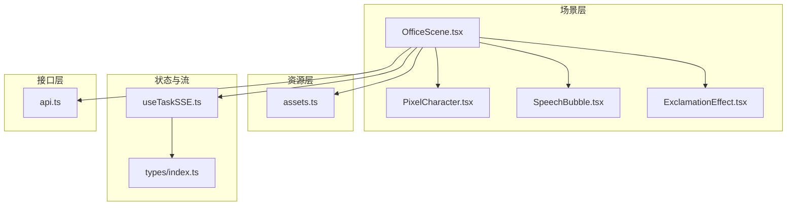
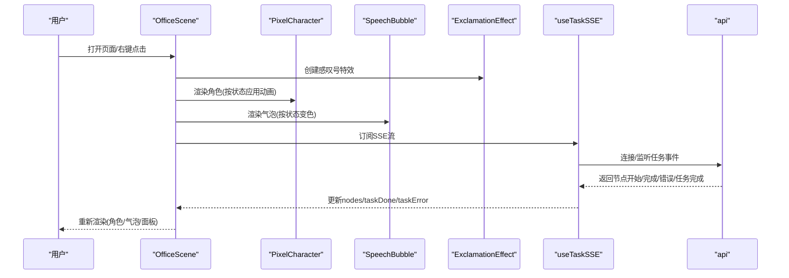
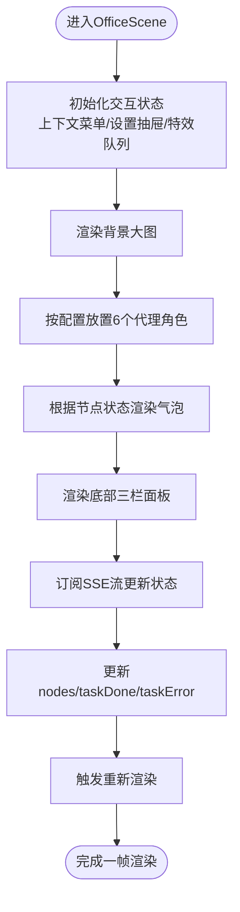
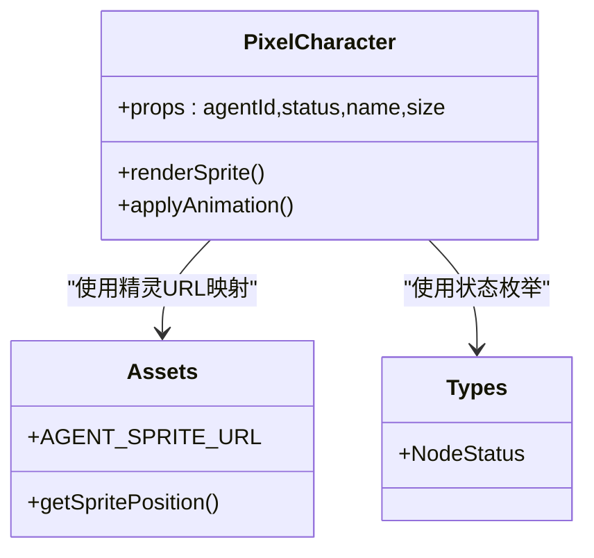
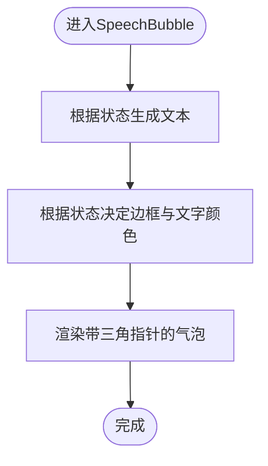
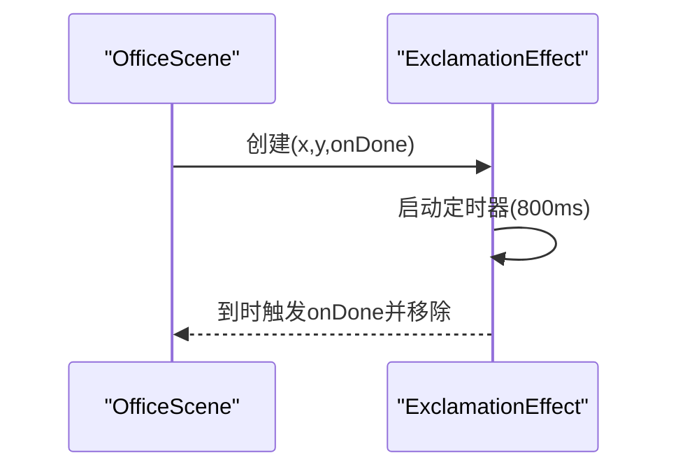
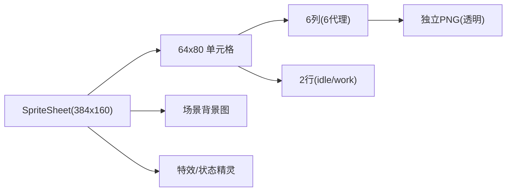
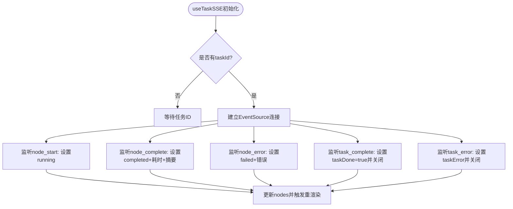
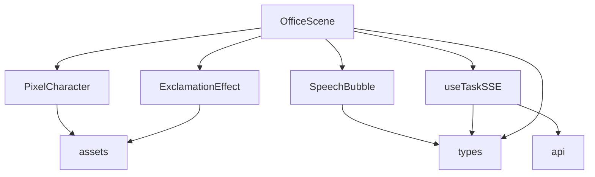

# 像素办公室可视化

<cite>
**本文引用的文件**
- [OfficeScene.tsx](file://frontend/components/office/OfficeScene.tsx)
- [PixelCharacter.tsx](file://frontend/components/office/PixelCharacter.tsx)
- [assets.ts](file://frontend/lib/assets.ts)
- [index.ts](file://frontend/types/index.ts)
- [useTaskSSE.ts](file://frontend/hooks/useTaskSSE.ts)
- [SpeechBubble.tsx](file://frontend/components/office/SpeechBubble.tsx)
- [ExclamationEffect.tsx](file://frontend/components/office/ExclamationEffect.tsx)
- [api.ts](file://frontend/lib/api.ts)
</cite>

## 目录
1. [引言](#引言)
2. [项目结构](#项目结构)
3. [核心组件](#核心组件)
4. [架构总览](#架构总览)
5. [详细组件分析](#详细组件分析)
6. [依赖关系分析](#依赖关系分析)
7. [性能考量](#性能考量)
8. [故障排查指南](#故障排查指南)
9. [结论](#结论)
10. [附录](#附录)

## 引言
本文件面向HotClaw像素办公室可视化系统，聚焦于Canvas渲染引擎的实现思路、OfficeState状态管理、GameLoop游戏循环与像素渲染逻辑，以及像素角色动画系统、帧率控制与渲染优化策略。同时阐述OfficeScene场景组件的设计（场景布局、相机控制与视口管理）、像素字符绘制算法与颜色管理、纹理资源管理，并给出性能优化、渲染批处理与GPU加速建议，以及像素艺术制作与资源导入流程。

## 项目结构
本项目采用前端React组件化架构，像素办公室场景由OfficeScene作为根容器，内部组合像素角色、气泡、特效、面板等子组件；资源通过assets集中管理；状态通过SSE钩子实时更新；类型定义统一在types中维护；API封装在lib/api中。

**图表来源**
- [OfficeScene.tsx:1-428](file://frontend/components/office/OfficeScene.tsx#L1-L428)
- [PixelCharacter.tsx:1-83](file://frontend/components/office/PixelCharacter.tsx#L1-L83)
- [assets.ts:1-125](file://frontend/lib/assets.ts#L1-L125)
- [useTaskSSE.ts:1-124](file://frontend/hooks/useTaskSSE.ts#L1-L124)
- [index.ts:1-119](file://frontend/types/index.ts#L1-L119)
- [api.ts:1-110](file://frontend/lib/api.ts#L1-L110)

**章节来源**
- [OfficeScene.tsx:1-428](file://frontend/components/office/OfficeScene.tsx#L1-L428)
- [assets.ts:1-125](file://frontend/lib/assets.ts#L1-L125)
- [useTaskSSE.ts:1-124](file://frontend/hooks/useTaskSSE.ts#L1-L124)
- [index.ts:1-119](file://frontend/types/index.ts#L1-L119)
- [api.ts:1-110](file://frontend/lib/api.ts#L1-L110)

## 核心组件
- OfficeScene：房间场景容器，负责布局、交互状态、底部面板与覆盖层管理，驱动像素角色与气泡展示。
- PixelCharacter：单个代理角色的精灵渲染与动画控制，支持不同状态下的位图与CSS动画。
- SpeechBubble：角色上方浮动气泡，根据节点状态显示不同边框与文字颜色。
- ExclamationEffect：右键触发的感叹号特效，定时淡出。
- 资源中心assets：集中管理背景场景、精灵表、角色独立PNG、特效与UI贴图，提供位置计算与映射函数。
- 状态钩子useTaskSSE：基于EventSource的SSE订阅，维护节点状态树与任务完成/错误状态。
- 类型定义types：统一的任务、节点、SSE事件与代理角色数据结构。
- API封装api：统一的REST请求封装与SSE流地址生成。

**章节来源**
- [OfficeScene.tsx:1-428](file://frontend/components/office/OfficeScene.tsx#L1-L428)
- [PixelCharacter.tsx:1-83](file://frontend/components/office/PixelCharacter.tsx#L1-L83)
- [SpeechBubble.tsx:1-50](file://frontend/components/office/SpeechBubble.tsx#L1-L50)
- [ExclamationEffect.tsx:1-45](file://frontend/components/office/ExclamationEffect.tsx#L1-L45)
- [assets.ts:1-125](file://frontend/lib/assets.ts#L1-L125)
- [useTaskSSE.ts:1-124](file://frontend/hooks/useTaskSSE.ts#L1-L124)
- [index.ts:1-119](file://frontend/types/index.ts#L1-L119)
- [api.ts:1-110](file://frontend/lib/api.ts#L1-L110)

## 架构总览
系统采用“场景容器 + 子组件 + 资源中心 + 状态流 + 接口层”的分层架构。OfficeScene作为顶层容器，聚合角色、气泡、特效与面板；PixelCharacter与SpeechBubble负责像素级渲染与动画；ExclamationEffect提供一次性特效；assets集中管理纹理与布局；useTaskSSE通过SSE驱动状态树变化；api提供后端交互能力。

**图表来源**
- [OfficeScene.tsx:1-428](file://frontend/components/office/OfficeScene.tsx#L1-L428)
- [PixelCharacter.tsx:1-83](file://frontend/components/office/PixelCharacter.tsx#L1-L83)
- [SpeechBubble.tsx:1-50](file://frontend/components/office/SpeechBubble.tsx#L1-L50)
- [ExclamationEffect.tsx:1-45](file://frontend/components/office/ExclamationEffect.tsx#L1-L45)
- [useTaskSSE.ts:1-124](file://frontend/hooks/useTaskSSE.ts#L1-L124)
- [api.ts:1-110](file://frontend/lib/api.ts#L1-L110)

## 详细组件分析

### OfficeScene 场景容器
- 场景布局：顶部大背景图（LargePixelOffice.png），底部三栏面板（日志、状态、访客），标题导航与房间标识。
- 交互状态：上下文菜单、设置抽屉、结果面板、感叹号特效队列。
- 角色叠加：根据AGENTS配置在房间内固定坐标放置6个代理角色，每个角色上方显示对应气泡文本。
- 任务状态徽章：根据是否运行、完成或出错显示不同提示。
- 底部面板：日志面板展示节点状态与耗时；状态面板以网格展示各代理图标与状态；访客面板展示当前任务的节点摘要。

**图表来源**
- [OfficeScene.tsx:1-428](file://frontend/components/office/OfficeScene.tsx#L1-L428)

**章节来源**
- [OfficeScene.tsx:1-428](file://frontend/components/office/OfficeScene.tsx#L1-L428)

### PixelCharacter 像素角色渲染与动画
- 角色贴图：每个代理拥有独立透明PNG精灵，通过AGENT_SPRITE_URL映射到具体URL。
- 动画控制：根据状态返回不同的CSS动画类，分别对应工作、完成、失败与空闲动画周期。
- 像素风格：通过imageRendering: "pixelated"确保缩放时保持像素风。
- 状态指示：工作态显示脉冲文字“工作中”，完成态显示对勾，失败态显示叉号。

**图表来源**
- [PixelCharacter.tsx:1-83](file://frontend/components/office/PixelCharacter.tsx#L1-L83)
- [assets.ts:1-125](file://frontend/lib/assets.ts#L1-L125)
- [index.ts:1-119](file://frontend/types/index.ts#L1-L119)

**章节来源**
- [PixelCharacter.tsx:1-83](file://frontend/components/office/PixelCharacter.tsx#L1-L83)
- [assets.ts:1-125](file://frontend/lib/assets.ts#L1-L125)
- [index.ts:1-119](file://frontend/types/index.ts#L1-L119)

### SpeechBubble 气泡组件
- 文本截断：根据节点状态返回不同文案，长文本截断。
- 边框与文字颜色：根据状态动态选择边框与文字颜色，增强可读性。
- 动画：使用无限浮动动画提升视觉反馈。

**图表来源**
- [SpeechBubble.tsx:1-50](file://frontend/components/office/SpeechBubble.tsx#L1-L50)
- [index.ts:1-119](file://frontend/types/index.ts#L1-L119)

**章节来源**
- [SpeechBubble.tsx:1-50](file://frontend/components/office/SpeechBubble.tsx#L1-L50)
- [index.ts:1-119](file://frontend/types/index.ts#L1-L119)

### ExclamationEffect 特效组件
- 生命周期：创建后延时自动淡出并回调销毁。
- 帧率控制：通过CSS动画时长与unoptimized图像避免额外JS帧调度。
- 像素风格：使用像素化图像渲染。

**图表来源**
- [ExclamationEffect.tsx:1-45](file://frontend/components/office/ExclamationEffect.tsx#L1-L45)

**章节来源**
- [ExclamationEffect.tsx:1-45](file://frontend/components/office/ExclamationEffect.tsx#L1-L45)

### 资源中心 assets
- 场景背景：large/medium两张背景图路径。
- 精灵表：主精灵表尺寸与单元格大小，按列分配给6种代理类型，两行分别为idle与work。
- 角色独立PNG：每种代理一个独立透明PNG，便于直接渲染。
- 效果与UI：感叹号特效、齿轮图标、状态精灵等。
- 工具函数：根据列/行计算背景定位，获取代理单元格，获取通用状态精灵路径。

**图表来源**
- [assets.ts:1-125](file://frontend/lib/assets.ts#L1-L125)

**章节来源**
- [assets.ts:1-125](file://frontend/lib/assets.ts#L1-L125)

### 状态管理 useTaskSSE
- 初始化：根据后端流水线顺序预置6个节点初始状态。
- 事件监听：node_start/node_complete/node_error/task_complete/task_error。
- 状态树：nodes数组按node_id匹配更新，taskDone与taskError用于顶层面板与徽章渲染。
- 清理：组件卸载与重置时关闭EventSource并恢复初始状态。

**图表来源**
- [useTaskSSE.ts:1-124](file://frontend/hooks/useTaskSSE.ts#L1-L124)

**章节来源**
- [useTaskSSE.ts:1-124](file://frontend/hooks/useTaskSSE.ts#L1-L124)

### 类型定义 types
- 任务与节点状态：TaskStatus与NodeStatus枚举。
- API响应：通用ApiResponse结构。
- 任务详情与节点运行：TaskDetail、NodeRun、TaskSummary。
- SSE事件：SSENodeStart、SSENodeComplete、SSENodeError、SSETaskComplete。
- 代理角色：AgentCharacter（含deskX/deskY等）。
- 仪表盘统计：DashboardStats。

**章节来源**
- [index.ts:1-119](file://frontend/types/index.ts#L1-L119)

### API封装 api
- 统一封装fetch请求，校验code字段，非0抛错。
- 任务相关：创建任务、查询任务详情/节点列表、列出任务。
- SSE流地址：getTaskStreamUrl。
- 代理与技能：列表、详情、更新配置。

**章节来源**
- [api.ts:1-110](file://frontend/lib/api.ts#L1-L110)

## 依赖关系分析
- OfficeScene依赖：PixelCharacter、SpeechBubble、ExclamationEffect、assets、useTaskSSE、types。
- PixelCharacter依赖：assets中的AGENT_SPRITE_URL与getSpritePosition。
- useTaskSSE依赖：api中的getTaskStreamUrl与types中的NodeStatus。
- 资源依赖：assets集中管理所有贴图与布局参数。
- 类型依赖：types为全局共享的数据契约。

**图表来源**
- [OfficeScene.tsx:1-428](file://frontend/components/office/OfficeScene.tsx#L1-L428)
- [PixelCharacter.tsx:1-83](file://frontend/components/office/PixelCharacter.tsx#L1-L83)
- [SpeechBubble.tsx:1-50](file://frontend/components/office/SpeechBubble.tsx#L1-L50)
- [ExclamationEffect.tsx:1-45](file://frontend/components/office/ExclamationEffect.tsx#L1-L45)
- [assets.ts:1-125](file://frontend/lib/assets.ts#L1-L125)
- [useTaskSSE.ts:1-124](file://frontend/hooks/useTaskSSE.ts#L1-L124)
- [index.ts:1-119](file://frontend/types/index.ts#L1-L119)
- [api.ts:1-110](file://frontend/lib/api.ts#L1-L110)

**章节来源**
- [OfficeScene.tsx:1-428](file://frontend/components/office/OfficeScene.tsx#L1-L428)
- [PixelCharacter.tsx:1-83](file://frontend/components/office/PixelCharacter.tsx#L1-L83)
- [SpeechBubble.tsx:1-50](file://frontend/components/office/SpeechBubble.tsx#L1-L50)
- [ExclamationEffect.tsx:1-45](file://frontend/components/office/ExclamationEffect.tsx#L1-L45)
- [assets.ts:1-125](file://frontend/lib/assets.ts#L1-L125)
- [useTaskSSE.ts:1-124](file://frontend/hooks/useTaskSSE.ts#L1-L124)
- [index.ts:1-119](file://frontend/types/index.ts#L1-L119)
- [api.ts:1-110](file://frontend/lib/api.ts#L1-L110)

## 性能考量
- 帧率控制与动画
  - 使用CSS动画（如pixel-work/pixel-done/pixel-idle）替代JS逐帧动画，降低主线程压力。
  - 控制动画时长与缓动函数，避免过长或过短导致视觉不适或频繁重排。
  - 对一次性特效（如感叹号）使用定时器淡出，减少持续渲染负担。
- 像素渲染优化
  - 图像缩放使用imageRendering: "pixelated"，保证清晰锐利的像素风格。
  - 尽量使用独立PNG精灵而非重复拼接同一张大图，减少合成成本。
- 渲染批处理与GPU加速
  - 将多个角色与气泡的DOM层级合并，减少DOM节点数量与重绘区域。
  - 利用浏览器合成层（transform: translateZ(0)或will-change）提升合成效率。
  - 避免在动画帧中进行昂贵的布局测量（如getBoundingClientRect）。
- 资源管理
  - 预加载关键资源（背景图、角色精灵、特效图），减少首屏闪烁。
  - 使用合适的图片格式与压缩策略，平衡体积与质量。
- 状态更新与重渲染
  - useTaskSSE仅在必要时更新nodes，避免不必要的深层重渲染。
  - 将高频组件（如PixelCharacter）拆分为纯展示组件，配合memo化减少重渲染。

[本节为通用性能指导，不直接分析具体文件]

## 故障排查指南
- SSE连接失败
  - 检查getTaskStreamUrl返回的URL是否正确，确认后端服务可用。
  - 在onerror中关闭EventSource并记录错误信息，避免内存泄漏。
- 角色未显示或显示异常
  - 确认AGENT_SPRITE_URL映射是否存在对应agent_id。
  - 检查imageRendering是否生效，确保图片未被浏览器缓存损坏。
- 气泡颜色与状态不符
  - 核对NodeStatus与状态映射关系，确保事件流正确传递。
- 特效不消失
  - 确认ExclamationEffect的onDone回调是否被调用，定时器是否清理。

**章节来源**
- [useTaskSSE.ts:1-124](file://frontend/hooks/useTaskSSE.ts#L1-L124)
- [PixelCharacter.tsx:1-83](file://frontend/components/office/PixelCharacter.tsx#L1-L83)
- [SpeechBubble.tsx:1-50](file://frontend/components/office/SpeechBubble.tsx#L1-L50)
- [ExclamationEffect.tsx:1-45](file://frontend/components/office/ExclamationEffect.tsx#L1-L45)

## 结论
本系统通过场景容器与子组件的清晰分工、资源中心的统一管理、SSE驱动的状态流与API封装，实现了高效且可维护的像素办公室可视化。在渲染层面，采用CSS动画与像素化图像策略，在状态层面，通过事件流与类型约束保障一致性。未来可在GPU合成层利用与资源预加载方面进一步优化，以获得更流畅的像素风体验。

[本节为总结性内容，不直接分析具体文件]

## 附录

### 像素艺术制作与资源导入指南
- 像素风格规范
  - 固定分辨率（如64x80单元格），使用硬边缘线条，避免抗锯齿。
  - 使用有限调色板，确保在不同设备上色彩一致。
- 资源组织
  - 独立PNG：每个角色一张透明背景PNG，便于直接渲染。
  - 精灵表：将多角色idle与work状态按网格排列，便于批量复用。
- 导入流程
  - 将PNG放入/public/assets目录，更新assets.ts中的路径与映射。
  - 若使用精灵表，计算列/行并提供getSpritePosition工具函数。
- 视觉效果
  - 特效图（如感叹号）应与像素风格一致，尺寸建议为32x32。
  - 气泡与状态图标使用统一的边框与文字颜色方案。

[本节为通用指导，不直接分析具体文件]