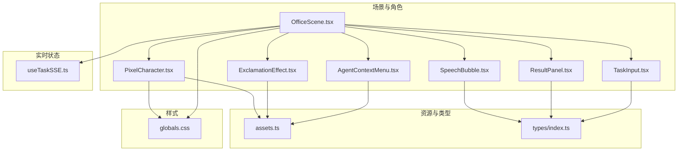
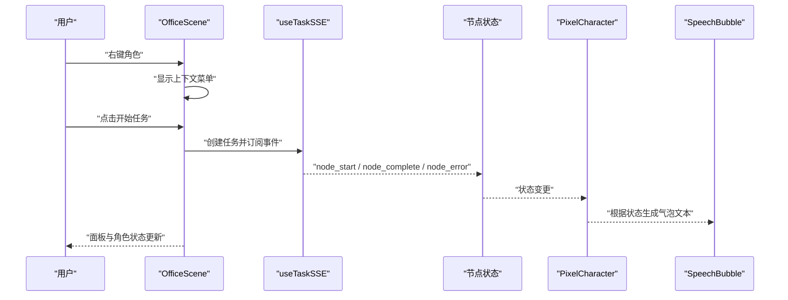
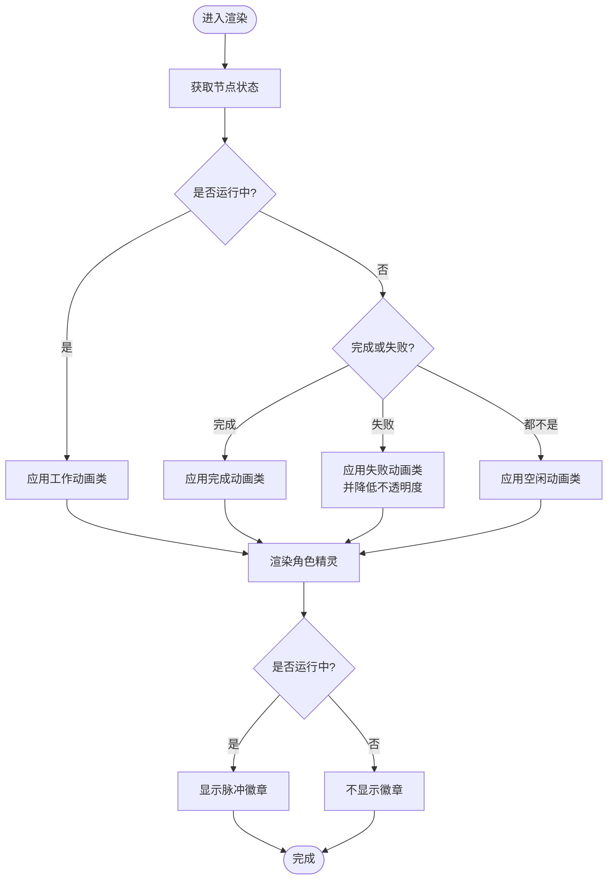
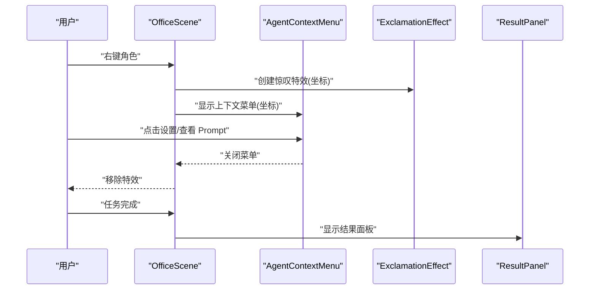
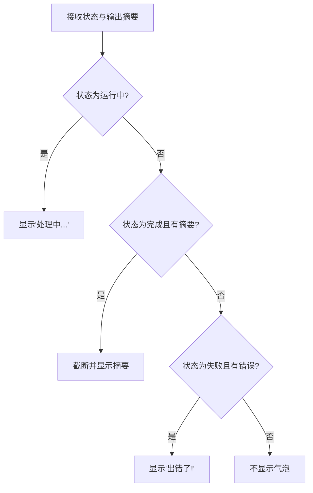
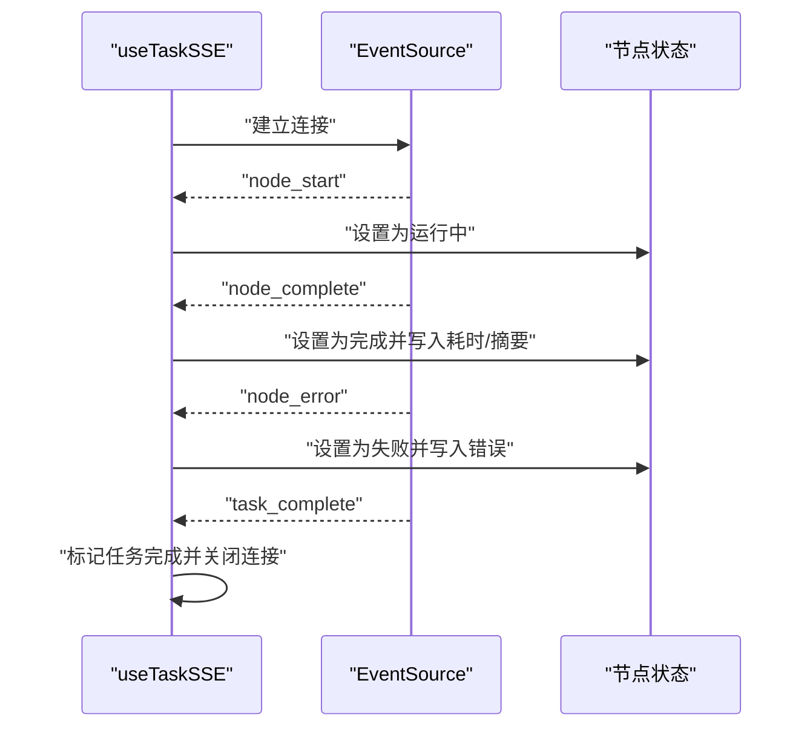
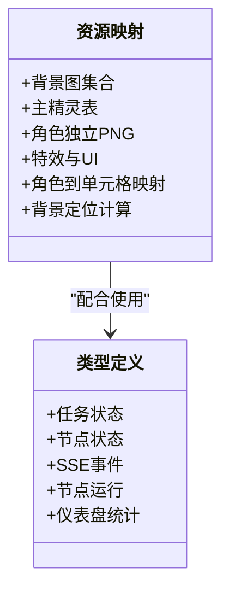
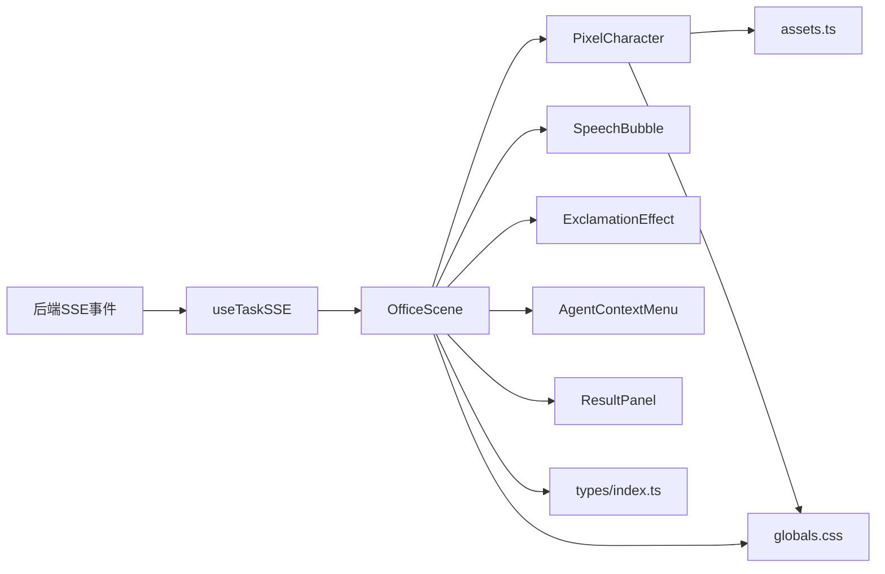

# 像素角色动画系统

<cite>
**本文引用的文件**
- [PixelCharacter.tsx](file://frontend/components/office/PixelCharacter.tsx)
- [OfficeScene.tsx](file://frontend/components/office/OfficeScene.tsx)
- [SpeechBubble.tsx](file://frontend/components/office/SpeechBubble.tsx)
- [ExclamationEffect.tsx](file://frontend/components/office/ExclamationEffect.tsx)
- [AgentContextMenu.tsx](file://frontend/components/office/AgentContextMenu.tsx)
- [assets.ts](file://frontend/lib/assets.ts)
- [index.ts](file://frontend/types/index.ts)
- [useTaskSSE.ts](file://frontend/hooks/useTaskSSE.ts)
- [ResultPanel.tsx](file://frontend/components/office/ResultPanel.tsx)
- [TaskInput.tsx](file://frontend/components/office/TaskInput.tsx)
- [globals.css](file://frontend/app/globals.css)
</cite>

## 目录
1. [简介](#简介)
2. [项目结构](#项目结构)
3. [核心组件](#核心组件)
4. [架构总览](#架构总览)
5. [详细组件分析](#详细组件分析)
6. [依赖关系分析](#依赖关系分析)
7. [性能考虑](#性能考虑)
8. [故障排查指南](#故障排查指南)
9. [结论](#结论)
10. [附录](#附录)

## 简介
本文件系统化梳理“像素角色动画系统”的实现，覆盖以下方面：
- 像素角色绘制与动画：基于独立透明 PNG 的精灵图渲染、CSS 动画驱动的角色状态表现、状态指示器与任务气泡。
- 角色交互：点击检测、右键上下文菜单、悬停高亮与选择反馈。
- 表情与状态指示：工作中的脉冲提示、完成/失败的徽章与颜色编码。
- 资源管理：集中式资产路径与精灵表布局映射。
- 实时状态流：基于 SSE 的节点状态更新与任务完成事件。
- 性能与内存：动画与渲染优化建议与最佳实践。

## 项目结构
前端采用按功能分层的组织方式，像素角色系统主要由场景容器、角色组件、交互组件、资源与类型定义、以及实时状态钩子构成。

**图表来源**
- [OfficeScene.tsx:1-428](file://frontend/components/office/OfficeScene.tsx#L1-L428)
- [PixelCharacter.tsx:1-83](file://frontend/components/office/PixelCharacter.tsx#L1-L83)
- [SpeechBubble.tsx:1-50](file://frontend/components/office/SpeechBubble.tsx#L1-L50)
- [ExclamationEffect.tsx:1-45](file://frontend/components/office/ExclamationEffect.tsx#L1-L45)
- [AgentContextMenu.tsx:1-84](file://frontend/components/office/AgentContextMenu.tsx#L1-L84)
- [assets.ts:1-125](file://frontend/lib/assets.ts#L1-L125)
- [index.ts:1-119](file://frontend/types/index.ts#L1-L119)
- [useTaskSSE.ts:1-124](file://frontend/hooks/useTaskSSE.ts#L1-L124)
- [globals.css:1-119](file://frontend/app/globals.css#L1-L119)

**章节来源**
- [OfficeScene.tsx:1-428](file://frontend/components/office/OfficeScene.tsx#L1-L428)
- [assets.ts:1-125](file://frontend/lib/assets.ts#L1-L125)
- [index.ts:1-119](file://frontend/types/index.ts#L1-L119)
- [useTaskSSE.ts:1-124](file://frontend/hooks/useTaskSSE.ts#L1-L124)
- [globals.css:1-119](file://frontend/app/globals.css#L1-L119)

## 核心组件
- 像素角色渲染器（PixelCharacter）：根据后端节点状态选择不同动画与状态图标，支持独立透明 PNG 精灵与状态徽章叠加。
- 场景容器（OfficeScene）：承载角色布局、交互状态、底部面板、结果面板与遮罩层；协调节点状态与 UI 反馈。
- 任务气泡（SpeechBubble）：在角色上方显示状态相关的简短文本提示。
- 惊叹特效（ExclamationEffect）：在右键触发位置播放一次性淡出动画。
- 上下文菜单（AgentContextMenu）：右键弹出设置与查看 Prompt 的操作入口。
- 资源与类型（assets.ts、types/index.ts）：统一管理精灵表、背景图、状态图标与类型定义。
- 实时状态（useTaskSSE.ts）：订阅任务节点事件，驱动角色状态与面板更新。
- 结果面板（ResultPanel）：任务完成后右侧滑入展示产出数据。
- 任务输入（TaskInput）：底部输入框派发新任务。

**章节来源**
- [PixelCharacter.tsx:1-83](file://frontend/components/office/PixelCharacter.tsx#L1-L83)
- [OfficeScene.tsx:1-428](file://frontend/components/office/OfficeScene.tsx#L1-L428)
- [SpeechBubble.tsx:1-50](file://frontend/components/office/SpeechBubble.tsx#L1-L50)
- [ExclamationEffect.tsx:1-45](file://frontend/components/office/ExclamationEffect.tsx#L1-L45)
- [AgentContextMenu.tsx:1-84](file://frontend/components/office/AgentContextMenu.tsx#L1-L84)
- [assets.ts:1-125](file://frontend/lib/assets.ts#L1-L125)
- [index.ts:1-119](file://frontend/types/index.ts#L1-L119)
- [useTaskSSE.ts:1-124](file://frontend/hooks/useTaskSSE.ts#L1-L124)
- [ResultPanel.tsx:1-146](file://frontend/components/office/ResultPanel.tsx#L1-L146)
- [TaskInput.tsx:1-55](file://frontend/components/office/TaskInput.tsx#L1-L55)

## 架构总览
系统以 OfficeScene 为中心，聚合角色、交互与状态面板；通过 useTaskSSE 订阅后端事件，驱动各节点状态变化；PixelCharacter 依据状态应用 CSS 动画与徽章；assets.ts 提供统一的资源映射；globals.css 定义像素风格动画与网格辅助。

**图表来源**
- [OfficeScene.tsx:80-93](file://frontend/components/office/OfficeScene.tsx#L80-L93)
- [useTaskSSE.ts:58-120](file://frontend/hooks/useTaskSSE.ts#L58-L120)
- [PixelCharacter.tsx:27-32](file://frontend/components/office/PixelCharacter.tsx#L27-L32)
- [SpeechBubble.tsx:12-30](file://frontend/components/office/SpeechBubble.tsx#L12-L30)

## 详细组件分析

### 像素角色渲染与动画（PixelCharacter）
- 绘制算法要点
  - 使用独立透明 PNG 作为角色精灵，通过 CSS 属性控制像素化渲染。
  - 根据节点状态选择不同的动画类名，实现“空闲”“工作中”“完成”“失败”等状态的视觉反馈。
  - 在“工作中”状态下叠加微小文字脉冲提示，增强可读性与反馈感。
- 状态机映射
  - pending → 空闲动画
  - running → 工作动画（轻微抖动与旋转）
  - completed → 完成缩放动画
  - failed → 失败动画并降低不透明度
- 颜色管理
  - 通过 Tailwind 类名对状态文本与边框进行颜色编码，保持一致性。
- 资源管理
  - 通过 AGENT_SPRITE_URL 将后端 agent_id 映射到对应角色 PNG。

**图表来源**
- [PixelCharacter.tsx:27-63](file://frontend/components/office/PixelCharacter.tsx#L27-L63)
- [assets.ts:68-75](file://frontend/lib/assets.ts#L68-L75)

**章节来源**
- [PixelCharacter.tsx:1-83](file://frontend/components/office/PixelCharacter.tsx#L1-L83)
- [assets.ts:68-75](file://frontend/lib/assets.ts#L68-L75)

### 场景容器与交互（OfficeScene）
- 布局与定位
  - 通过预设的 agent_id、名称、角色与绝对定位坐标，将角色放置于场景背景之上。
  - 使用 transform: translate(-50%, -50%) 进行精确居中。
- 交互状态
  - 右键菜单：记录坐标并显示 AgentContextMenu。
  - 惊叹特效：在右键位置生成一次性动画，自动清理。
  - 底部面板：日志、状态、访客三栏，状态面板以小图标与状态文本呈现。
- 任务状态徽章
  - 根据是否存在 taskId 与运行状态显示“工作中”“全部完成”“出错”等徽章。
- 结果面板
  - 任务完成后右侧滑入，展示账号画像、选题、标题、正文草稿与审核结果。

**图表来源**
- [OfficeScene.tsx:80-93](file://frontend/components/office/OfficeScene.tsx#L80-L93)
- [AgentContextMenu.tsx:19-82](file://frontend/components/office/AgentContextMenu.tsx#L19-L82)
- [ExclamationEffect.tsx:15-44](file://frontend/components/office/ExclamationEffect.tsx#L15-L44)
- [ResultPanel.tsx:11-146](file://frontend/components/office/ResultPanel.tsx#L11-L146)

**章节来源**
- [OfficeScene.tsx:1-428](file://frontend/components/office/OfficeScene.tsx#L1-L428)
- [AgentContextMenu.tsx:1-84](file://frontend/components/office/AgentContextMenu.tsx#L1-L84)
- [ExclamationEffect.tsx:1-45](file://frontend/components/office/ExclamationEffect.tsx#L1-L45)
- [ResultPanel.tsx:1-146](file://frontend/components/office/ResultPanel.tsx#L1-L146)

### 任务气泡与状态指示（SpeechBubble）
- 文本与颜色
  - 根据节点状态返回不同文案（处理中/摘要/出错），并匹配相应颜色与边框。
- 动画
  - 使用浮升动画提升可读性与反馈感。
- 与角色联动
  - OfficeScene 在角色上方条件渲染气泡，避免空闲状态显示。

**图表来源**
- [SpeechBubble.tsx:12-30](file://frontend/components/office/SpeechBubble.tsx#L12-L30)
- [OfficeScene.tsx:95-108](file://frontend/components/office/OfficeScene.tsx#L95-L108)

**章节来源**
- [SpeechBubble.tsx:1-50](file://frontend/components/office/SpeechBubble.tsx#L1-L50)
- [OfficeScene.tsx:95-108](file://frontend/components/office/OfficeScene.tsx#L95-L108)

### 实时状态流（useTaskSSE）
- 事件监听
  - 订阅 node_start、node_complete、node_error、task_complete、task_error 事件。
- 状态更新
  - 将事件数据映射到节点状态数组，驱动角色与面板更新。
- 生命周期
  - 任务重置时重建初始节点状态；连接异常时安全关闭。

**图表来源**
- [useTaskSSE.ts:58-120](file://frontend/hooks/useTaskSSE.ts#L58-L120)

**章节来源**
- [useTaskSSE.ts:1-124](file://frontend/hooks/useTaskSSE.ts#L1-L124)

### 资源与类型系统（assets.ts、types/index.ts）
- 资源映射
  - 统一管理背景图、主精灵表、角色独立 PNG、特效与 UI 图标。
  - 提供角色 ID 到精灵单元格的映射与背景定位计算函数。
- 类型定义
  - 定义任务与节点状态、SSE 事件、节点运行信息与仪表盘统计等类型，确保前后端一致。

**图表来源**
- [assets.ts:18-125](file://frontend/lib/assets.ts#L18-L125)
- [index.ts:1-119](file://frontend/types/index.ts#L1-L119)

**章节来源**
- [assets.ts:1-125](file://frontend/lib/assets.ts#L1-L125)
- [index.ts:1-119](file://frontend/types/index.ts#L1-L119)

### 样式与像素网格（globals.css）
- 动画基元
  - 定义像素风格动画：空闲、工作、完成、浮动气泡、惊叹淡出等。
- 像素网格辅助
  - 提供像素网格与像素单元格类，便于调试与对齐。
- 全局像素化渲染
  - 对 body 与所有元素启用像素化图像渲染，保证一致的像素艺术观感。

**章节来源**
- [globals.css:1-119](file://frontend/app/globals.css#L1-L119)

## 依赖关系分析
- 组件耦合
  - OfficeScene 作为协调者，依赖 PixelCharacter、SpeechBubble、ExclamationEffect、AgentContextMenu、ResultPanel、TaskInput。
  - PixelCharacter 依赖 assets.ts 中的角色精灵映射。
  - OfficeScene 依赖 useTaskSSE 提供的节点状态与任务完成标志。
- 数据流
  - 后端通过 SSE 推送节点事件，useTaskSSE 更新状态，OfficeScene 与 PixelCharacter 响应渲染。
- 外部依赖
  - Next/Image 用于像素化渲染的图片组件。
  - Tailwind CSS 提供原子化样式与动画类名。

**图表来源**
- [useTaskSSE.ts:58-120](file://frontend/hooks/useTaskSSE.ts#L58-L120)
- [OfficeScene.tsx:1-428](file://frontend/components/office/OfficeScene.tsx#L1-L428)
- [PixelCharacter.tsx:1-83](file://frontend/components/office/PixelCharacter.tsx#L1-L83)
- [assets.ts:1-125](file://frontend/lib/assets.ts#L1-L125)
- [index.ts:1-119](file://frontend/types/index.ts#L1-L119)
- [globals.css:1-119](file://frontend/app/globals.css#L1-L119)

**章节来源**
- [useTaskSSE.ts:1-124](file://frontend/hooks/useTaskSSE.ts#L1-L124)
- [OfficeScene.tsx:1-428](file://frontend/components/office/OfficeScene.tsx#L1-L428)
- [PixelCharacter.tsx:1-83](file://frontend/components/office/PixelCharacter.tsx#L1-L83)
- [assets.ts:1-125](file://frontend/lib/assets.ts#L1-L125)
- [index.ts:1-119](file://frontend/types/index.ts#L1-L119)
- [globals.css:1-119](file://frontend/app/globals.css#L1-L119)

## 性能考虑
- 动画与渲染
  - 使用 CSS 动画而非 JavaScript 帧动画，减少主线程压力。
  - 对图片启用像素化渲染，避免模糊。
- 事件与状态
  - 仅在需要时渲染气泡与特效，避免不必要的 DOM 更新。
  - 使用事件源连接池复用与及时关闭，防止内存泄漏。
- 资源加载
  - 将角色与 UI 图片拆分为独立 PNG，便于缓存与按需加载。
  - 使用精灵表统一管理，减少 HTTP 请求次数。
- 内存管理
  - 在特效与菜单组件中使用局部状态并在完成后清理。
  - 在任务完成后关闭 SSE 连接，释放资源。

[本节为通用指导，无需具体文件分析]

## 故障排查指南
- 角色无动画
  - 检查节点状态是否正确传递至 PixelCharacter。
  - 确认 CSS 动画类名与状态映射一致。
- 气泡不显示
  - 确认 OfficeScene 的气泡文本生成逻辑与节点状态匹配。
- 右键菜单不消失
  - 检查 AgentContextMenu 的点击外部关闭逻辑是否绑定与解绑。
- SSE 不更新
  - 检查任务 ID 是否为空，事件监听是否成功注册，连接是否被意外关闭。
- 图片模糊
  - 确保图片组件启用了像素化渲染属性。

**章节来源**
- [PixelCharacter.tsx:27-63](file://frontend/components/office/PixelCharacter.tsx#L27-L63)
- [SpeechBubble.tsx:12-30](file://frontend/components/office/SpeechBubble.tsx#L12-L30)
- [AgentContextMenu.tsx:28-38](file://frontend/components/office/AgentContextMenu.tsx#L28-L38)
- [useTaskSSE.ts:58-120](file://frontend/hooks/useTaskSSE.ts#L58-L120)
- [globals.css:16-17](file://frontend/app/globals.css#L16-L17)

## 结论
该像素角色动画系统以 OfficeScene 为核心，结合 useTaskSSE 的实时事件流与 PixelCharacter 的状态动画，实现了从角色绘制、交互反馈到结果展示的完整闭环。通过 assets.ts 的集中资源管理与 globals.css 的像素风格基元，系统在保持一致视觉风格的同时具备良好的可维护性与扩展性。

[本节为总结，无需具体文件分析]

## 附录

### 像素艺术制作规范与资源导入流程
- 制作规范
  - 使用固定像素尺寸（如 64x80）构建角色帧，确保动画连贯。
  - 采用单通道透明背景，便于多场景合成。
  - 使用有限色彩集，保持风格统一。
- 导入流程
  - 将角色 PNG 放置于公共资源目录，更新 assets.ts 中的映射。
  - 如需精灵表，确保行列索引与背景定位计算一致。
  - 在 OfficeScene 中配置角色坐标与名称，验证渲染与交互。

[本节为通用指导，无需具体文件分析]

### 动画系统扩展指南
- 新增角色
  - 在 assets.ts 中添加独立 PNG 与精灵表映射。
  - 在 OfficeScene 的 AGENT_CONFIG 中新增角色配置。
- 新增状态
  - 在 assets.ts 中扩展状态图标与动画类名。
  - 在 PixelCharacter 中扩展状态映射与徽章逻辑。
- 新增交互
  - 扩展 OfficeScene 的交互状态与事件处理。
  - 添加新的特效或面板组件并接入生命周期管理。

[本节为通用指导，无需具体文件分析]