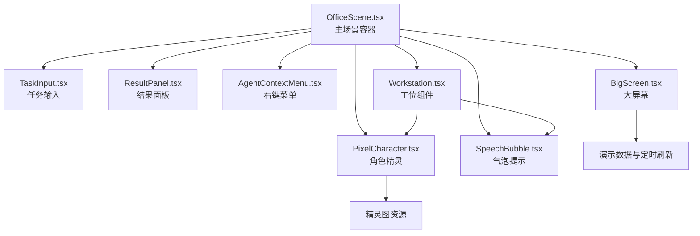
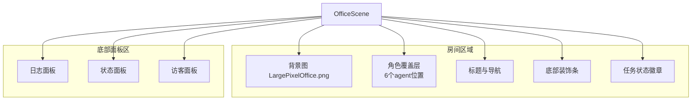
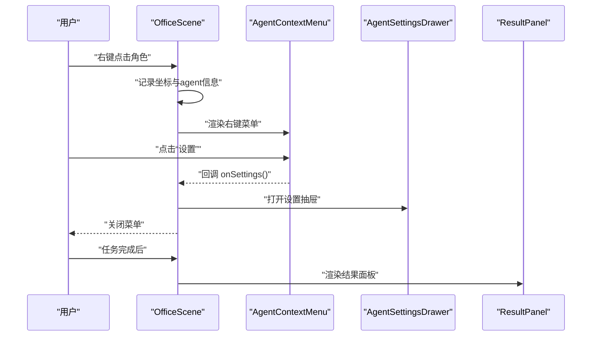
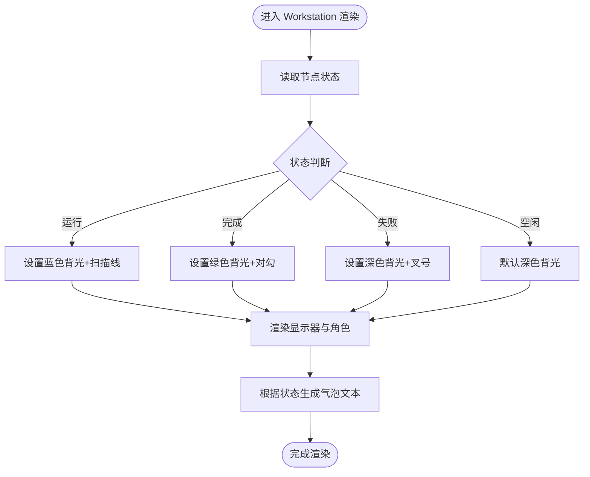
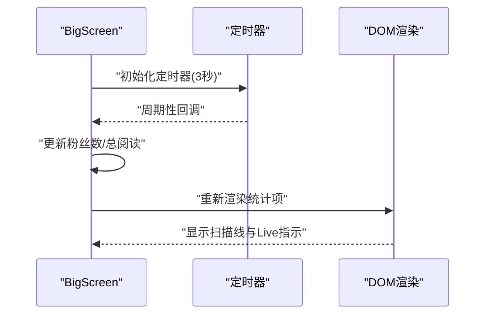
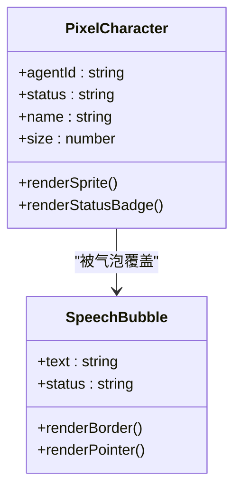
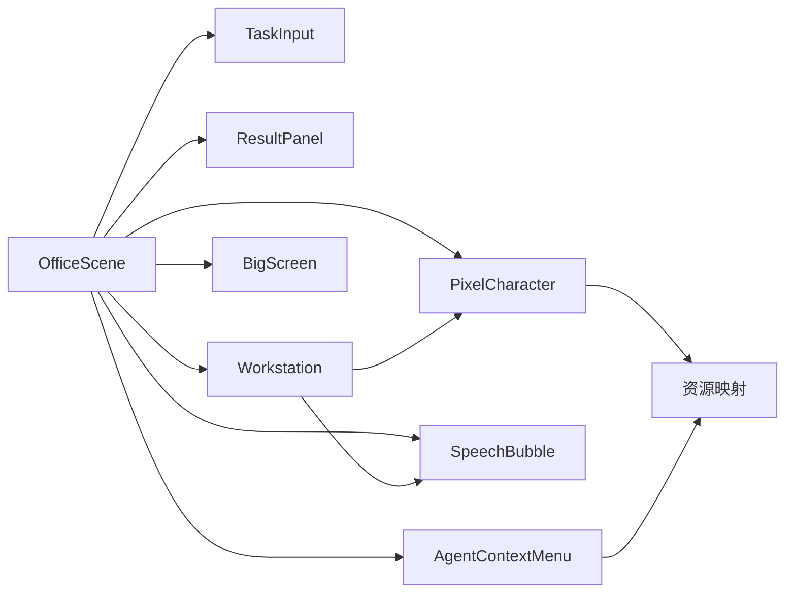

# 办公室场景设计

<cite>
**本文引用的文件**
- [OfficeScene.tsx](file://frontend/components/office/OfficeScene.tsx)
- [Workstation.tsx](file://frontend/components/office/Workstation.tsx)
- [BigScreen.tsx](file://frontend/components/office/BigScreen.tsx)
- [PixelCharacter.tsx](file://frontend/components/office/PixelCharacter.tsx)
- [SpeechBubble.tsx](file://frontend/components/office/SpeechBubble.tsx)
- [TaskInput.tsx](file://frontend/components/office/TaskInput.tsx)
- [ResultPanel.tsx](file://frontend/components/office/ResultPanel.tsx)
- [AgentContextMenu.tsx](file://frontend/components/office/AgentContextMenu.tsx)
</cite>

## 目录
1. [引言](#引言)
2. [项目结构](#项目结构)
3. [核心组件](#核心组件)
4. [架构总览](#架构总览)
5. [详细组件分析](#详细组件分析)
6. [依赖关系分析](#依赖关系分析)
7. [性能考虑](#性能考虑)
8. [故障排查指南](#故障排查指南)
9. [结论](#结论)
10. [附录](#附录)

## 引言
本文件围绕“办公室场景设计”展开，聚焦于 OfficeScene 场景组件的布局设计原理（网格系统、空间分区、视觉层次）、工作站组件的实现（工位布局、设备渲染、环境氛围）、大屏幕组件的信息展示与动态效果、场景缩放与视口管理机制、场景配置管理（布局自定义、主题切换、响应式设计），并提供性能优化与渲染批处理策略。文档同时兼顾初学者对 2D 场景设计的基础理解与高级开发者对场景系统架构与扩展方案的指导。

## 项目结构
本项目采用前端组件化组织方式，办公室场景相关的核心组件位于 frontend/components/office 目录下。OfficeScene 作为主场景容器，负责房间背景、角色叠加、底部面板区、悬浮层等；Workstation 提供单个工位的可视化与状态反馈；BigScreen 展示墙面上的大屏数据；PixelCharacter 负责角色精灵渲染与动画；SpeechBubble 实现气泡提示；TaskInput 用于输入任务指令；ResultPanel 在任务完成后以抽屉形式呈现结果；AgentContextMenu 提供右键菜单交互。

图表来源
- [OfficeScene.tsx](file://frontend/components/office/OfficeScene.tsx)
- [Workstation.tsx](file://frontend/components/office/Workstation.tsx)
- [BigScreen.tsx](file://frontend/components/office/BigScreen.tsx)
- [PixelCharacter.tsx](file://frontend/components/office/PixelCharacter.tsx)
- [SpeechBubble.tsx](file://frontend/components/office/SpeechBubble.tsx)
- [TaskInput.tsx](file://frontend/components/office/TaskInput.tsx)
- [ResultPanel.tsx](file://frontend/components/office/ResultPanel.tsx)
- [AgentContextMenu.tsx](file://frontend/components/office/AgentContextMenu.tsx)

章节来源
- [OfficeScene.tsx](file://frontend/components/office/OfficeScene.tsx)
- [Workstation.tsx](file://frontend/components/office/Workstation.tsx)
- [BigScreen.tsx](file://frontend/components/office/BigScreen.tsx)
- [PixelCharacter.tsx](file://frontend/components/office/PixelCharacter.tsx)
- [SpeechBubble.tsx](file://frontend/components/office/SpeechBubble.tsx)
- [TaskInput.tsx](file://frontend/components/office/TaskInput.tsx)
- [ResultPanel.tsx](file://frontend/components/office/ResultPanel.tsx)
- [AgentContextMenu.tsx](file://frontend/components/office/AgentContextMenu.tsx)

## 核心组件
- OfficeScene 主场景容器：负责房间背景图、角色覆盖层、标题导航、底部三栏面板（日志、状态、访客）、任务状态徽章、右键菜单、设置抽屉、结果面板、气泡特效等。
- Workstation 工位组件：桌面+显示器+角色的组合，根据节点状态显示不同颜色的显示器背光、扫描线、完成/失败标记，并在上方显示气泡提示。
- BigScreen 大屏幕组件：墙面显示器样式，展示账号统计类演示数据，带扫描线与实时闪烁指示，定时更新数值。
- PixelCharacter 角色精灵：按 agentId 映射到对应透明 PNG 精灵，支持不同状态下的动画与状态标识文字。
- SpeechBubble 气泡提示：根据节点状态选择边框与文本颜色，三角形指针指向角色。
- TaskInput 任务输入：底部日志面板中的紧凑输入表单，限制最小长度并禁用条件控制。
- ResultPanel 结果面板：右侧滑入式抽屉，分段展示账号画像、候选选题、候选标题、正文草稿与审核结果。
- AgentContextMenu 右键菜单：弹出式菜单，支持打开设置与查看 Prompt。

章节来源
- [OfficeScene.tsx](file://frontend/components/office/OfficeScene.tsx)
- [Workstation.tsx](file://frontend/components/office/Workstation.tsx)
- [BigScreen.tsx](file://frontend/components/office/BigScreen.tsx)
- [PixelCharacter.tsx](file://frontend/components/office/PixelCharacter.tsx)
- [SpeechBubble.tsx](file://frontend/components/office/SpeechBubble.tsx)
- [TaskInput.tsx](file://frontend/components/office/TaskInput.tsx)
- [ResultPanel.tsx](file://frontend/components/office/ResultPanel.tsx)
- [AgentContextMenu.tsx](file://frontend/components/office/AgentContextMenu.tsx)

## 架构总览
OfficeScene 将场景划分为“房间区域 + 底部面板区”，房间区域使用背景图承载空间氛围，角色以绝对定位叠加，形成“网格化”的空间分区（入口→沙发→书架→工位→服务器区）。底部面板区采用三栏布局，分别承载日志、状态与访客信息，配合任务输入与结果面板，构成完整的编辑部工作流。

图表来源
- [OfficeScene.tsx](file://frontend/components/office/OfficeScene.tsx)

章节来源
- [OfficeScene.tsx](file://frontend/components/office/OfficeScene.tsx)

## 详细组件分析

### OfficeScene 场景布局与交互
- 空间分区与网格系统
  - 房间背景图覆盖全屏，角色通过百分比 left/top 与 translate(-50%, -50%) 实现精确对齐，形成“网格化”的空间分区（入口→沙发→书架→工位→服务器）。
  - 底部面板区固定高度 220px，三栏等宽分布，日志与访客支持滚动，状态面板采用网格布局展示各角色状态。
- 视觉层次
  - 标题导航与房间装饰条强化层级边界；角色名称标签与气泡提示提升可读性；任务状态徽章在底部居中浮动，突出当前工作态。
- 交互机制
  - 右键菜单：记录坐标与 agent 信息，弹出菜单并支持打开设置或查看 Prompt。
  - 设置抽屉：根据 agentId 打开对应设置界面。
  - 结果面板：任务完成后以抽屉形式滑入，支持折叠与展开。
  - 气泡特效：右键触发感叹号飞入效果，完成后自动清理。
- 数据驱动
  - 通过 nodes 数组映射每个 agent 的状态、耗时、输出摘要与错误信息，驱动气泡文本与状态徽章显示。

图表来源
- [OfficeScene.tsx](file://frontend/components/office/OfficeScene.tsx)
- [AgentContextMenu.tsx](file://frontend/components/office/AgentContextMenu.tsx)

章节来源
- [OfficeScene.tsx](file://frontend/components/office/OfficeScene.tsx)
- [AgentContextMenu.tsx](file://frontend/components/office/AgentContextMenu.tsx)

### 工作站组件实现（Workstation）
- 工位布局
  - 桌面由深棕色桌面板与两条桌腿组成，显示器位于桌面中央，带边框与圆角，显示器背光随状态变化（运行蓝色、完成绿色、空闲深色）。
  - 角色位于显示器上方，鼠标悬停时名称高亮。
- 设备渲染与状态反馈
  - 运行中：显示器显示蓝色 ping 点与扫描线纹理；完成：显示对勾；失败：显示叉号。
  - 气泡提示根据状态选择边框与文本颜色，避免遮挡角色。
- 环境氛围
  - 使用阴影与渐变纹理模拟显示器发光与扫描线，增强像素风格的科技感。

图表来源
- [Workstation.tsx](file://frontend/components/office/Workstation.tsx)

章节来源
- [Workstation.tsx](file://frontend/components/office/Workstation.tsx)

### 大屏幕组件（BigScreen）
- 信息展示
  - 展示账号名称、粉丝数、总阅读、篇均阅读、文章数等指标，数值格式化为“万”或本地化数字。
- 动态效果
  - 扫描线覆盖层：重复线性渐变模拟 CRT 屏幕扫描线。
  - 实时闪烁：底部 Live 指示灯持续脉冲。
  - 定时刷新：每 3 秒随机小幅增量，模拟活跃数据。
- 用户交互
  - 组件内无交互，作为静态信息展示元素，但可通过外部状态驱动数据更新。

图表来源
- [BigScreen.tsx](file://frontend/components/office/BigScreen.tsx)

章节来源
- [BigScreen.tsx](file://frontend/components/office/BigScreen.tsx)

### 角色精灵与气泡提示（PixelCharacter、SpeechBubble）
- 角色精灵
  - 通过 agentId 映射到对应精灵图，使用 CSS 动画类实现“工作/完成/空闲”不同节奏的像素动画。
  - 状态标识文字：运行中显示“工作中”，完成显示“✓”，失败显示“✗”，空闲显示“…”。
- 气泡提示
  - 边框与文本颜色随状态变化；三角形指针指向角色；无限浮动动画增强动感。

图表来源
- [PixelCharacter.tsx](file://frontend/components/office/PixelCharacter.tsx)
- [SpeechBubble.tsx](file://frontend/components/office/SpeechBubble.tsx)

章节来源
- [PixelCharacter.tsx](file://frontend/components/office/PixelCharacter.tsx)
- [SpeechBubble.tsx](file://frontend/components/office/SpeechBubble.tsx)

### 任务输入与结果面板（TaskInput、ResultPanel）
- 任务输入
  - 表单包含占位提示与最小长度校验；禁用条件受 loading 与运行中状态影响；提交后回调父组件创建任务。
- 结果面板
  - 抽屉从右侧滑入，支持折叠与展开；内容分段展示账号画像、候选选题、候选标题、正文草稿与审核结果；支持垂直滚动与只读预览。

章节来源
- [TaskInput.tsx](file://frontend/components/office/TaskInput.tsx)
- [ResultPanel.tsx](file://frontend/components/office/ResultPanel.tsx)

## 依赖关系分析
- OfficeScene 依赖多个子组件：PixelCharacter、SpeechBubble、TaskInput、ResultPanel、AgentContextMenu、AgentSettingsDrawer（通过状态控制打开）。
- Workstation 内部组合 PixelCharacter 与 SpeechBubble，并复用 OfficeScene 中的状态逻辑。
- BigScreen 依赖演示数据与定时器，不直接依赖 OfficeScene。
- PixelCharacter 依赖资源映射表进行精灵图加载。
- AgentContextMenu 依赖全局资源与事件监听，确保点击外部关闭。

图表来源
- [OfficeScene.tsx](file://frontend/components/office/OfficeScene.tsx)
- [Workstation.tsx](file://frontend/components/office/Workstation.tsx)
- [BigScreen.tsx](file://frontend/components/office/BigScreen.tsx)
- [PixelCharacter.tsx](file://frontend/components/office/PixelCharacter.tsx)
- [SpeechBubble.tsx](file://frontend/components/office/SpeechBubble.tsx)
- [TaskInput.tsx](file://frontend/components/office/TaskInput.tsx)
- [ResultPanel.tsx](file://frontend/components/office/ResultPanel.tsx)
- [AgentContextMenu.tsx](file://frontend/components/office/AgentContextMenu.tsx)

章节来源
- [OfficeScene.tsx](file://frontend/components/office/OfficeScene.tsx)
- [Workstation.tsx](file://frontend/components/office/Workstation.tsx)
- [BigScreen.tsx](file://frontend/components/office/BigScreen.tsx)
- [PixelCharacter.tsx](file://frontend/components/office/PixelCharacter.tsx)
- [SpeechBubble.tsx](file://frontend/components/office/SpeechBubble.tsx)
- [TaskInput.tsx](file://frontend/components/office/TaskInput.tsx)
- [ResultPanel.tsx](file://frontend/components/office/ResultPanel.tsx)
- [AgentContextMenu.tsx](file://frontend/components/office/AgentContextMenu.tsx)

## 性能考虑
- 渲染批处理与重绘控制
  - OfficeScene 使用绝对定位与 transform 平移减少回流；角色与面板使用固定尺寸与最小化 DOM 层级，降低重绘范围。
  - BigScreen 使用一次性定时器更新数据，避免频繁 setState 导致的多次渲染。
- 图像与动画优化
  - PixelCharacter 使用像素风格图像渲染，避免模糊；CSS 动画优先于 JavaScript 动画，减少主线程压力。
  - Workstation 的扫描线纹理使用 repeating-linear-gradient，避免额外图片资源。
- 交互与事件
  - 右键菜单与设置抽屉仅在需要时渲染，避免常驻 DOM。
  - OfficeScene 对气泡特效与任务状态徽章进行列表清理与条件渲染，防止内存泄漏与无效更新。
- 响应式与缩放
  - 百分比定位与相对单位保证在不同分辨率下保持比例一致；大屏统计项采用网格布局，自动换行适配宽度。

[本节为通用性能建议，无需特定文件引用]

## 故障排查指南
- 角色不显示或显示异常
  - 检查资源映射表是否包含对应 agentId；确认精灵图路径与 imageRendering 设置。
- 气泡提示不出现
  - 确认节点状态与气泡文本生成逻辑；检查 OfficeScene 中 getBubbleText 的分支与节点数据。
- 右键菜单无法关闭
  - 检查 AgentContextMenu 的外部点击事件绑定与 ref 使用；确保在组件卸载时移除事件监听。
- 结果面板无法展开
  - 检查 ResultPanel 的 open 状态切换逻辑与按钮事件绑定。
- 大屏数据不更新
  - 检查定时器是否正确初始化与清理；确认数据更新函数未被外部状态覆盖。

章节来源
- [PixelCharacter.tsx](file://frontend/components/office/PixelCharacter.tsx)
- [SpeechBubble.tsx](file://frontend/components/office/SpeechBubble.tsx)
- [AgentContextMenu.tsx](file://frontend/components/office/AgentContextMenu.tsx)
- [ResultPanel.tsx](file://frontend/components/office/ResultPanel.tsx)
- [BigScreen.tsx](file://frontend/components/office/BigScreen.tsx)

## 结论
OfficeScene 通过背景图与绝对定位实现了清晰的空间分区与视觉层次，结合角色精灵、气泡提示与底部面板，构建了完整的编辑部工作流。Workstation 将角色与显示器有机结合，提供直观的状态反馈；BigScreen 以扫描线与实时闪烁营造科技氛围。整体架构模块化、数据驱动，便于扩展与维护。建议在后续迭代中进一步完善主题切换、响应式断点与性能监控体系。

[本节为总结性内容，无需特定文件引用]

## 附录
- 场景配置管理指南
  - 布局自定义：通过调整 OfficeScene 中的角色百分比定位与面板尺寸，实现不同分辨率适配。
  - 主题切换：统一修改背景色、边框色与字体色，集中于 CSS 变量或主题模块。
  - 响应式设计：利用 Tailwind 的响应式前缀与网格断点，确保面板在移动端可折叠与滚动。
- 扩展开发方案
  - 新增角色：在资源映射表中添加新 agentId 与精灵图；在 OfficeScene 的 AGENT_CONFIG 中新增位置与名称。
  - 新增面板：仿照日志/状态/访客面板结构，新增区域并接入节点状态数据。
  - 动效增强：在现有 CSS 动画基础上，引入 Framer Motion 或 Web Animations API 实现更丰富的过渡。

[本节为概念性内容，无需特定文件引用]