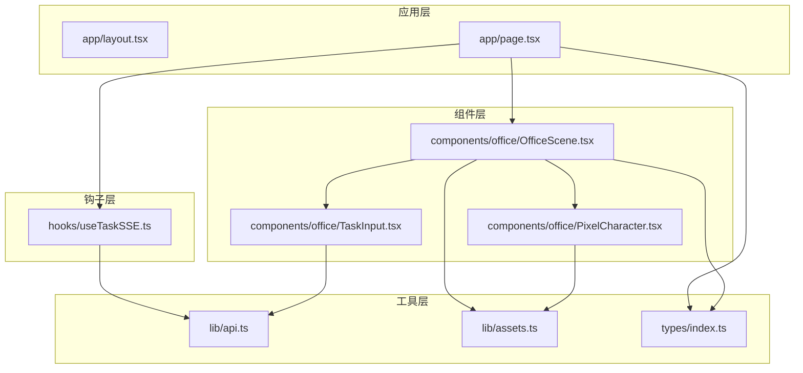
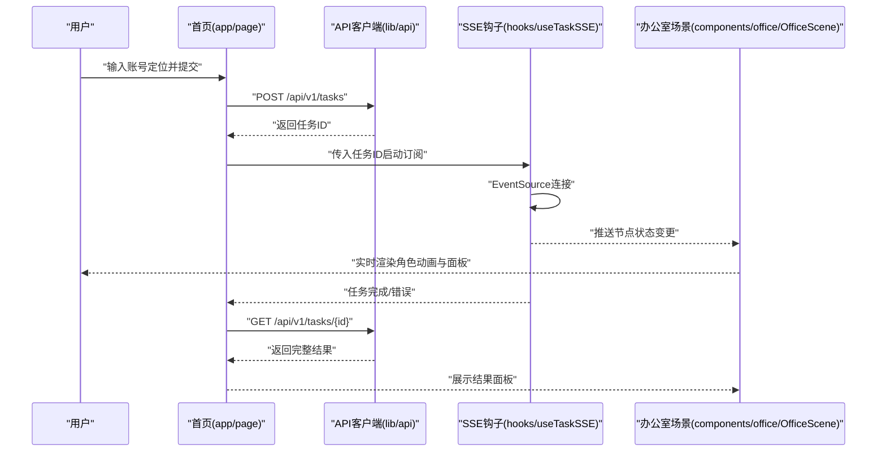
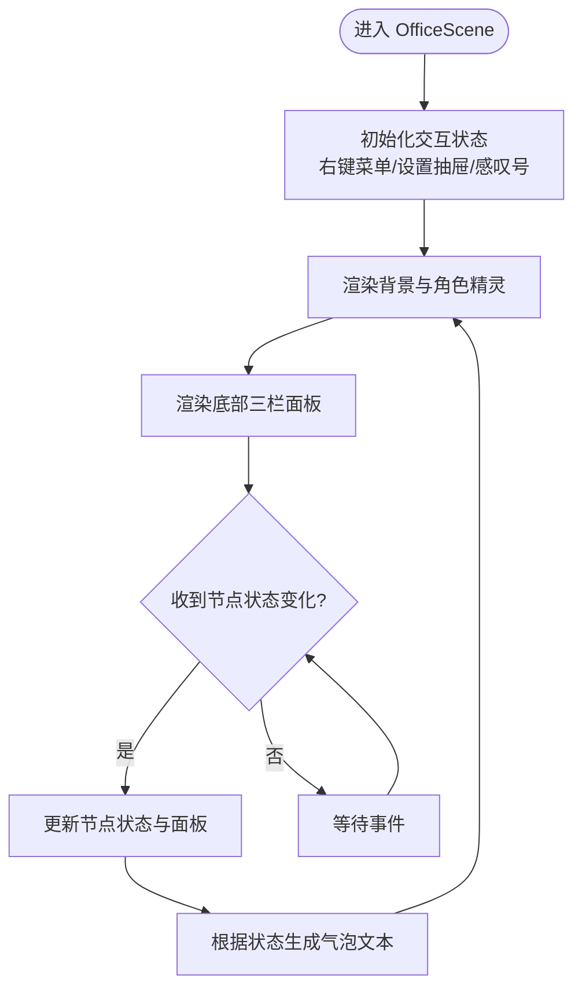
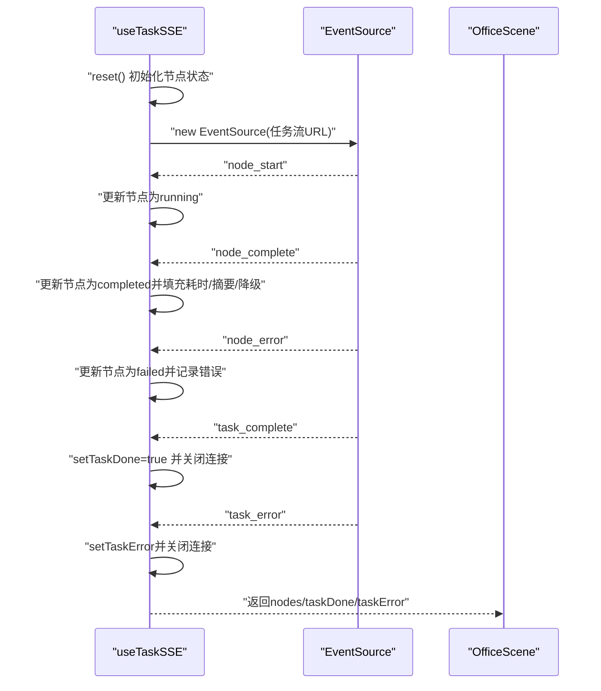
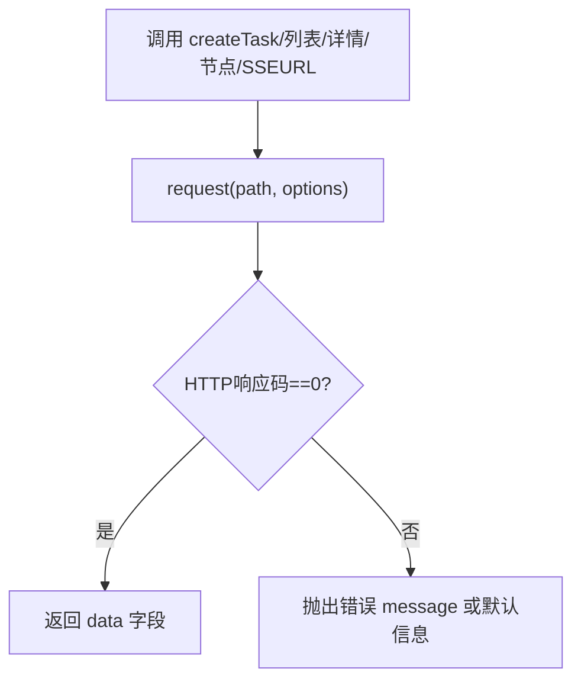
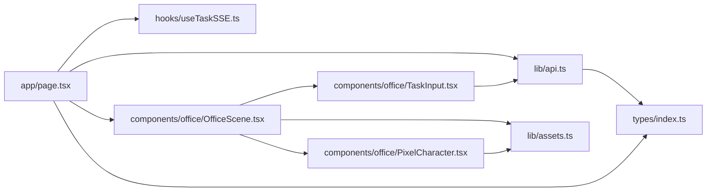

# 前端开发指南

<cite>
**本文引用的文件**
- [package.json](file://frontend/package.json)
- [next.config.ts](file://frontend/next.config.ts)
- [tsconfig.json](file://frontend/tsconfig.json)
- [app/layout.tsx](file://frontend/app/layout.tsx)
- [lib/api.ts](file://frontend/lib/api.ts)
- [types/index.ts](file://frontend/types/index.ts)
- [components/office/OfficeScene.tsx](file://frontend/components/office/OfficeScene.tsx)
- [hooks/useTaskSSE.ts](file://frontend/hooks/useTaskSSE.ts)
- [app/page.tsx](file://frontend/app/page.tsx)
- [components/office/PixelCharacter.tsx](file://frontend/components/office/PixelCharacter.tsx)
- [components/office/TaskInput.tsx](file://frontend/components/office/TaskInput.tsx)
- [lib/assets.ts](file://frontend/lib/assets.ts)
</cite>

## 目录
1. [简介](#简介)
2. [项目结构](#项目结构)
3. [核心组件](#核心组件)
4. [架构总览](#架构总览)
5. [详细组件分析](#详细组件分析)
6. [依赖关系分析](#依赖关系分析)
7. [性能考虑](#性能考虑)
8. [故障排查指南](#故障排查指南)
9. [结论](#结论)
10. [附录](#附录)

## 简介
本指南面向HotClaw前端团队，系统讲解基于Next.js 16、React 19与TypeScript的开发实践，重点覆盖以下主题：
- Next.js应用配置与路由重写
- React组件架构与TypeScript类型系统
- 像素风格办公室Canvas渲染引擎（OfficeScene、PixelCharacter、TaskInput等）
- 实时状态管理（SSE事件流、节点状态订阅）
- API客户端封装、错误处理与结果回拉
- UI组件开发、响应式设计与可访问性最佳实践
- 面向初学者的组件开发基础与面向高级开发者的性能优化建议

## 项目结构
前端采用Next.js App Router目录结构，核心模块如下：
- 应用层：页面入口、根布局与全局样式
- 组件层：像素风格办公室场景与交互组件
- 钩子层：SSE任务事件订阅
- 类型层：共享TS类型定义
- 工具层：API客户端与资源路径管理

**图表来源**
- [app/layout.tsx:1-16](file://frontend/app/layout.tsx#L1-L16)
- [app/page.tsx:1-63](file://frontend/app/page.tsx#L1-L63)
- [components/office/OfficeScene.tsx:1-428](file://frontend/components/office/OfficeScene.tsx#L1-L428)
- [components/office/PixelCharacter.tsx:1-83](file://frontend/components/office/PixelCharacter.tsx#L1-L83)
- [components/office/TaskInput.tsx:1-55](file://frontend/components/office/TaskInput.tsx#L1-L55)
- [hooks/useTaskSSE.ts:1-124](file://frontend/hooks/useTaskSSE.ts#L1-L124)
- [lib/api.ts:1-110](file://frontend/lib/api.ts#L1-L110)
- [lib/assets.ts:1-125](file://frontend/lib/assets.ts#L1-L125)
- [types/index.ts:1-119](file://frontend/types/index.ts#L1-L119)

**章节来源**
- [package.json:1-23](file://frontend/package.json#L1-L23)
- [next.config.ts:1-15](file://frontend/next.config.ts#L1-L15)
- [tsconfig.json:1-42](file://frontend/tsconfig.json#L1-L42)
- [app/layout.tsx:1-16](file://frontend/app/layout.tsx#L1-L16)

## 核心组件
- 页面入口与布局：根布局负责站点元数据与全局样式注入；首页作为像素办公室的主容器，协调任务创建、SSE订阅与结果回拉。
- 办公室场景：承载背景图、角色精灵、日志面板、状态面板、访客面板与浮动提示。
- 角色精灵：按状态渲染不同动画与图标，支持点击右键菜单与抽屉设置。
- 任务输入：约束输入长度、禁用状态与加载态，提交后触发后端任务创建。
- SSE钩子：维护节点状态数组、任务完成/错误状态，并通过EventSource订阅后端流。

**章节来源**
- [app/page.tsx:1-63](file://frontend/app/page.tsx#L1-L63)
- [components/office/OfficeScene.tsx:1-428](file://frontend/components/office/OfficeScene.tsx#L1-L428)
- [components/office/PixelCharacter.tsx:1-83](file://frontend/components/office/PixelCharacter.tsx#L1-L83)
- [components/office/TaskInput.tsx:1-55](file://frontend/components/office/TaskInput.tsx#L1-L55)
- [hooks/useTaskSSE.ts:1-124](file://frontend/hooks/useTaskSSE.ts#L1-L124)

## 架构总览
整体架构围绕“页面驱动的像素办公室”展开：页面负责任务生命周期控制，SSE钩子负责实时状态更新，API客户端负责与后端交互，资产库统一管理像素资源。

**图表来源**
- [app/page.tsx:14-62](file://frontend/app/page.tsx#L14-L62)
- [lib/api.ts:26-50](file://frontend/lib/api.ts#L26-L50)
- [hooks/useTaskSSE.ts:28-123](file://frontend/hooks/useTaskSSE.ts#L28-L123)
- [components/office/OfficeScene.tsx:62-427](file://frontend/components/office/OfficeScene.tsx#L62-L427)

## 详细组件分析

### 页面与布局
- 根布局：设置站点标题、描述与全局样式容器。
- 首页：持有任务ID、加载态与结果数据；在任务完成后回拉完整结果；将节点状态与回调传递给办公室场景。

**章节来源**
- [app/layout.tsx:1-16](file://frontend/app/layout.tsx#L1-L16)
- [app/page.tsx:14-62](file://frontend/app/page.tsx#L14-L62)

### 办公室场景 OfficeScene
- 结构：上半屏为大场景背景，下半屏分为日志、状态、访客三栏。
- 交互：右键角色弹出上下文菜单；点击角色进入设置抽屉；根据节点状态显示气泡与状态徽章。
- 渲染：基于节点状态动态计算气泡文本与颜色；任务进行中显示脉冲动画；任务完成显示完成徽章；出现错误显示错误徽章。

**图表来源**
- [components/office/OfficeScene.tsx:74-182](file://frontend/components/office/OfficeScene.tsx#L74-L182)
- [components/office/OfficeScene.tsx:191-221](file://frontend/components/office/OfficeScene.tsx#L191-L221)
- [components/office/OfficeScene.tsx:224-389](file://frontend/components/office/OfficeScene.tsx#L224-L389)

**章节来源**
- [components/office/OfficeScene.tsx:1-428](file://frontend/components/office/OfficeScene.tsx#L1-L428)

### 角色精灵 PixelCharacter
- 功能：按agent_id选择对应透明PNG精灵；根据状态应用不同CSS动画类；在运行/完成/失败状态下显示状态标识文字。
- 设计：将动画类与状态解耦，便于复用与扩展。

**章节来源**
- [components/office/PixelCharacter.tsx:1-83](file://frontend/components/office/PixelCharacter.tsx#L1-L83)
- [lib/assets.ts:68-75](file://frontend/lib/assets.ts#L68-L75)

### 任务输入 TaskInput
- 功能：表单输入账号定位，限制最小长度；禁用态与加载态控制按钮；提交后调用父级回调。
- 设计：通过props解耦输入与提交逻辑，便于在不同场景复用。

**章节来源**
- [components/office/TaskInput.tsx:1-55](file://frontend/components/office/TaskInput.tsx#L1-L55)

### SSE钩子 useTaskSSE
- 数据模型：节点状态数组，包含节点ID、代理ID、名称、状态、耗时、错误、输出摘要与降级标记；以及任务完成/错误标志。
- 生命周期：接收任务ID后初始化节点状态；建立EventSource连接；监听节点开始、完成、错误与任务完成/错误事件；在错误或完成时关闭连接；提供reset方法重置状态。
- 初始节点顺序：与后端流水线顺序一致，确保UI渲染与业务流程对齐。

**图表来源**
- [hooks/useTaskSSE.ts:28-123](file://frontend/hooks/useTaskSSE.ts#L28-L123)

**章节来源**
- [hooks/useTaskSSE.ts:1-124](file://frontend/hooks/useTaskSSE.ts#L1-L124)

### API客户端封装 lib/api.ts
- 统一请求函数：封装fetch请求，自动校验响应码，抛出错误；支持泛型返回类型。
- 任务相关：创建任务、查询任务详情、查询节点列表、分页查询任务列表、生成SSE流URL。
- 代理与技能：列出代理、查询代理、更新代理配置；列出技能、更新技能配置。
- 错误处理：非零code时抛出错误，调用方需捕获并提示。

**图表来源**
- [lib/api.ts:14-24](file://frontend/lib/api.ts#L14-L24)

**章节来源**
- [lib/api.ts:1-110](file://frontend/lib/api.ts#L1-L110)

### 类型系统 types/index.ts
- 任务与节点状态：TaskStatus、NodeStatus联合类型，保证状态一致性。
- API响应：ApiResponse通用结构，包含code/message/data/details。
- 任务详情与节点：TaskDetail、NodeRun、TaskSummary等实体字段。
- SSE事件：SSENodeStart、SSENodeComplete、SSENodeError、SSETaskComplete。
- 角色与仪表盘：AgentCharacter、DashboardStats。

**章节来源**
- [types/index.ts:1-119](file://frontend/types/index.ts#L1-L119)

### 资源与资产 lib/assets.ts
- 场景与精灵：大型场景图、精灵表、独立角色PNG、特效与UI精灵。
- 映射关系：backend agent_id → 精灵列/行；独立角色PNG映射；状态精灵选择。
- 计算工具：根据列/行计算背景定位；获取角色单元格；获取状态精灵路径。

**章节来源**
- [lib/assets.ts:1-125](file://frontend/lib/assets.ts#L1-L125)

## 依赖关系分析
- 页面依赖SSE钩子与API客户端；SSE钩子依赖API客户端生成SSE URL；OfficeScene依赖PixelCharacter与TaskInput；所有组件依赖类型定义与资产库。
- 路由重写：Next.js将/api/*转发至本地后端服务，简化跨域与部署复杂度。

**图表来源**
- [app/page.tsx:9-19](file://frontend/app/page.tsx#L9-L19)
- [hooks/useTaskSSE.ts:4-5](file://frontend/hooks/useTaskSSE.ts#L4-L5)
- [lib/api.ts:3-10](file://frontend/lib/api.ts#L3-L10)
- [components/office/OfficeScene.tsx:18-27](file://frontend/components/office/OfficeScene.tsx#L18-L27)
- [components/office/PixelCharacter.tsx:9-11](file://frontend/components/office/PixelCharacter.tsx#L9-L11)
- [components/office/TaskInput.tsx:5-11](file://frontend/components/office/TaskInput.tsx#L5-L11)
- [lib/assets.ts:1-16](file://frontend/lib/assets.ts#L1-L16)
- [types/index.ts:1-15](file://frontend/types/index.ts#L1-L15)

**章节来源**
- [next.config.ts:4-11](file://frontend/next.config.ts#L4-L11)

## 性能考虑
- 事件源连接管理：在任务完成或发生错误时及时关闭EventSource，避免内存泄漏与无意义的网络占用。
- 状态更新粒度：仅更新受影响节点，减少不必要的重渲染；利用不可变更新策略保持状态稳定。
- 图像渲染：启用像素化渲染以保证像素风格清晰度；合理控制精灵尺寸与数量。
- 请求与缓存：当前API封装未内置缓存策略，建议在高频查询场景引入轻量缓存或去抖动；对任务详情回拉仅在任务完成后触发一次。
- 动画与帧率：CSS动画应避免在大量元素同时播放时造成掉帧；必要时可按需延迟或节流。

[本节为通用性能建议，不直接分析具体文件]

## 故障排查指南
- 无法连接SSE：检查任务ID是否为空；确认路由重写已生效；查看浏览器网络面板中的EventSource连接状态。
- 任务创建失败：捕获API异常并提示用户；检查后端服务连通性与鉴权。
- 结果未显示：确认任务已完成且已触发结果回拉；检查任务详情接口返回。
- 角色动画异常：检查状态枚举与动画类映射；确认资产路径正确。

**章节来源**
- [hooks/useTaskSSE.ts:58-120](file://frontend/hooks/useTaskSSE.ts#L58-L120)
- [lib/api.ts:14-24](file://frontend/lib/api.ts#L14-L24)
- [app/page.tsx:22-36](file://frontend/app/page.tsx#L22-L36)

## 结论
本指南从Next.js配置、组件架构、实时状态管理到像素渲染与API封装进行了系统梳理。建议在后续迭代中：
- 引入状态持久化与缓存策略
- 扩展SSE事件类型与错误恢复机制
- 丰富UI组件库与主题体系
- 加强可访问性与国际化支持

[本节为总结性内容，不直接分析具体文件]

## 附录

### 开发环境与构建
- 使用Next.js 16与TypeScript 5；严格模式开启；路径别名@/*指向项目根目录。
- 路由重写将/api/*转发至本地后端，便于前后端联调。

**章节来源**
- [package.json:1-23](file://frontend/package.json#L1-L23)
- [tsconfig.json:25-29](file://frontend/tsconfig.json#L25-L29)
- [next.config.ts:4-11](file://frontend/next.config.ts#L4-L11)

### 组件开发最佳实践
- 将UI与逻辑分离，通过props与回调解耦
- 使用TypeScript严格类型约束，避免运行时错误
- 合理划分职责，单一组件专注单一功能
- 为每个组件编写简要注释与职责说明

[本节为通用实践建议，不直接分析具体文件]